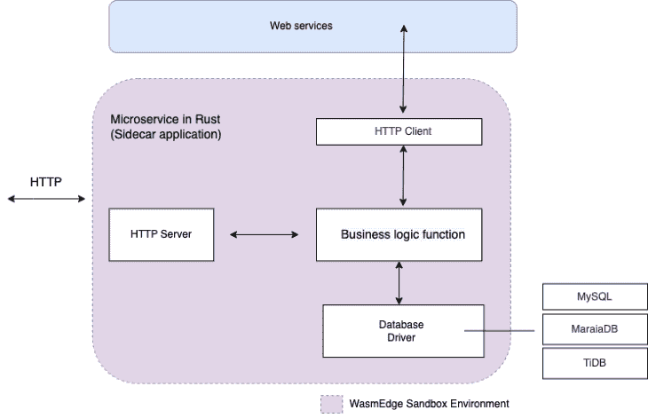
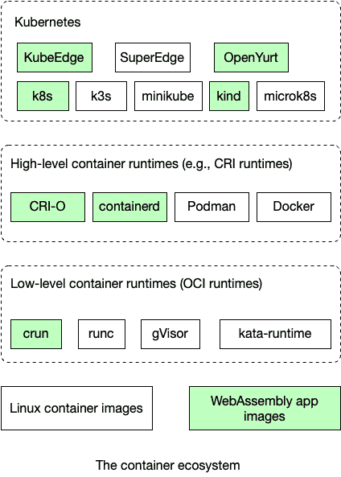

# 信任服务器端 WebAssembly 中的微服务

> 原文：<https://blog.logrocket.com/rust-microservices-server-side-webassembly/>

在过去几年中，Rust 编程语言已经成为主流。它一直被开发者评为最受欢迎的编程语言，并且已经被 T2 纳入 Linux 内核。Rust 使开发人员能够编写正确的、内存安全的程序，这些程序和 C 程序一样快，一样小。它非常适合需要高可靠性和高性能的基础设施软件[，包括服务器端应用](https://blog.logrocket.com/template-rendering-in-rust/)。

然而，对于服务器端应用程序，Rust 也带来了一些挑战。Rust 程序编译成本机代码，不可移植，在多租户云环境下不安全。我们还缺乏工具来管理和协调云中的本地应用程序。

因此，服务器端 Rust 应用程序通常运行在虚拟机或 Linux 容器中，这带来了大量的内存和 CPU 开销。这削弱了 Rust 在效率方面的优势，并使其难以在资源受限的环境中部署服务，如边缘数据中心和边缘云。这个问题的解决方案是 [WebAssembly (Wasm)](https://webassembly.org) 。

Wasm 程序作为 web 浏览器中的安全运行时启动，可以安全地隔离在它们自己的沙箱中。有了新一代 Wasm 运行时，比如 Cloud Native Computing Foundation 的 [WasmEdge 运行时](https://github.com/WasmEdge/WasmEdge)，现在就可以在服务器上运行 Wasm 应用了。可以将 Rust 程序编译成 Wasm 字节码，然后在云端部署 Wasm 应用程序。

根据发表在 IEEE Software 上的[研究，Wasm 应用比 Linux 容器中的本地编译 Rust 应用快 100 倍(特别是在启动时),小 1/100。这使得它们特别适合资源受限的环境，如边缘云。](https://arxiv.org/abs/2010.07115)

Wasm 运行时沙箱的攻击面要小得多，并且提供了比 Linux 容器更好的隔离。此外，Wasm 运行时可以跨操作系统和硬件平台移植。Rust 程序一旦编译成 Wasm，就可以从开发到生产，从云端到边缘的任何地方运行。



The anatomy of a Rust microservice in a WebAssembly sandbox.

在本文中，我们将介绍在 Rust 中构建微服务所需的工具、库、API、框架和技术。我们还将演示如何在 WasmEdge WebAssembly 运行时部署、运行和扩展这些微服务。

*向前跳转:*

## 先决条件

要阅读本文，您应该具备以下条件:

*   微服务设计模式的基础知识
*   Linux 操作系统的基本知识
*   熟悉 Rust 编程语言
*   SQL 数据库的基础知识

## 创建 web 服务

微服务首先是一个 web 服务器。WasmEdge 运行时支持异步和非阻塞网络套接字。你可以用 Rust 编写网络应用，编译成 Wasm，在 WasmEdge 运行时运行。在 Rust 生态系统中，WasmEdge 支持以下内容:

*   用于异步网络应用的 [tokio](https://github.com/WasmEdge/tokio) 和 [mio](https://github.com/WasmEdge/mio) 机箱
*   用于 HTTP 服务器和客户端应用程序的[超级](https://github.com/WasmEdge/hyper)机箱

下面的例子来自于 [microservice-rust-mysql](https://github.com/second-state/microservice-rust-mysql) 演示应用，展示了如何在 [hyper](https://hyper.rs) 中为 WasmEdge 创建一个 web 服务器。web 服务器的主要监听循环如下:

```
    let addr = SocketAddr::from(([0, 0, 0, 0], 8080));
    let make_svc = make_service_fn(|_| {
        let pool = pool.clone();
        async move {
            Ok::<_, Infallible>(service_fn(move |req| {
                let pool = pool.clone();
                handle_request(req, pool)
            }))
        }
    });
    let server = Server::bind(&addr).serve(make_svc);
    if let Err(e) = server.await {
        eprintln!("server error: {}", e);
    }
    Ok(())

```

一旦请求进来，事件处理程序`handle_request(),`就会被异步调用，这样它就可以处理多个并发请求。它根据请求方法和路径生成响应:

```
async fn handle_request(req: Request<Body>, pool: Pool) -> Result<Response<Body>, anyhow::Error> {
    match (req.method(), req.uri().path()) {
        (&Method::GET, "/") => Ok(Response::new(Body::from(
            "... ...",
        ))),

        // Simply echo the body back to the client.
        (&Method::POST, "/echo") => Ok(Response::new(req.into_body())),

        (&Method::GET, "/init") => {
            let mut conn = pool.get_conn().await.unwrap();
            "DROP TABLE IF EXISTS orders;".ignore(&mut conn).await?;
            "CREATE TABLE orders (order_id INT, product_id INT, quantity INT, amount FLOAT, shipping FLOAT, tax FLOAT, shipping_address VARCHAR(20));".ignore(&mut conn).await?;
            drop(conn);
            Ok(Response::new(Body::from("{\"status\":true}")))
        }

        (&Method::POST, "/create_order") => {
            // ... ...
        }

        // Return the 404 Not Found for other routes.
        _ => {
            let mut not_found = Response::default();
            *not_found.status_mut() = StatusCode::NOT_FOUND;
            Ok(not_found)
        }
    }
}

```

现在我们有了一个用于 web 服务的 HTTP 服务器。

## 创建 web 服务客户端

典型的 web 服务还需要消费其他 web 服务。通过 tokio 和/或 mio crates，WasmEdge 应用程序可以轻松地为 web 服务集成 HTTP 客户端。WasmEdge 支持以下防锈板条箱:

*   用于易于使用的 HTTP 客户端的 [reqwest](https://github.com/WasmEdge/reqwest) 机箱
*   用于 http 和 HTTPS 客户端的 [http_req](https://github.com/second-state/http_req) 机箱

以下示例显示了如何从微服务对 web 服务 API 进行 HTTP POST:

```
    let client = reqwest::Client::new();

    let res = client
        .post("http://eu.httpbin.org/post")
        .body("msg=WasmEdge")
        .send()
        .await?;
    let body = res.text().await?;

    println!("POST: {}", body);

```

## 创建数据库客户机

大部分微服务都有数据库做后盾。WasmEdge 支持以下 MySQL 驱动程序的 Rust crates:

*   myql 机箱是一个同步的 MySQL 客户端
*   [mysql_async](https://github.com/WasmEdge/mysql_async_wasi) 是一个异步 mysql 客户端

以下示例显示了如何将一组记录插入到数据库表中:

```
    let orders = vec![
        Order::new(1, 12, 2, 56.0, 15.0, 2.0, String::from("Mataderos 2312")),
        Order::new(2, 15, 3, 256.0, 30.0, 16.0, String::from("1234 NW Bobcat")),
        Order::new(3, 11, 5, 536.0, 50.0, 24.0, String::from("20 Havelock")),
        Order::new(4, 8, 8, 126.0, 20.0, 12.0, String::from("224 Pandan Loop")),
        Order::new(5, 24, 1, 46.0, 10.0, 2.0, String::from("No.10 Jalan Besar")),
    ];

    r"INSERT INTO orders (order_id, production_id, quantity, amount, shipping, tax, shipping_address)
      VALUES (:order_id, :production_id, :quantity, :amount, :shipping, :tax, :shipping_address)"
        .with(orders.iter().map(|order| {
            params! {
                "order_id" => order.order_id,
                "production_id" => order.production_id,
                "quantity" => order.quantity,
                "amount" => order.amount,
                "shipping" => order.shipping,
                "tax" => order.tax,
                "shipping_address" => &order.shipping_address,
            }
        }))
        .batch(&mut conn)
        .await?;

```

以下示例显示了如何查询数据库表并返回记录集合:

```
    let loaded_orders = "SELECT * FROM orders"
        .with(())
        .map(
            &mut conn,
            |(order_id, production_id, quantity, amount, shipping, tax, shipping_address)| {
                Order::new(
                    order_id,
                    production_id,
                    quantity,
                    amount,
                    shipping,
                    tax,
                    shipping_address,
                )
            },
        )
        .await?;
    dbg!(loaded_orders.len());
    dbg!(loaded_orders);

```

## 构建、部署和运行微服务

[微服务-rust-mysql](https://github.com/second-state/microservice-rust-mysql) 项目提供了一个数据库驱动的微服务的完整例子。让我们以它为例来构建、部署和运行这个服务。

Docker CLI 和 Docker Desktop 为 WasmEdge 应用程序开发提供了无缝支持。从项目报告的根目录，您只需要一个命令来构建和启动微服务的所有组件(即 WasmEdge 应用程序和一个 [MariaDB](https://mariadb.org) 数据库服务器):

```
docker compose up

```

然后，您可以使用 curl 通过微服务测试数据库上的 CRUD 操作。

或者，您可以:

以下命令在 Linux 系统上安装上述先决条件:

```
// Install Rust
curl --proto '=https' --tlsv1.2 -sSf https://sh.rustup.rs | sh

// Install WasmEdge
curl -sSf https://raw.githubusercontent.com/WasmEdge/WasmEdge/master/utils/install.sh | bash -s -- -e all

// Install MySQL. It is available as a package in most Linux distros
sudo apt-get update
sudo apt-get -y install mysql-server libmysqlclient-dev
sudo service mysql start

```

接下来，将微服务应用程序构建到 Wasm 字节码中:

```
cargo build --target wasm32-wasi --release

```

然后，在 WasmEdge 运行时启动微服务:

```
wasmedge --env "DATABASE_URL=mysql://user:[email protected]:3306/mysql" order_demo_service.wasm

```

然后，您可以使用微服务的 web API 来访问数据库:

```
// Init the database table
curl http://localhost:8080/init

// Insert a set of records
curl http://localhost:8080/create_orders -X POST -d @orders.json

// Query the records from the database
curl http://localhost:8080/orders

// Update the records
curl http://localhost:8080/update_order -X POST -d @update_order.json

// Delete a record by its id
curl http://localhost:8080/delete_order?id=2

```

## 投入生产

到目前为止，我们已经看到了一个完整的数据库驱动的微服务在运行。然而，在现实世界中，一个公司可能有数百个微服务。它们必须由诸如 Kubernetes 之类的云原生框架来管理和编排。

WasmEdge 应用程序完全符合 OCI 标准。它们可以在 Docker Hub 或其他开放容器倡议存储库中进行管理和存储。通过 [crun 集成](https://opensource.com/article/22/10/wasm-containers)，WasmEdge 可以与 Linux 容器应用在同一个 Kubernetes 集群中并行运行。这个库展示了如何在流行的容器工具链中运行 WasmEdge 应用程序，包括 CRI-O、containerd、Kubernetes、Kind、OpenYurt、KubeEdge 等等。



WebAssembly runtime in the Kubernetes stack.

此外，微服务通常与服务框架一起部署。例如， [Dapr](https://dapr.io) 是一个流行的微服务运行时框架。它为每个微服务提供“边车”服务。微服务通过 Dapr API 访问 sidecar，以发现和调用网络上的其他服务，管理状态数据，并访问消息队列。

用于 WASI 的[Dapr SDK](https://github.com/second-state/dapr-sdk-wasi)( web assembly 系统接口)使基于 WasmEdge 的微服务能够访问其连接的 Dapr 侧柜。[一个完整的演示应用](https://github.com/second-state/dapr-wasm)也可用，它有一个 Jamstack 静态 web 前端、三个微服务和一个数据库服务。

## 结论

在本文中，我们讨论了为什么 WebAssembly 对于基于 Rust 的服务器端应用程序来说是一个很好的运行时沙盒格式。我们通过具体的代码示例演示了如何创建 HTTP web 服务、使用其他 web 服务、从 Rust 访问关系数据库，然后在 WasmEdge 中运行编译后的应用程序。我们还研究了部署问题，比如 Kubernetes 和 Dapr 集成。

有了这些板条箱和模板应用，你将能够在 Rust 中构建你自己的轻量级微服务！

除了微服务之外，WasmEdge 运行时还可以广泛用作许多不同场景中的应用程序沙箱:

*   [flows.network](https://flows.network/) 是 SaaS 自动化的无服务器平台。您可以使用 Rust 和 WebAssembly 为 SaaS 产品创建机器人、定制和连接器
*   您可以为 WebAssembly 中的数据库创建[用户定义函数](https://www.secondstate.io/articles/udf-saas-extension/)(UDF)和提取-转换-加载(ETL)函数，并以“无服务器”的方式将这些函数嵌入数据库或与数据库放在一起
*   你可以使用 WebAssembly 为 edge 设备创建可移植的高性能应用，运行 Android、Open Harmony，甚至是 T2 的 seL4 和 RTOS
*   WebAssembly 被广泛用作区块链执行智能合同的运行时。例如，WasmEdge 为 Polkadot、FileCoin 和 XRP (Ripple)网络运营节点和智能合约。被称为 [ewasm](https://ewasm.readthedocs.io/en/mkdocs/) 的下一代以太坊区块链虚拟机也是基于 WebAssembly 的

要了解 WasmEdge 的更多信息，请参见[官方文档](https://wasmedge.org/book/en/)。

## [log rocket](https://lp.logrocket.com/blg/rust-signup):Rust 应用的 web 前端的全面可见性

调试 Rust 应用程序可能很困难，尤其是当用户遇到难以重现的问题时。如果您对监控和跟踪 Rust 应用程序的性能、自动显示错误、跟踪缓慢的网络请求和加载时间感兴趣，

[try LogRocket](https://lp.logrocket.com/blg/rust-signup)

.

[](https://lp.logrocket.com/blg/rust-signup)

LogRocket 就像是网络和移动应用程序的 DVR，记录你的 Rust 应用程序上发生的一切。您可以汇总并报告问题发生时应用程序的状态，而不是猜测问题发生的原因。LogRocket 还可以监控应用的性能，报告客户端 CPU 负载、客户端内存使用等指标。

现代化调试 Rust 应用的方式— [开始免费监控](https://lp.logrocket.com/blg/rust-signup)。