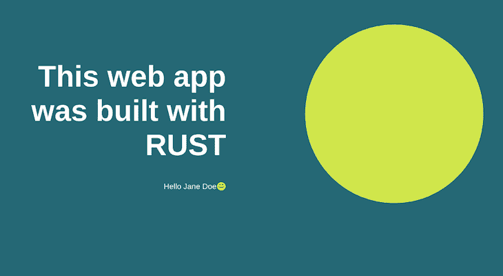

# 使用 Rocket 框架用 Rust 构建 web 应用程序

> 原文：<https://blog.logrocket.com/rust-web-apps-using-rocket-framework/>

## 介绍

Rust 正逐渐成为许多开发人员的首选语言，他们希望更快地构建高效可靠的应用程序，同时仍然保持灵活性和底层控制。有了像 [Rocket](https://rocket.rs/) 这样的 web 框架，web 开发人员可以使用 Rust 构建快速安全的 web 应用程序。

在本文中，我们将通过构建一个简单的 web 应用程序来介绍 Rust for web。虽然这将是一个使用 Rocket 框架构建类型安全、快速、可靠的 web 应用程序的分步指南，但本文还假设您对 Rust 有基本的了解。如果你没有，Rust 编程语言 这本书是让你熟悉这种语言的绝佳资源。

## Rocket web 框架入门

在我们开始之前，让我们通过在我们的终端上运行以下命令来确认我们已经在我们的机器上安装了 rustup:

```
rustup --version
```

如果上述命令导致错误，点击[这里](https://rustup.rs/)查看 rustup 安装说明。Rustup 安装在我们的本地计算机上设置 Rust 和 Cargo，Rust 的包管理器。

## 设置我们的应用程序

安装 rustup 后，我们可以使用 Cargo 创建一个新的 Rust 项目。让我们在终端上运行以下命令:

```
cargo new rocket-web --bin
```

这将创建一个名为 rocket-web 的新 Rust 应用程序。`--bin`标志告诉 Cargo 生成一个基于二进制的项目。

接下来，我们将从终端导航到新的项目目录，并将 Rust nightly 配置为我们的项目工具链:

```
cd rocket-web
rustup override set nightly
```

Rocket 使用 Rust 的不稳定特性，比如它的语法扩展。这就是为什么我们将 Rust 的夜间版本设置为我们的项目工具链。让我们导航到根目录中的`./cargo.toml`文件，并添加`rocket`作为依赖项:

```
[dependencies]
rocket = "0.4.5"
```

要在我们的项目中使用 Rocket，让我们将它导入到`./src/main.rs`文件中:

```
#[macro_use] extern crate rocket;
```

这将从`rocket`箱中导入宏。或者，我们可以使用下面的行:

```
*use rocket::*;*
```

接下来，我们将使用`#![feature()]`标志为我们的火箭项目启用不稳定的`*decl_macro*`特性。在为我们的 web 应用程序创建路线时，我们将需要它。就在`use rocket::*`声明之前，让我们加上这一行:

```
#![feature(decl_macro)]
```

## 创造了我们的第一条火箭路线

现在我们已经设置好了，我们可以开始创建我们的第一条火箭路线。让我们从`rocket::response::content`宏中导入`Json`类型。当我们的路由被调用时，我们将用它来发送响应。在第 4 行的`Json`导入之后，我们的`main.rs`文件应该是这样的:

```
#![feature(decl_macro)]
#[macro_use] extern crate rocket;

use rocket::response::content::Json;

fn main() {
    println!("Hello, world!");
}
```

接下来，让我们将下面的代码块粘贴到`main`函数之前，以创建我们的第一条路线:

```
#[get("/hello")]
fn hello() -> Json<&'static str> {
  Json("{
    'status': 'success',
    'message': 'Hello API!'
  }")
}
```

在上面的代码块中，我们首先使用属性`#get("/hello")]`告诉 Rocket，我们的函数需要一个对`/hello`路线的`GET`请求。接下来，我们将函数命名为`hello()`，并使用`<&'static str>`参数将其返回类型指定为`Json`。

这意味着当一个`GET`请求被发送到我们的`/hello`路由时，它将返回一个带有主体`'status': 'success'`和`'message': 'Hello API!'`的 JSON 响应，这是我们在第 4–6 行添加的。

为了测试我们的新路由，让我们删除`main()`函数中的`println!`语句，并将以下代码粘贴到其中:

```
rocket::ignite()
  .mount("/api", routes![hello])
  .launch();
```

这使用来自`rocket`箱的`ignite()`方法创建一个新的 Rocket 实例，然后用`mount()`方法和基本路径`/api`挂载我们的`hello`路径。最后，我们使用`launch()`方法启动应用服务器并监听请求。

我们现在可以在终端上运行`cargo build`来编译我们的 Rocket 应用程序。对此我们应该得到类似的回应:

```
cargo build
    Finished dev [unoptimized + debuginfo] target(s) in 0.25s
```

接下来，让我们运行命令`cargo run`启动我们的应用程序。对此我们应该得到类似的回应:

```
cargo run
    Finished dev [unoptimized + debuginfo] target(s) in 0.24s      
     Running `target\debug\rust_rocket.exe`
�👾 Configured for development
    => address: localhost
    => port: 8000
    => log: normal
    => workers: 8
    => secret key: generated
    => limits: forms = 32KiB
    => keep-alive: 5s
    => tls: disabled
🚀   Mounting /api:
    => GET /api/hello (hello)
��� Rocket has launched from http://localhost:8000
```

最后，我们可以通过在浏览器或 API 客户端上导航到`[http://localhost:8000/api/hello](http://localhost:8000/api/hello)`来测试我们的应用程序和路由。我们应该会收到以下响应:

```
{
    'status': 'success',
    'message': 'Hello API!'
}
```

## 用 Rocket 处理 POST 请求

我们已经成功发布了我们的第一个火箭 API，但这仅仅是个开始。除了返回 JSON 响应，Rocket 还允许我们返回其他类型，如`String`、`Status`和`Template`。火箭文档在解释不同的返回和响应类型方面做得很好。

我们将很快看到如何使用 Rocket 来呈现 HTML，但在此之前，让我们看看在 Rocket 中创建一条`POST`路线是什么样的。我们将使用我们的`POST`路由向一个虚拟数据库添加图书信息。

Rocket 支持 MySQL、Postgres、SQLite、Redis 和 MongoDB 等数据库。你可以在这里阅读更多关于数据库选项[的信息。在这个演示中，我们将使用一个向量来创建虚拟数据库。](https://rocket.rs/v0.4/guide/state/#databases)

首先，让我们定义当用户向我们的 book route 发送请求时，我们期望从用户那里得到什么类型的信息。为此，我们将使用一个名为`Book`的结构。就在我们创建的`hello()`路由之前，让我们定义我们的新结构:

```
struct Book {
  title: String,
  author: String,
  isbn: String
}
```

接下来，让我们用下面几行代码创建我们的`POST`路线:

```
#[post("/book", data = "<book_form>")]
fn new_book(book_form: Book) -> String {
}
```

这一次，我们添加了 Rocket 在监视请求时应该期望的数据类型，作为 route 属性`#[post()]`的第二个参数。我们继续在我们的`new_book()`函数参数中为`book_form`提供类型，并将我们的函数返回类型定义为`String`。如果我们尝试编译它，我们应该会得到类似下面的错误消息:

```
the trait bound `Book: rocket::data::FromDataSimple` is not satisfied
```

为了解决这个问题，让我们将下面一行添加到文件顶部的导入语句中，以导入`Form`类型:

```
use rocket::request::Form;
```

接下来，我们将把`#[derive(FromForm)]`属性添加到我们的`Book`结构中。我们的结构声明现在应该如下所示:

```
#[derive(FromForm)]
struct Book {
  title: String,
  author: String,
  isbn: String
}
```

现在，我们可以通过将我们作为`new_book()`函数参数提供的`book_form`类型与我们刚刚导入的`Form`类型包装在一起来实现`[FromData]`特征:

```
#[post("/book", data = "<book_form>")]
fn new_book(book_form: Form<Book>) -> String {
}
```

接下来，我们将告诉我们的路由无论何时被调用都要做什么。就在我们的`new_book()`函数中，让我们粘贴以下代码:

```
let book: Book = book_form.into_inner();
let *mut* dummy_db: Vec<Book> = Vec::new();
dummy_db.push(book);
format!("Book added successfully: {:?}", dummy_db)
```

在上面的块中，我们使用`book_form.into_inner()`方法从我们的用户那里获得请求体，然后我们将我们的虚拟数据库定义为一个类型为`Book`的向量，并使用`dummy_db.push(book)`表达式将我们从用户那里收到的数据推送到它那里。

最后，我们返回了字符串`"Book added successfully: {**:**?}", dummy_db)`。我们为此使用了`format!`方法，因为我们将向量`dummy_db`添加到了字符串响应中。让我们也在我们的`Book`结构属性中添加`Debug`标志来实现这一点:

```
#[derive(FromForm, Debug)]
struct Book {
  ...
}
```

接下来，我们将把新的`POST`路线添加到我们的`main()`函数中的`/api`路径中:

```
rocket::ignite()
  .mount("/api", routes![hello])
  .launch();
```

现在，我们可以使用`cargo build`重新构建我们的应用程序，并使用`cargo run`运行它来测试我们的`POST`路线。我们可以使用`cargo-watch`来编译和运行我们的应用程序，这样我们就不必每次修改应用程序时都重新构建。让我们通过在终端上运行以下命令来安装和使用`cargo-watch`:

```
cargo install cargo-watch
cargo watch -x run
```

## 用火箭处理 404 条路线

让我们为不存在的路由创建一个处理 404 响应的新路由。我们将我们的路由命名为`not_found`,每当用户请求一条不存在的路由时就调用它。让我们将下面的代码块粘贴到`main`函数之前:

```
#[catch(404)]
fn not_found(req: &Request) -> String {
    format!("Oh no! We couldn't find the requested path '{}'", req.uri())
}
```

在上面的代码块中，我们首先使用`#[catch(404)]`属性告诉 Rocket 在调用这个路由时返回 404 错误。然后我们定义了我们的`not_found()`函数，为它提供了一个类型为`Request`的`req`参数，并为它的返回类型指定了`String`。最后，我们返回了错误消息，并使用`req.uri()`方法包含了请求的路径。

在我们继续之前，让我们通过向我们的导入语句添加以下行来导入我们刚刚在`not_found`路由中使用的`Request`类型:

```
use rocket::Request;
```

我们的导入现在应该是这样的:

```
use rocket::Request;
use rocket::response::content::Json;
use rocket::request::Form;
```

接下来，让我们将`main()`函数中的`Rocket`实例修改为:

```
rocket::ignite()
  .register(catchers![not_found])
  .mount("/api", routes![hello])
  .launch();
```

我们在 Rocket 实例中通过`catchers!`宏用我们的`not_found`路线调用了`register()`方法。为了测试我们的`not_found`路线，让我们导航到一个从我们的浏览器或 API 客户端不存在的路径。例如，当我们导航到`localhost:8000/api/nothingness`时，我们应该得到以下响应:

```
Oh no! We couldn't find the requested path '/api/nothingness'
```

## 使用 Rocket 渲染 HTML 模板

让我们探索用 Rocket 渲染 HTML 模板。我们将开始创建一个新的属性为`#[get("/")]`的`GET`路线，就在我们之前创建的`hello`路线之前:

```
#[get("/")]
fn index() -> Template {
}
```

我们将在应用程序的登录页面中使用这个新路径。注意，我们将函数命名为`index`，这一次，函数的返回类型是`Template`。让我们通过在导入语句中添加下面一行来导入`Template`类型:

```
use rocket_contrib::templates::Template;
```

接下来，我们将在`./cargo.toml`文件中包含以下代码，就在 dependencies 部分之后:

```
[dependencies.rocket_contrib]
version = "0.4.5"
features = ["handlebars_templates"]
```

这增加了在我们的应用程序中渲染`handlebars_templates`引擎的支持。Rocket 也支持[万亿次模板引擎](https://tera.netlify.app/docs/)。我们可以通过替换特性中的`handlebars_templates`或者像这样添加来包含:

```
features = ["handlebars_templates", "tera_templates"]
```

现在，我们可以在项目的根目录下创建`./templates`文件夹。默认情况下，Rocket 会在这里查找我们的模板文件。让我们在`./templates`目录下创建一个新文件`home.hbs`，并将以下代码粘贴到其中:

```
<head>
  <style type="text/css">
    body {
      background: #1a6875;
      font-family: Arial, Helvetica, sans-serif;
    }
    .left-side {
      max-width: 45%;
      text-align: right;
      position: absolute;
      top: 15%;
      left: 0;
    }
    .title {
      color: #fff;
      font-size: 5em;
    }
    .sub-title {
      color: #fff;
      font-size: 1.3em;
    }
    .right-side {
      width: 30em;
      height: 30em;
      background: #d0e64c;
      border-radius: 50%;
      position: absolute;
      top: 10%;
      right: 5%;
    }
  </style>
</head>
<body>
  <div class="left-side">
    <h1 class="title">This web app was built with RUST</h1>
    <p class="sub-title">Hello {{first_name}} {{last_name}}😊</p>
  </div>
  <div class="right-side">
    <div class="round-image"></div>
  </div>
</body>
```

如果你不熟悉手柄模板语言，你可以点击这里的[查看他们的文档。它非常类似于普通的 HTML 代码。如果你注意到，在我们的`<body>`标签和`left-side` div 中，我们有一个包含`Hello {{first_name}} {{last_name}}😊`的`sub-title`类的段落。我们将在呈现我们的`home.hbs`文件时提供这些变量。](https://handlebarsjs.com/guide/#what-is-handlebars)

让我们回到`./src/main.rs`文件中的索引路径。在函数内部，我们将创建一个名为`Context`的结构，并使用 [Serde](https://serde.rs/) 在我们的结构上实现 Serialize。我们的结构将定义模板文件需要的变量类型:

```
#[derive(Serialize)]
struct Context {
  first_name: String,
  last_name: String
}
```

我们还将导入刚刚用于我们的`Context`结构的`Serialize`类型:

```
use serde::Serialize;
```

我们的导入语句现在应该是这样的:

```
use rocket::Request;
use rocket::response::content::Json;
use rocket::request::Form;
use rocket_contrib::templates::Template;
use serde::Serialize;
```

接下来，让我们将它添加到`cargo.toml`文件中的依赖项中:

```
[dependencies]
rocket = "0.4.5"
serde = { version = "1.0", features = ["derive"] }
```

回到我们的`./src/main.rs`文件——在`index()`函数中，我们将声明一个名为`context`的新变量，并使用我们之前创建的`Context`类型为其提供值:

```
let context = Context {
  first_name: String::from("Jane"),
  last_name: String::from("Doe")
};
```

现在我们已经添加了在`home.hbs`文件中使用的值，让我们返回包含我们刚刚创建的数据的模板:

```
Template::render("home", context)
```

完成后，我们的索引路径应该如下所示:

```
#[get("/")]
fn index() -> Template {
  #[derive(Serialize)]
  struct Context {
    first_name: String,
    last_name: String
  }
  let context = Context {
    first_name: String::from("Ebenezer"),
    last_name: String::from("Don")
  };
  Template::render("home", context)
}
```

为了使我们的模板可呈现，我们需要注册它。为此，我们将在带有`.attach(Template::fairing())`的火箭实例上附加`Template::fairing()`方法，然后安装我们的`index`路径，并使用`"/"`作为其基础。完成后，我们的`main()`函数应该是这样的:

```
fn main() {
  rocket::ignite()
    .register(catchers![not_found])
    .mount("/", routes![index])
    .mount("/api", routes![hello, new_book])
    .attach(Template::fairing())
    .launch();
}
```

请注意，我们将`index`与`hello`和`new_book`路线分开。因为这是我们的登陆页面，我们使用不同的`base`路径`"/"`，所以我们只需要导航到`localhost:8000`就可以看到我们的渲染模板。

我们的`./src/main.rs`文件现在应该是这样的:

```
#![feature(decl_macro)]
#[macro_use] extern crate rocket;
use rocket::Request;
use rocket::response::content::Json;
use rocket::request::Form;
use rocket_contrib::templates::Template;
use serde::Serialize;

#[derive(FromForm, Debug)]
struct Book {
  title: String,
  author: String,
  isbn: String
}

#[get("/")]
fn index() -> Template {
  #[derive(Serialize)]
  struct Context {
    first_name: String,
    last_name: String
  }
  let context = Context {
    first_name: String::from("Jane"),
    last_name: String::from("Doe")
  };
  Template::render("home", context)
}

#[get("/hello")]
fn hello() -> Json<&'static str> {
  Json("{
    'status': 'success',
    'message': 'Hello API!'
  }")
}

#[catch(404)]
fn not_found(req: &Request) -> String {
    print!("{}", req);
    format!("Oh no! We couldn't find the requested path '{}'", req.uri())
}

#[post("/book", data = "<book_form>")]
fn new_book(book_form: Form<Book>) -> String {
  let book: Book = book_form.into_inner();
  let *mut* dummy_db: Vec<Book> = Vec::new();
  dummy_db.push(book);
  format!("Book added successfully: {:?}", dummy_db)
}

fn main() {
  rocket::ignite()
    .register(catchers![not_found])
    .mount("/", routes![index])
    .mount("/api", routes![hello, new_book])
    .attach(Template::fairing())
    .launch();
}
```

现在，当我们运行我们的应用程序并导航到`localhost:8000`时，我们应该在浏览器上看到一个与此类似的页面:



## 结论

在本文中，我们已经通过 Rocket 框架为 web 引入了 Rust。我们讲述了 Rocket 的基础知识，如何设置 web APIs、响应类型、错误处理以及通过 Handlebars 模板引擎呈现 HTML。

虽然 Rocket 非常适合构建 web APIs，但它可能不是处理前端呈现的最佳选择，就像我们在本文的最后一部分所做的那样。然而，Rust 通过 [Yew framework](https://yew.rs/docs/) 在这一领域大放异彩，该框架是为使用 WebAssembly 创建多线程前端 web 应用而构建的。

总的来说，与其他 web 框架相比，Rocket 使得编写 web 应用程序的速度相对较快，而且它只用了很少的样板代码。这是我们演示应用的 GitHub repo 的[链接。](https://github.com/ebenezerdon/rust_rocket)

## [log rocket](https://lp.logrocket.com/blg/rust-signup):Rust 应用的 web 前端的全面可见性

调试 Rust 应用程序可能很困难，尤其是当用户遇到难以重现的问题时。如果您对监控和跟踪 Rust 应用程序的性能、自动显示错误、跟踪缓慢的网络请求和加载时间感兴趣，

[try LogRocket](https://lp.logrocket.com/blg/rust-signup)

.

[](https://lp.logrocket.com/blg/rust-signup)

LogRocket 就像是网络和移动应用程序的 DVR，记录你的 Rust 应用程序上发生的一切。您可以汇总并报告问题发生时应用程序的状态，而不是猜测问题发生的原因。LogRocket 还可以监控应用的性能，报告客户端 CPU 负载、客户端内存使用等指标。

现代化调试 Rust 应用的方式— [开始免费监控](https://lp.logrocket.com/blg/rust-signup)。