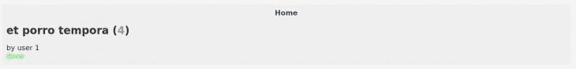
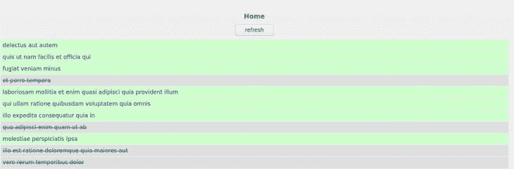

# 使用 Yew 构建 Rust + WebAssembly 前端 web 应用程序

> 原文：<https://blog.logrocket.com/rust-webassembly-frontend-web-app-yew/>

虽然 Rust 以其后端 web 开发能力而闻名，但 WebAssembly (Wasm)的出现使得在 Rust 中构建丰富的前端应用成为可能。

对于那些渴望探索 Rust 开发前端的人，我们将学习如何使用 Yew web 框架构建一个非常基本的前端 web 应用程序。

如果您熟悉 React 或其他 JavaScript 前端框架，您会觉得使用 Yew 很舒服；它使用与 JSX 类似的语法和应用程序结构。

为了展示 Rust 和 Yew 的互操作性，我们的前端应用程序将包含一个简单的待办事项列表(原创，我知道！)使用 JSONPlaceholder 作为获取数据的后端。该列表将提供一个列表视图，每个待办事项选项的详细视图，以及一个刷新数据的选项。

然而，值得注意的是，Wasm 生态系统和 Yew 仍然处于开发的早期阶段，因此，尽管本教程在今天是准确的，但 Wasm 和 Yew 的一些功能在未来可能会发生变化。这可能会稍微影响设置和库生态系统，但我们仍然可以使用这个堆栈构建真正的 Rust 应用程序。

现在，让我们开始吧！

## 设置 web 应用程序

确保 [Rust](https://blog.logrocket.com/why-is-rust-popular/) 1.50 或更高和 [Trunk](https://github.com/thedodd/trunk#install) 都已安装。Trunk 是一个用于基于 Rust 的 [Wasm](https://webassembly.org/) 应用程序的构建和管道工具，它提供了一个本地开发服务器，自动文件监视，并简化了向 Wasm 发送 Rust 代码。

要了解如何使用 [Yew 框架](https://blog.logrocket.com/the-current-state-of-rust-web-frameworks/)开发应用程序，请查阅 [Yew 文档](https://yew.rs/)。

### 创建 Rust 项目

让我们从创建一个新的 Rust 项目开始，如下所示:

```
cargo new --lib rust-frontend-example-yew
cd rust-frontend-example-yew

```

用下面的代码添加所需的依赖项来编辑`Cargo.toml`文件:

```
[dependencies]
yew = "0.18"
wasm-bindgen = "0.2.67"
serde = "1"
serde_derive = "1"
serde_json = "1"
anyhow = "1"
yew-router = "0.15.0"

```

通过添加`Yew`和`Yew-Router`，我们可以开始在 Yew 框架内工作。我们还添加了用于基本错误处理的`anyhow`，用于 JSON 的`serde`，以及用于 Rust 的 JavaScript 的 [`[wasm-bindgen]`](https://github.com/rustwasm/wasm-bindgen) 。

设置完成后，让我们开始构建。

### 带主干的 HTML 设置

因为我们正在构建一个前端 web 应用程序，所以我们需要一个 HTML 基础。使用`Trunk`，我们可以在我们的项目根中创建一个最小的`index.html`,如下所示:

```
<html>
  <head>
    <title>Rust Frontend Example with Yew</title>
    <style>
        body {
            font-size: 14px;
            font-family: sans-serif;
        }
        a {
            text-decoration: none;
            color: #339;
        }
        a:hover {
            text-decoration: none;
            color: #33f;
        }
        .todo {
            background-color: #efefef;
            margin: 100px 25% 25% 25%;
            width: 50%;
            padding: 10px;
        }
        .todo .nav {
            text-align: center;
            font-size: 16px;
            font-weight: bold;
        }
        .todo .refresh {
            text-align: center;
            margin: 10px 0 10px 0;
        }
        .todo .list .list-item {
            margin: 2px;
            padding: 5px;
            background-color: #cfc;
        }
        .todo .list .completed {
            text-decoration: line-through;
            background-color: #dedede;
        }
        .detail {
            font-size: 16px;
        }
        .detail h1 {
            font-size: 24px;
        }
        .detail .id {
            color: #999;
        }
        .detail .completed {
            color: #3f3;
        }
        .detail .not-completed {
            color: #f33;
        }
    </style>
  </head>
</html>

```

通过一个最小的 HTML 框架和一些非常基本的 CSS，Trunk 创建了注入了`body`的`dist/index.html`，为我们的 Wasm 应用程序保留了入口点。

打开`src/lib.rs`文件，我们现在可以为我们的 [Yew](https://github.com/yewstack/yew) web 应用程序创建基础。

### 用基本布线设置`TodoApp`

通过实现基本的路由，我们可以从高级路由定义一直到实际的路由实现。

首先，让我们为`TodoApp`创建一个类型:

```
struct TodoApp {
    link: ComponentLink<Self>,
    todos: Option<Vec<Todo>>,
    fetch_task: Option<FetchTask>,
}

#[derive(Deserialize, Clone, PartialEq, Debug)]
#[serde(rename_all = "camelCase")]
pub struct Todo {
    pub user_id: u64,
    pub id: u64,
    pub title: String,
    pub completed: bool,
}

```

这个结构包括在这个组件中注册回调的`link`。我们还将使用`Option<Vec<Todo>>`和`fetch_task`定义一个可选的待办事项列表来获取数据。

要创建一个根组件作为入口点，我们必须实现`Component`特征:

```
enum Msg {
    MakeReq,
    Resp(Result<Vec<Todo>, anyhow::Error>),
}

impl Component for TodoApp {
    type Message = Msg;
    type Properties = ();
    fn create(_: Self::Properties, link: ComponentLink<Self>) -> Self {
        Self {
            link,
            todos: None,
            fetch_task: None,
        }
    }

    fn update(&mut self, msg: Self::Message) -> ShouldRender {
        true
    }

    fn change(&mut self, _props: Self::Properties) -> ShouldRender {
        false
    }

    fn view(&self) -> Html {
        html! {
            <div class=classes!("todo")>
                ...
            </div>
        }
    }
}

```

通过定义`Msg`结构，即组件的`Message`的类型，我们可以编排组件内部的消息传递。在我们的例子中，我们将定义`MakeReq`消息和`Resp`消息来发出 HTTP 请求并接收响应。

稍后，我们将使用这些状态来构建一个状态机，告诉我们的应用程序在触发请求和响应到达时如何做出反应。

特性定义了六个生命周期功能:

*   `create`是一个接受道具和`ComponentLink`的构造函数
*   `view`渲染组件
*   当一个`Message`被发送到组件时，调用`update`，实现消息传递逻辑
*   `change`重新渲染更改，优化渲染速度
*   `rendered`在`view`之后但在浏览器更新之前被调用一次，以区分第一次渲染和连续渲染
*   当组件被卸载并且需要清理操作时，调用`destroy`

由于我们的根组件没有任何道具，我们可以让`change`返回 false。

我们还不会在`update`中实现任何东西，所以我们将定义组件必须在`Message`到来时重新呈现。

在`view`中，我们将使用`html!`宏构建一个基本的外部`div`和`classes!`宏为其创建 HTML 类，我们将在后面实现。

要呈现该组件，我们需要以下代码片段:

```
#[wasm_bindgen(start)]
pub fn run_app() {
    App::<TodoApp>::new().mount_to_body();
}

```

这个代码片段使用了`wasm-bindgen`并将这个函数定义为我们的入口点，将`TodoApp`组件作为根安装在主体中。

## 获取数据

很好，现在基础已经就绪，让我们看看如何获取一些数据。

* * *

### 更多来自 LogRocket 的精彩文章:

* * *

我们将从更改`create`生命周期方法开始，在创建组件以立即获取数据时发送一条`MakeReq`消息:

```
    fn create(_: Self::Properties, link: ComponentLink<Self>) -> Self {
        link.send_message(Msg::MakeReq);
        Self {
            link,
            todos: None,
            fetch_task: None,
        }
    }

```

然后，我们实现`update`:

```
    fn update(&mut self, msg: Self::Message) -> ShouldRender {
        match msg {
            Msg::MakeReq => {
                self.todos = None;
                let req = Request::get("https://jsonplaceholder.typicode.com/todos")
                    .body(Nothing)
                    .expect("can make req to jsonplaceholder");

                let cb = self.link.callback(
                    |response: Response<Json<Result<Vec<Todo>, anyhow::Error>>>| {
                        let Json(data) = response.into_body();
                        Msg::Resp(data)
                    },
                );

                let task = FetchService::fetch(req, cb).expect("can create task");
                self.fetch_task = Some(task);
                ()
            }
            Msg::Resp(resp) => {
                if let Ok(data) = resp {
                    self.todos = Some(data);
                }
            }
        }
        true
    }

```

这是相当多的代码，所以让我们一步一步来理解它。

Yew 提供了[服务](https://docs.rs/yew/0.2.0/yew/services/index.html)，这些服务是为日志记录或使用 HTTP`fetch()`(JavaScript`fetch()`)之类的事情预先构建的抽象。

在我们的代码中，我们可以将`self.todos`设置为`None`，当我们获取数据时，数据总是会重置。通过添加`FetchService`，我们创建了一个对 [JSONPlaceholder](http://jsonplaceholder.typicode.com/) 的 HTTP `GET`请求。

定义一个回调解析对 JSONPlaceholder 的响应，并发送一个带有返回数据的`Msg::Resp`消息。

当我们用请求和回调来启动准备好的`fetch()`调用时，我们还将组件的`fetch_task`设置为返回的`FetchService::fetch`任务，以保持`fetch-task`活动。

处理响应很简单:如果一个`Msg::Resp`进来，我们可以检查是否有数据。如果有数据，我们可以将`self.todos`设置为该数据。

这也是我们可以做一些错误处理的地方，如果请求失败或者数据无效，我们可以设置一个错误消息来显示。

最后，我们必须使用`view`方法显示新获取的数据:

```
    fn view(&self) -> Html {
        let todos = self.todos.clone();
        let cb = self.link.callback(|_| Msg::MakeReq);
        ConsoleService::info(&format!("render TodoApp: {:?}", todos));
        html! {
            <div class=classes!("todo")>
              <div>
                  <div class=classes!("refresh")>
                      <button onclick=cb.clone()>
                          { "refresh" }
                      </button>
                  </div>
                  <todo::list::List todos=todos.clone()/>
              </div>
            </div>
        }
    }

```

通过获取待办事项并使用`ConsoleService`，我们可以在每次呈现该组件时记录它们，这对调试很有用。

创建一个简单的带有`onclick`处理程序的`refresh`按钮可以让我们调用我们的数据获取管道，允许我们从`html!`标记中调用动作。

将待办事项传递给`todo::list::List`组件，我们可以在 web 应用程序中显示待办事项。

## 添加`List`组件

要开始构建我们的`List`组件，我们必须创建一个`todo`文件夹，其中的`mod.rs`包含`pub mod list`和`list.rs`文件。

在`list.rs`中，我们必须以实现`TodoApp`的相同方式实现`List`组件:

```
#[derive(Properties, Clone, PartialEq)]
pub struct Props {
    pub todos: Option<Vec<Todo>>,
}

pub struct List {
    props: Props,
}

pub enum Msg {}

impl Component for List {
    type Properties = Props;
    type Message = Msg;

    fn create(props: Self::Properties, _link: ComponentLink<Self>) -> Self {
        Self { props }
    }

    fn view(&self) -> Html {
        html! {
            <div>
                { self.render_list(&self.props.todos)}
            </div>
        }
    }

    fn update(&mut self, _msg: Self::Message) -> ShouldRender {
        true
    }

    fn change(&mut self, props: Self::Properties) -> ShouldRender {
        self.props = props;
        true
    }
}

```

通过为`list`组件的 props 定义`List`结构，我们可以包含待办事项列表。然后，我们实现了`Component`特征。

每当有道具变化进来的时候，我们都要设置好道具，重新渲染。因为我们没有任何消息传递，所以我们可以忽略`Msg`结构和`update`函数。

在`view`中，让我们创建一个`div`来调用`self.render_list`。

我们可以在`List`本身中实现这种渲染:

```
impl List {
    fn render_list(&self, todos: &Option<Vec<Todo>>) -> Html {
        if let Some(t) = todos {
            html! {
                <div class=classes!("list")>
                    { t.iter().map(|todo| self.view_todo(todo)).collect::<Html>() }
                </div>
            }
        } else {
            html! {
                <div class=classes!("loading")>{"loading..."}</div>
            }
        }
    }

    fn view_todo(&self, todo: &Todo) -> Html {
        let completed = if todo.completed {
            Some("completed")
        } else {
            None
        };
        html! {
            <div class=classes!("list-item", completed)>
                { &todo.title }
            </div>
        }
    }
}

```

如果我们在`render_list`中没有任何待办事项，我们可以在浏览器中显示 **loading…** ,以指示正在获取数据。

如果数据已经存在，我们可以使用 Yew 的表达式语法在`html!`中迭代待办事项列表。分别调用`view_todo`并收集到`Html`在`html!`内渲染。

当待办事项在浏览器中被标记为完成时，我们还通过在`view_todo`中将它们设置为`completed`来为我们的应用程序添加条件样式；如果它们没有被标记为完成，则不会应用 CSS 样式。

要为每个待办事项创建标题，我们只需在每个待办事项的标记中创建一个`div`来包含相应的标题。

下一步是使这个标题成为一个链接，这样我们就可以从列表视图切换到详细视图。但为此，我们必须首先在我们的应用程序中设置导航，也称为路由。

## 使用 Yew 的基本应用程序路由

为了给我们的应用程序创建基本的路由，我们将使用`Yew-router`。

在`Switch`特征和`pub`枚举中，我们可以定义我们在`AppRoute`的路线:

```
#[derive(Switch, Clone, Debug)]
pub enum AppRoute {
    #[to = "/todo/{id}"]
    Detail(i32),
    #[to = "/"]
    Home,
}

```

在这个枚举中定义`Detail`路线需要一个在`/todo/$id`的待办事项 ID 和`Home`路线，这是我们的列表视图。

现在，我们必须修改我们的`view`方法，以包含以下路由机制:

```
    fn view(&self) -> Html {
        let todos = self.todos.clone();
        let cb = self.link.callback(|_| Msg::MakeReq);
        ConsoleService::info(&format!("render TodoApp: {:?}", todos));
        html! {
            <div class=classes!("todo")>
                <div class=classes!("nav")>
                    <Anchor route=AppRoute::Home>{"Home"}</Anchor>
                </div>
                <div class=classes!("content")>
                    <Router<AppRoute, ()>
                        render = Router::render(move |switch: AppRoute| {
                            match switch {
                                AppRoute::Detail(todo_id) => {
                                    html! {
                                        <div>
                                            <todo::detail::Detail todo_id=todo_id/>
                                        </div>}
                                }
                                AppRoute::Home => {
                                    html! {
                                        <div>
                                            <div class=classes!("refresh")>
                                                <button onclick=cb.clone()>
                                                    { "refresh" }
                                                </button>
                                            </div>
                                            <todo::list::List todos=todos.clone()/>
                                        </div>
                                    }
                                }
                            }
                        })
                    />
                </div>
            </div>
        }
    }

```

在我们的列表上方，我们可以创建一个导航`div`，其中包含一个返回到`Home`的链接，这样我们就可以随时返回。

在此之下，我们可以定义一个包含一个`Router<AppRoute,()>`的内容`div`。在这个路由器中，我们可以定义一个`render`函数，告诉路由器基于当前的路径呈现什么。

在`render`方法中，我们可以打开给定的`AppRoute`，在`Home`和`Detail`上显示待办事项列表，在`Home`上显示`refresh`按钮。

最后，我们必须修改`list.rs`中的`view_todo`函数，以包含一个到待办事项详细页面的链接:

```
    fn view_todo(&self, todo: &Todo) -> Html {
        let completed = if todo.completed {
            Some("completed")
        } else {
            None
        };
        html! {
            <div class=classes!("list-item", completed)>
                <Anchor route=AppRoute::Detail(todo.id as i32)>
                    { &todo.title }
                </Anchor>
            </div>
        }
    }

```

为此，我们将使用`Yew-router`的`Anchor`组件。这个方便的机制让我们可以使用`AppRoute`枚举在应用程序内部进行路由，消除了类型错误的可能性。这意味着我们对路由进行了编译器级别的类型检查。非常酷！

为了完成我们的应用程序，让我们实现单个待办事项的详细视图。

## 实现详细视图

要开始实现我们应用程序的待办事项详细视图，打开`todo`文件夹，将`pub mod detail;`添加到`mod.rs`，并添加一个`detail.rs`文件。

现在我们可以实现另一个组件。然而，为了使它更有趣，我们将(在本例中没有必要)实现一些数据获取。因为我们只将待办事项的 ID 传递给详细视图，所以我们必须在详细视图中重新提取待办事项的数据。

虽然在我们的例子中使用这个特性没有提供太多的价值，但是具有多个数据源、大型产品列表和丰富的详细信息页面的 web 商店可以从数据获取的效率中受益。

同样，从基础开始，我们将添加以下内容:

```
#[derive(Properties, Clone, PartialEq)]
pub struct Props {
    pub todo_id: i32,
}

pub struct Detail {
    props: Props,
    link: ComponentLink<Self>,
    todo: Option<Todo>,
    fetch_task: Option<FetchTask>,
}

pub enum Msg {
    MakeReq(i32),
    Resp(Result<Todo, anyhow::Error>),
}

```

组件的`Detail`结构包括获取数据的`link`和`fetch_task`以及保存待办事项 ID 的道具。

`Component`特征的实现类似于我们的`TodoApp`组件:

```
impl Component for Detail {
    type Properties = Props;
    type Message = Msg;

    fn create(props: Self::Properties, link: ComponentLink<Self>) -> Self {
        link.send_message(Msg::MakeReq(props.todo_id));
        Self {
            props,
            link,
            todo: None,
            fetch_task: None,
        }
    }

    fn view(&self) -> Html {
        html! {
            <div>
                { self.render_detail(&self.todo)}
            </div>
        }
    }

    fn update(&mut self, msg: Self::Message) -> ShouldRender {
        match msg {
            Msg::MakeReq(id) => {
                let req = Request::get(&format!(
                    "https://jsonplaceholder.typicode.com/todos/{}",
                    id
                ))
                .body(Nothing)
                .expect("can make req to jsonplaceholder");

                let cb =
                    self.link
                        .callback(|response: Response<Json<Result<Todo, anyhow::Error>>>| {
                            let Json(data) = response.into_body();
                            Msg::Resp(data)
                        });

                let task = FetchService::fetch(req, cb).expect("can create task");
                self.fetch_task = Some(task);
                ()
            }
            Msg::Resp(resp) => {
                if let Ok(data) = resp {
                    self.todo = Some(data);
                }
            }
        }
        true
    }

    fn change(&mut self, props: Self::Properties) -> ShouldRender {
        self.props = props;
        true
    }
}

```

同样，使用`FetchService`从`/todos/$todo_id`获取数据，我们可以在组件中设置返回的数据。

在这种情况下，让我们直接在`Detail`上实现`render_detail`方法:

```
impl Detail {
    fn render_detail(&self, todo: &Option<Todo>) -> Html {
        match todo {
            Some(t) => {
                let completed = if t.completed {
                    Some("completed")
                } else {
                    Some("not-completed")
                };
                html! {
                    <div class=classes!("detail")>
                        <h1>{&t.title}{" ("}<span class=classes!("id")>{t.id}</span>{")"}</h1>
                        <div>{"by user "}{t.user_id}</div>
                        <div class=classes!(completed)>{if t.completed { "done" } else { "not done" }}</div>
                    </div>
                }
            }
            None => {
                html! {
                    <div class=classes!("loading")>{"loading..."}</div>
                }
            }
        }
    }
}

```

同样，如果我们还没有数据，我们显示一个简单的**加载…** 消息。基于我们正在处理的待办事项中的`completed`状态，我们可以设置一个不同的类来将文本颜色设置为绿色(如果已完成)或红色(如果未完成),就像在浏览器中看到的那样。



The detailed view for a completed to-do item


The detailed view for an open to-do item

## 运行最终 Rust 项目

当我们在本地使用`trunk serve`运行我们的项目时，一个服务器在 [http://localhost:8080](http://localhost:8080) 上启动；我们现在知道一个漂亮的，基于 Rust 的前端 web 应用程序。



The list view

点击一个待办事项会将我们带到它的详细信息页面，点击**主页**会将我们带回列表视图。

随着待办事项应用的完成，你可以在 [GitHub](https://github.com/zupzup/rust-frontend-example-yew) 上找到这个例子的完整代码。

## 结论

WebAssembly 的出现使得用 Rust 构建前端 web 应用成为可能，就像我们刚刚构建的那样，为开发者拓展了开发机会。

虽然本文中的所有库、框架和技术都还处于开发的早期阶段，但是可用的特性和功能已经成熟和稳定，为将来更大的项目开辟了可能性。

## [log rocket](https://lp.logrocket.com/blg/rust-signup):Rust 应用的 web 前端的全面可见性

调试 Rust 应用程序可能很困难，尤其是当用户遇到难以重现的问题时。如果您对监控和跟踪 Rust 应用程序的性能、自动显示错误、跟踪缓慢的网络请求和加载时间感兴趣，

[try LogRocket](https://lp.logrocket.com/blg/rust-signup)

.

[](https://lp.logrocket.com/blg/rust-signup)

LogRocket 就像是网络和移动应用程序的 DVR，记录你的 Rust 应用程序上发生的一切。您可以汇总并报告问题发生时应用程序的状态，而不是猜测问题发生的原因。LogRocket 还可以监控应用的性能，报告客户端 CPU 负载、客户端内存使用等指标。

现代化调试 Rust 应用的方式— [开始免费监控](https://lp.logrocket.com/blg/rust-signup)。