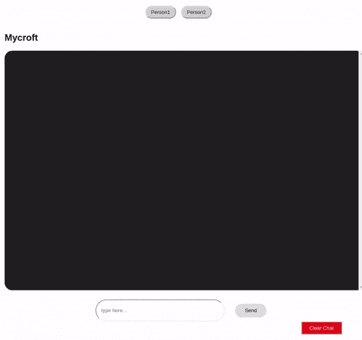
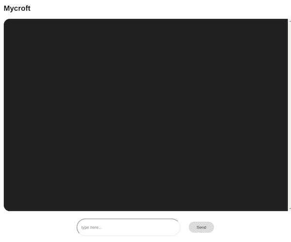
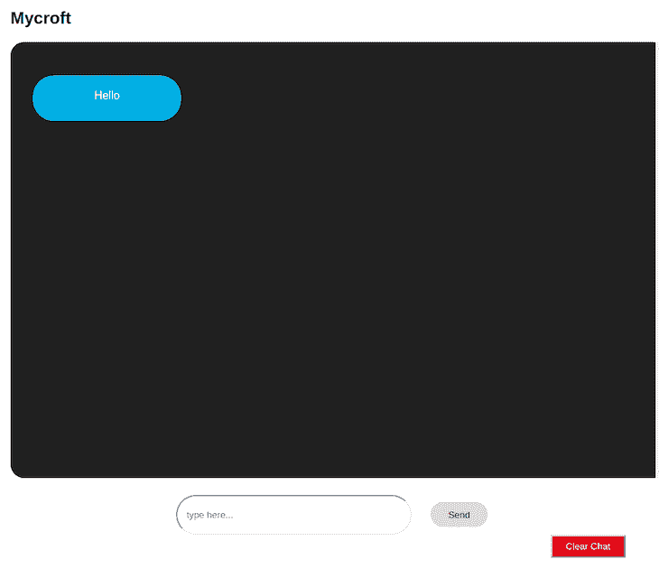

# 用于状态管理的带有 React 钩子的 RxJS

> 原文：<https://blog.logrocket.com/rxjs-react-hooks-for-state-management/>

***编者按:**本文于 2022 年 4 月 8 日更新，以反映 React 18 和 React 路由器 6 的推出带来的变化。*

在本文中，我们将介绍 RxJS 的基础知识，以及如何使用 React 钩子进行状态管理，将其与 React 应用程序集成。其中包括:

我们将构建一个演示聊天应用程序来实践这些概念。我们的聊天应用程序将有三个组件，它们将通过 RxJS 相互通信。

我们最终的应用程序将是这样的:


## 重大变化

最初写这篇文章的时候，React 版本是 v16，React 路由器版本是 v5，RxJS 版本是 v6。

### **反应 18**

在 React 版本 18 中，有许多变化——在本教程中您会注意到一些变化:

*   ReactDOM 渲染已被 createRoot 替换
*   导入反应是可选的

### **反应路由器 6**

在 React Router 6 中，变化是巨大的。以下是相关更新:

*   路由替换开关
*   我们将使用 NavLink 而不是 Link，因此我们可以访问 isActive 并确定活动链接和样式。

## RxJS 是什么？

RxJS(JavaScript 反应式扩展库)是一个非常有用的反应式编程库。RxJS 文档使用了这个定义:

(注意:RxJS 是一个使用 Observables 进行反应式编程的库，使得编写异步或基于回调的代码更加容易)

反应式编程是一种基于事件的范式，它允许我们在数据被推送到消费者时运行异步的事件序列。

为了能够在 React 中使用 RxJS 进行状态管理，理解以下关键术语非常重要:

### **可观察的**

可观察对象是包含可以通过不同线程传递的数据的数据流。在我们的演示应用程序中，我们将使用一个 Observable 为我们不同的组件提供数据。

### **观察者**

一个观察者使用被观察对象提供的数据。在我们的演示应用中，我们将使用我们的`setState`钩子从我们的可观察对象中获取数据。

### **订阅**

为了让我们的观察者从我们的可观察对象中获取数据，我们必须订阅可观察对象。在我们的演示应用程序中，我们将使用`subscribe()`方法为我们的`setState`观察者订阅我们的可观察对象。

## 设置我们的 React 聊天应用

理解 RxJS 最好的方法就是使用它。让我们从创建一个新的 React 应用程序开始。如果您的终端上没有安装 [Create React App](https://blog.logrocket.com/tag/create-react-app) ，运行:

```
npm i -g create-react-app

```

接下来:

```
create-react-app rxjs_react_chat

```

这将使用 CRA 生成一个新的 React 应用程序。

要启动我们的应用程序，让我们导航到新的应用程序目录并运行命令`npm start`:

```
cd rxjs_react_chat
npm start

```

在我们新生成的应用程序目录中，让我们导航到`/src/`。因为我们将使用多个组件，所以让我们设置`BrowserRouter`来导航不同的路线。

让我们通过运行以下命令来安装它:

```
npm install [email protected]

```

这将安装 React 路由器 v6。

接下来，我们将编辑我们的`/src/index.js`文件，如下所示:

```
//src/index.js

import { createRoot } from 'react-dom/client'
import './index.css';
import App from './App';
import { Routes, Route, BrowserRouter } from 'react-router-dom';

const container = document.getElementById('root');
const root = createRoot(container);
root.render(
  &lt;BrowserRouter&gt;
  &lt;/BrowserRouter&gt;
);

```

然后，我们将编辑我们的`/src/App.js`文件，如下所示:

```
// /src/App.js
import { Outlet } from 'react-router-dom';
import './App.css';
function App() {
  return (
        &lt;div className="App"&gt;
          &lt;Outlet /&gt;
        &lt;/div&gt;
  );
}
export default App;

```

在这里，我们使用 React Router 6 的 Outlet，它是一个门户，如果匹配，子路由将被呈现。

## 安装 RxJS 并设置存储

现在，让我们安装 RxJS 包

```
npm install rxjs

```

在我们的`src`文件夹中，让我们创建一个`store`目录，`src/store`，我们将在其中存放我们的商店。

接下来，让我们为我们的聊天操作`src/store/chat.js`创建一个`chat.js`文件。在我们的`chat.js`文件中，我们将从`rxjs`导入`Subject`，并从`Subject`类创建一个新变量:

```
import { Subject } from 'rxjs';

const subject = new Subject();

```

## 了解主题和订阅

一个 RxJS 主体可以同时扮演被观察者和观察者。通过这种方式，可以将值多播给许多观察者，这样当一个主题接收到任何数据时，该数据都可以转发给订阅它的每个观察者。

在我们的应用程序中，我们将为我们的 RxJS Subject 订阅不同的 React Hooks `setState`函数，这样当它接收到任何数据时，就会将该数据转发给与我们的`setState`函数相关联的每个状态。

让我们为此创建一个`subscribe`方法:

```
import { Subject } from 'rxjs'

const subject = new Subject();

const chatStore = {
  subscribe: setState =&gt; subject.subscribe(setState)
}

```

接下来，我们将为初始聊天状态创建一个对象:

```
import { Subject } from 'rxjs'

const subject = new Subject();

const initialState = {
  data: [],
  newDataCount: 0,
}; 

let state = initialState;

const chatStore = {
  subscribe: setState =&gt; subject.subscribe(setState)
}

```

我们将使用`data`键来保存消息对象的数组。这些消息对象将包含值`person`(指定消息来自谁)和`text`(存储消息文本)。

这是我们的对象看起来的样子:

```
{
  person: 'first-person',
  text: 'How are you?'
}

```

在我们的`initialState`对象中，`newDataCount`将被我们的通知功能用来告知新数据何时被推送到我们的状态。

现在我们有了状态对象，让我们创建一个`init()`方法，每当组件被挂载时，它都会初始化组件的状态:

```
...
const chatStore = {
  init: () =&gt; subject.next(state),
  subscribe: setState =&gt; subject.subscribe(setState)
}

```

`Subject.next()`方法用于向主题提供一个新值。当我们用一个值作为参数调用`next()`方法时，该值被多播给订阅该主题的所有观察者。

* * *

### 更多来自 LogRocket 的精彩文章:

* * *

在我们的应用程序中，每当我们的组件装载时，我们将调用`subscribe()`和`init()`方法，以便将我们的状态设置为我们在聊天商店中的状态。

## 向存储中添加数据

接下来，我们将创建一个`sendMessage()`方法。每当用户点击“发送消息”按钮时，我们都会调用这个方法。

我们的`sendMessage()`方法将接收一个`message`参数，我们将把它添加到我们的`state.data`数组中。记住我们的`message`参数是一个带有键`person`和`text`的对象。

让我们用下面的代码块创建我们的对象:

```
...
const chatStore = {
  init: () =&gt; subject.next(state),
  subscribe: setState =&gt; subject.subscribe(setState),
  sendMessage: message =&gt; {
    state = {
      ...state,
      data: [...state.data, message],
      newDataCount: state.newDataCount + 1
     };
     subject.next(state);
  }
};

```

在我们的新块中，我们将我们的`message`对象附加到我们的`state.data`数组，然后我们增加我们的`newDataCount`。

现在我们已经让我们的`newDataCount`在用户每次发送新消息时递增，我们还将添加一个功能，在每次查看消息时重置我们的新数据计数，这样当`person 1`发送新消息并且`person 2`读取消息时，数据计数重置为`0`。

为了做到这一点，在我们的`init()`方法中，我们将在每次挂载一个订阅我们的`Subject`的新组件时，为状态中的`newDataCount`键分配`0`的值:

```
...
const chatStore = {
  init: () =&gt; {
    state = {...state, newDataCount: 0},
    subject.next(state)
  },
  subscribe: setState =&gt; subject.subscribe(setState),
  sendMessage: message =&gt; {
    state = {
      ...state,
      data: [...state.data, message],
      newDataCount: state.newDataCount + 1
    };
    subject.next(state);
  }
};

```

## 从存储中删除数据

接下来，我们将添加一个清除所有消息的方法。我们称之为`clearChat()`:

```
...
const chatStore = {
  init: () =&gt; {
    &lt;b&gt;state = {...state, newDataCount: 0},&lt;/b&gt;
    subject.next(state)
  },
  subscribe: setState =&gt; subject.subscribe(setState),
  sendMessage: message =&gt; {
    state = {
      ...state,
      data: [...state.data, message],
      newDataCount: state.newDataCount + 1
    };
    subject.next(state);
  },
  clearChat: () =&gt; {
    state = initialState;
    subject.next(state);
  },
  initialState
};

```

我们还将初始状态添加到了`chatStore`对象中。当用`useState()`钩子定义我们的`chatState`时，我们将用它来设置我们的初始状态值。

最后，让我们导出`chatStore`对象。我们的`src/store/chat.js`文件现在应该是这样的:

```
// src/store/chat.js

import { Subject } from 'rxjs';

const subject = new Subject();
const initialState = {
  status: '',
  data: [],
  newDataCount: 0,
  error: ''
};

let state = initialState;

const chatStore = {
  init: () =&gt; {
    state = {...state, newDataCount: 0}
    subject.next(state)
  },
  subscribe: setState =&gt; subject.subscribe(setState),
  sendMessage: message =&gt; {
    state = {
      ...state,
      data: [...state.data, message],
      newDataCount: state.newDataCount + 1
    };
    subject.next(state);
  },
  clearChat: () =&gt; {
    state = {...state, data: []};
    subject.next(state);
  },
  initialState
};

export default chatStore;

```

## 创建组件以使用存储

现在我们已经建立了我们的聊天商店，我们将创建我们的组件来利用商店及其方法。

首先，让我们修改我们的`src/index.css`文件，如下所示:

```
.container {
  font-family: Arial, Helvetica, sans-serif;
  padding: 1em;
}

.chat-box {
  background: #202020;
  margin: auto;
  padding: 2em;
  height: 35em;
  width: 95%;
  border-radius: 20px;
  overflow-y: scroll;
}

.first-person, .second-person {
  display: inline-block;
  color: #fff;
  height: 25px;
  min-width: 20%;
  max-width: 60%;
  padding: 20px;
  text-align: center;
  vertical-align: middle;
  border-radius: 30px;
}

.first-person {
  background: rgb(0, 173, 231);
}

.second-person {
  background: #06c406;
  float: right;
}

.clear{ 
  clear: both;
  display: block;  
  content: "";
  width: 100%;  
}

.switcher-div {
  padding-top: 1em;
  text-align: center;
}

#messageForm {
  text-align: center;
  margin-top: 1.5em;
}

#messageForm input {
  height: 2em;
  width: 23em;
  border-radius: 3em;
  padding: 1em;
}

#messageForm button {
  margin-left: 2em;
  height: 2.7em;
  width: 6.2em;
  border-radius: 25px;
  border: none;
  cursor: pointer;
}

.clear-button {
  background: #d40000;
  color: #fff;
  float: right;
  margin-right: 3em;
  text-align: center;
  height: 2.5em;
  width: 8em;
  cursor: pointer;
}

.switcher {
  background: #cecece;
  color: #141414;
  height: 2.5em;
  width: 6em;
  border-radius: 25px;
  border: 1 px solid black;
  margin-right: 1em;
  cursor: pointer;
}

.notify {
  position: absolute;
  background: #db0000;
  color: white;
  height: 1em;
  width: 1em;
  border-radius: 100%;
  padding: 0.15em;
  margin-left: 0.5em;
  margin-top: -0.5em;
}

```

在我们的`src`文件夹中，创建一个组件目录`src/components`。这是我们存放所有组件的地方。我们的应用程序需要三个组件:

*   第一人称的组件
*   第二个人的组成部分
*   用于在两个人组件之间切换的组件

在我们的`src/components`目录中，让我们为第一个 person 组件创建一个新文件`FirstPerson.js`。我们的新组件应该如下所示:

```
// src/components/FirstPerson.js

import { useState } from  "react";
const FirstPerson = () =&gt; {
  const [chatState, setChatState] = useState({});
  return (
    &lt;div className="container"&gt;
      &lt;h2&gt;Mycroft&lt;/h2&gt;
      &lt;div className="chat-box"&gt;
        {chatState.data.map(message =&gt; (
          &lt;div&gt;
            &lt;p className={message.person}&gt;{message.text}&lt;/p&gt;
            &lt;div className="clear"&gt;&lt;/div&gt;
          &lt;/div&gt;
        ))}
      &lt;/div&gt;
      &lt;form id="messageForm"&gt;
        &lt;input
          type="text"
          id="messageInput"
          name="messageInput"
          placeholder="type here..."
          required
        /&gt;
        &lt;button type="submit"&gt;Send&lt;/button&gt; &lt;br /&gt;
      &lt;/form&gt;
    &lt;/div&gt;
  );
}
export  default  FirstPerson;

```

## 订阅我们的存储并检索现有数据

在下一个块中，我们将导入我们的`chatStore`，并使用它的`initialState`属性作为我们的默认`chatState`值。

然后，在我们的`useLayoutEffect()`钩子中，我们将使用`chatStore.subscribe()`方法向我们的聊天商店订阅我们的`setChatState`函数，最后，使用`chatStore.init()`方法初始化我们组件的`chatState`:

```
// src/components/FirstPerson.js
import React, { useState, useLayoutEffect } from "react";
import chatStore from '../store/chat';

const FirstPerson = () =&gt; {
  const [chatState, setChatState] = useState(chatStore.initialState);

  useLayoutEffect(()=&gt; {
    chatStore.subscribe(setChatState);
    chatStore.init();
  },[]);

  return (...)
}

```

在组件呈现之前，我们使用`useLayoutEffect()`钩子向我们的`chatState`发送数据。

接下来，我们将在 src/index.js 文件中导入我们的`FirstPerson`组件，并将其添加到路由路径:

```
// /src/App.js
import { Outlet } from 'react-router-dom';
import './App.css';
import Switcher from './components/Switcher';
function App() {
  return (
        &lt;div className="App"&gt;
          &lt;Switcher/&gt;
          &lt;Outlet /&gt;
        &lt;/div&gt;
  );
}
export default App;

```

现在，当我们运行应用程序并导航到`/`或`/first-person`路线时，我们应该会看到:



现在，回到我们的`/src/components/FirstPerson.js`文件。让我们添加一个`onFormSubmit()`方法。每当用户点击`send`按钮时，我们都会调用这个方法。

```
...
const FirstPerson = () =&gt; {
  const [chatState, setChatState] = useState(chatStore.initialState);
  useLayoutEffect(()=&gt; {
    chatStore.subscribe(setChatState);
    chatStore.init();
  },[]);
  const onFormSubmit = e =&gt; {
    e.preventDefault();
    const messageObject = {
      person: 'first-person',
      text: e.target.elements.messageInput.value.trim(),
    };
    chatStore.sendMessage(messageObject);
    document.getElementById('messageForm').reset();
  };
  return (
    ...
      &lt;form id="messageForm" onSubmit={onFormSubmit}&gt;
        &lt;input
          type="text"
          id="messageInput"
          name="messageInput"
          placeholder="type here..."
          required
        /&gt;
        &lt;button type="submit"&gt;Send&lt;/button&gt; &lt;br /&gt;
      &lt;/form&gt;
    &lt;/div&gt;
  );
}
export default FirstPerson;

```

我们的`onFormSubmit()`函数使用`person`和`text`键创建一个消息对象，然后使用我们的`chatStore.sendMessage()`方法将我们的新消息添加到聊天存储中。

接下来，我们将添加一个按钮来调用我们的`chatStore.clearChat()`方法。每当点击`clear`按钮时，我们将用它来清除我们的聊天记录。

让我们在`</form>`结束标签后添加以下代码块:

```
&lt;button className="clear-button" onClick={() =&gt; chatStore.clearChat()}&gt;
  Clear Chat
&lt;/button&gt;

```

我们的`src/components/FirstPerson.js`文件现在应该是这样的:

```
import React, { useState, useLayoutEffect } from "react";
import chatStore from '../store/chat';

const FirstPerson = () =&gt; {
  const [chatState, setChatState] = useState(chatStore.initialState);

  useLayoutEffect(()=&gt; {
    chatStore.subscribe(setChatState);
    chatStore.init();
  },[]);

  const onFormSubmit = e =&gt; {
    e.preventDefault();
    const messageObject = {
      person: 'first-person',
      text: e.target.elements.messageInput.value.trim(),
    };
    chatStore.sendMessage(messageObject);
    document.getElementById('messageForm').reset();
  };

  return (
    &lt;div className="container"&gt;
      &lt;h2&gt;Mycroft&lt;/h2&gt;
      &lt;div className="chat-box"&gt;
        {chatState.data.map(message =&gt; (
          &lt;div&gt;
            &lt;p className={message.person}&gt;{message.text}&lt;/p&gt;
            &lt;div className="clear"&gt;&lt;/div&gt;
          &lt;/div&gt;
        ))}
      &lt;/div&gt;
      &lt;form id="messageForm" onSubmit={onFormSubmit}&gt;
        &lt;input
          type="text"
          id="messageInput"
          name="messageInput"
          placeholder="type here..."
          required
        /&gt;
        &lt;button type="submit"&gt;Send&lt;/button&gt; &lt;br /&gt;
      &lt;/form&gt;
      &lt;button className="clear-button" onClick={() =&gt; chatStore.clearChat()}&gt;
        Clear Chat
      &lt;/button&gt;
    &lt;/div&gt;
  );
}
export default FirstPerson;

```

当我们在浏览器上预览我们的应用程序时，我们现在应该能够向我们的商店发送消息并清除所有消息:



## 在组件之间共享数据

既然我们已经看到了如何从我们的存储中检索数据并向其中添加其他数据，那么让我们创建我们的`SecondPerson`组件来演示如何在不同的组件之间共享这些数据。

`SecondPerson`组件与`FirstPerson`组件具有相同的功能，所以我们只需将`messageObject`中的`person`值更改为`second-person`，并将`container` div 中的`<h2>`标签中的用户名从`Mycroft`更改为`Cortana`。

为此，让我们创建一个新文件`src/components/SecondPerson.js`，并粘贴以下代码块:

```
// src/components/SecondPerson.js
import { useState, useLayoutEffect } from "react";
import chatStore from '../store/chat';

const SecondPerson = () =&gt; {
  const [chatState, setChatState] = useState(chatStore.initialState);

  useLayoutEffect(()=&gt; {
    chatStore.subscribe(setChatState);
    chatStore.init();
  },[]);

  const onFormSubmit = e =&gt; {
    e.preventDefault();
    const messageObject = {
      person: 'second-person',
      text: e.target.elements.messageInput.value.trim(),
    };

    chatStore.sendMessage(messageObject);
    document.getElementById('messageForm').reset();
  };

  return (
    &lt;div className="container"&gt;
      &lt;h2 style={{float: 'right'}}&gt;Cortana&lt;/h2&gt;
      &lt;div className="chat-box"&gt;
        {chatState.data.map(message =&gt; (
          &lt;div&gt;
            &lt;p className={message.person}&gt;{message.text}&lt;/p&gt;
            &lt;div className="clear"&gt;&lt;/div&gt;
          &lt;/div&gt;
        ))}
      &lt;/div&gt;
      &lt;form id="messageForm" onSubmit={onFormSubmit}&gt;
        &lt;input
          type="text"
          id="messageInput"
          name="messageInput"
          required
        /&gt;
        &lt;button type="submit"&gt;Send&lt;/button&gt; &lt;br /&gt;
      &lt;/form&gt;
      &lt;button className="clear-button" onClick={() =&gt; chatStore.clearChat()}&gt;
        Clear Chat
      &lt;/button&gt;
    &lt;/div&gt;
  );
}

export default SecondPerson;

```

接下来，我们需要创建我们的`Switcher`组件来在两个组件之间切换。在我们的`src/components`目录中，让我们创建一个新文件`Switcher.js`，并粘贴以下代码块:

```
// src/components/Switcher.js
import { useState, useEffect } from 'react'
import { NavLink } from 'react-router-dom';
import chatStore from '../store/chat';

function Switcher() {
  const [chatState, setChatState] = useState(chatStore.initialState);
  const location = window.location.href.split('/')[3];

  useEffect(() =&gt; {
    chatStore.subscribe(setChatState);
    chatStore.init();
  }, []);

  const messageNotification = chatState.newDataCount &gt; 0
  &amp;&amp; (&lt;span className="notify"&gt;{chatState.newDataCount}&lt;/span&gt;);

  return (
      &lt;div className="switcher-div"&gt;
          &lt;NavLink
              style={({ isActive }) =&gt; ({
                  border: isActive ? "2px solid #00ade7" : "",
                  padding:0,
                  borderRadius:30
              })}
              to={"/first-person"}&gt;
              &lt;button className="switcher"&gt;
                  Person 1
                  {location !== 'first-person' &amp;&amp; location.length &gt; 1 &amp;&amp; messageNotification}
              &lt;/button&gt;
          &lt;/NavLink&gt;
          &lt;NavLink style={({ isActive }) =&gt; ({
                    border: isActive ? "2px solid #06c406" : "",
                    padding:0,
                    borderRadius:30
              })} to={"/second-person"}&gt;
              &lt;button className="switcher"&gt;
                  Person 2
                  {location !== 'second-person' &amp;&amp; messageNotification}
              &lt;/button&gt;
          &lt;/NavLink&gt;
      &lt;/div&gt;
  )
}
export default Switcher

```

让我们更新我们的`/src/App.js file`，切换器将出现在每个页面上，所以我们将它添加到`App.js`文件中，该文件根据每个 Person 组件的路线匹配来呈现每个 Person 组件。

```
// /src/App.js
import { Outlet } from 'react-router-dom';
import './App.css';
import Switcher from './components/Switcher';
function App() {
  return (
        &lt;div className="App"&gt;
          &lt;Switcher/&gt;
          &lt;Outlet /&gt;
        &lt;/div&gt;
  );
}
export default App;

```

注意，我们还为我们的组件创建了一个`chatState`,我们已经订阅了我们的聊天商店。当一个新消息被添加到我们的聊天商店时，我们需要它来通知我们的组件。注意我们是如何添加一个`messageNotification`变量的，这个变量利用了我们聊天商店中的`newDataCount`属性。

现在，我们的`index.js`文件应该是这样的:

```
import React from 'react';
import FirstPerson from './components/FirstPerson';
import SecondPerson from './components/SecondPerson';
import { createRoot } from 'react-dom/client'
import './index.css';
import App from './App';
import { Routes, Route, BrowserRouter } from 'react-router-dom';

const container = document.getElementById('root');
const root = createRoot(container);
root.render(
  &lt;BrowserRouter&gt;
        &lt;Routes&gt;
          &lt;Route path='/' element={&lt;App /&gt;} &gt;
            &lt;Route index path='/' element={&lt;FirstPerson /&gt;} /&gt;
            &lt;Route index path='first-person' element={&lt;FirstPerson /&gt;} /&gt;
            &lt;Route path="second-person" element={&lt;SecondPerson /&gt;} /&gt;
          &lt;/Route&gt;
        &lt;/Routes&gt;
  &lt;/BrowserRouter&gt;
)

```

现在，当我们运行应用程序时，我们将能够在组件之间切换，在发送消息时接收新的消息计数，并使用“clear”按钮清除所有消息:


## 结论

在本文中，我们介绍了 RxJS 的基础知识，并通过构建一个基于组件的聊天应用程序演示了如何在 React 中使用它进行状态管理。这里有一个到 GitHub repo 的[链接，用于我们演示应用程序的更新版本。](https://github.com/emmanuelhashy/rxjs_react_chat)

与 Redux 等其他选择相比，我发现使用 RxJS 和 Hooks 是管理 React 应用程序状态的一种非常有效和直接的方式。

要了解更多关于 RxJS 的信息，我强烈推荐阅读以下文章:

黑客快乐！