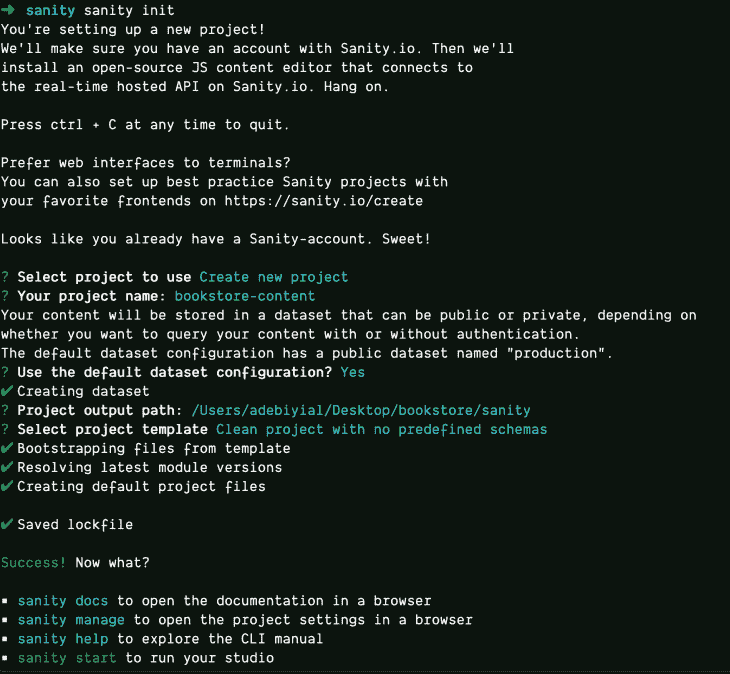
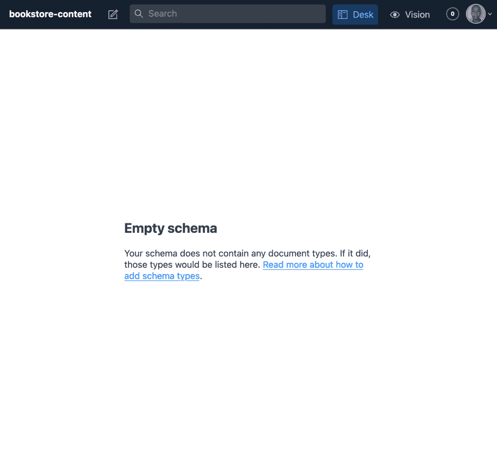
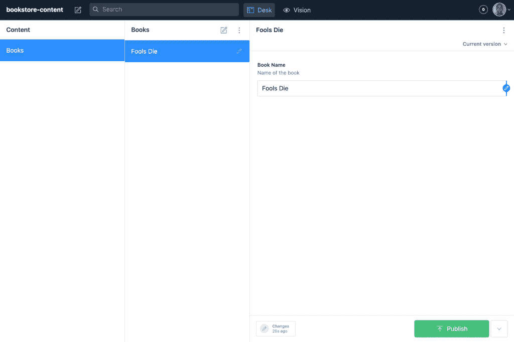
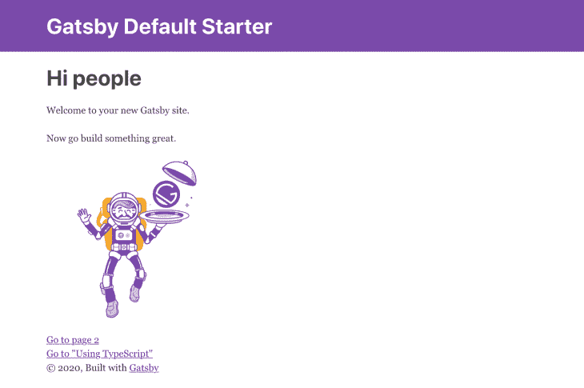
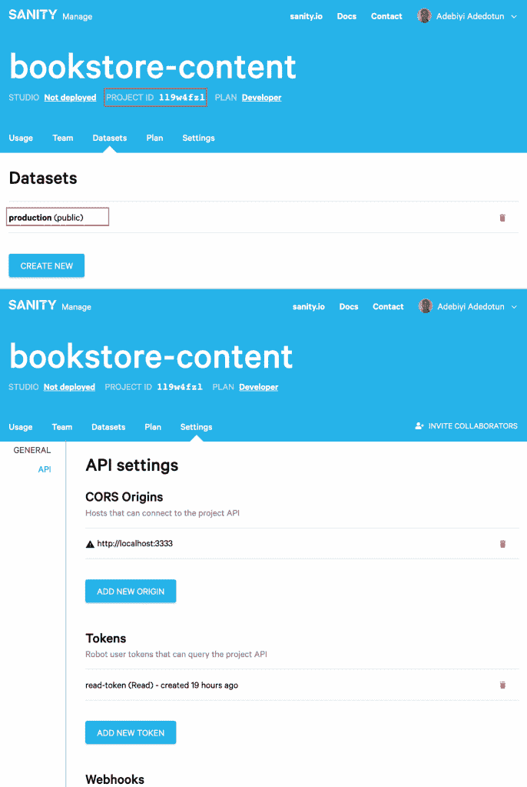
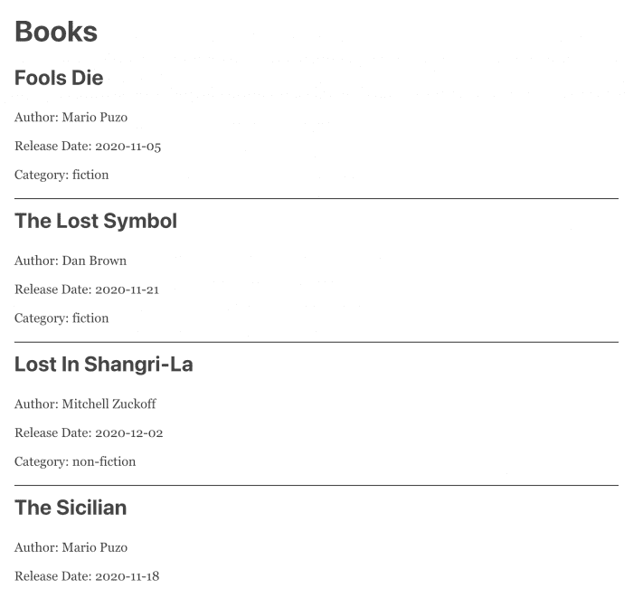

# Gatsby 中用于无头内容管理的 Sanity CMS

> 原文：<https://blog.logrocket.com/sanity-cms-for-content-management-in-gatsby/>

Gatsby 是最流行的基于 React 的创建网站和应用程序的框架之一。尽管其在任何部署环境中的速度都令人称道，但 Kyle Mathews(Gatsby 首席执行官)最近警告说，在 Gatsby Cloud 上发布的[增量构建可能会对构建时间产生负面影响。](https://www.gatsbyjs.com/blog/2020-04-22-announcing-incremental-builds/)

如果你用过盖茨比或者其他 SSG 的作品，你就会知道随着网站越来越大，构建时间会越来越长。这是应用程序规模增加的结果，这取决于它容纳的内容量和必须进行的渲染量。尝试[优化网站性能](https://blog.logrocket.com/using-resource-hints-to-optimize-performance/)的方法有很多，其中一种是通过使用仅后端([简称“无头”](https://blog.logrocket.com/coupled-decoupled-and-headless-cms-platforms/))内容管理系统。

在本文中，我们将讨论通过结构化的内容管理方法，与 Gatsby 一起使用 headless CMS、 [Sanity](https://www.sanity.io/) 来提高站点效率、生产率和速度。

## 通过 Gatsby 使用 Sanity CMS

Gatsby 是数据源不可知的，这意味着您可以从任何地方导入数据:API、数据库、CMSs、静态文件，甚至一次导入多个数据源。在本文中，我们将使用 Sanity CMS 作为我们的数据存储库。

Sanity 将内容视为数据，并提供了一些简洁的功能来管理图像([图像管道](https://www.sanity.io/docs/asset-pipeline))、文本([可移植文本](https://www.sanity.io/guides/introduction-to-portable-text))和设计，所有这些都是为了采用结构化的方法来处理内容，从而提高 web 应用程序的性能。Sanity 还提供了 [Sanity Studio](https://sanity.io/studio) ，这是一个为开发人员用 React.js 构建的全功能、可定制、可扩展的编辑器。

在接下来的部分中，我们将构建一个前端 Gatsby 驱动的 web 应用程序和一个完全负责内容管理的无头 CMS 后端。最后，您将学习如何用 Sanity 管理内容，以及如何通过 API 将 Sanity 连接到 Gatsby，将内容作为数据导入。

## 理智入门

要开始使用 Sanity，你可以使用 [Sanity CLI](https://www.sanity.io/docs/cli) 或者任何[的](https://www.sanity.io/docs/starters-on-sanity-io-create) [tarter 项目](https://www.sanity.io/docs/starters-on-sanity-io-create)。

### **1。安装 Sanity CLI**

在尝试安装 Sanity CLI 之前，请确保您已经安装了`Node`和`npm`。然后，确保你有一个理智账户(或者[创建一个](https://manage.sanity.io/))。

当您准备好安装时，在终端中运行以下命令以全局安装 Sanity CLI:

```
npm install -g @sanity/cli

```

这将安装必要的工具，以便通过 CLI 正常工作。

### **2。创建一个健全的项目**

安装了 Sanity CLI 后，运行以下命令创建新的 Sanity 项目:

```
>sanity init

```

运行此命令时，您将看到类似下图的输出，该输出将引导您完成项目创建的交互式问答会话。

出现提示时，请遵循以下模式:

*   选择要使用的项目→创建新项目
*   使用默认数据集配置？→是
*   选择项目模板→清除没有预定义模式的项目



### 3.运行项目

在项目的根目录下，通过运行命令(在端口 3333 上)启动 Sanity Studio

```
sanity start -p 3333

```

该项目现在应该在 [http://localhost:3333](http://localhost:3333) 上运行

注意:可能会要求您登录，这取决于您是否希望通过身份验证来查询您的内容。

### 4.编辑模式

此时，您的模式将为空:



[Schemas](https://www.sanity.io/docs/schema-types) 在 Sanity 中处于结构化[内容模型](https://www.sanity.io/docs/content-modelling) [i](https://www.sanity.io/docs/content-modelling) [ng](https://www.sanity.io/docs/content-modelling) 的核心，指的是组成文档的字段类型(文档、图像、对象、引用等。)

对于我们的例子，我们将创建一个图书模式，它的属性包括:`name`、`title`、`type`、`author`和`release date`。

要创建我们的图书模式，在模式文件夹中创建一个`books.js`文件，如下所示:

```
// schemas are basically objects
export default {
   // The identifier for this document type used in the api's
  name: 'book',

  // This is the display name for the type
  title: 'Books',

  // Schema type of Document
  type: 'document',

  fields: [
    {
      name: 'name',
      title: 'Book Name',
      type: 'string',
      description: 'Name of the book',
    },
  ]
}

```

`fields`属性是一个对象数组，我们在其中定义模式的属性。第一个字段用[字符串类型](https://www.sanity.io/docs/string-type)指定图书名称。

既然已经创建了图书模式，它应该被添加到`schema.js`中的模式列表中

```
// Default imports from Sanity
import schemaTypes from 'all:part:@sanity/base/schema-type';
import createSchema from 'part:@sanity/base/schema-creator';

// Import the book schema
import book from './book';

export default createSchema({
  name: 'default',
  types: schemaTypes.concat([
    /* Append to the list of schemas */
    book
  ]),
});

```

### **5** 。通过 Sanity Studio 发布

现在您已经创建了您的模式，Sanity Studio 应该已经启动并运行了更新的更改。

请记住，Sanity Studio 有三个重要的特性:

1.  模式–显示模式列表(下面的第 1 列)
2.  文档-在模式下创建的文档(下面的第 2 列)
3.  编辑–在模式中创建的字段(下面的第 3 列)

要发布，请继续并创建一个文档:



6.创建附加字段

### 我们可以通过创建更多的字段来获得更多的细节。在下面的例子中，我们将把`author`、`release date`和`category`添加到`schema.js`中现有的`fields`数组中:

7.创建其他模式

```
{
  name: 'author',
  title: 'Author Name',
  type: 'string',
  description: 'Name of the author',
},
{
  name: 'releaseDate',
  title: 'Release Date',
  type: 'date',
  options: {
    dateFormat: 'YYYY-MM-DD',
    calendarTodayLabel: 'Today',
  },
  description: 'Release Date of the book',
},
{
  name: 'category',
  title: 'Book Category',
  type: 'array',
  description: 'Category of the Book',
  of: [
    {
      type: 'reference',
      to: [
        {
          type: 'category',
        },
      ],
    },
  ],
},

```

### 在上面的块中，`release date`被赋予属性`of`到[日期](https://www.sanity.io/docs/date-type)类型。另一方面，`category`是一个[引用](https://www.sanity.io/docs/reference-type)类型，将`of`属性赋给`category`；然而，`category`，它本身是一个对象数组，还没有创建模式。

为了创建 category 模式，我们将遵循与 book 模式相同的方法。

首先，在`schema`文件夹中创建`category.js`，内容为:

其次，导入并将其添加到`schema.js`中的模式列表中

```
export default {
  name: 'category',
  title: 'Categories',
  type: 'document',
  fields: [
    {
      name: 'category',
      title: 'Book Category',
      type: 'string',
      description: 'Category of Book',
    },
  ],
};

```

最后，继续为类别创建不同的文档。在这个例子中，我选择了惊悚片、非小说和小说。

```
// Sanity default imports
import book from './book';
import category from './category';

export default createSchema({
  name: 'default',
  types: schemaTypes.concat([
    /* Append to the list of schemas */
    book,
    category,
  ]),
});

```


8.部署您的健全项目

Sanity 通过 API 将您的内容公开为数据，并通过类似于被称为 [GROQ](https://www.sanity.io/docs/groq) (面向图形的查询语言)的 [GraphQL](https://graphql.org/) 的查询语言来访问它。

### 由于 [Gatsby 数据层由 GraphQL](https://www.gatsbyjs.com/docs/why-gatsby-uses-graphql/) 提供支持，因此很容易指示 Sanity 通过它来访问我们的数据。为此，运行下面的命令并确认问题:您想使用 GraphQL playground 吗？

然后，您将看到一个到 GraphQL playground 的部署 URL，您可以在这里查询您的健全性内容。

您可以运行查询来获取使用`allBook`的所有书籍，如下所示:

```
sanity graphql deploy

```

请注意，当您完成项目并对模式进行更改时，请记住重新部署以保持更改的更新。

如果你还和我在一起，那么你已经准备好将数据导入到 Gatsby 中了。

```
query {
  allBook {
    name
  }
}

```

盖茨比入门

在我们继续之前，这里有一些盖茨比的细微差别需要熟悉:

## [插件](https://www.gatsbyjs.org/docs/recipes/working-with-plugins/):插件对于盖茨比就像`npm`包对于`Node`项目一样。您将安装插件来使用您的 Gatsby 应用程序，以避免为常用功能重写代码。

`gatsby-config.js`:这是盖茨比的配置文件，很像 git 的`.gitignore`文件，[的`.eslintrc`ESlint](https://eslint.org/)，或者[beautiful](https://prettier.io/)的`.prettierrc`。

*   这是你的 Gatsby 站点和浏览器之间的接口。每当我们安装一个 Gatsby 插件时，我们都会在`gatsby-config.js`中配置它。
*   创建盖茨比网站
*   为了[创建一个新的盖茨比应用](https://www.gatsbyjs.com/docs/quick-start/)，你需要安装[盖茨比命令行界面](https://www.gatsbyjs.org/docs/quick-start#use-the-gatsby-cli):

### 然后，创建一个名为 gatsby **:** 的新 Gatsby 站点

将目录更改为新的 gatsby 站点:

```
npm install -g gatsby-cli // Installs the gatbsy CLI globally

```

最后，运行网站:

```
gatsby new gatsby // Creates a new gatbsy site named gatsby

```

如果一切顺利，该网站应该运行在 http://localhost:3000 上:

```
cd gatsby // Switch directory into the new gatsby site

```



```
gatsby develop -p 3000 // Instruct Gatsby to run on port 3000

```

[GraphiQL](https://www.gatsbyjs.org/docs/introducing-graphiql/) ，探索 Gatsby GraphQL 操作的默认 IDE，也可以在[http://localhost:3000/](http://localhost:3000/)*_*GraphiQL 找到

在 Gatsby 中获取数据

在 Gatsby 中获取数据本身就是一个专门的主题，但是对于本文来说最重要的是 Gatsby 是数据源不可知的，因此可以从任何地方 [加载数据。](https://www.gatsbyjs.com/docs/content-and-data/)

### 出于本教程的目的，我们将[将数据](https://www.gatsbyjs.com/docs/recipes/sourcing-data/)导入 Gatsby 的 GraphQL 数据层，然后[查询该数据](https://www.gatsbyjs.com/docs/recipes/querying-data/)。这可以手动完成，也可以通过插件完成。出于我们的目的，我们将使用 Sanity CMS 插件。

从 Gatsby 中的 Sanity CMS 获取数据

gatsby-source-sanity 是一个插件，帮助将数据从 sanity 拉入 gatsby。在您的 Gatsby 应用程序中，运行命令来安装它:

### 然后在`gatsby-config.js`插件数组中配置它:

**更新插件配置**

```
npm install gatsby-source-sanity

```

您可以为插件需求指定一个选项的[列表——必需的和可选的。其中一些选项是特定于每个项目的，可以在 Sanity dashboard 中找到，而一些选项，如`watchMode`，则不能。](https://www.gatsbyjs.com/plugins/gatsby-source-sanity/?=gatsby-source-sanity#options)

```
plugins: [
  {
    resolve: 'gatsby-source-sanity',
  },
  // other plugins
]

```

### 使用以下内容更新插件配置:

请参见下面示例中的输出:

`projectId` →唯一确定一个健全项目

```
plugins: [
  {
    resolve: 'gatsby-source-sanity',
    options: {
      projectId: 'your-project-id',
      dataset: 'your-dataset-name',
      watchMode: true, // Updates your pages when you create or update documents
      token: 'your-token',
    },
  },
]

```

`dataset` →在这种情况下，`production`

1.  `token` → `read-token`，查询项目 API(令牌是敏感数据，不应该硬编码。相反，读读《T2》中盖茨比的环境变量。)
2.  

从理智到盖茨比的数据查询

设置好所有凭证后，重新启动 Gatsby 服务器，然后导航到 GraphiQL 运行以下查询来获取所有创建的图书:

### 可以通过[页面查询](https://www.gatsbyjs.com/docs/recipes/querying-data/#querying-data-with-a-page-query)或者静态查询(通过`[StaticQuery](https://ui.dev/react-higher-order-components/)`高阶组件或者`[useStaticQuery](https://www.gatsbyjs.com/docs/recipes/querying-data/#querying-data-with-the-usestaticquery-hook)`钩子)来查询数据。)主要区别是页面查询用于[页面](https://www.gatsbyjs.com/docs/creating-and-modifying-pages/)，而静态查询用于非页面组件。

使用页面查询更新`index.js`来查询`index.js`中的健全性数据:

```
query {
  allSanityBook {
    nodes {
      name
    }
  }
}

```

查询数据是通过首先从`gatbsy`导入`graphql`，然后将查询写成一个命名导出来完成的。然后，查询返回的`data`作为道具传递给页面中默认导出的组件，在本例中是`IndexPage`。变量`books`保存书籍的数组，这些书籍可以在页面中使用，或者传递给另一个组件。

`index.js`的最后更新是:

```
import React from 'react';
import { graphql } from 'gatsby';

// Queried data gets passed as props
export default function IndexPage({ data }) {
  const books = data.allSanityBook.nodes
  return <h1>Index Page</h1>
}

// Query data
export const query = graphql`
  query BooksQuery {
    allSanityBook {
      nodes {
        name
      }
    }
  }
`

```

最终输出应该是这样的:



```
import React from 'react'
import { graphql } from 'gatsby'

export default function IndexPage({ data }) {
  const books = data.allSanityBook.nodes

  return (
    <div className="books-wrap">
      <div className="container">
        <h1 className="heading">Books</h1>
        <ul className="books">
          {books.map(book => (
            <li className="book-item" key={book.name}>
              <h2 className="title">{book.name}</h2>
              <p className="author">Author: {book.author}</p>
              <p className="release-date">Release Date: {book.releaseDate}</p>
              <span className="category">Category: {book.category[0].category}</span>
            </li>
          ))}
        </ul>
      </div>
    </div>
  )
}

export const query = graphql`
  query BooksQuery {
    allSanityBook {
      nodes {
        name
        author
        releaseDate
        category {
          category
        }
      }
    }
  }

```

点击获取完整代码[。](https://github.com/adebiyial/demos-for-articles/tree/master/logrocket/sanity-gatsby)

结论

内容是让网站和应用变得生动的东西，但是必须对其进行适当的建模和管理，以避免对构建速度和效率产生负面影响。开发人员可以将 Sanity CMS 与 Gatsby 一起使用，通过一个将内容像数据一样处理的可编程现代平台来减少构建时间并优化 web 性能。

## 使用 [LogRocket](https://lp.logrocket.com/blg/signup) 消除传统错误报告的干扰

[LogRocket](https://lp.logrocket.com/blg/signup) 是一个数字体验分析解决方案，它可以保护您免受数百个假阳性错误警报的影响，只针对几个真正重要的项目。LogRocket 会告诉您应用程序中实际影响用户的最具影响力的 bug 和 UX 问题。

## 然后，使用具有深层技术遥测的会话重放来确切地查看用户看到了什么以及是什么导致了问题，就像你在他们身后看一样。

[](https://lp.logrocket.com/blg/signup)

LogRocket 自动聚合客户端错误、JS 异常、前端性能指标和用户交互。然后 LogRocket 使用机器学习来告诉你哪些问题正在影响大多数用户，并提供你需要修复它的上下文。

关注重要的 bug—[今天就试试 LogRocket】。](https://lp.logrocket.com/blg/signup-issue-free)

LogRocket automatically aggregates client side errors, JS exceptions, frontend performance metrics, and user interactions. Then LogRocket uses machine learning to tell you which problems are affecting the most users and provides the context you need to fix it.

Focus on the bugs that matter — [try LogRocket today](https://lp.logrocket.com/blg/signup-issue-free).