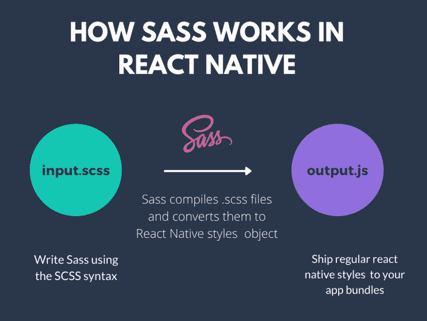
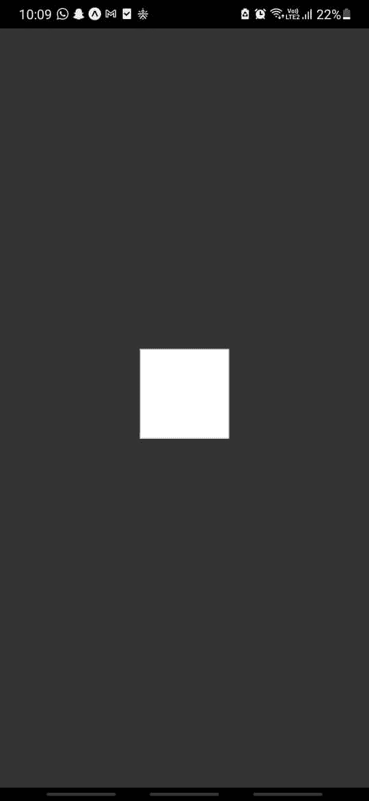
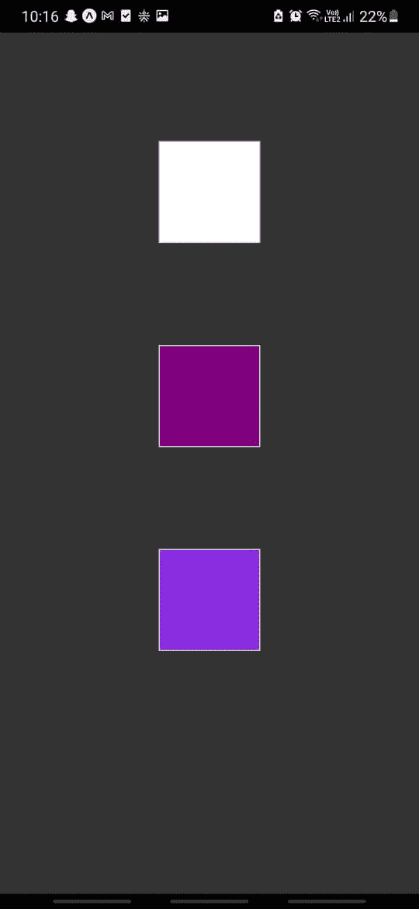
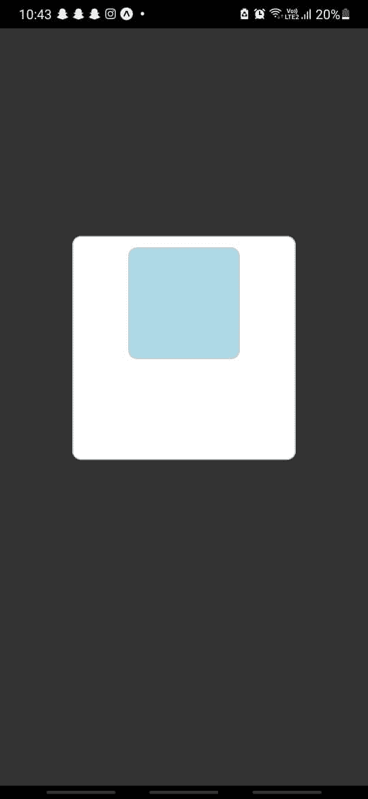

# 如何在 React Native - LogRocket 博客中使用 Sass

> 原文：<https://blog.logrocket.com/sass-react-native-guide/>

Sass 代表“语法上令人敬畏的样式表”，它是一个帮助您编写、构造和组织 CSS 代码的预处理程序。如今，它被广泛用于替代原始 CSS 来设计大型 web 应用程序。

事实上，许多现代 CSS 框架和类似 Bootstrap 的库也是用 Sass 编写的。它允许开发者在他们的 CSS 样式中使用变量、混合、模块、部分和操作符。

虽然 Sass 通常与 React 等前端框架结合使用，但是您也可以在 React 本地项目中使用它。在本指南中，我将带您了解如何在 React 本机应用程序中配置和使用 Sass，但首先，让我们了解 Sass 是如何工作的。

## Sass 如何工作

Sass 只是一个开发时工具，而不是 CSS 标准的扩展。这意味着当您使用 webpack 或模块捆绑器来构建您的代码时，它也会编译您的 Sass 文件。在 web 生态系统中，您的 Sass 文件以`.scss`扩展名保存，而不是常规的`.css`扩展名。SCSS 代表“时髦的 CSS ”,并提供了一种类似于 CSS 的语法。

您还可以在 Sass 文件中编写原始 CSS，因为每个有效的 CSS 也是有效的 SCSS。然而，反之则不然。


因为 React Native 不使用 CSS 而是使用样式对象，所以您的 Sass 文件也会被转换为 React Native 样式对象。

这为您提供了一个编写原始 CSS 来样式化 React 本机组件的重要优势。React 本地项目在运行时编译 Sass 文件，并将其转换为常规的 JavaScript 对象。



现在您已经了解了 Sass 的工作原理，让我们在 React 本地项目中设置它。为此，我们将使用 react-native-sass-transformer 包。

## 在 React Native 中设置 Sass

react-native-sass-transformer 包允许我们在任何种类的 React Native 项目中轻松地配置、设置和使用 sass。它还使用包`node-sass`作为依赖项，为 Sass 提供节点绑定。

让我们首先创建一个新的 React 本地项目:

```
npx react-native init rn-sass-app

```

您可以通过运行以下命令在项目中安装这两个依赖项:

```
npm install react-native-sass-transformer node-sass

```

一旦您创建了项目以及上面的依赖项，您需要做一些额外的配置更改。在根目录中，将以下配置添加到您的`metro.config.js`文件中:

```
const { getDefaultConfig } = require("metro-config");

module.exports = (async () => {
  const {
    resolver: { sourceExts }
  } = await getDefaultConfig();
  return {
    transformer: {
      babelTransformerPath: require.resolve("react-native-sass-transformer")
    },
    resolver: {
      sourceExts: [...sourceExts, "scss", "sass"]
    }
  };
})();

```

如果您使用 Expo CLI，您需要在根目录中显式创建一个`metro.config.js`文件。您还需要通过对您的`app.json`文件进行以下调整，告诉 Expo 将这些配置加载到项目中:

```
{
  "expo": {
   ...
    "packagerOpts": {
      "config": "metro.config.js",
      "sourceExts": ["js", "jsx", "scss", "sass"]
    }
   ...
  }
}

```

一旦完成上述更改，您将能够在 Expo CLI 或 React Native CLI 项目中使用 Sass。

## 使用 Sass 来设计 React 本机组件的样式

在项目内部，让我们创建一个名为`App.scss`的新文件，在这里我们可以为我们的`<App/>`组件编写 Sass 样式。在`App.scss`文件中，让我们添加以下样式:

```
.container {
  display: flex;
  flex: 1;
  justify-content: center;
  align-items: center;
  background-color: #333;
}

```

上面的样式是用纯 CSS 编写的，但是因为我们使用了`.scss`扩展，我们的应用程序将能够编译这些样式。注意，我们使用了一个类选择器`.container`来定义我们的样式。

为了在我们的`App.js`文件中使用上述样式，我们首先需要导入它们:

```
import Appstyles from './App.scss';

```

让我们简单地将`Appstyles`对象登录到控制台，看看这些样式是什么样子的:

```
console.log({Appstyles})

```

您会注意到我们的 CSS 样式已经被编译成一个普通的 JavaScript 对象:

```
Object {
  "Appstyles": Object {
    "container": Object {
      "alignItems": "center",
      "backgroundColor": "#333",
      "display": "flex",
      "flexBasis": 0,
      "flexGrow": 1,
      "flexShrink": 1,
      "justifyContent": "center",
    },
  },
}

```

我们现在可以像在`App.js`文件中使用任何常规 React 本地样式对象一样使用这些样式:

```
export default function App() {
  return (
    <View style={Appstyles.container}>
      <Text>Open up App.js to start working on your app!</Text>
    </View>
  );
}

```

上面应该使我们的`<App/>`组件看起来像这样:


因此，有了 Sass，你甚至可以用纯 CSS 来编写你的风格。现在让我们在 SCSS 重构我们的上述风格。

## 在 Sass 中使用变量

Sass 允许我们创建变量来存储我们可以在各种样式块中使用的信息。我们可以使用前缀`$`创建一个 Sass 变量。让我们在`App.scss`文件中创建以下变量:

```
$background-color: #333;
$primary-color: #d3d3d3;
$font-large: 20px;

```

不用硬编码字体大小和颜色，我们可以使用变量为文本设置不同的字体大小，为容器设置不同的背景颜色，等等。让我们使用上面的变量来设计`<View/>`和`<Text/>`组件的样式:

```
$background-color: #333;
$primary-color: #d3d3d3;
$font-large: 20px;

.container {
  display: flex;
  flex: 1;
  justify-content: center;
  align-items: center;
  background-color: $background-color;
  padding: 20px;
}
.text {
  font-weight: 700;
  text-align: center;
  font-size: $font-large;
  color: $primary-color;
}

```

让我们在`App.js`文件中使用上面的样式:

```
export default function App() {
  return (
    <View style={Appstyles.container}>
      <Text style={Appstyles.text}>Open up App.js to start working on your app!</Text>
    </View>
  );
}

```

我们现在应该看到我们的`<Text/>`组件有了不同的样式:


太好了！现在让我们看看如何使用继承在 Sass 中为不同的选择器重用我们的样式。

## 在 Sass 中使用继承

Sass 最有成效的特性之一是，它允许您在多个选择器中重用一组样式。

就像我们如何定义样式规则的变量一样，我们可以使用`%`符号定义一个包含一组样式规则的占位符类。然后，我们可以在任何需要的地方重用这些样式。

为了演示，让我们在我们的`App.scss`文件中创建更多的变量:

```
$light: #fff;
$purple: purple;
$blue-violet: blueviolet;
$box-dimension: 100;

```

现在，让我们定义一个名为`box-shared`的占位符类，它具有以下样式:

```
%box-shared {
  box-shadow: 0 0 1px rgba(0, 0, 0, 0.25);
  border: 1px solid #ccc;
  padding: 10px;
  height: $box-dimension;
  width: $box-dimension;
  margin-bottom: 100px;
}

```

我们现在可以在不同的选择器中使用我们的`box-shared`占位符类中定义的样式。上面的样式可以作为我们想要关联到任何我们想要使用的`box`类的通用样式。

例如，假设我们想在屏幕上呈现一个白盒。我们可以使用`@extend`关键字继承上面的样式，而不是重写上面的样式:

```
.boxWhite {
  @extend %box-shared;
  background-color: $light;
}

```

上面的`.boxWhite`类将包含`box-shared`类中定义的所有样式。让我们呈现一个简单的`<View/>`组件来显示上述样式:

```
export default function App() {
  return (
    <View style={Appstyles.container}>
      <View style={Appstyles.boxWhite}>
      </View>
    </View>
  );
}

```

我们现在应该会在屏幕上看到一个白色框，如下所示:



如果我们想要添加可以重用一些常见样式的类似 UI 元素，我们可以使用`extend`或继承。例如，我们可以为更多不同颜色的盒子创建样式，如下所示:

```
.boxPurple {
  @extend %box-shared;
  background-color: $purple;
}
.boxBlueViolet {
  @extend %box-shared;
  background-color: $blue-violet;
}

```

然后在我们的组件中使用这些类:

```
export default function App() {
  return (
    <View style={Appstyles.container}>
      <View style={Appstyles.boxWhite}/>
      <View style={Appstyles.boxPurple}/>
      <View style={Appstyles.boxBlueViolet}/>
    </View>
  );
}

```

上面应该呈现三个不同颜色的盒子，如下所示:



厉害！在我们结束之前，让我们看看 Sass 如何允许我们在使用操作符编写样式时进行简单的数学计算。

## 在 Sass 中使用运算符

我们可以使用运算符来动态计算元素的高度、宽度、填充、边距和其他类似属性。回到`App.scss`文件，创建另一个变量:

```
$box-dimension-lg: 250;

```

让我们也创建一个包含我们的 flexbox 样式的`extend`类:

```
%flex-box {
  display: flex;
  justify-content: center;
  align-items: center;
}

```

让我们改变我们的`box-shared`占位符类的样式，如下所示:

```
%box-shared {
  box-shadow: 0 0 1px rgba(0, 0, 0, 0.25);
  border: 1px solid #ccc;
  padding: 10px;
  height: $box-dimension-lg;
  width: $box-dimension-lg;
  margin-bottom: 100px;
  border-radius: 10px;
}

```

同样，让我们更新我们在上一节中使用的`boxWhite`类的样式:

```
.boxWhite {
  @extend %flex-box;
  @extend %box-shared;
  background-color: $light;
}

```

如果你注意到了，我们在我们的`boxWhite`类中继承了两个类的风格，这很好。

我现在想创建另一个盒子，它的高度和宽度总是父盒子的一半。因为我们将使用`boxWhite`类在白盒中呈现这个盒子，所以我们可以使用`$box-dimension-lg`来计算盒子的高度和宽度:

```
.boxInside {
  @extend %box-shared;
  background-color: lightblue;
  height: ($box-dimension-lg/2);
  width: ($box-dimension-lg/2);
}

```

让我们也在我们的`App.js`文件中渲染这个盒子:

```
export default function App() {
  return (
    <View style={Appstyles.container}>
      <View style={Appstyles.boxWhite}>
        <View style={Appstyles.boxInside}/>
      </View>
    </View>
  );
}

```

我们现在应该看到一个盒子，其尺寸是位于其中的父盒子的一半:



您可以使用像`+`、`-`、`*`、`/`和`%`这样的操作符来计算规则中的值。

## 结论

借助变量和继承，Sass 可以真正简化 CSS 样式和规则。它帮助你为你的 React 原生应用程序编写更加干净简洁的风格。您还可以在您的 web 和 React 本地项目之间轻松重用您的 Sass 样式。

Sass 还提供了其他有用的特性，如模块、混合、函数等。你可以[查阅官方文件来进一步探索](https://sass-lang.com/documentation)。下次见！

## [LogRocket](https://lp.logrocket.com/blg/react-native-signup) :即时重现 React 原生应用中的问题。

[](https://lp.logrocket.com/blg/react-native-signup)

[LogRocket](https://lp.logrocket.com/blg/react-native-signup) 是一款 React 原生监控解决方案，可帮助您即时重现问题、确定 bug 的优先级并了解 React 原生应用的性能。

LogRocket 还可以向你展示用户是如何与你的应用程序互动的，从而帮助你提高转化率和产品使用率。LogRocket 的产品分析功能揭示了用户不完成特定流程或不采用新功能的原因。

开始主动监控您的 React 原生应用— [免费试用 LogRocket】。](https://lp.logrocket.com/blg/react-native-signup)

## 你的前端是否占用了用户的 CPU？

随着 web 前端变得越来越复杂，资源贪婪的特性对浏览器的要求越来越高。如果您对监控和跟踪生产环境中所有用户的客户端 CPU 使用情况、内存使用情况等感兴趣，

[try LogRocket](https://lp.logrocket.com/blg/css-signup)

.

[](https://lp.logrocket.com/blg/css-signup)[https://logrocket.com/signup/](https://lp.logrocket.com/blg/css-signup)

LogRocket 就像是网络和移动应用的 DVR，记录你的网络应用或网站上发生的一切。您可以汇总和报告关键的前端性能指标，重放用户会话和应用程序状态，记录网络请求，并自动显示所有错误，而不是猜测问题发生的原因。

现代化您调试 web 和移动应用的方式— [开始免费监控](https://lp.logrocket.com/blg/css-signup)。