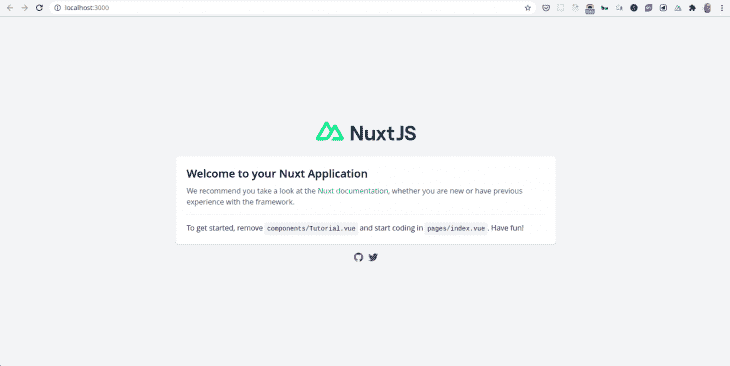

# 用 Vue 3、Nuxt 和 TypeScript 搭建一个应用程序

> 原文：<https://blog.logrocket.com/scaffolding-app-vue-3-nuxt-typescript/>

## 介绍

Nuxt 是 Vue.js 框架之上的一个高层框架。开箱即用，Nuxt 带有流行的 Vue 库，如 vue-router、vue-meta 和 Vuex，用于全局状态管理。

另外，Nuxt 使用了一些构建工具，比如 webpack、Babel 和 PostCSS。这些都是开箱即用的预配置。

受 Next.js 的启发，Nuxt 提供了动态服务器端渲染(SSR)。

## 为什么是 Nuxt？

如果 Vue 已经是一个框架了，有人可能会问，为什么是 Nuxt？

虽然 Vue 是一个很好的框架，但是 Nuxt 提供了一些额外的令人兴奋的特性，比如开箱即用的动态服务器端渲染。此外，Nuxt 旨在通过提供开箱即用的优化构建工具配置，并通过在一些相当复杂的 Vue 概念(如路由)上提供抽象层，使开发人员的生活更加轻松。

我们可以把对 Nuxt 的需求总结为三点:

### 功能齐全

Nuxt 附带了 Vue 和许多流行的 Vue 库，例如用于路由的 vue-router、用于全局状态管理的 vuex 和用于元标签处理的 vue-meta。

还有，Nuxt 非常通用。我们可以使用 Nuxt 来构建单页面应用(spa)、动态 SSR 和静态站点生成(SSG)。

### 提高

Nuxt 使用文件系统路由，它是 vue-router 之上的一个抽象层，根据`page`目录中的文件的文件树自动生成 vue-router 配置。

还有，Nuxt 用[布局组件](https://nuxtjs.org/docs/directory-structure/layouts/)和 [Nuxt 组件](https://nuxtjs.org/docs/features/nuxt-components/)的概念来增压 Vue 组件。

虽然 Vue 已经有了一个很好的转换 API，但是 Nuxt 通过处理一些复杂的情况(比如页面之间的转换)对它进行了改进。

### 最佳化

开箱即用，Nuxt 为 PostCSS、webpack 和 Babel 等构建工具提供了优化的配置。

此外，有了 SSR 支持、良好的 [meta 标签](https://nuxtjs.org/docs/features/meta-tags-seo/)处理和用于生成 SEO 友好 URL 的文件系统路由，我们的 Nuxt 应用程序可以针对 SEO 进行优化。

我们开箱即用的其他优化包括智能预取、自动代码分割和资产指纹或[缓存突发](https://www.keycdn.com/support/what-is-cache-busting)。

## Nuxt 和 TypeScript

简单地说，TypeScript 是 JavaScript 加上一个类型系统——帮助我们在开发过程中捕捉错误。

除此之外，TypeScript 还为我们的代码提供了一种自我文档的形式，这在大型应用程序中特别有用。

Nuxt TypeScript 支持主要由两个主要的 Nuxt 包提供，即`@nuxt/typescript-build`——在布局、组件、插件和中间件方面提供支持——和`@nuxt/types`——包含 Nuxt TypeScript 类型定义并与 Nuxt 核心一起维护。

我们可以通过运行以下命令来安装这些软件包:

```
yarn add --dev @nuxt/types
# OR
npm install --save-dev @nuxt/types

```

除了这些包，Nuxt 还使用`@nuxt/typescript-runtime`模块提供了可选的 TypeScript 运行时支持。根据文档，对于不是由 webpack 编译的文件，如`nuxt.config`文件、本地模块和`serverMiddlewares`，需要 TypeScript 运行时支持。

安装后，需要进一步的配置来为核心 Vue 特性提供类型脚本支持，例如选项 API、类 API、存储等等。你可以在我们关于 Nuxt.js 和 TypeScript 的[前一篇文章中了解所有这些。](https://blog.logrocket.com/how-to-set-up-and-code-nuxt-js-apps-fully-in-typescript/)

在本文中，我们将重点讨论如何使用 TypeScript 和 Vue 3 组合 API。让我们从下一部分开始吧。

## 入门指南

默认情况下，Vue 组合 API 不包含 Nuxt 特有的特性，比如服务器端呈现。Nuxt 组合 API 就是为此而开发的；它结合了 Vue 组合 API 和所有 Nuxt 特性。

根据文档，Nuxt composition API 模块会自动安装`[@vue/composition-api](https://github.com/vuejs/composition-api)`作为插件，所以我们不需要单独启用它。
同样，为了方便起见，Nuxt composition API 模块导出了`@vue/composition-api`方法和钩子，所以您可以直接从`@nuxtjs/composition-api`导入。

`@nuxtjs/composition-api`提供了一种使用 Vue 3 组合 API 和 Nuxt 特定特性的方法。根据[文档](https://composition-api.nuxtjs.org/getting-started/introduction/)，Nuxt 组合 API 的一些特性是:

*   支持 v2.12+中新的 Nuxt 获取
*   在组合 API `setup()`挂钩中提供对路由器、应用程序、商店的轻松访问
*   在`setup()`钩子中直接与你的 vue-meta 属性组合 API 交互
*   提供自动`SSR`纤维化和水合(`ssrRef`)的`ref`的替代产品
*   用打字稿写的

在下一节中，我们将使用 Nuxt、TypeScript 和 Nuxt composition API 构建一个远程作业板。

## 构建我们的应用

首先，我们通过运行来引导我们的应用程序:

```
yarn create nuxt-app <project-name>

or 

npx create-nuxt-app <project-name>

```

它会问你一些关于名字，Nuxt 选项，UI 框架，TypeScript 等问题。一定要选择 TypeScript。这将安装和配置上面讨论的 Nuxt TypeScript 模块。

现在，通过运行以下命令安装 Nuxt composition API 包:

```
// change into project directory
cd <project-name>

// install package
yarn add @nuxtjs/composition-api

```

然后通过修改`nuxt.config.js`文件启用模块，如下所示:

```
...
    buildModules: [
        // https://go.nuxtjs.dev/typescript
        '@nuxt/typescript-build',

        // @nuxtjs/composition-api
        '@nuxtjs/composition-api/module'
    ],
...

```

最后，运行以下命令启动应用程序:

```
yarn start

```

我们得到:



现在让我们创建我们的`types`。创建一个包含一个`Jobs.ts`和一个`OrderItem.ts`文件的类型目录。

将以下代码添加到`Jobs.ts`文件中:

```
interface Job {
    title: string;
    location: string;
    salary: number;
    id: string;
}
export default Job;

```

并将以下代码添加到`OrderItem.ts`文件中:

```
type OrderTerm = 'title' | 'salary' | 'location';
export default OrderTerm;

```

在`index.vue`文件中添加以下代码:

```
<template>
  <div class="app">
    <header>
      <div class="title">
        <h1>Remote Developer Jobs</h1>
      </div>
      <div class="order">
        <button @click="handleClick('title')">Order by title</button>
        <button @click="handleClick('salary')">Order by salary</button>
        <button @click="handleClick('location')">Order by location</button>
      </div>
    </header> 
    <JobList :jobs="jobs" :order="order" />
  </div>
</template>
<script lang="ts">
  import { defineComponent, ref } from '@nuxtjs/composition-api';
  import Job from '@/types/Jobs'
  import OrderTerm from '@/types/OrderItems'
  import JobList from '@/components/JobList.vue'
  export default defineComponent({
    name: 'App',
    components: { JobList },
    setup() {

      const jobs = ref<Job[]>([
        { title: 'React developer', location: 'New York', salary: 30000, id: '1' },
        { title: 'Nodejs developer', location: 'London', salary: 40000, id: '2' },
        { title: 'Flutter developer', location: 'Lagos', salary: 35000, id: '3' },
        { title: 'Vuejs developer', location: 'Boston', salary: 21000, id: '4' },
        { title: 'Svelte developer', location: 'San Francisco', salary: 32000, id: '5' }
      ])
      const order = ref<OrderTerm>('title')
      const handleClick = (term: OrderTerm) => order.value = term
      return { jobs, order, handleClick }
    }
  });
</script>
<style>
  header {
    text-align: center;
  }
  header .order {
    margin-top: 20px;
  }
  button {
    margin: 0 10px;
    color: #1195c9;
    border: 3px solid #1195c9;
    background: #d5f0ff;
    padding: 8px 16px;
    border-radius: 4px;
    cursor: pointer;
    font-weight: bold;
  }
  header .title{
    display: flex;
    justify-content: center;
  }
  header img {
    width: 60px;
    margin-right: 20px;
  }
  header h1 {
    font-size: 3em;
  }
</style>

```

在上面的代码中，我们通过使用`[defineComponent](https://v3.vuejs.org/guide/typescript-support.html#defining-vue-components)`全局方法定义了我们的组件。这使得 TypeScript 能够正确地对我们的 Vue 组件中的代码进行类型检查。

此外，我们使用`JobList`组件呈现了我们的作业列表，所以让我们创建该组件。删除组件目录中的文件，并在其中创建一个`JobList.vue`文件。将以下代码添加到`JobList.vue`文件中:

```
<template>
  <div class="job-list">
    <p>Ordered by {{ order }}</p>
    <transition-group name="list" tag="ul">
      <li v-for="job in orderedJobs" :key="job.id">
        <h2>{{ job.title }} in {{ job.location }}</h2>
        <div class="salary">
          <p>{{ job.salary }} rupees</p>
        </div>
        <div class="description">
          <p>Lorem ipsum dolor sit amet consectetur, adipisicing elit. Rem omnis voluptatum eius doloremque optio iusto sequi dignissimos. Pariatur earum assumenda dolores possimus quidem quam, reprehenderit aliquid consequuntur amet non facere.</p>
        </div>
      </li>
    </transition-group>
  </div>
</template>

<script lang="ts">
  import { defineComponent, PropType, computed } from '@nuxtjs/composition-api'
  import Job from '@/types/Jobs'
  import OrderTerm from '@/types/OrderItems'

  export default defineComponent({
    props: {
      jobs: {
        type: Array as PropType<Job[]>,
        required: true
      },
      order: {
        type: String as PropType<OrderTerm>,
        required: true
      }
    },
    setup(props) {
      const orderedJobs = computed(() => {
        return [...props.jobs].sort((a: Job, b: Job) => {
          return a[props.order] > b[props.order] ? 1 : -1
        })
      })
      return { orderedJobs }
    },
  })
</script>
<style scoped>
  .job-list {
    max-width: 960px;
    margin: 40px auto;
  }
  .job-list ul {
    padding: 0
  }
  .job-list li {
    list-style-type: none;
    background: white;
    padding: 16px;
    margin: 16px 0;
     border: 2px solid #1195c9;
    border-radius: 4px;
  }
  .job-list h2 {
    margin: 0 0 10px;
    text-transform: capitalize;
  }
  .salary {
    display: flex;
  }
  .salary img {
    width: 30px;
  }
  .salary p {
    color: #17bf66;
    font-weight: bold;
    margin: 10px 4px;
  }
  .list-move {
    transition: all 1s;
  }
</style>

```

我们上面的`JobList`组件需要两个`required`道具，分别是`jobs`和`order`。并且我们使用[类型断言](https://www.typescriptlang.org/docs/handbook/2/everyday-types.html#type-assertions)指定了这些道具的`types`。类型断言是 TypeScript 的一项功能，它使我们能够在 TypeScript 无法推断正确类型的情况下指定类型。正如我们在上面的组件中看到的，其中`jobs`属性是一个`Jobs`的数组，而`order`属性是一个`OrderItem`的数组。

因此，通过使用`propTypes`和泛型，我们使用类型断言指定了正确的属性类型。

最后，我们有:


## 结论

Nuxt 是一个很棒的框架，开箱即用，功能丰富，它提供了很多帮助，让开发人员的生活变得更加轻松。

另一方面，TypeScript 帮助开发人员在开发时捕捉错误，这有助于开发人员的体验和整体软件质量。

[组合 API](https://v3.vuejs.org/guide/composition-api-introduction.html#why-composition-api) 是编写 Vue 组件的新 API 概念。尽管 Composition API 并不反对 Options API，但它是构建大型应用程序的首选，在这些应用程序中，共享和重用代码是一个主要问题。

我希望在阅读完这篇文章之后，您已经掌握了足够的知识，可以开始在您的项目中使用这三个工具。如果您对源代码感兴趣，您可以在 [GitHub](https://github.com/lawrenceagles/nuxt-typescript) 上获得我们应用程序的完整代码。

## 像用户一样体验您的 Vue 应用

调试 Vue.js 应用程序可能会很困难，尤其是当用户会话期间有几十个(如果不是几百个)突变时。如果您对监视和跟踪生产中所有用户的 Vue 突变感兴趣，

[try LogRocket](https://lp.logrocket.com/blg/vue-signup)

.

[](https://lp.logrocket.com/blg/vue-signup)[https://logrocket.com/signup/](https://lp.logrocket.com/blg/vue-signup)

LogRocket 就像是网络和移动应用程序的 DVR，记录你的 Vue 应用程序中发生的一切，包括网络请求、JavaScript 错误、性能问题等等。您可以汇总并报告问题发生时应用程序的状态，而不是猜测问题发生的原因。

LogRocket Vuex 插件将 Vuex 突变记录到 LogRocket 控制台，为您提供导致错误的环境，以及出现问题时应用程序的状态。

现代化您调试 Vue 应用的方式- [开始免费监控](https://lp.logrocket.com/blg/vue-signup)。