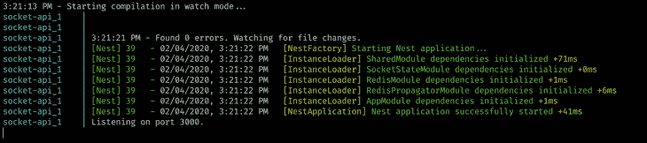
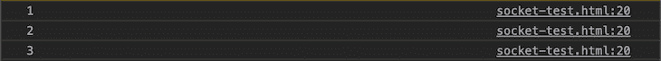
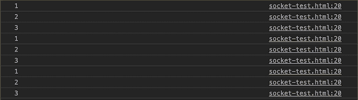

# 使用 NestJS 和 Redis - LogRocket 博客的可伸缩 WebSockets

> 原文：<https://blog.logrocket.com/scalable-websockets-with-nestjs-and-redis/>

当开发一个相对年轻的应用程序时，为了更快地实现功能，人们往往会忽略对可伸缩性的需求。然而，我相信即使在项目的最早期阶段，确保我们的代码尽可能具有可伸缩性也是至关重要的。

最近，当我在做一个项目时，我面临着向 NestJS 应用程序添加 WebSockets 的挑战。虽然由于惊人的[文档](https://docs.nestjs.com/websockets/gateways)，这是一个相对简单的任务，但是它有一个很大的缺点:它给以前无状态的应用程序引入了一个状态。

得益于 Docker 和 Kubernetes 等工具，如今的后端应用程序很容易扩展。创建一个应用程序的许多实例的复杂性已经大大降低了——也就是说，只要应用程序保持无状态。由于没有状态，应用程序可以关闭和再次打开，不会出现意外的行为。换句话说，应用程序很容易被丢弃。

WebSocket 协议的每个实现都必须将当前打开的连接保持在某种状态下。这意味着，如果我们有应用程序的两个实例，第二个实例分派的事件将永远不会到达连接到第一个实例的客户端。

也就是说，有一些方法可以在许多实例之间“共享”开放连接池。一种方法是使用 Redis 的发布/订阅机制在应用程序的所有实例之间转发发出的事件，以确保每个打开的连接都能接收到它们。

下面的实现完全包含了 Nest 生态系统，并涵盖了如下情况:仅向一个用户发出事件；向所有打开的连接发出事件；并将事件发送给所有经过身份验证的用户。

> **注意:**在 NestJS 文档中，有一个非常简单的方法，用几行代码就可以添加 Redis 来转发实例之间的事件。如果你正在寻找一个简单但有限的解决方案，看看这里的。如果您想自己找出如何实现上述机制，请继续。

本文假设您对 Docker、TypeScript 和 RxJS 有基本的了解。

## 设置嵌套应用程序

我已经在本文的[中详细描述了我将在这里使用的设置。简而言之，我们使用 Nest CLI 为我们搭建应用程序，使用 docker-compose 为 Docker 添加 Redis 和 Postgres 进行本地开发。](https://blog.logrocket.com/containerized-development-nestjs-docker/)

我建议你下载[库](https://github.com/maciejcieslar/scalable-websocket-nestjs)并跟着做，因为我将只解释相关的代码，而没有嵌套的样板文件，比如`modules`。

## add redis(添加歌词)

Redis 是内存中的数据结构存储，可以用作数据库、缓存或发布/订阅客户端。请注意，这些只是 Redis 的几种可能性。如果您有兴趣了解更多信息，请点击。

通常，你必须在你的电脑上安装 Redis，但是由于 Docker 把这个应用程序容器化了，我们不需要这么做。Docker 负责为我们安装和启动 Redis。

要从节点运行时与 Redis 通信，有几个库是可用的。我们将使用 [ioredis](https://github.com/luin/ioredis) ,因为它在保持强大性能的同时提供了大量的功能。

我们必须创建一个嵌套模块来封装与 Redis 相关的代码。在`[RedisModule](https://github.com/maciejcieslar/scalable-websocket-nestjs/tree/master/src/app/shared/redis)`中，我们有 providers 数组，在其中我们创建 ioredis 客户端来与 redis 通信。我们还实现了`RedisService`，它抽象出监听和发送 Redis 消息。

如上所述，我们创建了两个具有不同目的的 Redis 客户机:一个用于订阅，一个用于发布消息。

```
//redis.providers.ts

import { Provider } from '@nestjs/common';
import Redis from 'ioredis';

import { REDIS_PUBLISHER_CLIENT, REDIS_SUBSCRIBER_CLIENT } from './redis.constants';

export type RedisClient = Redis.Redis;

export const redisProviders: Provider[] = [
 {
   useFactory: (): RedisClient => {
     return new Redis({
       host: 'socket-redis',
       port: 6379,
     });
   },
   provide: REDIS_SUBSCRIBER_CLIENT,
 },
 {
   useFactory: (): RedisClient => {
     return new Redis({
       host: 'socket-redis',
       port: 6379,
     });
   },
   provide: REDIS_PUBLISHER_CLIENT,
 },
];
```

注意，`host`和`port`值通常通过某种形式的配置来配置，比如`ConfigService`，但是为了简单起见，这里省略了。

有了在`RedisModule`中注册的那些提供者，我们就能够将它们作为依赖项注入到我们的服务中。

所以让我们创建一个`RedisService`。

```
//redis.service.ts

import {
 REDIS_PUBLISHER_CLIENT,
 REDIS_SUBSCRIBER_CLIENT,
} from './redis.constants';
import { RedisClient } from './redis.providers';

export interface RedisSubscribeMessage {
 readonly message: string;
 readonly channel: string;
}

@Injectable()
export class RedisService {
 public constructor(
   @Inject(REDIS_SUBSCRIBER_CLIENT)
   private readonly redisSubscriberClient: RedisClient,
   @Inject(REDIS_PUBLISHER_CLIENT)
   private readonly redisPublisherClient: RedisClient,
 ) {}

 // ...
}
```

在构造函数中，我们按照预期注入了两个 Redis 客户端。

然后我们定义两个方法:`fromEvent`和`publish`。让我们先来看看`fromEvent`法。

```
 public fromEvent<T>(eventName: string): Observable<T> {
   this.redisSubscriberClient.subscribe(eventName);

   return Observable.create((observer: Observer<RedisSubscribeMessage>) =>
     this.redisSubscriberClient.on('message', (channel, message) => observer.next({ channel, message })),
   ).pipe(
     filter(({ channel }) => channel === eventName),
     map(({ message }) => JSON.parse(message)),
   );
 }
```

它通过使用`redisSubscriberClient`的 subscribe 方法告诉 Redis 留意所提供的事件。然后我们返回一个可观察值，在这个值中，我们通过在`message`事件上附加一个监听器来监听任何新消息。

当我们收到一个新消息时，我们首先检查`channel`(事件的 Redis 名称)是否等于提供的`eventName`。如果是，我们使用`JSON.parse`将重新发送的字符串转换成一个对象。

```
 public async publish(channel: string, value: unknown): Promise<number> {
   return new Promise<number>((resolve, reject) => {
     return this.redisPublisherClient.publish(channel, JSON.stringify(value), (error, reply) => {
       if (error) {
         return reject(error);
       }

       return resolve(reply);
     });
   });
 }
```

`publish`方法获取一个`channel`和一个未知的`value`，并使用`redisPublisherClient`来发布它。我们假设提供的值可以用`JSON.stringify`进行字符串化，因为 Redis 无法传输 JavaScript 对象。

通过这两种方法，我们成功地抽象出了所有连接到底层 Redis 客户端的麻烦代码，现在可以使用可靠的 API 通过使用`RedisService`在实例之间发送事件。

## 创建套接字状态

我们已经提到，当前打开的 WebSocket 连接必须保持某种状态。像 socket.io 这样的库，我们将在这里使用，为我们做这件事。

这些库提供了有用的方法，如`.send`或`.emit`，这使得以特定的格式获取当前活动的套接字(连接)变得非常困难。为了使我们更容易检索和管理套接字，我们将实现我们自己的套接字状态。

在我们的状态实现中，我们感兴趣的是检索指定用户的套接字。这样，如果 3 号实例分派了 ID 为`1234`的用户应该收到的事件，我们将能够很容易地检查所有实例是否有这个 ID 的用户的套接字。

* * *

### 更多来自 LogRocket 的精彩文章:

* * *

我们假设我们正在创建的应用程序支持某种身份验证。如何认证一个传入的套接字将在后面讨论；现在，让我们假设每个套接字都有一个可用的`userId`。

这真的很简单。我们将以下面的格式存储套接字:`Map<string, Socket[]>`。换句话说，键将是用户的`id`,相应的值将是他们所有的套接字。

让我们创建一个名为`[SocketStateModule](https://github.com/maciejcieslar/scalable-websocket-nestjs/blob/master/src/app/shared/socket-state/socket-state.module.ts)`的嵌套模块和负责保持状态的服务。

```
//socket-state-service.ts

@Injectable()
export class SocketStateService {
  private socketState = new Map<string, Socket[]>()

  // ...
}
```

首先，我们定义一个私有属性来保存地图中的状态，然后我们添加一些方法来简化服务的使用。

```
public add(userId: string, socket: Socket): boolean {
   const existingSockets = this.socketState.get(userId) || []

   const sockets = [...existingSockets, socket]

   this.socketState.set(userId, sockets)

   return true
 }
```

`add`方法将参数`userId`和`socket`作为参数，它们代表一个新打开的连接。首先，它在`existingSockets`中保存用户的现有套接字(或者一个空数组，如果没有现有套接字的话)。然后，它将提供的套接字附加到集合的末尾，并将新的套接字集合保存在状态中。

```
public remove(userId: string, socket: Socket): boolean {
   const existingSockets = this.socketState.get(userId)

   if (!existingSockets) {
     return true
   }

   const sockets = existingSockets.filter(s => s.id !== socket.id)

   if (!sockets.length) {
     this.socketState.delete(userId)
   } else {
     this.socketState.set(userId, sockets)
   }

   return true
 }
```

`remove`方法为用户从当前存在的套接字中过滤掉不需要的套接字。每个套接字都有一个唯一的`id`，可以用来检查是否相等。如果在删除套接字后，用户在该状态下不再有任何套接字，则该阵列将从映射中完全删除以节省内存。如果过滤后数组中还有一些套接字，我们只需将其设置回状态。

```
 public get(userId: string): Socket[] {
   return this.socketState.get(userId) || []
 }

 public getAll(): Socket[] {
   const all = []

   this.socketState.forEach(sockets => all.push(sockets))

   return all
 }
```

另外还有两种方法:`get`和`getAll`。在`get`方法中，我们返回属于给定用户的所有套接字(如果没有套接字，则返回一个空数组)。

在`getAll`中，我们利用`Map`的`forEach`方法，获取每个用户的套接字，并将它们合并成一个数组。

## 创建适配器

Nest 最好的特性之一是，它允许开发人员通过定义明确、可靠的抽象来处理底层库，如服务器的 Express 和 Fastify，或套接字的 socket.io 和 ws。

这样，从开发人员的角度来看，库很容易交换，而无需对代码库进行任何重大更改。为了让它工作，Nest 有自己的适配器集，这些适配器将一个库的 API“装配”到 Nest 期望的 API 上。这使得 Nest 很容易支持许多具有不同 API 的库。

由于我们想要跟踪当前打开的套接字，我们必须扩展 socket.io 的适配器。该适配器作为`@nestjs/platform-socket.io`包的一部分提供。通过扩展现有的适配器，我们可以只覆盖我们需要的方法，把其他的事情留给适配器。

在 Nest 的文档中，非常详细地解释了定制适配器是如何工作的，以及它们为什么如此强大。我建议[在继续之前阅读](https://docs.nestjs.com/websockets/adapter)。

```
export class SocketStateAdapter extends IoAdapter implements WebSocketAdapter {
 public constructor(
   private readonly app: INestApplicationContext,
   private readonly socketStateService: SocketStateService,
 ) {
   super(app);
 }

 private server: socketio.Server;

 public create(port: number, options: socketio.ServerOptions = {}): socketio.Server {
   this.server = super.createIOServer(port, options);

   this.server.use(async (socket: AuthenticatedSocket, next) => {
     const token = socket.handshake.query?.token || socket.handshake.headers?.authorization;

     if (!token) {
       socket.auth = null;

       // not authenticated connection is still valid
       // thus no error
       return next();
     }

     try {
       // fake auth
       socket.auth = {
         userId: '1234',
       };

       return next();
     } catch (e) {
       return next(e);
     }
   });

   return this.server;
 }

 public bindClientConnect(server: socketio.Server, callback: Function): void {
   server.on('connection', (socket: AuthenticatedSocket) => {
     if (socket.auth) {
       this.socketStateService.add(socket.auth.userId, socket);

       socket.on('disconnect', () => {
         this.socketStateService.remove(socket.auth.userId, socket);
       });
     }

     callback(socket);
   });
 }
}
```

我们的类扩展了`IoAdapter`并覆盖了两个方法:`create`和`bindClientConnect`。

顾名思义，`create`方法负责创建 WebSocket 服务器的实例。我们使用`IoAdapter`的`createIOServer`方法尽可能多地重用代码，并确保一切尽可能接近原始适配器。

然后我们建立了一个用于认证的中间件——在我们的例子中，是一个假的中间件。我们假设认证是基于令牌的。

在中间件中，我们首先检查是否在我们期望的地方提供了令牌:在`authorization`头中或者在查询的`token`参数中。

如果没有提供令牌，我们将`socket.auth`设置为空，并调用`next`继续执行其他中间件。如果有令牌，我们通常会用一个`AuthService`来检查和验证它，但这超出了本文的范围。

相反，我们将把经过验证的令牌的有效负载模拟为一个具有等于`1234`的单一属性`userId`的对象。令牌验证被放在一个`try/catch`块中，因为令牌验证方法会抛出一个错误。如果发生了，我们应该捕捉它，并使用 error 参数调用`next`,向 socket.io 指示发生了错误。

第二个方法是`bindClientConnect`，它负责在我们的套接字服务器中注册连接监听器。在这里，我们可以访问服务器，在这里我们可以监听`connect`事件。我们在`create`方法中定义的中间件将被预先执行，因此我们可以安全地检查 socket 对象的`auth`属性。

现在记住:我们也允许存在未认证的套接字，所以我们必须首先检查`auth`属性是否存在。如果是的话，我们使用之前定义的方法`socketStateService`将`socket`添加到用户的套接字池中。

我们还为`disconnect`事件注册了一个事件监听器，以将`socket`从状态中移除。为了完全确定我们没有任何内存泄漏，我们使用了`socket`对象的`removeAllListeners`方法来移除`disconnect`事件监听器。

不管是否有`auth`属性，我们都必须调用作为第二个参数提供的`callback`函数，让 socket.io 适配器也保持对套接字的引用。

要注册我们的定制适配器，我们必须使用嵌套应用程序的`useWebSocketAdapter`方法:

```
//adapter.init.ts

export const initAdapters = (app: INestApplication): INestApplication => {
 const socketStateService = app.get(SocketStateService);
 const redisPropagatorService = app.get(RedisPropagatorService);

 app.useWebSocketAdapter(new SocketStateAdapter(app, socketStateService, redisPropagatorService));

 return app;
};
```

`redisPropagatorService`解释如下。

```
//main.ts

async function bootstrap(): Promise<void> {
 const app = await NestFactory.create(AppModule);

 initAdapters(app);

 await app.listen(3000, () => {
   console.log(`Listening on port 3000.`);
 });
}

bootstrap();
```

## 创建 Redis 事件传播器

有了 Redis 集成和我们自己的套接字状态和适配器，剩下要做的就是创建最后一个跨应用程序所有实例调度事件的服务。

为此，我们必须再创建一个名为`[RedisPropagatorModule](https://github.com/maciejcieslar/scalable-websocket-nestjs/blob/master/src/app/shared/redis-propagator/redis-propagator.module.ts)`的嵌套模块。\

在`RedisPropagatorService`中，我们将监听来自其他实例的任何传入的 Redis 事件，并向它们发送事件。瞧啊。我们自己的发布/订阅服务！

通过 Redis 的事件有三种类型:

*   向所有打开的连接发出事件
*   仅向通过身份验证的用户发出事件
*   仅向指定用户发出事件

在代码中，我们将对它们进行如下定义:

```
export const REDIS_SOCKET_EVENT_SEND_NAME = 'REDIS_SOCKET_EVENT_SEND_NAME';
export const REDIS_SOCKET_EVENT_EMIT_ALL_NAME =
 'REDIS_SOCKET_EVENT_EMIT_ALL_NAME';
export const REDIS_SOCKET_EVENT_EMIT_AUTHENTICATED_NAME =
 'REDIS_SOCKET_EVENT_EMIT_AUTHENTICATED_NAME';
```

现在让我们创建服务:

```
@Injectable()
export class RedisPropagatorService {
 private socketServer: Server;

 public constructor(
   private readonly socketStateService: SocketStateService,
   private readonly redisService: RedisService,
 ) {}

 public propagateEvent(eventInfo: RedisSocketEventSendDTO): boolean {
   if (!eventInfo.userId) {
     return false;
   }

   this.redisService.publish(REDIS_SOCKET_EVENT_SEND_NAME, eventInfo);

   return true;
 }

 public emitToAuthenticated(eventInfo: RedisSocketEventEmitDTO): boolean {
   this.redisService.publish(
     REDIS_SOCKET_EVENT_EMIT_AUTHENTICATED_NAME,
     eventInfo,
   );

   return true;
 }

 public emitToAll(eventInfo: RedisSocketEventEmitDTO): boolean {
   this.redisService.publish(REDIS_SOCKET_EVENT_EMIT_ALL_NAME, eventInfo);

   return true;
 }

 // ...
}
```

在构造函数中，我们使用了之前创建的两个服务。我们定义了三种有用的方法。它们都做一件简单的事情:用提供的信息调度预期的 Redis 事件。唯一的区别是在`propagateEvent`方法中，我们不想发布事件，除非提供了`userId`。

除此之外，`emitToAll`和`emitToAuthenticated`方法都可以从我们代码库中的任何地方调用。`propagateEvent`的情况并非如此；每当我们的 socket 服务器向前端客户端发送事件时，都会调用这个方法。

### 监听事件调度程序

为了最大限度地利用 Nest 生态系统，我们将创建一个拦截器来访问每个套接字事件响应。这样，我们就不必在每个网关中手动调用`propagateEvent`。

```
//redis-propagator.interceptor.ts

@Injectable()
export class RedisPropagatorInterceptor<T> implements NestInterceptor<T, WsResponse<T>> {
 public constructor(private readonly redisPropagatorService: RedisPropagatorService) {}

 public intercept(context: ExecutionContext, next: CallHandler): Observable<WsResponse<T>> {
   const socket: AuthenticatedSocket = context.switchToWs().getClient();

   return next.handle().pipe(
     tap((data) => {
       this.redisPropagatorService.propagateEvent({
         ...data,
         socketId: socket.id,
         userId: socket.auth?.userId,
       });
     }),
   );
 }
}
```

拦截器可以订阅由`next.handle()`方法返回的可观察对象。我们的服务器发送的每个 WebSocket 事件都会经过这里。通过使用 RxJS' `tap`方法，我们可以对响应做出反应而不改变它。

每个调度的事件，在返回到前端客户端之前，在我们的所有实例中传播，其中我们将事件发送到属于用户的所有套接字。

请记住，`auth`对象是可选的，所以我们使用 TypeScript 新的可选链接语法来确保我们的代码在没有`auth`对象时不会中断。

在`propagateEvent`方法中，我们拒绝没有`userId`的事件。这是因为此类事件无意跨实例传播，因为连接是唯一的。

记住，无论是否使用了`propagateEvent`方法，事件都会被发送到前端客户端。所以如果没有`auth`对象，网关发送的事件还是会到达前端客户端。我们只是确保它被发送到用户可能已经打开的所有其他套接字。

我们将在文章结尾的例子中展示如何附加拦截器。

### 在`RedisPropagatorService`中创建事件监听器

除了将事件分派给其他实例之外，我们还希望监听来自其他实例的事件。

```
@Injectable()
export class RedisPropagatorService {
 // ...

 private socketServer: Server;

 public constructor(
   private readonly socketStateService: SocketStateService,
   private readonly redisService: RedisService,
 ) {
   this.redisService
     .fromEvent(REDIS_SOCKET_EVENT_SEND_NAME)
     .pipe(tap(this.consumeSendEvent))
     .subscribe();

   this.redisService
     .fromEvent(REDIS_SOCKET_EVENT_EMIT_ALL_NAME)
     .pipe(tap(this.consumeEmitToAllEvent))
     .subscribe();

   this.redisService
     .fromEvent(REDIS_SOCKET_EVENT_EMIT_AUTHENTICATED_NAME)
     .pipe(tap(this.consumeEmitToAuthenticatedEvent))
     .subscribe();
 }

 public injectSocketServer(server: Server): RedisPropagatorService {
   this.socketServer = server;

   return this;
 }
}
```

多亏了`redisService`，我们可以轻松订阅 Redis 活动。使用 RxJS `tap`操作符，我们可以调用我们的方法之一来对可观察的事件流做出适当的反应。

### 改变`socketStateAdapter`

我们还创建了一个`injectSocketServer`方法，让我们将一个 WebSocket 服务器实例注入到我们的服务中。通过依赖注入来实现这一点会更好，但是在编写定制适配器时这实际上是不可能的。然而，有了这个方法，我们必须调整适配器的代码:

```
export class SocketStateAdapter extends IoAdapter implements WebSocketAdapter {
 public constructor(
   private readonly app: INestApplicationContext,
   private readonly socketStateService: SocketStateService,
   private readonly redisPropagatorService: RedisPropagatorService,
 ) {
   super(app);
 }

 public create(port: number, options: socketio.ServerOptions = {}): socketio.Server {
  const server = super.createIOServer(port, options);
  this.redisPropagatorService.injectSocketServer(server);
  // ...
}
```

我们使用了依赖注入来获得`redisPropagatorService`的实例，在创建 WebSocket 服务器的过程中，我们简单地将它注入到我们的 singleton 服务中。

说完这些，让我们回到我们的`redisPropagatorService`并定义用于监听事件的方法。

### `consumeSendEvent`方法

首先，我们将创建一个名为`consumeSendEvent`的方法来监听 Redis 事件，该事件告诉我们向指定的用户发送一个事件。

```
 private consumeSendEvent = (eventInfo: RedisSocketEventSendDTO): void => {
   const { userId, event, data, socketId } = eventInfo;

   return this.socketStateService
     .get(userId)
     .filter((socket) => socket.id !== socketId)
     .forEach((socket) => socket.emit(event, data));
 };
```

在`eventInfo`中，我们传递以下信息:

```
export class RedisSocketEventSendDTO {
 public readonly userId: string;
 public readonly socketId: string;
 public readonly event: string;
 public readonly data: unknown;
}
```

知道将事件发送到哪里(`userId`)、事件的名称是什么(`event`)、它应该包含什么数据(`data`)以及事件来自哪个套接字(`socketId`，我们就可以安全地将事件发送到现有用户的套接字。

我们首先获取用户的套接字，通过使用提供的`socketId`过滤套接字来确保我们不会两次发送相同的事件，然后使用每个套接字的`emit`方法来发送事件。

如果当前没有为用户打开的套接字(如果用户在某个其他实例上只有一个打开的连接，就会出现这种情况)，`socketStateService`的 get 方法将返回一个空数组，并且后面的所有方法都不会被执行。

在拦截器内部，我们使用`propagateEvent`方法将事件发送到我们所有的实例。然后，事件被发送到前端客户端。这就是我们跟踪事件起源的套接字的原因:确保我们不会在同一个套接字上两次发送相同的事件。

### `consumeEmitToAllEvent`

```
 private consumeEmitToAllEvent = (
   eventInfo: RedisSocketEventEmitDTO,
 ): void => {
   this.socketServer.emit(eventInfo.event, eventInfo.data);
 };
```

这个方法非常简单——所要做的就是使用套接字服务器的`emit`方法将事件发送给所有当前打开的连接，无论是否经过身份验证。

### `consumeEmitToAuthenticated`

```
 private consumeEmitToAuthenticatedEvent = (
   eventInfo: RedisSocketEventEmitDTO,
 ): void => {
   const { event, data } = eventInfo;

   return this.socketStateService
     .getAll()
     .forEach((socket) => socket.emit(event, data));
 };
```

在`consumeEmitToAuthenticated`方法中，我们利用了`socketStateService`的`getAll`方法。在获得所有经过身份验证的套接字后，我们使用套接字的 emit 方法来发送事件。

## 工作示例

最后要做的事情是创建一个网关来监听传入的事件，并检查是否一切都按预期工作。

```
@UseInterceptors(RedisPropagatorInterceptor)
@WebSocketGateway()
export class EventsGateway {
 @SubscribeMessage('events')
 public findAll(): Observable<any> {
   return from([1, 2, 3]).pipe(
     map((item) => {
       return { event: 'events', data: item };
     }),
   );
 }
}
```

通过使用`@UseInterceptors`装饰器，我们注册了跨所有实例发出事件的拦截器。如果我们希望传播事件，拦截器必须在我们创建的每个网关上注册。

现在来看一个简单的带有 socket.io 客户端库的 HTML 文件:

```
<!DOCTYPE html>
<html lang="en">
 <head>
   <meta charset="UTF-8" />
   <meta name="viewport" content="width=device-width, initial-scale=1.0" />
   <meta http-equiv="X-UA-Compatible" content="ie=edge" />
   <title>Sockets test</title>
 </head>
 <body>
   <script src="https://cdnjs.cloudflare.com/ajax/libs/socket.io/2.3.0/socket.io.dev.js"></script>
   <script>
     window.s = io('http://localhost:3000', {
       query: {
         token: '123',
       },
     });

     s.emit('events', { event: 'events', data: { test: true } });
     s.on('events', (response) => {
       console.log(response);
     });
   </script>
 </body>
</html>
```

提供的令牌明显是假的，我们只是想模拟有一个。

从[库](https://github.com/maciejcieslar/scalable-websocket-nestjs)获取代码后，为了启动应用程序，运行:

```
docker-compose up
```



服务器启动并运行后，打开文件并检查控制台:



知道提供了一个令牌，我们可以通过打开第二个选项卡来检查两个选项卡是否应该接收相同的事件(因为它们是来自一个用户的两个会话):



通过刷新一个选项卡，我们使第二个选项卡也接收事件。我们的事件通过 Redis 客户端，然后客户端将它们转发到它们来自的同一个实例，但是这一次，我们只将它发送到还没有接收到事件的套接字。

完整代码可在[这里](https://github.com/maciejcieslar/scalable-websocket-nestjs)获得。

## 摘要

当将 WebSockets 添加到我们的应用程序中时，我们面临着一个决定:我们的应用程序是否是可伸缩的。一旦应用程序需要跨多个实例进行复制，预先决定采用可伸缩的解决方案会让我们受益匪浅。由于 Nest 的模块化，一旦实现，该解决方案可以很容易地复制到其他项目中。

确保我们的应用程序是可伸缩的是一项艰巨的工作。在很大程度上，这需要我们彻底改变思维。但这绝对值得。

## 使用 [LogRocket](https://lp.logrocket.com/blg/signup) 消除传统错误报告的干扰

[](https://lp.logrocket.com/blg/signup)

[LogRocket](https://lp.logrocket.com/blg/signup) 是一个数字体验分析解决方案，它可以保护您免受数百个假阳性错误警报的影响，只针对几个真正重要的项目。LogRocket 会告诉您应用程序中实际影响用户的最具影响力的 bug 和 UX 问题。

然后，使用具有深层技术遥测的会话重放来确切地查看用户看到了什么以及是什么导致了问题，就像你在他们身后看一样。

LogRocket 自动聚合客户端错误、JS 异常、前端性能指标和用户交互。然后 LogRocket 使用机器学习来告诉你哪些问题正在影响大多数用户，并提供你需要修复它的上下文。

关注重要的 bug—[今天就试试 LogRocket】。](https://lp.logrocket.com/blg/signup-issue-free)