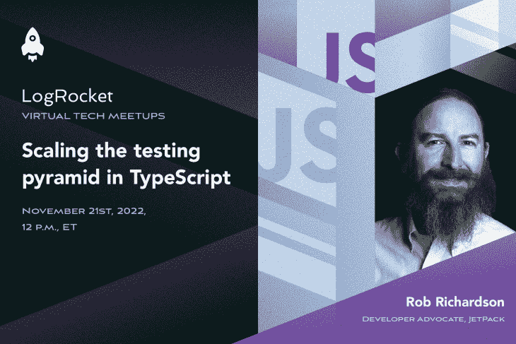

# 在 TypeScript 中攀登测试金字塔

> 原文：<https://blog.logrocket.com/scaling-the-testing-pyramid-in-typescript/>

加入 Rob Richardson

**November 21st at 12 p.m. ET**

并深入研究类型脚本测试。单元测试？集成测试？模仿？存根？假货？这如何应用于网络？

我们将看看测试 web 应用程序的所有方法，并演示您将使用的所有工具。我们将对大多数测试进行现场编码，向您展示什么是好的测试策略。您将带着一个 GitHub repo 离开，您可以用它来继续学习或在您自己的 PWAs 中使用。

在本次会议中，您将清楚地了解:

*   你应该考虑使用哪种测试
*   每个空间都有哪些工具可用
*   如何在 TypeScript 中构建测试
*   如何用模拟替换导入和函数参数
*   如何测试组件、API 和用户体验

#### 您的主持人:

Rob Richardson 是一名软件工匠，在 ASP.NET 和 Node、React 和 Vue 建立网站。他是微软的 MVP，出版作家，经常在会议上发言。

#### 注册 meetup:

November 21st | 12 p.m. ET

之后要发送的录音

### 谢谢大家！

我们已经收到你的活动注册。