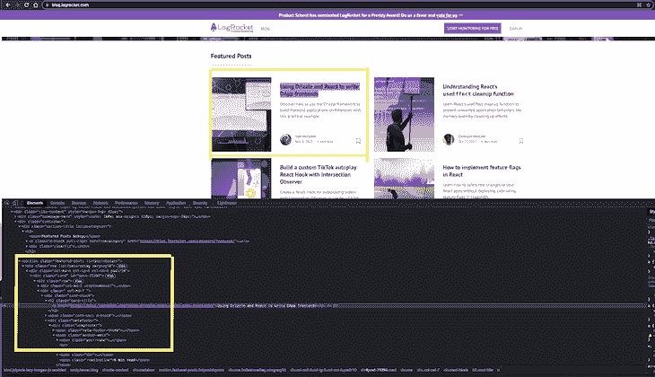

# 用 Python、Scrapy 和 MongoDB 创建一个网站

> 原文：<https://blog.logrocket.com/scrape-website-python-scrapy-mongodb/>

## 介绍

数据已经成为一种新的商品，而且是一种昂贵的商品。随着人们在网上创建无限的内容，不同网站上的数据量增加了，许多初创公司提出了需要这些数据的想法。不幸的是，由于时间和资金的限制，他们不能总是自己制作

这个问题的一个流行解决方案是[网络爬行和抓取](https://blog.logrocket.com/build-python-web-scraper-beautiful-soup/)。随着机器学习应用对数据需求的增加，网络爬行变得非常流行。网络爬虫读取网站的来源(使用标记)，这使得很容易找到要提取的模式。

然而，爬行器是低效的，因为它们将抓取 HTML 标签中的所有内容，然后开发人员必须验证和清理数据。这就是 Scrapy 这样的工具的用武之地。Scrapy 是一个网络抓取器，而不是一个爬虫，因此对它将收集的数据类型更有辨别能力。

在接下来的章节中，您将了解 Scrapy，Python 最流行的抓取框架，以及如何使用它。

## Scrapy 简介

Scrapy 是一个用 Python 编写的快速、高级 web 爬行框架。它是免费和开源的，用于大规模的网页抓取。

Scrapy 利用蜘蛛，它决定了一个网站(或一组网站)应该如何抓取你想要的信息。蜘蛛是定义如何抓取网站，以及如何从一组页面中提取结构化数据的类。

## 入门指南

就像任何其他 Python 项目一样，最好创建一个单独的虚拟环境，这样库就不会搞乱现有的基础环境。本文假设您已经安装了 Python 3.3 或更高版本。

### 1.创建虚拟环境

本文将使用`.venv`名称作为虚拟环境。您可以随意更改它，但是，请确保在整个项目中使用相同的名称。

```
mkdir web-scraper
cd web-scraper
python3 -m venv .venv

```

### 2.激活虚拟环境

对于 Windows，请使用以下内容:

```
.venv\Scripts\activate

```

对于 Linux 和 OSX:

```
source .venv/bin/activate

```

该命令将启用新的虚拟环境。它是新的，因此不包含任何内容，所以您必须安装所有需要的库。

### 3.设置 Scrapy

因为 Scrapy 是一个框架，它会自动安装其他需要的库:

```
pip install scrapy

```

要安装 Scrapy，请遵循[官方文档](https://docs.scrapy.org/en/latest/intro/install.html)。

## 刮痧日志火箭专题文章

要理解任何框架，最好的方法是边做边学。说了这么多，还是刮刮 LogRocket 精选文章和各自的评论吧。

### 基本设置

让我们从创建一个空白项目开始:

```
scrapy startproject logrocket

```

接下来，用下面的代码创建你的第一个蜘蛛:

```
cd logrocket
scrapy genspider feature_article blog.logrocket.com

```

让我们看看目录结构是什么样子的:

```
web-scraper
├── .venv
└── logrocket
    ├── logrocket
    │   ├── __init__.py
    │   ├── items.py
    │   ├── middlewares.py
    │   ├── pipelines.py
    │   ├── settings.py
    │   └── spiders
    │       ├── __init__.py
    │       └── feature_article.py
    └── scrapy.cfg

```

## 编写第一只蜘蛛

现在项目已经成功建立，让我们创建我们的第一个蜘蛛，它将从 [LogRocket 博客](https://blog.logrocket.com)中抓取所有的特色文章。

打开`spiders/feature_article.py`文件。

让我们一步一步来，首先从博客页面获取特色文章:

```
import scrapy

class FeatureArticleSpider(scrapy.Spider):
    name = 'feature_article'
    allowed_domains = ['blog.logrocket.com']
    start_urls = ['http://blog.logrocket.com']

    def parse(self, response):
        feature_articles = response.css("section.featured-posts div.card")
        for article in feature_articles:
            article_dict = {
                "heading": article.css("h2.card-title a::text").extract_first().strip(),
                "url": article.css("h2.card-title a::attr(href)").extract_first(),
                "author": article.css("span.author-meta span.post-name a::text").extract_first(),
                "published_on": article.css("span.author-meta span.post-date::text").extract_first(),
                "read_time": article.css("span.readingtime::text").extract_first(),
            }
            yield article_dict

```

在上面的代码中可以看到，`scrapy.Spider`定义了一些属性和方法。它们是:

*   `name`，定义了蜘蛛，在项目中必须是唯一的
*   `allowed_domains`，允许我们抓取的域名列表
*   我们开始抓取的网址列表
*   `parse()`，被调用来处理请求的响应。它通常解析响应，提取数据，并以`dict`的形式输出数据

## 选择正确的 CSS 元素

在刮取的过程中，知道唯一标识您希望刮取的元素的最佳方式是很重要的。

最好的方法是在浏览器中检查元素。你可以很容易地在开发者工具菜单中看到 HTML 结构。



## 运行第一个蜘蛛

使用以下命令运行上面的蜘蛛程序:

```
scrapy crawl feature_article

```

应该所有的特色文章都是这样的:

```
...
...
{'heading': 'Understanding React’s ', 'url': 'https://blog.logrocket.com/understanding-react-useeffect-cleanup-function/', 'author': 'Chimezie Innocent', 'published_on': 'Oct 27, 2021', 'read_time': '6 min read'}
2021-11-09 19:00:18 [scrapy.core.scraper] DEBUG: Scraped from <200 https://blog.logrocket.com/>
...
...

```

## 介绍项目

抓取的主要目标是提取非结构化数据，并将其转换为有意义的结构化数据。Items 提供了一个类似 dict 的 API，带有一些很棒的附加特性。你可以在这里阅读更多关于[物品的信息。](https://docs.scrapy.org/en/latest/topics/items.html)

让我们创建第一个项目，通过它的属性来指定文章。这里我们用`dataclass`来定义。

用以下内容编辑`items.py`:

```
from dataclasses import dataclass

@dataclass
class LogrocketArticleItem:
    _id: str
    heading: str
    url: str
    author: str
    published_on: str
    read_time: str

```

然后，更新`spiders/feature_article.py`文件，如下所示:

```
import scrapy
from ..items import LogrocketArticleItem

class FeatureArticleSpider(scrapy.Spider):
    name = 'feature_article'
    allowed_domains = ['blog.logrocket.com']
    start_urls = ['http://blog.logrocket.com']

    def parse(self, response):
        feature_articles = response.css("section.featured-posts div.card")
        for article in feature_articles:
            article_obj = LogrocketArticleItem(
                _id = article.css("::attr('id')").extract_first(),
                heading = article.css("h2.card-title a::text").extract_first(),
                url = article.css("h2.card-title a::attr(href)").extract_first(),
                author = article.css("span.author-meta span.post-name a::text").extract_first(),
                published_on = article.css("span.author-meta span.post-date::text").extract_first(),
                read_time = article.css("span.readingtime::text").extract_first(),
            )
            yield article_obj

```

## 获取每个帖子的评论

让我们更深入地去创造蜘蛛。为了获得每篇文章的评论，您需要请求每篇文章的 url，然后获取评论。

为此，让我们首先创建用于注释的条目(`item.py`):

```
@dataclass
class LogrocketArticleCommentItem:
    _id: str
    author: str
    content: str
    published: str

```

现在注释项已经准备好了，让我们编辑`spiders/feature_article.py`，如下所示:

```
import scrapy
from ..items import (
    LogrocketArticleItem,
    LogrocketArticleCommentItem
)

class FeatureArticleSpider(scrapy.Spider):
    name = 'feature_article'
    allowed_domains = ['blog.logrocket.com']
    start_urls = ['http://blog.logrocket.com']

    def get_comments(self, response):
        """
        The callback method gets the response from each article url.
        It fetches the article comment obj, creates a list of comments, and returns dict with the list of comments and article id.
        """
        article_comments = response.css("ol.comment-list li")
        comments = list()
        for comment in article_comments:
            comment_obj = LogrocketArticleCommentItem(
                _id = comment.css("::attr('id')").extract_first(),
                # special case: author can be inside `a` or `b` tag, so using xpath
                author = comment.xpath("string(//div[@class='comment-author vcard']//b)").get(),
                # special case: there can be multiple p tags, so for fetching all p tag inside content, xpath is used.
                content = comment.xpath("string(//div[@class='comment-content']//p)").get(),
                published = comment.css("div.comment-metadata a time::text").extract_first(),
            )
            comments.append(comment_obj)

        yield {"comments": comments, "article_id": response.meta.get("article_id")}

    def get_article_obj(self, article):
        """
        Creates an ArticleItem by populating the item values.
        """
        article_obj = LogrocketArticleItem(
            _id = article.css("::attr('id')").extract_first(),
            heading = article.css("h2.card-title a::text").extract_first(),
            url = article.css("h2.card-title a::attr(href)").extract_first(),
            author = article.css("span.author-meta span.post-name a::text").extract_first(),
            published_on = article.css("span.author-meta span.post-date::text").extract_first(),
            read_time = article.css("span.readingtime::text").extract_first(),
        )
        return article_obj

    def parse(self, response):
        """
        Main Method: loop through each article and yield the article.
        Also raises a request with the article url and yields the same.
        """
        feature_articles = response.css("section.featured-posts div.card")
        for article in feature_articles:
            article_obj = self.get_article_obj(article)
            # yield the article object
            yield article_obj
            # yield the comments for the article
            yield scrapy.Request(
                url = article_obj.url,
                callback = self.get_comments,
                meta={
                    "article_id": article_obj._id,
                }
            )

```

现在，用同样的命令运行上面的蜘蛛:

```
scrapy crawl feature_article

```

## 在 MongoDB 中持久化数据

既然我们有了正确的数据，现在让我们将相同的数据持久化到数据库中。我们将使用 MongoDB 来存储刮下的项目。

### 初始步骤

在将 MongoDB 安装到您的系统中之后，使用 pip 安装 [PyMongo](https://pymongo.readthedocs.io/en/stable/) 。PyMongo 是一个 Python 库，包含与 MongoDB 交互的工具。

```
pip3 install pymongo

```

接下来，在`settings.py`中添加新的 Mongo 相关设置。另外，在 Mongo 中创建一个数据库和集合:

```
# MONGO DB SETTINGS
MONGO_HOST="localhost"
MONGO_PORT=27017
MONGO_DB_NAME="logrocket"
MONGO_COLLECTION_NAME="featured_articles"

```

## 管道管理

既然您已经设置了爬行和解析 HTML 的蜘蛛，并且设置了数据库设置。

接下来，我们必须通过`pipelines.py`中的管道将两者连接起来:

```
from itemadapter import ItemAdapter
import pymongo
from scrapy.utils.project import get_project_settings
from .items import (
    LogrocketArticleCommentItem,
    LogrocketArticleItem
)
from dataclasses import asdict

settings = get_project_settings()

class MongoDBPipeline:
    def __init__(self):
        conn = pymongo.MongoClient(
            settings.get('MONGO_HOST'),
            settings.get('MONGO_PORT')
        )
        db = conn[settings.get('MONGO_DB_NAME')]
        self.collection = db[settings['MONGO_COLLECTION_NAME']]

    def process_item(self, item, spider):
        if isinstance(item, LogrocketArticleItem): # article item
            self.collection.update({"_id": item._id}, asdict(item), upsert = True)
        else:
            comments = []
            for comment in item.get("comments"):
                comments.append(asdict(comment))
            self.collection.update({"_id": item.get("article_id")}, {"$set": {"comments": comments} }, upsert=True)

        return item

```

在`settings.py`中添加该管道:

```
USER_AGENT='Mozilla/5.0 (Windows NT 10.0; Win64; x64) AppleWebKit/537.36 (KHTML, like Gecko) Chrome/61.0.3163.100 Safari/537.36'
ITEM_PIPELINES = {'logrocket.pipelines.MongoDBPipeline': 100}

```

## 最后试验

再次运行爬网命令，并检查项目是否被正确推送到数据库:

```
scrapy crawl feature_article

```

## 结论

在本指南中，您已经学习了如何用 Scrapy 编写基本的 spiders 并在数据库(MongoDB)中持久化抓取的数据。你只是触及了 Scrapy 作为一个网络抓取工具的表面，除了我们在这里讨论的，还有很多东西需要学习。

我希望从这篇文章中，你得到了 Scrapy 的基本知识，并有动力用这个奇妙的刮擦工具更深入地学习。

## 使用 [LogRocket](https://lp.logrocket.com/blg/signup) 消除传统错误报告的干扰

[](https://lp.logrocket.com/blg/signup)

[LogRocket](https://lp.logrocket.com/blg/signup) 是一个数字体验分析解决方案，它可以保护您免受数百个假阳性错误警报的影响，只针对几个真正重要的项目。LogRocket 会告诉您应用程序中实际影响用户的最具影响力的 bug 和 UX 问题。

然后，使用具有深层技术遥测的会话重放来确切地查看用户看到了什么以及是什么导致了问题，就像你在他们身后看一样。

LogRocket 自动聚合客户端错误、JS 异常、前端性能指标和用户交互。然后 LogRocket 使用机器学习来告诉你哪些问题正在影响大多数用户，并提供你需要修复它的上下文。

关注重要的 bug—[今天就试试 LogRocket】。](https://lp.logrocket.com/blg/signup-issue-free)