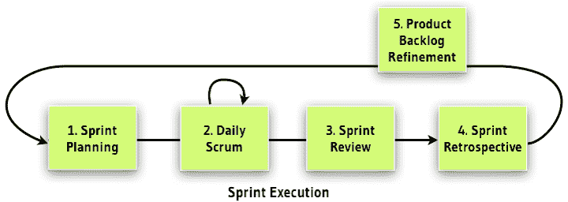
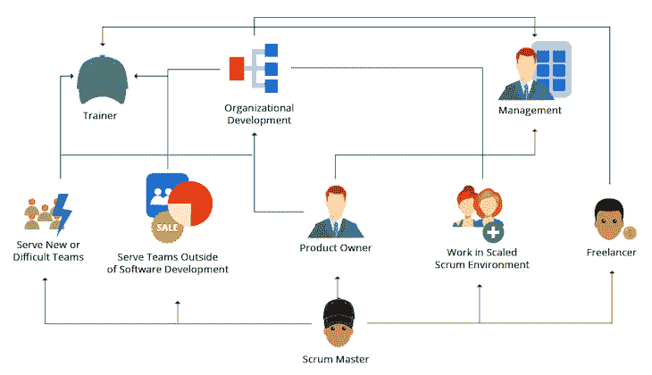

# 什么是 scrum 大师？工作描述，认证，等等

> 原文：<https://blog.logrocket.com/product-management/scrum-master-job-description-certifications/>

在本指南中，我们将定义 scrum 大师的角色。我们将分解 scrum master 的职责，描述这个人与其他 scrum 角色(产品负责人和 scrum 团队)的关系，并提供提示、资源和认证，如果你想成为 scrum master 的话。

* * *

## 目录

* * *

## scrum 是什么？

在我们进入 scrum master 这个角色之前，我们应该澄清一下我们所说的 scrum 是什么意思。不知道某样东西是什么，你就无法理解如何成为它的主人！

Scrum 的名字来源于橄榄球，在这种比赛中，一个小型的球员团队(称为 scrum)聚集在一起，推动对手并控制球。

在[敏捷产品开发](https://blog.logrocket.com/product-management/four-agile-manifesto-values-explained/)中，scrum 描述了一个帮助团队一起工作的框架。Scrum 提倡紧密协作、集中注意力和持续改进，以推动开发并控制产品交付。

Source: [Bryan Marshall](https://www.bryanmarshall.com/scrum-meetings/)

## 什么是 scrum 大师？

scrum 指南 由 scrum 的联合创始人 Ken Schwaber 和 Jeff Sutherland 撰写，描述了 scrum 框架和其中的三个具体角色:产品负责人、Scrum 团队和 scrum master。

scrum master 在 scrum 团队中有一些具体的活动要执行，但是他们的基本职责是指导团队在 scrum 框架内工作，并确保团队能够保持运转，让他们对团队的有效性负责。

因此，如果你的组织想要使用 scrum 作为它的产品交付框架，它将需要找到一个专门负责 scrum master 角色的人来确保团队保持有效。

## scrum 大师是做什么的？

顾名思义，scrum master 就是带领团队走向成功的人。因此，他们也领导了许多的 scrum 仪式，例如[每日 scrum 会议](https://blog.logrocket.com/product-management/the-daily-scrum-meeting-overview-best-practices-anti-patterns/)、[待办事项细化会议](https://blog.logrocket.com/product-management/what-is-backlog-grooming-aka-refinement/)和[冲刺回顾](https://blog.logrocket.com/product-management/what-is-a-sprint-retrospective-templates-and-best-practices/)。这包括与团队成员合作和交流，推动清晰，并培养开放和学习的态度。

Source: [Barry Overeem](https://medium.com/the-liberators/my-journey-as-a-scrum-master-75d95cb4a54d)

当谈到 scrum 大师的日常活动时，他们做什么通常取决于他们在和谁一起工作。scrum master 与给定角色的关系可能与他们与不同角色或部门的关系非常不同。

### scrum 大师和产品负责人

产品负责人负责[定义产品目标](https://blog.logrocket.com/product-management/what-is-a-product-vision-statement-examples/)和[确定 sprint 中正在处理的待办事项](https://blog.logrocket.com/product-management/sprint-backlog-how-to-prioritize-examples/)的优先级。因此，他们与 scrum 大师的关系是 scrum 团队成功的关键。

scrum master 通过分享产品成功的愿景来支持[产品负责人](https://blog.logrocket.com/product-management/what-does-a-product-manager-do-role-responsibilities/#product-manager-vs-product-owner)，并帮助向 scrum 团队传达所有待办事项的需求。

例如，如果 scrum 团队不清楚某个特定用户故事的含义，或者对某个特定问题的最佳解决方案有疑问，scrum master 可以提供建议并阐明潜在的方法。

scrum 大师和产品负责人共同拥有让 scrum 团队获得巨大成功或巨大失败的力量。因此，他们的关系是关键。

### scrum 大师和 scrum 团队

scrum 团队的责任是完成为 sprint 选择的用户故事，并交付 [sprint 目标](https://blog.logrocket.com/product-management/what-is-sprint-planning-guide-meeting-agenda-cheat-sheet/#do-you-need-to-set-a-sprint-goal)。scrum 大师是促成这一成功的关键。

scrum 大师能够指导团队如何在 scrum 框架内工作。他们帮助管理包含在 sprint 中的工作，并确保所有涉众都清楚期望和期望的最终结果。

简而言之，scrum master 的工作是清除任何威胁团队及时交付 sprint 目标能力的障碍。

例如，如果目标是交付一个新的主页图片轮播，那么 scrum master 的工作就是推动设计团队交付要在轮播中使用的图片。这可能包括与设计师交谈以获取图像文件，与设计经理交谈以签署设计，和/或与内容团队交谈以确认字幕副本。无论如何都要帮助 scrum 团队保持在正确的轨道上和截止日期前。

### scrum 大师和商业

scrum master 如何与业务的其他部分合作？这种互动类似于我们已经看到的与产品负责人和 scrum 团队的互动。不同之处在于，他们关注的是实际团队之外的事情。

scrum 大师可以扮演一个教育者的角色，帮助企业理解 scrum 框架、它的好处以及它的工作方式。企业越了解工作是如何交付的，就越有可能在框架内工作——这只会提高公司提供[相关 KPI](https://blog.logrocket.com/product-management/what-metrics-kpis-product-managers-track/)、[适应不断变化的需求](https://blog.logrocket.com/product-management/12-agile-manifesto-principles-how-to-adopt-them/#2-welcome-changing-requirements)等的能力。跨部门工作时。

scrum master 还负责为整个业务中的各种利益相关者消除任何障碍，这就是为什么这个角色需要广泛的利益相关者管理技能。

## scrum master 的工作描述是什么？

如果我们要根据上面描述的职责来写一份 scrum master 的工作描述，我们会得到类似下面这样的结果。

scrum 大师应该:

*   管理在可用时间框架内要完成的工作范围
*   领导冲刺仪式，例如每日的 scrum 和冲刺回顾
*   与产品负责人一起定义要完成的工作
*   消除成功的冲突和障碍
*   让 scrum 团队专注于交付冲刺目标
*   成为 scrum 团队内外的主要沟通者
*   蔻驰负责 scrum 团队以及 scrum 框架上的其他业务

至于成为 scrum 大师所需的技能，一个合格的候选人应该是:

*   有组织有重点
*   具有良好人际交往技巧的出色沟通者
*   在利益相关者管理方面经验丰富
*   天生的问题解决者
*   熟悉 scrum 框架及其角色、流程和仪式
*   精通团队使用的技术

## 如何成为 scrum 大师

许多角色为那些寻求成为 scrum 大师的人提供了理想的背景，包括产品负责人，但是大多数 scrum 大师通常从某种形式的项目经理角色开始。

这些解决问题、以人为中心的工作需要在专注的 scrum 团队中灵活运用的技能。然而，如果你目前还没有这样的角色，有很多资源可以帮助你了解如何成为一名 scrum 大师。

Source: [Zeolearn](https://www.zeolearn.com/magazine/scrum-master-career-path)

一个很好的起点是 scrum，scrum 框架的官方网站。这个网站充满了关于 scrum master 角色及其参与框架的[信息。它还为您提供了一些开放式评估，您可以在其中测试您当前的知识水平。](https://www.scrum.org/resources/what-is-a-scrum-master)

### Scrum master 认证

像 [Scrum Alliance](https://www.scrumalliance.org/) 、[项目管理学院](https://www.pmi.org/)和 [Scrum Inc](https://www.scruminc.com/scrum-master-training/) 这样的提供商提供认可的 scrum master 认证。还有许多其他的产品管理认证项目也在做同样的事情。

scrum master 认证的类型包括:

当评估 scrum master 认证提供商时，你应该像[选择产品管理认证](https://blog.logrocket.com/product-management/product-management-certifications/#choosing-the-right-certification-program)一样对待它。如何评估你的能力？教学和考核流程是怎样的？你需要有任何先前的经验来旁听这门课程吗？这要花多少钱？

### 向 scrum 大师职业过渡

和许多职业一样，在你现有的组织中可能有机会转变成 scrum master 角色。对于与 scrum 团队密切合作的角色，以及已经具备上述必备技能的候选人来说，尤其如此。

例如，也许你是 scrum 团队的一名开发人员，你喜欢管理活动、解决问题以及与他人密切合作。也许你是一个喜欢指导别人 scrum 方法的产品负责人。

* * *

订阅我们的产品管理简讯
将此类文章发送到您的收件箱

* * *

无论是哪种情况，当新的机会出现时，你与现有 scrum 大师的亲密关系以及与团队的合作经验都将对你大有裨益。

Scrum master 可能是一个非常有价值的角色，所以如果它听起来适合你，我会鼓励你试一试。

*精选图片来源:[icon scout](https://iconscout.com/icon/team-leader-3843475)*

## [LogRocket](https://lp.logrocket.com/blg/pm-signup) 产生产品见解，从而导致有意义的行动

[LogRocket](https://lp.logrocket.com/blg/pm-signup) 确定用户体验中的摩擦点，以便您能够做出明智的产品和设计变更决策，从而实现您的目标。

使用 LogRocket，您可以[了解影响您产品的问题的范围](https://logrocket.com/for/analytics-for-web-applications)，并优先考虑需要做出的更改。LogRocket 简化了工作流程，允许工程和设计团队使用与您相同的[数据进行工作](https://logrocket.com/for/web-analytics-solutions)，消除了对需要做什么的困惑。

让你的团队步调一致——今天就试试 [LogRocket](https://lp.logrocket.com/blg/pm-signup) 。