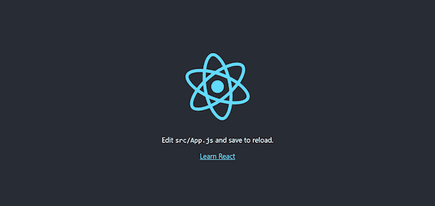

# 搜索优化的温泉与反应头盔日志火箭博客

> 原文：<https://blog.logrocket.com/search-optimized-spas-react-helmet/>

每个开发者都希望他们的网站出现在搜索结果页面的顶部。不幸的是，搜索引擎爬虫还没有可靠地理解/呈现 JavaScript，这意味着建立在 React、Angular 等之上的 spa。通常不受搜索引擎爬虫的青睐。对于许多开发人员来说，这可能是一个重要的问题。服务器端渲染(SSR)可以解决这个问题，但它也有其局限性。

[React 头盔](https://github.com/nfl/react-helmet/)是 React 的文档头管理器。它使得在服务器和客户端上更新元标签变得容易，这意味着这个库是使你的应用程序 SEO 和社交媒体友好的完美选择。在本文中，我们将看到如何将 React 头盔添加到您的项目中并使用它。

## 设置

使用 create-react-app 初始化一个新的 React 项目，并启动开发服务器。

```
npx create-react-app react-helmet-tutorial
cd react-helmet-tutorial
npm start
```

除非你系统的端口 3000 被占用，否则你可以直接去`[http://localhost:3000](http://localhost:3000)`看看你的应用。



像大多数 spa 一样，你的应用有一个默认的`<head>`元素；你可以通过点击 Chrome 中的 **F12** 或 Firefox 中的 **Ctrl+Shift+C** 在浏览器中打开检查器来验证这一点。

这是`<head>`元素的样子:

```
<head>
    <meta charset="utf-8">
    <link rel="icon" href="/favicon.ico">
    <meta name="viewport" content="width=device-width, initial-scale=1">
    <meta name="theme-color" content="#000000">
    <meta name="description" content="Web site created using create-react-app">
    <link rel="apple-touch-icon" href="/logo192.png">

    <link rel="manifest" href="/manifest.json">

    <title>React App</title>
  <style type="text/css">
   <!-- CSS -->
  </style>
</head>
```

管理这个`<head>`的一种方法是更新`public/index.html`，但是这并不总是最佳的。

## 安装和使用

您可以使用 npm 或 Yarn 将 React 头盔安装到项目中:

```
npm install react-helmet
# OR, using Yarn:
yarn add react-helmet
```

要使用 React Helmet，首先要导入`Helmet`组件，然后在文档的`<head>`中添加想要的元素。

```
// src/App.js

import React from "react";
import "./App.css";
import { Helmet } from "react-helmet";

function App() {
  return (
    <div className="App">

      <Helmet>
        <html lang="en" />
        <title>React Helmet Tutorial</title>
        <meta name="description" content="Tutorial for React Helmet" />
        <meta name="theme-color" content="#E6E6FA" />
      </Helmet>

      <header className="App-header">Title will be React Helmet Tutorial</header>
    </div>
  );
}
export default App;
```

只要你更新了`src/App.js`文件，你就会看到 React 应用的`title`发生了变化。

在本例中，只使用了`description`和`theme-color`的`<title>`、`<html>`和`<meta>`元素，但是您可以使用其他元素，如`title`、`base`、`meta`、`link`、`script`、`noscript`和`style`作为`Helmet`的子元素。

您还可以为`body`和`html`标签设置属性。例如:

```
 <Helmet>
        {/* html attributes */}
        <html lang="en" />

        {/* body attributes */}
        <body className="dark" />

        {/* title element */}
        <title>React Helmet Tutorial</title>

        {/* base element */}
        <base target="_blank" href="https://blog.logrocket.com/" />

        {/* meta elements */}
        <meta name="description" content="Tutorial for React Helmet" />

        <meta name="theme-color" content="#E6E6FA" />

        {/* link elements */}
        <link rel="canonical" href="https://blog.logrocket.com/" />
</Helmet>
```

### 谁有优先权:孩子还是父母？

在父组件和子组件之间，优先选择子组件。例如，如果您有一个子组件，如下所示:

```
// src/Child.js

import React from "react";
import { Helmet } from "react-helmet";
function Child() {
  return (
    <div>
      <Helmet>
        <title>Child Component Rocks!</title>
      </Helmet>
     {"  "}  This time title will be  Child Component Rocks! 
    </div>
  );
}
export default Child;
```

并且你将这个子组件(即`Child.js`)导入到父组件(即`App.js`)中，文档的标题会根据子组件而改变，但是元`description`和`theme-color`不会被覆盖。

```
// src/App.js

import React from "react";
import "./App.css";
import { Helmet } from "react-helmet";
import Child from "./Child";
function App() {
  return (
    <div className="App">
      <Helmet>
        <title>React Helmet Tutorial</title>
        <meta name="description" content="Tutorial for React Helmet" />
        <meta name="theme-color" content="#E6E6FA" />
      </Helmet>

      <header className="App-header">
        Title will not be React Helmet Tutorial <Child />
      </header>
    </div>
  );
}
export default App;
```

在两个子组件之间，稍后使用的那个将被给予优先权。例如，如果有两个子组件，即`<Child1 />`和`<Child2 />`，那么在`App.js`文件中稍后使用的组件将被优先考虑。

```
// src/App.js
import React from "react";
import "./App.css";
import { Helmet } from "react-helmet";
import Child1 from "./Child1";
import Child2 from "./Child2";
function App() {
  return (
    <div className="App">
      <Helmet>
        <title>React Helmet Tutorial</title>
        <meta name="description" content="Tutorial for React Helmet" />
        <meta name="theme-color" content="#E6E6FA" />
      </Helmet>
      <header className="App-header">
        Title will not be React Helmet Tutorial 

        <Child1 />
        <Child2 />
      </header>
    </div>
  );
}
export default App;
```

在上面的代码中，将根据`<Child2 />`组件设置标题。

如果颠倒顺序，将根据`<Child1 />`进行设置:

```
<header className="App-header">
        Title will not be React Helmet Tutorial 
        <Child2 />
        <Child1 />
</header>
```

## SSR 和 React 头盔

如上所述，React 头盔是服务器端渲染 React 应用程序的完美合作伙伴。可以参考[这里](https://blog.logrocket.com/why-you-should-render-react-on-the-server-side-a50507163b79/)设置一个基本的 React SSR app。

在您的服务器端代码中，在您调用 ReactDOMServer 的`renderToString`或`renderToStaticMarkup`之后，您需要使用头盔的`renderStatic`方法。

下面是一个服务器端渲染的例子:

```
// server/index.js
import React from "react";
import { renderToString } from "react-dom/server";
import express from "express";
import App from "./src/App";
import { Helmet } from "react-helmet";
const app = express();  

app.get("/*", (req, res) => {
  const app = renderToString(<App />);
  const helmet = Helmet.renderStatic();

  const html = `
  <!DOCTYPE html>
  <html ${helmet.htmlAttributes.toString()}>
    <head>
      ${helmet.title.toString()}
      ${helmet.meta.toString()}
      ${helmet.link.toString()}
    </head>
    <body ${helmet.bodyAttributes.toString()}>
      <div id="root">
        ${app}
      </div>
      </body>
  </html>
`;
  res.send(html);
});
app.listen(8000);
```

每个`helmet`属性包含一个`toString()`方法，该方法在`html`字符串中使用。头盔的`renderStatic`返回一个带有所有属性的实例，比如标题、meta、链接、脚本等。，而所有这些属性都有一个`toString()`方法。

## 反应头盔异步

React 头盔可能不总是 SSR 的最佳选择，因为它是同步工作的。如果您正在进行异步请求，尤其是流式请求，React 头盔可能会导致潜在的错误和问题。

[react-头盔-异步](https://github.com/staylor/react-helmet-async)是 React 头盔的一个分支，明确解决了这个问题。您可以通过运行以下命令来安装它:

```
npm i react-helmet-async
```

一切都保持不变，除了在 react-helmet-async 中，您需要使用`HelmetProvider`在客户端和服务器端封装 react 树。

```
// src/App.js
import React from "react";
import "./App.css";
import  {Helmet, HelmetProvider } from 'react-helmet-async';
function App() {
  return (
    <HelmetProvider>
    <div className="App">
      <Helmet>
        <title>React Helmet Tutorial</title>
        <meta name="description" content="Tutorial for React Helmet" />
        <meta name="theme-color" content="#E6E6FA" />
      </Helmet>
      <header className="App-header">
        Title will be React Helmet Tutorial 
      </header>
    </div>
    </HelmetProvider>
  );
}
export default App;
```

## 使用 React 头盔和 React 路由器

当你的应用程序使用类似于 [React Router](https://reactrouter.com/) 的东西进行路由时，React 头盔尤其有益。在这种情况下，您将需要在每条路线上使用 React 头盔。这里有一个例子来说明:

```
// src/App.js
import React from "react";
import { Helmet } from "react-helmet";
import { BrowserRouter, Switch, Route, Link } from "react-router-dom";
import Home from './Home'
import About from './About'
export default function App() {
  return (
    <div>
      <BrowserRouter>
        <Switch>
          <Route exact path="/">
            <Home />
          </Route>
          <Route path="/about">
            <About />
          </Route>
        </Switch>
      </BrowserRouter>
    </div>
  );
}
```

其中`Home.js`是:

```
// src/Home.js
import React from "react";
import { Helmet } from "react-helmet";
import {  Link } from "react-router-dom";

const Home = () => (
  <div>
    <Helmet>
      <title>Home</title>
    </Helmet>
    <h2>Home.</h2>
    <Link to="/about">About</Link>
  </div>
);

export default Home
```

而`About.js`是:

```
// src/About.js
import React from "react";
import { Helmet } from "react-helmet";
import {  Link } from "react-router-dom";

const About = () => (
  <div>
    <Helmet>
      <title>About</title>
    </Helmet>
    <h2>About.</h2>
    <Link to="/">Home</Link>
  </div>
);
export default About
```

对于任意数量的路由，可以重复同样的操作。你可以在这里探索这个例子[。](https://stackblitz.com/edit/react-hqrtsx?file=src/App.js)

## 结论

在本文中，我们看到了如何安装和使用 React 头盔，一个文件头管理器。它小巧易用，对你的项目很有帮助。

以下是一些您可能会觉得有用的资源:

## 使用 LogRocket 消除传统反应错误报告的噪音

[LogRocket](https://lp.logrocket.com/blg/react-signup-issue-free)

是一款 React analytics 解决方案，可保护您免受数百个误报错误警报的影响，只针对少数真正重要的项目。LogRocket 告诉您 React 应用程序中实际影响用户的最具影响力的 bug 和 UX 问题。

[ ](https://lp.logrocket.com/blg/react-signup-general) [  ](https://lp.logrocket.com/blg/react-signup-general) [LogRocket](https://lp.logrocket.com/blg/react-signup-issue-free)

自动聚合客户端错误、反应错误边界、还原状态、缓慢的组件加载时间、JS 异常、前端性能指标和用户交互。然后，LogRocket 使用机器学习来通知您影响大多数用户的最具影响力的问题，并提供您修复它所需的上下文。

关注重要的 React bug—[今天就试试 LogRocket】。](https://lp.logrocket.com/blg/react-signup-issue-free)