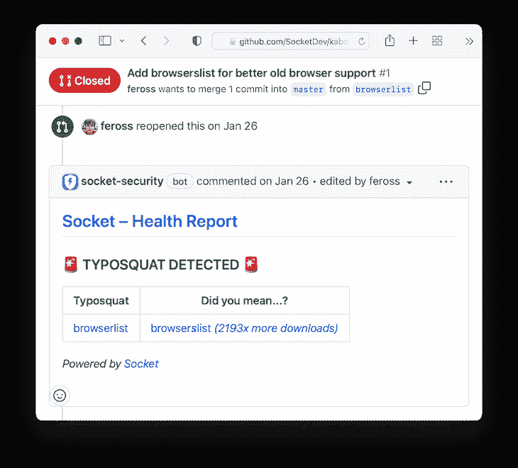
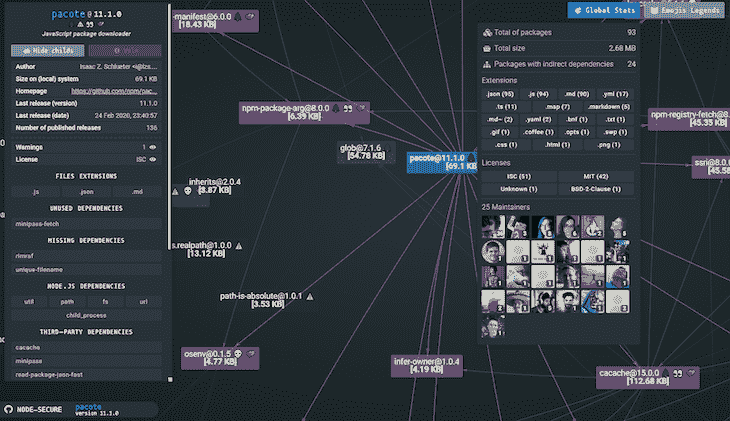

# 保护开源 Node.js 依赖项的 3 种方法

> 原文：<https://blog.logrocket.com/secure-open-source-node-js-dependencies/>

随着 Node.js 应用程序在大小和功能方面的扩展，它们的依赖性也随之扩展。为了使 Node.js 应用程序按预期运行，您还需要测试框架、UI 框架、数据库客户端、Express 之类的 MVC 库等等。

然而，黑客越来越多地瞄准这些依赖类型来发起供应链攻击，在这些攻击中，他们将恶意代码注入第三方软件。研究人员还发现，配置不良的构建过程使应用程序更容易受到这类攻击。

在本文中，我们将回顾最近开源的用于提高 Node.js 依赖项安全性的三个工具，包括 Socket、Node-Secure CLI 和 N|Solid。我们开始吧！

## 什么是开源依赖？

如果任何人都可以查看、修改或改进源代码，那么软件就被认为是开源的。任何人都可以访问和使用源代码，要么增强原始软件，要么创建完全不同的东西。GitHub 等流行的托管服务托管了许多这样的开源项目。

当开发人员决定在他们的应用程序中使用另一个软件包中已经存在的特性，而不是从头开始编码时，原始的软件包就成为他们自己项目中的一个依赖项。

开发人员经常选择开源依赖项，因为它们可以免费获得。开发人员可以访问源代码，这意味着他们可以浏览源代码，了解软件包是如何构建的。他们可以添加他们认为合适的特性，自行重新发布，甚至联系开源项目的原始作者，将他们添加的内容合并到现有代码中。

然而，偶尔会有许可证附加到开源依赖项上，对使用该依赖项的软件能做什么和不能做什么施加一些限制。例如，一些许可证不允许开发者销售利用开源依赖的软件。因此，仔细检查开源许可并确保您的项目符合规范是非常重要的。

npm 是 Node.js 的包管理器。它创建于 2009 年，是一个开源项目，旨在帮助 JavaScript 开发人员轻松共享打包的模块作为依赖项。

## 开源依赖既是无价的，也是有风险的

许多软件开发团队依赖开源来实现认证等特性，从而加快了整体开发时间。然而，使用这些依赖关系会使项目暴露于攻击之下，使它们面临嵌入恶意软件的风险。

依赖关系可以分为可传递的和直接的。直接依赖项是您的代码直接引用的库，而传递依赖项是您的依赖项链接到的库。本质上，传递依赖是你的依赖的依赖。由于传递依赖性，开发人员经常不知道他们正在使用的开源库的数量。

根据 Veracode 进行的研究，在 2020 年访问的 85，000 个应用程序中，71%在初始扫描时在开源库中存在漏洞，其中 47%的漏洞来自传递依赖。JavaScript 应用程序是罪魁祸首，占这个数字的 87%。

当你安装一个依赖项时，你也引入了它的所有问题，比如安全缺陷甚至是 bug。例如，如果用于生成用户详细信息的开源库存在跨站点脚本漏洞，那么您的整个软件都容易受到攻击，从而使您和您的用户面临数据被盗的风险。作为开发人员，您有责任确保他人编写的代码不会使您的系统不安全。

## 确保开源 Node.js 依赖项的安全性

对于开发人员来说，跟踪应用程序中使用的每个依赖项是很重要的，包括直接依赖项和传递依赖项。如果开发人员不知道他们正在使用的依赖项，他们就无法保护自己免受开源安全和许可证合规性问题的影响。

定期的代码审查有助于开发团队跟踪依赖性以及依赖于它们的项目部分。开发人员应该始终关注他们使用的软件包的安全声明。当有新的更新时，更新依赖项也是一个很好的做法，密切关注补丁发布，这些补丁有时会修复已报告的漏洞。

Veracode 的上述研究报告称，75%的已知缺陷可以通过对代码进行较小的修改或修补来轻松修复。但是，开发人员也可以使用工具来扫描依赖关系树以发现安全风险。有许多工具可以集成到应用程序的构建过程中，并检测软件中的所有开源组件，生成关于许可、清单和安全性的报告。让我们回顾三个最受欢迎的。

## (电源)插座

根据其文档， [Socket](https://nodesource.com/blog/NSolid-SaaS-is-now-free) 以在供应链攻击发生之前检测并阻止它们而闻名，从而防止了最糟糕的可能结果。Socket 对包及其所有依赖项(包括传递依赖项)运行静态分析，以寻找特定的风险标记。它使用深度包检查来剥离依赖关系的层，并表征其实际行为。

Socket 通过防止任何受损或被劫持的包渗入您的供应链来确保安全性。它监视对您的`package.json`的实时更改，检测依赖项更新何时引入新的危险 API 用法，包括网络、shell、文件系统等等。最后，它阻止开源代码中的任何危险信号，包括恶意软件、域名抢注、隐藏代码、误导性软件包、权限蔓延等等。

Socket 不仅检测依赖关系中的漏洞，还提供关于依赖关系风险的可操作的反馈。要使用 Socket，请安装 [Socket GitHub 应用程序](https://socket.dev/github-app),以获得每个拉取请求的实时依赖性扫描和报告:



## 节点安全 CLI

[Node-Secure CLI 是来自](https://github.com/NodeSecure/cli) [NodeSecure](https://github.com/NodeSecure) 的 Node js 命令行工具。它获取并深入分析给定 npm 包或带有`package.json`的本地项目的依赖树，输出一个包含所有元数据和每个包的标志的`.json`文件。CLI 能够打开 JSON 代码并显示网络中的所有依赖关系，帮助您识别潜在的安全威胁和问题:



有了生成的数据，就有可能快速识别跨项目和包的各种安全和质量问题。npm 上提供了节点安全 CLI 包[。您可以使用下面的命令轻松安装它:](https://www.npmjs.com/package/@nodesecure/ci)

```
npm install @nodesecure/cli -g
```

安装后，`nsecure`二进制文件将在终端中可用。要查看所有可用的命令，请运行`nsecure --help`。

## 固体

[N|Solid](https://nodesource.com/blog/NSolid-SaaS-is-now-free) 是来自 [NodeSource](https://nodesource.com/) 的一个可观察性和洞察力工具，用于管理 Node.js 的性能和安全性。借助 N|Solid，可以直接从您的应用架构和堆栈中收集数据，然后在 N|Solid 控制台中以清晰、用户友好的方式进行组织和显示。

通过一系列的测试，npm 包被评分，以让开发者了解他们的软件暴露在多大的风险中，以及如何减轻风险。Node.js 包根据安全性、合规性和代码质量进行评估。要开始使用 [N|Solid，请访问注册页面](https://accounts.nodesource.com/sign-up)。

## 结论

对于开发人员来说，更好地意识到他们在项目中引入的依赖关系是一种很好的做法，可以减少黑客在开源依赖关系中插入恶意代码的可能性。

为您的团队创建开源使用策略，监控开源依赖项的使用，以及注意新的漏洞，将有助于显著提高开源依赖项的安全性。

在本文中，我们回顾了 Socket、Node-Secure CLI 和 N|Solid，这三个开源工具用于运行关于项目中可传递依赖项和直接依赖项的安全性的报告。这些还可以帮助您审查许可和库存，防止您和您的应用程序用户将来遇到麻烦。

## 200 只显示器出现故障，生产中网络请求缓慢

部署基于节点的 web 应用程序或网站是容易的部分。确保您的节点实例继续为您的应用程序提供资源是事情变得更加困难的地方。如果您对确保对后端或第三方服务的请求成功感兴趣，

[try LogRocket](https://lp.logrocket.com/blg/node-signup)

.

[](https://lp.logrocket.com/blg/node-signup)[https://logrocket.com/signup/](https://lp.logrocket.com/blg/node-signup)

LogRocket 就像是网络和移动应用程序的 DVR，记录下用户与你的应用程序交互时发生的一切。您可以汇总并报告有问题的网络请求，以快速了解根本原因，而不是猜测问题发生的原因。

LogRocket 检测您的应用程序以记录基线性能计时，如页面加载时间、到达第一个字节的时间、慢速网络请求，还记录 Redux、NgRx 和 Vuex 操作/状态。

[Start monitoring for free](https://lp.logrocket.com/blg/node-signup)

.