# 在 React Native apps 中使用 Auth0 实现安全的无密码认证- LogRocket 博客

> 原文：<https://blog.logrocket.com/secure-passwordless-authentication-react-native-auth0/>

**无密码认证**可以理解为在不提供密码的情况下验证用户身份的过程。可以断言，任何不使用密码验证用户的方法都属于这一类。一些更无密码的技术是:

*   生物认证
*   使用验证器应用程序
*   基于知识的认证等等

## 为什么没有密码？

密码通常很难记住，容易受到网络钓鱼攻击。我们给它加上一些数字，根据 [Retruster 统计分析](https://retruster.com/blog/2019-phishing-and-email-fraud-statistics.html)，这里是仅 2019 年钓鱼攻击的状态:

*   数据泄露的平均财务成本为 386 万美元(IBM)
*   网络钓鱼占数据泄露的 90%
*   15%被成功钓鱼的人在一年内至少还会被盯上一次
*   BEC 诈骗造成了超过 120 亿美元的损失(FBI)
*   去年，网络钓鱼企图增长了 65%
*   每月大约会产生 150 万个新的网络钓鱼网站(Webroot)
*   76%的企业报告去年成为网络钓鱼攻击的受害者
*   30%的网络钓鱼邮件被目标用户打开(威瑞森)

最近发生的与数据泄露和网络钓鱼攻击相关的事件迫使我们寻找更安全的方法来处理身份认证和身份验证。这就引出了无密码认证。

> 据 [Gartner](https://www.gartner.com/smarterwithgartner/embrace-a-passwordless-approach-to-improve-security/) 副总裁分析师 [Ant Allan](https://www.gartner.com/analyst/17792/Ant-Allan) 称:
> 
> Gartner 预测，到 2022 年，60%的大型和全球性企业以及 90%的中型企业将在超过 50%的使用案例中实施无密码方法，高于 2018 年的 5%

这使得现在是开始为这个看似不可避免的事实做准备的好时机，这个世界最终将没有通行证。

## 我们将建造什么

在这篇文章中，我打算向您展示如何使用 [Auth0](https://auth0.com/) 在 React 本机应用程序中实现无密码认证。我们将从头开始，构建一个登录页面，验证用户的身份，并返回访问应用程序和执行其他操作所需的必要凭据:

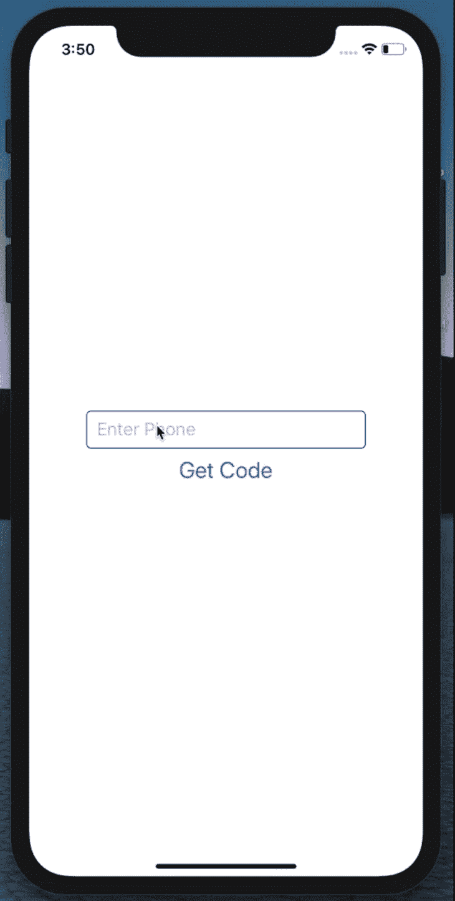

## 先决条件

在我们开始之前，让我们先澄清一下你需要知道的事情。

*   写这篇文章的时候，假设你过去没有做过无密码认证，所以如果这是你第一次，你会很好，但是，有认证原则的知识会更好
*   [Auth0](https://auth0.com/) —我们将使用 Auth0 作为示例应用程序的唯一身份验证提供者。关于 Auth0 的先验知识将会非常有帮助，但是，这并不是一个障碍，因为我们将会详细讨论它
*   [Twilio](https://www.twilio.com/)–您需要一个 Twilio 帐户来支持我们的短信服务功能
*   需要安装一些有用的工具——如果你的电脑上还没有安装 Node，那就从这里安装它，同时安装 [Auth0 React Native SDK](https://www.npmjs.com/package/react-native-auth0) 和 [webview](https://www.npmjs.com/package/react-native-webview) 。我将很快向您展示如何安装它们

## 入门指南

首先，让我们创建一个 React 原生项目。如果这是您第一次使用 React Native，请确保安装所需的依赖项并相应地遵循这些步骤。

### 使用 npm 安装 React 本机 CLI 工具，如下所示:

```
npm install -g react-native-cli
```

之后，继续运行这些 React 本机命令来创建并启动一个新项目。

### 创建新项目并启动服务器:

```
react-native init auth

cd auth && npx react-native run-ios // Start the iOS simulator
// OR
cd auth && npx react-native run-android // Start the android emulator
```

如果你已经安装了 [Xcode](https://developer.apple.com/xcode/) 或者 [Android Studio](https://developer.android.com/studio) ，那么上面的命令将运行这个项目，你应该让模拟器像这样出现在屏幕上:


> 这里我用的是 Xcode。

现在我们已经创建了项目并在本地运行，让我们安装一些构建应用程序所需的包:

*   首先，您需要安装我们将用于身份验证的 Auth0 React Native SDK 和 React native webview 库:

```
npm install react-native-auth0 react-native-webview
//OR
yarn add react-native-auth0 react-native-webview
```

*   然后用 Cocoapods 安装 iOS 应用 pods:

```
cd ios && pod install
```

## 无密码流程

使用 Auth0，下面是无密码实现的工作方式。Auth0 的无密码认证流程是一个两步验证系统，接受用户的电子邮件地址或电话号码。如果您决定通过电话进行身份验证，您可以通过使用用户的电话号码请求代码来启动流程，授权代码将发送到他们的电话号码:

```
auth0.auth
  .passwordlessWithSMS({
    phoneNumber: '+5491159991000',
  })
  .then(console.log)
  .catch(console.error);
```

使用电子邮件进行身份验证时，您可以通过请求将链接发送到用户的电子邮件地址来启动流程。当用户点击链接时，它会把他们带到浏览器上你的 auth0 域，然后重定向到你的应用程序。因此，您也可以请求将代码发送到电子邮件:

```
auth0.auth
  .loginWithEmail({
    email: '[email protected]',
    code: '123456',//for code
    link: 'your-link.com' // for email
  })
  .then(console.log)
  .catch(console.error);
```

在本帖中，我们将继续电话认证流程。

## 应用程序配置

您需要让您的 Android 和 iOS 应用程序知道将从 Auth0 收到一个认证结果。这种配置使得 Auth0 可以与您的应用程序通信，并且在电子邮件链接的情况下，将用户从您的浏览器重定向到应用程序。Android 和 iOS 的配置不同，但我在本教程中只介绍 iOS 配置。你可以在[React Native docs](http://auth0.github.io/react-native-auth0/index.html)中了解更多关于它以及如何为 Android 配置它的信息。

在`iOS`文件夹中，找到文件`AppDelegate.[m]`并将下面的代码片段添加到其中:

```
#import <React/RCTLinkingManager.h>

- (BOOL)application:(UIApplication *)application openURL:(NSURL *)url
  sourceApplication:(NSString *)sourceApplication annotation:(id)annotation
{
  return [RCTLinkingManager application:application openURL:url
                      sourceApplication:sourceApplication annotation:annotation];
}
```

在`iOS`文件夹中，打开`Info.plist`文件并找到以下代码片段:

```
<key>CFBundleIdentifier</key>
<string>$(PRODUCT_BUNDLE_IDENTIFIER)</string>
```

在它下面，通过添加以下代码片段注册一个 URL 类型条目:

```
<key>CFBundleURLTypes</key>
<array>
    <dict>
        <key>CFBundleTypeRole</key>
        <string>None</string>
        <key>CFBundleURLName</key>
        <string>auth0</string>
        <key>CFBundleURLSchemes</key>
        <array>
            <string>$(PRODUCT_BUNDLE_IDENTIFIER)</string>
        </array>
    </dict>
</array>
```

## 设置 Auth0 项目

现在我们已经完成了应用程序配置，让我们来构建我们的 React 本机应用程序。在我们开始编写应用程序代码之前，让我们按照以下步骤在 Auth0 中设置一个项目:

### 步骤 1:创建一个 Auth0 帐户

如果您还没有帐户，请在此处创建一个免费的 Auth0 帐户并登录到您的仪表板:

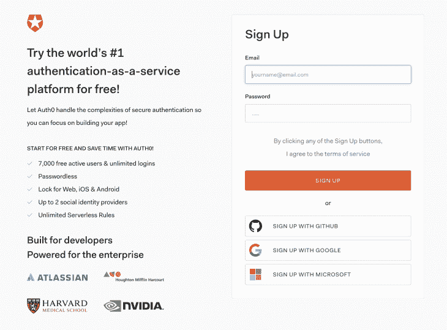

### 步骤 2:创建新的应用程序

登录到您的仪表板，导航到侧边栏上的*应用程序*选项卡，单击*创建应用程序*按钮创建一个新的 Auth0 应用程序:

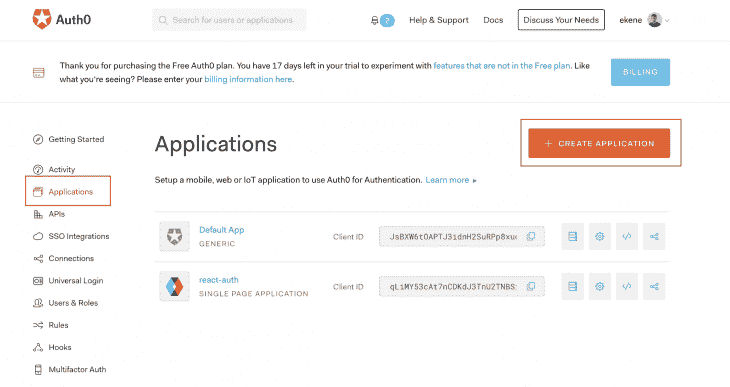

### 步骤 3:选择应用程序类型

在下一个屏幕中，您选择您正在构建的应用程序的类型，并为其命名。在我们的例子中，我们正在构建一个本地移动应用程序，并将其命名为“React Native App”:

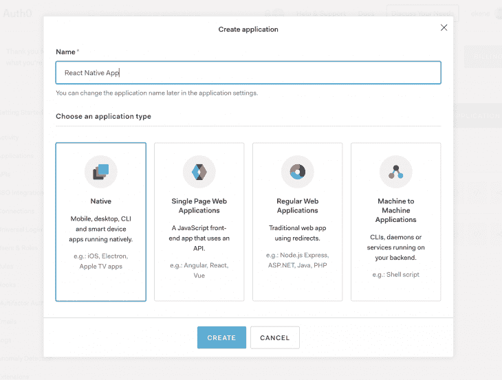

### 步骤 4:选择一个 SDK

在我们的例子中，从下面的屏幕中选择 React Native:

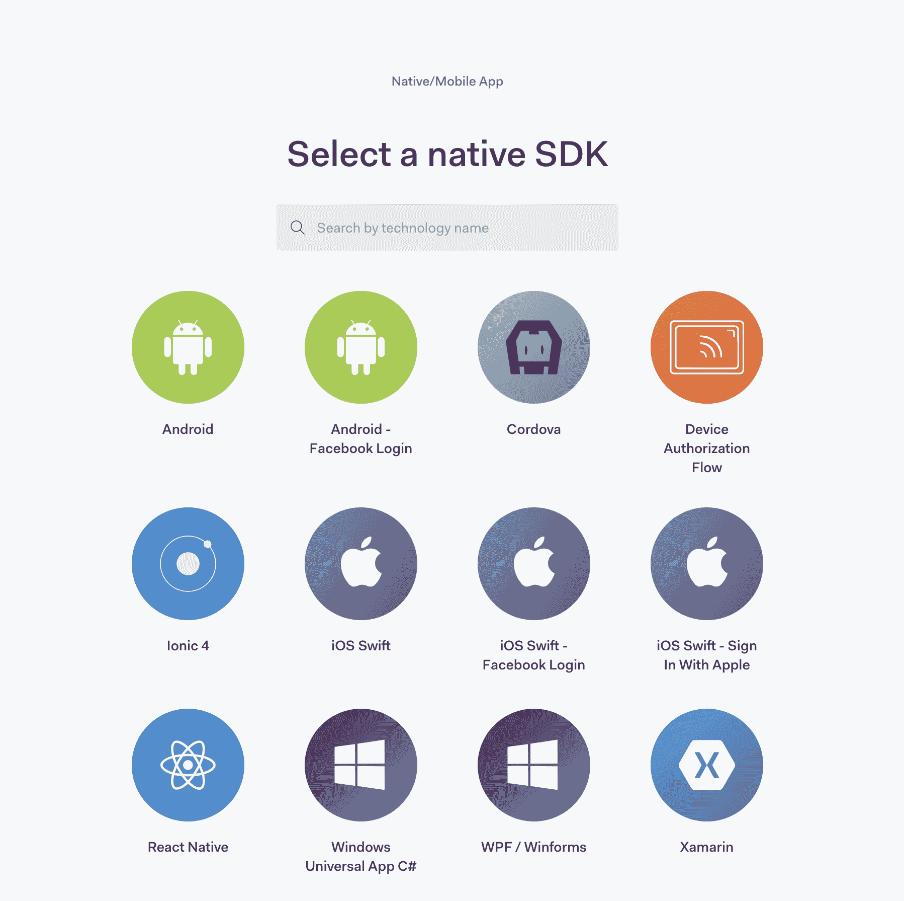

### 步骤 5:查看凭据

现在您的应用程序已创建，导航到设置菜单以查看您的应用程序凭据:

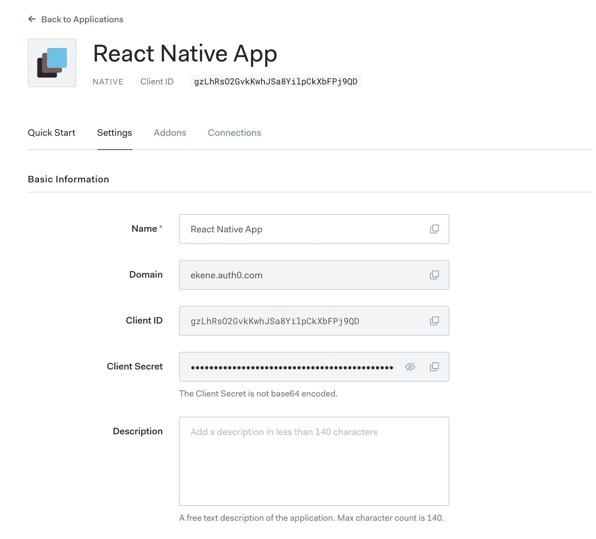

请妥善保管这些凭据，因为我们很快就会在应用程序中用到它们。

## 设置无密码授权

Auth0 强制您为每个实现的身份验证流使用适当的授权。在我们的例子中，我们使用的是无密码身份验证流，我们需要在仪表板上启用该授权类型。

要启用无密码授权类型，请在仪表盘上选择 React 本地应用，点击*项目设置*，向下滚动，展开*高级设置*，点击*授权类型*选项卡，勾选无密码授权类型:


## 启用短信连接

我们正在通过电话进行身份验证，因此，我们需要在应用程序上启用 SMS 连接，单击侧栏上的*连接*选项卡，然后选择*无密码*。切换短信按钮以启用短信连接:

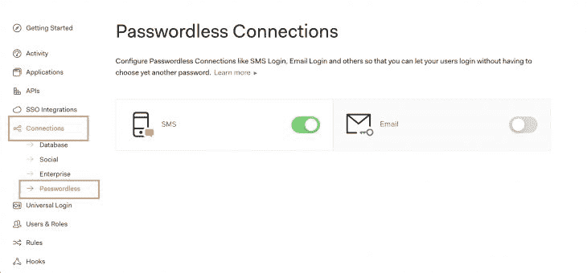

## 设置 Twilio SSID

接下来，点击 SMS 卡，使用您的 Twilio 凭据配置 SMS 连接。如果您没有 Twilio 帐户，[请在此处注册一个帐户](https://www.twilio.com/)并取回您的 SSID 和令牌:

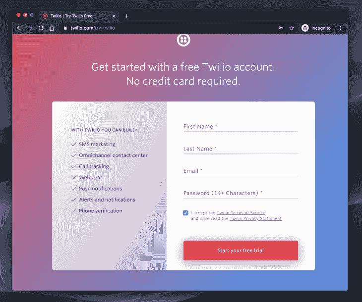

验证您的帐户后，登录并创建一个新项目，如下所示:

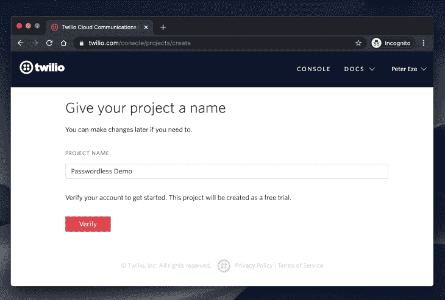

当您在 Twilio 上注册一个试用帐户时，您将获得大约 15 美元，可以用来购买您选择的手机号码，以便通过您的 Twilio 帐户发送消息:

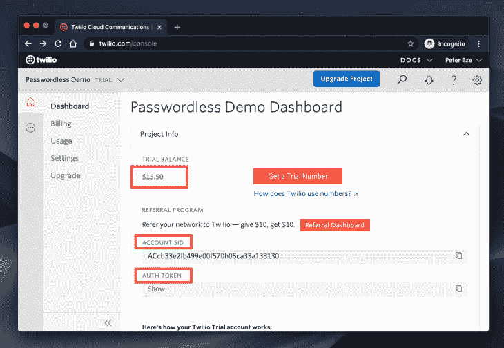

获取您选择的号码，复制您的帐户 SID 和令牌。转到 Auth0 并将其添加到您的 SMS 配置中，然后保存:

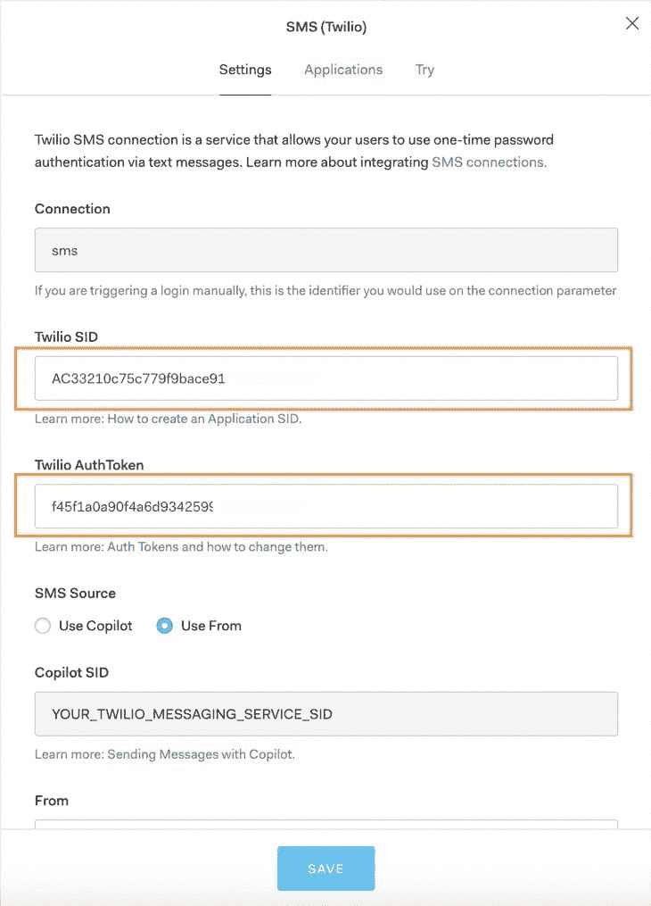

## 创建身份验证组件

创建一个名为`Auth.js`的新文件。这个文件将承载我们这个项目的所有代码实现。我这样做是为了将所有东西放在一个地方，并保持我的解释的有序性:

```
import React, {Component} from 'react';
import Auth0 from 'react-native-auth0';
import {Button, View, TextInput, Modal, Text, Image} from 'react-native';
class Auth extends Component {
  constructor() {
    super();
    this.state = {
      phone: '',
      code: '',
      codeRequestSent: false,
      LogginIn: false,
      isLoggedin: false,
      accessToken: '',
      idToken: '',
    };
    this.loginUser = this.loginUser.bind(this);
    this.getLoginCode = this.getLoginCode.bind(this);
  }
  componentDidMount() {
    this.auth0 = new Auth0({
      domain: 'YOUR_AUTH0_DOMAIN',
      clientId: 'YOUR_CLIENT_ID',
    });
  }
  render(){
    return(
      <View></View>
    )
  }
}
export default Auth;
```

我们在这里所做的是创建一个新的客户端实例，使它在我们的应用程序中可用。我们在`componentDidMount()`生命周期方法中通过初始化`Auth0`并在您的 Auth0 仪表板上使用您的域和 clientID 来实现这一点。我们还声明了一些状态变量来跟踪我们需要通过应用程序访问的值。

在我们继续之前，让我们再次刷新一下我们将在本项目中实现的无密码流:

*   用户打开应用程序
*   该应用程序请求用户的电话号码
*   用户提供一个电话号码
*   应用程序向用户的电话号码发送登录代码
*   用户向应用程序提供登录代码
*   该应用程序让用户登录，并根据指定的范围返回他们的访问和 id 令牌

我们需要两个函数来实现这个流程:

*   `getLoginCode()` —将登录代码发送到用户手机
*   `loginUser()` —使用接收到的代码并让用户登录:

```
getLoginCode() {
  this.setState({LogginIn: true});
  this.auth0.auth
    .passwordlessWithSMS({
      phoneNumber: this.state.phone,
    })
    .then(() => {
      this.setState({codeRequestSent: true});
    })
    .catch(console.error);
}
```

当用户在应用程序上输入他们的电话号码时，我们将其存储在`phone`状态变量中，通过它，我们可以使用上述函数请求登录代码。最后，为了完成身份验证，将收到的代码发送回 Auth0，如下所示:

```
loginUser() {
  this.auth0.auth
    .loginWithSMS({
      phoneNumber: this.state.phone,
      code: this.state.code,
    })
    .then(response => {
      console.log(response);
      this.setState({
        accessToken: response.accessToken,
        idToken: response.idToken,
        isLoggedin: true,
      });
    })
    .catch(console.error);
}
```

当登录请求成功时，您可以创建此用户的记录，并执行您为应用程序设计的任何其他用户资料相关功能。

在 components `render()`功能中，我们根据我们在状态中跟踪的变量值有条件地显示各个屏幕:

```
render() {
  const {
    codeRequestSent, LogginIn, code, isLoggedin, accessToken, idToken,
  } = this.state;
  return (
    <View>
      {!codeRequestSent ? (
        <>
          <TextInput
            placeholder="Enter Phone"
            onChangeText={text => this.setState({phone: text})}
          />
          <Button
            title={LogginIn ? 'Processing...' : 'Get Code'}
            onPress={this.getLoginCode}
          />
        </>
      ) : (
        <>
          <TextInput
            placeholder="Enter Code"
            value={code}
            onChangeText={text => this.setState({code: text})}
          />
          <Button title="Login" onPress={this.loginUser} />
          <View>
            <Modal transparent={true} visible={isLoggedin}>
              <View>
                <View>
                  <Text> Login Successful 👍🏼🎉</Text>
                  <Text> Here are your details:</Text>
                  <Text> Access Token: {' ' + accessToken}</Text>
                  <Text>
                    Id Token:
                    {' ' + idToken.length > 25
                      ? `${idToken.substring(0, 25)}...`
                      : idToken}
                  </Text>
                  <Button title="Logout" onPress={this.logout} />
                </View>
              </View>
            </Modal>
          </View>
        </>
      )}
    </View>
  );
}
```

别忘了电子邮件无密码登录也是如此。也许我们会在下一篇文章中详细讨论这个流程。但一般来说，流程是一样的——用户会收到一封电子邮件，其中包含一个链接或代码，这取决于您的具体要求，用户还会使用它来登录。

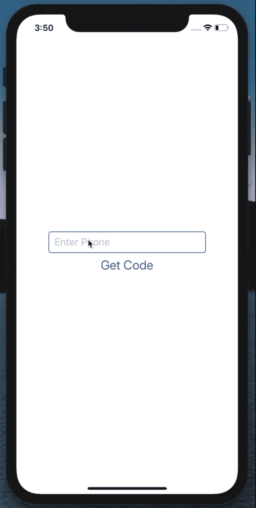

## 结论

在这篇文章中，我们回顾了在 React 本地应用程序中使用 Auth0 和 Twilio 实现无密码身份验证所涉及的概念。它让我们有机会探索拥有一个安全认证系统的可能性，而无需处理密码带来的所有麻烦。可能性是无穷无尽的，我迫不及待地想看看你用它做了什么。源代码可以在这个库的[上获得。](https://github.com/kenny-io/passwordless-auth-RN)

## [LogRocket](https://lp.logrocket.com/blg/react-native-signup) :即时重现 React 原生应用中的问题。

[](https://lp.logrocket.com/blg/react-native-signup)

[LogRocket](https://lp.logrocket.com/blg/react-native-signup) 是一款 React 原生监控解决方案，可帮助您即时重现问题、确定 bug 的优先级并了解 React 原生应用的性能。

LogRocket 还可以向你展示用户是如何与你的应用程序互动的，从而帮助你提高转化率和产品使用率。LogRocket 的产品分析功能揭示了用户不完成特定流程或不采用新功能的原因。

开始主动监控您的 React 原生应用— [免费试用 LogRocket】。](https://lp.logrocket.com/blg/react-native-signup)