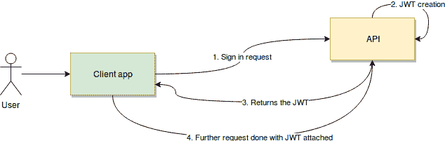
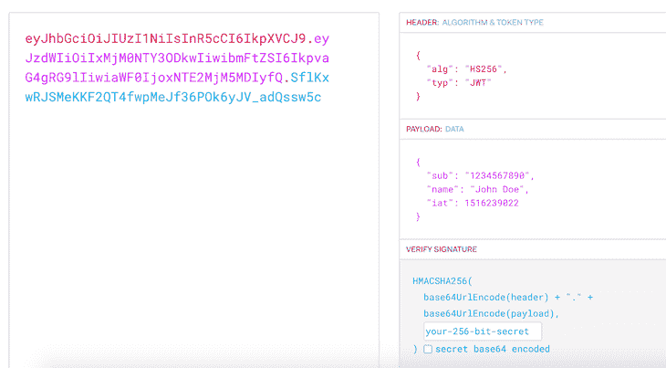
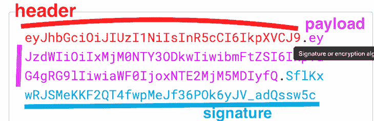

# 如何使用 JWT 认证保护 REST API

> 原文：<https://blog.logrocket.com/secure-rest-api-jwt-authentication/>

***编者按:*** *本文最后一次更新于 2022 年 8 月 12 日，以验证代码准确性并包括额外的图像和图表。*

REST APIs 很棒，因为它们在逻辑上很简单。它们不会将复杂的状态保存在内存中，它们处理的是资源而不是松散的、不相关的功能，这使得它们的整个业务逻辑具有内聚性。

然而，由于[REST API 的本质和机制，保护它们并不总是简单的](https://blog.logrocket.com/10-best-practices-for-rest-api-design/)。用户提交凭据后会发生什么？您不能在服务器端保存一个状态来通知用户何时登录到他们的后续请求，那么您如何知道他们这样做是正确的呢？

在本文中，我们将介绍一种使用 JSON Web 令牌(JWT)保护 REST API 的非常强大而简单的方法，回顾一些最佳实践并实现一个示例。我们开始吧！

## 什么是 JWT？

[JSON Web 令牌是一种开放的标准方式，让您在双方交互过程中安全地表示用户的身份](https://blog.logrocket.com/jwt-authentication-best-practices/)。

当两个系统交换数据时，您可以使用 JSON Web 令牌来标识您的用户，而不必在每次请求时都发送私有凭证。如果您将此应用于 REST API，您将会看到我们的客户端-服务器交互如何受益于这些机制:



首先，用户或客户端应用程序发送登录请求。在这一步中，用户提供的用户名、密码或任何其他类型的登录凭证将被传送到 API。一旦通过验证，API 将创建一个 JSON Web 令牌，并使用一个秘密密钥对其进行签名。然后，API 会将该令牌返回给客户端应用程序。

最后，客户端应用程序将接收令牌，在自己的一端验证它以确保它是真实的，然后在每个后续请求中使用它。因此，它可以对用户进行身份验证，而无需他们再发送凭据。

### JSON Web 令牌结构



JWT structure example

API 返回的令牌本身就是一个简单的编码字符串。它由三个不同的部分组成，用点字符分隔开:

```
header.payload.signature

```



JWT payload, header, and signature

每一部分都包含了拼图的重要部分。解码后，前两部分将是包含相关信息的数据的 JSON 表示，最后一部分将用于验证令牌的真实性。

报头将包含与我们正在处理的令牌类型和用于生成令牌的算法相关的数据。您可以在这里指定几种兼容的算法，但最常见的是 [HS256 和 RS256](https://stackoverflow.com/questions/39239051/rs256-vs-hs256-whats-the-difference) 。正确的选择将取决于您所寻求的安全标准和措施。

在这两个例子中，一个使用服务器和客户机都知道的密钥，另一个使用服务器使用的私钥和客户机知道的公钥。

在上图中，我们看到有效载荷包含算法，设置为使用`HS256`，类型为`JWT`。

有效负载将包含与请求和发出请求的用户相关的数据。有一组标准的键/值对被定义为 JWT 的一部分，您可以在您的实现中使用它们:

*   `Sub` (Subject):标识发出请求并被验证的用户
*   `Iss`(发布者):发布令牌的服务器。在我们的例子中，包含所使用的 URI 是有意义的
*   `Aud`(观众):提供该令牌接收者的某种形式的标识
*   `Exp`(有效期):代币通常不会永久有效。`Exp`确保使用令牌的人提供最近生成的令牌

虽然还有其他属性可以添加到定义为标准一部分的 payload 对象中，但上面列出的是最常见的属性。您可以使用它们，也可以自己定义，只要客户端和服务器在实现上达成一致。

最后，签名只是一个编码字符串，服务器和客户机都使用它来验证有效负载的真实性。现在我们已经介绍了基础知识，让我们通过一个例子来回顾一下我们已经介绍过的所有内容。

## 如何使用 JWT 认证 REST API

让我们假设我们正在为我们公司的工资单 API 开发一个客户端。该 API 旨在向公司员工支付款项，检索他们的历史信息，并最终编辑员工的信息。

为了防止人为错误，API 的开发人员决定其中一些操作需要管理员权限。因此，我们将拥有只能查看信息的普通访问权限的用户和拥有超级访问权限的用户，即管理员，他们还可以支付费用和编辑数据。

尽管这个例子有些简单，但它应该能让我们清楚地理解 JWT 的逻辑。如上所述，与我们的安全 API 的任何交互都将从一个登录请求开始，它看起来像下面这样:

```
POST /api/users-sessions

```

有效载荷如下:

```
{
 “Username”: “fernando”
 “Password”: “fernando123”
}

```

假设凭证有效，系统将返回一个新的 JSON Web 令牌。让我们检查一下这个代币的细节。特别是，让我们考虑一下有效载荷中的信息。一些有趣的选项可能是:

*   包含登录用户的用户名，这特别有用，因为我们可能想在我们的 UI 中显示它
*   我们将只允许我们的新令牌在接下来的八个小时内使用，这大约是用户每天需要它的时间
*   `Admin`:描述用户角色的布尔型。这对 UI 来说很方便，因为我们需要了解是显示还是隐藏一些 UI 元素

为了简单起见，我们将使用 HS256 算法对数据进行编码，这意味着我们将在客户端和 API 上使用相同的秘密。

## 保护秘密 API:示例

让我们考虑一下令牌的不同部分应该是什么样子:

```
// Header 
{
 “alg”: “HS256”,
 “typ”: “JWT”
}

// Payload
{
  “Iss”: “fernando”
  “Exp”: 1550946689,
  “Admin”: false
}

```

要创建实际的令牌，我们需要对上面的项目进行编码，然后对结果值进行签名，以将最后一部分添加到令牌中:

```
Base64(header) = ewoiYWxnIjogIkhTMjU2IiwKInR5cCI6ICJKV1QiCn0K
Base64(payload) = ewoiSXNzIjogImZlcm5hbmRvIiwKIkV4cCI6IDE1NTA5NDY2ODksCiJBZG1pbiI6IGZhbHNlCn0K
HS256(Base64(header) + “.” + Base64(payload), “A secret API example”) = TseARzVBAtDbU8f3TEiRgsUoKYaW2SbhCWB0QlKpdp8

```

下面的代码显示了 API 返回的最终令牌:

```
ewoiYWxnIjogIkhTMjU2IiwKInR5cCI6ICJKV1QiCn0K.ewoiSXNzIjogImZlcm5hbmRvIiwKIkV4cCI6IDE1NTA5NDY2ODksCiJBZG1pbiI6IGZhbHNlCn0K.TseARzVBAtDbU8f3TEiRgsUoKYaW2SbhCWB0QlKpdp8

```

收到这个令牌后，客户端应用程序可以通过获取头部和有效负载部分来解密和验证它，然后自行签名。这当然是可能的，因为客户端和服务器都知道秘密短语。这样做可以确保没有人更改消息的内容，并且可以安全使用。

同时，客户端应用程序发送的任何进一步的请求都将包含相同的令牌。反过来，令牌将由服务器验证，服务器每次都对其进行签名，并将结果与令牌的签名部分进行比较。

在典型的 JWT 请求中，在客户端登录后，您将把令牌作为授权头的一部分传递给客户端，就像`Authorization:Bearer`一样。

例如，这样做可以防止有人干预消息的有效载荷，将`admin`属性更改为`true`，从而允许假冒的、甚至是有效的非管理员用户执行特权操作，比如向某个特定的员工支付费用。

这种操作会将有效负载内容修改为如下内容:

```
ewoiSXNzIjogImZlcm5hbmRvIiwKIkV4cCI6IDE1NTA5NDY2ODksCiJBZG1pbiI6IHRydWUKfQo=

```

反过来，这将导致客户端应用程序发送的最终令牌如下:

```
eyJhbGciOiJIUzI1NiIsInR5cCI6IkpXVCJ9.ewoiSXNzIjogImZlcm5hbmRvIiwKIkV4cCI6IDE1NTA5NDY2ODksCiJBZG1pbiI6IHRydWUKfQo=.TseARzVBAtDbU8f3TEiRgsUoKYaW2SbhCWB0QlKpdp8

```

该令牌的签名类似于下面的代码:

```
doRnK7CoVjFOiFmvrQ2wvxcGeQuCYjzUchayNAYx1jw

```

这与作为消息的一部分发送的请求不匹配，从而证明请求已被篡改。

## 结论

希望您已经掌握了 JWT 安全性的基础知识，并且了解到保护您的 REST APIs 实际上并不那么困难。

* * *

### 更多来自 LogRocket 的精彩文章:

* * *

当然，我在本文中介绍的内容会有所变化，我建议您通过访问 [jwt.io](https://jwt.io/) 自行探索。在他们的网站上，您可以生成和验证 JSON Web 令牌，以及到最常见编程语言的主要 JWT 库的链接。从本质上来说，您需要开始将 JWT 安全性添加到 API 中的一切都可以通过他们的网站轻松获得。

虽然我在这里介绍的机制非常简单，每个人都可以使用，但是你应该明白，仅仅在你的 API 中增加 JWT 安全性还不足以保护你的应用程序；聪明的黑客会找到办法绕过它。

安全性涉及到您的所有方面，而不仅仅是实施一个通用的安全方案。通过 HTTPS 连接保护您的所有网络流量，这是一个额外的保护层，它总是与 JWT 相得益彰。换句话说，确保用户发送和接收的所有信息都通过`port 443`，或者你可能使用的任何自定义号码，而不是不安全的`port 80`。

我希望你喜欢这篇文章，如果你有任何问题，请务必留下评论。编码快乐！

## 使用 [LogRocket](https://lp.logrocket.com/blg/signup) 消除传统错误报告的干扰

[](https://lp.logrocket.com/blg/signup)

[LogRocket](https://lp.logrocket.com/blg/signup) 是一个数字体验分析解决方案，它可以保护您免受数百个假阳性错误警报的影响，只针对几个真正重要的项目。LogRocket 会告诉您应用程序中实际影响用户的最具影响力的 bug 和 UX 问题。

然后，使用具有深层技术遥测的会话重放来确切地查看用户看到了什么以及是什么导致了问题，就像你在他们身后看一样。

LogRocket 自动聚合客户端错误、JS 异常、前端性能指标和用户交互。然后 LogRocket 使用机器学习来告诉你哪些问题正在影响大多数用户，并提供你需要修复它的上下文。

关注重要的 bug—[今天就试试 LogRocket】。](https://lp.logrocket.com/blg/signup-issue-free)