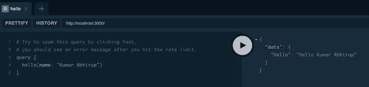

# 使用速率限制和深度限制保护 GraphQL API 端点

> 原文：<https://blog.logrocket.com/securing-graphql-api-using-rate-limits-and-depth-limits/>

如果您的项目后端有一个带有各种解析器的 Node.js GraphQL 端点，并且您将它部署在生产环境中，那么您需要通过速率和深度限制来保护您的 GraphQL API 端点。

如果超过了设置的每次请求限制，速率限制有助于抑制用户，深度限制有助于通过深度限制 GraphQL 查询的复杂性。这些措施有助于您的应用程序防止 API 垃圾邮件和查询攻击。在本文中，我们将讨论为什么以及如何对 API 进行速率限制和深度限制。

## 什么是速率限制？

速率限制意味着限制应用程序或用户在给定时间内可以进行的 API 调用的数量。如果超过该限制，则用户或客户端可能被节流，即，客户端可能被禁止在同一时间段内进行更多类似的 API 调用。

## 为什么要限制 API 的速率？

您的后端服务器通常会对一个时间框架内可以处理的请求数量有一些限制。很多时候，怀有恶意的用户会用垃圾邮件轰炸您的 API 端点，这会降低您的服务器速度，甚至可能使其崩溃。

为了保护您的 API 端点和服务器不被淹没，您必须对您的 API 端点进行速率限制，无论它是 REST API 还是 GraphQL 端点。

## 限速方法

有多种方法可以限制 API，如下所示。

### 按每个时间段的 IP 地址

如果某些 IP 地址在一段时间内超过了 API 请求的数量，您可以限制它们访问您的服务。

### 按用户 pe 时间范围

您可以限制应用程序中的某些用户(通过他们在数据库中的唯一标识符)，并在他们超过某个时间范围内的 API 请求数时限制他们对您的服务的访问。

### 按 IP 地址和每个时间段的用户

在这种方法中，如果用户超过您根据他们是否使用相同的 IP 地址设置的速率限制，您将对用户进行限制。

### 所有 GraphQL 解析器的统一速率限制

当一个服务器上的 GraphQL 解析器([突变、查询](https://graphql.org/learn/queries/)和订阅)具有相同的速率限制时，比如每个用户每分钟 10 个请求，就要这样做。

例如，一个 GraphQL 服务器可能在相同的速率限制规则中有`signInMutation`、`getUserQuery`和其他这样的解析器，这意味着在 [GraphQL 解析器](https://www.tutorialspoint.com/graphql/graphql_resolver.htm#:~:text=Resolver%20is%20a%20collection%20of,info)中有一个统一的速率限制。

### 每个 GraphQL 解析器的不同速率限制规则

有时每个 GraphQL 解析器都有不同的限速规则。例如，与易于处理且耗时较少的旋变器相比，需要大量内存和处理能力的旋变器将具有更严格的速率限制。

当每个时间段允许的 API 请求越少时，速率限制越严格。

## 存储限速数据

要对 API 或 GraphQL 端点进行速率限制，您需要跟踪时间、用户 id、IP 地址和/或其他唯一标识符，并且您还需要存储上次标识符请求端点时的数据，以便计算标识符是否超出了速率限制。

“标识符”可以是有助于识别客户端的任何唯一字符串，例如数据库中的用户 ID、IP 地址、二者的字符串组合，甚至是设备信息。

那么，你把所有这些数据存储在哪里呢？

[Redis](http://redis.io/topics/quickstart) 是最适合这些用例的数据库。这是一个缓存数据库，你可以在密钥对中保存少量信息，而且速度极快。

让我们现在安装 Redis。稍后，您可以将它插入 Node.js GraphQL 服务器设置中，以存储速率限制相关信息。

如果您正在使用官方文档安装 Redis，请在命令行中使用这些命令👇

```
wget http://download.redis.io/redis-stable.tar.gz
tar xvzf redis-stable.tar.gz
cd redis-stable
make
sudo cp src/redis-server /usr/local/bin/ # copying build to proper places
sudo cp src/redis-cli /usr/local/bin/ # copying build to proper places

```

个人认为有更简单的安装方式:

在 Mac 上:

```
brew install redis # to install redis
redis-server /usr/local/etc/redis.conf # to run redis

```

在 Linux 上:

```
sudo apt-get install redis-server # to install redis
redis-server /usr/local/etc/redis.conf # to run redis

```

Redis 服务器启动后，创建一个新用户。在`localhost`上，运行 Redis 没有任何密码是可以的，但是对于生产来说你不能，因为你不希望你的 Redis 服务器对互联网开放。

现在让我们设置一个 Redis 密码。运行`redis-cli`启动 Redis 命令行。这只有在 Redis 安装并运行的情况下才有效。

* * *

### 更多来自 LogRocket 的精彩文章:

* * *

然后，在 CLI 中输入以下命令:

```
config set requirepass somerandompassword

```

现在`exit`命令行。您的 Redis 服务器现在有密码保护。

## 在 GraphQL 中使用速率限制

这里，我们将利用 [`graphql-rate-limit` npm 模块](https://www.npmjs.com/package/graphql-rate-limit)。你还需要`[ioredis](https://www.npmjs.com/package/ioredis)`。

```
npm i graphql-rate-limit ioredis -s

```

在本教程中，我使用 [graphql-yoga](https://github.com/dotansimha/graphql-yoga) 服务器作为后端。也可以使用 [Apollo GraphQL](https://github.com/apollographql/apollo-server) 。

`[graphql-rate-limit](https://www.npmjs.com/package/graphql-rate-limit)`适用于任何 Node.js GraphQL 设置。它所做的就是创建 [GraphQL 指令](https://graphql.org/learn/queries/#directives)用于您的 [GraphQL 模式](https://graphql.org/learn/schema/)。

这是一个普通的 GraphQL 服务器的样子:

```
import { GraphQLServer } from 'graphql-yoga'

const typeDefs = `
  type Query {
    hello(name: String!): String!
  }
`

const resolvers = {
  Query: {
    hello: (_, { name }) => `Hello ${name}`
  }
}

const server = new GraphQLServer({ typeDefs, resolvers })

server.start(() => console.log('Server is running on localhost:4000'))

```

现在，让我们用这段代码来速率限制`welcome`查询(解析器)。

```
import { GraphQLServer } from 'graphql-yoga'

import * as Redis from "ioredis"
import { createRateLimitDirective, RedisStore } from "graphql-rate-limit"

export const redisOptions = {
  host: process.env.REDIS_HOST || "127.0.0.1",
  port: parseInt(process.env.REDIS_PORT) || 6379,
  password: process.env.REDIS_PASSWORD || "somerandompassword",
  retryStrategy: times => {
    // reconnect after
    return Math.min(times * 50, 2000)
  }
}

const redisClient = new Redis(redisOptions)

const rateLimitOptions = {
  identifyContext: (ctx) => ctx?.request?.ipAddress || ctx?.id,
  formatError: ({ fieldName }) => 
    `Woah there, you are doing way too much ${fieldName}`,
  store: new RedisStore(redisClient)
}

const rateLimitDirective = createRateLimitDirective(rateLimitOptions)

const resolvers = {
  Query: {
    hello: (_, { name }) => `Hello ${name}`
  }
}

// Schema
const typeDefs = `
  directive @rateLimit(
    max: Int
    window: String
    message: String
    identityArgs: [String]
    arrayLengthField: String
  ) on FIELD_DEFINITION

  type Query {
    hello(name: String!): String! @rateLimit(window: "1s", max: 2)
  }
`

const server = new GraphQLServer({ 
  typeDefs, 
  resolvers,

  // this enables you to use @rateLimit directive in GraphQL schema.
  schemaDirectives: {
    rateLimit: rateLimitDirective
  }
})

server.start(() => console.log('Server is running on localhost:4000'))

```

好了，`welcome`解析器现在是速率受限的。

如果您在`[https://localhost:4000](https://localhost:4000)`访问 [GraphQL 游乐场](https://github.com/graphql/graphql-playground)，请尝试运行以下查询。

```
# Try to spam this query by clicking fast, 
# you should see an error message after you hit the rate limit.
query {
  hello(name: "Kumar Abhirup")
}

```



Try clicking the white play button rapidly to spam it and you’ll hit the rate limit.

达到速率限制后，您应该会看到设置的错误消息:`Woah there, you are doing way too much hello`。

现在让我们深入分析代码。

## GraphQL 中的速率限制选项

```
const rateLimitOptions = {
  identifyContext: (ctx) => ctx?.request?.ipAddress || ctx?.id,
  formatError: ({ fieldName }) => 
    `Woah there, you are doing way too much ${fieldName}`,
  store: new RedisStore(redisClient)
}

const rateLimitDirective = createRateLimitDirective(rateLimitOptions)

```

`identifyContext`是一个函数，它将返回数据库中所有设备或用户的唯一字符串，或者两者的组合。您可以在这里决定是否要通过 IP 地址、用户 ID 或其他方法进行速率限制。

在上面的代码片段中，我们尝试将用户 IP 地址设置为惟一标识符，如果没有检索到 IP 地址，它将使用默认的 GraphQL 服务器提供的`contextID`作为后备值。

`formatError`是一种允许您格式化用户达到速率限制后看到的错误消息的方法。

`store`连接到 Redis 实例，在 Redis 服务器中保存必要的限速数据。没有 Redis 存储，此速率限制设置无法运行。请注意，您不必总是使用 Redis 作为存储——您也可以使用 [MongoDB](https://docs.mongodb.com/manual/tutorial/getting-started/) 或 [PostgreSQL](https://www.postgresql.org/) ,但是这些数据库对于一个简单的限速解决方案来说是多余的。

`createRateLimitDirective`是一个函数，如果与`rateLimitOptions`一起提供，它使您能够创建动态速率限制指令，稍后您可以将这些指令连接到您的 GraphQL 服务器，以便在您的模式中使用。

这是模式。

```
const typeDefs = `
  directive @rateLimit(
    max: Int
    window: String
    message: String
    identityArgs: [String]
    arrayLengthField: String
  ) on FIELD_DEFINITION

  type Query {
    hello(name: String!): String! @rateLimit(window: "1s", max: 2)
  }
`

```

`directive @rateLimit`在模式中创建`@rateLimit` [指令](https://graphql.org/learn/queries/#directives)，该指令接受一些参数来帮助为每个[解析器](https://graphql.org/learn/queries/)配置速率限制规则。

一旦 GraphQL 指令设置好并准备好使用，您就可以将`@rateLimit(window: *"1s"*, max: 2)`预先固定到任何解析器上。`window: *"1s"*, max: 2`表示解析器每秒只能由一个用户、一个 IP 地址或指定的`identifyContext`运行两次。如果同一查询在该时间段内第三次运行，将出现速率限制错误。

希望您现在知道 GraphQL 解析器是如何进行速率限制的，这有助于防止查询垃圾邮件淹没您的服务器。

现在我们已经讨论了 GraphQL 速率限制，让我们看看如何通过深度限制使 GraphQL 端点更加安全。

## 什么是 GraphQL 深度限制？

深度限制是指通过深度来限制 GraphQL 查询的复杂性。GraphQL 服务器通常有[数据加载器](https://xuorig.medium.com/the-graphql-dataloader-pattern-visualized-3064a00f319f)来使用关系数据库查询加载和填充数据。

请看下面的查询:

```
query book {
  getBook(id: 1) {
    title
    author
    publisher
    reviews {
      title
      body
      book {
        title
        author
        publisher
        reviews {
          title
        }
      }
    }
  }
}

```

它为被查询的`book`获取`review` (s)。每个`book`都有`rviews`，每个`review`都连接到一个`book`，成为数据加载器查询的一对多关系。

现在，看看这个 GraphQL 查询。

```
query badMaliciousQuery {
  getBook(id: 1) {
    reviews {
      book {
        reviews {
          book {
            reviews {
              book {
                reviews {
                  book {
                    reviews {
                      book {
                        reviews {
                          book {
                            # and so on...
                          }
                        }
                      }
                    }
                  }
                }
              }
            }
          }
        }
      }
    }
  }
}

```

这个查询有几个层次。它创建了一个巨大的循环，可以持续很长时间，这取决于查询的深度，其中`book`获取`reviews`，`reviews`获取`books`，以此类推。

这样的查询字符串会淹没您的 GraphQL 服务器，并可能使其崩溃。想象一下发送一个 10，000 层深度的查询—这将是灾难性的！

这就是深度限制的由来。它使 GraphQL 服务器能够检测此类查询，并防止它们被处理。

> 还有另一种方法可以解决这个问题，称为“请求超时”错误，如果解决时间太长，它会阻止解析器执行查询。

## GraphQL API 的深度限制

这是一个相当简单的过程。我们可以使用`[graphql-depth-limit](https://www.npmjs.com/package/graphql-depth-limit)`来限制 GraphQL 查询的深度。

```
import { GraphQLServer } from 'graphql-yoga'
import * as depthLimit from 'graphql-depth-limit'

const typeDefs = `
  type Query {
    hello(name: String!): String!
  }
`

const resolvers = {
  Query: {
    hello: (_, { name }) => `Hello ${name}`
  }
}

const server = new GraphQLServer({ 
  typeDefs, 
  resolvers,

  // easily set a depth limit on all the incoming graphql queries
  // here, we set a depth limit of 7
  validationRules: [depthLimit(7)]
})

server.start(() => console.log('Server is running on localhost:4000'))

```

我们都准备好了！使用深度限制来限制查询复杂性还有许多其他方法。

## 结论

为了防止您的 GraphQL 服务器被 API 请求淹没，必须对 GraphQL 端点进行速率限制和深度限制，这也可以保护您的服务器免受恶意查询攻击，这些攻击可以将您的解析器置于永无止境的请求循环中，特别是当您为实时应用程序部署服务器时。

## 监控生产中失败和缓慢的 GraphQL 请求

虽然 GraphQL 有一些调试请求和响应的特性，但确保 GraphQL 可靠地为您的生产应用程序提供资源是一件比较困难的事情。如果您对确保对后端或第三方服务的网络请求成功感兴趣，

[try LogRocket](https://lp.logrocket.com/blg/graphql-signup)

.

[](https://lp.logrocket.com/blg/graphql-signup)[https://logrocket.com/signup/](https://lp.logrocket.com/blg/graphql-signup)

LogRocket 就像是网络和移动应用的 DVR，记录下你网站上发生的每一件事。您可以汇总并报告有问题的 GraphQL 请求，以快速了解根本原因，而不是猜测问题发生的原因。此外，您可以跟踪 Apollo 客户机状态并检查 GraphQL 查询的键值对。

LogRocket 检测您的应用程序以记录基线性能计时，如页面加载时间、到达第一个字节的时间、慢速网络请求，还记录 Redux、NgRx 和 Vuex 操作/状态。

[Start monitoring for free](https://lp.logrocket.com/blg/graphql-signup)

.