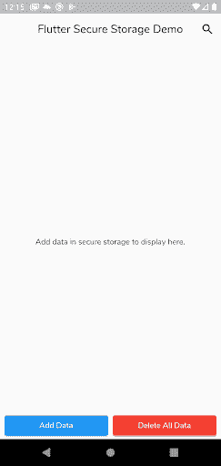
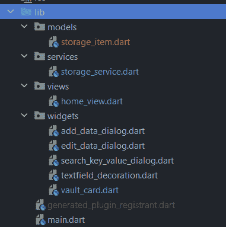
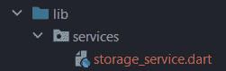
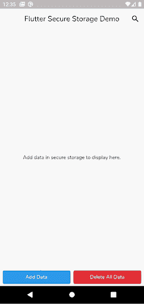
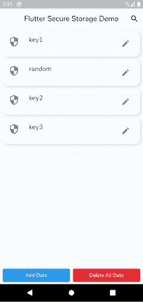
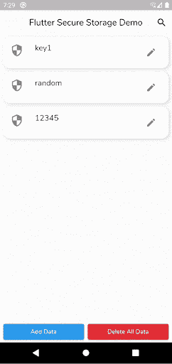
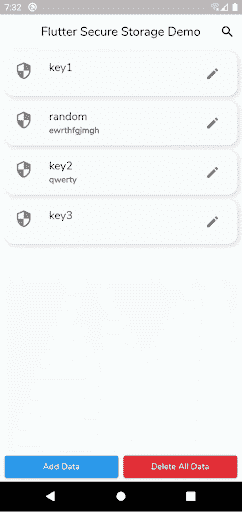

# 在 Flutter 中保护本地存储

> 原文：<https://blog.logrocket.com/securing-local-storage-flutter/>

本地存储是移动应用程序开发的重要组成部分，用于维护和保存用户数据，直到应用程序被删除。如今，一个应用的可信度取决于它的数据是如何保存的。

在本教程中，您将学习如何安全地从您的 Flutter 应用程序本地保存数据。

您可能想知道，当我们可以将数据保存在服务器上时，为什么我们需要本地存储。如果您需要离线模式下应用程序中的数据，该怎么办？您不希望向您的最终用户显示“无法连接”的警告，这就是本地存储很重要的原因。

那么，如何在本地保存数据呢？在 Flutter 中有几种方法可以做到这一点，但是在本教程中，您将使用 flutter_secure_storage 包。

*注意，如果你是 Flutter 新手，请通过官方文档了解一下。*

## 为什么要用 flutter_secure_storage？

flutter_secure_storage 是一个 flutter 插件，用于在安全存储中存储数据。那么什么是安全存储，它有多安全呢？安全存储的描述会随着平台的变化而变化。

如果平台是 Android，那么 flutter_secure_storage 在`[encryptedSharedPreference](https://developer.android.com/reference/androidx/security/crypto/EncryptedSharedPreferences)`中存储数据，是加密密钥和值的共享首选项。它处理 [AES 加密](https://en.wikipedia.org/wiki/Advanced_Encryption_Standard)来生成用 [RSA](https://en.wikipedia.org/wiki/RSA_(cryptosystem)) 加密的密钥，并存储在[密钥库中](https://developer.android.com/reference/java/security/KeyStore)。

对于 iOS 平台，flutter_secure_storage 使用[钥匙链](https://developer.apple.com/documentation/security/keychain_services)，这是一种 iOS 专用的安全存储，仅用于在您的应用中存储和访问加密密钥。

在 web 的情况下，flutter_secure_storage 使用[Web Cryptography](https://developer.mozilla.org/en-US/docs/Web/API/Web_Crypto_API)(Web Crypto)API。

## 本地存储演示入门

从这里下载包含预构建 UI 和最小配置的 [starter 项目](https://github.com/himanshusharma89/secure-storage/tree/starter)。

在编辑器中打开它，然后构建并运行应用程序:



起始项目的文件结构如下所示:



*   `main.dart` —整个 app 的入口
*   `home_view.dart` —包含将显示安全数据列表的**主页**视图
*   `storage_service.dart` —包含负责从安全存储中读取、写入和删除数据的方法
*   `storage_item.dart` —在键值对中存储数据的模型或状态:

```
class StorageItem {
 StorageItem(this.key, this.value);

 final String key;
 final String value;
}
```

*   小部件—包含附加自定义小部件以帮助构建 UI 的目录:
    *   `add_data_dialog.dart` —用于向安全存储器添加新数据的对话框小部件
    *   `add_data_dialog.dart` —编辑`StorageItem`对象的对话框小部件
    *   `search_key_value_dialog.dart` —用于搜索键值的对话框小部件
    *   `textfield_decoration.dart` —在对话框小部件的输入文本字段上添加阴影的小部件
    *   `vault_card.dart` —一个自定义小部件，用于在主屏幕上显示列表框，并提供编辑值和长按值可见性等功能

## 设置安全存储

在 pubspec 依赖关系中添加 [flutter_secure_storage](https://pub.dev/packages/flutter_secure_storage) :

```
#yaml
flutter_secure_storage: ^5.0.2
```

### Android 配置

在您的项目级`build.gradle`文件中，更新`minSdkVersion`:

```
//gradle
android {
    ...
    defaultConfig {
        ...
        minSdkVersion 18
        ...
    }
}
```

针对 API 级别 23+的应用程序会自动将几乎所有数据备份到 Google Drive。您可以在您的应用程序`manifest`文件中禁用它:

```
<!--xml-->
<manifest ... >
    ...
    <application android:allowBackup="true" ... >
        ...
    </application>
</manifest>
```

如果您想控制备份什么，您需要定义一个定制的 XML 规则，[，如这里提到的](https://developer.android.com/guide/topics/data/autobackup#IncludingFiles)。

### Web 配置

一定要启用[HTTP Strict-Transport-Security](https://developer.mozilla.org/en-US/docs/Web/HTTP/Headers/Strict-Transport-Security)(HSTS)和[其他重要的 HTTP 安全头](https://www.netsparker.com/blog/web-security/http-security-headers/)，因为 Web Crypto 只有在网站运行 HTTPS 或 localhost 时才有效。

### Linux 配置

使用颤振的[手动安装](https://docs.flutter.dev/get-started/install/linux#install-flutter-manually)代替颤振卡扣。此外，您还需要机器上的`libsecret-1-dev`和`libjsoncpp-dev`来构建项目，以及`libsecret-1-0`和`libjsoncpp1`来运行应用程序:

```
sudo apt reinstall libjsoncpp1 libsecret-1-0 libjsoncpp-dev libsecret-1-dev -y

#OR

sudo apt-get install clang cmake ninja-build pkg-config libgtk-3-dev libblkid-dev liblzma-dev
```

## 安全存储方法

现在，您已经准备好创建一个包含从安全存储中读取、写入和删除数据所需的所有方法的类。

在您的`lib`目录中，创建一个名为`services`的新目录，并在其中创建一个`secure_storeage.dart`文件:



现在，在文件中创建一个`StorageService`类，如下所示:

```
import 'package:flutter_secure_storage/flutter_secure_storage.dart';

class StorageService {
 final _secureStorage = const FlutterSecureStorage();
}
```

这里你初始化了`_secureStorage`，一个`FlutterSecureStorage()`的实例。

### 写

现在创建负责将数据写入安全存储的方法:

```
Future<void> writeSecureData(StorageItem newItem) async {
 await _secureStorage.write(
     key: newItem.key, value: newItem.value, aOptions: _getAndroidOptions());
}
```

在上面的代码中，`_getAndroidOptions()`也是`StorageService`类的一个方法，用于将`encryptedSharedPreference`属性设置为 true:

```
AndroidOptions _getAndroidOptions() => const AndroidOptions(
     encryptedSharedPreferences: true,
   );
```

您还可以创建更多与您的设备相关的选项和方法。

*注意，Android 中 flutter_secure_storage 升级到 5.0.0 时，可以使用上述方法迁移到`[EncryptedSharedPreferences](https://developer.android.com/reference/androidx/security/crypto/EncryptedSharedPreferences)`。这将自动迁移所有首选项。一旦迁移，此操作将无法撤消。如果您试图禁用`encryptedSharedPreference`，您将无法读取该值。*

### 阅读

接下来，创建`readSecureData`方法来读取与密钥相关的安全数据:

```
Future<String?> readSecureData(String key) async {
 var readData =
     await _secureStorage.read(key: key, aOptions: _getAndroidOptions());
 return readData;
}
```

### 删除

现在，要删除一个键值对，创建如下所示的`deleteSecureData`方法:

```
Future<void> deleteSecureData(StorageItem item) async {
 await _secureStorage.delete(key: item.key, aOptions: _getAndroidOptions());
}
```

### 包含密钥

创建一个`containsKeyInSecureData`方法，负责检查存储器中是否包含提供的密钥:

```
Future<bool> containsKeyInSecureData(String key) async {
 var containsKey = await _secureStorage.containsKey(key: key, aOptions: _getAndroidOptions());
 return containsKey;
}
```

### readAll

要读取所有安全数据，创建如下的`readAllSecureData`方法:

```
Future<List<StorageItem>> readAllSecureData() async {
 var allData = await _secureStorage.readAll(aOptions: _getAndroidOptions());
 List<StorageItem> list =
     allData.entries.map((e) => StorageItem(e.key, e.value)).toList();
 return list;
}
```

在上面的代码中，您在读取所有数据后返回一个`StorageItem`列表。

### 删除全部

接下来，要删除所有受保护的数据，创建`deleteAllSecureData`方法:

```
Future<void> deleteAllSecureData() async {
 await _secureStorage.deleteAll(aOptions: _getAndroidOptions());
}
```

## 在你的 Flutter 应用中使用这些方法

现在，您将更新 starter 项目，以便可以利用上面的方法。

### 读取所有数据

让我们从读取存储中的所有数据并将其显示在 UI 中开始。所以，在`home_view.dart`中，首先初始化`StorageService`实例:

```
final StorageService _storageService = StorageService();
```

接下来，更新`initList()`方法:

```
void initList() async {
    _items = await _storageService.readAllSecureData();
    _loading = false;
    setState(() {});
  }
```

在上面的代码中，您使用了`readAllSecureData`方法来更新和设置`initState`中的列表。

如果数据存在，这将自动更新主屏幕，因为我们已经有一个使用`VaultCard`小部件呈现每个列表项的`ListView.builder`小部件。

### 写入新数据

要写入新数据，首先更新`AddDataDialog`小部件:

```
ElevatedButton(
                    onPressed: () {
                      final StorageItem storageItem = StorageItem(
                          _keyController.text, _valueController.text);
                      Navigator.of(context).pop(storageItem);
                    },
                    child: const Text('Secure'))
```

在上面的代码中，您使用了`_keyController`和`_valueController`控制器来创建一个新的`StorageItem`对象，并将其返回到主屏幕。

接下来，从您的`home_view.dart`中使用**添加数据**按钮的`onPressed`属性:

```
ElevatedButton(
 onPressed: () async {
   // 1
   final StorageItem? newItem = await showDialog<StorageItem>(
       context: context, builder: (_) => AddDataDialog());
   if (newItem != null) {
     // 2
     _storageService.writeSecureData(newItem).then((value) {
       setState(() {
         _loading = true;
       });
       // 3
       initList();
     });
   }
 },
 child: const Text("Add Data"),
)
```

在上面的代码中，您执行了以下操作:

1.  `newItem`:增加了一个来自`AddDataDialog`小工具的可空的`StorageItem`对象
2.  将`newItem`对象传递给`writeSecureData`方法以写入新数据
3.  使用`initList`方法从安全存储中获取所有现有数据

构建并重启你的应用，你就可以在安全存储中写入新数据。



### 删除数据

现在，要从列表中删除任何特定的数据，请更新`home_view.dart`中的`ListView.builder`小部件:

```
ListView.builder(
                    itemCount: _items.length,
                    padding: const EdgeInsets.symmetric(horizontal: 8),
                    itemBuilder: (_, index) {
              // 1
                      return Dismissible(
                        // 2
                        key: Key(_items[index].toString()),
                        child: VaultCard(item: _items[index]),
                        // 3
                        onDismissed: (direction) async {
                          // 4
                          await _storageService
                              .deleteSecureData(_items[index])
                              .then((value) => _items.removeAt(index));
                          // 5
                          initList();
                        },
                      );
                    })
```

在上面的代码中，您执行了以下操作:

1.  用`Dismissible`小部件包装`VaultCard`小部件，以水平地消除相应的卡片
2.  在当前列表项的帮助下，使用`Key`小部件为`Dismissible`小部件的强制属性`key`创建一个惟一键。您也可以使用随机数字或字母数字值
3.  使用`Dismissible`小部件的`onDismissed`属性从列表中删除特定的卡/数据
4.  在`deleteSecureData`的帮助下，您传递了相应的元素并删除了它。但是，也要确保从列表中删除该项目，否则可忽略的小部件将抛出一个错误
5.  使用`initList()`方法在删除项目后更新列表

构建并重新启动您的应用程序，您就可以从安全存储中删除数据。


### 搜索数据

要搜索现有数据，您需要在 SearchKeyValueDialog 小部件中使用它的键。因此，更新您的`home_view.dart`中的`AppBar`,显示如下的`SearchKeyValueDialog`:

```
 IconButton(
            icon: const Icon(Icons.search, color: Colors.black),
            onPressed: () => showDialog(
                context: context, builder: (_) => const SearchKeyValueDialog()),
          )
```

接下来，初始化`SearchKeyValueDialog`小部件中的`StorageService`实例，并更新**搜索**按钮的`onPressed`属性:

```
ElevatedButton(
                    onPressed: () async {
                      _value = await _storageService
                          .readSecureData(_keyController.text);
                      setState(() {});
                    },
                    child: const Text('Search'))
```

这里，您已经通过使用`readSecureData`方法并在其中传递键来更新了`_value`。这将自动更新对话框，并在按钮下方显示值。

构建并重启你的应用。



### 删除所有数据

要删除所有数据，回到`home_view.dart`并更新**删除所有数据**按钮:

```
ElevatedButton(
                  style: ElevatedButton.styleFrom(primary: Colors.red),
                  onPressed: () async {
                    _storageService
                        .deleteAllSecureData()
                        .then((value) => initList());
                  },
                  child: const Text("Delete All Data"),
                )
```

这里，您利用了`deleteAllSecureData`方法，并使用`initList`方法更新了列表。



### 编辑存储项目

编辑现有数据是在`VaultCard`小部件中执行的，因此通过初始化`StorageService`的实例来更新它:

```
final StorageService _storageService = StorageService();
```

接下来，使用`EditDataDialog`小部件通过`StorageItem`将更新后的值返回到`VaultCard`小部件中。更新`EditDataDialog`:

```
final StorageItem item;

const EditDataDialog({Key? key, required this.item}) : super(key: key);
```

您在上面的代码中更新构造函数来接收`StorageItem`对象。

接下来，更新**更新**按钮:

```
ElevatedButton(
                    onPressed: () {
                      Navigator.of(context).pop(_valueController.text);
                    },
                    child: const Text('Update'))
```

在这里，您将更新后的值返回给`VaultCard`小部件。

现在，更新`VaultCard`中编辑`IconButton`的`onPressed`属性:

```
IconButton(
              icon: const Icon(Icons.edit),
              onPressed: () async {
                // 1
                final String updatedValue = await showDialog(
                    context: context,
                    builder: (_) => EditDataDialog(item: widget.item));
                if (updatedValue.isNotEmpty) {
                  // 2
                  _storageService
                      .writeSecureData(
                          StorageItem(widget.item.key, updatedValue))
                      .then((value) {
                     // 3
                    widget.item = StorageItem(widget.item.key, updatedValue);
                    setState(() {});
                  });
                }
              },
            )
```

在上面的代码中，您执行了以下操作:

1.  通过将`StorageItem`对象作为参数传递给`EditDataDialog`小部件来接收更新后的值
2.  如果收到的值不为空，则使用`writeSecureData`方法更新数据
3.  更新之后，您更新了`StorageItem`对象本身

构建并重启你的应用。



这就是你如何使用 flutter_secure_storage。您还可以在身份验证时使用它来存储用户数据。

## 结论

你可以在这里找到[最终项目。](https://github.com/himanshusharma89/secure-storage)

在本教程中，您了解了 flutter_secure_storage 以及如何在您的 flutter 应用程序中使用它。下一步，您可以使用任何具有安全存储的状态管理解决方案(如 [GetX](https://blog.logrocket.com/ultimate-guide-getx-state-management-flutter) )来提高效率，或者了解如何在 iOS 和 Android 设备上使用 [sqlcipher 库](https://pub.dev/packages/sqflite_sqlcipher)，它也提供了安全存储数据的能力。

## 奖励:flutter_secure_storage 的替代产品

有更多的数据库给你的 Flutter app 提供数据的加解密；这完全取决于他们如何支持它。加密/解密是在应用层完成的吗？它依赖于第三方软件包吗？

在了解了如何使用 flutter_secure_storage 在本地保护您的数据之后，请查看这些备选方案，它们可能会让您的生活更加轻松:

*   支持 SQLCipher 的 SQFlite
*   Sembast
*   Hive
*   Drift

### 支持 SQLCipher 的 SQFlite

支持 sqlcipher 的 SQFlite，或 [sqflite_sqlcipher](https://pub.dev/packages/sqflite_sqlcipher) ，是一个插件，它使用带有 SQLCipher 库的 [sqflite_common](https://pub.dev/packages/sqflite_common) Dart 包/包装器来处理来自 iOS 和 Android 上 SQLite 的平台通道调用。

什么是 SQLCipher 库？它是 SQLite 数据库的一个分支，具有下面列出的一些特性:

1.  增加了对数据库文件的 100% 256 位 AES 加密
2.  没有配置或应用级加密
3.  密钥加密等良好的安全实践是通过 PBKDF2 密钥派生实现的

你可以在这里了解更多关于图书馆的信息。

它有一个类似于 SQLite 插件的 API，唯一的区别是在`openDatabase`方法中有一个可选的参数密码:

```
import 'package:sqflite_sqlcipher/sqflite.dart';

Database db = await openDatabase(
  path,
  password: "my password",
  ...
);
```

在桌面上，通过使用 SQLCipher with[sqf lite _ common _ ffi](https://pub.dev/packages/sqflite_common_ffi)来支持加密，SQLCipher 是一个基于 SQLite 的 FFI 实现(基于 SQLite 3 ),适用于 Linux、macOS 和 Windows 上的 Flutter 和 Dart VM。

然而，有一些限制，比如数据库调用是在一个单独的隔离中完成的，最好使用 path_provider 来获得数据库路径，而不是使用`getDatabasesPath`方法。

### 森巴特

Sembast 是一个 NoSQL 持久数据库，整个数据库基于一个文本文件(JSON 格式),打开后加载到内存中。对它的更改会立即附加到文件中，并在需要时自动压缩。

它在 Dart VM 和 Flutter 上工作，因此它支持所有平台。Sembast 提供了一种方法来支持使用用户定义的编解码器(如 SHA256)对数据进行加密/解密，或者使用外部包(如 encrypt 和 crypto)对应用层加密进行加密/解密:

```
// Initialize the encryption codec with a user password
var codec = getEncryptSembastCodec(password: '[your_user_password]');

// Open the database with the codec
Database db = await factory.openDatabase(dbPath, codec: codec);
```

数据库头将包含编解码器编码的签名，以便在密码错误时无法打开数据库。

任何定制的加密/编解码器都可以使用，只要有办法将 JSON 可编码对象(`Map`、`List`、`num`、`String`和`Bool`)编码/解码到单个行`String`。

您可以从这里了解更多关于编解码器和加密的信息。

### 储备

Hive 支持 AES-256 加密，只需要 256 位加密密钥。您可以自己生成密钥，或者使用 Hive 通过福尔图娜随机数生成器提供的帮助函数。

生成密钥后，您可以使用它通过`encryptionCipher`属性打开盒子:

```
import 'dart:convert';
import 'package:hive/hive.dart';

void main() async {
  final key = Hive.generateSecureKey();
  final encryptedBox= await Hive.openBox('vaultBox', encryptionCipher: HiveAesCipher(key));
  encryptedBox.put('secret', 'Hive is cool');
  print(encryptedBox.get('secret'));
}
```

此外，您还应该在应用层加密您的密钥(使用 RSA 加密或其他方法)，并使用上面提到的 [flutter_secure_storage](https://pub.dev/packages/flutter_secure_storage) 插件存储它。这也保护了您的密钥，但是，这是使用一个外部包来完成的。

### 漂流

Drift 是 Flutter 和 Dart 的持久性库，构建在 SQLite 之上，支持移动设备上可用的 SQL 和 Dart 查询。在撰写本更新时，它为 web 提供了实验性的支持。

移动和桌面上的漂移都是使用 sqlite3 来发送查询。

要对加密数据库使用 Drift，可以使用类似于 moor_flutter 的 encrypted_moor 包，使用上面提到的 sqflite_sqlcipher 库作为替代方案之一。

或者，您可以使用 sqlcipher_flutter_libs 包在您的应用程序中包含本机 sqlcipher 库。

你可以[从这里](https://drift.simonbinder.eu/docs/other-engines/encryption/)了解更多关于带 Drift 的原生加密。

到目前为止，您可能已经注意到，上面提到的大多数替代方案都依赖于外部包或提到的其他替代方案。因此，请确保使用最符合您需求的数据库。对我来说，支持 SqlCipher 的 Sqflite 看起来是一个不错的选择，因为我不需要创建一个编解码器，也不需要依赖一个包来保存我的密钥。如果可能的话，请告诉我们你有什么选择，为什么。

## 使用 [LogRocket](https://lp.logrocket.com/blg/signup) 消除传统错误报告的干扰

[](https://lp.logrocket.com/blg/signup)

[LogRocket](https://lp.logrocket.com/blg/signup) 是一个数字体验分析解决方案，它可以保护您免受数百个假阳性错误警报的影响，只针对几个真正重要的项目。LogRocket 会告诉您应用程序中实际影响用户的最具影响力的 bug 和 UX 问题。

然后，使用具有深层技术遥测的会话重放来确切地查看用户看到了什么以及是什么导致了问题，就像你在他们身后看一样。

LogRocket 自动聚合客户端错误、JS 异常、前端性能指标和用户交互。然后 LogRocket 使用机器学习来告诉你哪些问题正在影响大多数用户，并提供你需要修复它的上下文。

关注重要的 bug—[今天就试试 LogRocket】。](https://lp.logrocket.com/blg/signup-issue-free)