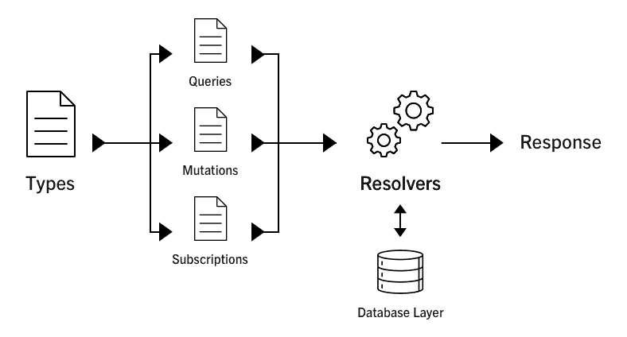
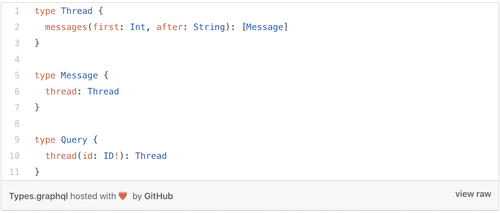
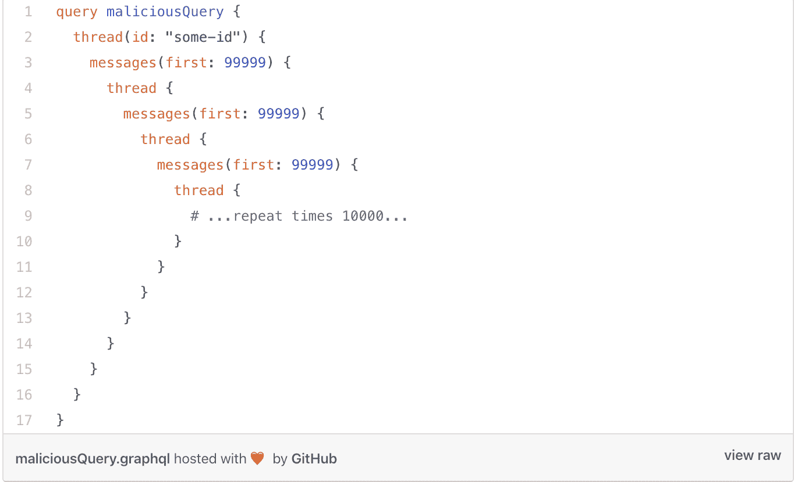
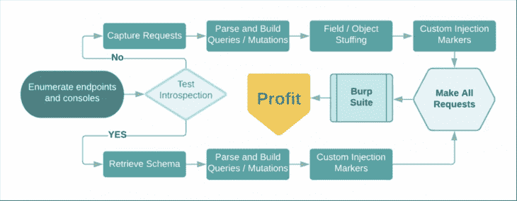

# GraphQL 服务器的安全性和性能技巧

> 原文：<https://blog.logrocket.com/security-and-performance-tips-and-tricks-for-your-graphql-servers/>

## GraphQL 概述

GraphQL 由脸书于 2012 年创建，并于 2015 年开源，以解决传统 REST API 中显而易见的问题，其中包括必须向许多不同的端点发出请求以获取数据。

GraphQL 本质上是一种 API 查询语言，也是一种用现有数据完成查询的运行时语言。

它通过模式提供了 API 中数据的完整描述。它使客户能够准确地要求他们需要的数据、他们需要的方式，仅此而已。

GraphQL 服务器的内部本质上由构成解析器的 3 种类型组成。它可以是一个查询、变异或订阅，在我们的数据库层上执行某些操作，并根据请求生成定制的响应。

这里有一个图表演示了我所描述的内容:

这项激动人心的新技术解决了一个独特的问题，但它也带来了自身的安全性和性能成本。

我们将探索一些并确定处理它们的方法。

GraphQL 的一个迷人之处是没有过度提取的危险——也就是说，你不能只要求数据库发送所有记录。

这不同于传统的 REST API，在那里您可以运行`SELECT * FROM Users`。在 GraphQL 中，您必须明确地询问您需要的不同字段。

```
{
  books {
    title
    author
  }
}
```

在这里，我们从图书查询中获取标题和作者字段。这些是标量类型(意味着它们主要是 INT、FLOAT、STRING、BOOLEAN 和 ID)，所以图书查询类型也可以定义为返回对象类型。

对象类型通常是标量类型或其他对象类型的字段集合。

### 反省

如果您正在构建一个将由不同的人使用的公共 API，您可能希望也可能不希望启用自省查询。在这种情况下，可以启用它，因为它们将向您的端点发出请求。

重要的是，他们知道如何查询端点以及他们期望返回的结果类型。

但是，如果您的端点仅供私人使用，那么在生产环境中禁用自省是有意义的，因为我们希望攻击者尽可能少地了解我们的端点。

### 批准

授权是确定谁有权访问特定资源的业务逻辑。例如，只有订阅的用户才能观看优质内容。

这种行为应该在业务逻辑中实施，而不是在 GraphQL 层，因为 GraphQL 没有内置的授权模块。然而，我们可以使用一些最佳实践和库来确保它按照应该的方式工作，并且是一个平稳的过程。

## 如何攻击 GraphQl 端点

首先要做的是找到端点和附属的`?debug=1`。这确保了错误是详细的，并给用户(在这种情况下是攻击者)更多关于如何更好地定制他们的攻击的上下文。

### 我们如何对邪恶使用内省

默认情况下，自检查询处于启用状态。当端点已知时，会向它发送一个自省查询，然后返回有关查询端点的所有可能方式的信息。

* * *

### 更多来自 LogRocket 的精彩文章:

* * *

这包括所有可用的查询、变异和订阅，然后我们可以对其运行测试以找出漏洞。

**注意:**结果自检查询可能非常大。

因为结果可能非常大，所以手动解析可能非常耗时且繁琐。我们可以使用一个叫做 [GraphQL voyager](https://apis.guru/graphql-voyager/) 的工具，在这里我们可以粘贴自省查询的结果，以便在尝试利用它时理解模式设计。

### 如果自省被禁用，该怎么办

这并不简单，但它是可行的，因为我们可以反复进行计算猜测，直到我们找到可以利用的东西。

首先，我们可以检查子域:尝试找到任何公开可用的 staging/dev URL。

这可能是 staging.domain.com.graphql 或 dev.domain.com/graphql,等。

然后您可以检查 burp 代理，它捕获 burp 中所有可用请求的请求生命周期。

打嗝入侵者/中继器使用字段填充反复运行请求。

现在，您可以通过尝试单词列表中的随机字段来猜测模式。

根据建议调整字段，如果接近，GraphQL 将调整正确的字段。


从上面返回的错误中，我们已经知道了一些可供我们使用的突变。

### 如何绕过验证逻辑

根据身份验证逻辑的实现方式，可以通过获取嵌套查询并将其作为根查询运行来绕过它。

如果实现中存在缺陷，这将绕过身份验证逻辑，使我们能够访问我们无权访问的信息。

考虑下面的例子:

```
 {
    user {
    id
    name
    email 
    friends {
    id
    name
    email
    }
    }
    }

    #this might work
    {
    friends {
    id
    name
    email
    }
    }
```

### 恶意查询

马克斯·斯托伊伯详细介绍了当模式之间存在循环关系时，如何利用 GraphQL 服务器。

考虑以下消息和线程交织在一起的模式定义:



从上面可以看出，当我们查询一条消息时，我们可以请求一个线程，然后请求另一条消息。

因此，恶意用户可以利用这一点，运行这样一个昂贵的查询:



马克斯·斯托伊伯也在他的文章中详细介绍了如何预防这种情况。

### SQL 注入

开发人员需要正确地验证和清理输入，以防止恶意请求攻击数据库。如果没有适当地清理，恶意用户可以简单地在 SQL 中附加`*`以从数据库返回所有内容。

下面是一个描述如何做到这一点的示例:


通过 JSON 类型进行 NoSQL 注入也是很有可能的。

Pete Corey 在他的文章中描述了如何通过使用定制标量类型将恶意查询发送到 GraphQL 服务器。

一定要去看看。

## 保护和优化 GraphQL 服务器

要正确保护您的服务器，需要考虑以下几点:

*   除非万不得已，否则不要打开自省查询
*   不要相信用户数据——始终正确地净化和验证输入
*   使用像 GraphQL shield 这样的库来获得许可和授权，因为它们总是经过很好的测试
*   使用库来检查查询成本分析。本质上，它确保查询在执行之前不会太复杂。你可以在这里查看几个，在这里查看。
*   做安全焦点代码审查
*   训练您的安全编码技能
*   GraphQL 在获取数据时存在 N + 1 问题，因为它不批处理或缓存结果，因此在可以避免的情况下向数据库发送多个请求。我们可以通过使用[数据加载器](https://github.com/graphql/dataloader)来解决这个问题。

## 结论

这篇文章的灵感来自马特·希曼斯基在他的 [youtube 视频](https://www.youtube.com/watch?v=NPDp7GHmMa0&t=966s)中的作品。

编码快乐！

## 监控生产中失败和缓慢的 GraphQL 请求

虽然 GraphQL 有一些调试请求和响应的特性，但确保 GraphQL 可靠地为您的生产应用程序提供资源是一件比较困难的事情。如果您对确保对后端或第三方服务的网络请求成功感兴趣，

[try LogRocket](https://lp.logrocket.com/blg/graphql-signup)

.

[](https://lp.logrocket.com/blg/graphql-signup)[https://logrocket.com/signup/](https://lp.logrocket.com/blg/graphql-signup)

LogRocket 就像是网络和移动应用的 DVR，记录下你网站上发生的每一件事。您可以汇总并报告有问题的 GraphQL 请求，以快速了解根本原因，而不是猜测问题发生的原因。此外，您可以跟踪 Apollo 客户机状态并检查 GraphQL 查询的键值对。

LogRocket 检测您的应用程序以记录基线性能计时，如页面加载时间、到达第一个字节的时间、慢速网络请求，还记录 Redux、NgRx 和 Vuex 操作/状态。

[Start monitoring for free](https://lp.logrocket.com/blg/graphql-signup)

.