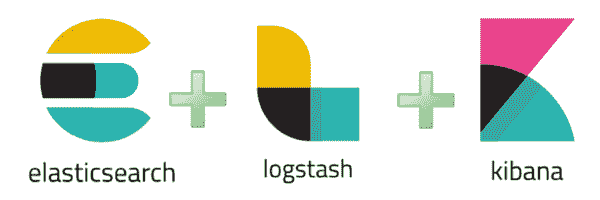

# 全栈 web 开发人员的安全性:第 1 部分- LogRocket 博客

> 原文：<https://blog.logrocket.com/security-for-fullstack-web-developers-part-1-a56340283f7c/>

成为一名全栈开发人员是非常值得的，并让我们每天思考很多问题。每次我们参与一个新项目，我们都有自己的小程序和独特的清单，从中我们可以找到我们的意识形态支柱来推动我们的项目。自然，最大的考虑是范式、语言和框架。然后我们有数据库、数据源和数据 API。然后是基础设施和运营等。现在，在讨论和选择这些考虑因素时，我们更常见的是忽略了最重要的考虑因素之一— ***安全性。***

2016-17 年，超过***42 亿*** 个人数据记录被泄露。有 94 起报告的事件暴露了这两种情况；至少 100 万条记录，37 起事件暴露了 1000 万条或更多记录。与 2015 年相比，这分别增加了 63%和 105%。

该数据来自*‘基于风险的证券’的*年末 [2016 年报告](https://pages.riskbasedsecurity.com/hubfs/Reports/2016%20Year%20End%20Data%20Breach%20QuickView%20Report.pdf)。

我意识到阅读像上面这样的文章介绍有点可怕，当然它曾经吓到我！每天发生的大量数据泄露*非常令人担忧，作为开发人员，确保这些数据泄露不会发生是我们的责任之一！我想分享我的清单，无论是范式/语言不可知的 **&** 框架特定的，以确保您获得保护您的新项目的最佳开端。*

 *安全性是一项持续不断且不断变化的实践，您必须遵守这项实践，以确保您的项目永远不会出现在发生重大数据泄露事件后新闻报道的公司中。无论您希望使用哪种编程范式、语言或框架，从项目一开始就应该遵循大量非特定的、简洁的安全实践。在本文的后面以及本系列的下两篇文章中，我还将更深入地探讨特定的最佳实践。

在我上一次创业时，我们提供用户认证服务，所以我们是黑客的主要目标*。在我们直播的第一个晚上，我们看到有人试图在 30 分钟内发送 500 万个恶意请求。除了揭露黑客之外，这些都没有任何效果。这是因为我们将安全性放在了首位，这是我们在现代技术世界中需要做的事情。*

 *让我们来看看一些重要的最佳实践:**  **### 拿一张科技蓝图

***注****——在我看来，这是最重要的清单项目。*

您知道开发人员使用的每个库的详细情况吗？可能不会——如今几乎不可能跟踪，但这是非常不利的。您是否还知道哪些库和工具已经获得了对您的生产服务器和数据库的写访问权限，以及它们的隔离程度如何？

这里的问题是，在现代开发中使用了如此多的自动化，我们授权访问大量的工具/库，而*并不真正*知道它们到底在做什么。我们理所当然地认为这些库都是完全安全的，没有自己的安全漏洞——或者更糟——自己执行恶意活动。

我们都希望尽可能简化开发周期。我们都使用自动化工具来触发一大堆流程，做着几乎没有人意识到的事情。如果命令失败，一些开发人员倾向于向包管理器抛出`sudo` 命令，这也是很可怕的。

那么我们如何解决这个问题呢？ ***拿一张科技蓝图！*** 这不一定是一个复杂的过程，这很简单，只要知道你的服务器上哪些软件做什么，以及你给了它们多少权限。在授予权限之前，记下任何新工具/包，并做一些研究。简单的谷歌搜索关键词，比如`*package* security vulnerabilities` ，通常会得到比你预期更多的结果。在这个包的 GitHub 页面上查看*问题*标签也是值得的。漏洞经常在那里被讨论，你将能够相应地采取行动。这也适用于顶层的包管理器。

包管理器几乎被我们所有人使用。如果你真的想吓吓自己，那就去搜索`*package manager* security vulnerability`看看所有的结果吧！同样，知道我们正在安装什么和授予什么权限，特别是记下这一点，可以节省我们的时间。

**便利提示:**如果您想知道 npm 软件包运行哪些钩子，在安装它之前，运行以下命令:

```
npm show $module scripts
```

### HTTPS 一切！

我相信你已经熟悉了 HTTPS 的含义，以及为什么它会成为网络流量的标准。也就是说，许多开发人员仍然不在他们的 web 应用程序上使用 SSL/TLS 证书——即使是对数据最敏感的应用程序。

在早期，从证书颁发机构购买证书意味着花费数百美元，以及复杂的设置过程。现在，证书不仅更容易设置，而且更便宜——即**免费。**

几年前，一项名为 [Let's Encrypt](https://letsencrypt.org/) 的服务推出，成为一个新的认证机构，免费发布安全的 SSL/TLS 证书，*。* Let's Encrypt 是 Linux 基金会的一部分，得到了谷歌、脸书、思科和 Mozilla 等超级公司的支持。

所以——没有理由不这样做——去 https://letsencrypt.org/的 T2 为自己拿一张免费的 SSL/TLS 证书。

### 防止 XSS 和请求伪造

跨站点请求伪造和跨站点脚本是 web 应用程序中两个最大的安全漏洞，虽然很明显，但仍然会造成大量的麻烦。

许多开发者认为 XSS 和 CSRF 会自动被他们选择的服务器和框架所照顾——但事实并非如此。令人高兴的是，有一些简单的修复方法很容易实现。

首先，在设置会话 cookies 时使用`HTTPOnly` 和`Secure` 属性。 *HTTPOnly* 属性防止客户端脚本访问 cookie。*安全*属性确保 Cookie 将通过 HTTPS 连接发送。(首先，确保你已经解决了上述 HTTPS 的所有问题。)

在 Node 中，如果使用 Express.js 以上可以通过以下方式实现:

```
var session = require('express-session');

app.use( session( {
  secret: 'secret-key',
  key: 'sessionid',
  cookie: {
    httpOnly: true,
    secure: true
  }
} ) ) ;
```

其次，安装并使用 npm 包‘头盔’。这减轻了几乎所有的 XSS 和 CSRF 攻击，并且易于实现。点击这里查看套餐[，并按照他们提供的清单进行操作。](https://www.npmjs.com/package/helmet)

### 使用日志记录和日志分析

日志本质上是应用程序的私人日记。只要它们被设置为记录，你将永远拥有服务器上发生的每一个重要事件的副本——但是许多开发者仍然完全忽略它们或者不利用它们来跟踪安全问题。

* * *

### 更多来自 LogRocket 的精彩文章:

* * *

我知道阅读无止境的命令行输出并不是每个人都觉得有趣的事情，对于许多人来说，在日志中实际记录什么是一个谜。然而，日志为我们提供了可靠的事件记录，我们可以依靠它来通知我们任何恶意行为，并让我们对我们的遥测技术有一个完整的了解。

然而，这里仍然存在一个明显但重要的问题，即出于安全目的而依赖日志——只有当恶意事件已经发生时，日志才会告诉我们。如果我们只是定期跟踪我们的日志，那么无论如何我们都会错过当时重要的信息。其他显而易见的问题在于我们到底要记录多少数据。如果我们有一个特别繁忙的服务，我们的日志文件将是巨大的，很难查询。**尤其是**，因为我们*实际上*还不知道我们在找什么，我们的日志也不包含太多实时上下文。

有大量的日志分析工具可以帮助您理解日志。根据我的经验，我将只关注两点:



如果你愿意运行自己的日志分析工具，那么我会强烈推荐 ***麋鹿栈*** 。ElasticSearch，Logstash & Kibana。这个堆栈是我在生产中使用多年的东西，它真的很了不起。这个堆栈**将**为任何规模的应用程序运行和工作，但是由于它的轻微资源强度，当你有大量*数据被记录时，它对稍微大一点的应用程序更好。*

 *设置一个 ELK 堆栈曾经是相当费力的，但是由于我在本文前面抱怨过的所有自动化工具，这变得很容易！如果你是 *Docker* 的粉丝，你可以使用 *Docker-Compose* 快速建立一个 ELK 堆栈。看看这个 [GitHub repo](https://github.com/deviantony/docker-elk) ，按照上面的说明去做。你*应该*很快就可以开始运行了！

在这一点上值得注意的是，使用日志分析的最大好处之一是能够实时得到不正确行为的通知。上面的栈，默认情况下不这么做，但是可以用插件来做。

### 参与开源

如果你自己开发大部分技术，而不是使用他人的开源库；有可能知道有内部缺陷/安全漏洞的人只有你团队内部的人。虽然这看起来是更好的选择，但根据我的经验，这实际上是相当有害的。如果你在一个很少其他开发人员的小团队中工作，你发现这些事故的机会会少得多。

通过使用开源软件，并向开源世界开放*你的*软件，你允许更多的眼睛做出判断，因此更有可能快速发现错误。通过向 OS 开发社区开放，您也允许其他人向您的软件提交补丁——减轻您内部开发人员的工作量。我做了一个关于开源的[价值的演讲，你可以在那里看到我的观点。](https://www.youtube.com/watch?v=1D9Z92w0M0A)

当向外部开发人员社区开放时，在要求他们报告错误和安全漏洞时，尽可能使过程简单和安全是很重要的。确保你研究了一个对你的团队有效的负责任的**安全漏洞披露政策**，并实施它。它使事情对双方都公平，并允许为这些漏洞报告设置一个结构。

如果你在一家稍微大一点的公司工作，为一个 ***臭虫奖励项目*** 争取一些预算可能是值得的。这里的想法是，你向开发者社区提供小额奖金，用于发现/修补你的应用程序中的错误。这些奖金可能是 100 美元，也可能是我听说过的荒谬的 100 万美元。许多人都同意，为一个为你解决问题的社区成员提供几百美元是值得的，因为它*可能*花费你几千美元，如果它被利用的话。

这就提出了一个问题——你的证券对你来说到底值多少钱？

### 关注 OWASP 十大热点

有一个专业的标准团体旨在为我们所有人更好地改善网络安全。OWASP 提供了 web 应用程序最严重的十大安全威胁列表，值得仔细研究它们的数据，以便将其应用到您的应用程序中。

他们的 2017 年名单目前正在定稿过程中——但你可以在这里找到他们(仍然相当相关)的 2013 年名单。

如果您应用本文中分享的知识，以及 OWASP 安全列表；您正在努力减少任何潜在的 web 应用程序安全威胁。

### 结论

以上所有的观点都是我对 web 应用程序安全性的基本标准，这是我从个人经验中得出的主张。通过解决清单中的每一点，您就有了从预防、拦截到恢复的基础。我意识到我不可能涵盖所有可能发生的事情，事实上，在这一篇文章中我没有涉及很多话题。

本文是由 3 部分组成的系列文章的一部分，旨在涵盖良好、全面的 web 应用程序安全性的基础。本系列的第 2 部分将涵盖我们常用的*网络服务器，包括它们的缺陷、安全漏洞和潜在危险。第 3 部分将涵盖 ***用户、认证&特权***——可以说是安全问题最常见的领域。*

 *敬请关注接下来的两篇文章，如果您有*任何*问题，请随时联系— [【邮件保护】](/cdn-cgi/l/email-protection#3c4e535e55527c4c594e5f45124c4b) ！****