# 在 React 中使用 Firebase 时自定义电子邮件模板

> 原文：<https://blog.logrocket.com/send-custom-email-templates-firebase-react-express/>

当使用 Firebase 身份验证服务执行密码重置、电子邮件地址验证和基于电子邮件的登录等操作时，您可能希望自定义 Firebase 发送的电子邮件模板，例如，通过更改样式或包含您的徽标。然而，Firebase 在这方面提供了[有限的可定制性](https://support.google.com/firebase/answer/7000714?hl=en)，这是为了防止利用 Firebase 发送垃圾邮件而实施的 T2 安全措施。

在本教程中，我们将学习克服这一限制，并使用 Firebase 定制的电子邮件模板。要学习本教程，您应该熟悉 JavaScript 和 Firebase，并具备 Express 的基础知识。您还需要在您的机器上安装 Node.js。

虽然我们使用 React 作为教程的前端，但是您仍然可以使用其他框架或简单的普通 JavaScript。您可以查看已完成的 Express app 和[已完成的 React app](https://github.com/Tammibriggs/CustomizedEmail-Firebase/tree/userAuth-react) 的[回购。我们开始吧！](https://github.com/Tammibriggs/CustomizedEmail-Firebase)

### 目录

## 如何在 Firebase 中发送定制的电子邮件模板

通常，要定制 Firebase 电子邮件模板，我们会转到 Firebase 项目的**认证**页面上的 [**模板**部分，如下图所示:](https://firebase.google.com/docs/auth)

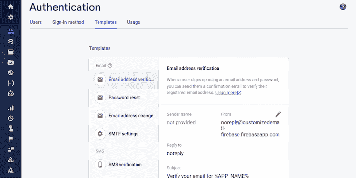

在这个页面上，Firebase 只允许我们定制一些东西，比如`Sender name`、`Reply to`字段和动作 URL。大多数时候，这对于我们想在邮件中看到多少细节来说是不够的。

幸运的是，在 Firebase 中有两种不同的方法来解决这个问题。然而，缺点是我们必须自己创建一个后端来发送电子邮件，而不是仅仅使用 SDK 中的一个自动处理一切的函数。

首先，我们可以[生成电子邮件动作链接](https://firebase.google.com/docs/auth/admin/email-action-links)。作为最有效的方法，它要求我们使用 Firebase Admin SDK 来生成一个链接，该链接将嵌入到发送给我们用户的电子邮件中。当用户点击链接时，Firebase 会对其进行处理，以执行预期的操作，如验证用户的电子邮件或重置其密码。

另一方面，我们可以完全控制工作流程。我们不会使用 Firebase Admin SDK 来生成操作链接，而是自己生成链接，并创建一个 API，该 API 使用 Admin SDK 来处理每当单击链接时要采取的操作。

在本教程中，我们将演示如何使用第一种方法发送定制的电子邮件。我们将生成一个电子邮件操作链接，使用 Firebase 身份验证服务来验证注册的用户帐户。

## 设置 React 和 Express 应用程序

我已经为 React 和 Express 应用程序创建了 starter repos，因此我们可以专注于手头的主题。第一步，我们将克隆回购。让我们从使用以下命令克隆 React repo 开始:

```
$ git clone -b userAuth-starter https://github.com/Tammibriggs/CustomizedEmail-Firebase.git

$ cd CustomizedEmail-Firebase

$ npm install // install dependencies

```

克隆的 repo 是一个 React 应用程序，其中我使用 Firebase JavaScript SDK 创建了用户注册、验证和认证功能。现在，如果我们用`npm start`命令启动应用程序，它将无法正常工作，因为我们没有提供必要的 Firebase 配置，它在`firebase.js`文件中。我们将在本教程的后面部分进行介绍。你可以继续[查看托管的应用](https://tammibriggs-firebase-user-auth.netlify.app/login)。

当我们注册或尝试使用未经验证的注册电子邮件地址登录时，Firebase 会向我们发送一封电子邮件，要求我们验证我们的电子邮件地址:

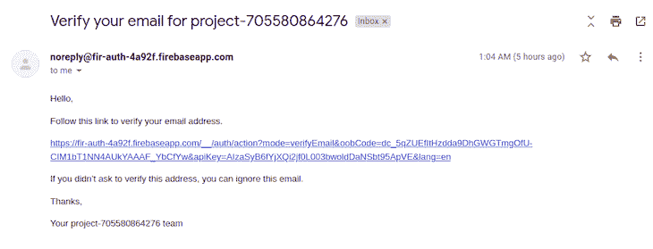

上图是默认的 Firebase 电子邮件，可定制性有限。在本教程结束时，我们的自定义验证电子邮件将如下图所示:

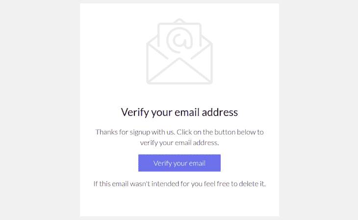

现在，让我们用下面的命令克隆 starter Express 应用程序:

> 注意:在另一个文件夹中使用下面的命令，或者更改克隆的 React 应用程序的文件夹名称。否则，文件夹名称会有冲突，因为它们是从同一个存储库中克隆的。

```
$ git clone -b starter https://github.com/Tammibriggs/CustomizedEmail-Firebase.git

$ cd CustomizedEmail-Firebase

$ npm install // install dependencies

$ npm start // start the app

```

在 Express 应用程序中，我已经设置了构建所需的基本配置，包括在`package.json`文件中的必要依赖项。我还创建了一条`GET`路线，只是为了检查我们的应用程序是否工作正常。您可以在浏览器中使用`[http://localhost:8000/](http://localhost:8000/)`来访问该路线，您应该会看到一条欢迎消息。

## 工作流程的简要概述

我们将首先在 Express 中创建一个`POST`路由，它将从请求主体接收必要的数据，然后使用该信息向用户发送电子邮件。稍后，我们将使用 React 中创建的路由向用户发送定制的电子邮件。

## 创建一个 Express API 来发送定制的电子邮件模板

为了创建我们将用于在 Express 中发送自定义验证电子邮件的路由，我们将完成四个步骤:

*   初始化 Firebase 管理 SDK
*   使用 Firebase Admin SDK 生成电子邮件操作链接
*   使用模板引擎 [EJS](https://ejs.co/) 将链接嵌入要发送给用户的电子邮件模板中
*   使用[发送网格](https://sendgrid.com/)发送电子邮件

### 正在初始化 Firebase 管理 SDK

要初始化 Firebase Admin SDK，我们需要添加一个 Firebase 项目，启用身份验证，然后生成一个用于初始化的私钥。

要添加一个项目，确保你登录到你的谷歌账户，导航到 [Firebase 控制台](https://console.firebase.google.com/)，点击**添加项目**。您应该会看到如下所示的页面:

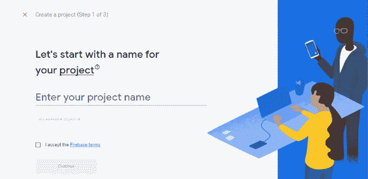

输入项目名称。对于本教程，我们称我们的为`custom-email`。接受 Firebase 条款并点击**继续**。我们将被提示启用谷歌分析。虽然我们不需要谷歌分析这个教程，让它开着不会造成任何伤害。完成这些步骤后，您将被重定向到我们的项目页面:


现在，要启用身份验证并获取服务密钥，请在侧边栏菜单中单击**身份验证**图标。在下一页，点击**开始**:


点击**电子邮件/密码**，屏幕会提示您启用:

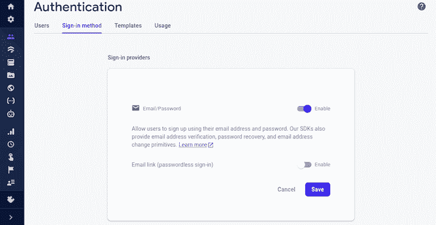

启用电子邮件/密码身份验证允许我们在 **Users** 选项卡的用户记录中添加一个新用户，这确保了 Admin SDK 中负责生成电子邮件操作链接的函数不会抛出错误。我们还需要它来使我们将在本教程后面使用的 React 应用程序正常工作。

现在，转到**用户**选项卡，点击**添加用户**按钮。我们会看到一个提示，要求我们提供电子邮件和密码:

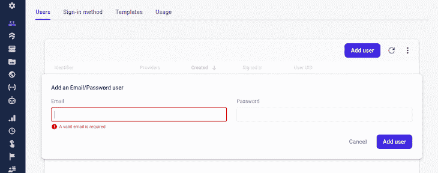

提供有效的电子邮件和密码，然后点击**添加用户。**虽然我们现在手动提供电子邮件，但稍后我们会将 React 应用程序与我们的 Firebase 项目集成，以便新注册的用户电子邮件会被自动添加。

接下来，让我们为初始化 Admin SDK 生成一个私钥。在工具条中，点击**设置**图标，然后点击**项目设置**。我们将看到如下所示的页面:

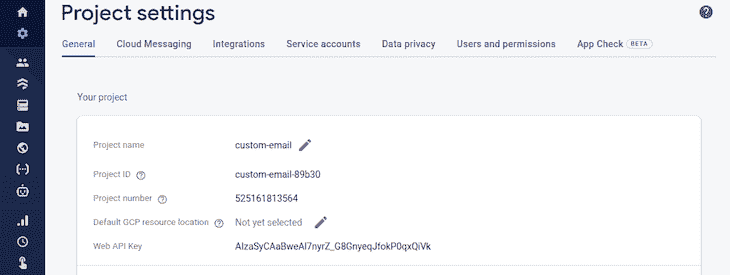

转到**服务帐户**选项卡，并滚动到生成新私钥按钮:

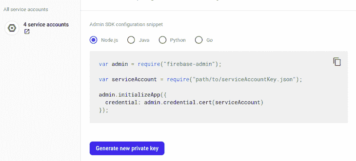

点击 **Generate new private key** 按钮，您会看到一条提示警告信息，提示我们应该对私钥保密:

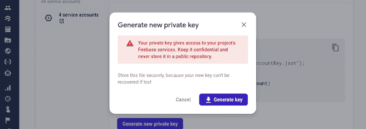

点击**生成键**，一个如下的`.json`文件将被下载到你的电脑上:

```
{
  "type": "service_account",
  "project_id": "<project_id>",
  "private_key_id": "<private_key_id>",
  "private_key": "<private_key>",
  "client_email": "<client_email>",
  "client_id": "<client_id>",
  "auth_uri": "<auth_uri>",
  "token_uri": "<token_uri>",
  "auth_provider_x509_cert_url": "<auth_provider>",
  "client_x509_cert_url": "<client_cert_url>"
}

```

让我们处理这个文件。首先，将`.json`文件移动到您的 Express app 的根目录，然后将其重命名为`serviceAccountKey.js`。我们正在把它从`.json`改成`.js`，这样我们就可以使用`process.env`来访问`.env`文件。

接下来，删除除了`project_id`、`private_key`和`client_email`之外的所有属性，这是我们真正需要的属性:

```
// serviceAccountKey.js
{
  "project_id": "<project_id>",
  "private_key": "<private_key>",
  "client_email": "<client_email>",
}

```

将属性值复制并粘贴到位于 Express app 根目录下的`.env`文件中的相应变量:

```
// .env
PROJECT_ID = <your_project_id>
PRIVATE_KEY = <your_private_key>
CLIENT_EMAIL = <your_client_email>

```

在`serviceAccountKey.js`文件中，让我们确保属性值来自`.env`文件:

```
// serviceAccountKey.js
const dotenv = require('./dotenvConfig')()

module.exports = {
  "project_id": process.env.PROJECT_ID,
  "private_key": process.env.PRIVATE_KEY.replace(/\\n/g, '\n'),
  "client_email": process.env.CLIENT_EMAIL,
}

```

现在，为了初始化 Admin SDK，将以下代码复制并粘贴到`index.js`中的`dotenv`导入下，该导入位于我们的 Express 应用程序的根目录下:

```
// index.js
...
const admin = require("firebase-admin")
const serviceAccount = require('./serviceAccountKey.js')

// initialize Firebase Admin SDK
const adminApp = admin.initializeApp({
  credential: admin.credential.cert(serviceAccount)
})

```

上面的代码可以在 Firebase 上的**项目设置页面**的**服务账户标签**中找到。至此，我们已经初始化了 Firebase Admin SDK。

### 生成电子邮件验证操作链接

要生成电子邮件验证操作链接，首先在`serviceAccount`导入后添加以下命令:

```
// index.js
const {getAuth} = require("firebase-admin/auth")

```

下面是我们将用来生成操作链接的示例代码:

```
const userEmail = '[email protected]'
const actionCodeSettings = {
    url: redirectUrl // URL you want to be redirected to after email verification
  }
try{
   const actionLink = await getAuth()
  .generateEmailVerificationLink(useremail, actionCodeSettings)
}catch(error){
 // handle errors
}

```

现在，让我们使用上面的代码创建一个`POST`路由，其中`userEmail`和`redirectUrl`将来自请求体。在`index.js`文件中的`GET`路线后添加以下代码:

```
// index.js
app.post('/send-custom-verification-email', async (req, res) => {
  const {userEmail, redirectUrl} = req.body
  const emailValidate = /^\w+([\.-]?\w+)*@\w+([\.-]?\w+)*(\.\w{2,3})+$/

  if(!userEmail?.match(emailValidate)){
    return res.status(401).json({message: 'Invalid email'})
  }else if(!redirectUrl || typeof redirectUrl !== 'string'){
    return res.status(401).json({message: 'Invalid redirectUrl'})
  }

  const actionCodeSettings = {
    url: redirectUrl
  }

  try{
    const actionLink =  await getAuth()
    .generateEmailVerificationLink(userEmail, actionCodeSettings)
    res.status(200).json({message:'Email successfully sent'})
  }catch(error){
    const message = error.message
    if(error.code === 'auth/user-not-found'){
      return res.status(404).json({message})
    }
    if(error.code === 'auth/invalid-continue-uri'){
      return res.status(401).json({message})
    }
    res.status(500).json({message})}
})

```

在上面的代码中，我们从请求体中获取`userEmail`和`redirectUrl`，用`if`语句验证这些值，然后将它们传递给`generateEmailVerificationLink`方法。如果一切顺利，`generateEmailVerificationLink`返回动作链接，但是如果不顺利，我们使用`catch`块捕捉任何可能的错误。

为了验证请求体，我们将使用`if`语句。或者，为了更好的验证，您可以使用 [express-validator](https://express-validator.github.io/docs/) 。

### 制作发送给用户的电子邮件模板

在我们的 Express 应用程序的`views`文件夹中，我添加了一个`verify-email.html`文件，这是我们将在本教程中使用的电子邮件模板。我们可以通过在浏览器中打开模板来查看它:


我们的目标是当用户点击**验证你的电子邮件**按钮时，我们将通过使用 EJS 将生成的动作链接传递给锚标签的`href`属性来验证他们的电子邮件。

首先，将验证电子邮件模板从`.html`重命名为`.ejs`。接下来，在`index.js`文件中，在`getAuth`导入之后添加以下导入:

```
// index.js
const ejs = require('ejs')

```

接下来，在`actionLink`变量后添加以下代码行:

```
// index.js
...
const template = await ejs.renderFile('views/verify-email.ejs', {
  actionLink,
  randomNumber: Math.random()
})

```

上面的代码将把动作链接和一个随机数传递给电子邮件模板。使用随机数，我们可以将 Gmail 配置为在向同一用户多次发送验证电子邮件时不隐藏我们的电子邮件。

转到`verify-email.ejs`文件，修改第 247 行中的锚标记，使其看起来像下面的代码:

```
// verify-email.ejs
<a href="<%= actionLink %>" target="_blank" class="btn btn-primary">Verify your email</a>

```

现在，在页面底部的`<!-- end tr -->`注释后添加以下代码:

```
// verify-email.ejs
<span style="color: #f1f1f1; display: none;"><%= randomNumber %></span>

```

这样，我们的电子邮件就可以发送给用户了。剩下的唯一一件事就是设置 SendGrid 来发送验证邮件。

### 设置 SendGrid 以发送事务性电子邮件

要使用 SendGrid 发送电子邮件，我们首先需要注册一个免费的 [SendGrid 账户](https://signup.sendgrid.com/)。

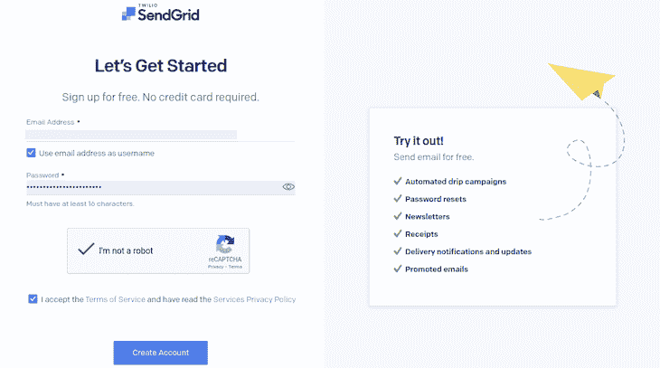

提供有效的电子邮件和强密码后，点击**创建账户。**要继续注册，我们需要提供更多个人信息:

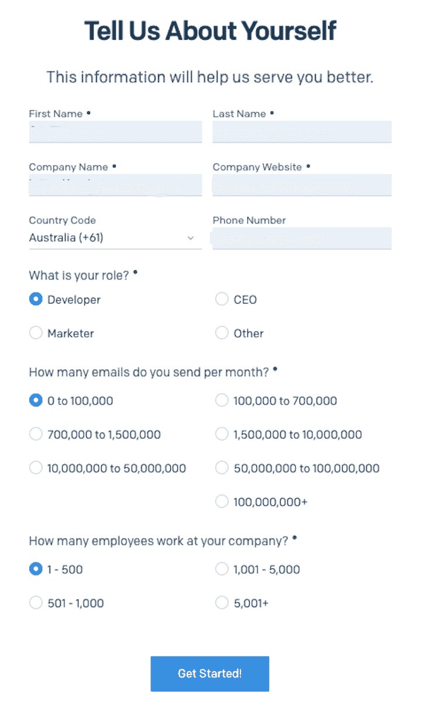

完成注册后，我们将进入控制面板，在发送电子邮件之前，我们需要创建一个发件人身份:


点击**创建单个发送者**按钮。在出现的表单中，填写所需的详细信息。请记住，SendGrid 建议使用自定义电子邮件域，而不是 Gmail.com 这样的免费电子邮件域:

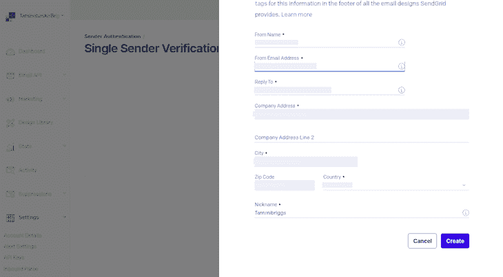

填写完表格后，点击**创建**按钮。将发送一封电子邮件，要求我们验证我们的单一发件人。点击**返回单一发送者验证**按钮，我们的发送者身份将被验证:

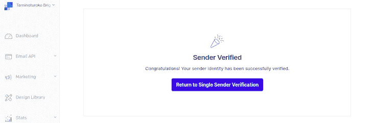

现在，我们需要创建一个 API 密匙来授权我们执行某些操作。在侧边栏的底部，点击**设置**，然后点击 **API 键**，你将被带到这个页面:

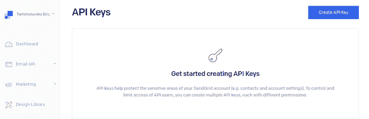

点击页面右上角的**创建 API 键**。您应该看到以下内容:

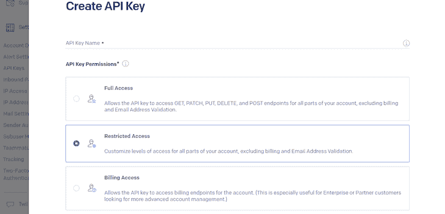

给 API 密钥命名，并选择**受限访问**选项。然后，滚动到页面底部，让 API 键完全访问邮件发送功能:

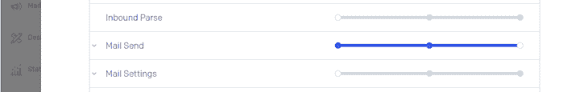

现在，转到页面底部，点击**创建&视图**。在下一页，您将看到您的 API 密钥:

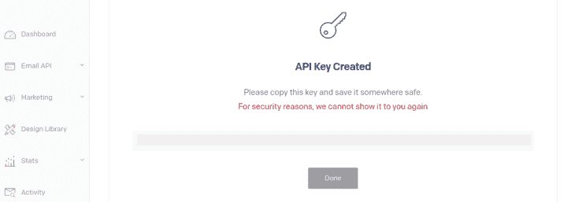

正如警告所说，这个 API 键不会再显示。立即复制它，然后在您的 Express 应用程序中检查`.env`文件，并将其提供给相应的变量:

```
// .env
SENDGRID_API_KEY = <your SendGrid API key>
VERIFIED_SENDER = <your SendGrid verified sender identity>

```

为`VERIFIED_SENDER`变量提供值，这是我们创建单个发件人身份时用作`From Email Address`的电子邮件。现在，要创建发送电子邮件的功能，在您的 Express 应用程序的根目录下，创建一个`sendEmail.js`文件，并向其中添加以下代码行:

```
// sendEmail.js
const dotenv = require('./dotenvConfig')()
const sgMail = require('@sendgrid/mail')

const SENDGRID_KEY = process.env.SENDGRID_API_KEY
const VERIFIED_EMAIL = process.env.VERIFIED_SENDER

sgMail.setApiKey(SENDGRID_KEY)

module.exports = function sendVerificationEmail(userEmail, template, actionLink){
  const message = {
    from: {
      name: 'Custom verify',
      email: VERIFIED_EMAIL
    },
    to: userEmail,
    subject: 'Verify your email address',
    text: `Thanks for signing up with us. Follow the link below to verify your email address.
    \n\n${actionLink} \n\nIf this email wasn't intended for you feel free to delete it.`,
    html: template
  }
  return sgMail.send(message)
}

```

在上面的代码中，我们使用`setApiKey`函数从环境变量中设置了 SendGrid API 键。然后，我们创建了一个`sendVerificationEmail`函数，用于发送以`userEmail`和`actionLink`为参数的验证邮件。这些参数用于构造我们将发送给用户的电子邮件。

您会注意到，即使在添加了 HTML 电子邮件之后，我们仍然添加了纯文本版本的电子邮件。一些电子邮件客户端和用户设置不能或选择不加载 HTML，所以这是一种预防措施。

现在，剩下的就是在`index.js`文件中调用我们的`POST`路线中的`sendVerificationEmail`。为此，首先在`ejs`导入之后添加以下导入:

```
// index.js
const sendVerificationEmail = require('./sendEmail')

```

现在，在`POST`路线中的`template`变量后添加以下代码:

```
// index.js
await sendVerificationEmail(userEmail, template, actionLink)

```

我们的`POST`路线现在已经准备好使用 Firebase 发送定制的验证电子邮件。酷，但我们还没完呢！我们仍然需要在前端 React 应用程序中使用 API。

在我们之前克隆的 React 应用中，当我们转到`Register.js`和`Login.js`文件时，我们将在注册和登录函数中看到下面的代码片段:

```
// Register.js & Login.js
sendEmailVerification(auth.currentUser)
  .then(() => {
    setTimeActive(true)
    history.push('/verify-email')
  })
.catch(err => alert(err.message))

```

我们只需要上面的代码就可以开始从 React 发送定制的电子邮件。在此之前，我们需要用适当的值替换`firebase.js`文件中`firebaseConfig`的值。

转到我们之前创建的 Firebase 项目的**概述**页面，您会看到如下几个图标:


点击 **web `</>`图标**，为 web 配置 Firebase 项目。我们应该看到这样一个页面:


为 web 应用程序命名。对于本教程，我们将其命名为`custom-email`。点击**注册 app** 按钮进入下一步，我们的`firebaseConfig`对象展现在我们面前:


复制`firebaseConfig`并用 React 应用程序中的`firebase.js`文件中的文件替换它。点击**继续控制台**按钮完成该过程。现在，当我们用`npm start`命令启动我们的应用程序时，一切都会正常运行。

要开始发送定制的电子邮件，请在 React 应用程序的`src`目录中创建一个`sendEmail.js`文件。添加以下代码行:

```
// src/sendEmail.js
async function sendVerificationEmail(userEmail){
  const res = await fetch('http://localhost:8000/send-custom-verification-email', {
    method: 'POST',
    body: JSON.stringify({
      userEmail,
      redirectUrl: 'http://localhost:3000'
    }),
    headers: {
      'Accept': 'application/json',
      'Content-Type': 'application/json; charset=UTF-8',
    },
  })
  const resBody = await res.json();
  if(res.status !== 200){
    throw Error(resBody.message)
  }

  return resBody
}
export default sendVerificationEmail

```

在上面的代码中，我们创建了一个函数，它接收用户的电子邮件作为参数，发送一个带有用户电子邮件和附加在正文中的`redirectUrl`的`POST`请求，这正是我们的 API 所需要的。

当一个响应从 API 返回时，如果状态不等于`200`，我们抛出一个异常，但是如果等于，我们返回响应的主体。

现在，我们用下面的替换我们的`Register.js`和`Login.js`文件中的`sendEmailVerification`。先说`Register.js`文件。首先，在`useAuthValue`导入之后添加以下导入:

```
// src/Register.js
import sendVerificationEmail from './sendEmail'

```

现在，在`register`函数中，用以下命令替换`sendEmailVerification(auth.currentUser)`:

```
// src/Register.js
sendVerificationEmail(auth.currentUser.email)

```

我们将在`Login.js`文件中做完全相同的事情。我们的 React 应用程序现在可以在新用户注册或未经验证的用户试图登录时发送定制的验证电子邮件。

> 注意:在测试 React 应用程序之前，请确保 Express 服务器仍在运行。

## 结论

在本教程中，我们学习了如何在使用 Firebase 认证服务时发送定制的电子邮件。您可以使用本教程中的信息，全力以赴地使用 Firebase 向您的用户发送电子邮件，定制它们以匹配您的应用程序的视觉效果。

我希望你喜欢这篇文章，如果你有任何问题，一定要留下评论。编码快乐！

## 使用 LogRocket 消除传统反应错误报告的噪音

[LogRocket](https://lp.logrocket.com/blg/react-signup-issue-free)

是一款 React analytics 解决方案，可保护您免受数百个误报错误警报的影响，只针对少数真正重要的项目。LogRocket 告诉您 React 应用程序中实际影响用户的最具影响力的 bug 和 UX 问题。

[ ](https://lp.logrocket.com/blg/react-signup-general) [  ](https://lp.logrocket.com/blg/react-signup-general) [LogRocket](https://lp.logrocket.com/blg/react-signup-issue-free)

自动聚合客户端错误、反应错误边界、还原状态、缓慢的组件加载时间、JS 异常、前端性能指标和用户交互。然后，LogRocket 使用机器学习来通知您影响大多数用户的最具影响力的问题，并提供您修复它所需的上下文。

关注重要的 React bug—[今天就试试 LogRocket】。](https://lp.logrocket.com/blg/react-signup-issue-free)