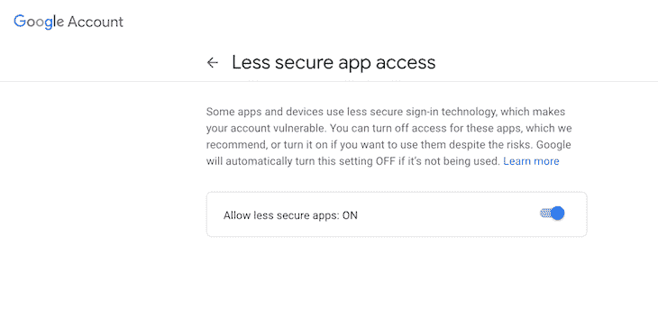
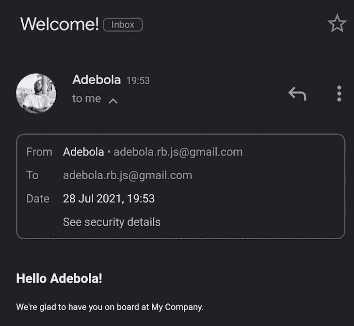
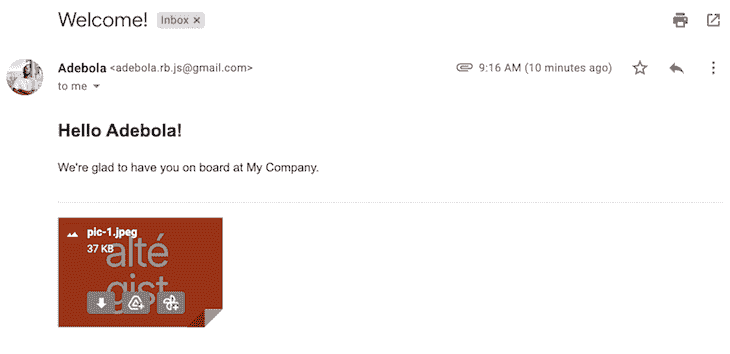
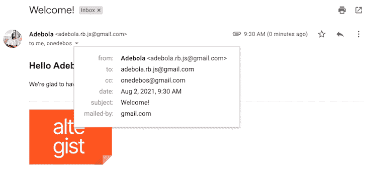
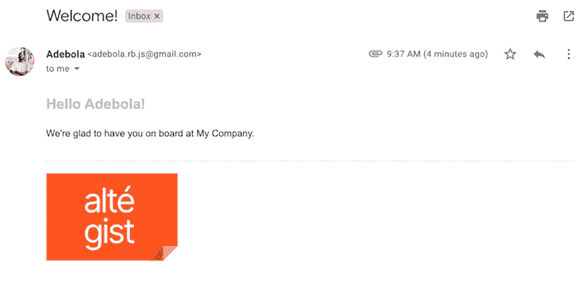

# 使用 Nodemailer - LogRocket Blog 在 Node.js 中发送电子邮件

> 原文：<https://blog.logrocket.com/send-emails-nodejs-nodemailer/>

在某些情况下，开发人员可能希望直接从服务器向应用程序的用户发送电子邮件，如欢迎消息或帐户设置链接。Nodemailer 是一个零依赖性 Node.js 模块，它通过抽象掉将应用程序连接到电子邮件服务时出现的一些复杂性，使从服务器发送电子邮件变得容易。

在本教程中，我们将介绍如何为 Nodemailer 配置电子邮件地址，从应用程序内部发送电子邮件，将文件附加到电子邮件，添加 CC 和 BCC 字段，最后，将 CSS 和 HTML 样式添加到电子邮件模板。

要阅读本文，您需要:

*   在您的计算机上全局安装 Node.js v6.0.0 或更新的版本
*   npm 全局安装在您的计算机上
*   Node.js 和 JavaScript 的基础知识

如果你想继续，你可以在我的 [GitHub repo](https://github.com/onedebos/nodemailer) 中查看这个演示的代码。我们开始吧！

## 为节点邮件程序配置电子邮件地址

如果你还没有想要使用的电子邮件地址，请创建一个新的。您可以使用任何电子邮件服务，但是，如果您使用的是 Gmail 帐户，您需要遵循一些重要步骤来配置您的帐户。

### Gmail 配置

默认情况下，Gmail 会阻止机器人访问谷歌服务器上的电子邮件。Gmail 会进行多项检查，以确保每个电子邮件帐户都是由一个识别的用户在一个识别的位置访问的。

如果您的 Gmail 帐户设置了 2FA，您可能无法跟进。你要么需要禁用 2FA，要么创建一个禁用 2FA 的新帐户。

在下图的屏幕上，通过切换按钮`ON`，允许不太安全的应用程序访问您的 Gmail 帐户。



## 设置 Node.js 服务器

现在，我们的电子邮件帐户设置正确，让我们开始编写代码。

首先，创建一个新目录。我叫我的`fassstmail`:

```
mkdir fassstmail
cd fassstmail

```

在`fassstmail`目录下，创建一个新的 Node.js 项目:

```
npm init -y

```

接下来，我们将安装 Express Handlebars，[一个模板引擎](https://blog.logrocket.com/top-express-js-template-engines-for-dynamic-html-pages/#handlebars)，它允许我们创建 HTML 电子邮件模板:

```
npm i nodemailer-express-handlebars nodemailer

```

## 创建电子邮件模板

现在我们已经安装了所需的依赖项，让我们设置一个发送电子邮件的模板。

在项目的根目录下，创建一个名为`views`的文件夹。在里面，创建一个名为`email.handlebars`的文件，它将保存我们电子邮件的 HTML 代码和样式。

Handlebars 是一种模板语言，所以我们可以在 HTML 中添加变量，然后用变量替换我们希望在最终电子邮件中使用的值。在手柄中，变量由两个包围变量文本的左右括号构成，如`{{variable}}`所示。

在`email.handlebars`文件中，让我们为一封简单的欢迎邮件创建一个 HTML 模板:

```
// email.handlebars
<!DOCTYPE html>
<html>
<head>
  <meta charset="utf-8">
  <meta http-equiv="x-ua-compatible" content="ie=edge">
  <title>Welcome Email</title>
</head>
<body>
  <h2>Hello {{name}}! </h2>
  <p>We're glad to have you on board at {{company}}. </p>
</body>
</html>

```

在上面的 HTML 模板中，我们有两个变量，`{{name}}`和`{{company}}`。稍后，我们将学习如何用实际值替换模板中的变量。

## 在节点邮件程序中发送电子邮件

现在我们已经设置了电子邮件模板，让我们创建一个条目文件。在`fassstmail`项目的根目录下创建一个名为`server.js`的文件。在`server.js`中，添加以下代码，这将触发发送电子邮件:

```
const hbs = require('nodemailer-express-handlebars')
const nodemailer = require('nodemailer')
const path = require('path')

// initialize nodemailer
var transporter = nodemailer.createTransport(
    {
        service: 'gmail',
        auth:{
            user: '[email protected]',
            pass: 'password_for_your_email_address'
        }
    }
);

// point to the template folder
const handlebarOptions = {
    viewEngine: {
        partialsDir: path.resolve('./views/'),
        defaultLayout: false,
    },
    viewPath: path.resolve('./views/'),
};

// use a template file with nodemailer
transporter.use('compile', hbs(handlebarOptions))

var mailOptions = {
    from: '"Adebola" <[email protected]>', // sender address
    to: '[email protected]', // list of receivers
    subject: 'Welcome!',
    template: 'email', // the name of the template file i.e email.handlebars
    context:{
        name: "Adebola", // replace {{name}} with Adebola
        company: 'My Company' // replace {{company}} with My Company
    }
};

// trigger the sending of the E-mail
transporter.sendMail(mailOptions, function(error, info){
    if(error){
        return console.log(error);
    }
    console.log('Message sent: ' + info.response);
});

```

在`mailOptions`对象中，`template`指的是我们希望与 Nodemailer 一起使用的模板文件。在我们的例子中，我们想使用`email.handlebars`文件。`context`对象保存了我们想要用来代替车把模板文件中的变量的实际值。

我将用`Adebola`替换变量`{{name}}`，用`My Company`替换变量`{{company}}`。

最后，要触发发送电子邮件，调用`transporter.sendMail`函数并将其传递给`mailOptions`对象。

要测试您的代码，请在您的终端中运行命令`node server.js`。您应该得到一个显示“消息已发送”的响应。您应该会在收件箱中看到我们的最终电子邮件！



就是这样！您已经使用 Nodemailer 成功发送了一封电子邮件。您可以按照上面概述的步骤发送其他类型的电子邮件，甚至可以使用 Nodemailer 来通知自己服务器上是否出现了问题。

现在，让我们学习如何给邮件添加附件。

## 向您的电子邮件添加附件

在项目的根目录下，创建一个名为`attachments`的文件夹，其中包含我们希望作为附件添加到电子邮件中的文件。我将通过添加到`attachments`文件夹来添加一个名为`pic-1.jpeg`的图像。

接下来，将下面一行添加到`mailOptions`对象。

```
var mailOptions = {
...,
attachments: [{ filename: "pic-1.jpeg", path: "./attachments/pic-1.jpeg" }],
}

```

在`mailOptions`对象中，`attachments`接受一个数组，这意味着您可以在发送的电子邮件中附加任何类型的文件。现在，当我们发送电子邮件时，会附上图像。



要将其他类型的文件附加到您的电子邮件中，如 pdf 或文档，只需遵循相同的流程。

## 将抄送和密件抄送添加到您的电子邮件模板

让我们添加抄送和密件抄送字段，以便一次将您的电子邮件转发到多个电子邮件地址。将以下代码添加到您的`mailOptions`对象中:

```
var mailOptions = {
...,
cc: '[email protected]',
bcc: '[email protected]'
}

```

在下图中，您可以看到有一个抄送字段，其中包含第二个电子邮件地址:



## 向您的电子邮件模板添加样式

您可以像在 HTML 文件中添加样式一样，在电子邮件中添加样式。在`email.handlebars`文件的`<head>`块中，创建一个`style`块，您可以在其中添加所有想要的样式:

```
<style>
  h2 {
    color: #c4c4c4;
  }
</style>

```

我给我的电子邮件添加了一个浅灰色的标题。我将使用此字段发送个性化消息，如下图所示:



## 结论

现在，您已经拥有了开始使用 Nodemailer 和 Node.js 创建和发送电子邮件所需的所有工具。

Nodemailer 是一个非常好的工具，它使得从一个应用程序安全地发送电子邮件变得非常容易。在本教程中，我们学习了如何在 Nodemailer 中制作自己的电子邮件模板、添加附件以及添加自定义样式。当您需要与应用程序的用户交流时，您可以随时遵循这个过程。

## 200 只显示器出现故障，生产中网络请求缓慢

部署基于节点的 web 应用程序或网站是容易的部分。确保您的节点实例继续为您的应用程序提供资源是事情变得更加困难的地方。如果您对确保对后端或第三方服务的请求成功感兴趣，

[try LogRocket](https://lp.logrocket.com/blg/node-signup)

.

[](https://lp.logrocket.com/blg/node-signup)[https://logrocket.com/signup/](https://lp.logrocket.com/blg/node-signup)

LogRocket 就像是网络和移动应用程序的 DVR，记录下用户与你的应用程序交互时发生的一切。您可以汇总并报告有问题的网络请求，以快速了解根本原因，而不是猜测问题发生的原因。

LogRocket 检测您的应用程序以记录基线性能计时，如页面加载时间、到达第一个字节的时间、慢速网络请求，还记录 Redux、NgRx 和 Vuex 操作/状态。

[Start monitoring for free](https://lp.logrocket.com/blg/node-signup)

.