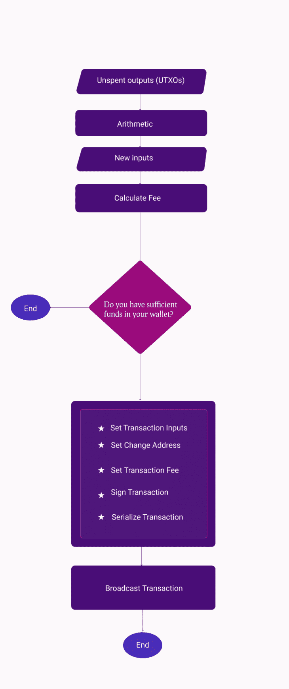
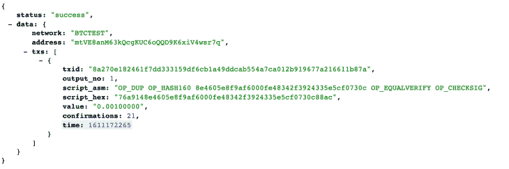

# 使用 JavaScript - LogRocket 博客发送钱包中的比特币

> 原文：<https://blog.logrocket.com/sending-bitcoin-with-javascript/>

如果你正在考虑成为一名区块链开发者，这是一个开始的好时机。

毕竟，根据 [Zip Recruiter 的数据](https://www.ziprecruiter.com/Salaries/Blockchain-Developer-Salary)，一名[区块链](https://en.wikipedia.org/wiki/Blockchain)开发者的平均薪资约为 154550 美元/年。

然而，对于本文，您不需要任何密码学知识就能理解。如果你懂 JavaScript，你就可以开始了。

在本教程结束时，你应该对比特币交易的工作原理有一个大致的了解，并且应该能够使用 JavaScript 将比特币从你的钱包发送给任何人。

## 先决条件

要跟进，您应该:

*   [Node.js](https://nodejs.org/en/) 已安装
*   对 JavaScript 的基本理解

下面是整个比特币交易过程的简单工作流程图。



Bitcoin transaction workflow

以下是交易工作流程:

*   获取未用完的事务输出
*   添加输入以获得新的事务输入
*   计算交易费用
*   检查你是否有足够的余额来支付这笔交易
*   设置交易输入
*   设置更改地址
*   设置交易费用
*   签署交易
*   序列化事务
*   广播交易

## 什么是区块链？

首先，让我们定义两个贯穿本教程的关键术语:区块链和比特币交易。

区块链可以被描述为全局事务日志的不可变分布式数据库。区块链的一个区块可以比作传统数据库中的一个记录。

## 什么是比特币交易？

交易是将价值从一个比特币钱包转移到另一个包含在区块链中的比特币钱包。

## 使用比特币区块链测试网和区块链主网

你通常需要在你的服务器上安装并运行你的比特币节点(你的区块链副本),以便能够参与区块链的开发。然而，我们不会在本教程中这样做。

相反，我们将使用已经在运行比特币节点的第三方服务。

有[区块链比特币试验网和区块链主网](https://www.altcoinbuzz.io/bitcoin-and-crypto-guide/crypto-mainnet-vs-testnet/)。Testnet 是一个比特币区块链，旨在用于测试。这是我们将在本教程中使用的。

***N.B.** ，不要在开发中使用真实的比特币；比特币交易不可逆；一旦丢失，就无法恢复，除非你有接收地址的私钥*

## 用比特币建立一个测试网钱包

首先，我们需要一些比特币来发送，对吗？因此，让我们创建一个 Testnet 钱包，并在其中装入一些比特币。您可以快速使用[钱包生成器网站](https://walletgenerator.net/?currency=Testnet%20Bitcoin#)来生成 Testnet 钱包。

或者可以用 [bitcore-core](https://github.com/bitpay/bitcore/blob/master/packages/bitcore-lib/docs/address.md) 生成一个。

这是我刚从网站上生成的。

*   私钥= `93F2mUJPKbXW8Q9cMNz4ZmpsjgTbNjrMeCaUesTPE7k1DFhSmnk`(在现实世界中，这个私钥不应该显示给任何人，但这是一个测试网，所以无论如何😀)
*   地址= `mtVE8anM63kQcgKUC6oQQD9K6xiV4wsr7q`

让我们使用一个比特币 Testnet 水龙头网站向它发送一些比特币。我将从[这个 Testnet 网站](https://testnet-faucet.mempool.co/)发送 0.00 比特币到这个地址(`mtVE8anM63kQcgKUC6oQQD9K6xiV4wsr7q`)。

现在我们的钱包里有了一些比特币，让我们创建一个简单的 Node.js 应用程序，它将允许我们发送比特币。

使用`npm init -y`设置您的节点应用程序，并安装 Bitcore 开源库——我们将使用 [Bitcore 库](https://www.npmjs.com/package/bitcore-lib)和 [Axios](https://www.npmjs.com/package/axios) 与区块链接口。

```
npm install axios, bitcore-lib

```

创建 index.js 文件并导入 Bitcore 和 Axios 库。

```
const axios = require("axios");
const bitcore = require("bitcore-lib");

```

然后创建一个实际发送比特币的函数`sendBitcoin`。

我们将使用 [SoChain API](https://sochain.com/api) 连接到 Testnet 区块链。

下面的代码是我们将用来发送比特币的函数定义的构建块。它被大量注释以帮助理解。

```
 /** 
  @receiverAddress - Address of the person you want to send bitcoin to
  @amountToSend - This is the amount of bitcoin you want to send to someone from your wallet. This amount will be deducted from your wallet and sent to this address.
*/

let sendBitcoin = (recieverAddress, amountToSend)=>{
  const sochain_network = "BTCTEST"; // the Testnet network for sochain
  const privateKey = `93F2mUJPKbXW8Q9cMNz4ZmpsjgTbNjrMeCaUesTPE7k1DFhSmnk`;// your privateKey -- the one we just generated

/* your bitcoin address. The one you want to send funds from -- the one we just generated */
  const sourceAddress = `mtVE8anM63kQcgKUC6oQQD9K6xiV4wsr7q`; 
/**
because the outputs come in satoshis, and 1 Bitcoin is equal to 100,000,000 satoshies, we'll multiply the amount of bitcoin by 100,000,000 to get the value in satoshis.
*/
  const satoshiToSend = amountToSend * 100000000; 
  let fee = 0; 
  let inputCount = 0;
  let outputCount = 2; // we are going to use 2 as the output count because we'll only send the bitcoin to 2 addresses the receiver's address and our change address.
}

```

## 接收未用产出

未用输出是您收到的比特币钱包中尚未花费的交易。假设你在五次不同的交易中收到价值 100 美元的比特币，你将有五次未用完的产出。

让我们使用 [SoChain 块资源管理器](https://sochain.com/)来找出目前为止我们的钱包中有多少输出。如果您在 GET 请求中将网络和地址传递给下面的 URL，它将返回一个包含未用输出的结果。

```
https://sochain.com/api/v2/get_tx_unspent/{Network}/{Address}
```

例如，如果我们将地址传递给它，就像这样:

```
https://sochain.com/api/v2/get_tx_unspent/BTCTEST/mtVE8anM63kQcgKUC6oQQD9K6xiV4wsr7q
```

这是我们将得到的结果:



Unspent output

`txs`部分是所有未用输出的数组。

这只是我们在那里的一个未使用的输出。因为我给那个地址发过一次比特币，还没花完。

为了在我们的代码中使用这些数据，让我们使用 Axios 来获取这些数据:

```
  const utxos = await axios.get(
    `https://sochain.com/api/v2/get_tx_unspent/${sochain_network}/${sourceAddress}`
  );

```

接下来，使用 Bitcore lib API 初始化一个新的事务。

```
  const transaction = new bitcore.Transaction();

```

从现在开始，我们将使用这个事务实例来完成整个过程。

## 建立新的投入

从未使用的输出中，我们需要构建一个新的输入。我们的投入将等于未支出的产出。

让我们从未用完的输出数组中获取创建新输入所需的输出的基本元素。我们这样做是因为 Bitcore API 要求的对象形状和 SoChain 返回给我们的并不一样。以下是我们在交易中需要注意的项目。

*   satoshis:satoshis 中未用输出的值
*   脚本:定义如何花费未用产出的指令
*   地址:你的钱包地址
*   交易 ID (txid):这是在区块链识别您的交易的唯一 ID
*   outputIndex:事务中每个输出的索引

```
utxo.satoshis = Math.floor(Number(element.value) * 100000000);
utxo.script = element.script_hex;
utxo.address = utxos.data.data.address;
utxo.txId = element.txid;
utxo.outputIndex = element.output_no;

```

从未用完输出数组中获取数据，并构建新的输入:

```
    let inputs = [];
   let utxos = response.data.data.txs;

   for (const element of utxos) {
     let utxo = {};
     utxo.satoshis = Math.floor(Number(element.value) * 100000000);
     utxo.script = element.script_hex;
     utxo.address = response.data.data.address;
     utxo.txId = element.txid;
     utxo.outputIndex = element.output_no;
     totalAmountAvailable += utxo.satoshis;
     inputCount += 1;
     inputs.push(utxo);
   }

```

现在我们已经在一个数组中获得了输入，让我们设置事务输入。

```
transaction.from(inputs);

```

## 处理比特币交易费用

如果你玩过比特币，你会注意到有时费用很高，而其他时候可能接近于零。嗯，那是因为真的不收费。听起来违反直觉，对吧？

是的，你可以决定免费发送比特币，但它可能需要很长时间才能被矿工挑选并添加到区块链。收费是一个概念，允许矿工的努力得到补偿，并保持网络安全。

此外，由于比特币交易的最大块大小为 1MB，矿商往往会优先考虑收费最高的交易。截至本文撰写时，[平均优先级费](https://bitcoinfees.earn.com)约为 108 satoshis/byte。

那么，如何确定费用呢？

因为费用不取决于你发送的比特币数量，而是取决于交易的规模，你需要首先确定交易的规模。有趣的是，交易的大小取决于交易中的投入和产出。

该公式可用于确定尺寸:

```
  transactionSize = inputCount * 180 + outputCount * 34 + 10 - inputCount;

```

在每笔比特币交易中，每个输入为交易贡献 180 个字节，而每个输出为交易贡献 34 个字节。然后还有额外的 10 个字节需要从事务中增加或减少。

假设您有一个有两个输入和两个输出的事务，事务大小将是 2 *180+2* 34+10-2 = 436 字节。
所以，如果你要支付每字节 20 个 satoshis，那么费用将是:
费= 20*436
费= 8720 satoshis

因为 100，000，000 个 satoshis 等于 1 个比特币，所以要分 8720/100，000，000。

这使得费用为 0.0000872 比特币，截至本文撰写之时，约为 3.03 美元。

这就是你如何确定你的比特币费用。此外，您可以使用[bitcoinfees.earn.com/api](https://bitcoinfees.earn.com/api)获得推荐费用。

现在你知道了交易的费用，你可以很容易地检查你的余额是否足够支付包括费用在内的交易。

```
  // Check if we have enough funds to cover the transaction and the fees
  if (totalAmountAvailable - satoshiToSend - fee < 0) {
    throw new Error("Balance is too low for this transaction");
  }

```

## 设置比特币接收方地址、发送金额和费用

现在，您已经计算了您的费用，并验证了您有足够的余额来支付您的费用和整个交易，您可以继续使用 Bitcore API 设置接收地址和费用。

```
   transaction.to(recieverAddress, satoshiToSend); // receiving address and amount of satoshis to send.
  transaction.fee(fee);

```

## 设置比特币更改地址

你不能只将部分比特币余额发送到另一个地址。不，你取出所有的东西，把你想要的钱寄到收款地址，然后把零钱寄回给你自己。

因此，更改地址就是您的地址——在发送给接收方后，您希望将余额存入的地址。

因此，我们将使用 Bitcore 函数`transaction.change`来设置地址:

```
  transaction.change(sourceAddress);

```

## 签署交易

在我们可以在钱包里消费比特币之前，我们必须拥有那个钱包的私钥。你的私钥就是你解锁任何比特币钱包中资金的密码。

```
  // Sign transaction with your private key
  transaction.sign(privateKey);

```

## 序列化比特币交易

为了广播事务，我们需要序列化事务，以便获得事务的十六进制值:

```
  const serializedTransaction = transaction.serialize();

```

我们要向区块链广播的就是这个交易信息。

## 广播比特币交易

让我们通过 SoChain 节点向区块链广播事务，并向 API 发送一个 post 请求。

```
 // broadcast transaction
  const result = await axios({
    method: "POST",
    url: `https://sochain.com/api/v2/send_tx/${sochain_network}`,
    data: {
      tx_hex: serializedTX,
    },
  });

return result.data.data

```

以下是我们到目前为止构建的所有内容的完整代码:

```
const sendBitcoin = async (recieverAddress, amountToSend) => {
  const sochain_network = "BTCTEST";
  const privateKey = "";
  const sourceAddress = "";
  const satoshiToSend = amountToSend * 100000000;
  let fee = 0;
  let inputCount = 0;
  let outputCount = 2;
  const utxos = await axios.get(
    `https://sochain.com/api/v2/get_tx_unspent/${sochain_network}/${sourceAddress}`
  );
  const transaction = new bitcore.Transaction();
  let totalAmountAvailable = 0;

   let inputs = [];
   let utxos = response.data.data.txs;

   for (const element of utxos) {
     let utxo = {};
     utxo.satoshis = Math.floor(Number(element.value) * 100000000);
     utxo.script = element.script_hex;
     utxo.address = response.data.data.address;
     utxo.txId = element.txid;
     utxo.outputIndex = element.output_no;
     totalAmountAvailable += utxo.satoshis;
     inputCount += 1;
     inputs.push(utxo);
   }

  transactionSize = inputCount * 146 + outputCount * 34 + 10 - inputCount;
  // Check if we have enough funds to cover the transaction and the fees assuming we want to pay 20 satoshis per byte

  fee = transactionSize * 20
  if (totalAmountAvailable - satoshiToSend - fee  < 0) {
    throw new Error("Balance is too low for this transaction");
  }

  //Set transaction input
  transaction.from(inputs);

  // set the recieving address and the amount to send
  transaction.to(recieverAddress, satoshiToSend);

  // Set change address - Address to receive the left over funds after transfer
  transaction.change(sourceAddress);

   //manually set transaction fees: 20 satoshis per byte
  transaction.fee(fee);

  // Sign transaction with your private key
  transaction.sign(privateKey);

  // serialize Transactions
  const serializedTransaction = transaction.serialize();
  // Send transaction
  const result = await axios({
    method: "POST",
    url: `https://sochain.com/api/v2/send_tx/${sochain_network}`,
    data: {
      tx_hex: serializedTX,
    },
  });
  return result.data.data;
};

```

恭喜你，你已经成功创建了一个简单的 JavaScript 函数，使用 62 行代码将比特币发送给你的朋友。

您可以简单地调用`sendBitcoin`函数，然后传递接收者的比特币地址和您希望发送的金额，如下所示，以便将比特币发送给任何人。

`sendBitcoin("mtVE8anM63kQcgKUC6oQQD9K6xiV4wsryq", 0.0003)`

来自该 API 的响应将包含您的交易 ID，您可以使用该 ID 在任何比特币浏览器上验证交易——在我们的情况下，任何比特币 Testnet explorer。

要发送真正的比特币，你需要将网络从`BTCTEST`改为`BTC`，并使用你真正的比特币钱包的私钥和地址。

## 结论

关于区块链、加密货币以及如何使用它们，还有很多东西需要学习。我相信这将为你提供如何使用 JavaScript 从你的钱包中发送比特币的基本信息，并使你能够从那里积累知识。

如果你希望了解更多，我推荐阅读《区块链编程》[](https://programmingblockchain.gitbook.io/programmingblockchain/)*或 [*掌握比特币*](https://github.com/bitcoinbook/bitcoinbook) 这本书，它们都是免费书籍，包含大量信息，可以帮助你开始成为区块链开发者的旅程。我还制作了一个视频来引导你，你可以在 YouTube 上查看。*

 *如果你喜欢这篇文章，请分享。黑客快乐！

## 通过理解上下文，更容易地调试 JavaScript 错误

调试代码总是一项单调乏味的任务。但是你越了解自己的错误，就越容易改正。

LogRocket 让你以新的独特的方式理解这些错误。我们的前端监控解决方案跟踪用户与您的 JavaScript 前端的互动，让您能够准确找出导致错误的用户行为。

[](https://lp.logrocket.com/blg/javascript-signup)

LogRocket 记录控制台日志、页面加载时间、堆栈跟踪、慢速网络请求/响应(带有标题+正文)、浏览器元数据和自定义日志。理解您的 JavaScript 代码的影响从来没有这么简单过！

[Try it for free](https://lp.logrocket.com/blg/javascript-signup)

.*