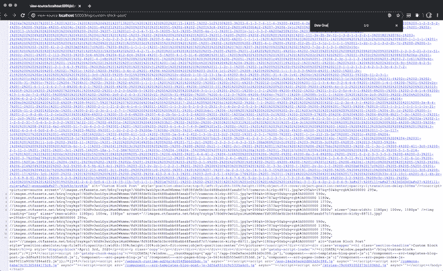
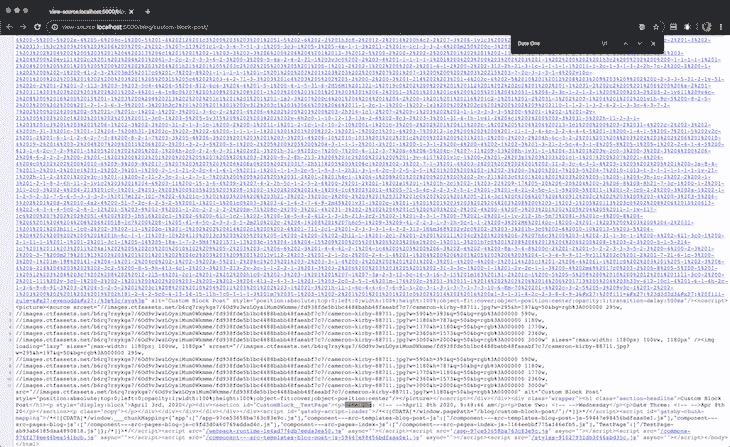

# 一种用可加载组件实现异步组件的 SEO 方法

> 原文：<https://blog.logrocket.com/seo-approach-async-loadable-components/>

您曾经在异步加载组件时查看过网页的页面源代码吗？如果有，您可能已经注意到实际内容没有被呈现。

这是因为组件是在客户端异步加载的，这对 SEO 不利，因为爬虫在索引站点时无法获得实际内容。

本文将提供一种方法，通过使用 [loadable-components](https://github.com/gregberge/loadable-components) 异步加载组件，您可以获得两个世界的最佳效果。

在本文中，我们将使用现有的 Gatsby 项目。该项目已经使用了可加载组件，我们将看到如何更好地实现它的搜索引擎优化的目的。

## 问题陈述

我们有一个 Gatsby 站点，它使用来自内容管理系统 Contentful 的动态数据来呈现信息和模块。Gatsby 站点是一个显示 Contentful 所有帖子的博客。这些帖子是在富文本编辑器中编写的，我们在代码库中使用富文本呈现器来解析富文本以反应组件。

然而，我们也希望能够在网站上显示除博客帖子之外的其他内容。为此，我们在 Contentful: custom blocks 中创建了一个新的内容类型。顾名思义，自定义块允许我们在网站上呈现自定义块(不一定是博客文章的内容)。

这就是挑战所在。与总是以文章格式呈现的博客帖子相反，定制块可能需要根据设计由不同的多个 React 组件呈现。例如，Contentful 上有一个价格信息定制块的 React 组件，Contentful 上有一个 FAQ 定制块的 React 组件，等等。

因此，为了实现这一点，下面有一个文件使用定制块的名称来呈现它自己的组件——也就是说，如果定制块的名称与`CUSTOM_BLOCKS`中的任何键匹配，那么相应的组件将被呈现。

```
// blocks.js
import TestPage from './TestPage'
import PricingInfo from './PricingInfo'
import FAQInfo from './FAQInfo'

const CUSTOM_BLOCKS = {
  TestPage: TestPage,
  PricingInfo: PricingInfo,
  FAQInfo: FAQInfo,
}
export default CUSTOM_BLOCKS
```

然后，可以在如下所示的代码片段中使用定制块，其中只有当与`customBlock.name`匹配时，才会返回`CustomBlockComponent`。

```
// CustomBlock.js
import CUSTOM_BLOCKS from './blocks'

const CustomBlock = ({ customBlock }) => {
  const CustomBlockComponent = CUSTOM_BLOCKS[customBlock.name]
  if (!CustomBlockComponent) {
    return null
  }
  return <CustomBlockComponent customBlock={customBlock} />
}

export default CustomBlock
```

对于当前的实现，我们一次加载所有的定制块及其组件，即使我们并不需要它们。现在，它只是两个自定义块，但想象一下，如果它比这多得多。

## 使用可加载组件

这种情况正是`loadable/component`的用武之地。它允许我们只在需要的时候加载组件，即异步加载。让我们将`loadable/component`添加到上面分享的第一段代码中。

```
// blocks.js
import loadable from '@loadable/component'

const CUSTOM_BLOCKS = {
  TestPage: loadable(() => import('./TestPage')),
  PricingInfo: loadable(() => import('./PricingInfo')),
  FAQInfo: loadable(() => import('./FAQInfo')),
}
export default CUSTOM_BLOCKS
```

所有的定制块都是异步加载的，所以它们只在需要的时候才被加载，这反过来会导致代码的性能得到优化。

这就是为什么我们选择在我们的项目中使用可加载组件的原因，它似乎解决了我们最初遇到的问题。但是，使用 loadable 导入组件意味着自定义块的内容不会预呈现到静态 HTML 中。

举个例子，在下面的页面源代码中，我期望`Date One`文本出现在源代码中，但是没有。`Date One`文本在上面的一个定制块文件中，它需要一些 JavaScript 来评估，因此，它没有显示出来。



这就是我们在本文中试图解决的问题:如何异步加载组件，并确保内容在静态 HTML 中呈现。

## 配置可加载组件

我们可以通过对如何设置`loadable/component`做一些额外的配置来解决这个问题。我们已经在代码库中安装了`loadable/component`，但是我们需要做一些配置。首先，安装下面的依赖项。

```
yarn add -D @loadable/babel-plugin @loadable/webpack-plugin babel-preset-gatsby
```

接下来的事情是添加一个定制的 Babel 插件到项目中。为此，我们需要修改`.babelrc.js`文件。在插件数组中，添加下面一行:

```
// .babelrc.js
{
  "plugins": [
    ...
    "@loadable/babel-plugin",
    ...
  ]
}
```

接下来，我们将在`gatsby-node.js`文件中添加一个定制的 webpack 插件。

```
// gatsby-node.js
const LoadablePlugin = require('@loadable/webpack-plugin')

exports.onCreateWebpackConfig = ({ stage, actions }) => {
  actions.setWebpackConfig({
    plugins: [new LoadablePlugin()],
  })
}
exports.onCreateBabelConfig = ({ actions }) => {
  actions.setBabelPlugin({
    name: `@loadable/babel-plugin`,
  })
}
```

所有这一切的最后一步是确保定制块的内容用静态 HTML 预先呈现。一种方法是使用`loadable/components`的`fallback`道具。

## 在静态 HTML 中预先呈现自定义块元素

属性决定了当组件被异步加载时要显示什么。这将用于确保异步组件被呈现到静态 HTML 中。怎么会？

因此，对于异步组件，会发生以下情况:

1.  呈现静态 HTML
2.  React 组件被合并到静态 HTML 中
3.  因为异步组件需要时间来解析，所以当前的 DOM 被销毁，只有在完成加载后才会重新创建

然后，我们可以利用第二步来获取并保存当前的静态 HTML，然后使用它作为后备。这正是下面的代码片段所做的。如果您还记得上面的话，`CustomBlock.js`文件只是检查一个定制块组件是否存在，然后返回它。

现在它做的远不止这些:

*   将`id`设置为`CustomBlock__`，加上当前的自定义块名称
*   添加一个回退属性，设置为从`getRenderedContent()`函数获取的 HTML
*   最后，`getRenderedContent`函数检查 HTML 中是否存在带有 ID 的元素，如果是，则返回它

    ```
    // CustomBlock.js import * as React from 'react'  import CUSTOM_BLOCKS from './blocks'</p>  <p>const getRenderedContent = customBlockName => {   if (typeof window === 'undefined') return ''   const element = window.document.querySelector(     <code>#CustomBlock__${customBlockName}</code>   )   return element ? element.innerHTML : '' } const CustomBlock = ({ customBlock }) => {   const CustomBlockComponent = CUSTOM_BLOCKS[customBlock.name]   if (!CustomBlockComponent) {     return null   }   return (     <section id={<code>CustomBlock__${customBlock.name}</code>}>       <CustomBlockComponent         customBlock={customBlock}         fallback={           <div             dangerouslySetInnerHTML={{               __html: getRenderedContent(customBlock.name),             }}           />         }       />     </section>   ) } export default CustomBlock
    ```

这有点像黑客，但是我们可以看到页面源代码中异步组件的内容，这对 SEO 很有好处。

现在，我们可以使用以下命令构建站点并在生产中运行它:

```
yarn build && serve public
```

日期现在出现在页面源中，这意味着定制块元素现在被预先呈现，这反过来意味着爬网程序可以成功地对该页面进行爬网。



## 结论

为了模拟我在本文中解释的内容，有一个包含上述 Gatsby 项目代码库的 [GitHub](https://github.com/yomete/loadable-components-seo) 存储库。它还包含一个导出的内容丰富的空间，因此您可以设置它(通过导入到一个新的空间)并连接到 Gatsby 项目。

## [LogRocket](https://lp.logrocket.com/blg/react-signup-general) :全面了解您的生产 React 应用

调试 React 应用程序可能很困难，尤其是当用户遇到难以重现的问题时。如果您对监视和跟踪 Redux 状态、自动显示 JavaScript 错误以及跟踪缓慢的网络请求和组件加载时间感兴趣，

[try LogRocket](https://lp.logrocket.com/blg/react-signup-general)

.

[ ](https://lp.logrocket.com/blg/react-signup-general) [](https://lp.logrocket.com/blg/react-signup-general) 

LogRocket 结合了会话回放、产品分析和错误跟踪，使软件团队能够创建理想的 web 和移动产品体验。这对你来说意味着什么？

LogRocket 不是猜测错误发生的原因，也不是要求用户提供截图和日志转储，而是让您回放问题，就像它们发生在您自己的浏览器中一样，以快速了解哪里出错了。

不再有嘈杂的警报。智能错误跟踪允许您对问题进行分类，然后从中学习。获得有影响的用户问题的通知，而不是误报。警报越少，有用的信号越多。

LogRocket Redux 中间件包为您的用户会话增加了一层额外的可见性。LogRocket 记录 Redux 存储中的所有操作和状态。

现代化您调试 React 应用的方式— [开始免费监控](https://lp.logrocket.com/blg/react-signup-general)。