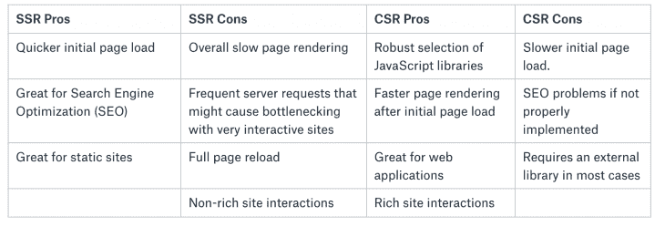
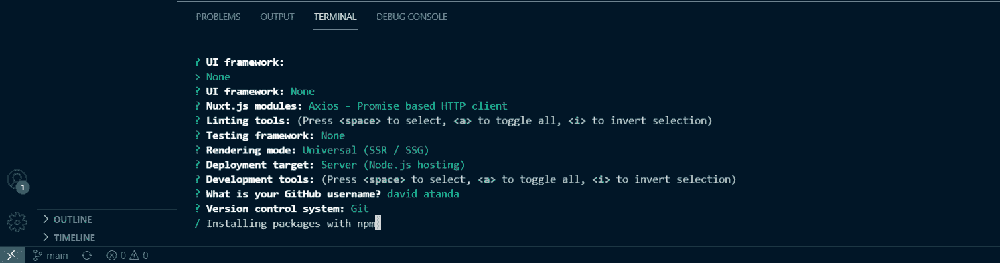
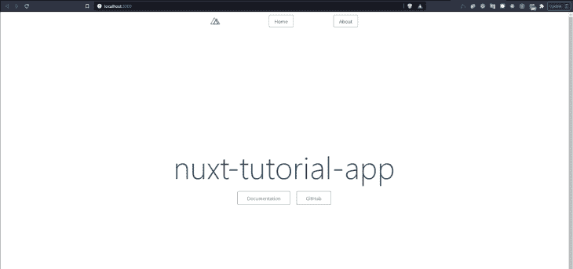
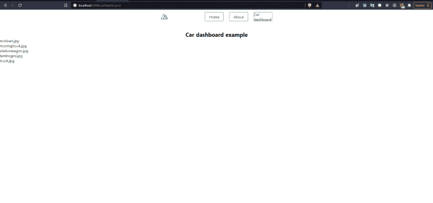
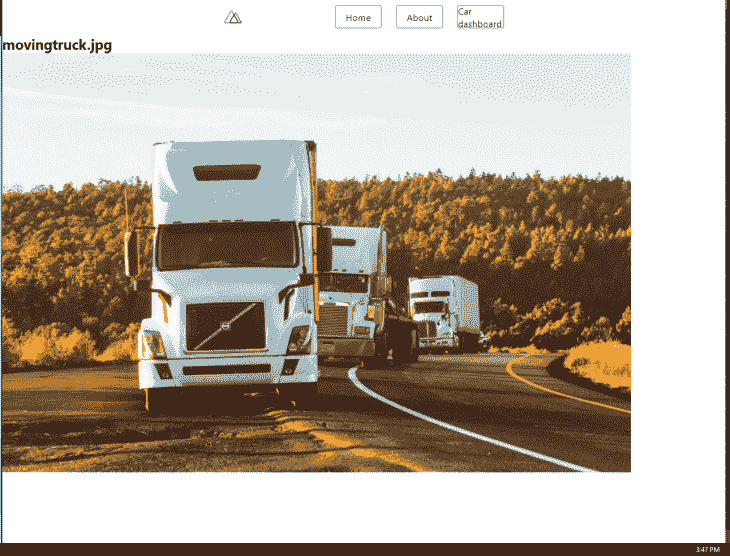
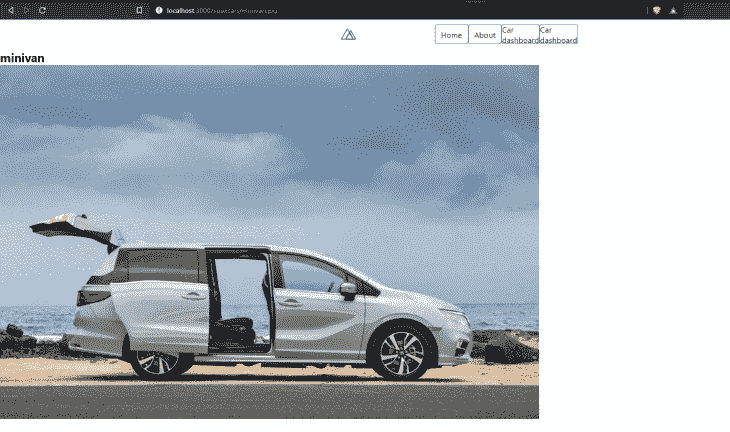
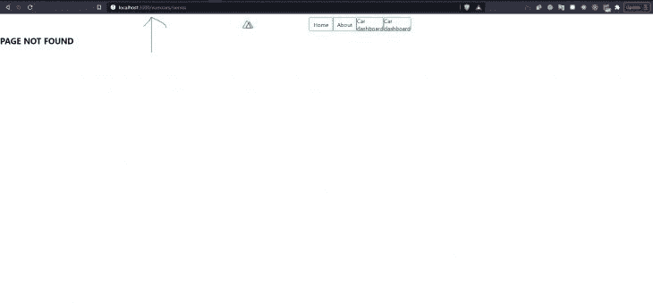
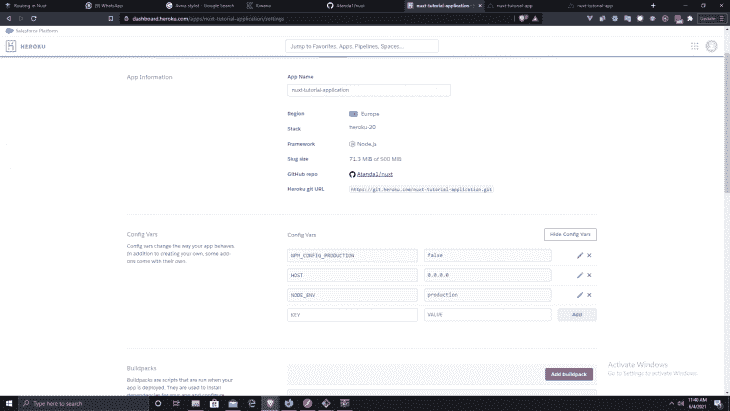

# 使用 Vue 和 Nuxt.js 的服务器端渲染

> 原文：<https://blog.logrocket.com/server-side-rendering-with-vue-and-nuxt-js-64a6d99f5a82/>

***编者按:**这篇博文于 2021 年 6 月更新了相关信息。*

## 什么是服务器端渲染(SSR？)

简单地说，服务器端呈现(SSR)是一种技术，我们通过预取和合并数据来处理服务器上的网页，然后将完全呈现的 HTML 页面传递给浏览器(客户端)。

对于上下文，让我们后退一步来剖析 web 的演变，特别是在前端。在单页面应用程序越来越流行之前，一个 web 页面在向服务器发出请求后通常会收到一个 HTML(在大多数情况下，伴随着一些图像、样式表和 JavaScript)响应，然后在浏览器上呈现。

这在一段时间内非常有效，因为当时大多数网页主要只是显示静态图像和文本，几乎没有交互性。然而今天，情况不再是这样了，因为许多网站已经演变成成熟的应用程序，通常需要交互式用户界面。

随着这一需求而来的是使用 JavaScript 操作 DOM 的需求，这可能是乏味的，并且充满了许多低效，经常导致性能差和用户界面慢。

引入了 React、Angular 和 Vue 等 JavaScript 框架，这使得构建用户界面变得更快、更高效。这些框架引入了虚拟 DOM 的概念，其中用户界面的表示保存在内存中，并与真实 DOM 同步。

此外，不是从 HTML 文档本身获取所有内容，而是接收一个带有 JavaScript 文件的基本 HTML 文档，该文件将向服务器发出请求，获得响应(很可能是 JSON)，并生成适当的 HTML。这被称为客户端渲染(CSR)。

当使用诸如 [Vue](https://vuejs.org/) 之类的 JavaScript 框架时，源文件将如下所示:

```
<!DOCTYPE html>
<html>
<head>
  <meta charset="utf-8">
  <title>Hello World</title>
</head>
<body>
  <div id="root">
    <app></app>
  </div>
  <script src="https://vuejs.org"type="text/javascript"></script>
</body>
</html>

```

如您所见，不是所有内容都在 HTML 标记中，而是有一个容器 div，其`id`为`root`。在这个容器中，我们有一个特殊的标签`app`，它将包含 Vue 解析的内容。服务器现在只负责加载网站或应用程序的最低限度。其他一切都由客户端 JavaScript 库/框架处理，在本例中是 Vue。

### SSR 与 CSR 的利弊

每种方法的优点和缺点可以总结如下:



## 为什么是 Nuxt.js？

CSR 或典型的单页应用程序的一个问题是 SEO，因为许多搜索引擎无法按预期抓取您的应用程序。虽然近年来谷歌的算法有所更新，可以更好地处理这些情况，但它还不是很完美。

我们如何在单页面应用程序中引入 SSR 的优势？js 是一个建立在 Vue 基础上的框架，它允许我们通过一种叫做通用渲染的东西，在避免 SSR 和 CSR 缺点的同时拥有它们的优点。

在 Nuxt 中，当浏览器发送初始请求时，它将命中 Node.js 内部服务器，该服务器在必要时从 API 中提取所有数据。然后，服务器将生成完整的 HTML 并将其发送回浏览器(我们应用程序的 SSR 部分)。HTML 内容会显示出来，但不是交互式的，通常如下所示:

```
<!DOCTYPE html>
  <HTML>
   <head>
    <meta charset="utf-8">
    <title>Hello World</title>
  </head>
  <body>
   <h1>My Website</h1>
   <p>Welcome to my new website</p>
   <p>This is some more content</p>
  </body>
</html>
```

我们还从服务器取回我们的 JavaScript 包，这触发了浏览器上的 Vue.js 水合作用，使其具有反应性。在这个过程之后，页面作为 CSR 应用程序是交互式的。Nuxt 带来的优势包括:

*   更快的初始页面加载，因为 SSR 功能，这解决了搜索引擎优化的问题
*   自动代码分割
*   静态文件服务
*   vuex、Vue 路由器和 vue-meta 的智能默认和预配置:Nuxt 附带默认配置，允许 Vuex(状态管理)和 Vue 路由器的自动路由等功能开箱即用
*   为您的应用程序提供标准的文件夹结构
*   模块化系统使得定制框架变得容易
*   在浏览网站时更快地呈现页面，因为它在浏览器中起着 CSR 的作用

你可以在这里找到对整个概念[的直观解释。](https://dev.to/kefranabg/demystifying-ssr-csr-universal-and-static-rendering-with-animations-m7d)

**注意:**接下来，我假设我们对 Vue 有一个基本的了解。本文的目标读者是那些已经熟悉 Vue.js 及其概念的读者。对于没有 Vue.js 知识的人，可以考虑从 Vue 官方文档或者马克西米利安的[课程](https://www.udemy.com/course/vuejs-2-the-complete-guide/)开始。

## Nuxt 入门

要查看 Nuxt 的运行情况，首先，确保您安装了一个依赖管理器，如 [Yarn](https://yarnpkg.com/en/) 。在 Windows 上，这可以通过从 [Yarn 安装页面](https://yarnpkg.com/lang/en/docs/install/#windows-stable)下载并运行可执行文件来轻松安装。或者，你可以使用 [NPM](https://www.npmjs.com/) 。

让我们通过运行以下命令来构建一个名为`nuxt-tutorial-app`的新项目:`yarn create nuxt-tutorial-app`

还是跟 NPM: `npx create-nuxt-app nuxt-tutorial-app`

安装几次后，您会看到一系列提示。由于这只是一篇关于 Nuxt 的介绍性文章，我们将选择最少的选项来保持简单:



接下来，使用`cd nuxt-tutorial-app`进入`nuxt-tutorial-app`目录

然后，我们将使用以下命令启动我们的服务器:`npm run dev`

在您的浏览器上打开`http:\\localhost:3000 `,您应该会看到类似这样的内容:



## Nuxt 应用程序中的目录结构

让我们看看典型的 Nuxt 应用程序的目录结构。打开`nuxt-tutorial-app`目录，您应该会看到这样的结构:

包含`.vue `文件的目录有`components`、`layouts`和`pages`。`components`目录包含我们可重用的 Vue 组件，而`layouts`目录，顾名思义，包含布局组件。在这个目录下，你会发现一个`default.vue`文件(类似于 Vue 的`App.vue`文件)，这个文件是一个包装了所有`nuxt`组件的组件。该文件中的所有内容都在所有其他页面之间共享，而每个页面内容都替换了`nuxt`组件。

`pages`目录包含顶级视图，并且为该目录中的任何`.vue`文件自动生成路线。

在`.store`目录中，我们存储用于状态管理的 Vuex 文件，`static`目录包含我们希望完全按照它们的样子提供的文件，例如`robots.txt `或`favicon`。

目录包含了我们未编译的资产——当你部署到产品中时需要编译的东西，例如手写笔、SASS、图像和字体。在`plugins`目录中，我们在启动 Vue 应用程序之前加载外部 JavaScript 插件。

在`middleware`目录中，我们放入了在呈现布局或页面之前运行的自定义函数，比如导航卫士。然后，我们有了`nuxt.config.js`文件，它用于修改默认的 Nuxt 配置。

```
export default {
  mode: 'universal',
  // Global page headers: https://go.nuxtjs.dev/config-head
  head: {
    title: 'nuxt-tutorial-app',
    htmlAttrs: {
      lang: 'en'
    },
    meta: [
      { charset: 'utf-8' },
      { name: 'viewport', content: 'width=device-width, initial-scale=1' },
      { hid: 'description', name: 'description', content: '' }
    ],
    link: [
      { rel: 'icon', type: 'image/x-icon', href: '/favicon.ico' }
    ]
  },
  // Global CSS: https://go.nuxtjs.dev/config-css
  css: [
    "~/assets/styles/main.css"
  ],
  // Plugins to run before rendering page: https://go.nuxtjs.dev/config-plugins
  plugins: [
  ],
  // Auto import components: https://go.nuxtjs.dev/config-components
  components: true,
  // Modules for dev and build (recommended): https://go.nuxtjs.dev/config-modules
  buildModules: [
  ],
  // Modules: https://go.nuxtjs.dev/config-modules
  modules: [
    // https://go.nuxtjs.dev/axios
    '@nuxtjs/axios',
  ],
  // Axios module configuration: https://go.nuxtjs.dev/config-axios
  axios: {},
  // Build Configuration: https://go.nuxtjs.dev/config-build
  build: {
  }
}

```

让我们创建一个简单的导航组件，它将在我们所有的页面上可见。在`layouts`目录下创建一个名为`partials`的文件夹。在这个文件夹中，创建一个名为`nav.vue`的文件，并输入以下代码:

```
<template>
  <header>
    <nuxt-link to="/" class="logo">Nuxt-SSR</nuxt-link>
    <nav>
      <ul>
          <li><nuxt-link to="/">Home</nuxt-link></li>
          <li><nuxt-link to="about">About</nuxt-link></li>
          <li><nuxt-link to="services">Services</nuxt-link></li>
          <li><nuxt-link to="contact">Contact</nuxt-link></li>
      </ul>
    </nav>
  </header>
</template>
<script>
export default {
}
</script>
<style>
  header {
      background: rgb(0, 000, 000);
      display: grid;
      grid-template-columns: repeat(2,auto);
  }
  .logo, li a {
      padding: 1em 2em;
      display: block;
      text-transform: uppercase;
      text-decoration: none;
      font-weight: bold;
      color: white;
      font-size: .9em;
  }
  nav {
      justify-self: right;
  }
  ul {
      list-style-type: none;
  }
  li {
      display: inline;
  }
  li a {
      padding: 1em 2em;
      display: inline-block;
      background: rgba(0,0,0,0.1);
  }
</style>
```

## 创建导航组件

让我们进一步分解这段代码。

* * *

### 更多来自 LogRocket 的精彩文章:

* * *

**模式:**应用的类型；不是`universal`就是`spa`。通过选择`universal`，你告诉 Nuxt 你希望你的应用程序能够同时在服务器端和客户端运行。默认情况下，你的 Nuxt 应用程序处于通用模式，这意味着即使它从你的`config`文件中丢失，你的应用程序也处于通用模式。例如，我们在这个配置文件中使用了`@nuxtjs/axios`。

**Head:** 顾名思义，它包含了所有默认的 meta 标签属性和应用程序中`head`标签内的 favicon 链接。这里是因为 Nuxt.js 不像 Vue.js 那样没有默认的`index.html file`。

**CSS:** 您需要输入所有全局 CSS 文件的链接，以便您的应用程序在安装应用程序时可以考虑到它。我们将把 CSS 文件的链接添加到这个文件中，并重新启动我们的应用程序。

```
 /*
   ** Global CSS
   */
  css: ["~/assets/styles/main.css"]

```

**模块:**模块是 Nuxt.js 扩展，可以扩展框架的核心功能，并添加无限的集成。一旦安装了模块，您就可以将它们添加到 modules 属性下的`nuxt.config.js file`中。

**插件:**这是将插件文件夹中的所有插件集成到应用程序中的地方。它接受一个属性为`src`和`mode`的对象。`src`接受插件的文件路径，`mode`配置你的应用程序如何处理这样的插件；作为服务器端或客户端插件。例如，如果我们在项目中使用的是 [`vue-js-modal`](https://www.npmjs.com/package/vue-js-modal) 库，安装后，我们在`plugins`文件夹的`vue-js-modal.js`中初始化它。

```
import Vue from 'vue'
import VModal from 'vue-js-modal/dist/ssr.index'
import 'vue-js-modal/dist/styles.css';
Vue.use(VModal, {
  dialog: true,
  dynamic: true,
  injectModalsContainer: true,
  dynamicDefaults: {
    foo: 'foo'
  }
})

```

之后，它被导入到我们的配置文件中，`mode`显示它是一个服务器插件。

```
{src: '~plugins/vue-js-modal.js', mode: 'server'},
```

**注意:**正确选择`mode`很重要，尤其是如果你的插件需要一个服务器端没有的客户端资源，反之亦然。

**组件:**为`true`时启用自动走线，反之为`false`时启用自动走线。

## 在 Nuxt 中导入组件

在其他组件或页面中使用组件从未如此简单，因为您甚至不需要像在 Vue 中那样手动导入它。您所需要做的就是获得您想要导入的组件的确切名称，并在父组件中使用它，就好像它已经被“自动导入”了一样。例如，假设我们想要将一个`Logo.vue`组件导入到我们的`navBar.vue`组件中:

```
<template>
  <svg class="NuxtLogo" width="245" height="180" viewBox="0 0 452 342" >
    <path
      d="M139 330l-1-2c-2-4-2-8-1-13H29L189 31l67 121 22-16-67-121c-1-2-9-14-22-14-6 0-15 2-22 15L5 303c-1 3-8 16-2 27 4 6 10 12 24 12h136c-14 0-21-6-24-12z"
      fill="#00C58E"
    />
    <path
      d="M447 304L317 70c-2-2-9-15-22-15-6 0-15 3-22 15l-17 28v54l39-67 129 230h-49a23 23 0 0 1-2 14l-1 1c-6 11-21 12-23 12h76c3 0 17-1 24-12 3-5 5-14-2-26z"
      fill="#108775"
    />
    <path
      d="M376 330v-1l1-2c1-4 2-8 1-12l-4-12-102-178-15-27h-1l-15 27-102 178-4 12a24 24 0 0 0 2 15c4 6 10 12 24 12h190c3 0 18-1 25-12zM256 152l93 163H163l93-163z"
      fill="#2F495E"
    />
  </svg>
</template>
<style>
.NuxtLogo {
  animation: 1s appear;
  margin: auto;
}
@keyframes appear {
  0% {
    opacity: 0;
  }
}
</style>

Logo.vue

<template>
  <header class="header">
    <div class="logo">
      <nuxt-link to="/">
        <Logo />
      </nuxt-link>
    </div>
    <nav class="nav">
      <div class="nav__link">
        <nuxt-link to="/">Home</nuxt-link>
      </div>
      <div class="nav__link">
        <nuxt-link to="/About">About</nuxt-link>
      </div>
    </nav>
  </header>
</template>
<script>
export default {
  name: "navBar",
};
navBar.vue

```

只要`Logo.vue`在组件文件夹中，我们就可以安全地将`</Logo>`添加到我们的`navBar`组件中。事实上，`components`文件夹中的任何组件都可以这样导入，另外，组件也可以导入到`pages`文件夹中的`.vue`文件中。如果出于某种原因，你仍然想手动导入组件，就像你用 Vue 做的那样，那也可以。

## Nuxt 中的路由

在开始之前，我们先来看看 Vue 的路由器标签和它在 Nuxt 中的对等物。

*   Vue.js: nuxt.js
*   路由器链接:nuxt-link
*   路由器视图(用于嵌套路由):nuxt-child
*   路由器视图(默认):nuxt

要在 Nuxt 中创建路由，我们只需创建一个新的。我们的 **pages** 文件夹及其子文件夹中的 vue 文件。就像这样，路径是用文件名自动创建的。

```
pages
--| index.vue
--| about.vue
--| dashboard.vue
--| dashboard/
 -----| user.vue
 -----| settings.vue
 -----| index.vue

```

您可以使用`<nuxt-link/>`创建一个链接，该链接可以指向另一个页面。就像下面的代码一样:

```
<nav class="nav">
  <div class="nav__link">
    <nuxt-link to="/">Home</nuxt-link>
  </div>
  <div class="nav__link">
    <nuxt-link to="/about">about</nuxt-link>
  </div>
  <div class="nav__link">
    <nuxt-link to="/dashboard">Dashboard</nuxt-link>
  </div>
  <div>
    <nuxt-link to="/dashboard/user">User's dashboard</nuxt-link>
  </div>
  <div>
    <nuxt-link to="/dashboard/settings">Dashboard settings</nuxt-link>
  </div>
</nav>

```

对于嵌套路由，我们遵循相同的原则并添加`/`，这告诉 Nuxt 我们正在描述一个子文件夹。在`/dashboard`中，我们可以使用`<NuxtChild/>`路由到`/dashboard/user`和`/dashboard/settings`作为子组件。

```
 <template>
    <div>
    <h1>I am the dashboard</h1>
    <nav>
      <ul>
        <li>
          <NuxtLink to="/dashboard/user">User's dashboard</NuxtLink>
        </li>
        <li>
          <NuxtLink to="/dashboard/settings">Dashboard settings</NuxtLink>
        </li>
      </ul>
    </nav>
    <NuxtChild  />
  </div>
</template>

```

在这里找到代码[。](https://codesandbox.io/s/vue-route-example-kgt5e?file=/pages/dashboard/user.vue)

## Nuxt 中的动态路由

假设我们有一个这样的文件夹:

```
pages
--| carDashboard.vue
--| cars/
 -----| _id.vue

```

按照我们之前对路由的解释，`carDashboard.vue`被认为是一个独立的页面。下面，我们有包含一系列汽车的`carDashboard.vue`。然后我们遍历这个数组，在组件中单独显示每辆汽车。

```
<template>
  <section class="home">
    <h1 class="home__heading">Dynamic route example</h1>
    <div>
      <div v-for="car in cars" :key="car.capacity">
        <p>
          <nuxt-link
            :to="{path: `/cars/${car.type}`}"
          >{{ car.name }}</nuxt-link>
        </p>
      </div>
    </div>
  </section>
</template>
<script>
export default {
  name: "dynamicRoute",
  data() {
    return {
      cars : [
        {
          "color": "purple",
          "name": "minivan",
          "type": "minivan.jpg",
          "registration": new Date('2017-01-03'),
          "capacity": 7
        },
        {
          "color": "red",
          "name": "moving truck",
          "type": "movingtruck.jpg",
          "registration": new Date('2018-03-03'),
          "capacity": 5
        },
        {
          "color": "red",
          "name": "station wagon",
          "type": "stationwagon.jpg",
          "registration": new Date('2018-03-03'),
          "capacity": 4
        },
        {
          "color": "red",
          "name": "lambogini",
          "type": "lambogini.jpg",
          "registration": new Date('2018-03-03'),
          "capacity": 2
        },
        {
          "color": "red",
          "name": "truck",
          "type": "truck.jpg",
          "registration": new Date('2018-03-03'),
          "capacity": 11
        }
      ]
    }
  }
}
</script>

```

我们使用`<nuxt-link/>`通过使用 JavaScript 模板文本指定我们的路径来导航到各个页面。我们将`car.type`添加到我们的路由路径中，以表明我们引用了动态的`_id.vue`页面，另外，我们还通过路由`params`将`car.type`传递到页面中，这样我们就可以利用它了。



现在到了有趣的部分！当我们点击汽车时，我们需要显示每辆汽车的个人信息，这样当我们点击汽车的名字时，它会打开一个新的页面`(_id.vue)`,单独显示特定的汽车和图像。

```
<template>
  <section class="cars">
    <h1 class="cars__name">{{ carName }}</h1>
    
  </section>
</template>
<style>
.vehicle {
  height: 45rem;
}
</style>
<script>
export default {
  data() {
    return {
      carName: this.$route.params.id,
    }
  }  
};
</script>

```

现在，在我们的数据中，我们将收集之前传递的信息。从`this.$route.params.id`接收，然后分配给`carName`。然后，我们在组件中将它显示为文本，并将其用作显示汽车图像的`:src`。事情是这样的:我们的项目中已经有了与`carName`同名的图像。因此，对于每个`carName`，在我们的资产/图像文件夹中有一个同名的对应图像，然后显示我们的汽车图像。



## 使用 Vuex 进行状态管理

上面的例子可以使用 Vuex 以更具可伸缩性的方式实现，因为 Vuex 的状态可以被所有组件访问。此外，如果您正在开发一个真实的应用程序，您最有可能使用 Vuex。

首先，让我们设置我们的`store`并将`cars`数组添加到我们的状态中。然后，我们将创建一个新的 getter ( `getCarById`)，它接受一个参数并循环遍历 cars 数组，以找到与该参数匹配的那个。

```
export const state = () => ({
  cars : [
    {
      "color": "purple",
      "name": "minivan",
      "type": "minivan.jpg",
      "link": "",
      "registration": new Date('2017-01-03'),
      "capacity": 7
    },
    {
      "color": "red",
      "name": "moving truck",
      "type": "movingtruck.jpg",
      "registration": new Date('2018-03-03'),
      "capacity": 5
    },
    {
      "color": "red",
      "name": "station wagon",
      "type": "stationwagon.jpg",
      "registration": new Date('2018-03-03'),
      "capacity": 4
    },
    {
      "color": "red",
      "name": "lambogini",
      "type": "lambogini.jpg",
      "registration": new Date('2018-03-03'),
      "capacity": 2
    },
    {
      "color": "red",
      "name": "truck",
      "type": "truck.jpg",
      "registration": new Date('2018-03-03'),
      "capacity": 11
    }
  ]
})

export const getters = {
    getCarById: (state) => (id) => {
        return state.cars.find(car => car.type == id)
    } 
}

```

我们也可以用类似的方式添加`actions`和`mutations`。我们将使用新组件来演示这一点:

```
pages
--| vuexCarDashboard.vue
--| vuexcars/
 -----| _id.vue

```

在`vuexCarDashboard.vue`中，我们创建页面并从我们的状态中获取 cars 数组，而不是我们之前使用的组件的数据函数。之后，我们遍历数据，在组件中显示它，并在路由时使用它——与之前处理它的方式完全一样，只是现在我们使用状态。

```
 <template>
  <section class="home">
    <h1 class="home__heading">Car dashboard example</h1>
    <div>
      <div v-for="car in cars" :key="car.capacity">
        <p>
          <nuxt-link :to="{ path: `/vuexcars/${car.type}` }">{{
            car.name
          }}</nuxt-link>
        </p>
      </div>
    </div>
  </section>
</template>
<script>
export default {
  name: "carDashboard",
  data() {
    return {
      cars: this.$store.state.cars
    }
}
};
</script>

```

在我们的`_id.vue component`中，我们将利用我们在商店中的 getter ( `getCarById`)从状态中提取正确的数据，同时使用`this.$route.params.id`作为它的参数。在我们的组件中，我们使用返回的数据来显示汽车的名称和图像。

```
<template>
  <section v-if="carName" class="cars">
    <h1 class="cars__name">{{ carName.name }}</h1>
    
  </section>
  <section v-else>
    <h1 class="cars__name">PAGE NOT FOUND</h1>
  </section>
</template>
<style>
.vehicle {
  height: 45rem;
}
</style>
<script>
//import { mapGetters } from "vuex";
export default {
  computed: {
    carName() {
      return this.$store.getters.getCarById(this.$route.params.id);
    }
  },
};
</script>

```

为了更好的 UX，我们将增加一样东西。如果`carName`不存在，我们将使用`v-if`和`v-else`来显示 404 页面。





## 部署应用程序

现在我们的`nuxt-tutorial-app`应用已经完成，让我们将新应用部署到生产环境中。为了便于部署，我们将使用 GitHub 将我们的 Nuxt.js 应用程序部署到 Heroku。因此，您必须将代码推送到 GitHub repo。

首先，登录 Heroku，创建一个新的应用程序。选择一个名称，并使用创建的 repo 将其连接到 GitHub。您还应该选择为您的应用程序启用自动部署。现在，打开您的设置，您应该会看到类似这样的内容:



Now, add the following config variables.

```
NPM_CONFIG_PRODUCTION=false
HOST=0.0.0.0
NODE_ENV=production
```

我们要做的下一件事是在我们的 web 应用程序中创建一个`Procfile`。具体来说，在我们的应用程序的根文件夹中，与`nuxt.config.js`在同一层，并添加这行代码:

```
web: nuxt start
```

这将运行 Nuxt start 命令，并通知 Heroku 从 Heroku 的路由器接收外部 HTTP 流量。将`Procfile`添加到您的应用程序后，提交并推送您对 GitHub repo 的更改。您的应用程序现在应该是活动的，可以从其 URL 访问。

## 后续步骤

这篇文章很好地向我们介绍了 Nuxt。我们复习了结构、语法，包括使用 Vue 路由器和 Vuex。这里是[回购](https://github.com/Atanda1/nuxt)和[现场演示](https://github.com/Atanda1/nuxt)。尽管如此，在构建现实生活中的应用程序时，您将需要一些其他的关键功能，比如处理身份验证，使用 fetch 或 Axios(直接在组件中或使用 Vuex)与外部 API 通信，甚至处理身份验证。

## 像用户一样体验您的 Vue 应用

调试 Vue.js 应用程序可能会很困难，尤其是当用户会话期间有几十个(如果不是几百个)突变时。如果您对监视和跟踪生产中所有用户的 Vue 突变感兴趣，

[try LogRocket](https://lp.logrocket.com/blg/vue-signup)

.

[](https://lp.logrocket.com/blg/vue-signup)[https://logrocket.com/signup/](https://lp.logrocket.com/blg/vue-signup)

LogRocket 就像是网络和移动应用程序的 DVR，记录你的 Vue 应用程序中发生的一切，包括网络请求、JavaScript 错误、性能问题等等。您可以汇总并报告问题发生时应用程序的状态，而不是猜测问题发生的原因。

LogRocket Vuex 插件将 Vuex 突变记录到 LogRocket 控制台，为您提供导致错误的环境，以及出现问题时应用程序的状态。

现代化您调试 Vue 应用的方式- [开始免费监控](https://lp.logrocket.com/blg/vue-signup)。