# 如何使用无服务器和 React - LogRocket Blog 设置 GraphQL API

> 原文：<https://blog.logrocket.com/set-up-graphql-api-using-serverless-react/>

## 介绍

随着软件项目变得越来越复杂，从一开始就为项目选择正确的架构是一个至关重要的决定。将您的项目分解成更小、更容易理解的组件有很多好处，使您更容易:

*   关于新功能的理由
*   浏览代码库
*   快速开发新功能
*   为组件编写测试
*   由于关注点容易分离，所以应用单一责任原则

可以用来实现这些好处的一个这样的架构是无服务器架构(也称为[无服务器计算](https://en.wikipedia.org/wiki/Serverless_computing)或 FaaS——功能即服务)。

在本教程中，我们将通过构建一个样例 GraphQL 待办事项 API 来学习如何使用无服务器框架建立一个无服务器项目。我们将使用 AWS (Lambda、DynamoDB 和 AppSync)作为后端即服务(BaaS)。

### 什么是无服务器架构？

关于无服务器架构有很多解释，但我遇到的最好的一个解释来自迈克·罗伯茨的这篇令人惊叹的[文章](https://martinfowler.com/articles/serverless.html):

> 无服务器架构是包含第三方“后端即服务”(BaaS)服务的应用程序设计，和/或包含在“功能即服务”(FaaS)平台上的托管、短暂容器中运行的自定义代码。

### 无服务器框架

无服务器框架是一个开源项目，帮助开发人员在任何 FaaS 提供商上部署云应用程序。

对于本教程，我们将介绍如何使用无服务器框架将一个示例无服务器项目部署到具有 [AWS AppSync](https://aws.amazon.com/appsync/) 、 [AWS Lambda](https://aws.amazon.com/lambda/) 和 [DynamoDB](https://aws.amazon.com/dynamodb/) 集成的 AWS。

### 先决条件

*   AWS 账户；您可以在此注册 AWS 免费层的
*   对 [GraphQL](https://graphql.org/learn/) 的基本理解
*   DynamoDB 的中级知识(不要让这吓到你——对于大多数位，这只是复制/粘贴代码，然后你可以稍后学习)
*   中级理解[云形成模板](https://aws.amazon.com/cloudformation/resources/templates/)(同上，如果你以前从未与 CFT 合作过，不要让它吓走你)

## 项目设置

现在，我们已经对什么是无服务器以及我们想要实现什么有了一个简要的概述，我们现在可以开始设置我们的新项目了。

### 无服务器框架 CLI 设置

要设置 CLI，请确保您的计算机上安装了 Node 和 npm，然后运行以下命令:

```
$ npm install -g serverless

```

成功安装后，注册一个[无服务器仪表板](https://dashboard.serverless.com/)帐户，然后从 CLI 登录您的帐户。

```
$ serverless login

```

这将在您的浏览器中打开一个链接，允许您登录您的帐户。

### AWS CLI 设置

要开始设置，您需要首先下载 AWS CLI，它因您的操作系统而异。我将在本教程中介绍 macOS 版本，但是你可以在这里找到其他操作系统的指南。

运行以下命令下载并安装 CLI:

```
$ curl "https://awscli.amazonaws.com/AWSCLIV2.pkg" -o "AWSCLIV2.pkg"
$ sudo installer -pkg AWSCLIV2.pkg -target /

```

以下命令验证 shell 是否可以在您的路径中找到`aws`命令。

```
$ which aws
/usr/local/bin/aws 

```

### 创建 IAM 用户和访问密钥

为了准备好您的 CLI 配置，您需要设置一个 [AWS IAM 角色](https://docs.aws.amazon.com/IAM/latest/UserGuide/id_roles.html)来提供对 AWS 访问密钥的无服务器框架临时访问，以便将您的服务部署到 AWS。

导航到 [IAM 控制台](https://console.aws.amazon.com/iam/home#/home)，然后在导航栏上选择用户。单击**添加用户**按钮，这会将您重定向到一个表单，让您填写新用户的详细信息。

为您的新用户选择一个合理的用户名，然后在访问类型下，选择 ***程序化访问*** ，点击**下一步:权限**:

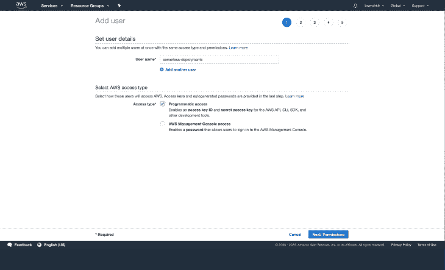

我们的新用户需要管理员权限，才能在从我们的无服务器应用程序部署或使用 CLI 时与 AWS 服务进行交互。

由于我们没有预先存在的组，我们将通过点击**创建组**来创建一个新组。在**过滤策略**部分输入“**管理员**”，选择**管理员访问**策略，然后为群组选择一个名称，最好是`admin-users`(或任何适合您的名称🙂).

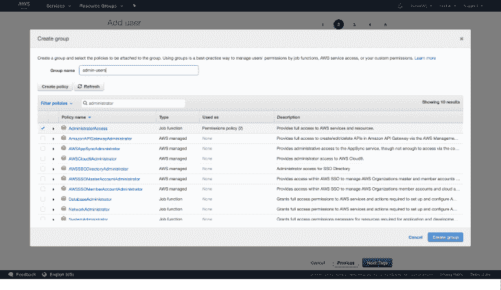

点击**创建组**，这将创建新组，并预先选择该组:

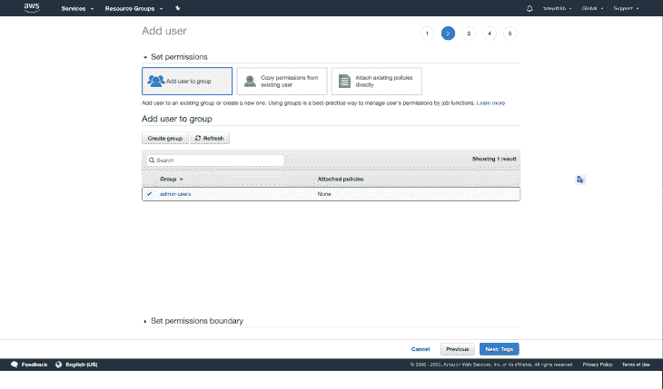

点击 ***下一步:标签*** ，这将带你到标签部分。标签是可选的，所以我将跳过这一部分。继续进入**审查**页面，该页面将概述您提供的详细信息:

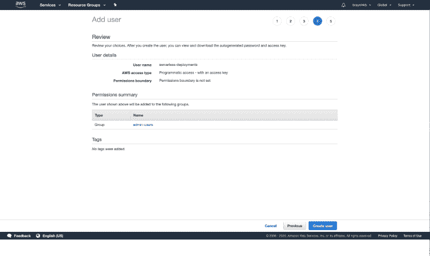

点击**创建用户**，这将创建一个新用户，并向您显示新创建的访问密钥。你应该特别注意不要丢失你的凭证，因为它们只对你有效一次，所以一定要下载 CSV 文件并保存在安全的地方。

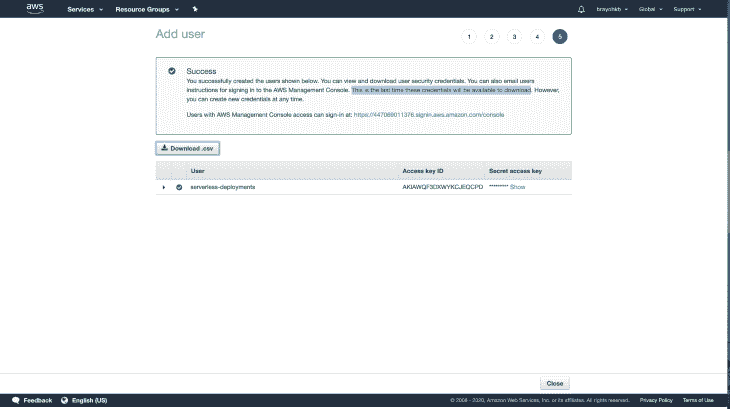

既然我们所有的访问密钥都已设置，我们就可以成功配置 CLI 了:

```
$ aws configure
AWS Access Key ID [None]: NEW_KEY_ID
AWS Secret Access Key [None]: SECRET_ACCESS_KEY
Default region name [None]: us-east-2 or preferred region
Default output format [None]: json

```

这些凭证保存在位于`~/.aws/credentials`的用户目录中的一个文件中。运行部署时，无服务器框架从该文件中选取默认配置文件。

该文件是可编辑的，并且您可以有多个配置文件，这允许您根据选定的配置文件执行部署，如下所示:

```
$ serverless deploy --aws-profile your_profile_name_here

```

## 创建新的无服务器项目

这是你们期待已久的部分！🙂


现在我们已经做好了一切准备，导航到您首选的工作区目录，运行以下命令，使用一个样例 Node.js 模板创建一个新的无服务器项目:

```
$ serverless

```

选择以下选项，以便更轻松地学习本教程:

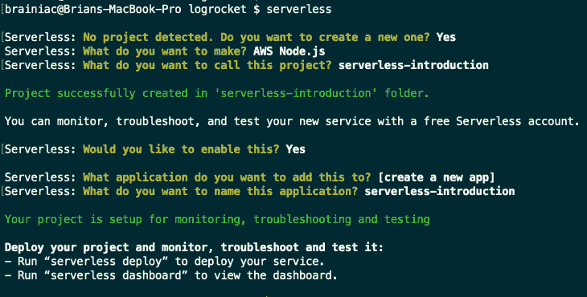

恭喜你。您刚刚创建了您的第一个无服务器项目！


您的目录结构应该如下所示(如果您没有安装 tree，运行`brew install tree`):

```
$ tree . -L 2 -a
.
├── .gitignore
├── .serverless
│   ├── cloudformation-template-create-stack.json
│   ├── cloudformation-template-update-stack.json
│   ├── serverless-introduction.zip
│   └── serverless-state.json
├── handler.js
└── serverless.yml

```

您将只使用`handler.js`和`serverless.yml`文件，除非需要创建新文件。这两个文件的用途将在本文的后面部分详细解释。

### 部署我们的项目

现在进入下一步，通过运行以下命令将您的新项目部署到云中:

```
$ serverless deploy

```

由于项目没有很多资源，这可能需要几分钟才能完成。部署完成后，您应该会看到类似如下的屏幕:

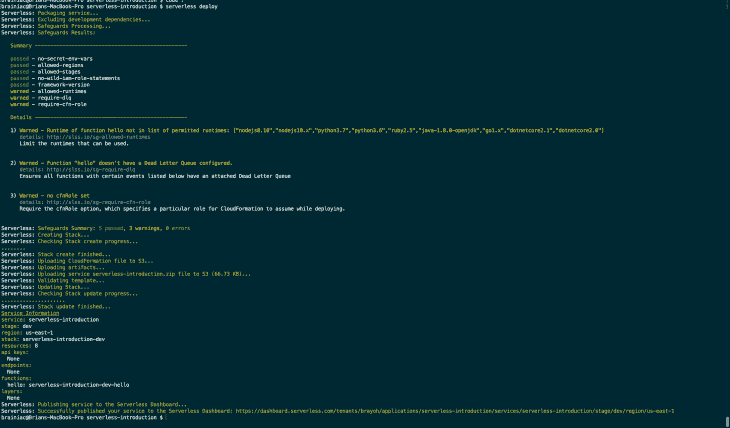

默认情况下，您的服务被部署到`us-east-1`区域。如果您导航到您的 [Lambda](https://console.aws.amazon.com/lambda/home?region=us-east-1#/functions) 仪表板，您将在`handler.js`中看到示例`hello`函数，它是列表的一部分，以项目名为前缀，以函数名为后缀:

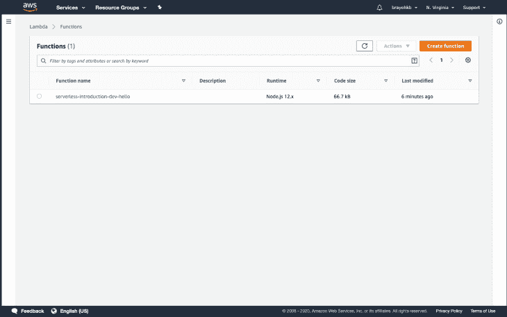

这确认了一切都已准备就绪，现在我们可以开始研究无服务器框架的各个组件了。

## 无服务器框架核心概念

该框架的主要概念是:

*   功能
*   事件
*   资源
*   服务
*   插件

### 功能

函数是执行特定任务的代码块。它可以返回值或过程。函数应该有一个单一的目的，以便遵循关注点的分离并实现更清晰的代码。您可以将函数用于以下作业:

*   发送电子邮件通知
*   将用户保存到数据库
*   与第三方 API 交互
*   更多

一个功能独立部署；你可以把它当成一个微服务。

### 事件

事件是触发 AWS Lambda 函数执行的任何事情。示例事件包括:

*   AWS S3 桶上传(例如，用于图像)
*   AWS DynamoDB 流(例如，保存到 DB 的新数据)
*   AWS API 网关 HTTP 端点请求(例如，对于 REST API)
*   还有更多…

对于 AWS Lambda 函数中定义的任何事件，将自动创建必要的基础设施(例如，API 网关端点),并将 AWS Lambda 函数配置为监听它。

### 资源

资源是您的功能使用的 AWS 基础结构组件，例如:

*   AWS DynamoDB 表
*   AWS S3 桶
*   任何可以在云形成中定义的东西

您的所有功能、事件和 AWS 基础设施组件都由无服务器框架自动部署。

### 服务

服务是一个组织单位。它就像一个项目文件，在其中定义函数、触发函数的事件以及函数需要的资源。这些都是在`serverless.yml`文件中定义的，看起来像这样:

```
# serverless.yml

service: todo

functions:
  todoCreate:
    events: # Events that trigger this function
      - http: post todo/create
  todoDelete:
    events:
      - http: delete todo/delete

resources: # Resources needed by your functions, Raw AWS CloudFormation goes in here.

```

### 插件

正如在大多数开发人员社区中一样，当您需要扩展或覆盖项目的功能时，库/插件总是很方便。`serverless.yml`文件支持一个`plugins:`属性，您可以在其中添加所有需要的插件。我们将在下一节使用 [AWS AppSync](https://aws.amazon.com/appsync/) 时解决这个问题。

## 在代码上

正如简介中提到的，为了让我们熟悉一下，我们将建立一个利用 AWS 基础设施组件的示例待办事项 API:

*   app sync–我们将设置一个 GraphQL 服务器，它将由我们的前端使用
*   dynamo db–保存来自传入请求的数据

### 创建新的 AppSync API

首先，您需要在根文件夹中创建一个`schema file`，在这里您将编写您的 GraphQL 模式:

```
$ touch schema.graphql

```

在编辑器中打开该文件，并添加以下模式:

```
type ToDo {
  createdAt: AWSDateTime
  id: ID
  updatedAt: AWSDateTime
  description: String!
  completed: Boolean
  dueDate: AWSDateTime!
}

input ToDoCreateInput {
  description: String!
  dueDate: AWSDateTime!
}

input ToDoUpdateInput {
  id: ID!
  description: String
  dueDate: AWSDateTime
  completed: Boolean
}

type Mutation {
  createTodo(input: ToDoCreateInput): ToDo
  updateTodo(input: ToDoUpdateInput): ToDo
  deleteTodo(id: ID!): ToDo
}

type Query {
  listToDos: [ToDo!]
  getToDo(id: ID): ToDo
}

schema {
  query: Query
  mutation: Mutation
}

```

为了创建新的 AppSync API，您需要安装`[serverless-appsync-plugin](https://github.com/sid88in/serverless-appsync-plugin)`，它有助于部署、更新和删除 app sync API:

```
$ yarn add serverless-appsync-plugin

```

然后将您的`serverless.yml`更新为以下内容:

```
service: serverless-introduction
app: serverless-introduction
org: brayoh
provider:
  name: aws
  runtime: nodejs12.x
  stage: ${opt:stage, env:stage, 'dev'}

plugins:
  - serverless-appsync-plugin
custom:
  appSync: # appsync plugin configuration
    name: ${self:service}-appsync-${self:provider.stage}
    authenticationType: API_KEY # since we dont have user login for now

functions:
  hello:
    handler: handler.hello

```

属性是我们在通过 Yarn 或 npm 安装插件后定义要使用的插件的地方。

`stage`属性由三个选项决定:

1.  `opt:stage`，这意味着在部署到我们的服务时可以传入`stage`标志
2.  `env:stage`，这意味着我们有一个名为`stage`的环境变量
3.  默认选项，以防前两个选项未设置

这使得部署到多个阶段变得容易，无论是开发、测试还是生产。您可以在[文档](https://serverless.com/framework/docs/providers/aws/guide/variables/)中了解更多关于如何传递环境变量的信息。

`appSync`属性是您为`serverless-appsync-plugin`定义自定义配置的地方。现在，我们只是添加了 API 名称，它带有我们的服务名称的前缀；AWS 组件，在本例中是 AppSync 以及当前阶段的后缀，例如`serverless-introduction-appsync-prod`。

属性是我们希望在 API 中使用的认证方法。我们现在将它设置为`API_KEY`,因为我们没有用户登录功能；否则，我们会将它设置为`AMAZON_COGNITO_USERPOOL`。部署完成后,`API key`在 AppSync API 仪表板中可用。

我们现在可以重新部署我们的应用程序，以便创建一个新的 AppSync API:

```
$ serverless deploy

```

部署需要几分钟时间。部署完成后，您可以导航到 AWS [AppSync 仪表板](https://console.aws.amazon.com/appsync/home?region=us-east-1#/apis)，您将看到刚刚部署的新 API:

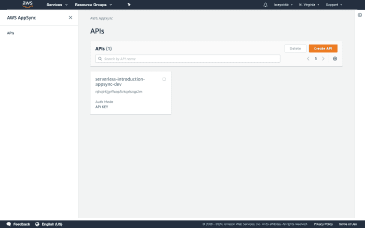

### 设置和创建新的 DynamoDB 数据库

厉害！现在我们的 API 已经部署好了，我们需要添加一个保存数据的数据源。如前所述，我们将在本教程中使用 DynamoDB。

在名为`resources`的文件夹中创建一个新的配置文件:

```
$ mkdir resources && touch resources/dynamo-table.yml

```

打开文件并添加以下 CloudFormation 模板，它定义了我们的 DynamoDB 配置:

```
Resources:
  PrimaryDynamoDBTable:
    Type: AWS::DynamoDB::Table
    Properties:
      AttributeDefinitions:
        - AttributeName: id
          AttributeType: S
      KeySchema: # primary composite key
        - AttributeName: id # partition key
          KeyType: HASH
      ProvisionedThroughput:
        ReadCapacityUnits: ${self:provider.tableThroughput}
        WriteCapacityUnits: ${self:provider.tableThroughput}
      BillingMode: PROVISIONED
      TableName: ${self:custom.resources.PRIMARY_TABLE}
      TimeToLiveSpecification:
        AttributeName: TimeToLive,
        Enabled: True
        Enabled: True

```

我们为数据库指定了[主键](https://www.dynamodbguide.com/key-concepts/#primary-key)，也就是`ID`键。我们还为`Read`和`Write` [容量单位](https://docs.aws.amazon.com/amazondynamodb/latest/developerguide/HowItWorks.ReadWriteCapacityMode.html)指定了我们需要的表名和[吞吐量](https://docs.aws.amazon.com/amazondynamodb/latest/developerguide/HowItWorks.ReadWriteCapacityMode.html)，您可以根据您的项目需求和预算进行选择。

接下来，我们需要更新我们的`serverless.yml`来包含上面的配置:

```
# previous config....
provider:
  name: aws
  runtime: nodejs12.x
  region: eu-west-1
  stage: ${opt:stage, env:stage, 'dev'}
  tableThroughputs:
    default: 5
    prod: 10

custom:
  resources:
    PRIMARY_TABLE: ${self:service}-dynamo-table-${self:provider.stage}

  appSync: # appsync plugin configuration
    name: ${self:service}-appsync-${self:provider.stage}
    authenticationType: API_KEY # since we don't have user login for now
    dataSources:
      - type: AMAZON_DYNAMODB
        name: PrimaryTable
        description: "Primary Table"
        config:
          tableName: ${self:custom.resources.PRIMARY_TABLE}
          serviceRoleArn: { Fn::GetAtt: [AppSyncDynamoDBServiceRole, Arn] }

```

下一个。我们需要添加一个新的`CFT`来提供一个新的 IAM 角色。这将用于从`AppSync`创建新的数据源，并授予执行所需操作所需的权限:

```
$ touch resources/appsync-dynamodb-role.yml

```

增加以下内容:

```
Resources:
  AppSyncDynamoDBServiceRole:
    Type: "AWS::IAM::Role"
    Properties:
      RoleName: ${self:service}-dynamo-role-${self:provider.stage}
      AssumeRolePolicyDocument:
        Version: "2012-10-17"
        Statement:
          - Effect: "Allow"
            Principal:
              Service:
                - "appsync.amazonaws.com"
                - "dynamodb.amazonaws.com"
            Action:
              - "sts:AssumeRole"
      Policies:
        - PolicyName: ${self:service}-dynamo-policy-${self:provider.stage}
          PolicyDocument:
            Version: "2012-10-17"
            Statement:
              - Effect: "Allow"
                Action:
                  - dynamodb:DescribeTable
                  - dynamodb:Query
                  - dynamodb:Scan
                  - dynamodb:GetItem
                  - dynamodb:PutItem
                  - dynamodb:UpdateItem
                  - dynamodb:DeleteItem
                Resource:
                  - "arn:aws:dynamodb:${self:provider.region}:*:*" # allow creation of tables in our current region

```

我们还需要指定 CloudFormation 角色可用的权限，该角色用于部署。为此，更新`tableThroughput`属性下的`serverless.yml`文件，使其包含以下权限:

```
tableThroughput: ${self:provider.tableThroughputs.${self:provider.stage}, self:provider.tableThroughputs.default}  
iamRoleStatements:
    - Effect: Allow
      Action:
        - dynamodb:DescribeTable
        - dynamodb:Query
        - dynamodb:Scan
        - dynamodb:GetItem
        - dynamodb:PutItem
        - dynamodb:UpdateItem
        - dynamodb:DeleteItem
      Resource:
        - "arn:aws:dynamodb:${self:provider.region}:*:*" 

```

最后一步是将两个模板都包含在我们的`serverless.yml`文件中，方法是将它们导入参考资料部分，这应该是文件的最后一部分:

```
resources:
  - ${file(./resources/appsync-dynamo-role.yml)}
  - ${file(./resources/dynamo-table.yml)}

```

既然我们都设置好了，现在我们可以部署我们的应用程序以使新的更改生效。一旦部署完成，登录到 [DynamoDB 控制台](https://eu-west-1.console.aws.amazon.com/dynamodb/home?region=eu-west-1#tables:)。您应该有一个新的表格显示:

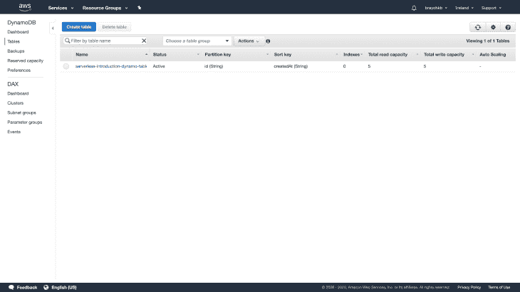

### 创建映射模板

现在我们已经设置好了`AppSync API`和`DynamoDB`表，我们继续为我们的查询和变异创建映射模板。

映射模板是用 [Velocity 模板语言(VTL)](http://velocity.apache.org/engine/devel/vtl-reference-guide.html) 编写的脚本，并使用 [JSONPath 表达式](http://goessner.net/articles/JsonPath/)应用于有效负载。我们使用映射模板将有效负载从方法请求映射到相应的集成请求，从集成响应映射到相应的方法响应。你可以在这里阅读更多关于 DynamoDB [的映射模板。](https://docs.aws.amazon.com/appsync/latest/devguide/resolver-mapping-template-reference-dynamodb.html)

要将映射模板添加到我们的项目中，我们首先创建一个文件夹:

```
$ mkdir mapping-templates

```

要向我们的无服务器文件添加新的映射模板，我们需要四个属性:

```
- dataSource: our_data_source_here
  type: Mutation or Query
  field: the graphql mutation or query name  
  request: path_to_request_mapping_template
  response: path_to_response_mapping_template

```

我们将从为`createToDo`突变创建一个请求映射模板开始:

```
$ mkdir mapping-templates/create_todo && touch mapping-templates/create_todo/request.vtl

```

添加以下代码:

```
$util.qr($ctx.args.input.put("createdAt", $util.time.nowISO8601()))
$util.qr($ctx.args.input.put("updatedAt", $util.time.nowISO8601()))
{
    "version" : "2017-02-28",
    "operation" : "PutItem",
    "key" : {
        "id": $util.dynamodb.toDynamoDBJson($util.autoId())
    },
    "attributeValues" : $util.dynamodb.toMapValuesJson($ctx.args.input)
}

```

我们在这里所做的是处理如何将来自 GraphQL 服务器的任何突变请求的数据保存到 DynamoDB。我们为待办事项自动生成`ID`，然后我们为有效负载添加两个时间戳:`createdAt`和`updatedAt`。其他属性值——即`description`和`dueDate`——被映射到它们对应的数据库行。

我们将创建两个文件在所有请求中重用，而不是为每个请求重复我们的响应映射模板。我们可以使用这个简洁的小技巧来做到这一点，它允许使用大括号中的逗号分隔列表创建多个具有相同扩展名的文件:

```
$ touch mapping-templates/{common-item-response,common-items-response}.vtl

```

#### `common-item-response.vtl`

这将是我们为任何返回单个项目的数据库操作返回的`JSON`响应

```
$util.toJson($ctx.result)

```

#### `common-items-response.vtl`

这将是我们为任何返回多项的数据库操作发回的 JSON 响应:

```
$util.toJson($ctx.result.items)

```

现在，我们可以用映射模板属性更新我们的无服务器文件，并添加上述文件来处理创建新待办事项的变化:

```
appSync: # appsync plugin configuration
  name: ${self:service}-appsync-${self:provider.stage}
  authenticationType: API_KEY # since we don't have user login for now
  dataSources:
    - type: AMAZON_DYNAMODB
      name: PrimaryTable
      description: "Primary Table"
      config:
        tableName: ${self:custom.resources.PRIMARY_TABLE}
        serviceRoleArn: { Fn::GetAtt: [AppSyncDynamoDBServiceRole, Arn] }
  mappingTemplates:
    - dataSource: PrimaryTable
      type: Mutation
      field: createTodo
      request: "create_todo/request.vtl"
      response: "common-item-response.vtl"

```

在此之后，我们现在可以部署我们的服务来创建一个新的解析器:

```
$ serverless deploy

```

部署完成后，我们可以通过旋转一个本地实例来测试我们的 API:

```
$ serverless graphql-playground

```

这将在`localhost:3000`建立一个新的操场:

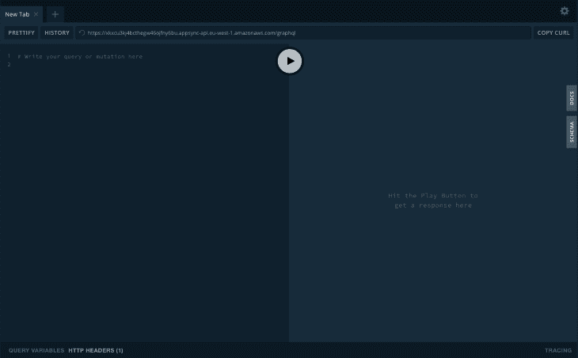

添加以下突变:

```
mutation createTodo($input: ToDoCreateInput!) {
  createTodo(input: $input) {
    id
    createdAt
    updatedAt
    completed
    description
    dueDate
  }
}

```

然后在查询变量部分下添加您的有效负载。对于`dueDate`，确保使用下面的日期格式`YYYY-MM-DDThh:mm:ss.sssZ`来匹配 DynamoDB 中的预期日期格式。

在成功执行变异之后，请前往 DynamoDB 控制台，打开您的表。您应该有一个项目显示:

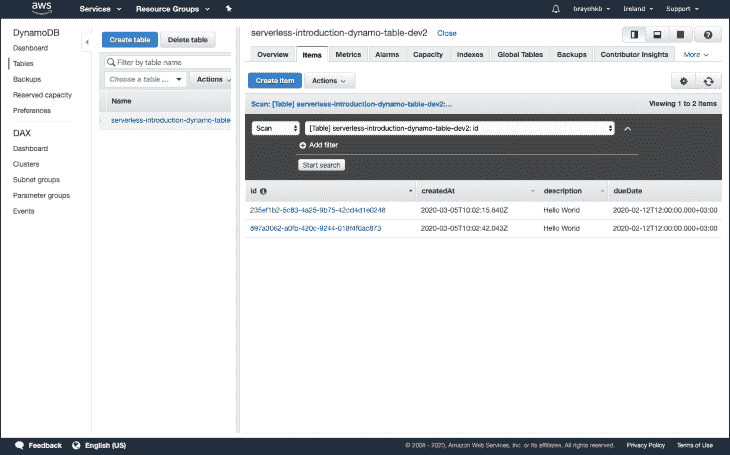

我们做到了！我们刚刚成功地将第一个项目保存到数据库中:


由于大多数模板与上面的相同，我们将一次性添加它们:

#### `get_todo/request.vtl`

为了获取一个待办事项，我们在查询有效负载中需要一个 ID，然后我们将它传递给 DynamoDB 解析器:

```
{
    "version": "2017-02-28",
    "operation": "GetItem",
    "key": {
        "id": $util.dynamodb.toDynamoDBJson($ctx.args.id),
    }
}

```

#### `update_todo/request.vtl`

更新一个条目有点复杂，但是我会尽可能简单地分解它。与获取项目一样，在更新时，我们要求 ID 字段是有效载荷的一部分。然后，我们动态生成更新表达式。如果任何值为空，我们忽略它。如果提供的任何值被忽略，我们也会删除它们。

最后，该操作有一个条件，它验证 DynamoDB 中的项目是否将`version`字段设置为`expectedVersion`:

```
$util.qr($ctx.args.input.put("updatedAt", $util.time.nowISO8601()))
{
    "version" : "2017-02-28",
    "operation" : "UpdateItem",
    "key" : {
        "id" : { "S" : "${context.arguments.input.id}" }
    },
    ## Set up some space to keep track of things we're updating **
    #set( $expNames  = {} )
    #set( $expValues = {} )
    #set( $expSet = {} )
    #set( $expRemove = [] )
    #set($ar=[])

    ## Iterate through each argument, skipping "id" and "expectedVersion" **
    #foreach( $entry in $context.arguments.input.entrySet() )
        #if( $entry.key != "id" )
            #if( (!$entry.value) && ("$!{entry.value}" == "") )
                ## If the argument is set to "null", then remove that attribute from the item in DynamoDB **
                #set( $discard = ${expRemove.add("#${entry.key}")} )
                $!{expNames.put("#${entry.key}", "$entry.key")}
            #else
                ##Otherwise set (or update) the attribute on the item in DynamoDB **
                $!{expSet.put("#${entry.key}", ":${entry.key}")}
                $!{expNames.put("#${entry.key}", "$entry.key")}
                $!{expValues.put(":${entry.key}", { "S" : "${entry.value}" })}
            #end
        #end
    #end
    ## Start building the update expression, starting with attributes we're going to SET **
    #set( $expression = "" )
    #if( !${expSet.isEmpty()} )
        #set( $expression = "SET" )
        #foreach( $entry in $expSet.entrySet() )
            #set( $expression = "${expression} ${entry.key} = ${entry.value}" )
            #if ( $foreach.hasNext )
                #set( $expression = "${expression}," )
            #end
        #end
    #end
    ## Continue building the update expression, adding attributes we're going to REMOVE **
    #if( !${expRemove.isEmpty()} )
        #set( $expression = "${expression} REMOVE" )
        #foreach( $entry in $expRemove )
            #set( $expression = "${expression} ${entry}" )
            #if ( $foreach.hasNext )
                #set( $expression = "${expression}," )
            #end
        #end
    #end
    ## Finally, write the update expression into the document, along with any expressionNames and expressionValues **
    "update" : {
        "expression" : "${expression}"
        #if( !${expNames.isEmpty()} )
            ,"expressionNames" : $utils.toJson($expNames)
        #end
        #if( !${expValues.isEmpty()} )
            ,"expressionValues" : $utils.toJson($expValues)
        #end
    }
}

```

#### `delete_todo/request.vtl`

与获取项目相同，在更新时，我们要求 ID 字段成为有效负载的一部分，然后我们将新的有效负载传递给 DynamoDB，以便从 DB 中硬删除项目:

```
{
    "version" : "2017-02-28",
    "operation" : "DeleteItem",
    "key" : {
        "id":  $util.dynamodb.toDynamoDBJson($ctx.args.id),
    }
}

```

现在我们已经有了所有的映射模板，我们可以将它们添加到无服务器文件中:

```
- dataSource: PrimaryTable
  type: Mutation
  field: updateTodo
  request: "update_todo/request.vtl"
  response: "common-item-response.vtl"
- dataSource: PrimaryTable
  type: Mutation
  field: deleteTodo
  request: "delete_todo/request.vtl"
  response: "common-item-response.vtl"
- dataSource: PrimaryTable
  type: Query
  field: getToDo
  request: "get_todo/request.vtl"
  response: "common-item-response.vtl"
- dataSource: PrimaryTable
  type: Query
  field: listToDos
  request: "list_todos/request.vtl"
  response: "common-items-response.vtl"

```

重新部署您的服务，现在您应该有一个完全正常工作的`API`和`CRUD`操作。

为了测试我们的 CRUD 操作，我们需要可以在我们的操场上测试的突变和查询。

## 查询和突变

### `updateToDo`

为了测试这种变异，您需要挑选一个现有商品的 ID，然后更新其中一个可更新的字段，它们是`description`、`dueDate`和`completed`。

```
mutation UpdateToDo($input: ToDoUpdateInput) {
  updateTodo(input: $input) {
    id
    createdAt
    description
    updatedAt
    dueDate
    completed
  }
}

```

然后传递想要更新的值并运行变异:

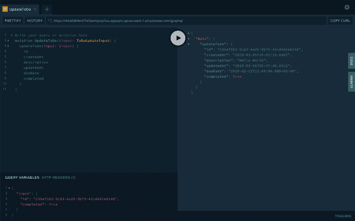

### `listToDos`

为了获取数据库中的所有待办事项，请运行以下查询:

```
query ListTodos {
  listToDos {
    id
    createdAt
    description
    updatedAt
    dueDate
    completed
  }
}

```

这将返回所有可用待办事项的数组:

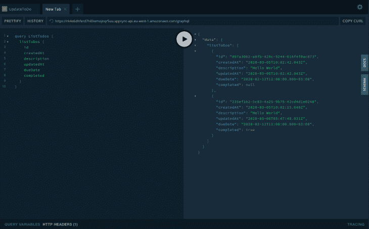

### `getToDo`

若要获取单个项目，请运行以下查询:

```
query GetToDo($id: ID) {
  getToDo(id: $id) {
    id
    createdAt
    description
    updatedAt
    dueDate
    completed
  }
}

```

它应该返回具有给定 ID 的项目:

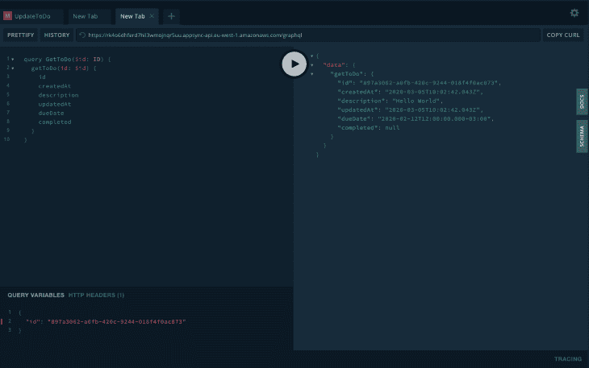

### `deleteToDo`

若要删除数据库中的项目，请运行以下查询:

```
mutation DeleteToDo($id: ID!) {
  deleteTodo(id: $id) {
    id
    createdAt
    description
    updatedAt
    dueDate
    completed
  }
}

```

它应该在成功执行时返回待办事项:

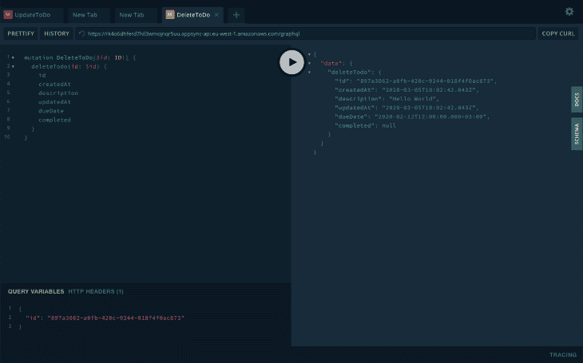

## 构建前端

在本文的最后一部分，我们将创建一个新的 React 应用程序，它将与我们的 CRUD 操作 API 进行交互。

由于这只是一个简单的演示，我们将使用 [create-react-app](https://github.com/facebook/create-react-app) 在我们的项目文件夹中启动一个新的 react 应用程序:

```
$ create-react-app client

```

之后，我们将安装所有必需的依赖项:

```
$ cd client && yarn add antd styled-components aws-appsync-subscription-link aws-appsync-auth-link @apollo/client graphql aws-appsync

```

打开`index.js`文件，添加我们的应用配置，如下所示:

```
import React from "react";
import ReactDOM from "react-dom";
import { createAuthLink } from "aws-appsync-auth-link";
import { createSubscriptionHandshakeLink } from "aws-appsync-subscription-link";
import { AUTH_TYPE } from "aws-appsync";
import {
  ApolloProvider,
  ApolloClient,
  ApolloLink,
  InMemoryCache,
} from "@apollo/client";

/** Ant design */
import "antd/dist/antd.css";

/** App entry */
import App from "./App";

/** AWS config */
import AppSyncConfig from "./aws-exports";

const config = {
  url: AppSyncConfig.GraphQlApiUrl,
  region: process.env.REACT_APP_REGION,
  auth: {
    type: AUTH_TYPE.API_KEY,
    apiKey: AppSyncConfig.GraphQlApiKeyDefault,
  },
};
const client = new ApolloClient({
  link: ApolloLink.from([
    createAuthLink(config),
    createSubscriptionHandshakeLink(config),
  ]),
  cache: new InMemoryCache(),
  defaultOptions: {
    watchQuery: {
      fetchPolicy: "cache-and-network",
    },
  },
});

ReactDOM.render(
  <ApolloProvider client={client}>
    <App />
  </ApolloProvider>,
  document.getElementById("root")
);

```

添加上述配置后，返回到应用程序 URL 并确认功能没有被破坏。

因为这篇文章是为了学习的目的，我们将保持设计尽可能的简单，我们将使用一个单独的组件来演示。我们应该总是尽可能简单地分解我们的组件。

由于我们将使用 [React Apollo](https://github.com/apollographql/react-apollo) 版本 3，我们将利用钩子特性，这使我们的实现非常干净。我们的组成如下:

```
import React from "react";
import styled from "styled-components";
import { List, Checkbox, Input, Button, Popconfirm, message } from "antd";
import { useMutation } from "@apollo/client";

/** App theme */
import Colors from "../../theme/colors";

/** GraphQL Queries */
import updateToDo from "../../graphql/mutations/updateToDo";
import createToDo from "../../graphql/mutations/createToDo";
import deleteToDo from "../../graphql/mutations/deleteToDo";
import listToDos from "../../graphql/queries/listToDos";

const DataList = (props) => {
  const [description, updateDescription] = React.useState("");
  const [updateToDoMutation] = useMutation(updateToDo);
  const [createToDoMutation] = useMutation(createToDo);
  const [deleteToDoMutation] = useMutation(deleteToDo);
  const { data } = props;

  function handleCheck(event, item) {
    event.preventDefault();
    const completed =
      typeof item.completed === "boolean" ? !item.completed : true; 

    updateToDoMutation({
      variables: { input: { completed, id: item.id } },
      refetchQueries: [
        {
          query: listToDos,
        },
      ],
    })
      .then((res) => message.success("Item updated successfully"))
      .catch((err) => {
        message.error("Error occurred while updating item");
        console.log(err);
      });
  }

  function handleSubmit(event, item) {
    event.preventDefault();
    createToDoMutation({
      variables: { input: { description } },
      refetchQueries: [
        {
          query: listToDos,
        },
      ],
    })
      .then((res) => message.success("Item created successfully"))
      .catch((err) => {
        message.error("Error occurred while creating item");
        console.log(err);
      });
  }

  function handleKeyPress(event) {
    if (event.keyCode === 13) {
      // user pressed enter
      createToDoMutation({
        variables: { input: { description } },
        refetchQueries: [
          {
            query: listToDos,
          },
        ],
      })
        .then((res) => {
          message.success("Item created successfully");
        })
        .catch((err) => {
          message.error("Error occurred while creating item");
          console.log(err);
        });
    }
  }

  function handleDelete(event, item) {
    deleteToDoMutation({
      variables: { id: item.id },
      refetchQueries: [
        {
          query: listToDos,
        },
      ],
    })
      .then((res) => {
        message.success("Deleted successfully");
      })
      .catch((err) => {
        message.error("Error occurred while deleting item");
        console.log(err);
      });
  }

  return (
    <ListContainer>
      <List
        header={
          <div style={{ display: "flex" }}>
            <Input
              placeholder="Enter todo name"
              value={description}
              onChange={(event) => updateDescription(event.target.value)}
              style={{ marginRight: "10px" }}
              onKeyDown={handleKeyPress}
            />
            <Button name="add" onClick={handleSubmit}>
              add
            </Button>
          </div>
        }
        bordered
        dataSource={data}
        renderItem={(item) => (
          <List.Item>
            <Checkbox
              checked={item.completed}
              onChange={(event) => handleCheck(event, item)}
            >
              {item.description}
            </Checkbox>
            <Popconfirm
              title="Are you sure to delete this item?"
              onConfirm={(event) => handleDelete(event, item)}
              okText="Yes"
              cancelText="No"
            >
              <DeleteAction>Delete</DeleteAction>
            </Popconfirm>
          </List.Item>
        )}
      />
    </ListContainer>
  );
};

export default DataList;

```

如前所述，我选择保持最小化设计，如下所示:

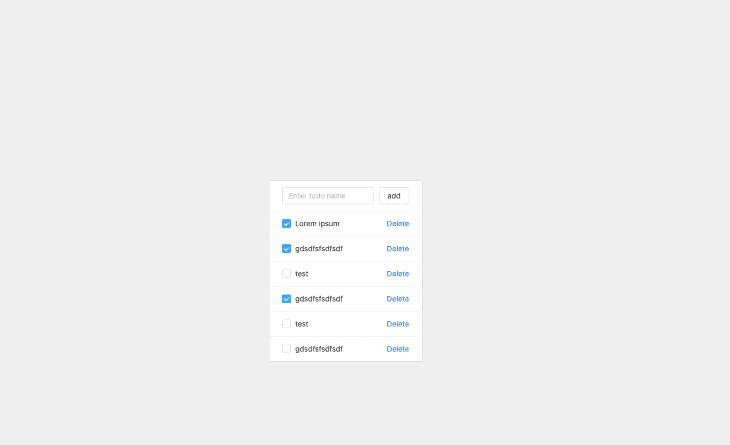

## 结论

希望你喜欢这个教程，你会发现它很有用，我记得为了把所有这些资源收集在一起，我做了很多工作，开始的时候总是很忙，所以我试图把所有的东西都汇编成一篇文章。你可以在这里找到整个项目的回购[。](https://github.com/brayoh/serverless-framework-react-introduction)

## [LogRocket](https://lp.logrocket.com/blg/react-signup-general) :全面了解您的生产 React 应用

调试 React 应用程序可能很困难，尤其是当用户遇到难以重现的问题时。如果您对监视和跟踪 Redux 状态、自动显示 JavaScript 错误以及跟踪缓慢的网络请求和组件加载时间感兴趣，

[try LogRocket](https://lp.logrocket.com/blg/react-signup-general)

.

[ ](https://lp.logrocket.com/blg/react-signup-general) [](https://lp.logrocket.com/blg/react-signup-general) 

LogRocket 结合了会话回放、产品分析和错误跟踪，使软件团队能够创建理想的 web 和移动产品体验。这对你来说意味着什么？

LogRocket 不是猜测错误发生的原因，也不是要求用户提供截图和日志转储，而是让您回放问题，就像它们发生在您自己的浏览器中一样，以快速了解哪里出错了。

不再有嘈杂的警报。智能错误跟踪允许您对问题进行分类，然后从中学习。获得有影响的用户问题的通知，而不是误报。警报越少，有用的信号越多。

LogRocket Redux 中间件包为您的用户会话增加了一层额外的可见性。LogRocket 记录 Redux 存储中的所有操作和状态。

现代化您调试 React 应用的方式— [开始免费监控](https://lp.logrocket.com/blg/react-signup-general)。