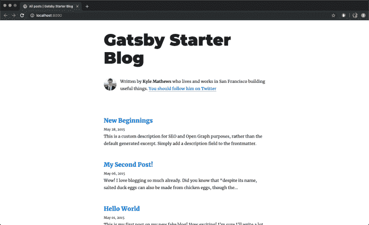

# 使用 GraphQL - LogRocket Blog 设置 TypeScript 和 Gatsby 项目

> 原文：<https://blog.logrocket.com/set-up-typescript-gatsby-project-graphql/>

***编者按**:本文最后更新于 2022 年 4 月 27 日，以反映《盖茨比》的最新更新。*

Gatsby 是一个基于 React 的免费开源框架，帮助开发人员使用现代 web 技术构建高速网站和应用程序。

Gatsby 附带了服务器端渲染等功能，提供了生成静态渐进式 web 应用程序(pwa)的能力。您还可以获得现成的代码和数据分割。Gatsby 只加载关键的 HTML、CSS、数据和 JavaScript，这样你的站点可以尽可能快地加载。

TypeScript 是 JavaScript 的超集，主要提供可选的静态类型、类和接口。使用 TypeScript，您可以及早发现错误，从而使您成为更高效的开发人员，同时利用现有的 JavaScript 社区。

在本文中，我们将从一个 Gatsby 项目开始，把它变成一个 TypeScript 应用程序。您可以跟随 Gatsby 应用程序的[库。我们开始吧！](https://github.com/AlexMercedCoder/gatsby-typescript-blog-tutorial)

## 目录

## 如何设置盖茨比应用程序

要设置 Gatsby 应用程序，您首先需要安装 Gatsby CLI T1，它可以让您快速创建新的 Gatsby 支持的站点，并运行开发 Gatsby 站点的命令。通过运行下面的命令，您可以用 Yarn 全局安装 Gatsby:

```
yarn global add gatsby-cli

```

或者，您可以使用 npm:

```
npm install -g gatsby-cli

```

接下来，我们将使用 Gatsby CLI 工具创建一个 Gatsby 站点。首先，我们将获取一个启动项目，Gatsby blog starter。starter 附带了启动和运行所需的主要 Gatsby 配置文件。它还使用 GraphQL 为博客获取数据:

```
gatsby new my-blog-starter https://github.com/gatsbyjs/gatsby-starter-blog

```

上面的命令将博客的所有文件放到一个文件夹中，然后安装应用程序运行所需的所有必需的依赖项。您可以导航到新站点的目录并启动它，看看是否一切都按预期运行。在终端中运行以下命令:

```
cd my-blog-starter
yarn develop

```

如果不使用纱线，则`npm run develop`或`gatsby develop`也可以。

一旦完成了`yarn develop`命令，您就可以在浏览器中打开一个新的标签，并导航到`[http://localhost:8000](http://localhost:8000)`来查看 Gatsby 应用程序的运行情况:



## 使用 Gatsby 和 GraphQL

GraphQL 是一种查询语言，允许你将数据放入你的网站。Gatsby 使用 GraphQL 作为其管理站点数据的接口。在我们看到 Gatsby 如何轻松地集成 GraphQL 之前，让我们先看看 Gatsby 附带的一些文件和文件夹，以及它们的作用。

目录包含了所有与你的站点前端显示相关的代码，比如你的站点标题或者页面模板。`prettierrc`是[“漂亮”的配置文件，这是一个帮助你保持代码格式](https://blog.logrocket.com/using-prettier-eslint-automate-formatting-fixing-javascript/)一致的工具。

在`gatsby-browser.js`文件中，Gatsby 期望找到 [Gatsby 浏览器 API](https://www.gatsbyjs.org/docs/browser-apis/)的任何用法，这些 API 允许定制和扩展影响浏览器的默认 Gatsby 设置。

`gatsby-config.js`是 Gatsby 站点的主要配置文件。在这里，您可以指定关于您的站点的信息，或者元数据，比如站点标题、描述、您想要包含的 Gatsby 插件等等。

在`gatsby-node.js`文件中，盖茨比希望找到[盖茨比节点 API](https://www.gatsbyjs.org/docs/node-apis/)的任何用法。这些允许定制和扩展影响站点构建过程的默认 Gatsby 设置。

最后，`gatsby-ssr.js`文件是 Gatsby 期望找到 [Gatsby 服务器端呈现 API](https://www.gatsbyjs.org/docs/ssr-apis/)用法的地方，如果有的话。这些允许影响服务器端呈现的缺省 Gatsby 设置的定制。

Gatsby 还支持其他获取数据的方法，所以不必使用 GraphQL。您可以使用`createPages` API 将非结构化数据直接拉入 Gatsby 页面，而不是通过 GraphQL 数据层。Gatsby 可以通过两种方式从 GraphQL 获取数据，即页面查询和 StaticQuery。

### 页面查询

我们可以使用 Gatsby 的标签在 GraphQL 页面中查询数据。在`gatsby-config`文件中，在文件顶部的第二行到第十行，声明了关于站点的信息，特别是`siteMetadata`对象:

```
siteMetadata: {
  title: `Gatsby Starter Blog`,
  author: `Kyle Mathews`,
  description: `A starter blog demonstrating what Gatsby can do.`,
  siteUrl: `https://gatsby-starter-blog-demo.netlify.com/`,
  social: {
    twitter: `kylemathews`,
  },
},

```

让我们看看如何使用 GraphQL 在组件中获取上述数据。`src/pages`文件夹中的`404.js`文件是一个使用 GraphQL 通过页面查询获取数据的例子。如果您向下滚动到文件底部的第 24 行到第 32 行，您应该会看到类似下面的代码片段:

```
export const pageQuery = graphql`
  query {
    site {
      siteMetadata {
        title
      }
    }
  }
`

```

上面的代码片段是一个 GraphQL 查询，我们获取站点的`siteMetadata`信息，特别是文件的标题。从上面的查询中检索到的数据可以在组件的呈现函数中使用，如下面同一个文件所示:

```
const { data } = this.props
const siteTitle = data.site.siteMetadata.title

```

### 静态查询

您可以使用 [StaticQuery](https://www.gatsbyjs.org/docs/static-query/) 在 Gatsby 中查询数据，这是一个编写时更新的 API，允许组件通过 GraphQL 查询检索数据。除了使用 StaticQuery，我们还将使用名为 [`useStaticQuery`](https://www.gatsbyjs.org/docs/use-static-query/) 的钩子版本的 StaticQuery。

位于`src/components`文件夹中的`seo.js`文件是一个使用 StaticQuery 的组件示例:

```
import { useStaticQuery, graphql } from "gatsby"

// ...

function SEO({ description, lang, meta, title }) {
  const { site } = useStaticQuery(
    graphql`
      query {
        site {
          siteMetadata {
            title
            description
            author
          }
        }
      }
    `
  )

  // ...
}

```

正如你在上面的代码块中看到的，我们首先从 Gatsby 导入了`useStaticQuery`方法。`useStaticQuery`方法允许 React 组件通过 GraphQL 查询检索数据，该查询将被解析、评估并注入到组件中。

上面的 GraphQL 查询从`gatsby-config.js`文件中查询站点标题、描述和作者。

## 如何将 TypeScript 集成到 Gatsby 应用程序中

为了将 TypeScript 集成到 Gatsby 应用程序中，我们需要安装一些依赖项:

```
yarn add gatsby-plugin-typescript
yarn add typescript --dev

```

或者

```
npm install gatsby-plugin-typescript
npm install --save-dev typescript 

```

[`gatsby-plugin-typescript`](https://www.gatsbyjs.org/packages/gatsby-plugin-typescript/) 是将所有`.js`文件改为`.tsx`文件所需的盖茨比插件。它负责类型检查和传输类型脚本代码。

一旦安装了依赖项，我们可以将`gatsby-plugin-typescript`添加到`gatsby-config.js`文件中 gatsby-plugin-react-helmet 之后:

```
`gatsby-plugin-react-helmet`,
    `gatsby-plugin-typescript`,

```

接下来，将`eslintrc.js`和`tsconfig.json`添加到代码库的根目录中。`eslintrc.js`包含有助于林挺打字稿文件的规则集，而`tsconfig.json`包含有助于确定项目中打字稿行为的规则集。下面的代码输入`eslintrc.js`:

```
module.exports = {
  parser: '@typescript-eslint/parser', // Specifies the ESLint parser
  extends: [
    'eslint:recommended',
    'plugin:react/recommended',
    'plugin:@typescript-eslint/recommended',
    'prettier/@typescript-eslint',
    'plugin:prettier/recommended'
  ],
  settings: {
    react: {
      version: 'detect'
    }
  },
  env: {
    browser: true,
    node: true,
    es6: true
  },
  plugins: ['@typescript-eslint', 'react'],
  parserOptions: {
    ecmaFeatures: {
      jsx: true
    },
    ecmaVersion: 2018, // Allows for the parsing of modern ECMAScript features
    sourceType: 'module' // Allows for the use of imports
  },
  rules: {
    'react/prop-types': 'off', // Disable prop-types as we use TypeScript for type checking
    '@typescript-eslint/explicit-function-return-type': 'off'
  },
  overrides: [
    // Override some TypeScript rules just for .js files
    {
      files: ['*.js'],
      rules: {
        '@typescript-eslint/no-var-requires': 'off' //
      }
    }
  ]
};

```

下面的代码放在`tsconfig.json`中:

```
// tsconfig.json
{
  "compilerOptions": {
    "module": "commonjs",
    "target": "esnext",
    "jsx": "preserve",
    "lib": ["dom", "esnext"],
    "strict": true,
    "noEmit": true,
    "isolatedModules": true,
    "esModuleInterop": true,
    "noUnusedLocals": false,
    "allowJs": true
  },
  "exclude": ["node_modules", "public", ".cache"]
}

```

这个`.eslintrc.js`文件使用了一些我们需要用来帮助林挺我们的 TypeScript 项目的包。您可以使用下面的命令安装它们:

```
yarn add -D @typescript-eslint/eslint-plugin @typescript-eslint/parser @types/react-helmet eslint

```

或者

```
npm install --save-dev @typescript-eslint/eslint-plugin @typescript-eslint/parser eslint @types/react-helmet --force

```

此外，我们需要向`package.json`文件添加一个脚本，我们可以用它来对整个代码库进行类型检查:

```
"scripts": {
    // ...
    "type-check": "tsc --noEmit"
  }

```

现在，我们可以将必要的`.js`文件重命名为`.tsx`文件。除了重命名文件，我们还为任何属性定义了 TypeScript 接口。

### `bio.js`

让我们从`bio.js`文件开始。重命名文件或简单地更改扩展名，使它现在是`src/components/bio.tsx`。

### `layout.js`

接下来，我们将`layout.js`文件的扩展名改为`.tsx`。打开文件，用下面的代码片段编辑它:

```
import * as React from "react"
import { Link } from "gatsby"

interface Props {
  location: Location
  title: string
  children?: any
}
const Layout = ({ location, title, children }: Props) => {
  const rootPath = `${__PATH_PREFIX__}/`
  const isRootPath = location.pathname === rootPath
  let header
  if (isRootPath) {
    header = (
      <h1 className="main-heading">
        <Link to="/">{title}</Link>
      </h1>
    )
  } else {
    header = (
      <Link className="header-link-home" to="/">
        {title}
      </Link>
    )
  }
  return (
    <div className="global-wrapper" data-is-root-path={isRootPath}>
      <header className="global-header">{header}</header>
      <main>{children}</main>
      <footer>
        © {new Date().getFullYear()}, Built with
        {` `}
        <a href="https://www.gatsbyjs.com">Gatsby</a>
      </footer>
    </div>
  )
}
export default Layout

```

在上面的代码块中，我们为组件的道具创建了一个接口。在 TypeScript 中，[接口](https://www.typescriptlang.org/docs/handbook/interfaces.html)有助于形成实体的规范。一个接口通常包含所有属性的名称以及它们的类型。

### `seo.js`

将`seo.js`文件的扩展名改为`.tsx`，然后打开该文件，用下面的代码片段编辑它:

```
/**
 * SEO component that queries for data with
 *  Gatsby's useStaticQuery React hook
 *
 * See: https://www.gatsbyjs.com/docs/use-static-query/
 */
import * as React from "react"
import PropTypes from "prop-types"
import { Helmet } from "react-helmet"
import { useStaticQuery, graphql } from "gatsby"

interface Props {
  description?: string
  lang?: string
  meta?: []
  title: string
}
interface Meta {
  property?: string,
  name?: string,
  content: string
}
const Seo = ({ description, lang, meta, title }:Props) => {
  const { site } = useStaticQuery(
    graphql`
      query {
        site {
          siteMetadata {
            title
            description
            social {
              twitter
            }
          }
        }
      }
    `
  )
  const metaDescription = description || site.siteMetadata.description
  const defaultTitle = site.siteMetadata?.title
  let typeSafeMeta: Array<Meta>
  if (meta instanceof Array){
    typeSafeMeta = meta
  } else {
    typeSafeMeta = []
  }
  return (
    <Helmet
      htmlAttributes={{
        lang,
      }}
      title={title}
      titleTemplate={defaultTitle ? `%s | ${defaultTitle}` : ''}
      meta={[
        {
          name: `description`,
          content: metaDescription,
        },
        {
          property: `og:title`,
          content: title,
        },
        {
          property: `og:description`,
          content: metaDescription,
        },
        {
          property: `og:type`,
          content: `website`,
        },
        {
          name: `twitter:card`,
          content: `summary`,
        },
        {
          name: `twitter:creator`,
          content: site.siteMetadata?.social?.twitter || ``,
        },
        {
          name: `twitter:title`,
          content: title,
        },
        {
          name: `twitter:description`,
          content: metaDescription,
        },
        ...typeSafeMeta
      ]}
    />
  )
}
Seo.defaultProps = {
  lang: `en`,
  meta: [],
  description: ``,
}
Seo.propTypes = {
  description: PropTypes.string,
  lang: PropTypes.string,
  meta: PropTypes.arrayOf(PropTypes.object),
  title: PropTypes.string.isRequired,
}
export default Seo

```

像在`layout.tsx`文件中一样，我们也为组件的道具和元标签数组定义了一个接口，并做了一些小的调整，以确保我们符合头盔道具的类型。

### `404.js`

接下来，我们导航到`404.js`文件。导航到`src/pages`文件夹，将扩展名改为`.tsx`，然后打开文件，用下面的代码片段编辑它:

```
import * as React from "react"
import { graphql } from "gatsby"
import Layout from "../components/layout"
import Seo from "../components/seo"

interface Props {
  data: {
    site: {
      siteMetadata: {
        title: string
      }
    }
  }
  location?: any
}
const NotFoundPage = ({ data, location }: Props) => {
  const siteTitle = data.site.siteMetadata.title
  return (
    <Layout location={location} title={siteTitle}>
      <Seo title="404: Not Found" />
      <h1>404: Not Found</h1>
      <p>You just hit a route that doesn&#39;t exist... the sadness.</p>
    </Layout>
  )
}
export default NotFoundPage
export const pageQuery = graphql`
  query {
    site {
      siteMetadata {
        title
      }
    }
  }
`

```

在上面的代码块中，我们为组件的 props 定义了一个接口。

### `index.js`

接下来，我们将`index.js`文件中的扩展名改为`.tsx`，然后打开该文件，用下面的代码片段编辑它:

```
import * as React from "react"
import { Link, graphql } from "gatsby"
import Bio from "../components/bio"
import Layout from "../components/layout"
import Seo from "../components/seo"

interface Props {
  data: {
    allMarkdownRemark: any
    site: {
      siteMetadata: {
        title: string
      }
    }
  },
  location?: any
}
const BlogIndex = ({ data, location }:Props) => {
  const siteTitle = data.site.siteMetadata?.title || `Title`
  const posts = data.allMarkdownRemark.nodes
  if (posts.length === 0) {
    return (
      <Layout location={location} title={siteTitle}>
        <Seo title="All posts" />
        <Bio />
        <p>
          No blog posts found. Add markdown posts to "content/blog" (or the
          directory you specified for the "gatsby-source-filesystem" plugin in
          gatsby-config.js).
        </p>
      </Layout>
    )
  }
  return (
    <Layout location={location} title={siteTitle}>
      <Seo title="All posts" />
      <Bio />
      <ol style={{ listStyle: `none` }}>
        {posts.map((post:any) => {
          const title = post.frontmatter.title || post.fields.slug
          return (
            <li key={post.fields.slug}>
              <article
                className="post-list-item"
                itemScope
                itemType="http://schema.org/Article"
              >
                <header>
                  <h2>
                    <Link to={post.fields.slug} itemProp="url">
                      <span itemProp="headline">{title}</span>
                    </Link>
                  </h2>
                  <small>{post.frontmatter.date}</small>
                </header>
                <section>
                  <p
                    dangerouslySetInnerHTML={{
                      __html: post.frontmatter.description || post.excerpt,
                    }}
                    itemProp="description"
                  />
                </section>
              </article>
            </li>
          )
        })}
      </ol>
    </Layout>
  )
}
export default BlogIndex
export const pageQuery = graphql`
  query {
    site {
      siteMetadata {
        title
      }
    }
    allMarkdownRemark(sort: { fields: [frontmatter___date], order: DESC }) {
      nodes {
        excerpt
        fields {
          slug
        }
        frontmatter {
          date(formatString: "MMMM DD, YYYY")
          title
          description
        }
      }
    }
  }
`

```

正如在前面的代码块中看到的，我们为组件的 prop 定义了一个接口，并在我们的 posts 映射中添加了一个`any`类型以避免错误。

### `blog-post.js`

对于`src/components`文件夹中的`blog-post.js`文件，我们必须为道具定义一个接口。将扩展名改为`.tsx`，然后打开文件，用下面的代码片段编辑它:

```
import * as React from "react"
import { Link, graphql } from "gatsby"
import Bio from "../components/bio"
import Layout from "../components/layout"
import Seo from "../components/seo"

interface Props {
  data: {
    markdownRemark: any
    site: {
      siteMetadata: {
        title: string
      }
    }
  }
  pageContext?: any,
  location?: any
}
const BlogPostTemplate = ({ data, location }) => {
  const post = data.markdownRemark
  const siteTitle = data.site.siteMetadata?.title || `Title`
  const { previous, next } = data
  return (
    <Layout location={location} title={siteTitle}>
      <Seo
        title={post.frontmatter.title}
        description={post.frontmatter.description || post.excerpt}
      />
      <article
        className="blog-post"
        itemScope
        itemType="http://schema.org/Article"
      >
        <header>
          <h1 itemProp="headline">{post.frontmatter.title}</h1>
          <p>{post.frontmatter.date}</p>
        </header>
        <section
          dangerouslySetInnerHTML={{ __html: post.html }}
          itemProp="articleBody"
        />
        <hr />
        <footer>
          <Bio />
        </footer>
      </article>
      <nav className="blog-post-nav">
        <ul
          style={{
            display: `flex`,
            flexWrap: `wrap`,
            justifyContent: `space-between`,
            listStyle: `none`,
            padding: 0,
          }}
        >
          <li>
            {previous && (
              <Link to={previous.fields.slug} rel="prev">
                ← {previous.frontmatter.title}
              </Link>
            )}
          </li>
          <li>
            {next && (
              <Link to={next.fields.slug} rel="next">
                {next.frontmatter.title} →
              </Link>
            )}
          </li>
        </ul>
      </nav>
    </Layout>
  )
}
export default BlogPostTemplate
export const pageQuery = graphql`
  query BlogPostBySlug(
    $id: String!
    $previousPostId: String
    $nextPostId: String
  ) {
    site {
      siteMetadata {
        title
      }
    }
    markdownRemark(id: { eq: $id }) {
      id
      excerpt(pruneLength: 160)
      html
      frontmatter {
        title
        date(formatString: "MMMM DD, YYYY")
        description
      }
    }
    previous: markdownRemark(id: { eq: $previousPostId }) {
      fields {
        slug
      }
      frontmatter {
        title
      }
    }
    next: markdownRemark(id: { eq: $nextPostId }) {
      fields {
        slug
      }
      frontmatter {
        title
      }
    }
  }
`

```

在再次运行应用程序之前，我们需要编辑`gatsby-node.js`文件。在该文件中，我们声明了用于呈现博客文章页面的组件的路径。我们需要将该文件的扩展名从`.js`改为`.tsx`。打开第七行的`gatsby-node.js`文件，用下面的代码编辑它:

```
const blogPost = path.resolve(`./src/templates/blog-post.tsx`)

```

完成后，重启 Gatsby 应用程序，尝试查看位于`localhost:8000`的博客。现在应该可以正常工作了！

## 结论

在本文中，我们研究了 Gatsby 及其在 GraphQL 和 TypeScript 中的用法。我们看到了如何使用接口为组件构造数据或道具。我们还学习了如何使用 GraphQL 通过页面查询或 StaticQuery 在 Gatsby 应用程序中获取数据。我希望你喜欢这篇文章，并快乐编码！

## [LogRocket](https://lp.logrocket.com/blg/typescript-signup) :全面了解您的网络和移动应用

[](https://lp.logrocket.com/blg/typescript-signup)

LogRocket 是一个前端应用程序监控解决方案，可以让您回放问题，就像问题发生在您自己的浏览器中一样。LogRocket 不需要猜测错误发生的原因，也不需要向用户询问截图和日志转储，而是让您重放会话以快速了解哪里出错了。它可以与任何应用程序完美配合，不管是什么框架，并且有插件可以记录来自 Redux、Vuex 和@ngrx/store 的额外上下文。

除了记录 Redux 操作和状态，LogRocket 还记录控制台日志、JavaScript 错误、堆栈跟踪、带有头+正文的网络请求/响应、浏览器元数据和自定义日志。它还使用 DOM 来记录页面上的 HTML 和 CSS，甚至为最复杂的单页面和移动应用程序重新创建像素级完美视频。

## 监控生产中失败和缓慢的 GraphQL 请求

虽然 GraphQL 有一些调试请求和响应的特性，但确保 GraphQL 可靠地为您的生产应用程序提供资源是一件比较困难的事情。如果您对确保对后端或第三方服务的网络请求成功感兴趣，

[try LogRocket](https://lp.logrocket.com/blg/graphql-signup)

.

[](https://lp.logrocket.com/blg/graphql-signup)[https://logrocket.com/signup/](https://lp.logrocket.com/blg/graphql-signup)

LogRocket 就像是网络和移动应用的 DVR，记录下你网站上发生的每一件事。您可以汇总并报告有问题的 GraphQL 请求，以快速了解根本原因，而不是猜测问题发生的原因。此外，您可以跟踪 Apollo 客户机状态并检查 GraphQL 查询的键值对。

LogRocket 检测您的应用程序以记录基线性能计时，如页面加载时间、到达第一个字节的时间、慢速网络请求，还记录 Redux、NgRx 和 Vuex 操作/状态。

[Start monitoring for free](https://lp.logrocket.com/blg/graphql-signup)

.

[Try it for free](https://lp.logrocket.com/blg/typescript-signup)

.