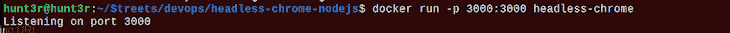
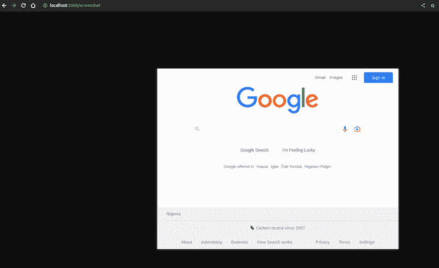
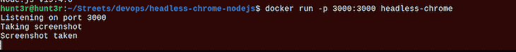

# 在 Docker - LogRocket 博客中设置一个无头 Chrome Node.js 服务器

> 原文：<https://blog.logrocket.com/setting-headless-chrome-node-js-server-docker/>

***编者按:*** *这篇关于在 Docker 中设置无头 Chrome Node.js 服务器的指南最后一次更新是在 2023 年 1 月 9 日更新任何过时的代码，进一步解释了 Dockerfile 步骤的分解，并包括了更多交互式代码示例。要了解更多关于 Docker 的信息，请访问我们的档案[这里](https://blog.logrocket.com/tag/docker/)。*

随着应用程序开发过程中自动化 UI 测试的兴起，无头浏览器变得非常流行。网站爬虫和基于 HTML 的内容分析也有无数的用例。

在 99%的情况下，你不需要浏览器 GUI，因为它是完全自动化的。运行一个 GUI 比运行一个基于 Linux 的服务器或者在一个微服务集群上扩展一个简单的 Docker 容器更昂贵，比如 T2 的 Kubernetes T3。

但是我跑题了。拥有一个基于 Docker 容器的无头浏览器来最大化灵活性和可伸缩性变得越来越重要。在本教程中，我们将演示如何创建一个 [Dockerfile](https://blog.logrocket.com/node-js-docker-improve-dx-docker-compose/) 来在 [Node.js](https://blog.logrocket.com/tag/node/) 中设置一个无头 Chrome 浏览器。

*向前跳转:*

## 带有 Node.js 的无头浏览器

Node.js 是谷歌 Chrome 开发团队使用的主要语言接口，它有一个几乎是原生的集成库，用于与 Chrome 进行通信，名为[puppeter](https://blog.logrocket.com/creating-puppeteer-microservice-deploy-google-cloud-functions/)。这个库通过一个 [Chrome DevTools](https://blog.logrocket.com/debugging-node-js-chrome-devtools/) 接口使用 [WebSocket](https://blog.logrocket.com/websocket-tutorial-real-time-node-react/) 或一个基于系统管道的协议，它可以截图，并测量页面负载指标、连接速度、下载内容大小等等。

您可以使用 Puppeteer 库将 Headless Chrome 与 Node.js 一起使用。Puppeteer 是一个 Node.js 库，它提供了一个[高级 API](https://blog.logrocket.com/understanding-api-key-authentication-node-js/) 来控制 Chrome 或通过 Chrome DevTools 协议控制[Chrome](https://blog.logrocket.com/what-chromiums-browser-compatibility-means-for-scrolling/)。

你可以在不同的设备模拟上测试你的 UI，并截图。最重要的是，木偶师不需要运行 GUI。事实上，这一切都可以在无头模式下完成。

下面是一个使用 Puppeteer 控制 Headless Chrome 并导航到网站的实现:

```
// Filename: server.js

const express = require('express');
const puppeteer = require('puppeteer');

const app = express();

app.get('/screenshot', async (req, res) => {
    console.log('Taking screenshot');
    const browser = await puppeteer.launch({
        headless: true,
        executablePath: '/usr/bin/google-chrome',
        args: [
            "--no-sandbox",
            "--disable-gpu",
        ]
    });
    const page = await browser.newPage();
    await page.goto('https://www.google.com');
    const imageBuffer = await page.screenshot();
    await browser.close();

    res.set('Content-Type', 'image/png');
    res.send(imageBuffer);
    console.log('Screenshot taken');
});

app.listen(3000, () => {
    console.log('Listening on port 3000');
});

```

上面显示了在 Headless Chrome 上截屏的简单代码。这个脚本将启动一个 Headless Chrome 实例，导航到 [Google](https://www.google.com/) ，并对页面进行截图。截图会保存到当前目录。

代码还创建了一个 [Express.js](https://blog.logrocket.com/organizing-express-js-project-structure-better-productivity/) app，它只有一个路由`/screenshot`，使用 Headless Chrome 对[这个](https://www.google.comand/)进行截图，然后在 HTTP 响应中将图像数据发送回客户端。

要使用这个路由，您可以发出一个 [HTTP 请求](https://blog.logrocket.com/axios-vs-fetch-best-http-requests/)到`[http://localhost:3000/screenshot](http://localhost:3000/screenshot)`，服务器将用一个图像来响应。您还可以自定义路由以接受查询参数，或者使用其他 HTTP 方法来控制屏幕截图的行为。

## Docker 容器中的无头 Chrome

基于上面的代码，在容器中运行浏览器看起来很简单，但是重要的是不要忽视[安全性](https://blog.logrocket.com/secure-open-source-node-js-dependencies/)。默认情况下，容器中的所有东西都在 root 用户下运行，浏览器在本地执行 JavaScript 文件。

### Google Chrome 设置的 docker 文件

要继续学习本教程，请确保您已经安装了 Docker v17.03 或更高版本的浏览器(最好是谷歌浏览器)。

当然，谷歌 Chrome 是安全的，不允许用户从基于浏览器的脚本访问本地文件，但仍然存在潜在的安全风险。您可以通过创建一个新用户来执行浏览器本身来最小化这些风险。Google 还默认启用沙盒模式，限制外部脚本访问本地环境。

下面是负责 Google Chrome 设置的 Dockerfile 示例:

```
# Filename: Dockerfile

FROM node:slim

# We don't need the standalone Chromium
ENV PUPPETEER_SKIP_CHROMIUM_DOWNLOAD true

# Install Google Chrome Stable and fonts
# Note: this installs the necessary libs to make the browser work with Puppeteer.
RUN apt-get update && apt-get install gnupg wget -y && \
    wget --quiet --output-document=- https://dl-ssl.google.com/linux/linux_signing_key.pub | gpg --dearmor > /etc/apt/trusted.gpg.d/google-archive.gpg && \
    sh -c 'echo "deb [arch=amd64] http://dl.google.com/linux/chrome/deb/ stable main" >> /etc/apt/sources.list.d/google.list' && \
    apt-get update && \
    apt-get install google-chrome-stable -y --no-install-recommends && \
    rm -rf /var/lib/apt/lists/*

# FROM public.ecr.aws/lambda/nodejs:14.2022.09.09.11
# Create working directory
WORKDIR /usr/src/app

# Copy package.json
COPY package.json ./

# Install NPM dependencies for function
RUN npm install

# Copy handler function and tsconfig
COPY server.js ./

# Expose app
EXPOSE 3000

# Run app
CMD ["node", "server.js"]

```

### Dockerfile 文件步骤的分解

这个 Docker 文件创建了一个 [Docker 映像](https://blog.logrocket.com/reduce-docker-image-sizes-using-multi-stage-builds/)，它使用 Headless Chrome 运行 Node.js 服务器。以下是 Dockerfile 文件中不同步骤的分类:

*   `FROM node:slim`:指定 Docker 图像的基础图像。Node.js 映像的`slim`变体是官方 Node.js 映像的一个较小版本，只包含基本的包
*   `ENV PUPPETEER_SKIP_CHROMIUM_DOWNLOAD true`:设置一个环境变量，告诉木偶师跳过下载 Chromium
*   下一个命令块安装 Google Chrome Stable 和必要的字体，使其能够与木偶师一起工作
*   `WORKDIR /usr/src/app`:设置 Docker 图像的工作目录。Dockerfile 文件中的其余文件和命令将在这里执行
*   `COPY package.json ./`:将`package.json`文件复制到工作目录
*   `RUN npm install`:安装`package.json`文件中列出的依赖项
*   `COPY server.js ./`:将`server.js`文件复制到工作目录
*   `EXPOSE 3000`:在 Docker 容器上暴露`port 3000`。这允许你从`port 3000`上的主机访问服务器
*   `CMD ["node", "server.js"]`:通过用 Node.js 运行`server.js`脚本来启动服务器

### 建立码头工人形象

要构建并运行 Docker 映像，可以使用以下命令:

```
docker build -t headless-chrome .

```


如果您遇到与平台相关的问题，例如，在 macOS 上运行它，您可以使用以下命令:

```
docker build --platform linux/amd64 -t headless-chrome .

```

要运行构建的映像，请使用以下命令:

```
docker run --rm -p 3000:3000 headless-chrome

```



这将构建 Docker 映像，并基于该映像运行一个新的容器。服务器将在`port 3000`启动并监听请求。您可以通过在网络浏览器中访问`[http://localhost:3000](http://localhost:3000/)`从主机访问服务器。下面是它的样子:





正如在 Docker 容器日志中所看到的，您可以验证截图是否被拍摄。下面是一个视频，以更互动的方式展示了截图是如何拍摄的:

> 没有描述

截图很有趣，但是还有无数其他的用例。幸运的是，上述过程几乎适用于所有人。在大多数情况下，只需要对 Node.js 代码进行微小的修改。其余的是非常标准的环境设置。

无头浏览器的常见问题

## 谷歌 Chrome 在执行过程中会吃掉大量内存，所以无头 Chrome 在服务器端也是如此也就不足为奇了。如果您保持浏览器打开并多次重用同一个浏览器实例，您的服务最终会崩溃。

最佳解决方案是遵循一个连接、一个浏览器实例的原则。虽然这比在每个浏览器上管理多个页面的成本更高，但坚持只使用一个页面和一个浏览器会让您的系统更加稳定。当然，这取决于个人偏好和您的特定用例。根据你独特的需求和目标，你可能会找到一个中间地带。

以性能监控工具的官方网站 [Hexometer](https://hexometer.com/) 为例。该环境包括一个包含数百个空闲浏览器池的远程浏览器服务。这些是为了在需要执行时通过 WebSocket 获取新连接而设计的，但它严格遵循一个页面、一个浏览器的原则。这使得它成为一种稳定而有效的方法，不仅可以让运行中的浏览器保持空闲，还可以让它们保持活跃。

通过 WebSocket 的 Puppeteer 连接非常稳定，你可以通过定制类似于 [browserless.io](https://www.browserless.io/) 的服务来做类似的事情(也有一个开源版本)。

这将使用相同的浏览器管理协议连接到 Headless Chrome DevTools 套接字:

结论

```
// Filename: server.js
// ...
// ...

const browser = await puppeteer.launch({
    browserWSEndpoint: `ws://repo.treescale.com:6799`,
});

// ...
// ...

```

## 在容器中运行浏览器提供了很大的灵活性和可伸缩性。它也比传统的基于虚拟机的实例便宜得多。现在，我们可以简单地使用 AWS Fargate 或 [Google Cloud Run](https://blog.logrocket.com/how-to-deploy-a-node-api-on-google-cloud-run/) 等容器服务，仅在需要时触发容器执行，并在几秒钟内扩展到数千个实例。

最常见的用例仍然是用 [Jest](https://blog.logrocket.com/node-js-express-test-driven-development-jest/) 和 [Mocha](https://blog.logrocket.com/testing-node-js-mocha-chai/) 进行 [UI 自动化测试](https://blog.logrocket.com/end-to-end-testing-react-apps-with-puppeteer-and-jest-ce2f414b4fd7/)。但是如果你考虑到你实际上可以在一个容器中用 Node.js 操作一个完整的网页，那么用例就只受你想象力的限制了。

你可以找到这个 [GitHub 库](https://github.com/m3rryqold/headless-chrome-nodejs-docker)中使用的源代码。

200 只显示器出现故障，生产中网络请求缓慢

## 部署基于节点的 web 应用程序或网站是容易的部分。确保您的节点实例继续为您的应用程序提供资源是事情变得更加困难的地方。如果您对确保对后端或第三方服务的请求成功感兴趣，

.

[try LogRocket](https://lp.logrocket.com/blg/node-signup)

LogRocket 就像是网络和移动应用程序的 DVR，记录下用户与你的应用程序交互时发生的一切。您可以汇总并报告有问题的网络请求，以快速了解根本原因，而不是猜测问题发生的原因。

[](https://lp.logrocket.com/blg/node-signup)[https://logrocket.com/signup/](https://lp.logrocket.com/blg/node-signup)

LogRocket 检测您的应用程序以记录基线性能计时，如页面加载时间、到达第一个字节的时间、慢速网络请求，还记录 Redux、NgRx 和 Vuex 操作/状态。

.

[Start monitoring for free](https://lp.logrocket.com/blg/node-signup)

.