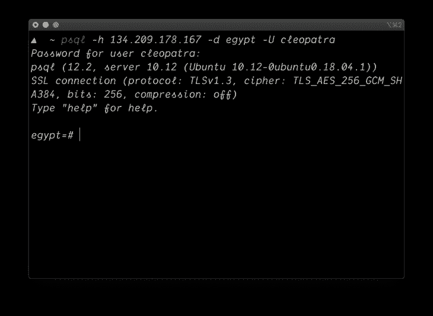
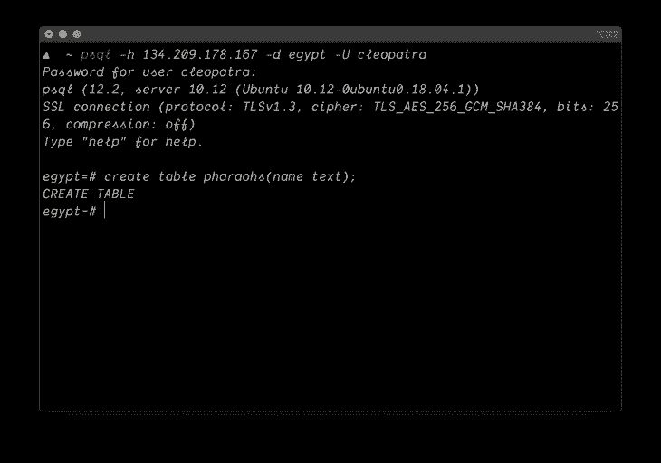
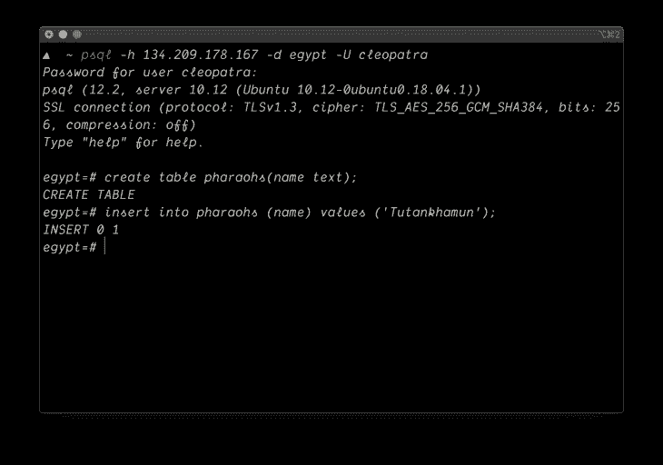
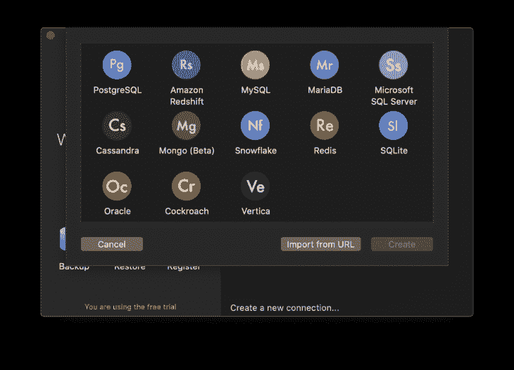
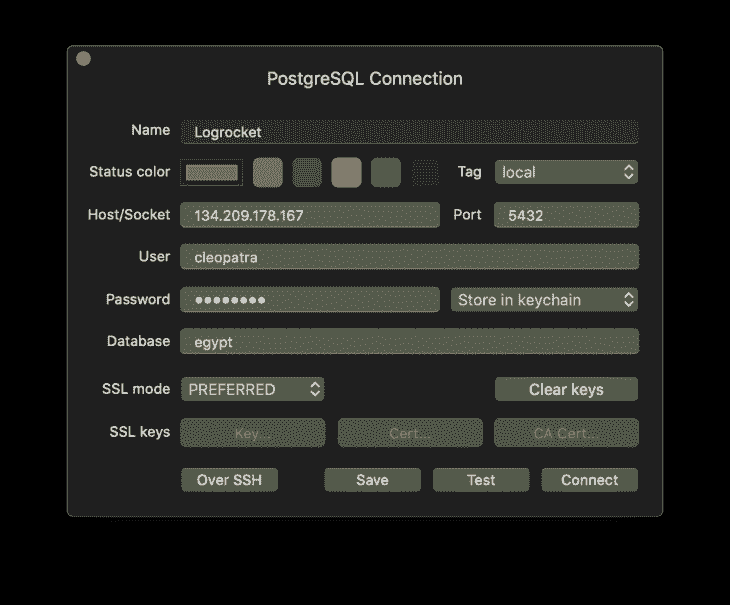
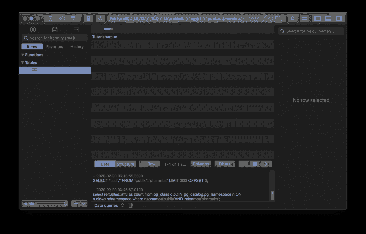

# 在 Ubuntu 18.04 上设置远程 Postgres 数据库服务器

> 原文：<https://blog.logrocket.com/setting-up-a-remote-postgres-database-server-on-ubuntu-18-04/>

## 介绍

Postgres 是一个强大的关系数据库管理系统，它可以处理从单机到数据中心的大型工作负载。它具有高度的可扩展性，并且广受欢迎。在本文中，我们将学习如何设置一个远程 Postgres 数据库服务器来用于您的项目。本文设置将允许 Postgres 从任何 IP 地址连接，但不包括特定/授权的 IP 连接。

## 先决条件

*   熟悉命令行界面
*   一台 Ubuntu 服务器，你可以从 [DigitalOcean](https://digitialocean.com) 或任何云提供商那里快速配置一台
*   很有耐心
*   Postgres 安装在本地机器上

## 安装 Postgres

在这一步中，您将在您的服务器上安装 Postgres。首先要做的是通过运行以下命令 SSH 到您的服务器:

```
ssh [email protected]_ip
```

> 注意:
> `server_user`是您要登录的服务器用户，
> `server_ip`是您服务器的 IP 地址

然后输入您的相关用户密码或 SSH 密钥密码(如果有的话)。接下来，通过运行:更新您的服务器包和依赖项

```
sudo apt-get update
```

完成后，通过运行以下命令安装 Postgres:

```
sudo apt-get install postgresql postgresql-contrib

```

这将安装 Postgres 及其相关的依赖项。当该过程完成时，将用户切换到`postgres`，以便能够使用 Postgres 默认用户执行 Postgres 命令，方法是运行:

```
su - postgres

```

服务器用户将从`root`切换到`postgres`。您可以通过运行以下命令来访问 Postgres shell:

```
psql
```

您将看到与此类似的内容:

```
[email protected]:~$ psql
psql (10.12 (Ubuntu 10.12-0ubuntu0.18.04.1))
Type "help" for help
postgres=#
```

## 创造用户

在这一步中，您将创建一个新用户，用于远程访问您的 Postgres 数据库。要创建一个新用户，通过执行:退出 Postgres shell

```
\q
```

仍然以`postgres`身份登录，运行以下命令创建一个新用户:

```
createuser --interactive --pwprompt
```

将显示一个提示，要求您输入所需的用户角色、名称、密码，以及您是否希望该用户成为超级用户。这里有一个例子:

```
Enter name of role to add: cleopatra
Enter password for new role:
Enter it again:
Shall the new role be a superuser? (y/n) y
```

我将我的用户角色命名为`cleopatra`,并让我的用户成为超级用户。超级用户是拥有 Postgres 实例上所有可用权限的用户。接下来，我们将把`cleopatra`分配给一个数据库。为此，请运行以下命令:

```
createdb -O cleopatra egypt
```

上面的命令将创建一个名为`egypt`的新数据库，并将`cleopatra`指定为数据库用户。

## 允许远程访问

在这一步中，我们将了解如何配置 Postgres 来接受外部连接。首先，用您喜欢的编辑器打开配置文件:

```
nano /etc/postgresql/10/main/postgresql.conf
```

在文件中查找这一行:

```
#listen_addresses = 'localhost'
```

取消注释，并将值改为`'*'`，这将允许来自任何人的 Postgres 连接。

```
listen_addresses = '*'
```

保存并退出文件。接下来，修改`pg_hba.conf`也允许来自每个人的连接。用您喜欢的编辑器打开文件:

```
nano /etc/postgresql/10/main/pg_hba.conf

```

修改此部分:

```
# IPv4 local connections:
host    all             all             127.0.0.1/32            md5
```

对此:

```
# IPv4 local connections:
host    all             all             0.0.0.0/0            md5
```

该文件存储客户端认证，每个记录指定一个 IP 地址范围、数据库名称、用户名和认证方法。在我们的例子中，我们授权所有数据库用户使用任何 IP 地址范围访问所有数据库，因此，允许任何 IP 地址连接。保存并退出文件。接下来，通过执行以下命令允许端口`5432`通过防火墙:

```
sudo ufw allow 5432/tcp
```

最后，通过运行以下命令，重新启动 Postgres 以应用您对其配置所做的所有更改:

```
sudo systemctl restart postgresql
```

## 远程连接到 Postgres

在此步骤中，您将从外部机器连接到您的服务器。通过运行:连接到远程 Postgres 数据库

```
psql -h {server_ip} -d egypt -U cleopatra

```

其中`{server_ip}`是您的服务器 IP 地址，您将得到一个输入您的用户密码的提示，如果凭证匹配，您将登录到`cleopatra`的 Postgres shell 和数据库`egypt`。



通过在 Postgres shell 中执行以下命令，创建一个新表并将其命名为`pharaohs`:

```
create table pharaohs(name text);
```



接下来，向`pharaohs`表添加一条记录，通过在 Postgres shell 中运行以下命令，您将把`Tutankhamun`作为一个字符串添加到表中:

```
insert into pharaohs (name) values ('Tutankhamun');
```



接下来，我们将使用 GUI(图形用户界面)工具访问我们的数据库，如 [tablePlus](https://tableplus.com) ，它使您能够在命令行界面之外可视化数据，以查看我们是否可以找到我们创建的记录。打开 TablePlus，点击`Create a new connection`。


从下拉列表中选择 Postgres



输入凭据

> 注意:
> Postgres 默认端口是`5432`
> 忽略 SSL 区域(我们不会在这篇文章中讨论这个话题)



If your credentials are correct, you will be shown a GUI panel to view your database records in which you will find the table created and the record we added to it.



如图所示，我们可以看到我们之前创建的`pharaohs`表和我们添加到其中的记录。我们的远程数据库准备好了！

## 结论

我们已经了解了如何为远程访问配置 Postgres 数据库服务器。有了这些知识，您就可以为下一个项目设置一个数据库服务器。在生产中，您必须牢记一些安全措施。例如，只允许指定的 IP 地址而不允许 root 访问您的服务器，您可以在本文的[中了解如何设置。](https://www.cyberciti.biz/tips/postgres-allow-remote-access-tcp-connection.html)