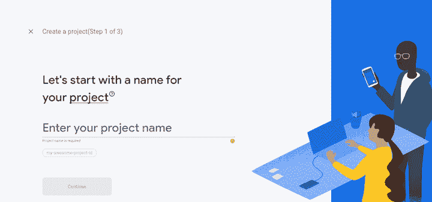
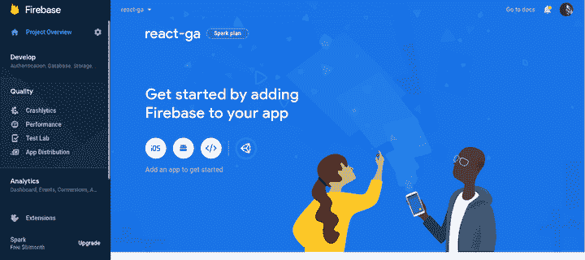
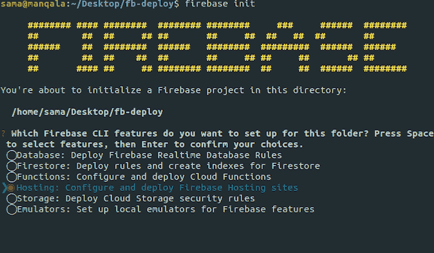
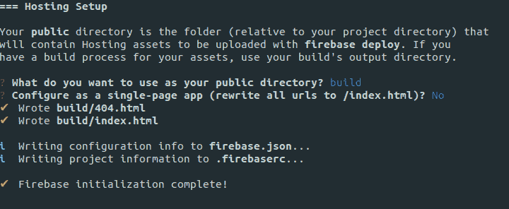

# 使用 React、Firebase 和 GitHub 操作设置连续部署

> 原文：<https://blog.logrocket.com/setting-up-continuous-deployment-with-react-firebase-and-github-actions/>

自动化您的部署过程有助于您更快地交付产品，并允许您的团队专注于构建和收集来自客户的有价值的反馈。

[连续部署(CD)](https://en.wikipedia.org/wiki/Continuous_deployment#cite_note-1) (不要与连续交付混淆)是一种软件工程方法，其中软件功能通过自动化部署频繁交付。相比之下，连续交付需要在触发手动部署之前获得最终批准。

Firebase 是 Google 开发的一个网络和移动开发平台，包括托管、实时数据库和云存储等服务。本教程将重点介绍托管产品。

设置连续交付有时是一件苦差事，因为您经常需要使用不同的工具和平台来设置、构建、测试和部署——这就把我们带到了 GitHub Actions。

于 2019 年 11 月推出的 [GitHub Actions](https://github.com/features/actions) 是单独的任务，您可以组合这些任务来创建工作并定制您的工作流程。最重要的是，它使您能够设置任务来构建、测试和部署从 GitHub 到 Firebase 的代码。

在本指南中，我们将向您展示如何建立一个工作流来构建、测试和部署一个样例 React 项目到 Firebase。

## 先决条件

要跟随本教程，您应该熟悉以下内容。

*   Java Script 语言
*   反应
*   饭桶
*   终端(Mac/Linux)/命令提示符(Windows)

## 设置 React 项目

我们将使用[创建 React 应用](https://github.com/facebook/create-react-app)来启动并运行 React 应用。在您的终端中运行以下命令来设置一个示例 React 应用程序。

```
npx create-react-app react-cd-sample
cd react-cd-sample
npm start

```

## 设置 Firebase 项目

要设置 firebase 帐户，请进入 [Firebase 控制台](https://console.firebase.google.com/)，点击“创建项目”，并填写详细信息。



设置好项目后，您应该会看到一个类似下面截图的仪表板。在仪表板上添加一个 web 应用程序，并填写详细信息。



完成后，启动您的终端并运行下面的命令来全局安装`firebase-cli`。

```
npm install -g firebase-tools

```

Firebase CLI 是一个用于管理、查看和部署 Firebase 项目的工具。

下一步是在您创建的 React 项目中初始化 Firebase。在终端上导航到项目的根目录，运行命令登录 Firebase。

```
firebase login:ci

```

上述命令将启动您的浏览器并打开一个 Google 身份验证页面。成功认证后，令牌将显示在您的终端上。拷贝并保存在安全的地方，因为在创建工作流程时会用到它。

身份验证成功后，运行以下命令。

```
firebase init

```

这将初始化 firebase，并允许您选择想要集成到 React 项目中的产品。如前所述，对于本教程，我们将重点放在托管。



选择托管后，系统会提示您配置托管选项。

1.  输入`build`作为公共目录，因为这是 React 在构建项目后提供的默认目录
2.  在配置为单页应用程序提示符上输入`No`,以允许 React 控制该行为



如果它提示您覆盖任何文件，输入`no`，因为您不希望它覆盖 React 生成的文件。流程完成后，生成两个文件:`firebase.json`和`.firebaserc`。

`firebase.json`文件包含与项目相关的文件、资产和设置的位置信息。`.firebaserc`文件存储项目别名，可以用来为同一个应用程序设置不同的托管选项——一个用于暂存，另一个用于生产。

## 创建工作流

我们将使用由[杰瑞米·肖尔](https://github.com/w9jds)创建的 GitHub 动作，名为 [GitHub 动作用于 Firebase](https://github.com/marketplace/actions/github-action-for-firebase) ，它包装了`firebase-cli`来启用通用命令。

首先，您需要一个 GitHub 存储库来存放您的项目，所以请访问 GitHub 并创建一个。将存储库添加到项目中，提交更改，并将项目推送到 GitHub。

接下来，到你的设置库中点击**秘密**，然后**添加一个新的秘密**。输入`FIREBASE_TOKEN`作为名称，输入之前复制的令牌作为值。完成后，点击**添加密码**保存环境变量。

要创建工作流，工作流文件必须存储在项目根目录下的`.github/workflows`目录中。转到项目目录的根目录，运行以下命令。

* * *

### 更多来自 LogRocket 的精彩文章:

* * *

```
mkdir .github
cd .github
mkdir workflows
cd workflows
touch main.yml

```

在文本编辑器中打开`main.yml`并输入以下内容。

```
name: Firebase Deploy
on:
  push:
    branches:
      - master
jobs:
  build:
    name: Build
    runs-on: ubuntu-latest
    steps:
      - name: Checkout Repo
        uses: actions/[email protected]
      - name: Install Dependencies
        run: npm install
      - name: Run Tests
        env:
          CI: true
        run: npm test
      - name: Build
        run: npm run build
      - name: Archive Production Artifact
        uses: actions/[email protected]
        with:
          name: build
          path: build
  deploy:
    name: Deploy
    needs: build
    runs-on: ubuntu-latest
    steps:
      - name: Checkout Repo
        uses: actions/[email protected]
      - name: Download Artifact
        uses: actions/[email protected]
        with:
          name: build
          path: build
      - name: Deploy to Firebase
        uses: w9jds/[email protected]
        with:
          args: deploy --only hosting
        env:
          FIREBASE_TOKEN: ${{ secrets.FIREBASE_TOKEN }}

```

工作流程分为两个主要部分:on 和 jobs。“打开”部分定义了触发工作流的原因—在本例中，每当您推送到主分支时。作业部分定义了工作流预期运行的内容，即构建和部署。Build 安装依赖项，运行测试，并生成项目。部署依赖于生成；构建作业成功运行后，deploy 负责将项目部署到 firebase。

## 部署到火力基地

保存文件后，提交并推送您的更改到 GitHub。单击存储库上的 Actions 选项卡，观察它运行时的操作。一旦成功执行，项目就被部署到 Firebase。访问您的`.firebaseapp.com`查看您的项目。

## 结论

设置持续部署不一定是昂贵或繁琐的。您可以轻松地将本教程中描述的过程集成到您的项目中，这将有助于确保您比以往更快地将错误更少的项目部署到生产中。

要了解更多信息，请查看以下资源。

## [LogRocket](https://lp.logrocket.com/blg/react-signup-general) :全面了解您的生产 React 应用

调试 React 应用程序可能很困难，尤其是当用户遇到难以重现的问题时。如果您对监视和跟踪 Redux 状态、自动显示 JavaScript 错误以及跟踪缓慢的网络请求和组件加载时间感兴趣，

[try LogRocket](https://lp.logrocket.com/blg/react-signup-general)

.

[ ](https://lp.logrocket.com/blg/react-signup-general) [](https://lp.logrocket.com/blg/react-signup-general) 

LogRocket 结合了会话回放、产品分析和错误跟踪，使软件团队能够创建理想的 web 和移动产品体验。这对你来说意味着什么？

LogRocket 不是猜测错误发生的原因，也不是要求用户提供截图和日志转储，而是让您回放问题，就像它们发生在您自己的浏览器中一样，以快速了解哪里出错了。

不再有嘈杂的警报。智能错误跟踪允许您对问题进行分类，然后从中学习。获得有影响的用户问题的通知，而不是误报。警报越少，有用的信号越多。

LogRocket Redux 中间件包为您的用户会话增加了一层额外的可见性。LogRocket 记录 Redux 存储中的所有操作和状态。

现代化您调试 React 应用的方式— [开始免费监控](https://lp.logrocket.com/blg/react-signup-general)。