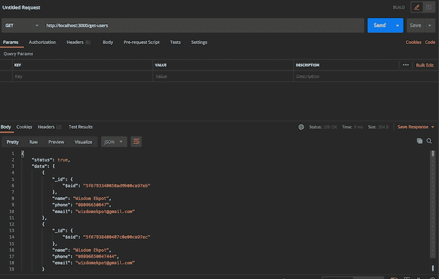

# 在 Deno - LogRocket 博客中设置 MongoDB

> 原文：<https://blog.logrocket.com/setting-up-mongodb-in-deno/>

Deno 是一个简单而安全的 JavaScript 运行时，默认情况下支持和配置 TypeScript。MongoDB 是一个跨平台的面向文档的数据库程序，被开发人员广泛使用。在本文中，我们将学习如何将 MongoDB 集成到 Deno 应用程序中。

### 先决条件

*   熟悉打字稿
*   VS 代码，或者安装在开发机器上的任何代码编辑器。
*   MongoDB 的基础知识。
*   安装在本地机器上的邮递员。

在我们开始之前，确保您已经在本地机器上安装了 Deno。如果您正在使用 Mac，但尚未安装，请打开您的终端并运行以下命令:

```
brew install deno
```

如果您使用的是 Windows 机器，可以通过在终端上运行以下命令来安装它:

```
iwr https://deno.land/x/install/install.ps1 -useb | iex
```

或者，如果您安装了 Chocolatey，您可以运行:

```
choco install deno
```

## 入门指南

我们将首先创建一个`server.js`文件，然后设置我们的 Deno 服务器。由于 Node.js 中没有`package.json`文件，Deno 使用通过 URL 或文件路径引用的模块。

```
import { Application, Router } from "https://deno.land/x/oak/mod.ts";
const app = new Application();
const router = new Router();
const PORT = 3000;
router
  .get("/", (ctx) => {
    ctx.response.body = "This is the home route";
  });
app.use(router.routes());
app.use(router.allowedMethods());
app.listen({ port: PORT });

```

我们使用 Oak 来运行我们的服务器。Oak 是一个用于 HTTP 服务器的 Deno 中间件框架，它还包括一个路由器中间件。

我们现在可以在终端上运行`deno run --allow-net server.ts`来服务我们的应用程序。由于 Deno 的安全性，我们需要添加`--allow-net`来运行服务器。我们可以在`localhost:8000`的浏览器上查找应用程序。

现在我们的服务器已经启动并运行了，我们可以开始在应用程序中设置 MongoDB 了。创建一个`db.js`文件，我们将在这里设置我们的数据库配置:

```
// import the package from url
import { init, MongoClient } from "https://deno.land/x/[email protected]/mod.ts";
// Intialize the plugin
await init();
// Create client
const client = new MongoClient();
// Connect to mongodb
client.connectWithUri("mongodb://localhost:27017");
// Give your database a name
const dbname: string = "denoMongoApp";
const db = client.database(dbname);
// Declare the mongodb collections here. Here we are using only one collection (i.e user).
// Defining schema interface
interface UserSchema {
  _id: { $oid: string };
  name: string;
  email: string;
  phone: string;
}
const User = db.collection<UserSchema>("user");
export { db, User };
```

这里我们导入插件，然后初始化它。我们创建了一个`mongoClient`的实例，然后将它连接到 MongoDB。我们设置了一个`User`集合，我们将使用它来测试我们的 Mongo 配置。我们还为 MongoDB 模型定义了一个 TypeScript 接口，它将接受一个名称、电子邮件、电话和一个生成的 Mongo ID。

既然已经设置好了，我们将构建一个简单的 CRUD 应用程序来测试它。为了使我们的应用程序更具可伸缩性，我们需要创建一个`routes.ts`和一个`controller.ts`文件。我们的`routes.ts`文件将处理我们的路由，`controller.ts`文件将处理我们的 MongoDB 逻辑。

我们的`routes.ts`文件应该是这样的:

```
import { Router } from "https://deno.land/x/oak/mod.ts";
import { getUsers, createUser } from "./controller.ts";
const router = new Router();
router
  .get("/", (ctx) => {
    ctx.response.body = "This is the home route";
  })
  .get("/get-users", getUsers)
  .post("/create-user", createUser);
export default router;
```

有了这个新配置，我们需要将我们的`server.ts`文件修改为:

```
import { Application } from "https://deno.land/x/oak/mod.ts";
const app = new Application();
import router from "./routes.ts";
const PORT: number = 3000;
//
app.use(router.routes());
app.use(router.allowedMethods());
app.listen({ port: PORT });
```

现在我们需要定义我们在`router.ts`文件中调用的路由方法。我们将从创建`getUser`方法开始。记住，我们必须引入我们在`db.ts`文件中创建的数据库实例:

```
import { User } from "./db.ts";

let getUsers = async (ctx: any) => {
  try {
    const data: any = await User.find();
    ctx.response.body = { "status": true, data: data };
    ctx.response.status = 200;
  } catch (err) {
    ctx.response.body = { status: false, data: null };
    ctx.response.status = 500;
    console.log(err);
  }
};
```

现在我们可以调用`get-user`端点，默认情况下它将返回一个空数组和一个状态`200`。

我们将使用相同的技术来实现`createUser`方法:

```
let createUser = async (ctx: any) => {
  try {
    let body: any = await ctx.request.body();
    console.log(await body.value);
    const { name, phone, email } = await body.value;
    const id = await User.insertOne({
      name: name,
      phone: phone,
      email: email,
    });
    ctx.response.body = { status: true, data: id };
    ctx.response.status = 201;
  } catch (err) {
    ctx.response.body = { status: false, data: null };
    ctx.response.status = 500;
    console.log(err);
  }
};
```

永远记住等待`body.value`，因为这是一个异步请求。如果不这样做，它将只返回对象 ID。

让我们运行应用程序:

```
deno run --allow-all --unstable server.ts
```

在我们的应用程序中，`--allow-all`标志将允许所有权限并禁用 Deno 的安全性。

## 测试我们的端点

让我们继续使用 POSTMAN 测试我们的端点。下面是获取用户的测试:



下面是创建用户的测试:


## 结论

在 Deno 中设置应用程序非常容易，也更安全。只要有 Deno 控制器，您就可以使用自己选择的任何数据库。由于 Deno 没有一个`package.json`文件，它将所有的模块缓存在我们的本地机器上，这样要快得多。

## 使用 [LogRocket](https://lp.logrocket.com/blg/signup) 消除传统错误报告的干扰

[](https://lp.logrocket.com/blg/signup)

[LogRocket](https://lp.logrocket.com/blg/signup) 是一个数字体验分析解决方案，它可以保护您免受数百个假阳性错误警报的影响，只针对几个真正重要的项目。LogRocket 会告诉您应用程序中实际影响用户的最具影响力的 bug 和 UX 问题。

然后，使用具有深层技术遥测的会话重放来确切地查看用户看到了什么以及是什么导致了问题，就像你在他们身后看一样。

LogRocket 自动聚合客户端错误、JS 异常、前端性能指标和用户交互。然后 LogRocket 使用机器学习来告诉你哪些问题正在影响大多数用户，并提供你需要修复它的上下文。

关注重要的 bug—[今天就试试 LogRocket】。](https://lp.logrocket.com/blg/signup-issue-free)