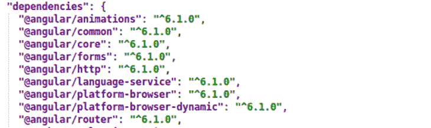
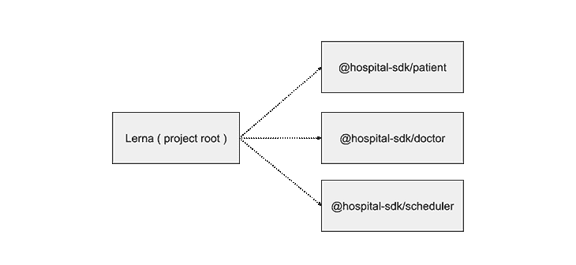
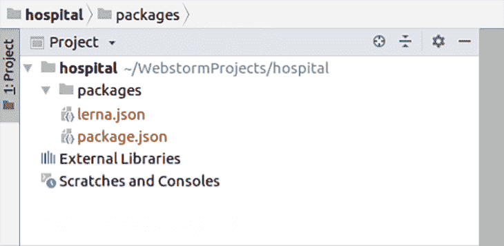
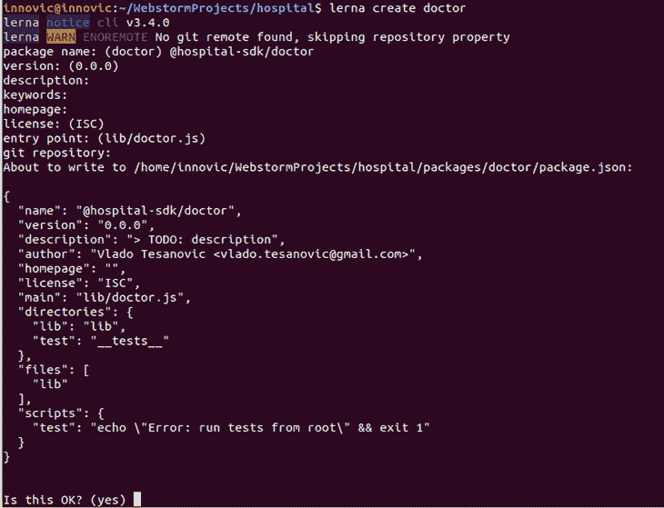
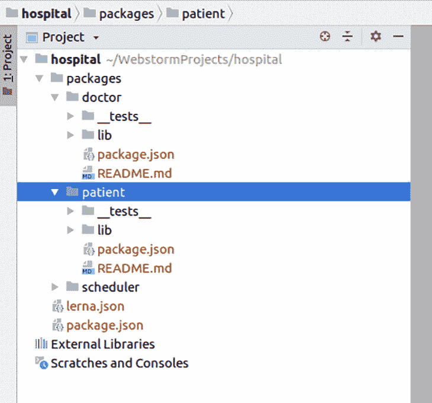
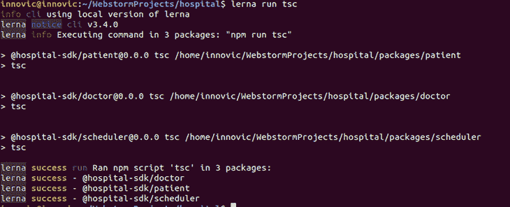
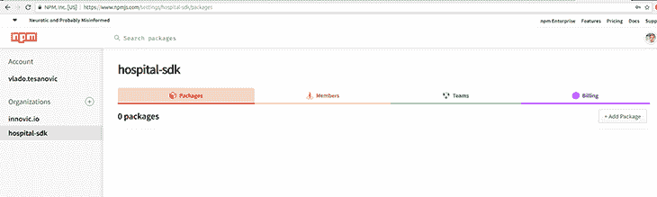
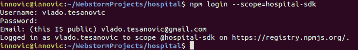

# 用 Lerna 为 TypeScript 项目设置 monorepo

> 原文：<https://blog.logrocket.com/setting-up-monorepo-with-lerna-typescript/>

***编者按**:本帖于 2022 年 1 月 31 日更新，以使用 Lerna 和 TypeScript 的更新版本，改进和更好地组织教程，并为现代实现提供更清晰的说明。*

使用单个存储库来维护包含所有包的整个项目通常是非常有用的。像谷歌和 T2 和脸书这样的公司已经在他们的大部分项目中使用了一个内部存储库。当公司使用类似的技术，并且所有项目共享一组公共的依赖项和文件时，这种解决方案会非常方便。

像 [Angular](https://github.com/angular/angular) 、 [React](https://github.com/facebook/react) 、 [Meteor](https://github.com/meteor/meteor) 、 [Babel](https://github.com/babel/babel) 、 [Nest.js](https://github.com/nestjs/nest) 和其他许多流行的 JavaScript 项目都使用一个单一的库来存放它们所有的包。事实上，他们中的一些人使用 Lerna。

### 什么是 Lerna？

Lerna 是一个流行且广泛使用的工具，用 JavaScript 编写，用于使用 npm 和 Git 为 Node.js 项目设置和管理多包存储库。

Lerna 有两种模式:固定和独立。固定模式将所有版本的包保持在同一级别。这种方法现在很流行。你可能在 Angular 看过。



独立模式允许我们每个包有不同的版本。

如果您有一个大型或复杂的项目，使用一个单一的存储库来存储所有的包有助于组织和维护。谢天谢地，对于 Lerna 来说这很容易。

## 初始设置

在开始之前，确保你有 [npm](https://www.npmjs.com/signup) 和 [GitHub](https://github.com/signup) 账户，因为我们将使用它们来托管我们的项目。另外，[创建一个 npm 组织](https://docs.npmjs.com/creating-an-organization)，这样一旦我们完成了，你就可以发布带有范围包的项目。

完成后，将 Lerna 作为一个全局依赖项安装:

```
npm install -g lerna

```

我们将构建一个简单的项目。我们的项目将由多个包组成，我们称之为`hospital-sdk`。



创建一个名为`hospital`的文件夹，并在文件夹中初始化 Lerna:

```
lerna init && npm install

```

该命令将创建一个带有默认文件夹结构的`lerna.json`文件。



`/packages`是我们共享包的占位符，`lerna.json`是一个 Lerna 配置文件。`package.json`是我们通常的载货单文件。

```
{
  "packages": [
    "packages/*"
  ],
  "version": "0.0.0"
}

```

Lerna 没有创建一个`.gitignore`文件，所以我们将创建一个包含以下内容的文件:

```
node_modules/
lerna-debug.log
npm-debug.log
packages/*/lib
.idea

```

我们将在我们的项目中使用 TypeScript，但是正如我们之前提到的，Lerna 不支持 TypeScript，所以我们将它视为共享依赖。使用以下命令将其添加到您的`package.json`的顶层:

```
npm install typescript @types/node — save-dev

```

这是推荐的方法，因为我们希望在我们的包中使用相同的工具。

## 准备我们的构建脚本

除了 TypeScript，我们还将为 Node.js 安装类型声明。由于 Lerna 旨在用于 Node.js，而不是 TypeScript，我们需要添加一些配置以使其工作。

我们将在项目的根目录中定义一个公共的`tsconfig.json`文件。我们的`tsconfig.json`将会是这样的:

```
{
 "compilerOptions": {
   "module": "commonjs",
   "declaration": true,
   "noImplicitAny": false,
   "removeComments": true,
   "noLib": false,
   "emitDecoratorMetadata": true,
   "experimentalDecorators": true,
   "target": "es6",
   "sourceMap": true,
   "lib": [
     "es6"
   ]
 },
 "exclude": [
   "node_modules",
   "**/*.spec.ts"
 ]
}

```

### 用`lerna create`构建我们的包

由于这是一个演示项目，我们将假设我们将有几个模块:`patient`、`doctor`和`scheduler`。

为了创建包，我们将从项目的根目录使用`lerna create`命令。

命令将引导我们创建一个新的包。它要求您的新包的名称作为参数传递。在这种情况下，它是`doctor`，导致全称是`@hospital-sdk/doctor`。



我们将对`patient`和`scheduler`包重复相同的过程。

生成的文件夹结构现在应该是:



## 按文件配置 TypeScript

每个单独的包都需要自己的`tsconfig.json`文件来获得正确的相对路径。其他选项可以从项目的根处的`tsconfig.json`扩展。

```
{
 "extends": "../../tsconfig.json",
 "compilerOptions": {
   "outDir": "./lib"
 },
 "include": [
   "./src"
 ]
}

```

在我们为每个包添加了一个`tsconfig.json`之后，我们将在每个包中创建一个`src`文件夹，并为该包创建一个 TypeScript 文件。

我们还需要在每个单独的`package.json`中注册一个`tsc`脚本。结果应该是:

```
{
  "name": "@hospital-sdk/doctor",
  "version": "0.0.0",
  "description": "> TODO: description",
  "author": "Vlado Tesanovic <[email protected]>",
  "homepage": "",
  "license": "ISC",
  "main": "lib/doctor.js",
  "typings": "lib/doctor.d.ts",
  "directories": {
    "lib": "lib",
    "test": "__tests__"
  },
  "files": ["lib"],
  "publishConfig": {
    "access": "public"
  },
  "scripts": {
    "tsc": "tsc",
    "test": "echo \"Error: run tests from root\" && exit 1"
  }
}

```

我们在每个`.ts`文件中添加了简单的逻辑。我们可以通过运行以下命令来测试我们的设置:

```
lerna run tsc

```

上面的命令将在所有创建的包中运行`tsc`脚本:



如果一切顺利，我们将把 TypeScript 文件从`src`文件夹编译到每个包的`lib`文件夹中。

查看我们项目中任何包的`package.json`，您会看到类似`directories`、`files`、`typings`、`publishConfig`和`main`的属性:

```
{
  "name": "@hospital-sdk/doctor",
  "version": "0.0.0",
  "description": "> TODO: description",
  "author": "Vlado Tesanovic <[email protected]>",
  "homepage": "",
  "license": "ISC",
  "main": "lib/doctor.js",
  "typings": "lib/doctor.d.ts",
  "directories": {
    "lib": "lib",
    "test": "__tests__"
  },
  "files": ["lib"],
  "publishConfig": {
    "access": "public"
  },
  "scripts": {
    "tsc": "tsc",
    "test": "echo \"Error: run tests from root\" && exit 1"
  }
}

```

`packages`、`doctor`和`package.json`文件夹非常重要，因为它们控制着什么将被推送到 npm，并且将作为我们库的入口点(`main`和`typings`属性)。

我们将为这个项目创建一个 [GitHub 库](https://github.com/vladotesanovic/hospital-sdk),并将所有代码推送到那里。

## 链接包

编译完 TypeScript 后，让我们创建一个测试`integration`包，看看 Lerna 如何处理链接包。

```
cd packages
mkdir integration
cd integration
npm init -y
cd ../..

```

要从 npm 安装必要的依赖项，或者从 monorepo 链接依赖项，请从项目的根目录使用`lerna add`命令。在任何命名冲突的情况下，本地包总是优先于远程包。

```
lerna add @hospital-sdk/doctor --scope=integration

```

`--scope`参数指定将包添加到哪个模块。

* * *

### 更多来自 LogRocket 的精彩文章:

* * *

`lerna add`命令的不幸限制是它一次只能添加一个包。因此，如果您需要一次安装更多的依赖项，您可以将它们添加到`package.json`中，然后运行`lerna bootstrap`命令。

```
{
  "name": "integration",
  "version": "1.0.0",
  "description": "",
  "main": "index.js",
  "scripts": {
    "start": "ts-node src/index.ts",
    "test": "echo \"Error: no test specified\" && exit 1"
  },
  "keywords": [],
  "author": "",
  "license": "ISC",
  "dependencies": {
    "ts-node": "^7.0.1",
    "@hospital-sdk/doctor": "^0.0.4",
    "@hospital-sdk/patient": "^0.0.4",
    "@hospital-sdk/scheduler": "^0.0.4"
  }
}

```

安装并链接本地和远程的所有依赖项。使用`lerna add`时，添加任何新的包时会自动调用`lerna bootstrap`命令。

要查看包是否链接成功，创建一个包含以下内容的`integration/src/index.ts`文件:

```
import { Doctor } from "@hospital-sdk/doctor";
import { Patient } from "@hospital-sdk/patient";
import { Scheduler } from "@hospital-sdk/scheduler";

console.log(new Doctor());
console.log(new Scheduler());
console.log(new Patient());

```

然后，在`integration/package.json`中添加启动脚本。

```
{
  "scripts": {
   "start": "ts-node src/index.ts" 
  }
}

```

从终端运行脚本应该会产生以下输出:

```
Doctor {}
Scheduler {}
Patient {}

```

## 发布到国家预防机制

我们的目标是在同一个 npm 范围或组织下发布所有包。国家防范机制组织也可以是私有的；在这种情况下，您可以控制谁将看到和使用您的包。

早些时候，我们在 npmjs.org 创建了一个免费的公共组织:



从终端登录到组织:



此时，我们已经准备好了我们的组织和构建脚本。让我们从根节点`package.json`开始，将它们粘合在一个 npm 脚本下:

```
{
 "scripts": {
   "publish": "lerna run tsc && lerna publish"
 }
}

```

从终端运行:

```
npm run publish

```

Lerna 将指导我们完成发布过程。我们需要选择一个包版本，并将标签推送到 GitHub。

如果一切顺利，我们会在最后看到这条消息: *lerna 成功发布了 3 个包。*

```

npm run publish
> publish
> lerna run tsc && lerna publish
lerna notice cli v3.4.0
lerna info Executing command in 3 packages: "npm run tsc"
> @hospital-sdk/[email protected] tsc
> tsc

> @hospital-sdk/[email protected] tsc
> tsc

> @hospital-sdk/[email protected] tsc
> tsc
lerna success run Ran npm script 'tsc' in 3 packages:
lerna success - @hospital-sdk/doctor
lerna success - @hospital-sdk/patient
lerna success - @hospital-sdk/scheduler
lerna notice cli v3.4.0
lerna info Verifying npm credentials
lerna info current version 0.0.3
lerna info Looking for changed packages since v0.0.3
? Select a new version (currently 0.0.3) Patch (0.0.4)
Changes:
 - @hospital-sdk/doctor: 0.0.3 => 0.0.4
 - @hospital-sdk/patient: 0.0.3 => 0.0.4
 - @hospital-sdk/scheduler: 0.0.3 => 0.0.4
? Are you sure you want to publish these packages? Yes
lerna info git Pushing tags...
lerna info publish Publishing packages to npm...
lerna notice
...                                   
lerna notice 
lerna info published @hospital-sdk/doctor 0.0.4
lerna info published @hospital-sdk/patient 0.0.4
lerna info published @hospital-sdk/scheduler 0.0.4
Successfully published:
 - @hospital-sdk/[email protected]
 - @hospital-sdk/[email protected]
 - @hospital-sdk/[email protected]
lerna success published 3 packages

```

## 结论

为 TypeScript 设置 Lerna 需要一些配置，但是从长远来看，将有助于提高您的包的可维护性，包括公共包和私有包。

你可以在我的 GitHub 上找到这个项目的源代码，T2 可以在他们的文档中了解更多关于 Lerna 的信息。

## [LogRocket](https://lp.logrocket.com/blg/typescript-signup) :全面了解您的网络和移动应用

[](https://lp.logrocket.com/blg/typescript-signup)

LogRocket 是一个前端应用程序监控解决方案，可以让您回放问题，就像问题发生在您自己的浏览器中一样。LogRocket 不需要猜测错误发生的原因，也不需要向用户询问截图和日志转储，而是让您重放会话以快速了解哪里出错了。它可以与任何应用程序完美配合，不管是什么框架，并且有插件可以记录来自 Redux、Vuex 和@ngrx/store 的额外上下文。

除了记录 Redux 操作和状态，LogRocket 还记录控制台日志、JavaScript 错误、堆栈跟踪、带有头+正文的网络请求/响应、浏览器元数据和自定义日志。它还使用 DOM 来记录页面上的 HTML 和 CSS，甚至为最复杂的单页面和移动应用程序重新创建像素级完美视频。

## 200 只显示器出现故障，生产中网络请求缓慢

部署基于节点的 web 应用程序或网站是容易的部分。确保您的节点实例继续为您的应用程序提供资源是事情变得更加困难的地方。如果您对确保对后端或第三方服务的请求成功感兴趣，

[try LogRocket](https://lp.logrocket.com/blg/node-signup)

.

[](https://lp.logrocket.com/blg/node-signup)[https://logrocket.com/signup/](https://lp.logrocket.com/blg/node-signup)

LogRocket 就像是网络和移动应用程序的 DVR，记录下用户与你的应用程序交互时发生的一切。您可以汇总并报告有问题的网络请求，以快速了解根本原因，而不是猜测问题发生的原因。

LogRocket 检测您的应用程序以记录基线性能计时，如页面加载时间、到达第一个字节的时间、慢速网络请求，还记录 Redux、NgRx 和 Vuex 操作/状态。

[Start monitoring for free](https://lp.logrocket.com/blg/node-signup)

.

[Try it for free](https://lp.logrocket.com/blg/typescript-signup)

.