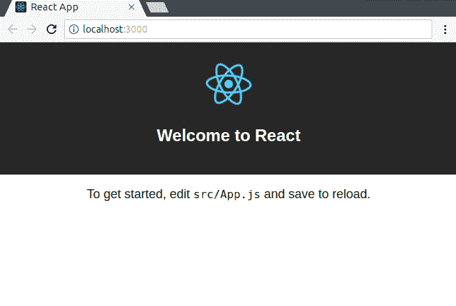

# 在 10 分钟内设置 React 热加载器

> 原文：<https://blog.logrocket.com/setup-react-hotloader-in-10-minutes-3175dfdbf38a/>

几年前，刷新浏览器以查看 web 项目的最新更新变得很累(在更改没有按预期呈现的情况下甚至很烦人)。

为了解决这个问题，开发人员开发了几个插件和工具，可以让`DOM`在每次保存时重新渲染，甚至不需要完全重新加载。

这叫做热重装。它的工作原理是在运行时用一个更新的模块替换应用程序的一个模块，以便它可以立即使用。

这就让我们谈到了热模块更换(HMR)。

顾名思义，HMR 可以在不重启服务器的情况下替换模块，并且可以很容易地在不同的捆绑器上启用。

在 [webpack 的](https://webpack.js.org/)网站上，它说:

> 热模块替换(HMR)在应用程序运行时交换、添加或删除[模块](https://webpack.js.org/concepts/modules/)，无需完全重新加载。这可以在几个方面大大加快开发速度。

HMR 解决了热重新加载的问题，使调整样式变得更容易(几乎相当于在浏览器的调试器中改变样式),并且总体上加快了开发过程。

但是，当我们在 React 这样的基于组件的框架中实时重载并跟踪其状态时，会发生什么呢？我们失去了国家。

我们丢失状态的原因可以通过首先理解热重装和实时重装之间的区别来理解:

*   对应用程序的**热重新加载**只会刷新被更改的文件，而不会丢失应用程序的状态。
*   一个**实时重新加载**到一个应用程序将会重新启动整个应用程序，并且加载导致它丢失它的状态。

本教程的主要目的是演示我们如何快速设置 react 应用程序的 react-hot-loader，以便它的组件可以被实时重新加载而不会丢失状态。

本文的结果代码可以在 [GitHub](https://github.com/christiannwamba/react-hot-loader-demo) 上找到。

## 先决条件

1.  请确保在开始本教程之前安装了节点和 npm
2.  这里假设您对 React 有非常基本的了解，并且对 JavaScript 有一个大致的了解会很有帮助
3.  我们将使用 create-react-app 工具创建 react 应用程序

如果您的计算机上还没有`create-react-app`工具，您可以使用以下命令安装它:

```
npm install -g create-react-app
```

## 设置开发环境

让我们启动一个 create-react-app 项目的新实例，并使用以下命令导航到新创建的目录:

```
create-react-app react-hot-loader-demo
cd react-hot-loader-demo
```

我们可以使用以下命令运行应用程序:

```
npm start
```

该命令启动指向地址`localhost://3000`的 web 服务器。我们将在浏览器上访问这个地址，并保持选项卡打开，因为在整个教程中，我们将在浏览器中监控应用程序的更新和行为。



当我们使用`create-react-app`创建一个新项目时，HMR 插件在`webpack`配置文件中默认启用，尽管我们看不到这个文件，因为`create-react-app`为我们配置了我们的应用程序并隐藏了配置文件。

## 检查热重装行为

我们可以通过向开箱即用的`index.css`文件添加一个基本样式来看到 HMR 的热重装。我们将向正文样式添加一个属性值对— `background: lightblue`:

```
body {
  margin: 0;
  padding: 0;
  font-family: sans-serif;
  background: lightblue;
}
```

保存后，应用程序会在不刷新浏览器选项卡的情况下更新。

这种行为是可能的，因为 HMR 能够在运行时替换应用程序中的代码模块。

### 用 JavaScript 文件检查热重装行为

现在让我们看看当我们编辑`App.js`文件中的内容时会发生什么，我们可以做一些基本的事情，如将“开始，编辑`src/App.js`并保存以重新加载”替换为“这是设置 React 热加载器的教程”

```
import React, { Component } from 'react';
import logo from './logo.svg';
import './App.css';

class App extends Component {
  render() {
    return (
      <div className="App">
        <header className="App-header">
          
          <h1 className="App-title">Welcome to React</h1>
        </header>
        <p className="App-intro">
        This is a tutorial to setup React Hotloader..
        </p>
      </div>
    );
  }
}

export default App;
```

 [https://www.youtube.com/embed/ahXEHGJrzTI?version=3&rel=1&showsearch=0&showinfo=1&iv_load_policy=1&fs=1&hl=en-US&autohide=2&wmode=transparent](https://www.youtube.com/embed/ahXEHGJrzTI?version=3&rel=1&showsearch=0&showinfo=1&iv_load_policy=1&fs=1&hl=en-US&autohide=2&wmode=transparent)

视频

这一次，可以观察到应用程序进行了实时重新加载，并且整个页面刷新，这样就可以实现更改了。这是因为 HMR 无法决定如何处理这个 JavaScript 文件的更新。

自然，当 HMR 在运行时收到更新并确认相关模块知道如何更新自己时，热重新加载是可能的。当模块知道如何更新自己时，HMR 就沿着导入/请求链向上，搜索可以接受更新的父模块。

让我们稍微调整一下我们的应用程序，让 HMR 知道如何处理热重载的 JavaScript 文件。

在`index.js`文件中(这是我们应用程序的入口点)，我们将添加这行代码:

```
if(module.hot){
  module.hot.accept()
}
```

这段代码将使 React 组件的更新能够热重载，因为父模块(`index.js`)现在知道如何接受和处理运行时更新。

现在，让我们快速编辑代码并保存它，看看状态是否持续，我们将用`“Does the state persist now? The value is {this.state.number}”`替换`Will the state be preserved? The value is {this.state.number}`:

```
import React, { Component } from 'react';
import logo from './logo.svg';
import './App.css';

class App extends Component {
  render() {
    return (
      <div className="App">
        <header className="App-header">
          
          <h1 className="App-title">Welcome to React</h1>
        </header>
        <p className="App-intro">
        This update will not cause a refresh to the browser tab.
        </p>
      </div>
    );
  }
}

export default App;
```

结果页面:

 [https://www.youtube.com/embed/XSuT76vPfBk?version=3&rel=1&showsearch=0&showinfo=1&iv_load_policy=1&fs=1&hl=en-US&autohide=2&wmode=transparent](https://www.youtube.com/embed/XSuT76vPfBk?version=3&rel=1&showsearch=0&showinfo=1&iv_load_policy=1&fs=1&hl=en-US&autohide=2&wmode=transparent)

视频

此更新被处理为热重新加载，不会导致浏览器刷新！

### 用状态变量检查热重装行为

到目前为止，我们所做的一切都很棒。让我们看看当我们在应用程序中包含一个基本状态变量时会发生什么，我们还可以添加一个函数，使它在单击事件时递增:

```
import React, { Component } from 'react';
import logo from './logo.svg';
import './App.css';

class App extends Component {
  constructor(props){
    super(props);
    this.state = {
      number : 0
    }
  }

  render() {
    return (
      <div className="App">
        <header className="App-header">
          
          <h1 className="App-title">Welcome to React</h1>
        </header>
        <p className="App-intro">
        The current value of number is {this.state.number}
        </p>
        <button onClick={()=>this.setState({number : this.state.number + 1})}>+</button>
      </div>
    );
  }
}

export default App;
```

当我们保存该代码并且它重新加载时，我们可以点击按钮 12 次来增加它:

 [https://www.youtube.com/embed/iIq7tUM0z1I?version=3&rel=1&showsearch=0&showinfo=1&iv_load_policy=1&fs=1&hl=en-US&autohide=2&wmode=transparent](https://www.youtube.com/embed/iIq7tUM0z1I?version=3&rel=1&showsearch=0&showinfo=1&iv_load_policy=1&fs=1&hl=en-US&autohide=2&wmode=transparent)

视频

它就像我们希望的那样工作，但是，如果我们现在编辑 JavaScript 文件并保存它，会发生什么呢？它应该像以前一样进行热重新加载，并保留状态变量的值，对吗？让我们看看。让我们用`Will the state be preserved? The value is {this.state.number}`替换`The current value of number is {this.state.number}`行:

```
import React, { Component } from 'react';
import logo from './logo.svg';
import './App.css';

class App extends Component {
  constructor(props){
    super(props);
    this.state = {
      number : 0
    }
  }

  render() {
    return (
      <div className="App">
        <header className="App-header">
          
          <h1 className="App-title">Welcome to React</h1>
        </header>
        <p className="App-intro">
        Will the state be preserved? The value is {this.state.number}
        </p>
        <button onClick={()=>this.setState({number : this.state.number + 1})}>+</button>
      </div>
    );
  }
}

export default App;
```

在保存它时，我们得到这个屏幕:

 [https://www.youtube.com/embed/CBkQm2ASfso?version=3&rel=1&showsearch=0&showinfo=1&iv_load_policy=1&fs=1&hl=en-US&autohide=2&wmode=transparent](https://www.youtube.com/embed/CBkQm2ASfso?version=3&rel=1&showsearch=0&showinfo=1&iv_load_policy=1&fs=1&hl=en-US&autohide=2&wmode=transparent)

视频

刚刚发生了什么？几秒钟前我们的数字不是等于 12 吗？这种价值去了哪里？没错，在热重装期间，组件被卸载了，当组件被再次装载时，构造函数必须重新运行。即使使用 HMR 提供的热重装功能，我们也会丢失状态数据。

* * *

### 更多来自 LogRocket 的精彩文章:

* * *

我们可以使用 React 热加载器插件并做一些配置来解决这个问题。

## 设置 React 热加载器

首先，我们要弹出我们的应用程序，这样我们就可以定制它的配置:

```
npm run eject
```

> 运行`npm run eject`复制所有的配置文件和可传递的依赖项(webpack、Babel、ESLint 等。)到您的项目中，这样您就可以完全控制它们。像`npm start`和`npm run build`这样的命令仍然有效，但是它们会指向复制的脚本，这样你就可以调整它们了。
> 
> 这样做也是永久的。

接下来，我们引入 React Hot Loader，这是一个插件，允许 React 组件在不丢失状态的情况下被实时重新加载。它可以与 webpack 和其他支持 HMR 和巴别塔插件的捆绑器一起工作。

```
npm install --save react-hot-loader
```

> 出于权限方面的原因，Linux 用户可能需要在这个命令前面加上前缀`sudo`。

安装完成后，我们希望导航到现在可用的`config/webpack.config.dev.js`，将这一行— `plugins: ['react-hot-loader/babel']` —添加到 Babel loader 配置中。它应该是这样的:

```
// Process JS with Babel.
{
  test: /\.(js|jsx)$/,
  include: paths.appSrc,
  loader: require.resolve('babel-loader'),
  options: {
    // This is a feature of `babel-loader` for Webpack (not Babel itself).
    // It enables caching results in ./node_modules/.cache/babel-loader/
    // directory for faster rebuilds.
    cacheDirectory: true,
    plugins: ['react-hot-loader/babel'],
  },
}
```

接下来我们要做的是再次打开应用程序的入口点，并将应用程序的顶层组件包装在一个`<AppContainer>`中。我们必须先从`react-hot-loader`进口`<AppContainer>`:

```
import React from 'react';
import ReactDOM from 'react-dom';
import './index.css';
import App from './App';
import registerServiceWorker from './registerServiceWorker';
import { AppContainer } from 'react-hot-loader';

ReactDOM.render(
    <AppContainer>
      <App />
    </AppContainer>, document.getElementById('root'));
registerServiceWorker();

if(module.hot){
    module.hot.accept()
}
```

让我们修改`module.hot`部分，这样我们也可以在其中呈现`<AppContainer>`:

```
if(module.hot){

    module.hot.accept('./App', () => {

    const NextApp = require('./App').default; 

    ReactDOM.render(
    <AppContainer>
    <NextApp />
    </AppContainer>,
    document.getElementById('root')
    );

    });
}
```

这个修改告诉`<AppContainer>`处理模块重载，并处理运行时可能产生的任何错误。

> 在生产环境中会被禁用。

最后，我们需要将`react-hot-loader`补丁放入我们的入口点文件:

```
require('react-hot-loader/patch');
```

我们需要这样做，因为它负责在底层处理中修补代码。

## 测试 React 热加载器

让我们测试我们的应用程序，看看状态是否会在更新时保留。现在，我们可以通过保存我们刚刚进行的更新并运行应用程序来完成这一任务:

```
npm start
```

我们可以单击按钮将数字变量增加到 36 这样的数字:

 [https://www.youtube.com/embed/7kfwTzH30zA?version=3&rel=1&showsearch=0&showinfo=1&iv_load_policy=1&fs=1&hl=en-US&autohide=2&wmode=transparent](https://www.youtube.com/embed/7kfwTzH30zA?version=3&rel=1&showsearch=0&showinfo=1&iv_load_policy=1&fs=1&hl=en-US&autohide=2&wmode=transparent)

视频

现在，让我们快速编辑代码并保存它，看看状态是否持续:

```
import React, { Component } from 'react';
import logo from './logo.svg';
import './App.css';

class App extends Component {
  constructor(props){
    super(props);
    this.state = {
      number : 0
    }
  }
  render() {
    return (
      <div className="App">
        <header className="App-header">
          
          <h1 className="App-title">Welcome to React</h1>
        </header>
        <p className="App-intro">
        Does the state persist now? The value is {this.state.number}
        </p>
        <button onClick={()=>this.setState({number : this.state.number + 1})}>+</button>
      </div>
    );
  }
}

export default App;
```

此更新导致浏览器窗口更新为:

 [https://www.youtube.com/embed/vqZ6cpBYkH0?version=3&rel=1&showsearch=0&showinfo=1&iv_load_policy=1&fs=1&hl=en-US&autohide=2&wmode=transparent](https://www.youtube.com/embed/vqZ6cpBYkH0?version=3&rel=1&showsearch=0&showinfo=1&iv_load_policy=1&fs=1&hl=en-US&autohide=2&wmode=transparent)

视频

厉害！尽管我们对文档进行了更改，但状态仍然存在，这意味着我们的`react-hot-loader`可以完美地工作，并为我们处理模块重载。

## 结论

在本教程中，我们从理解热加载的重要性开始，详细说明了热加载和动态加载之间的区别。我们还看到了如何使用`react-hot-loader`插件快速、轻松地设置 React 应用程序进行热重载，这样应用程序中所有状态的值都可以被持久化，而不管进行了哪些更新。这篇文章的最终代码可以在 [GitHub](https://github.com/christiannwamba/react-hot-loader-demo) 上找到。

## [LogRocket](https://lp.logrocket.com/blg/react-signup-general) :全面了解您的生产 React 应用

调试 React 应用程序可能很困难，尤其是当用户遇到难以重现的问题时。如果您对监视和跟踪 Redux 状态、自动显示 JavaScript 错误以及跟踪缓慢的网络请求和组件加载时间感兴趣，

[try LogRocket](https://lp.logrocket.com/blg/react-signup-general)

.

[ ](https://lp.logrocket.com/blg/react-signup-general) [](https://lp.logrocket.com/blg/react-signup-general) 

LogRocket 结合了会话回放、产品分析和错误跟踪，使软件团队能够创建理想的 web 和移动产品体验。这对你来说意味着什么？

LogRocket 不是猜测错误发生的原因，也不是要求用户提供截图和日志转储，而是让您回放问题，就像它们发生在您自己的浏览器中一样，以快速了解哪里出错了。

不再有嘈杂的警报。智能错误跟踪允许您对问题进行分类，然后从中学习。获得有影响的用户问题的通知，而不是误报。警报越少，有用的信号越多。

LogRocket Redux 中间件包为您的用户会话增加了一层额外的可见性。LogRocket 记录 Redux 存储中的所有操作和状态。

现代化您调试 React 应用的方式— [开始免费监控](https://lp.logrocket.com/blg/react-signup-general)。