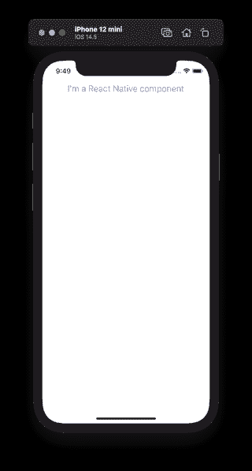
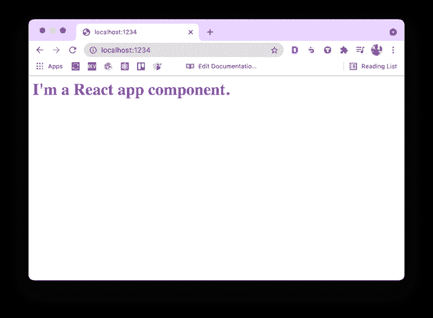
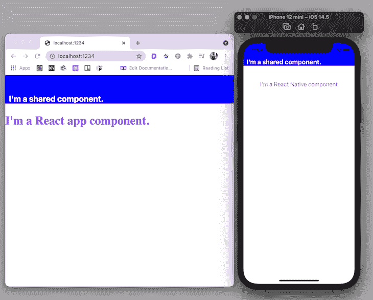
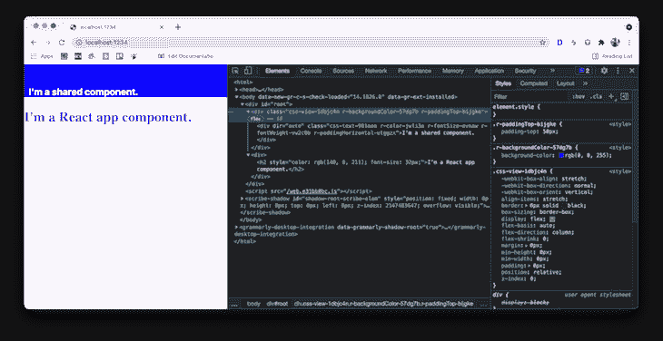

# 与 React Native 共享代码

> 原文：<https://blog.logrocket.com/sharing-code-react-native-web/>

React Native for Web 是一个开源项目，使您能够在 React web 应用程序中使用 React 本机核心组件。 [React Native for Web](https://necolas.github.io/react-native-web/docs/) 使用 React DOM 在 Web 浏览器中呈现与 React Native 兼容的 JavaScript 代码，使代码共享成为可能。

在本教程中，我们将使用 Parcel 设置一个 React web 应用程序，使用 React Native 核心组件构建[组件，最后，使用 React Native for web 在我们的移动和 Web 应用程序之间共享这些组件。](https://blog.logrocket.com/react-native-component-libraries-in-2020/)

我们开始吧！

## 设置本地反应

首先，我们将创建一个新的 React 本机应用程序。对于这个演示，我使用 npx，但是如果在您的开发环境中全局安装了`react-native-cli`包，您也可以使用它。

打开一个新的终端窗口，并执行以下命令:

```
npx react-native init MyApp

```

`MyApp`是 React 原生项目名称的占位符。

如果你使用的是 iOS 模拟器，运行`yarn run ios`。如果你使用的是 Android 模拟器，运行`yarn run android`。一旦构建过程完成，您将看到默认的 React 本地应用程序和样板代码，您可以在`App.js`中修改这些代码。

例如，我将在`App.js`中呈现一条简单的文本消息:

```
import React from 'react';
import { View, StyleSheet, Text } from 'react-native';

const styles = StyleSheet.create({
  screenContainer: {
    flex: 1
  },
  text: {
    fontSize: 20,
    color: 'cornflowerblue',
    marginTop: 50,
    alignSelf: 'center'
  }
});

const App = () => {
  return (
    <View styles={styles.screenContainer}>
      <Text style={styles.text}>I'm a React Native component</Text>
    </View>
  );
};

export default App;

```

上面代码的输出将如下图所示:



## 设置包裹

我们将使用 Parcel，一个不需要任何配置的捆绑器，来轻松地在 React 中设置一个新的 web 应用程序。使用 Parcel 设置 React 应用程序的方式与使用 Create React 应用程序生成应用程序的方式类似。

在 React 原生项目中创建一个名为`web/`的新目录。在内部，我们将创建以下文件并添加相应的样板代码。

创建一个名为`index.html`的文件，并添加以下代码:

```
<html>
  <body>
    <div id="root"></div>
    <script src="./index.js"></script>
  </body>
</html>

```

创建一个`App.js`文件，并添加以下代码以在`h2`标记内呈现文本:

```
import React from 'react';

const WebAppTitle = () => {
  return (
    <div>
      <h2 style={{ color: '#9400d3', fontSize: '32' }}>
        I'm a React app component.
      </h2>
    </div>
  );
};

const App = () => {
  return (
    <>
      <WebAppTitle />
    </>
  );
};

export default App;

```

注意，`WebAppTitle`是一个定制的 web 组件。现在，我们将创建一个`index.js`文件并添加以下代码:

```
import React from 'react';
import { render } from 'react-dom';

import App from './App';

render(<App />, document.getElementById('root'));

```

接下来，我们将使用`yarn init`初始化一个 React 应用程序，这将为您打开一个交互式会话来创建一个`package.json`文件并添加所需的默认值。然而，你可以通过运行速记`yarn init --yes`来跳过这个会话。

运行`yarn init --yes`之后，`package.json`文件应该看起来像下面的代码:

```
{
  "name": "web",
  "version": "1.0.0",
  "main": "index.js",
  "license": "MIT"
}

```

接下来，在`web`目录中安装以下依赖项:

```
yarn add react react-dom react-native-web
yarn add -D parcel-bundler

```

Parcel 可以将任何文件作为入口点，但对于 web 应用程序，建议使用 HTML 或 JavaScript 文件。现在，我们将把下面的`scripts`添加到`package.json`文件中:

```
{
  "scripts": {
    "start": "parcel serve ./index.html",
    "build": "parcel build ./index.html"
  }
}

```

将我们的 web 应用程序与包裹捆绑在一起需要自定义设置。要配置 Parcel 为`react-native-web`包添加别名，请将以下代码添加到`package.json`:

```
{
  "alias": {
    "react-native": "react-native-web"
  }
}

```

完整的`package.json`文件应该类似于下面的代码块:

```
{
  "name": "web",
  "version": "1.0.0",
  "main": "index.js",
  "license": "MIT",
  "dependencies": {
    "react": "17.0.2",
    "react-dom": "17.0.2",
    "react-native-web": "0.17.1"
  },
  "devDependencies": {
    "parcel-bundler": "1.12.5"
  },
  "scripts": {
    "start": "parcel serve ./index.html",
    "build": "parcel build ./index.html"
  },
  "alias": {
    "react-native": "react-native-web"
  }
}

```

要启动 web 应用程序的开发服务器，请从终端窗口运行`yarn start`。Parcel 将构建 web 应用程序并在`[http://localhost:1234](http://localhost:1234)`提供服务:



## 创建共享组件

既然我们已经设置了一个 React 本地应用程序和一个 React web 应用程序，让我们创建一个可以在这两个应用程序中使用的共享组件。

在项目的根目录中，创建一个名为`shared`的新子目录。子目录的名称表明其中的任何内容都是在网络和移动应用程序之间共享的。在`shared`中，创建另一个名为`components`的子目录。

让我们创建一个名为`Header.js`的文件，它将包含显示带有标题的页眉的样式。将以下代码添加到`Header.js`:

```
import React from 'react';
import { View, Text, StyleSheet } from 'react-native';

const styles = StyleSheet.create({
  header: {
    paddingTop: 50,
    backgroundColor: 'blue'
  },
  headerText: {
    fontSize: 22,
    color: 'white',
    fontWeight: 'bold',
    paddingHorizontal: 10
  }
});

const Header = () => {
  return (
    <View style={styles.header}>
      <Text style={styles.headerText}>I'm a shared component.</Text>
    </View>
  );
};

export default Header;

```

接下来，将组件添加到项目根目录下的`App.js`文件中:

```
// add this after other import statements
import Header from './shared/components/Header';

// Modify the JSX in App component
const App = () => {
  return (
    <View styles={styles.screenContainer}>
      <Header />
      <Text style={styles.text}>I'm a React Native component</Text>
    </View>
  );
};

```

您必须为 web 应用程序添加一个指向`shared`目录的符号链接，该链接用于引用特定位置的目录内容。确保您在`web`目录中，并在终端窗口中运行以下命令:

```
ln -s /Users/<your-os-username>/<path-to-the-shared-directory>/shared

```

上面的命令将在`web`目录中创建对`shared`目录的引用。现在，您可以像导入 React 原生应用程序一样导入`web/App.js`文件中的`Header`组件:

```
// web/App.js
import React from 'react';
import Header from './shared/components/Header';

const WebAppTitle = () => {
  return (
    <div>
      <h2 style={{ color: '#9400d3', fontSize: '32' }}>
        I'm a React app component.
      </h2>
    </div>
  );
};

const App = () => {
  return (
    <>
      <Header />
      <WebAppTitle />
    </>
  );
};

export default App;

```

运行`yarn start`重新开始 web 应用程序的开发。该命令的输出如下图所示:



如果您想了解 React Native for Web 如何在 Web 浏览器中构建 DOM 元素，请打开开发者工具并导航到**元素**选项卡。也可以在网页上点击右键，选择**检查元素:**



仔细观察，您会发现 React Native for Web 将 React 原生样式和组件转换为 DOM 元素。在设计组件样式时，React Native 使用 JavaScript 对象。React Native for Web 实现了 React Native 风格的 API。

## [LogRocket](https://lp.logrocket.com/blg/react-native-signup) :即时重现 React 原生应用中的问题。

[](https://lp.logrocket.com/blg/react-native-signup)

[LogRocket](https://lp.logrocket.com/blg/react-native-signup) 是一款 React 原生监控解决方案，可帮助您即时重现问题、确定 bug 的优先级并了解 React 原生应用的性能。

LogRocket 还可以向你展示用户是如何与你的应用程序互动的，从而帮助你提高转化率和产品使用率。LogRocket 的产品分析功能揭示了用户不完成特定流程或不采用新功能的原因。

开始主动监控您的 React 原生应用— [免费试用 LogRocket】。](https://lp.logrocket.com/blg/react-native-signup)

## 结论

组件是任何 React 或 React 本地应用程序的构建块。使用 React Native for web 设置您的 React Native 应用程序和您的 Web 应用程序将允许您跨两个平台共享组件，从而节省时间并减少出错的可能性。

React Native for Web also provides compatibility for different React Native APIs like Modal, FlatList, SectionList, TextInput, and more. You can find the complete set of components and APIs in [React Native for Web documentation](https://necolas.github.io/react-native-web/docs/react-native-compatibility/).