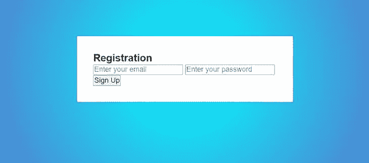
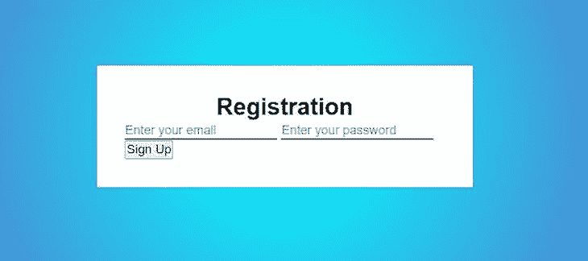
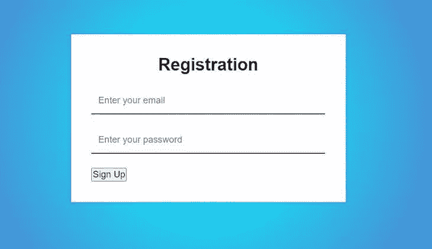
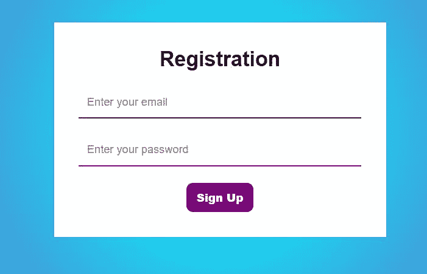
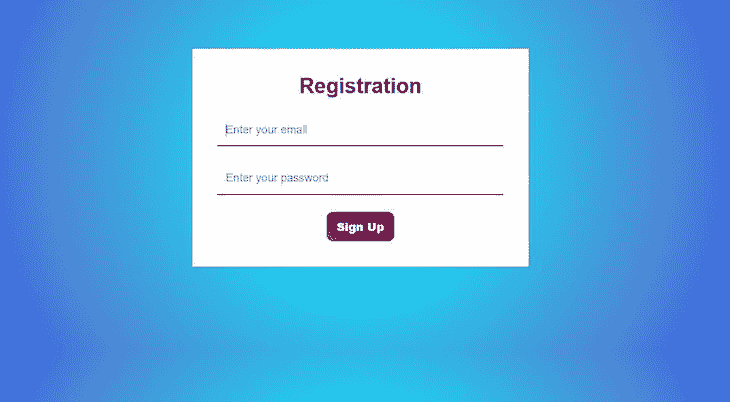

# 仅使用 CSS - LogRocket 博客创建一个闪亮的效果

> 原文：<https://blog.logrocket.com/shine-effect-only-css/>

CSS 被软件工程师、图形设计人员以及 UI 和 UX 专业人员广泛使用，它提供了通过创建独特的、引人注目的视觉效果来定制项目设计的能力。虽然有些视觉效果实现起来相对简单，但其他的[却更加复杂，需要详细的变通方法来获得想要的输出](https://blog.logrocket.com/guide-to-css-animation-for-javascript-developers/)。

在这篇文章中，我们将学习如何只用 CSS 实现一个闪亮的效果。首先，我们将构建一个简单的注册表单，然后将 shine 效果应用于表单上的一个按钮。在本教程结束时，您将能够使用这种方法对应用程序中的任何元素应用类似的发光效果。

### 先决条件

要跟随本教程，您需要以下内容:

*   CSS 和 HTML 的基础知识
*   在你的机器上安装一个文本编辑器，比如 VS Code 或者 Sublime Text

要查看本教程中使用的完整代码，您可以通过 my GitHub 克隆这个项目。我们开始吧！

## 什么是级联样式表？

顾名思义，层叠样式表(CSS)是一种通过以层叠顺序设计 HTML 元素来帮助开发人员向 web 添加可视元素的语言。级联表示样式从上到下发生，这意味着 HTML 元素的最后一个样式效果将覆盖该元素之前的所有效果。

## 用 CSS 设计元素的样式

让我们用下面的 HTML 代码片段来看一个例子:

```
<h1>Hello World!<h1>

```

假设我们想将 HTML 元素的颜色设置为红色。为此，请选择要设置样式的 HTML 元素。您可以通过引用元素的名称、ID 或类来做到这一点。在下面的例子中，我们使用标题名`h1`来引用要样式化的 HTML 元素。

接下来，我们将打开花括号，并包含我们打算应用于所选 HTML 元素的效果。我们唯一关注的是将 HTML 元素的颜色改为红色，所以我们将`red`分配给`color`,如下所示:

```
h1 {
  color: red
}

```

让我们考虑用`firstName`作为惟一的 ID 引用来设计 HTML 元素的样式。通过用`id`引用一个 HTML 元素，我们可以从一个类似容器的表单中的一大组 HTML 元素中选择一个或一小组元素，共同应用效果。

我们可以使用`div`来节省设计单个元素的时间。请记住，`id name`不能以数字开头，应该与其他 HTML 元素不同:

```
<div id = "firstName">

</div>

```

为了选择 HTML 元素，我们将使用`#`散列字符，后跟`id`:

```
#firstName{
    color: blue;
    font: 50%;
    text-align: center;
}

```

我们还可以给上面的 HTML 元素添加额外的样式效果，比如字体大小、文本对齐等等。另一种方法是使用`class`来设置 HTML 元素的样式，如下面的代码片段所示:

```
<div class ="lastName">

</div>

```

要用 CSS 添加一个`class`的样式效果，我们必须使用句点`.`字符，后跟`classname`。在这种情况下，我们的`classname`就是`lastName`:

```
.lastName{
    color: black;
    font: 50%;
}

```

### CSS 分组

或者，我们可以使用 CSS 分组来共同设计 HTML 元素的样式。在将样式应用于每个元素之前，我们将 HTML 元素分组在一起，列出用逗号分隔的每个元素，这样我们可以编写更少的代码:

```
h1, h2, p{
  color: green;
  text-align: center;
  font: 100px;
  border-radius: none;
}

```

### CSS 通用选择器

星号`*`字符选择页面上的所有 HTML 元素，这样 CSS 样式将应用于所有元素:

```
 * { 
color: blue; 
text-align: center;
 } 

```

从上面的例子中，我们观察到 CSS 的作用可以比作画家的工作。让我们将 HTML 元素称为建筑的结构，将 CSS 效果称为建筑上的油漆。本质上，对于前端开发项目或 web 布局，HTML 和 CSS 总是携手并进。

## CSS 样式效果的类型

有三种方法可以给我们的 HTML 元素添加效果。首先，我们可以使用外部 CSS 样式，将 CSS 放在一个单独的文件夹中，然后使用超链接链接 CSS 页面，通常在`<head>`部分。

内联 CSS 样式涉及用独特的样式来样式化单个元素。只需将`style`属性放在您想要样式化的元素前面。内联样式通常出现在 HTML 元素中。内部 CSS 样式类似于内联 CSS 样式，这两个术语通常可以互换使用。通常，内部 CSS 位于`<head>`部分。

回想一下，CSS 是以级联格式设计的，样式是按照这个实现创建的。然而，内联 CSS 提供了一个例外。内联 CSS 样式比其他类型的效果具有最高的优先级，因为它总是覆盖外部或内部 CSS 样式。

## 用 CSS 设计表单样式

在这一节中，我们将设计一个 CSS 表单，然后使用过渡给表单添加一个闪亮的效果。下面的代码显示了一个常规的 HTML 页面，我们将其命名为`index.html`:

```
<!DOCTYPE html>
<html lang="en">
<head>
    <meta charset="UTF-8">
    <meta http-equiv="X-UA-Compatible" content="IE=edge">
    <meta name="viewport" content="width=device-width, initial-scale=1.0">    
    <title>Shine Effect of Pure CSS</title>
    <link rel="stylesheet" href="style.css">
</head>
<body>
    <form>
        <h3>Registration</h3></form>
    </div>
</body>
</html>

```

现在，我们将通过向表单添加`email`和`password`输入类型，在 HTML 页面上创建一个输入表单:

```
<!DOCTYPE html>
<html lang="en">
<head>
    <meta charset="UTF-8">
    <meta http-equiv="X-UA-Compatible" content="IE=edge">
    <meta name="viewport" content="width=device-width, initial-scale=1.0">    
    <title>Shine Effect of Pure CSS</title>
    <link rel="stylesheet" href="style.css">
</head>
<body>
    <form>
        <h3 class="form-head">Registeration</h3>
       <input type="email" placeholder="Enter your email">
       <input type="password" placeholder="Enter your password">
       <div class="button-action">
           <button>Sign Up</button>
       </div>
    </form>

    </div>
</body>
</html>

```

接下来，我们将在文本编辑器中创建第二个文件，并将其命名为`style.css`。在这个文件中，我们将从[谷歌字体](https://fonts.google.com)中导入一种字体。之后，我们将通过在我们的`style.css`文件夹中使用`*`星号来应用我们的通用 CSS 选择器，为我们所有的 HTML 元素提供一个基本样式:

```
@import url('https://fonts.googleapis.com/css2?family=Ubuntu:ital,[email protected],500&display=swap');

*{
    margin: 0%;
    padding: 0%;
    font-family: 'Arial', 'sans-serif';
    box-sizing: border-box;

}

```

接下来，我们将在样式效果中包含一个`:root`伪类选择器，并且我们将如下设置`body`和`form`元素的样式:

```
@import url('https://fonts.googleapis.com/css2?family=Ubuntu:ital,[email protected],500&display=swap');

*{
    margin: 0%;
    padding: 0%;
    font-family: 'Arial', 'sans-serif';
    box-sizing: border-box;

}
:root {
    --first: purple;
}

body{
    background: radial-gradient(circle at center, 
    cyan, rgb(77, 136, 212), blue),100% ;
 display: flex;
     align-items: center;
     justify-content: center;
     height: 70vh;
}

form{
    width: 400px;
    margin: 0 auto;
    padding: 30px;
    box-shadow: 1px, 2px, 3px rgba(50, 50, 50,0.87);
    background-color: white;
}

```

此时，您的表单应该如下图所示:



现在，我们将样式化我们的`form-head`类并给我们的`input`元素添加更多的效果，像`border`和`border-bottom`，如下所示:

```
.form-head{
    font-size: 25px;
    text-align: center;

}
input{
    border: none;
    border-bottom: 2px solid var(--first);
}

```

上面的代码片段产生了下图:



为了总结表单的基本内容，让我们给`input`元素添加一些附加属性:

```
input{
    border: none;
    border-bottom: 2px solid var(--first);
    padding: 10px;
    outline: none;
    display: block;
    width: 100%;
    margin: 20px auto;
}

```

现在，我们的表单将如下图所示:



## 给我们的表单按钮添加一个闪亮的效果

现在，我们将为注册元素`button`添加一个闪耀效果。我们将从改变按钮的位置到表单的中心开始，然后我们将添加`hover`、`linear-gradient`和`transition`效果:

```
.button-action{
    text-align: center;
}
button{
    border-radius: 8px;
    border: none;
    padding: 8px 12px;
    color: whitesmoke;
    background-color: purple;
    font-weight: 800;
    cursor: pointer;
    outline: none;
}

```

使用上面的代码片段，我们可以用某些属性定制我们的按钮，比如`color`、`font-weight`、`padding`和`border-radius`。您可以在下图中看到结果:



最后，我们将为我们的`Sign Up`按钮添加一个闪光效果，如下面的代码片段所示:

```
.button-action{
    text-align: center;
}
button{
    border-radius: 8px;
    border: none;
    padding: 8px 12px;
    color: whitesmoke;
    background-color: purple;
    font-weight: 800;
    cursor: pointer;
    outline: none;
    background-repeat: no-repeat;
    background-position: -120px -120px, 0 0;
    background: linear-gradient(45deg, yellow, purple, red, blue);
    background-size: 250% 250%, 100% 100%;

    transition: background-position 1s ease;
}

    button:hover{
        background:linear-gradient(35deg, brown, pink, green);
        background-position: 0 0;
        transition: 0.5s;
    }

```

我将`linear-gradient`作为`button`的`background`属性的一个额外特性，混合了所选的默认颜色，黄色、紫色、红色和蓝色。我表示我希望这些颜色沿着一个`45deg`角成对角线。

其次，我添加了一个`transition`属性，它将决定用户执行一个动作后所选颜色显示的快慢。我选择了`1s`作为颜色过渡的`ease`时间。

然后，我添加了一个`button:hover` effect 属性，它的作用就像一个事件监听器，我们将在其中加入颜色来创建一个闪亮的效果。现在，每当按钮被悬停或点击时，选定的颜色将沿着一个`35deg`角度变成棕色、粉色和绿色的混合。过渡时间设置为`0.5`秒，这是在按钮上应用效果之前的持续时间。`background-position`保持不变，因为我们将`0%`分配到左右两个位置:



你也可以在 YouTube 上查看效果。

## 结论

在本文中，我们介绍了如何仅使用 CSS 为 HTML 元素添加视觉效果。首先，我们介绍了 CSS 的一些重要背景信息。然后，我们构建了一个简单的注册表单，最后，我们为表单上的一个按钮添加了一个闪亮效果。

您可以按照本教程中概述的步骤给任何类型的项目或网页添加类似的效果。在你的应用程序中添加引人注目的视觉效果可以帮助吸引用户或将他们的注意力引向你希望他们去的地方。

我希望你喜欢这篇文章，如果你有任何问题，请务必留下评论。编码快乐！

## 你的前端是否占用了用户的 CPU？

随着 web 前端变得越来越复杂，资源贪婪的特性对浏览器的要求越来越高。如果您对监控和跟踪生产环境中所有用户的客户端 CPU 使用、内存使用等感兴趣，

[try LogRocket](https://lp.logrocket.com/blg/css-signup)

.

[](https://lp.logrocket.com/blg/css-signup)[https://logrocket.com/signup/](https://lp.logrocket.com/blg/css-signup)

LogRocket 就像是网络和移动应用的 DVR，记录你的网络应用或网站上发生的一切。您可以汇总和报告关键的前端性能指标，重放用户会话和应用程序状态，记录网络请求，并自动显示所有错误，而不是猜测问题发生的原因。

现代化您调试 web 和移动应用的方式— [开始免费监控](https://lp.logrocket.com/blg/css-signup)。