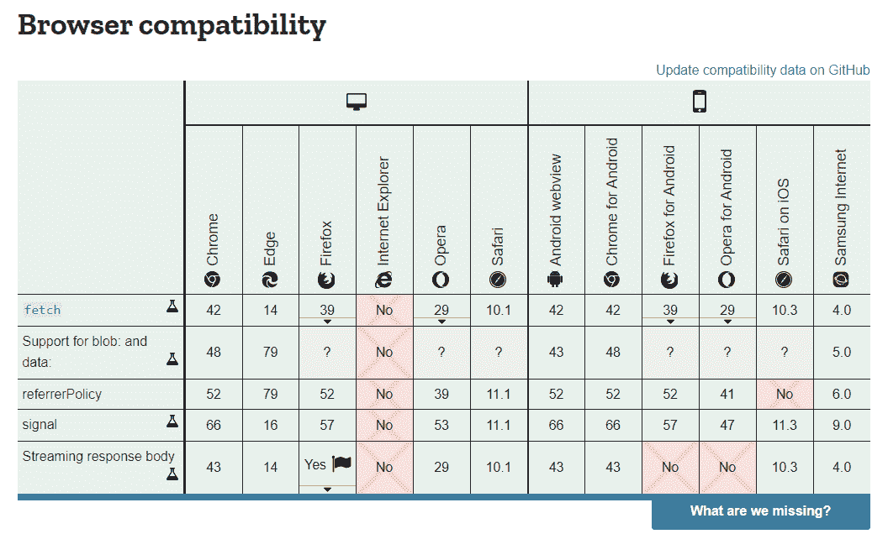

# 你应该支持 ie 浏览器吗？- LogRocket 博客

> 原文：<https://blog.logrocket.com/should-you-support-internet-explorer/>

**简短回答:不，不应该。**

非常不受欢迎的 Internet Explorer 有许多缺点。在这篇文章中，我们将讨论其中的一些。

虽然 Internet Explorer 普遍不受欢迎，但它仍然默认安装在我们今天使用的最新 Windows 10 计算机中。虽然对于一些人来说，它的目的是安装 Firefox、Chrome 或任何其他浏览器，但对于其他人来说，它默认安装在[网吧](https://en.wikipedia.org/wiki/Internet_caf%C3%A9)中，这通常会迫使用户使用它进行浏览。

到今天为止， [IE 已经很不受欢迎了](https://canistop.net/b/ie/11)许多大网站，包括 YouTube、GitHub、CodePen 和 Apple，都不再支持它了。具有讽刺意味的是，教导开发人员如何可视化支持 IE 的 CSS Tricks 正在远离对浏览器的支持。

有太多的理由跟随这一趋势并放弃 IE，从支持不足到技术不一致。

## 历史

让我们回到 1995 年，当时微软将 IE 投入生产。很难在网络浏览器中找到竞争对手(除了 Netscape Navigator)。后来，微软开始在每个版本的 Windows 操作系统中包含 IE 的免费版本。这使得 IE 变得不可或缺。它变得如此重要，以至于我们经常会看到弹出窗口、烤面包机和对话框声称“这只在 Internet Explorer 上有效”。现在不可想象了吧？

然而，这一切都在几年后结束了，因为微软未能提供保持 IE 相关性所需的所有改进。相反，随着更新的突然出现，越来越多奇怪的事情被添加到网络浏览器中。用户和开发者并不欣赏这一点，因为网络增加了可访问性和功能，而浏览器使这种能力难以驾驭。

微软试图跟进，甚至在 Windows 手机上推出了 Pocket Internet Explorer 和 IE Mobile，这受到了极大的批评，因为与其他现有浏览器相比，实现基本功能非常困难。

首先，我们需要考虑到，自 2016 年以来，IE 一直是一个死浏览器。微软决定在 2015 年发布 [Edge 作为其替代品](https://web.archive.org/web/20160716113141/https://developer.microsoft.com/en-us/microsoft-edge/platform/faq/)。Edge 对 IE 来说是一个巨大的进步，尽管那时它仍然依赖于微软的专有引擎 [EdgeHTML](https://www.notion.so/dylantientcheu/Should-you-support-internet-explorer-97c307961552497296bd7906379fd39c) 。后来，它在 2019 年被重建为基于 Chromium 的浏览器。

然而，随着谷歌 Chrome(2008)、Firefox(2002)和 Safari(2003)等更易访问的浏览器的突破，IE 开始失去牵引力。这些较新的浏览器由于其更好的功能、用户界面、可访问性和浏览速度，推动了其他地方的市场(远离 IE)。今天，Internet Explorer 的使用率为[~ 1.8%](https://gs.statcounter.com/browser-market-share#monthly-201906-202006-bar)——这一点也不奇怪。其原因如下。

## 放弃 Internet Explorer 的原因

作为人类，我们热爱一切向前发展的事物。此外，它大大有助于减缓这种向前运动。这些是停止使用/支持 IE 的一堆理由。

### 缺失功能

Browser compatibility table from MDN for the Fetch API.

#### Java Script 语言

我们在 2020 年。JavaScript 是现存的最常用和最受欢迎的编程语言之一。随着 ES6 特性的发布，这种受欢迎程度越来越高——JS 中加入了大量可爱的函数式语法。不幸的是，IE 不支持这些。我们不能责怪微软，因为他们提供了 Edge 作为更现代的替代品。今天，不利用 JavaScript 的力量来构建一个伟大的网站是非常困难的，即使对于 HTML/CSS 极端开发者来说也是如此。

#### HTML 和 CSS

什么都缺一点点。我们开发人员经常制作很棒的网站，在 ie 浏览器上很快就变得“好看”了。要详细说明这种缺乏支持的情况，请尝试以下练习:

*   参观[https://caniuse.com/](https://caniuse.com/)
*   点击任何最近的功能
*   看看表头为 IE 的表格第一列，下面看到的是什么？红色(或橙色)

这项工作表明，IE 不仅无法跟上新标准，而且还迫使我们的开发者付出巨大的努力，却得不到什么回报。

#### 浏览器 API

有些人可能会说 web APIs 可以在 IE 上使用 Polyfills 来支持。这是事实，但是存在许多不能聚合填充的 API。因此，它们在 IE 上不受支持。这里有一个 API 列表，并在浏览器之间进行了比较。

**开发工具:**IE 很难得到支持，其提供的工具也帮不上什么忙。IE 附带的 F12 开发者工具包括一些已知的标签，如控制台、DOM inspector、网络和性能，与其他浏览器相比，它们感觉非常缓慢。

### 表演

我们不需要基准测试结果就知道 IE 无法与当前的性能标准竞争。如前所述，IE 不支持最新版本的 JavaScript。这就需要将 JavaScript 转换到旧版本，或者使用 polyfills 来支持某些特性。这些添加会使网站膨胀，并可能导致严重的性能问题。

### 安全问题

自 2016 年以来，IE 一直存在重大安全问题。这些安全问题一直困扰着用户。使用 IE 甚至被认为是一种安全威胁。这变得更糟，因为 IE 可能需要一些时间来接收安全更新。

### 缺乏更新

IE 10 被认为是死的， [IE 11 的延长支持到 2025 年 10 月结束](https://hub.packtpub.com/microsoft-announces-internet-explorer-10-will-reach-end-of-life-by-january-2020/#:~:text=One%20of%20the%20users%20said,ends%20on%20October%2014%2C%202025)。然而，更新的速度非常慢。当这些更新到来时，它们将与安全性相关，而不是新功能。微软在 Edge 上下了更大的赌注，它能够与大多数现代浏览器竞争。

### 被微软抛弃

你为什么要使用一个被它的创造者抛弃的工具？

微软强烈建议用户转向 Edge，这是一个更好、更快、更现代的选择。该公司在 2015 年秋季宣布，“所有最新的功能和更新将只在 Edge 中提供。”

微软首席项目经理克里斯·杰克逊写了一篇关于使用 IE 浏览器的危险的帖子，并说人们已经向前看了。事实是 IE 很难抛弃。许多设备仍然附带 IE11，IE 仍然被默认用于在 Windows 上运行某些文件类型和协议。

### 巨大的劳动力/成本

#### 机会限制

自从 2015 年微软贬低 IE 以来，现代 web 中涌现出了大量的功能。这些功能使网络更快、更易访问。其中许多提出了建立网站的有效方法——这些方法[在 IE 中](https://caniuse.com/#compare=ie+11,chrome+83)都无法工作。

最常见的情况是，由于缺乏 IE 的支持，我们作为开发人员，倾向于在使用之前通过检查导航器中是否存在 API 来强制向后兼容。这导致了极大的低效率，并驱使公司在不支持的浏览器上为用户创造不同的体验。

想象一下，用 MobX 或 Vue3 等浏览器依赖的代理来编写一个完整的框架或库，并遵循大部分新的 JS 特性。他们将被迫保持向后兼容的版本，这将能够处理旧的浏览器。

#### 大公司抛弃了它，你为什么不应该呢？

不，你没有义务跟随大鱼。然而，如果你仍然出于自愿支持 IE(而不是因为商业约束)，那么你必须尽一切努力让 0.2%的用户满意。

[甚至 Gmail 在 IE11 上也无法正常工作](https://support.google.com/mail/forum/AAAAK7un8RU2Kf-LgmiV8Q/)。你会用别的东西来看你的邮件

这些大型科技公司从 IE 中分离出来的事实，应该会让这个领域偏向于跟随它们的决定。以下是一些选择进步而不是 IE 兼容性的公司:

*   开发到
*   开源代码库
*   堆栈溢出
*   Zendesk
*   亚特兰蒂斯人
*   油管（国外视频网站）
*   Meetup
*   松弛的
*   特雷罗
*   不调和
*   Spotify
*   美国 Yahoo 公司(提供互联网的信息检索服务)

## 结论

下一步是什么？

除了网络浏览器之外的任何东西。

我们作为用户和创造者不应该支持低效率。我们制造工具来使我们的生活更容易。到目前为止，[网络进展顺利](https://makeawebsitehub.com/internet-stats/)，这种崛起不应该受到限制，因为有义务支持与无法跟上步伐的浏览器的向后兼容。

## 通过理解上下文，更容易地调试 JavaScript 错误

调试代码总是一项单调乏味的任务。但是你越了解自己的错误，就越容易改正。

LogRocket 让你以新的独特的方式理解这些错误。我们的前端监控解决方案跟踪用户与您的 JavaScript 前端的互动，让您能够准确找出导致错误的用户行为。

LogRocket 记录控制台日志、页面加载时间、堆栈跟踪、慢速网络请求/响应(带有标题+正文)、浏览器元数据和自定义日志。理解您的 JavaScript 代码的影响从来没有这么简单过！

[Try it for free](https://lp.logrocket.com/blg/javascript-signup)

.