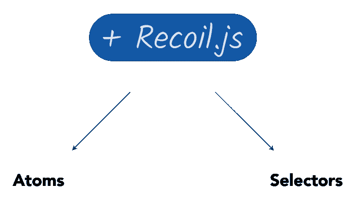

# 介绍反冲:React - LogRocket 博客的简化状态管理

> 原文：<https://blog.logrocket.com/simple-state-management-react-recoil/>

反冲似乎是国家管理街区的新生事物，这个街区被许多人认为过于拥挤。Redux、MobX、Context……不胜枚举。

在继续讨论反冲之前，我想指出这个新的状态管理库不是 React 的“官方”状态管理库。

虽然反冲可能是由脸书团队的工程师建造(并释放)，但它并不代表国家管理的官方图书馆。然而，正如 Redux 不是 React 的官方状态管理库一样，如果反冲证明对社区和整个 React 生态系统有价值，它很可能会被许多人采用。

## 反冲解决的主要问题

虽然它有自己的特色，但反冲解决的问题与大多数其他状态管理库一样:全局状态管理。

我没有多年的后坐力经验——见鬼，没有人有！然而，在它发布后，我很好奇想尝试一下。我阅读文件，每一页，我在一个小项目上摆弄它。以下是我认为反冲闪耀的领域。

#### 1.感觉就像 React

没有多少状态管理库可以夸耀自己在与 React 相同的心智模型中工作。例如，Redux 和 MobX 引入了它们自己特定的术语和原则。

不过反冲感觉像是用了 React 的`useState`的全球版。它还支持并发模式，这是一个巨大的优势(在撰写本文时，这仍在工作中)。

#### 2.没什么可学的

[我爱 Redux](https://thereduxjsbooks.com/) 。我还认为 modern Redux 没有我们曾经讨厌的所有样板文件。然而，与 Redux 相比，你仍然需要学习更多的反冲。有了后坐力，真的没什么可学的了。这本身就是强大的。

#### 3.简单

我毫不怀疑，无论你用反冲构建什么样的应用，你都可以用 Redux 或 MobX(或其他许多库)构建得一样好。然而，反冲的简单是难以击败的。

#### 4.应用范围内的观察

类似于它的对手，反冲处理应用程序范围的状态观察很好。然而，目前这种工具还远远达不到像 Redux 这样更成熟的库所能提供的水平。毫无疑问，要赶上来还需要一些时间。

## 反冲核心概念



反冲的两个最重要的概念是原子和选择器。这些是状态片段和基于状态计算的值的花哨术语。

如果你现在没有得到这个，不要担心；我将在下一节进一步解释。然而，重要的是要注意我们是如何将这个库剥离为两个核心原则的——简单！

## 编写您的第一个反冲应用程序

让我们建立一个最简单的反冲应用程序:一个简单的计数器。

没有后坐力，下面是一个简单的计数器的样子:

```
import React, { useState } from "react";

export const Counter = () => {
  const [count, setCount] = useState(0);
  return (
    <div>
      <h1>{count}</h1>
      <button onClick={() => setCount(c => c + 1)}>Increase count</button>
    </div>
  );
}
```

我们通过`useState`和一个调用状态更新器`setCount`来增加状态变量`count`的按钮来实现本地状态。

这里做了两件事:

1.  声明新的状态变量
2.  更新状态变量。

让我们用后座力做这些。唯一的区别是状态对整个应用程序是全局的，而不是对单个组件。下面是要采取的步骤。

### 1.将根组件包在`RecoilRoot`中

让这个基本示例与反冲一起工作的第一步是将您的应用程序根组件包装在`RecoilRoot`中。

```
// before now, Counter would be rendered as follows
ReactDOM.render( <Counter />, document.getElementById("root"))

// now 
import { RecoilRoot } from "recoil";

ReactDOM.render( 
 <RecoilRoot>
    <Counter />
 </RecoilRoot>, document.getElementById("root"))
```

`RecoilRoot`为您想要使用共享全局状态的整个组件树充当全局上下文提供者。对于更高级的读者来说，如果你看看反冲内部的[返回语句](https://github.com/facebookexperimental/Recoil/blob/805615b7fb01f320c5b264cc15af2caf535ce9d7/src/components/Recoil_RecoilRoot.react.js#L244)，这是非常明显的。

### 2.创建全局状态值

创建全局状态值的过程很简单。反冲称这些原子。

假设你有一个这样的状态对象:

```
{
    key1: complexStateDataStructure, 
    key2: [id1, id2, id3],
    key3: complexStateDataStructure
}
```

在这个例子中，每个状态对象键可以被称为一个原子。原子代表一种状态，即`key1`、`key2`、`key3`。

让我们创建一个原子来保存`count`状态变量。

```
// Note the import 👇
import { atom } from "recoil";

// creating the state value
const count = atom({
  key: "count",
  default: 0
});
```

首先我们从`recoil`导入`atom`，然后用一个键和默认值调用这个方法。

* * *

### 更多来自 LogRocket 的精彩文章:

* * *

可以理解的是，`key`对于每个全局状态变量必须是唯一的。`default`键也代表变量的默认值。

### 3.消耗全局状态变量

创建状态变量后，我们现在可以按如下方式检索值:

```
// Note the import below
import { useRecoilState } from 'recoil' 

export const Counter = () => {
  // before 👇 
  //  const [count, setCount] = useState(0);
  // now 👇
   const [countState, setCount] = useRecoilState(count);;
  ...
}
```

主要变化见上图。现在应该使用反冲钩子`useRecoilState`来检索全局状态值，而不是使用`useState`。

注意，传递给`useRecoilState`的值指的是创建原子的返回值。

```
import { atom } from "recoil";

// count here is passed to useRecoilState
const count = atom({
  key: "count",
  default: 0
});
```

这很重要。`useRecoilState`必须被传递一个`RecoilState`对象。这是调用`atom`函数的结果，类似于将一个上下文对象传递给`useContext`钩子。

将所有这些放在一起，你就有了你的第一个反冲应用。


这并不令人印象深刻，但它解释了后坐力的基本原理。

所以让我们做得更多。

> **注意**:全局状态变量`count`，现在可以通过调用`useRecoilState`钩子在应用程序树的不同组件中使用。

那么，你还记得后坐力的核心概念吗？

虽然反冲显然有比建造一个计数器更高级的用例，但它的核心在于简单。如前所述，有两个核心概念:原子和选择器。已经向您介绍了第一个，下面是第二个的工作方式。

## 选择器

如果您曾经使用过像 Redux 或 MobX 这样的旧状态管理库，那么选择器的概念对您来说应该并不陌生。作为补充，选择器是从应用程序状态获取计算值的有效方式。

换句话说，如果一个值可以从 state 中计算出来，就不要在单独的 state 键中重新初始化它；使用选择器。查看下面的 CodeSandbox。

在本例中，我们在计数器下方显示文本**为偶数计数**。为了正确工作，我们需要知道状态`count`值是否是偶数。代替初始化另一个状态值，我们可以从先前的`count`值计算这个值。

方法如下:

```
import {selector} from 'recoil'

const isEvenCount = selector({
  key: "evenCount",
  get: ({ get }) => {
    const state = get(count);
    return state % 2 === 0;
  }
});
```

这看起来很混乱，但是很简单。让我带你走一遍。

在上面的代码块中，我计算了一个叫做`isEvenCount`的新值。这是从`recoil`调用`selector`函数的结果。用一个对象调用`selector`。和原子一样，物体也有`key`属性。`key`必须是唯一的字符串；它不应该与任何以前的原子/选择器键相同。

有趣的是`get`属性。这是一个由来自`recoil`的内部`get`函数调用的方法。使用这个`get`函数，您可以检索任何状态值，如下所示:

```
const state = get(count);
```

在 return 语句中，我们然后将`isEvenCount`值计算为`get(count) % 2 == 0`，这基本上是说，“计数状态变量能被 2 整除吗？”

## 使用选择器值

计算完`isEvenCount`值后，在组件中使用它类似于使用 atom 的返回值，但是使用了不同的钩子，如下所示:

```
export const Counter = () => {
   const [countState, setCount] = useRecoilState(count);
   // see this 👇
   const value = useRecoilValue(isEvenCount);

  ...
}
```

要了解更多内容，下面是完整的代码:

```
import {selector, useRecoilState} from 'recoil' 

const isEvenCount = selector({
  key: "evenCount",
  get: ({ get }) => {
    const state = get(count);
    return state % 2 === 0;
  }
});

export const Counter = () => {
   const [countState, setCount] = useRecoilState(count);
   // see this 👇
   const value = useRecoilValue(isEvenCount);

  ...
}
```

要获取组件中的值，可以使用`useRecoilValue`钩子，如上所示。

值得一提的是，调用`selector`的返回值是一个期望传递给钩子`useRecoilValue`的对象。只有这样，你才能获得你所追求的实际价值。

除了获取值之外，这还创建了对状态的订阅，也就是说，每当选择器所依赖的状态值发生变化时，都会重新计算一个新值。在我们的例子中，每次`count`改变时，都会重新计算`isEvenCount`的新值。

## 结论和下一步

虽然很年轻，反冲看起来很有前途！作为一个入门指南，我只是触及了可能的表面。

观看这个空间的更多反冲相关的文章。我会在这方面做更多的写作和研究。另外，现在是你观看官方发布视频的好时机。如果你想深入了解后坐力，我建议你花点时间看看。

干杯！

## [LogRocket](https://lp.logrocket.com/blg/react-signup-general) :全面了解您的生产 React 应用

调试 React 应用程序可能很困难，尤其是当用户遇到难以重现的问题时。如果您对监视和跟踪 Redux 状态、自动显示 JavaScript 错误以及跟踪缓慢的网络请求和组件加载时间感兴趣，

[try LogRocket](https://lp.logrocket.com/blg/react-signup-general)

.

[ ](https://lp.logrocket.com/blg/react-signup-general) [](https://lp.logrocket.com/blg/react-signup-general) 

LogRocket 结合了会话回放、产品分析和错误跟踪，使软件团队能够创建理想的 web 和移动产品体验。这对你来说意味着什么？

LogRocket 不是猜测错误发生的原因，也不是要求用户提供截图和日志转储，而是让您回放问题，就像它们发生在您自己的浏览器中一样，以快速了解哪里出错了。

不再有嘈杂的警报。智能错误跟踪允许您对问题进行分类，然后从中学习。获得有影响的用户问题的通知，而不是误报。警报越少，有用的信号越多。

LogRocket Redux 中间件包为您的用户会话增加了一层额外的可见性。LogRocket 记录 Redux 存储中的所有操作和状态。

现代化您调试 React 应用的方式— [开始免费监控](https://lp.logrocket.com/blg/react-signup-general)。