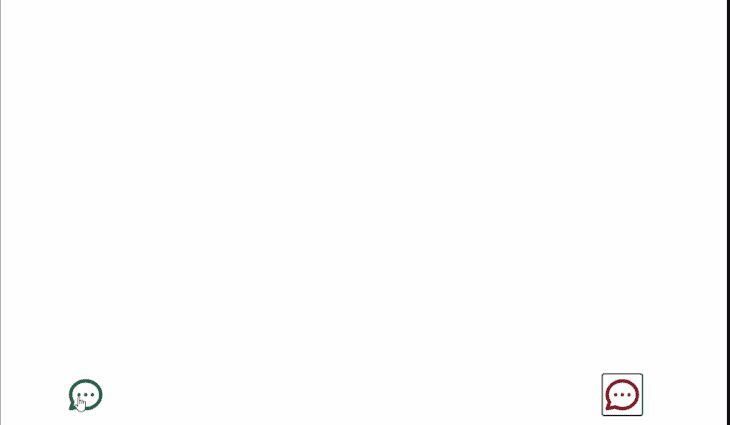
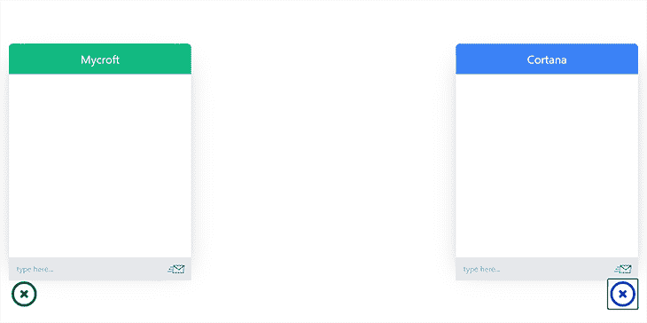

# 使用 Hookstate 简化 React 状态管理

> 原文：<https://blog.logrocket.com/simplify-react-state-management-with-hookstate/>

如果您已经使用 React 构建了一个 web 应用程序，那么您很可能在状态管理方面遇到了重大挑战。长期以来，我们依赖 Redux 进行状态管理，但由于其复杂性和过多的代码量，我们最终转向了其他解决方案，如 RxJS/React Hooks 和 React Context API。我们还看到 Redux Toolkit 解决了 Redux 样板问题——我可以说它是我刚刚提到的所有工具中最简单的。

然后是 React 的`useState`钩子，用于本地状态管理。如果您以前使用过它，那么您可能想知道为什么全局状态管理不能如此简单。为什么我们仍然需要这么多样板文件来用上下文 API 管理状态？如果我们想被像 Redux Toolkit 这样固执己见的工具所约束，或者被迫在我们的 React 应用程序中使用 actions 和 reducers，那该怎么办？

这就是 Hookstate 的用武之地。Hookstate 不仅仅是另一个状态管理解决方案。除了功能丰富、快速和灵活之外，该库还将 React 应用程序中的状态管理简化到了一个全新的水平。

Hookstate 的工作方式几乎和 React `useState`钩子完全一样。事实上，使用 Hookstate，创建一个全局状态就像使用`useState`钩子创建一个局部状态一样简单。除了简单之外，Hookstate 还用其他有用的特性扩展了我们创建的状态实例。

在本文中，我们将通过构建一个演示聊天应用程序来介绍 Hookstate，它是 React 应用程序的一个简单高效的状态管理解决方案。阅读本文的唯一先决条件是 React 知识。

## Hookstate 及其功能

顾名思义， [Hookstate](https://hookstate.js.org/) 是一个基于 React 状态钩子的快速灵活的状态管理工具。它是一个小型的库，包含了全局和本地状态，以及部分状态更新和异步加载的状态。

本文的重点是`@hookstate/core`包，但是 Hookstate 有[几个可选的插件](https://hookstate.js.org/docs/extensions-overview/),使我们能够扩展或定制我们的状态钩子——并且这个库的文档写得很好，有很好的演示。以下是一些值得注意的插件:

*   使我们能够将我们的状态保存到浏览器的本地存储中，这对于离线应用程序或者如果您希望用户在重新加载页面后保留他们的状态数据是非常有用的
*   `[@hookstate/validation](https://hookstate.js.org/docs/extensions-validation)`对表单域非常有用，因为它支持状态的验证和错误/警告消息
*   如果你想在不同的浏览器标签上同步你的状态，这是一个非常有用的工具

让我们探索一下 Hookstate 中的一些核心特性，这些特性使它成为 React 应用程序中状态管理的一个好选择。我们将通过构建一个聊天应用程序来实现这一点。在文章的最后，我们的应用应该是这样的:



我们的聊天应用程序将有两个组件，它们将能够通过发送和接收来自我们全球 Hookstate 商店的数据来相互交互。

## 用 React 和 Hookstate 构建我们的应用

让我们从使用`create-react-app`包生成一个新的 React 应用程序开始。我们将在终端中运行以下命令:

```
npx create-react-app hookstate-chat

```

接下来，我们将`cd`进入新的`hookstate-chat`目录并安装 Hookstate:

```
cd hookstate-chat
npm install --save @hookstate/core

```

### 设置我们的聊天框组件

现在我们已经安装了 Hookstate，让我们安装`[react-custom-chat](https://www.npmjs.com/package/react-custom-chat)`。我为本文创建了这个 npm 包，以便我们可以专注于 Hookstate，而不必为我们的聊天应用程序的设计而费心，但是如果您愿意，您可以使用或构建另一个:

```
npm install --save react-custom-chat

```

安装了`react-custom-chat`之后，让我们转到`./src`目录，为我们的第一个聊天组件创建一个 JSX 文件。我们将把它命名为`FirstPerson`。

接下来，我们将以下代码添加到我们的`./src/FirstPerson.jsx`文件中:

```
import ChatBox from 'react-custom-chat'

const FirstPerson = () => {
  return (
    <ChatBox
      messageList={[]}
      onSendMessage={newMessage => {}} // do something with newMessage
      settings={{
        position: 'left',
        navColor: 'green',
        navText: 'Mycroft'
      }}
    />
  )
}

export default FirstPerson

```

在我们的`FirstPerson`组件中，我们从从`react-custom-chat`包导入`ChatBox`开始。`ChatBox`组件有一个`messageList`属性，它将包含我们的消息对象数组。每个[消息对象](https://github.com/ebenezerdon/react-custom-chat/blob/main/README.md#message-object)将包含:

*   类型为`string`的`text`属性，表示消息文本
*   类型为`string`的`person`属性，可以是“主要”或“次要”

`person`属性帮助`ChatBox`组件确定如何设计每条消息的样式。

这个`onSendMessage` prop 希望有一个函数告诉它每当有消息发送时该做什么。

最后，我们添加了一个`settings`道具来定义我们的聊天框的外观。在这种情况下，我们希望第一人称聊天框位于页面的左侧。

让我们为第二个人聊天框做同样的事情。我们将在我们的`./src`目录中创建一个名为`SecondPerson`的 JSX 文件，并将以下代码粘贴到其中:

```
import ChatBox from 'react-custom-chat'

const SecondPerson = () => {
  return (
    <ChatBox
      messageList={[]}
      onSendMessage={() => {}}
      settings={{
        position: 'right',
        navColor: 'blue',
        navText: 'Cortana'
      }}
    />
  )
}

export default SecondPerson

```

请注意我们是如何更改第二个人聊天框的位置、导航颜色和文本的。您可以在 [`react-custom-chat`文档](https://github.com/ebenezerdon/react-custom-chat#readme)中找到`ChatBox`组件的其他自定义设置。

### 使用我们的聊天组件

随着聊天组件的成功创建，我们现在可以导入它们并在我们的`./src/App.js`文件中使用它们。让我们用下面的代码替换当前的代码:

```
import FirstPerson from './FirstPerson'
import SecondPerson from './SecondPerson'

const App = () => {
  return (
    <>
      <FirstPerson />
      <SecondPerson />
    </>
  );
}

export default App

```

我们可以通过在终端上运行`npm start`来启动我们的应用程序。当我们在浏览器中打开我们的应用程序时，我们应该会看到如下所示的页面:


点击聊天图标将打开我们的聊天窗口:



### 用 Hookstate 创建我们的全球商店

现在，我们已经成功地创建了聊天组件，让我们使用 Hookstate 来设置和管理应用程序的消息功能。我们将从在`./src`目录中创建一个名为`store.js`的新 JavaScript 文件开始，这个文件将存放我们的应用程序的全局状态。

Hookstate 对创建全局状态的位置没有任何限制，只要任何需要它的组件能够成功导入它。

在我们的`./src/store.js`文件中，我们将使用来自 Hookstate 的`createState`方法来创建我们的状态:

```
import { createState } from '@hookstate/core'

const store = createState({
  firstPersonMessageList: [],
  secondPersonMessageList: []
})

export default store

```

或者，我们可以分别创建我们的`FirstPerson`和`SecondPerson`状态:

```
...
const firstPersonMessageList = createState([])
const secondPersonMessageList = createState([])
...
```

对于我们的应用程序来说，这两种选择都很好，因为 Hookstate 使我们能够创建任意多的状态，并且还为我们提供了轻松更新嵌套状态属性的能力。出于本教程的目的，我们将采用第一种方法。

我们还为`createState`方法提供了包含属性`firstPersonMessageList`和`secondPersonMessageList`的初始对象状态。

随着我们的状态成功创建，我们可以继续从 Hookstate 用`useState`钩子访问它。因为它是一个 React 钩子，我们需要在 React 组件内部调用它。我们从`useState`钩子返回的状态将有:

*   一个我们可以用来获取状态数据的方法
*   为我们的状态设置一个新值的方法
*   向我们的状态添加数据的方法

还有像`attach()`和`batch()`这样的[其他方法](https://hookstate.js.org/docs/typedoc-hookstate-core/#interface-statemethods-s)，但是我们的演示应用程序不需要它们。

### 访问和更新我们的全球商店

让我们看看如何从单个组件访问和更新我们的商店。我们将转到`./src/FirstPerson.jsx`文件并从 Hookstate 导入`useState`钩子。我们还将从`store.js`文件中导入我们的商店:

```
import { useState } from '@hookstate/core'
import store from './store'
...

```

我们现在可以使用`useState`挂钩来访问我们的商店。因为`useState`是一个 React 钩子，我们需要在我们的`FirstPerson`组件的主体内部使用它。让我们创建一个名为`globalState`的变量，并用我们导入的商店作为它的值来调用`useState`钩子。

```
...
const FirstPerson = () => {
  const globalState = useState(store)
  ...
}

export default FirstPerson

```

`globalState`变量应该包含我们提供给商店的初始状态。当使用`useState`钩子访问我们的商店时，我们也可以直接析构`firstPersonMessageList`和`secondPersonMessageList`属性。让我们将我们的`globalState`变量声明改为下面的代码行:

```
const { firstPersonMessageList, secondPersonMessageList } = useState(store)

```

现在，我们可以使用`firstPersonMessageList`和`secondPersonMessageList`作为单独的状态。

这是一个强大的 Hookstate 优势，因为我们的嵌套属性也有我们的`globalState`变量会有的状态方法。我们现在可以在我们的析构属性中同样使用`get()`、`set()`和`merge()`方法。

### 处理用户`sendMessage`事件

接下来，让我们创建处理用户`sendMessage`事件的函数。我们将其命名为`handleSendMessage`:

```
...
const handleSendMessage = newMessage => {
  firstPersonMessageList.merge([{text: newMessage, person: 'primary'}])
  secondPersonMessageList.merge([{text: newMessage, person: 'secondary'}])
}

```

在上面的块中，我们创建了一个名为`handleSendMessage`的函数，并为它提供了一个名为`newMessage`的参数。我们的`newMessage`参数代表我们的用户在聊天输入字段中输入的任何内容。对于我们添加到`firstPersonMessageList`的每一个新的主要消息，我们也对`secondPersonMessageList`做了相应的次要添加。当我们到达`SecondPerson`组件时，我们将进行相反的操作。

注意用`merge()`方法更新我们的状态是多么容易。如果我们使用的是`set()`方法或者 React 内置的`useState`钩子，我们的函数看起来会像这样:

```
const handleSendMessage = newMessage => {
  firstPersonMessageList.set([...firstPersonMessageList, {text: newMessage, person: 'primary'}])
  secondPersonMessageList.merge([...secondPersonMessageList, {text: newMessage, person: 'secondary'}])
}

```

我们的第二个函数看起来肯定比第一个更复杂。使用`merge()`方法，如果当前状态值和参数都是数组，那么 Hookstate 会将当前值和参数值连接起来，并将其设置为状态。您可以在 [Hookstate 文档](https://hookstate.js.org/docs/typedoc-hookstate-core/#merge)中看到使用`merge()`方法的其他方式。

只是为了美观，让我们将`secondPersonMessageList`状态更新延迟 500 毫秒:

```
...
const handleSendMessage = newMessage => {
  firstPersonMessageList.merge([{text: newMessage, person: 'primary'}])
  setTimeout(() => {
    secondPersonMessageList.merge([{text: newMessage, person: 'secondary'}])
  }, 500)
}
...

```

我们现在可以提供`handleSendMessage`函数作为我们的`ChatBox` `onSendMessage`属性值。我们还将使用来自我们的`firstPersonMessageList`的`get()`方法来访问我们的状态，然后使用它作为我们的`ChatBox` `messageList`属性的值:

```
...
<ChatBox
  messageList={firstPersonMessageList.get()}
  onSendMessage={handleSendMessage}
  settings={{
    position: 'left',
    navColor: 'green',
    navText: 'Mycroft',
    isOpen: true
  }}
/>
...

```

我们的`FirstPerson.jsx`文件现在应该是这样的:

```
import { useState } from '@hookstate/core'
import ChatBox from 'react-custom-chat'
import store from './store'

const FirstPerson = () => {
  const { firstPersonMessageList, secondPersonMessageList } = useState(store)

  const handleSendMessage = newMessage => {
    firstPersonMessageList.merge([{text: newMessage, person: 'primary'}])
    setTimeout(() => {
      secondPersonMessageList.merge([{text: newMessage, person: 'secondary'}])
    }, 500)
  }

  return (
    <ChatBox
      messageList={firstPersonMessageList.get()}
      onSendMessage={handleSendMessage}
      settings={{
        position: 'left',
        navColor: 'green',
        navText: 'Mycroft'
      }}
    />
  )
}

export default FirstPerson

```

让我们在`SecondPerson.jsx`文件中做同样的事情。由于我们已经详细解释了这些步骤，我们可以继续将以下代码粘贴到我们的文件中:

```
import { useState } from '@hookstate/core'
import ChatBox from 'react-custom-chat'
import store from './store'

const SecondPerson = () => {
  const { firstPersonMessageList, secondPersonMessageList } = useState(store)

  const handleSendMessage = newMessage => {
    secondPersonMessageList.merge([{text: newMessage, person: 'primary'}])
    setTimeout(() => {
      firstPersonMessageList.merge([{text: newMessage, person: 'secondary'}])
    }, 500)
  }

  return (
    <ChatBox
      messageList={secondPersonMessageList.get()}
      onSendMessage={handleSendMessage}
      settings={{
        position: 'right',
        navColor: 'blue',
        navText: 'Cortana'
      }}
    />
  )
}

export default SecondPerson

```

在我们的`SecondPerson`组件的`handleMessage`函数中，我们做了与在`FirstPerson`组件中相反的事情:每当一个消息被发送，它就被添加为`secondPersonMessageList`的主消息和`firstPersonMessageList`的辅消息。

现在，当我们在浏览器中打开应用程序时，我们应该能够通过 Hookstate 工具在两个组件之间发送消息:


结论

## 我们已经学习了如何在 React 应用程序中使用 Hookstate 进行状态管理。我们还看到了为什么 Hookstate 不仅仅是另一个状态管理解决方案，而是一个工具，它将 React 应用程序中简化状态管理的想法提升到了一个全新的水平。

我还没有在大规模的应用程序中使用过它，但到目前为止，它被证明是一个高效的库。这里是我们的`react-custom-chat`包和我们的[演示应用](https://github.com/ebenezerdon/react-hookstate-chat)的[代码库的链接。如果你想保持联系，可以考虑订阅我的](https://github.com/ebenezerdon/react-custom-chat) [YouTube 频道](https://youtube.com/ebenezerdon)，在 GitHub 上关注我。继续建！

进一步阅读

## 使用 LogRocket 消除传统反应错误报告的噪音

是一款 React analytics 解决方案，可保护您免受数百个误报错误警报的影响，只针对少数真正重要的项目。LogRocket 告诉您 React 应用程序中实际影响用户的最具影响力的 bug 和 UX 问题。

## 自动聚合客户端错误、反应错误边界、还原状态、缓慢的组件加载时间、JS 异常、前端性能指标和用户交互。然后，LogRocket 使用机器学习来通知您影响大多数用户的最具影响力的问题，并提供您修复它所需的上下文。

[LogRocket](https://lp.logrocket.com/blg/react-signup-issue-free)

关注重要的 React bug—[今天就试试 LogRocket】。](https://lp.logrocket.com/blg/react-signup-issue-free)

[ ](https://lp.logrocket.com/blg/react-signup-general) [  ](https://lp.logrocket.com/blg/react-signup-general) [LogRocket](https://lp.logrocket.com/blg/react-signup-issue-free)

automatically aggregates client side errors, React error boundaries, Redux state, slow component load times, JS exceptions, frontend performance metrics, and user interactions. Then LogRocket uses machine learning to notify you of the most impactful problems affecting the most users and provides the context you need to fix it.

Focus on the React bugs that matter — [try LogRocket today](https://lp.logrocket.com/blg/react-signup-issue-free).