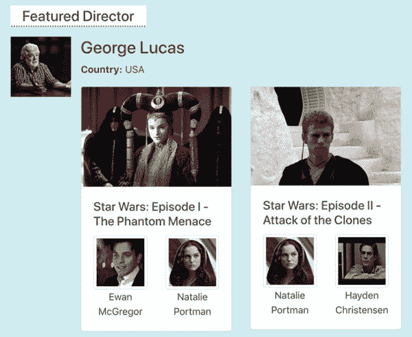
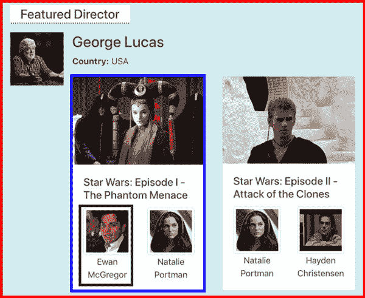
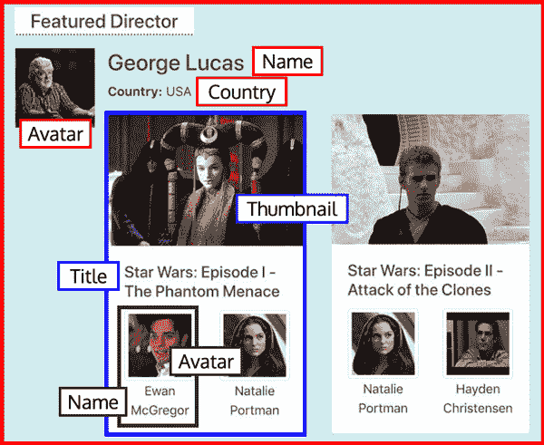
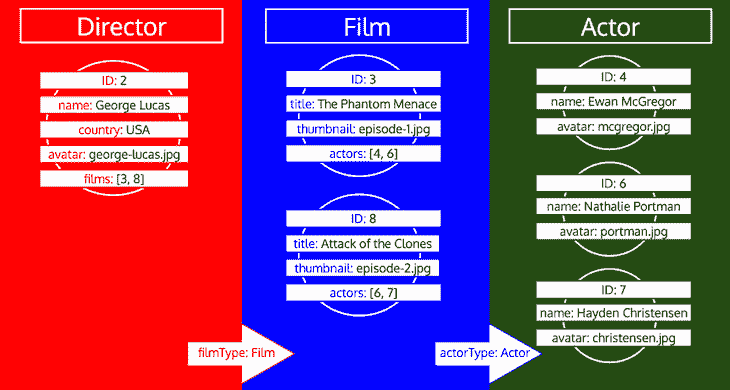
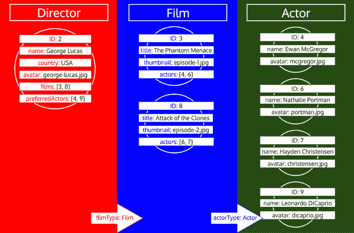
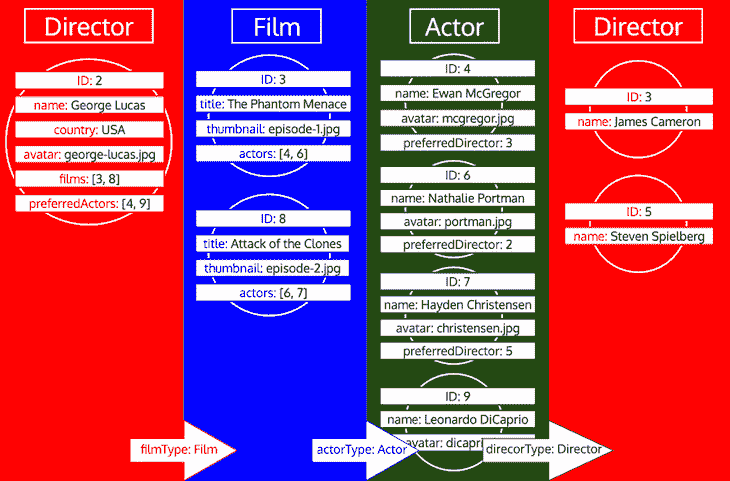
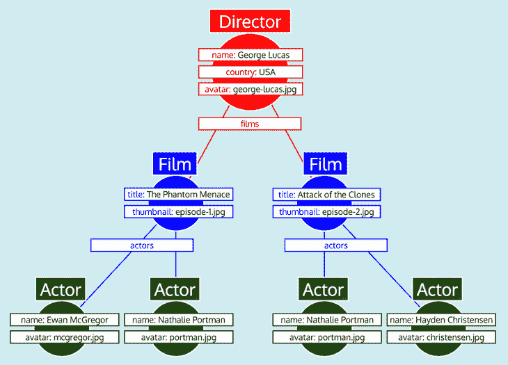

# 简化 GraphQL 数据模型

> 原文：<https://blog.logrocket.com/simplifying-the-graphql-data-model/>

> 本文是正在进行的关于概念化、设计和实现 GraphQL 服务器的系列文章的一部分。本系列的第一篇文章是“[设计 GraphQL 服务器以获得最佳性能](https://blog.logrocket.com/designing-graphql-server-optimal-performance/)”

* * *

简单性和性能可能是我们的应用程序的两个最重要的特性。这两者必须平衡；无论是为了性能优化而牺牲简单性，还是为了简单性而牺牲性能，都会使我们的应用程序变得毫无用处。

没有一个开发人员会希望使用速度极快但复杂到只有天才才能使用的软件，或者非常简单但太慢的软件。因此，为简单而设计不能是事后的想法；它必须从一开始就设计到软件中。

在我的上一篇文章“设计 GraphQL 服务器以获得最佳性能”中，我展示了 GraphQL 服务器如何通过让解析器在处理关系时返回对象的 id(而不是对象本身)来完全避免 N+1 问题。这样做使得解析器的代码变得非常简单，因为它不再需要实现“延迟”机制，而是嵌入在服务器本身中，不可见。

例如，以下面的解析器(PHP)代码为例。字段`author`是类型为`User`的字段，必须通过对数据库的一个或多个附加查询来解析，应该比字段`title`更难解析，字段`author`是可以立即解析的标量字段。

然而，唯一的区别是函数`resolveFieldTypeResolverClass`中的两行代码，它本身只是返回一个类名(以指示`author`必须解析到的对象的类型):

```
class PostFieldResolver implements FieldResolverInterface
{
  public function resolveValue($object, string $field, array $args = [])
  {
    $post = $object;
    switch ($field) {
      case 'title':
        return $post->title;
      case 'author':
        return $post->authorID; // This is an ID, not an object!
    }

    return null;
  }

  public function resolveFieldTypeResolverClass(string $field, array $args = []): ?string
  {
    switch ($field) {
      case 'author':
        return UserTypeResolver::class;
    }

    return null;
  }
}

```

这一步是以非常简单的方式加载数据的解决方案的一半。它将在解析器中实现复杂代码的责任从开发人员转移到服务器的数据加载引擎，希望只需编码一次就可以永远使用。然而，仅仅这样做并不能使整个应用程序变得更简单，它只是改变了它的复杂性。

现在让我们深入研究解决方案的第二部分:使服务器数据加载引擎中的代码尽可能简单。为此，我们需要理解图，GraphQL 所代表的数据模型。

或者是？

## 一路向下的图表？

在标题为[用图表思考](https://graphql.org/learn/thinking-in-graphs/)的页面上，GraphQL 项目声明(强调我的观点):

> 图表是建模许多现实世界现象的强大工具，因为它们类似于我们的自然心理模型和对潜在过程的口头描述。使用 GraphQL，您**通过定义一个模式将您的业务领域建模为一个图**;在您的模式中，您定义不同类型的节点以及它们如何相互连接/关联。在客户端，这创建了一个类似于面向对象编程的模式:引用其他类型的类型。**在服务器上，由于 GraphQL 只定义了接口，你可以自由地将它用于任何后端(新的或遗留的！)**。

该定义的要点如下:尽管响应具有图形的形状，但这并不意味着当在服务器端处理数据时，数据实际上被表示为图形。该图只是一个*心智模型*，而不是一个实际的实现。

其他人也有这种认识:

> GraphQL 本身就有“graph”这个名字，尽管 GraphQL 实际上并不是一种图形查询语言！
> –*[迦勒·梅雷迪思](https://blog.apollographql.com/explaining-graphql-connections-c48b7c3d6976)(前阿波罗·格拉芙琪)*

> [graph QL]既不是一种查询语言，也不是特别面向图形的。…如果您的数据是一个图表，那么您有责任展示该结构。但是你的要求是，如果有的话，树。
> –*[艾伦·约翰逊](https://artsy.github.io/blog/2018/05/08/is-graphql-the-future/)(前阿特西)*

这是个好消息，因为[处理图](https://medium.com/basecs/a-gentle-introduction-to-graph-theory-77969829ead8)并不简单，然后我们可以尝试使用更简单的数据结构。

首先想到的是树，树[比图](https://leapgraph.com/tree-vs-graph-data-structures)简单(树其实是图的子集)。实际上，正如上面的引用中提到的，GraphQL 请求的形状是一棵树。然而，使用树结构来表示和处理服务器中的数据也不是小事，可能需要黑客[来支持建模递归](https://stackoverflow.com/questions/44746923/how-to-model-recursive-data-structures-in-graphql)。

还有更简单的吗？

## 组件一路向下！

我发现最适合在服务器端存储和操作对象数据的结构是…组件！

为了简单起见，在服务器端使用组件来表示我们的数据结构是最佳的，因为它允许我们将不同的数据模型合并到一个结构中。而不是像这样的流程:

`build query to feed components (client) => process data as graph/tree (server) => feed data to components (client)`

…我们的流程将是这样的:

`components (client) => components (server) => components (client)`

这是可以实现的，因为 GraphQL 请求可以被认为具有“组件层次结构”数据结构，其中每个对象类型代表一个组件，并且从一个对象类型到另一个对象类型的每个关系字段代表包装另一个组件的一个组件。

啊？你能用英语解释一下吗？

## 使用组件对数据建模的可视化指南

让我用一个例子让我之前的解释更清楚。假设我们想要构建以下“特色 director”小部件:



Featured director widget.

使用 Vue 或 React(或任何其他基于组件的库)，我们将首先识别组件。在这种情况下，我们将有一个外部组件`<FeaturedDirector>`(红色)，它包装了一个组件`<Film>`(蓝色)，后者本身包装了一个组件`<Actor>`(绿色):



Identifying components within the widget.

伪代码将如下所示:

```
<!-- Component: <FeaturedDirector> -->
<div>
  Country: {country}
  {foreach films as film}
    <Film film={film} />
  {/foreach}
</div>

<!-- Component: <Film> -->
<div>
  Title: {title}
  Pic: {thumbnail}
  {foreach actors as actor}
    <Actor actor={actor} />
  {/foreach}
</div>

<!-- Component: <Actor> -->
<div>
  Name: {name}
  Photo: {avatar}
</div>
```

然后，我们确定每个组件需要哪些数据。对于`<FeaturedDirector>`，我们需要`name`、`avatar`和`country`。对于`<Film>`，我们需要`thumbnail`和`title`。而对于`<Actor>`，我们需要`name`和`avatar`:



Identifying data properties for each component.

我们构建 GraphQL 查询来获取所需的数据:

```
query {
  featuredDirector {
    name
    country
    avatar
    films {
      title
      thumbnail
      actors {
        name
        avatar
      }
    }
  }
}
```

正如您所看到的，上面的组件层次结构和这个 GraphQL 查询之间有直接的关系。

现在让我们转到服务器端来处理请求。我们继续使用相同的组件层次结构来表示信息，而不是将查询作为树来处理。

为了处理数据，我们必须将组件展平成类型(`<FeaturedDirector>`=>`Director`)；`<Film>`=>`Film`；`<Actor>` = > `Actor`)，按照它们在组件层次结构中出现的顺序对它们进行排序(`Director`，然后`Film`，然后`Actor`)，并在“迭代”中处理它们，在其自己的迭代中检索每种类型的对象数据，如下所示:


Dealing with types in iterations.

服务器的数据加载引擎必须实现以下(伪)算法来加载数据:

*准备:*

1.  准备一个空的[队列](https://en.wikipedia.org/wiki/Queue_(abstract_data_type))来存储必须从数据库获取的对象的 id 列表，按类型组织(每个条目将:`[type => list of IDs]`)
2.  检索特色控制器对象的 ID，并将其放在类型`Director`下的队列中

*循环，直到队列中不再有条目:*

1.  从队列中获取第一个条目:id 的类型和列表(例如，`Director`和`[2]`)，并将这个条目从队列中移除
2.  使用该类型的`TypeDataLoader`对象(在我的上一篇文章的[中有所解释)，对数据库执行一个查询，检索该类型的所有具有这些 id 的对象](https://blog.logrocket.com/designing-graphql-server-optimal-performance/)
3.  如果该类型具有关系字段(例如:类型`Director`具有类型`Film`的关系字段`films`，然后从当前迭代中检索的所有对象的这些字段中收集所有 id(例如:类型`Director`的所有对象的字段`films`中的所有 id)，并将这些 id 放在相应类型下的队列中(例如:类型`Film`下的 id`[3, 8]`)。

迭代结束时，我们将加载所有类型的所有对象数据，如下所示:



Dealing with types in iterations.

请注意，在队列中处理一个类型之前，该类型的所有 id 是如何收集的。例如，如果我们向类型`Director`添加一个关系字段`preferredActors`，这些 id 将被添加到类型`Actor`下的队列中，并且它将与来自类型`Film`的字段`actors`的 id 一起被处理:



然而，如果一个类型已经被处理，然后我们需要从那个类型加载更多的数据，那么它就是那个类型的一个新的迭代。例如，将一个关系字段`preferredDirector`添加到`Author`类型将会迫使类型`Director`再次被添加到队列中:



Iterating over a repeated type.

还要注意，这里我们可以使用在[数据加载器](https://github.com/graphql/dataloader)中实现的缓存机制:在类型`Director`的第二次迭代中，ID 为 2 的对象不再被检索，因为它已经在第一次迭代中被检索了。因此，它可以从缓存中取出。

现在我们已经获取了所有的对象数据，我们需要将它塑造成预期的响应，镜像 GraphQL 查询。但是，正如您所看到的，数据没有所需的树结构。相反，关系字段包含嵌套对象的 id，模拟数据在关系数据库中的表示方式。

因此，在比较之后，为每种类型检索的数据可以表示为一个表，如下所示:

*类型表`Director` :*

| 身份证明 | 名字 | 国家 | 阿凡达 | 电影 |
| 2 | 乔治·卢卡斯 | 美利坚合众国 | george-lucas.jpg | [3, 8] |

*类型表`Film` :*

| 身份证明 | 标题 | 极小的 | 演员 |
| 3 | 幽灵的威胁 | episode-1.jpg | [4, 6] |
| 8 | 克隆人的进攻 | episode-2.jpg | [6, 7] |

*类型表`Actor` :*

| 身份证明 | 名字 | 阿凡达 |
| 四 | 伊万·麦格雷戈 | mcgregor.jpg |
| 6 | 娜塔莉·波特曼 | 波特曼. jpg |
| 7 | 海登基督徒 | 基督徒. jpg |

将所有数据组织成表，并知道每种类型如何相互关联(即，`Director`引用`Film`到字段`films;` `Film`引用`Actor`到字段`actors`)，GraphQL 服务器可以轻松地将数据转换成预期的树形:



Tree-shaped response.

最后，GraphQL 服务器输出树，它具有预期响应的形状:

```
{
  data: {
    featuredDirector: {
      name: "George Lucas",
      country: "USA",
      avatar: "george-lucas.jpg",
      films: [
        { 
          title: "Star Wars: Episode I",
          thumbnail: "episode-1.jpg",
          actors: [
            {
              name: "Ewan McGregor",
              avatar: "mcgregor.jpg",
            },
            {
              name: "Natalie Portman",
              avatar: "portman.jpg",
            }
          ]
        },
        { 
          title: "Star Wars: Episode II",
          thumbnail: "episode-2.jpg",
          actors: [
            {
              name: "Natalie Portman",
              avatar: "portman.jpg",
            },
            {
              name: "Hayden Christensen",
              avatar: "christensen.jpg",
            }
          ]
        }
      ]
    }
  }
}
```

## 分析解决方案的时间复杂性

让我们分析数据加载算法的[大 O 符号](https://en.wikipedia.org/wiki/Big_O_notation),以了解对数据库执行的查询数量如何随着输入数量的增加而增加，从而确保这个解决方案是高效的。

GraphQL 服务器的数据加载引擎在对应于每种类型的迭代中加载数据。当它开始一次迭代时，它已经有了要获取的所有对象的所有 id 的列表，因此它可以执行一个查询来获取相应对象的所有数据。

因此，对数据库的查询数量将随着查询中涉及的类型数量而线性增长。换句话说，时间复杂度是`O(n)`，其中`n`是查询中类型的数量(然而，如果一个类型被迭代多次，那么它必须被多次添加到`n`)。

这种解决方案是非常高效的，比处理图形所期望的指数复杂度或者处理树所期望的对数复杂度要好得多。

## 实现的(PHP)代码

本文中概述的解决方案被我实现的 PHP 中的 GraphQL 服务器使用， [GraphQL by PoP](https://graphql-by-pop.com) 。其数据加载引擎的代码可以在[这里](https://github.com/getpop/component-model/blob/7e1588286ce2eb67bffebe9fd6ab2e5274238777/src/Engine/Engine.php#L759)找到。由于这段代码非常长，并且我已经解释了算法的工作原理，所以没有必要在这里重复它。

## 结论


Shouldn’t be hard! Image courtesy of xkcd.

在我的上一篇文章中，我开始描述我们如何构建一个高性能的 GraphQL 服务器，在这篇文章中，我通过描述如何通过使用组件来表示服务器中的数据模型而不是使用图形或树来简化它，从而完成了这篇文章。

因此，实现解析器是非常高效的(基于类型数量的线性复杂度时间)，并且非常容易实现(开发人员不再实现“延迟”机制)。

## 监控生产中失败和缓慢的 GraphQL 请求

虽然 GraphQL 有一些调试请求和响应的特性，但确保 GraphQL 可靠地为您的生产应用程序提供资源是一件比较困难的事情。如果您对确保对后端或第三方服务的网络请求成功感兴趣，

[try LogRocket](https://lp.logrocket.com/blg/graphql-signup)

.

[](https://lp.logrocket.com/blg/graphql-signup)[https://logrocket.com/signup/](https://lp.logrocket.com/blg/graphql-signup)

LogRocket 就像是网络和移动应用的 DVR，记录下你网站上发生的每一件事。您可以汇总并报告有问题的 GraphQL 请求，以快速了解根本原因，而不是猜测问题发生的原因。此外，您可以跟踪 Apollo 客户机状态并检查 GraphQL 查询的键值对。

LogRocket 检测您的应用程序以记录基线性能计时，如页面加载时间、到达第一个字节的时间、慢速网络请求，还记录 Redux、NgRx 和 Vuex 操作/状态。

[Start monitoring for free](https://lp.logrocket.com/blg/graphql-signup)

.