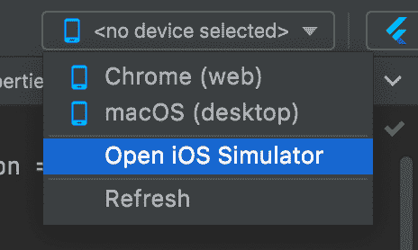
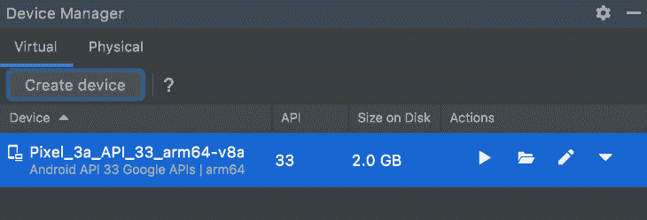
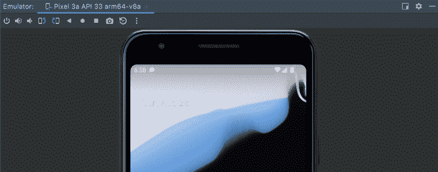
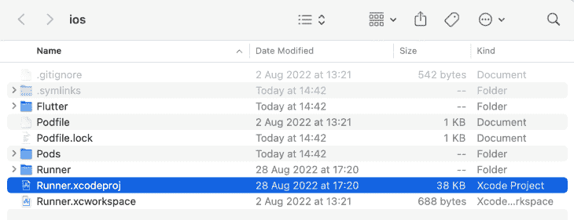
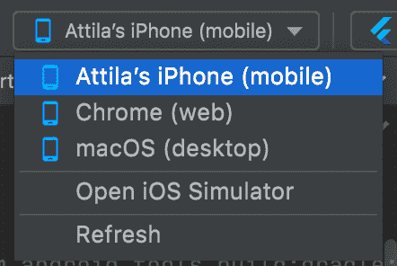
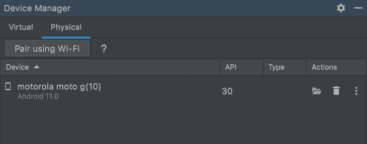

# 颤振应用的模拟与真实设备测试

> 原文：<https://blog.logrocket.com/simulation-real-device-testing-flutter-apps/>

有人在 Flutter 上出卖了你？太棒了。向他们转达我的问候；他们做了一件好事，因为你很快就能构建应用程序。你可能会发现，运行和测试 Flutter 应用程序比你在 Ionic 或 React Native 等其他框架中经历的要容易得多。很快，你就再也不想在其他任何东西上构建应用程序了！

那么，现在我已经让你对构建 Flutter 应用程序感到兴奋，你可能想知道运行和测试你闪亮的新应用程序的最佳方式是什么？例如，对于 Ionic，你可能依赖于浏览器进行大量的开发工作。也许这并不理想，但它提供了一个应用程序 UI 行为的概念。

使用 Flutter，您实际上仍然可以做到这一点，尽管同样的限制也适用。然而，如果你打算在应用程序中使用的硬件无法通过浏览器获得，你将别无选择，只能求助于更高级的东西——用模拟器或真实设备进行测试。

一如既往，当选择出现时，人们必须权衡选择。毕竟，为正确的工作使用正确的工具是软件开发中的头号通用规则。

在本文中，我们将探讨对 Flutter 应用程序使用仿真测试和真实设备测试的好处。在本指南结束时，您将有希望看到这两个选项都不是真正可选的！好消息是什么？有了 Flutter，模拟和真实设备测试都可以很好地工作，而且基本上没有挫折。

如果你在 Windows 机器上，你可以忽略本指南中所有与 iOS 相关的步骤。对于 Android 来说，本文提到的一切应该都是相关的。

*向前跳转:*

## 入门指南

在我们进入文章的主要部分之前，我想快速绕道强调几个要点:

*   即使你只是计划构建一个简单的“Hello World”应用程序，你也会很快意识到模拟器在设计和构建 Flutter 应用程序时是不可或缺的；类似于 web 开发中的浏览器，模拟器成为你无法真正避免的工具
*   如果你打算开发在 iOS 上运行的 Flutter 应用，你别无选择，只能在苹果电脑上开发。具体来说，你需要一台 MacOS 驱动的机器，因为你不仅需要 Xcode 来签署应用程序，还需要其他一些功能，比如添加图标等。
*   Xcode 还附带了所有最新的模拟器。相比之下，Android Studio 需要单独安装，而在 macOS 机器上，你就不用担心这些了
*   无论你用的是英特尔 Mac 还是苹果芯片(M1，M2)，模拟器都会工作得很好；然而，目前用于苹果芯片的 Android 模拟器较少
*   如果你是在苹果硅机器上开发，技术上你可以不使用模拟器，尽管这个过程变得有点耗时。只要是 M1/M2 的机器，iOS 和 iPadOS 应用程序在 macOS 上就能很好地运行，但你必须构建并安装应用程序，才能看到它们运行，这比 Flutter 的热重新加载要长得多
*   在苹果芯片机器上开发需要 Rosetta 2，所以在你尝试开发任何应用之前，确保你已经安装了它

> **注意**，在进一步的上下文中，本指南中使用的开发机器是苹果 MacBook Air M2，配有 macOS Monterey 12.5.1、16 GB RAM 和 512 SSD

## 检查您的颤振开发环境的健康状况

在我开始开发一个应用程序之前，我总是运行 Flutter doctor，以确保我从一个健康的 Flutter 开发环境开始。这是一个非常方便的工具，你所要做的就是在命令行中运行`flutter doctor`。

理想情况下，您会希望看到每个相关的需求都被检查出来。例如，如果你对开发 Android 应用不感兴趣，看到 Android 专用项目旁边的❌就不是你需要担心的事情。

不过，如果你像我一样，想要看到所有带有✅印记的东西，那么一定要遵循 Flutter 医生的指示。

接下来，让我们启动一些模拟器，看看为什么它们对你的颤振开发流程如此重要。

## 设置和运行模拟器和仿真器

有趣的事实:苹果称其应用测试工具为模拟器，但在 Android 世界中，它们被称为模拟器。然而，实际上来说，没有什么不同；模拟器和仿真器做同样的事情。

你会注意到苹果的模拟器在系统资源上更加轻量级，而安卓的模拟器则更加臃肿，这会导致启动时间变慢，甚至耗尽内存。说了这么多，模拟器从 2015 年开始改进了很多，还是这样。

### ios 模拟器

这就是安装 Xcode 不可避免的地方。好消息是，对于模拟器来说，你真正需要做的就是安装它，并在它要求时接受条款和条件。Xcode 可以在[苹果应用商店](https://apps.apple.com/ie/app/xcode/id497799835?mt=12)买到，我强烈建议不要从其他地方下载。您最不想要的就是一个折衷的开发环境。

下载和安装 Xcode 将需要非常长的时间。我见过的最短时间不到 30 分钟。看一集你最喜欢的节目，吃一顿饭，给父母打个电话，或者带着你的宠物雪貂去散步。需要一段时间。🙂

安装 Xcode 后，建议您在终端中运行以下两个命令:

```
sudo xcode-select --switch /Applications/Xcode.app/Contents/Developer
sudo xcodebuild -runFirstLaunch

```

老实说，我从来没有运行过这些命令，而且总能侥幸逃脱。因此，如果您忘记运行这些命令，这可能不会是世界末日。Flutter 还能很好地告诉你需要做什么，以防你遗漏了什么。

像 Mac 上的大多数事情一样，运行模拟器有几种方式。这里有三个选项:

*   通过命令行，像这样:`open -a Simulator`
*   将**模拟器**输入聚光灯
*   或者，我的最爱，通过 Android Studio，在顶部设备下拉列表中，选择**打开 iOS 模拟器**

我认为同样值得注意的是，你可以同时打开多个模拟器。



在这一点上，剩下要做的就是启动你开始构建的那个奇妙的新应用程序。最快的方法是在 Android Studio 中选择模拟器，按下绿色的**播放**按钮。

在关闭模拟器之前，我建议用红色的**停止**按钮停止应用程序。关闭模拟器实例就像按下设备窗口上的**关闭**按钮一样简单，但这并不会真正关闭模拟器应用程序。如果你也想关闭它，最简单的方法就是右击模拟器图标，然后选择**退出**。

### android 模拟器

安装 Android 模拟器稍微复杂一点，但是只需要额外的几次点击，没什么太复杂的。Xcode 和 Android Studio 的主要区别在于，后者不附带已经安装的设备。你想添加什么设备，什么 Android 版本，完全由你决定。

要添加新设备，请在 Android Studio 中进入虚拟设备管理器，然后进入**视图** > **工具窗口** > **设备管理器**。为了确保流畅的体验，我建议选择运行 16GB 内存的机器。添加新设备就像按下**创建设备**按钮并从列表中选择合适的设备一样简单。

这是事情开始变得熟悉的地方。为了确保你的应用可以在 Android 设备上运行，你需要通过按下 **Play** 按钮从你的设备管理器启动该设备。如果您跳过此步骤，当您想要运行应用程序时，该设备将不会显示在您的设备列表中。



现在你已经设置好在 Android 模拟器中运行一个应用程序，你可以完全按照你在 iOS 实例中所做的去做。选择设备，按下绿色的**播放**按钮，观看您的应用程序在 Android 设备上的运行！

与 iOS 模拟器相比，关闭模拟器不太直观。你需要进入运行模拟器的窗口，按下模拟器名称旁边的✖️。



## 什么时候使用模拟器比使用真实设备更好？

打开一个模拟器既可以通过命令行，也可以通过 Android Studio 的 GUI，甚至是 VS Code 的 GUI。我更喜欢使用 GUI，因为它们允许我选择我想要的模拟器，但是你应该使用感觉最舒服的方法。

模拟器的最大卖点是它的无麻烦设置。一旦你安装了 Xcode，你就可以开始了。

安卓应用也是如此。一旦你添加了一个模拟器，你只需启动它，然后愉快地在你的应用上工作。没有必要强调代码签名、开发人员档案或帐户。

在软件开发日益复杂的时代，在模拟器上运行 Flutter 应用程序感觉异常简单和直接。

模拟器的第二大卖点是速度。热重装几乎是瞬时的，甚至一次新的运行也能快至几秒钟。例如，我现在正在开发的一个中等复杂程度的应用程序，在苹果 M2 MacBook Air 上只需要 8.8 秒就可以完成旋转。

## 在真实设备上设置和运行 Flutter 应用程序

### iOS 真实设备

在物理 iOS 设备上运行你的应用程序通常很简单；然而，有两类开发人员:

1.  拥有免费苹果开发者账户的用户
2.  拥有付费苹果开发者账户的用户

如果你是第一类开发者，你需要手动设置一个[苹果开发者预置描述文件](https://developer.apple.com/documentation/appstoreconnectapi/profiles)。

我建议任何认真考虑开发 iOS 应用的人，购买苹果开发者账户订阅。开发者帐户订阅使事情几乎即插即用，它是发布应用程序所必需的。

如果你不想花前期订阅费，你需要打开位于你的 Flutter 项目的 iOS 文件夹中的`Runner.xcodeproj`文件:



接下来，您需要完成 Identity 下的几个字段，比如“显示名称”、“包标识符”、“版本”和“构建”这里至关重要的是选择一个相当独特的应用程序名称，比如:`com.yourFullName.yourAppName`。

您需要自动管理签名，并选择自己作为团队成员，如下所示:


可能会提示您允许钥匙串访问；为了节省额外的点击次数，选择**总是允许**。

最后，鉴于你是一个免费的开发者账户，在连接的 iPhone 或 iPad 上，你可能必须前往**设置** > **常规** > **VPN 和设备管理**，并信任应用程序和开发者。

如果你是第二类开发人员，你只需要选择合适的团队，检查自动管理签名是否打开，插入设备，点击提示上的**信任**，你就可以开始了！

现在剩下要做的就是从下拉列表中选择设备并运行应用程序。



> **注意**，如果在构建过程中的任何时候你遇到奇怪的权限问题，比如“无法打开 iproxy，因为无法验证开发者”，这可以通过进入**系统首选项** > S **安全&隐私**并点击**无论如何都允许**来轻松解决。

### Android 真实设备

当在真实的 Android 设备上运行时，就像模拟器一样，事情会变得更加复杂。如果你习惯于和苹果一起工作，我建议你要特别注意 Android 的步骤，以避免不必要的烦恼和沮丧。

在 Android 上，你首先需要允许设备在开发者模式下使用。

1.  进入**设置** > **关于手机**
2.  向下滚动到 Build Number，反复点击，直到你看到消息:“你现在是一个开发人员。”要是成为一名开发人员有那么容易就好了！😆
3.  进入**系统** > **高级** > **开发者选项**
4.  确保**开发者选项**开启
5.  向下滚动到 **USB 调试**并打开

在 Android Studio 的设备管理器中，您应该会看到您的设备列在 Physical 下。例如，有一次我添加了我的测试 Moto G10 设备，它出现如下图所示。



好消息是，您不必像在 Xcode 上那样摆弄开发者预置描述文件。你只需要运行应用程序，它就会在你的设备上弹出来。热重装也应该工作，并且应该接近瞬时。

## 什么时候最好使用真实设备而不是模拟器？

模拟器和仿真器很神奇，我通常建议在开发过程中 90%的时间使用它们。事实上，它们就在屏幕上你的代码旁边，不需要额外的设备来运行，也不需要电缆来连接，这是一个不可低估的便利。

将所有这些与 Flutter 的 hot reload 结合起来，你就拥有了一个真正舒适的开发者环境，在我看来，这是一种享受。

然而，当你想在开发环境之外看到你的应用程序，并在一个更真实的环境中体验 UX 的时候，就到了。这是真正的设备发挥作用的时候。

有几项功能只能通过物理设备来测试，例如扫描另一台设备上的二维码或测试 NFC 功能。另一个例子是，在将你的应用程序发送到苹果的应用程序商店或谷歌的 Play 商店之前，确保你的 SQLite 数据库在开发环境之外正常工作。

## 结论

在真实设备上测试 Flutter 应用几乎是不可避免的，但这可能不是你设计和构建应用的主要关注点。也就是说，让物理设备成为开发工作流程的一部分仍然至关重要。如果做不到这一点，将会导致捕获错误的时间太晚，甚至可能在生产中。鉴于向移动应用程序推送新的更新是多么的流程密集，防止令人尴尬的错误应该是每个软件开发人员的首要任务。

在本文中，我们回顾了如何检查开发环境的健康状况，如何设置和运行 iOS 模拟器和 Android 模拟器，以及如何在真实的 iOS 和 Android 设备上设置和运行 Flutter 应用程序。我们还讨论了何时以及为何将仿真和真实设备测试整合到您的 Flutter 应用程序开发中。

我希望这篇文章对你有用！

## 使用 [LogRocket](https://lp.logrocket.com/blg/signup) 消除传统错误报告的干扰

[](https://lp.logrocket.com/blg/signup)

[LogRocket](https://lp.logrocket.com/blg/signup) 是一个数字体验分析解决方案，它可以保护您免受数百个假阳性错误警报的影响，只针对几个真正重要的项目。LogRocket 会告诉您应用程序中实际影响用户的最具影响力的 bug 和 UX 问题。

然后，使用具有深层技术遥测的会话重放来确切地查看用户看到了什么以及是什么导致了问题，就像你在他们身后看一样。

LogRocket 自动聚合客户端错误、JS 异常、前端性能指标和用户交互。然后 LogRocket 使用机器学习来告诉你哪些问题正在影响大多数用户，并提供你需要修复它的上下文。

关注重要的 bug—[今天就试试 LogRocket】。](https://lp.logrocket.com/blg/signup-issue-free)