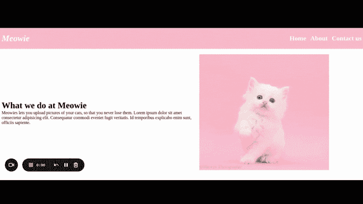
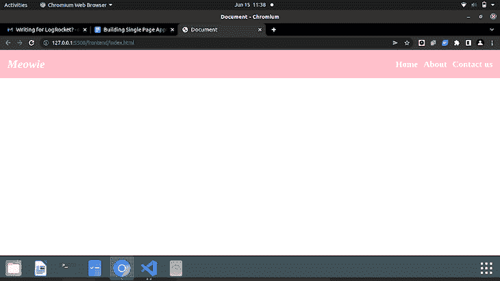
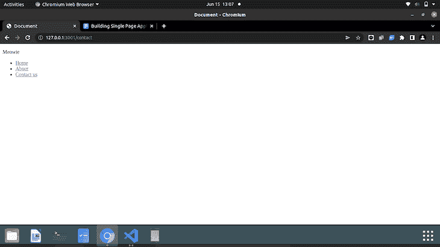
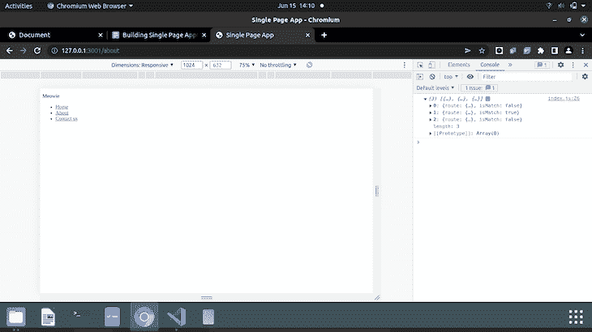
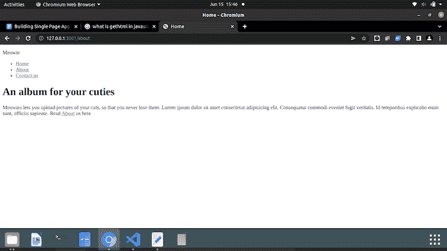
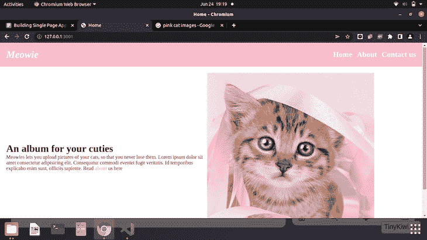
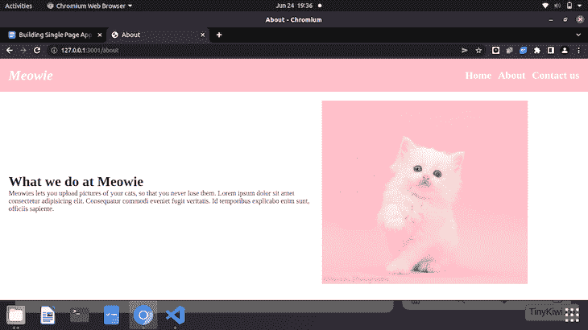
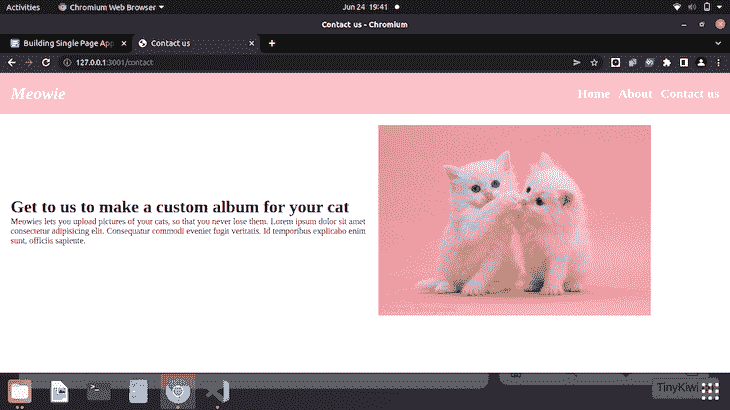

# 使用 CSS 转换构建单页应用程序

> 原文：<https://blog.logrocket.com/single-page-applications-css-transitions/>

网络是不断变化的。从速度，到结构，到质量，没有什么是一成不变的。说到结构，过去分散在多个页面上的内容现在可以压缩到一个页面中。

在本文中，我们将关注单页面应用程序，通常称为 SPAs，以及它们给 web 开发领域带来了哪些重大变化。

在本文中，我们将探索:

## 什么是水疗？

在深入研究任何东西之前，让我们看看什么是 spa，以及在它们之前开发人员使用的是什么。

你知道默认情况下，当你想访问一个新页面时，浏览器会刷新吗？有了 SPAs，情况就不同了——页面上的内容是从服务器重写的，内容的改变不需要刷新浏览器。

如果你使用过 GitHub、Twitter 甚至 Gmail 这样的网站，那么你已经接触过 spa 了。当你在这些网站的标签之间导航时，你不会重新加载浏览器。这些页面被连接在一起，就好像它们都是在一个 HTML 文件中编写的一样(事实也的确如此)。

在 SPAs 出现之前，人们使用的是多页面应用程序(MPAs ),有时至今仍在使用。大多数 web 浏览器都与 MPAs 兼容，开发人员不需要像 spa 那样为它们编写额外的功能。在 MPAs 中，当需要显示新内容(比如新页面)时，会向服务器请求新页面。然后浏览器显示新页面，这将导致重新加载。

在本文中，我们将创建一个以猫为主题的 SPA，并使用 green sock Animation Platform(GSAP)、[一个 JavaScript 动画库](https://greensock.com/gsap/)向其中添加动画。下面的小 GIF 是我们最终网站的预览。



## 哪里可以使用水疗

虽然听起来很神奇，但是在某些方面，温泉并不能取代海洋保护区。

电子书*用 ASP.NET 核心和 Azure 设计现代网络应用*中的一段摘录说，你可以在以下情况下使用 spa:

1.  您的应用程序旨在显示具有多种功能的丰富界面
2.  这是一个数据量很小的网站
3.  你的网站不太依赖 SEO。因为 SPAs 涉及一个单一的网址，搜索引擎优化是非常棘手的，因为它缺乏索引和良好的分析
4.  该网站利用了类似社交媒体平台的实时提醒或通知等功能

在以下情况下，您知道是时候使用海洋保护区了:

1.  您站点的客户端需求很容易满足
2.  您的应用程序不需要 JavaScript 就能在浏览器中运行

## 在移动设备上使用 spa

spa 还允许用户在移动设备应用程序中无缝导航。如果你在手机上通过浏览器登录你的 Twitter 账户，你仍然有 SPA 效应。导航一如既往的流畅，浏览器标签页绝对没有重新加载。

## 建造温泉的教程

现在我们将探索构建单页应用程序的步骤。下面的步骤假设没有框架知识，将涵盖用 HTML、CSS 和普通 JavaScript 构建 spa。因为我们偶尔喜欢让事情变得漂亮，我们也会添加 CSS 页面过渡。

该教程包括:

*   创建项目目录
*   正在安装必要的依赖项。首先，通过在终端或命令行中键入`node -v`,确保您的计算机上安装了 Node。如果显示 Node 的一个版本，那么您就可以开始了。Linux 用户输入`npm install node`或者[访问这个链接](https://nodejs.org/en/)来获得你正在使用的任何操作系统的软件包管理器
*   设置 Express 服务器
*   根据您的需要创建 HTML 和 CSS 文件。这可以只是一些标签或一个小项目，以进一步加深你的理解。这完全取决于你和你想建立什么
*   在新创建的服务器上测试您的标记
*   深入到事物的 JavaScript 方面

本教程到此为止。这些是你在互联网上看到的最简单的步骤。

开个玩笑！当然，我们会经历每一步。

## 所有人都在甲板上…我的意思是键盘

本节将分为两部分。首先，我们将用普通的 JavaScript 创建我们的 SPA。你不需要任何以前的框架知识，因为我们将从头开始构建一切。

第二部分是我们将添加 CSS 页面转换，使导航更加流畅和漂亮。

## 第 1 部分:结合 HTML、CSS 和 JavaScript 创建 SPA

一切都从目录开始。我们需要存放文件的容器。我将使用 CodeSandbox 进行演示，但请随意打开您的代码编辑器和代码。

在您的终端中，我们想要创建一个名为`SPA-tut`的目录，并在其中创建另一个名为`src`的目录。

```
terminal commands
mkdir SPA-tut
cd SPA-tut
mkdir src
cd src
```

使用您选择的任何 IDE 打开`SPA-tut`。因为没有一个项目没有一个`index.html`文件是完整的，我们将在我们的`src`文件夹中创建一个。

我们不会建立一个完整的网站，只是一个小导航栏和几个链接来演示。在我们的`index.html`中，我们有以下降价:

```
   <nav class="navbar">
       <div class="logo">
           <p>Meowie</p>

       </div>

       <ul class="nav-items">
           <li><a href="/" data-link>Home</a></li>
           <li><a href="/about" data-link>About</a></li>
           <li><a href="/contact" data-link>Contact us</a></li>
       </ul>
   </nav>

   <div id="home"></div>
```

注意我们是如何添加数据属性的。这使用 History API `pushState()`方法导航到一个资源，而不需要刷新。你现在不需要明白这些，但我们最终会明白的。

我们的样式表也一样小。

```
*{
   padding: 0;
   margin: 0;
   box-sizing: border-box;
}

.navbar{
   background-color: pink;
   padding: 20px;
   display: flex;
   justify-content: space-between;
   align-items: center;
}
.nav-items{
   display: flex;
}

a{
   text-decoration: none;
   color: white;
   font-weight: bold;
   font-size: x-large;
}
.link{
   color: pink;
   font-size: medium;
}
.logo{
   color: white;
   font-weight: bold;
   font-size: xx-large;
   font-style: oblique;
}
ul{
   list-style: none;
}
.navbar ul li{
   margin-left: 15px;
}

#home{
   display: flex;
   align-items: center;
   margin: 20px;

}
.img{
   width: 80%;
   height: 80%;
}

```

我们的网站应该是这样的:



普通的 HTML 和 CSS 对我们没有任何好处，所以让我们直接进入 JavaScript 吧。我们将再创建两个文件夹:一个在`src`文件夹中的`static`文件夹中的`js`文件夹，以及一个`index.js`文件。现在，我们想通过在结束的`body`标签上方使用一个`script`标签将这个 JS 文件连接到我们的`index.html`。

```
<script type="module" src="/static/js/index.js"></script>

```

我们在这里添加了类型`module`,因为我们将在项目过程中使用 ES6 的导入和导出功能。

为了本教程的缘故，我们的网站没有响应，但请放心成为更好的开发者，使您的网站与其他设备兼容。

### 使用 Express 创建 SPA 服务器

对于这个 SPA，我们将利用 Express 库来创建我们的服务器。不要担心，你不需要大量的 Express 知识。

在源目录下创建一个`server.js`文件。正如我之前提到的，我们需要先安装 Node，然后才能获得其他所需的包或库。在您的终端中:

1.  键入`npm init -y`创建一个`package.json`
2.  键入`npm i express`安装 Express

如果您以前安装了节点，这些应该没有太大的麻烦。

对于服务器，我们需要在刚刚创建的`server.js`文件中创建一个 Express 应用程序。

```
const express = require('express');
const path = require('path');
const hostname = '127.0.0.1';
const port = 3000;

const app = express();

app.get("/*", (req, res) => {
   res.sendFile(path.resolve(__dirname, 'src', 'index.html'));
});

//listen for request on port 3000
app.listen(port, hostname, () => {
   console.log(`Server running at http://${hostname}:${port}/`);
 });

```

为了导入快递，我们叫`require()`。我们的应用程序监听我们上面指定的通过端口`3000`发送的任何请求。`app.get`从指定的 URL 获取请求。在这种情况下，它通过调用`sendFile()`函数来实现，该函数使用`path.resolve()`从左到右处理路径序列，直到创建了绝对路径。我们的路径是`/*`的原因是，无论我们在浏览器中向 URL 添加什么端点，我们都希望页面重定向到`index.html`。

然后，`app.listen`监听端口`3000`上的任何请求，并记录一条传递主机名和端口号的消息。

如果您从终端复制路径并粘贴到浏览器中，我们从`index.html`文件得到的输出应该会显示出来。它没有固定的样式，但是我们最终可以很容易地修复它。点击任何链接只会刷新页面。



如果我们打开控制台，我们会看到一个显示`Failed to load module script...`的错误。

我们可以通过在我们的`server.js`文件中的`app.get`函数之前添加下面一行来解决这个问题:

```
app.use("/static", express.static(path.resolve(__dirname,'src', 'static')));

```

### 用 JavaScript 编辑客户端 SPA

已经受够了服务器。让我们开始做一些有意义的工作。

第一步是创建一个路由器。我们将在一个异步函数中加载每个视图(或页面)的内容。它是异步的，因为我们可能希望从服务器端加载某些内容。

为了定义各种路线，让我们创建一个对象数组，每个对象都有自己的路线。

```
const router = async () => {
   const routes = [
       {
           path: "/",
           view:  view: () => console.log("Home")
       },
       {
           path: "/about",
           view: () => console.log("About us")
       },
       {
           path: "/contact",
           view: () => console.log("Contact")
       }

   ];

};

```

`view`此时只是一个显示视图的功能。随着我们的发展，我们将对其进行调整，以便更好地为我们服务。

但是假设我们改变了我们的路线，完全脱离了上下文(我的意思是在我们的 URL 中添加“无意义的”端点)。我们想检查一个已经输入的路由是否是数组的一个元素。为此，我们将使用`map`数组方法遍历每个数组元素并返回一个新对象。

```
//test each route for match
const checkMatches = routes.map(route => {
       return{
           route: route,
           isMatch: location.pathname === route.path //returns a boolean value
       };
   });

console.log(checkMatches);

```

如果路线确实在数组中，`checkMatches`将返回路线名称和一个布尔值 true。如果我们刷新浏览器，我们在控制台中看不到任何内容。这是因为我们还没有调用路由器函数本身。

因此，在路由器功能之外，让我们这样做:

```
document.addEventListener('DOMContentLoaded', () => {

   router();
})

```

当我们的页面加载时，路由器功能将运行。

现在，让我们试着自己做实验。



您会看到，如果我们将`/about`添加到 URL 中，数组的第二个元素是`true`，其他元素被设置为`false`。如果我们将 URL 设置为不在数组中的路由，那么`isMatch`的所有值都将是`false`。

但是假设我们只想获取路由名称并执行检查。

```
let match = checkMatches.find(checkMatch => checkMatch.isMatch);

   console.log(match);

```

当我们现在输入路径时，`find`函数从数组中挑选出匹配的路径，并返回一个布尔值，告诉我们这个特定的路径是否在数组中。

但是如果我们添加一个不在数组中的路由，我们会在控制台中得到`undefined`。我们需要定义一个`not found`或`404`根。

```
if(!match){
       match = {
           route: routes[0]
       }
   }

   console.log(match.route.view);

```

如果没有匹配，我们的 404 页面将成为数组索引 0 处的视图，也就是主页。您可能会决定为这种情况创建一个自定义的 404 页面。

如果我们刷新浏览器并点击任何链接，那么我们上面声明的`view`函数将会运行，该视图的名称将会显示在控制台中。

### 使用历史 API 导航

我们希望在视图之间导航，并在不重新加载浏览器的情况下更改 URL。为此，我们需要实现[历史 API](https://developer.mozilla.org/en-US/docs/Web/API/History_API) 。在定义路由器函数之前，我们先定义一个名为`navigateTo`的新函数。

```
const navigateTo = url => {
   history.pushState(null, null, url);
   router();
};

```

为了调用这个函数，我们将创建一个事件监听器。

```
document.addEventListener('DOMContentLoaded', () => {
   document.body.addEventListener('click', e => {
       if(e.target.matches('[data-link]')){
           e.preventDefault();
           navigateTo(e.target.href);
       }
   })

   router();
})

```

因此，我们的`click`事件检查链接是否具有`data-link`属性。如果是这样，我们希望停止默认的动作，即浏览器重新加载，并将目标指向该链接的`href`。这是一个委托的事件监听器，所以如果我们将内容添加到包含这些链接的视图中，这些链接应该会像我们一直描述的那样正常工作。

试着在页面上的链接间导航，并把你的眼睛放在浏览器标签上。当你点击的时候页面会重新加载吗？从 HTML 中移除`data-link`并再次尝试点击。

### 使用`popstate`查看 SPA 中的不同页面

当您在链接之间单击时，您还可以在控制台中看到变化。将显示视图的名称。如果我们尝试点击 **back** 按钮转到之前的视图，`router`功能不会运行，因此，我们点击返回的新视图不会显示。

所以，在我们的`DOMContentLoaded`事件监听器之前，让我们先听一下`popstate`事件。

```
window.addEventListener('popstate', router);

```

刷新您的浏览器，并尝试在页面之间来回移动。您会看到，对于每一页，`view`函数都会运行并显示在控制台上。

### 展示您水疗中心的景观

让我们从简单的`console.log`切换到实际显示视图的类。在`js`目录中，我们将创建一个名为`pages`的新目录。

我们将为每个视图创建类，但是首先，让我们创建一个其他视图将继承的类。在`pages`文件夹中创建一个`view.js`文件。

```
export default class{
   constructor(){

   }

   setTitle(title){
       document.title = title;
   }

   async getHtml(){
       return '';
   }
}

```

当我们在视图间导航时，`setTitle`方法将更新视图的页面标题。`getHTML`方法是我们为一个特定的视图放入 HTML 内容的地方。

现在让我们创建一个`Home.js`文件，我们将在其中创建一个扩展上面的`view`类的类。

```
import view from './view.js'

export default class extends view{
   constructor(){
       super();
       this.setTitle("Home");
   }

   async getHtml(){
       return `

       <div class="text">
           <h1>An album for your cuties</h1>
           <p>Meowies lets you upload pictures of your cats, so that you never lose them. Lorem ipsum dolor sit amet consectetur adipisicing elit. Consequatur commodi eveniet fugit veritatis. Id temporibus explicabo enim sunt, officiis sapiente.
           Read <a href="/about" data-link class="link">about</a> us here </p>
       </div>

       <div>
           
       </div>

       `;
   }
}

```

在我们的构造函数中，我们将标题设置为`Home`来反映视图。在我们的`getHTML`方法中，我们返回了一大块 HTML。

我们现在想把 HTML 注入到路由器中。在`index.html`文件的顶部，我们导入了`Home`类。

```
import Home from './pages/Home.js'

```

在我们的 routes 数组中，我们也将视图函数更改为`Home`类。

```
      {
           path: "/",
           view: Home
       },

```

最后一步:

```
  const view = new match.route.view();

   document.querySelector("#home").innerHTML = await view.getHtml();

```

如果我们刷新浏览器，我们的主视图看起来有点像这样:



注意我是如何在末尾添加了一个`about`链接的？如果您单击它，您会注意到没有浏览器刷新。这是由于我之前提到的委托事件。

从这里开始，为其他视图创建类将是非常相似的过程。我们将为我们创建的每个新视图扩展`view`类，并将新视图的类导入到我们的`index.html`文件中。

### 用 CSS 编辑浏览器显示

让我们稍微移动一下 CSS 文件，以便它对我们的`index.html`文件生效。让我们在静态文件夹中创建一个`css`文件夹，并将我们的`styles.css`文件移动到其中。如果我们将 HTML 文件链接到样式表，那么我们的网站就会变成这样。



这并不新奇，但足以向你展示它是如何工作的。

为了创建其他视图，我们将像对`Home.js`那样做。假设这是本文的简单任务。你的应该比我的好看。

创建完所有视图后，我的**关于**和**联系人**部分看起来有点像这样:





就像我说的，没什么特别的。你会看到链接变了，页面标题也更新了(我的截图里没有)。

这就是了。功能齐全的单页应用程序。现在添加一些页面过渡。

## 第二部分:CSS 页面转换

这部分是我的最爱。为了创建平滑的页面过渡，我们将使用 JavaScript 动画库和一些 CSS 来帮助我们。

我将使用的动画库是 GSAP。它使得在你的站点上应用动画变得相对容易，并且只需要几行 JavaScript 代码。要了解更多关于 GSAP 的信息并免费获得他们的超级小抄，[在这里查阅](https://greensock.com/gsap/)。

### 安装 GreenSock 动画平台(GSAP)

出于本教程的考虑，我们将使用 CDN 向 GSAP 介绍我们的项目。

```
<script src="https://cdnjs.cloudflare.com/ajax/libs/gsap/3.10.4/gsap.min.js"></script>

```

您可以在您的结束标签`<body>`之前添加这个。

### 有趣的部分:CSS 的滑动效果

我们想在我们的应用程序中创建某种滑动效果。要做到这一点，我们需要一些东西在显示页面内容之前滑过页面。

让我们在 HTML 的底部添加一个额外的`div`标签，并给它一个类`slider`。

```
<div class="slider"></div>
```

对于我们的`styles.css`,我们将通过添加以下内容来设置滑块的样式:

```
.slider{
  position:fixed;
  top:0;
  left: 0;
  background-color: palevioletred;
  width: 100%;
  height: 100%;
  transform: translateY(100%);
}

```

如果你刷新页面，什么都不会改变。滑块在那里，但是`transform`属性使它保持在页面内容的下面，所以我们实际上看不到它。

当我们第一次打开页面时，我们希望滑块在页面上向上滑动。这就是 GSAP 发挥作用的时候。在我们的`index.js`中，我们必须首先初始化 GSAP，然后才能开始使用它。因为我们希望页面加载时有动画，所以我们将在类导入下面初始化我们的 GSAP。

```
const tl = gsap.timeline({ defaults: {ease:'power2.out'} });

```

上面一行简单地定义了我们的时间线，并将一切设置为默认值。

我们的第一个动画将是滑块，从页面上的位置向上滑动。

```
tl.to('.slider', {y: "-100%", duration:1.2});

```

我们所做的是使用我们声明的时间轴来定位 slider 类。`y: “-100%”`替换了我们最初为 CSS 设置的`translateY(100%)`。`duration:1.2`只是为了计时而设置的。因此，当我们的页面第一次加载时，我们的滑块将在页面内容上向上滑动。

但是动画在我看来还是不太对劲。为了使它更好，我们希望我们的页面内容也向上滑动，就在滑块上升之后。为了做到这一点，我们将不得不在我们的 HTML 中以`home` ID 为目标，因为它包含了我们的页面内容。

就在滑块动画之后，我们将添加:

```
tl.to('#home', {y: "0%", duration:1.2}, "-=1");

```

和以前一样，我们将目标指向了 ID`home`并为它设置了一个持续时间。额外的`-=1`是为了让页面内容在滑块之后立即向上滑动。如果我们把它拿出来，你会注意到一些延迟。

但就这样吗？

不。我们还没有添加我们正在谈论的视图之间的平滑过渡。既然您已经看到了这个过程是如何工作的，那么为视图添加过渡就不会那么困难了。

我们希望在用户点击链接时创建一个平滑的过渡，所以我们将在点击事件中添加动画。

我们调整后的 JavaScript 将如下所示:

```
document.addEventListener('DOMContentLoaded', () => {
   document.body.addEventListener('click', e => {
       e.preventDefault();
       tl.to('.slider', {y: "100%", duration:0});

       if(e.target.matches('[data-link]')){
           tl.to('.slider', {y: "-100%", duration:1.2});
           tl.fromTo('#home', {opacity: 0}, {opacity:1, duration:0.5});

           navigateTo(e.target.href);
       }

   })

   router();
})

```

记住，当我们的滑块上升后，它停留在原位。因此，当用户点击时，滑块下降，然后再次上升。第一个动画的持续时间被设置为零，所以你不会注意到它下滑。这里设置了动画，这样每当用户点击一个链接时，动画就会继续播放。

为了让事情变得更顺利，一旦点击滑动条，我们希望页面内容的不透明度快速改变，并创建一个漂亮的淡出效果。

```
 tl.fromTo('#home', {opacity: 0}, {opacity:1, duration:0.5});

```

`fromTo`表示动画有起点和终点。它从 0 的不透明度开始，到 0.5s 的不透明度达到 1

调整动画后，我们的 SPA 现在看起来像这样:


我们有一个很好的滑块和每一页很好的褪色。

## 结论

这标志着本文的结束。我们已经讨论了什么是 spa，如何从头开始创建 spa，以及如何在视图之间添加平滑的页面过渡。

要查看该项目的完整代码，请使用这里的 [Github repo 链接](https://github.com/Njong392/single-page-application-LogRocket)。

希望这篇文章对你有帮助。如有需要，请随意修改，并点击查看 [GSAP 文档。他们有一个免费的备忘单，可以帮助你使你的动画更流畅更好。](https://greensock.com/docs/)

## 你的前端是否占用了用户的 CPU？

随着 web 前端变得越来越复杂，资源贪婪的特性对浏览器的要求越来越高。如果您对监控和跟踪生产环境中所有用户的客户端 CPU 使用、内存使用等感兴趣，

[try LogRocket](https://lp.logrocket.com/blg/css-signup)

.

[](https://lp.logrocket.com/blg/css-signup)[https://logrocket.com/signup/](https://lp.logrocket.com/blg/css-signup)

LogRocket 就像是网络和移动应用的 DVR，记录你的网络应用或网站上发生的一切。您可以汇总和报告关键的前端性能指标，重放用户会话和应用程序状态，记录网络请求，并自动显示所有错误，而不是猜测问题发生的原因。

现代化您调试 web 和移动应用的方式— [开始免费监控](https://lp.logrocket.com/blg/css-signup)。