# 用 Slack 机器构建一个 Slack 机器人

> 原文：<https://blog.logrocket.com/slack-bot-slack-machine/>

Slack 是一个最初设计用于办公场所的信息程序，也已经被个人使用。根据该公司的官方声明，Slack 拥有 1000 万每日用户和超过 85，000 名付费用户。

多年来，Slack 社区一直在构建一个强大的应用程序目录。应用程序集合包含数百到数千个集成，提供了极大的灵活性来提高公司的效率。

Slack Machine 是一个健壮的、可扩展的框架，可以帮助您将 Slack 工作空间发展成一个 ChatOps 发电站。在本指南中，我们将介绍如何设置 Slack 机器并实现它的一些特性。

向前跳:

当前松弛机项目文件夹包含一个文件:`local_settings.py`。该文件将保存备用机器的所有配置设置:

```
SlackMachine(Project-folder)
|__local_settings.py    

```

## 生成令牌将我们的应用程序连接到 Slack 机器

连接我们的应用程序和 Slack 机器需要两个令牌:应用程序级令牌和 bot 令牌。要生成这些令牌，请导航至[https://api.slack.com/apps](https://api.slack.com/apps)。在那里，点击**创建一个应用程序。**

在弹出的窗口中，从一个应用清单 : 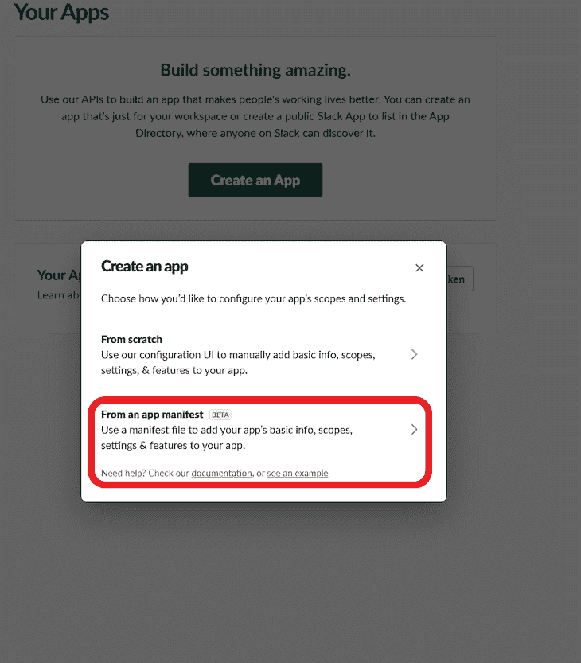中选择

 **选择将要安装 Slack bot 的 Slack 工作区。然后，我们需要定义一个清单。清单是指示 Slack 应用程序如何工作的配置。点击阅读关于[的更多信息，了解每个字段的含义。将以下代码块添加到清单中:](https://api.slack.com/reference/manifests#fields)

```
display_information:
  name: Wamaitha Slack Machine
features:
  bot_user:
    display_name: Wamaitha Slack Machine
    always_online: false
oauth_config:
  scopes:
    bot:
    - app_mentions:read
    - channels:history
    - channels:join
    - channels:read
    - chat:write
    - chat:write.public
    - emoji:read
    - groups:history
    - groups:read
    - groups:write
    - im:history
    - im:read
    - im:write
    - mpim:history
    - mpim:read
    - mpim:write
    - pins:read
    - pins:write
    - reactions:read
    - reactions:write
    - users:read
    - users:read.email
    - channels:manage
    - chat:write.customize
    - dnd:read
    - files:read
    - files:write
    - links:read
    - links:write
    - metadata.message:read
    - usergroups:read
    - usergroups:write
    - users.profile:read
    - users:write
settings:
  event_subscriptions:
    bot_events:
    - app_mention
    - channel_archive
    - channel_created
    - channel_deleted
    - channel_id_changed
    - channel_left
    - channel_rename
    - channel_unarchive
    - group_archive
    - group_deleted
    - group_left
    - group_rename
    - group_unarchive
    - member_joined_channel
    - member_left_channel
    - message.channels
    - message.groups
    - message.im
    - message.mpim
    - reaction_added
    - reaction_removed
    - team_join
    - user_change
    - user_profile_changed
    - user_status_changed
  interactivity:
    is_enabled: true
  org_deploy_enabled: false
  socket_mode_enabled: true
  token_rotation_enabled: false
```

在**审核总结&创建你的 app** 弹出窗口，点击
创建: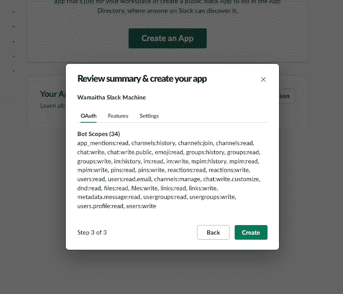

创建完成后，在**基本信息**设置选项卡中，点击**安装到工作区。**允许对 Slack 应用的权限。

我们需要的第一个令牌是 SLACK_BOT_TOKEN *。*导航到 **OAuth &权限**，将 **Bot 用户 OAuth 令牌**复制到`local_settings.py` : 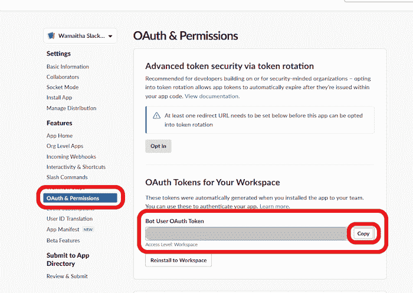

要生成应用级令牌，请导航至**基本信息**，向下滚动至**应用级令牌**，并点击**生成令牌和范围。**

在弹出窗口中，给令牌命名，点击**范围**下拉菜单，添加两个范围:`connections:write`和`authorizations:read`:


一旦选择了两个示波器，点击**生成**。弹出的应该如下图:
T3

复制生成的令牌并将其作为 SLACK_APP_TOKEN 保存到`local_settings.py`文件
`local_settings.py`文件现在应该包含以下内容:

```
SLACK_BOT_TOKEN="add_the_token_here"
SLACK_APP_TOKEN="add_token_here"
```

如果一切顺利，应用程序级令牌选项卡应该如下所示:

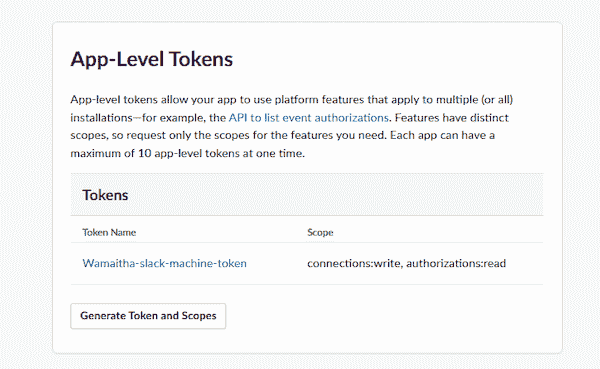

## 配置时差

现在，前往 Slack 的工作区。您应该会在“应用程序”选项卡下找到添加的 Slack 机器:

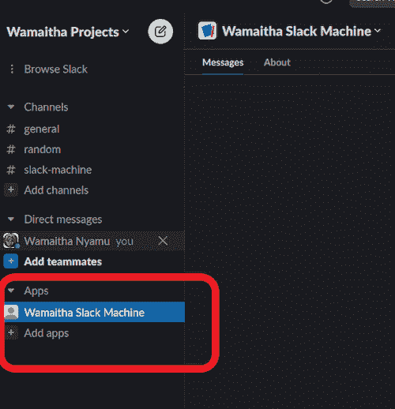

建议在虚拟环境中使用 Slack 机器。虚拟环境排除了应用程序使用的依赖关系，而不会与系统上全局安装的依赖关系发生冲突。

## 用 Python 创建虚拟环境

我们将使用`[venv](https://docs.python.org/3/tutorial/venv.html)` [Python 模块](https://docs.python.org/3/tutorial/venv.html)来创建一个虚拟环境。该命令遵循以下结构:

```
python -m venv name_of_environment
```

在这种情况下，我们的虚拟环境名称将是`venv`。我们使用下面的命令创建它:

```
python -m venv venv
```

*注意*，如果您安装了多个版本的 Python，您可能需要指定应该使用哪个版本的 Python`venv`。关于这个的更多信息可以在[文档](https://docs.python.org/3/library/venv.html)中找到。

此时，项目文件夹结构变为:

```
SlackMachine(Project-folder)
      |__local_settings.py    
      |__venv
```

要激活虚拟环境，您需要运行以下命令。

在 Windows 上，运行:

```
venv\Scripts\activate.bat
```

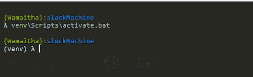

在 Linux 和 macOS 上，运行:

```
source tutorial-env/bin/activate
```

## 与松弛的机器交互

现在，我们将使用`pip`安装松弛机模块。该模块允许我们与 Python 中的 Slack API 进行交互。

使用以下工具安装松弛机器:

```
pip install slack-machine
```

使用 Slack 机器在根文件夹上运行 bot，如下所示:

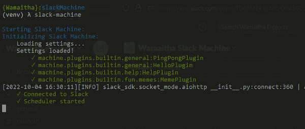

一旦连接成功，返回 Slack。右键点击 Slack Machine app，点击**查看 app 详情**:

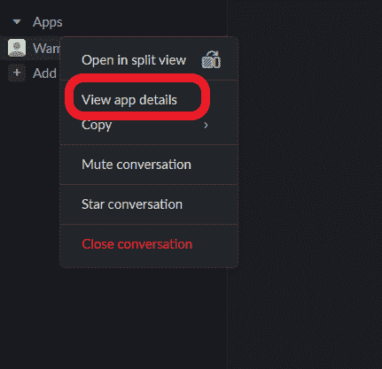

在弹出窗口中，将应用程序添加到频道。

您可以将其添加到您选择的任何频道。对于这个例子，我将它添加到#slack-machine 通道。导航到该频道并向机器人发送问候消息:

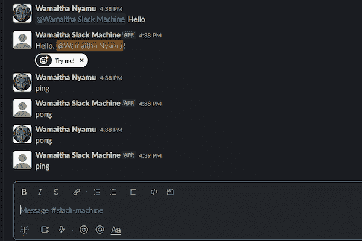

默认情况下，Slack 机器加载 HelloPlugin 和 PingPongPlugin。当机器人被问候时，HelloPlugin 以“你好”或“嗨”作为回应。无论提及与否，PingPongPlugin 都以“ping”或“pong”响应。

## 构建定制插件

由于 Slack 机器的灵活性，我们可以构建自己的定制插件。为此，我们需要创建一个插件包。创建一个新的插件文件夹，并在其中创建一个`customPlugin.py`文件。

更新后的项目文件夹结构如下所示:

```
SlackMachine(Project-folder)
      |__local_settings.py    
      |__venv
      |__plugins
           |__customPlugin.py

```

在`customPlugin.py`中，我们创建了一个包含所有自定义插件功能的类。我们的第一个功能是指示 Slack 应用程序生成一个爸爸笑话。完整的代码是:

```
from machine.plugins.base import MachineBasePlugin
from machine.plugins.decorators import respond_to
import requests
import json

class OurCustomPluginClass(MachineBasePlugin):
    """
    Custom plugin class for interacting with the slack-machine
    """

    # tells a dad joke
    @respond_to(r"^Make me laugh")
    async def dad_jokes(self, msg):
        """
        Returns a dad joke and replies the joke to the user
        """
        random_dad_joke = requests.get("https://icanhazdadjoke.com/",
                                       headers={"Accept": "application/json"})
        random_dad_joke = json.loads(random_dad_joke.text)["joke"]

        await msg.reply(random_dad_joke)
```

`OurCustomPluginClass`从松弛的机器上伸出`MachineBasePlugin`。我们的`dad_joke`函数有`respond_to`装饰器。`respond_to`装饰器作用于提到 Slack bot 的消息，将特定的关键字作为正则表达式传递给装饰器。

`requests`模块将向`dad_joke` API 发出一个 HTTP 请求。JSON 模块随 Python 一起安装，用于将 API 响应转换成 JSON 格式。

可以在终端上使用`pip`安装`requests`库:

```
pip install requests
```

定制插件需要包含在`local_settings.py`中来运行 Slack 机器。

在`local_settings.py`中，添加如下所示的代码:

```
SLACK_APP_TOKEN = "xapp-"
SLACK_BOT_TOKEN = "xoxb-"

PLUGINS = ["plugins.customPlugin.OurCustomPluginClass"]
```

然后在根文件夹中的终端上重新运行 Slack Machine:

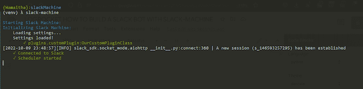

输出应该显示插件类已经被加载。

`respond_to`装饰器要求用户用指定的关键字在 Slack 上提及机器人。在我们的例子中，我们需要提到机器人，然后用“逗我笑”来触发`dad_joke`函数:


`respond_to`装饰器也可以用来发出定制事件。事件是一种在插件之间交换数据或公开其他插件可以使用的 API 端点的方式。使用`self.emit()`发出事件。我们的自定义事件将收集用户电子邮件，并将其发送到电子邮件通道。

首先，创建一个电子邮件通道:#注册-电子邮件:

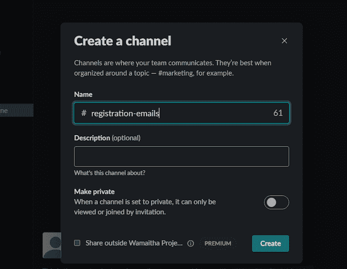

收集邮件的代码如下所示:

```
from machine.plugins.base import MachineBasePlugin
from machine.plugins.decorators import respond_to, on, 
import requests
import json
import re

class OurCustomPluginClass(MachineBasePlugin):
   """
   Custom plugin class for interacting with the slack-machine
   """

   @respond_to(r"register (?P<email>.*)")
   async def register_emails(self, msg, email):
       """
       Collect registration email from user
       """

       email = email.split("|")[1][:-1]
       email_regex = "^[a-z0-9]+[\._]?[a-z0-9]+[@]\w+[.]\w{2,3}$"
       user = msg.at_sender
       if re.search(email_regex, email):
           self.emit('new_registration', email=email, user=user)
       else:
           await msg.reply_dm(f'Hey {user}, your registration email address {email} is                invalid.')

   @on("new_registration")
   async def collect_emails(self, **kwargs):
       """
         Listen for new emails
      """

       await self.say("registration-emails", f"{kwargs['user']} - {kwargs['email']}")
                      ]}")
```

`register_emails`函数发出一个事件，将电子邮件转发到#registration-emails 通道。该事件还发出用户的 ID 和特定的电子邮件作为参数的一部分:
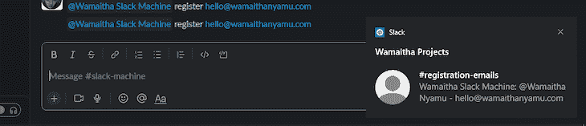

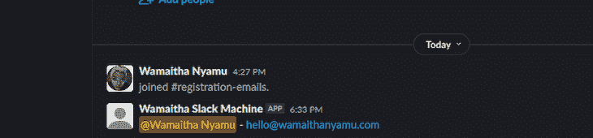

发出的事件有一个惟一的名称，在我们的例子中是`new-registrations`。为了监听`new-registrations`事件，我们需要`@on`装饰器。

装饰者需要注意事件名称。当发出`new-registrations`事件时，触发`collect_emails`功能。该功能将用户名和电子邮件转发到#registration-emails 频道。

如果用户提供了无效的电子邮件地址，Slack 应用程序会直接向用户发送一条消息:


## 闲置机器存储能力

松弛机器还提供存储功能。数据存储在内存中的键值对中，或者使用外部数据库。为了演示内存中的功能，我们将生成令牌，并让用户随意检索和删除它们。

这方面的代码如下所示:

```
from machine.plugins.base import MachineBasePlugin
from machine.plugins.decorators import respond_to, on
import requests
import json
import re
import random

class OurCustomPluginClass(MachineBasePlugin):
   """
   Custom plugin class for interacting with the slack-machine
   """

   @respond_to(r"generate")
   async def gen_token(self, msg):
       """
       Generate random token
       """
       user = msg.at_sender
       token = random.randint(1, 1000)
       await self.storage.set(user, token)
       await msg.reply_dm(f"Hey {user} your generated token is {token}")

   @respond_to(r"retrieve")
   async def retrieve_token(self, msg):
       """
       Retrieve the stored token
       """
       user = msg.at_sender
       token = await self.storage.get(user)
       if token:21
           await msg.reply_dm(f"Hey {user} your token is {token}")
       else:
           await msg.say("Key not found! Generate a new token")

   @respond_to(r"delete")
   async def delete_token(self, msg):
       """
       delete tokens
       """
       user =msg.at_sender
       await self.storage.delete(user)
       await msg.say(f"data in <{user}> deleted!")
```

`MachineBasePlugin`类内置了内存存储功能。仍然使用`respond_to`装饰器，我们有三个函数:

1.  **gen_token** :这个函数产生一个 1 到 1000 之间的随机令牌。使用`set`方法将令牌保存到内存数据库中。`set`方法接受两个参数:键和值。我们将用户的发送者 ID 设置为密钥，将生成的令牌设置为值:
    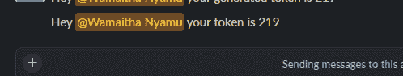
2.  **retrieve_token** :该函数将检查内存存储中是否有包含用户发送者 ID 的值。如果密钥存在，则将令牌值的私有直接消息发送给用户。否则，通知用户该键不存在: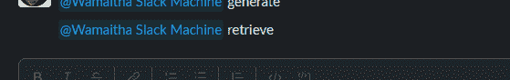
3.  **delete_token** :该功能删除用户存储的 token: 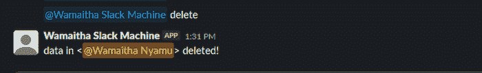

`listen_to`装饰器的工作原理与`respond_to`装饰器相同，主要区别在于用户不需要提及 Slack 应用。

例如，我们可以使用下面的代码让应用程序监听帮助消息:

```
from machine.plugins.base import MachineBasePlugin
from machine.plugins.decorators import respond_to, on, listen_to,process
import requests
import json
import re
import random

class OurCustomPluginClass(MachineBasePlugin):
   """
   Custom plugin class for interacting with the slack-machine
   """
   @listen_to(r"^help")
   async def help_details(self, msg):
       """
       something
       """
       await msg.say("Refer to the #help-channel for help")
```


Slack 将大多数与用户的交互视为事件。每当用户在 Slack 上执行操作时，Slack events API 就会被触发。我们可以使用`@process`装饰器来监听特定的事件。装饰者接受我们想听的特定事件。

在下面的代码中，当用户创建新频道时，Slack 应用程序将向#random channel 发送通知。[活动的完整列表可在此处找到](https://api.slack.com/events):

```
from machine.plugins.base import MachineBasePlugin
from machine.plugins.decorators import respond_to, on, listen_to,process
import requests
import json
import re
import random

class OurCustomPluginClass(MachineBasePlugin):
   """
   Custom plugin class for interacting with the slack-machine
   """
   @process("channel_created")
   async def check_channel_created(self):
       """
       something
       """
       await self.say("random", "We have a new channel")
```

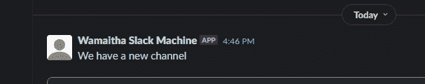

## 结论

在本文中，我们回顾了如何使用 Slack 机器构建 Slack bot。在 [API 文档](https://dondebonair.github.io/slack-machine/api/)中，Slack 机器被塞满了更多的功能。它的灵活性和定制能力帮助用户为特定的业务用例开发更多的应用。

## 使用 [LogRocket](https://lp.logrocket.com/blg/signup) 消除传统错误报告的干扰

[](https://lp.logrocket.com/blg/signup)

[LogRocket](https://lp.logrocket.com/blg/signup) 是一个数字体验分析解决方案，它可以保护您免受数百个假阳性错误警报的影响，只针对几个真正重要的项目。LogRocket 会告诉您应用程序中实际影响用户的最具影响力的 bug 和 UX 问题。

然后，使用具有深层技术遥测的会话重放来确切地查看用户看到了什么以及是什么导致了问题，就像你在他们身后看一样。

LogRocket 自动聚合客户端错误、JS 异常、前端性能指标和用户交互。然后 LogRocket 使用机器学习来告诉你哪些问题正在影响大多数用户，并提供你需要修复它的上下文。

关注重要的 bug—[今天就试试 LogRocket】。](https://lp.logrocket.com/blg/signup-issue-free)**