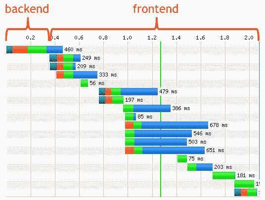
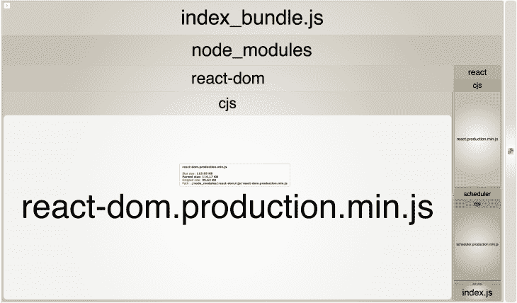
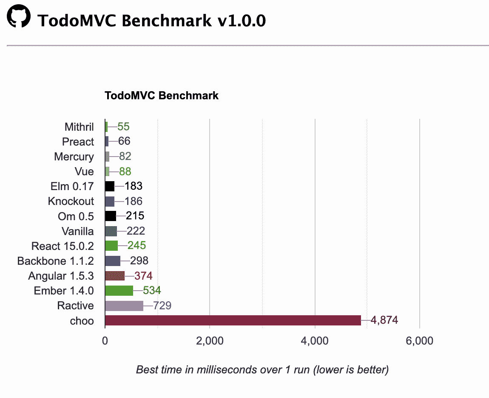
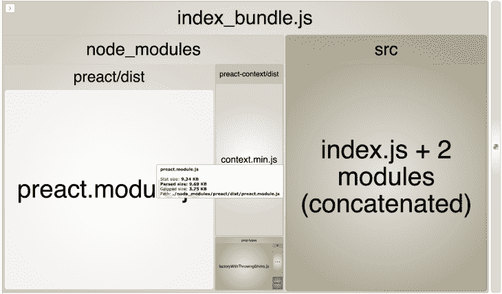

# 减肥你的包大小-日志火箭博客

> 原文：<https://blog.logrocket.com/slimming-down-your-bundle-size/>

即使我们今天有更快的计算机和移动设备，我们作为开发人员也应该考虑我们作为一个整体来构建产品的受众。并不是每个人都可以使用相同类型的快速设备或使用最快的互联网。因此，我们需要更广泛地看待性能问题。可以通过许多不同的方式来追求性能，但是对于本文，我们将重点关注前端性能。我们更仔细地研究了这一方面，并对这一领域可能的改进提出了建议。

## 前端性能

前端性能优化至关重要，因为[它约占用户响应时间](http://www.stevesouders.com/blog/2012/02/10/the-performance-golden-rule/)的 80-90%。因此，当用户等待页面加载时，大约 80-90%的时间是由于前端相关的代码和资产。[下图](http://www.stevesouders.com/)显示了 LinkedIn 要加载的前端/后端资产的比例。



Source: [http://www.stevesouders.com/](http://www.stevesouders.com/)

前端加载时间的很大一部分花费在执行 JavaScript 文件和呈现页面上。但是提高前端性能的一个关键部分是减少应该通过网络下载的 JavaScript 包的大小。JavaScript 包越小，用户访问页面的速度就越快。

[如果我们查看历史数据](https://www.keycdn.com/support/the-growth-of-web-page-size)，我们可以看到 2010 年 JavaScript 文件的平均大小为 2KB。但是随着 JavaScript 的发展，新的 JavaScript 库的引入，像 [Angular](https://angular.io/) 或 [React、](https://reactjs.org/)以及[单页应用](https://en.wikipedia.org/wiki/Single-page_application)的概念，平均 JavaScript 资产大小已经[增加到 2016 年的 357 kb](https://www.keycdn.com/support/the-growth-of-web-page-size)。我们需要利用这些新技术找到更好的解决方案。但是我们也需要考虑一些可能的方法来提高它们的性能，比如减少整个 JavaScript 包的大小。但是在深入这个主题之前，我们需要熟悉 JavaScript 包。它们到底是什么？

## JavaScript 包

您的前端应用程序需要一堆 JavaScript 文件来运行。这些文件可以是内部依赖的格式，就像您自己编写的 JavaScript 文件一样。它们也可以是您用来构建应用程序的外部依赖项和库，如 [React](https://reactjs.org/) 、 [lodash](https://lodash.com/) 或 [jQuery](https://jquery.com/) 。因此，为了让您的页面第一次加载，应用程序需要能够访问这些 JavaScript 文件。那么我们如何揭露他们呢？

在过去，公开 JavaScript 文件的方式要简单得多。大多数网页不需要很多 JavaScript 资源。由于我们无法获得[要求](https://developer.mozilla.org/en-US/docs/Web/JavaScript/Reference/Statements/import)依赖的标准方式，我们不得不依靠使用全局依赖。假设我们既需要 jQuery，也需要保存所有应用程序 JavaScript 逻辑的`main.js`和`other.js`。我们能够公开这些依赖关系的方式如下所示:

```
<script src="/js/main.js"></script>
<script src="/js/other.js"></script>
<script src="//code.jquery.com/jquery-1.12.0.min.js"></script>
```

对于这个问题，这是一个简单的解决方案，但是在扩展应用程序时很快就失控了。例如，如果`main.js`的变化依赖于`other.js`中的代码，我们需要像这样重新排序我们的脚本标签:

```
<script src="/js/other.js"></script>
<script src="/js/main.js"></script>
<script src="//code.jquery.com/jquery-1.12.0.min.js"></script>
```

正如我们所见，大规模管理这样的代码结构会很快变得一团糟。但是过了一段时间，在应用程序中有了更好的解决方案。例如，如果你使用的是 [NodeJS](https://nodejs.org/en/) ，你可以依赖 NodeJS 自己的模块系统(基于 [commonJS 规范](http://wiki.commonjs.org/wiki/Modules/1.1))。这将允许您使用[要求函数](https://nodejs.org/en/knowledge/getting-started/what-is-require/)来要求依赖关系。因此，在节点环境中，我们上面的代码片段应该是这样的:

```
<script>
  var jQuery = require('jquery')
  var main = require('./js/main')
  var other = require('./js/other')
</script>
```

现在，您不仅仅需要几个 JavaScript 文件来运行您的应用程序。您的应用程序的 JavaScript 依赖项可能包括数百或数千个文件，很明显不可能像上面的代码片段那样列出它们。这有几个原因:

*   当应用程序的不同部分需要不同的依赖关系时，将 JavaScript 资产分离到不同的文件中确实需要大量的 HTTP 请求。这将不是高性能的，需要很多时间
*   此外，NodeJS `require`是同步的，但是我们希望它是异步的，并且如果资产还没有下载，就不要阻塞主线程

因此，最好的方法似乎是将所有的 JavaScript 代码放在一个 JavaScript 文件中，并处理其中的所有依赖关系。嗯，这是一个 JavaScript 捆绑器的基本工作。尽管不同的捆扎机对此可以有不同的策略。让我们进一步探讨一下，看看捆扎机是如何做到这一点的。然后，我们将看看是否有额外的改进可以实现更小的包大小，从而获得更高的性能。出于本文的目的，我们将使用 [Webpack](https://webpack.js.org/) 作为捆绑器，这是最著名的选项之一。

## 使用 Webpack 构建示例包

让我们从建立一个简单的 Webpack 项目开始。我们将使用基本包来启动一个简单的 web 应用程序项目。 [React](https://www.npmjs.com/package/react) ， [ReactDOM](https://www.npmjs.com/package/react-dom) 作为 UI 框架， [SWC 作为 Babel](https://blog.logrocket.com/why-you-should-use-swc/) 更快的替代方案用于 transpilation，以及一系列 Webpack 工具和加载器。这就是我们的`[package.json](https://docs.npmjs.com/files/package.json)`的样子:

```
// package.json

{
  "name": "project",
  "version": "1.0.0",
  "main": "index.js",
  "scripts": {
    "test": "echo \"Error: no test specified\" && exit 1",
    "build": "rm -rf ./dist && webpack",
    "start": "webpack-dev-server"
  },
  "keywords": [],
  "author": "",
  "license": "MIT",
  "devDependencies": {
    "@swc/core": "^1.1.39",
    "css-loader": "^3.4.0",
    "html-loader": "^0.5.5",
    "html-webpack-plugin": "^3.2.0",
    "sass-loader": "^8.0.0",
    "style-loader": "^1.1.1",
    "swc-loader": "^0.1.9",
    "webpack": "^4.41.4",
    "webpack-cli": "^3.3.10",
    "webpack-dev-server": "^3.10.1"
  },
  "dependencies": {
    "react": "^16.12.0",
    "react-dom": "^16.12.0",
    "regenerator-runtime": "^0.13.5"
  }
}
```

我们还需要一个 [`webpack.config.js`](https://webpack.js.org/configuration/) ，它是我们的 Webpack 命令的配置入口点。该文件中有几个选项，但让我们澄清几个重要的选项:

*   `[mode](https://webpack.js.org/configuration/mode/)` —这是 Webpack 的一个选项，根据它被传递到的选项，它知道它是否应该进行任何优化。我们稍后将进一步讨论这一点
*   `[output](https://webpack.js.org/configuration/output/)` —该选项告诉 Webpack 应该在根级别将组装的包加载或放置在哪里。它接受路径和文件名
*   `[HTMLWebpackPlugin](https://webpack.js.org/plugins/html-webpack-plugin/)` —此选项有助于我们更轻松地使用 Webpack 捆绑包提供 HTML 文件
*   这些加载器插件帮助你将大多数现代编码语言特性转换成所有浏览器都能理解的代码

```
// global dependencies
const path = require('path');
const HTMLWebpackPlugin = require("html-webpack-plugin");

module.exports = {
  mode: "production",
  // DOC: https://webpack.js.org/configuration/output/
  output: {
    path: path.resolve(__dirname, './dist'),
    filename: 'index_bundle.js'
  },
  // DOC: https://webpack.js.org/configuration/dev-server/
  devServer: {
    contentBase: path.join(__dirname, 'dist'),
    compress: true,
    port: 9000
  },
  module: {
    rules: [
        {
        test: /\.jsx?$/ ,
        exclude: /(node_modules|bower_components)/,
        use: {
            // `.swcrc` in the root can be used to configure swc
            loader: "swc-loader"
        }
      },
      {
        test: /\.html$/,
        use: [
          {
            loader: "html-loader",
            options: { minimize: true }
          }
        ]
      },
      {
        test: /\.scss/i,
        use: ["style-loader", "css-loader", "sass-loader"]
      }
    ]
  },
  plugins: [
    // DOC: https://webpack.js.org/plugins/html-webpack-plugin/
    new HTMLWebpackPlugin({
      filename: "./index.html",
      template: path.join(__dirname, 'public/index.html')
    })
  ]
};
```

## 测量和分析

现在，是时候为我们的 Webpack 构建进行一些初始测量了。当 Webpack 进行编译时，我们需要对构建的模块、编译速度和生成的依赖图进行某种统计。Webpack 已经[为我们提供了工具](https://webpack.js.org/api/stats/)来获取这些统计数据，只需运行一个简单的 CLI 命令:

```
webpack-cli --profile --json > compilation-stats.json
```

通过传递`--json > compilation-stats.json`，我们告诉 Webpack 生成构建统计数据和依赖图，作为一个具有我们指定名称的 json 文件。通过传递`--profile`标志，我们可以获得关于单个模块的更详细的构建统计信息。运行这个命令后，你会得到一个`json`文件，其中包含了很多有用的信息。但是为了使事情变得简单，我们将使用一个推荐的工具来可视化所有这些构建统计数据。你所需要做的就是将`compilation-stats.json`拖到这个[官方分析工具](http://webpack.github.io/analyse/)中的指定区域。这样做之后，我们得到以下结果。

## 网络包分析

我们得到了下表，其中包含关于 Webpack 构建分析的一般信息:

| 用于编译的 Webpack 版本 | 4.43.0 |
| --- | --- |
| 编译特定哈希 | **a770d6c609235bbb24fe** |
| 编译时间(毫秒) | **522** |
| 模块数量 | **8** |
| 组块数量 | **1** |
| 资产数量 | **2** |

## 依赖图

如果我们单击 dependency 部分，我们会得到一个类似的图表，其中显示了我们的应用程序中不同的依赖关系，每个依赖关系的详细信息，以及它们是如何相互连接的。


Dependency Graph

现在，这些构建统计数据非常有用，但是由于我们将只专注于精简和优化我们的包大小，我们将使用一个名为 [webpack-bundle-analyzer](https://github.com/webpack-contrib/webpack-bundle-analyzer) 的专门 Webpack 工具。此工具将允许您可视化 Webpack 输出文件的大小，并向您显示一个交互式的可缩放树状图。让我们为我们的项目设置它。第一件事是安装软件包:

```
npm install --save-dev webpack-bundle-analyzer
```

接下来我们需要做的是在`webpack.config.js`文件中设置相关的配置:

```
const BundleAnalyzerPlugin = require('webpack-bundle-analyzer').BundleAnalyzerPlugin;

module.exports = {
  plugins: [
    new BundleAnalyzerPlugin()
  ]
}
```

现在您所要做的就是在您的`package.json`中挂接一个脚本来运行分析器:

```
"scripts": {
  "bundle-report": "webpack-bundle-analyzer --port 4200 compilation-stats.json"
}
```

因此，在运行`npm run-script bundle-report`之后，我们得到了包中内容的可视化表示，并看到它们中的哪些占据了大部分大小。这是我们项目的情况:



Webpack bundle analyzer

如我们所见，React 依赖项占据了包的大部分大小。让我们看看对此我们能做些什么，来帮助我们减少总的包大小。

## 捆绑包优化#1:在生产模式下运行 Webpack

这种优化包和减少总包大小的策略简单明了。Webpack 有一个产品标志(`-p`)，它很少进行开箱即用的优化。因此，如果我们用下面的命令运行我们的构建脚本，我们应该得到一些优化:

```
// via command-line
 webpack-cli -p

// via package.json script
"scripts": {
  "build": "rm -rf ./dist && webpack -p",
},
```

运行这个之后，我们可以看到我们的包大小将从 **970KB** 减少到 **128KB** 。但是 Webpack 是如何用这样一个简单的命令来管理这种剧烈的优化的呢？这主要有两个原因:

*   在引擎盖下，React 将使用一个名为 [UglifyJS](http://lisperator.net/uglifyjs/) 的插件，该插件通过删除任何不必要的空白或未使用的代码来处理代码缩减和死代码消除。
*   它还将`NODE_ENV`设置为生产。这样，像 React 这样的包就不会包含调试代码

这是减少我们的包大小和减少用户加载时间的一个很好的步骤。让我们看看我们还能做什么。

## 捆绑包优化#2:安装轻量级替代库

React 的包大小仍然有点大(在我们的项目中是 124KB)，即使在我们之前进行了优化之后。在检查 webpack-bundle-analyzer 报告时，我们可以看到 React 占用了我们的包大小的很大一部分。因此，我们将考虑用一个名为 [preact](https://preactjs.com/) 的 React 的更轻版本来替换它，只有 3KB 大小。

当我们将这个包作为依赖项安装时，我们同时获得了 React API 的核心和 DOM 支持；作为一个额外的步骤，我们可以安装 [preact-compat](https://github.com/preactjs/preact-compat) 作为 2KB 大小的 react 的兼容层。这样，在我们的项目中，我们可以直接使用 preact 来替代 react。Preact 比 react 更具性能，正如我们在下面不同库之间的性能比较中所看到的，这些库用于构建一个简单的“待办事项”MVC 基准:



Source: [https://developit.github.io/](https://developit.github.io/)

所以现在，我们将为我们的项目安装 Preact，看看它如何影响我们的包大小。我们首先安装 preact 和 preact-compat:

```
npm install preact preact-compat
```

然后我们只需要在`wepack.config.js`中设置`alias` config，使这个库与所有 React 代码兼容:

```
// webpack.config.js

resolve: {
  alias: {
    "react": "preact-compat",
    "react-dom": "preact-compat"
  }
},
```

因此，在设置并运行我们的`npm run-script bundle-report`之后，我们得到了下面的包分析。在这个交互图中，我们可以看到，与之前的 124KB 相比，React 相关的包大小现在缩小到了 23KB 左右。这对我们来说是一个很大的缩减:



使用`webpack-bundle-analyzer`可以让我们直观地看到应用程序中安装的包。如果一个包占用了很多空间，我们可以考虑用一个更轻的版本库来代替它(就像我们上面做的)。

## 结论

到目前为止，我们能够将我们的包的大小从 970Kb 减少到 23KB，这是我们的包大小的 42 倍。此外，请记住，我们的项目结构和依赖项都很小，但是主动为更大更复杂的项目减少捆绑包的大小会更有益。

下面是一些潜在的后续步骤，您可以采取这些步骤来减少包的大小和加载时间，并提高性能。

*   考虑重写大型库，因为您可能不需要它的所有功能。例如，许多开发人员使用 [Moment.js](https://momentjs.com/) 来解析和验证 JavaScript 中的日期，这是一个很大的问题，但是并不是每个人都需要整个库来进行简单的日期解析。考虑编写简单的实用函数，而不是依赖大型库
*   检查您是否仅使用库的一个功能模块，该模块可以单独导入，而无需导入整个库。这个用例的一个很好的例子是 [lodash](https://lodash.com/) ，您可以单独导入它的任何库实用函数
*   最后考虑[代码拆分](https://webpack.js.org/guides/code-splitting/)。并不是每一个依赖项都需要在每次页面加载时加载，所以将它们单独捆绑在一起是有意义的。例如，外部 NPM 依赖项不会像我们的应用程序代码那样改变很多。因此，将它们分割成一个单独的包将允许浏览器在它们没有被改变时缓存它们，从而减少每次页面加载需要加载的包的数量

## 资源

使用 LogRocket 消除传统反应错误报告的噪音

## 是一款 React analytics 解决方案，可保护您免受数百个误报错误警报的影响，只针对少数真正重要的项目。LogRocket 告诉您 React 应用程序中实际影响用户的最具影响力的 bug 和 UX 问题。

[LogRocket](https://lp.logrocket.com/blg/react-signup-issue-free)

自动聚合客户端错误、反应错误边界、还原状态、缓慢的组件加载时间、JS 异常、前端性能指标和用户交互。然后，LogRocket 使用机器学习来通知您影响大多数用户的最具影响力的问题，并提供您修复它所需的上下文。

[ ](https://lp.logrocket.com/blg/react-signup-general) [  ](https://lp.logrocket.com/blg/react-signup-general) [LogRocket](https://lp.logrocket.com/blg/react-signup-issue-free)

关注重要的 React bug—[今天就试试 LogRocket】。](https://lp.logrocket.com/blg/react-signup-issue-free)

Focus on the React bugs that matter — [try LogRocket today](https://lp.logrocket.com/blg/react-signup-issue-free).