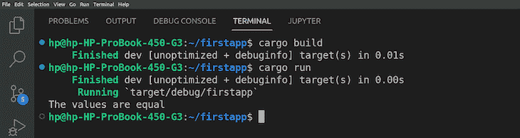
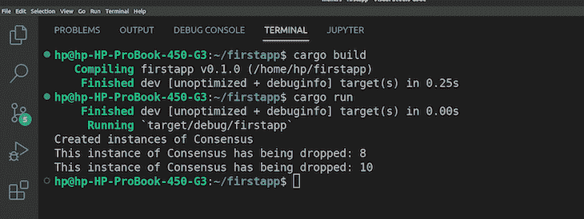
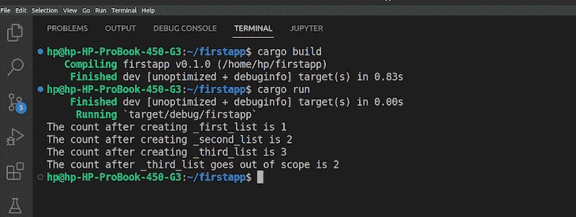
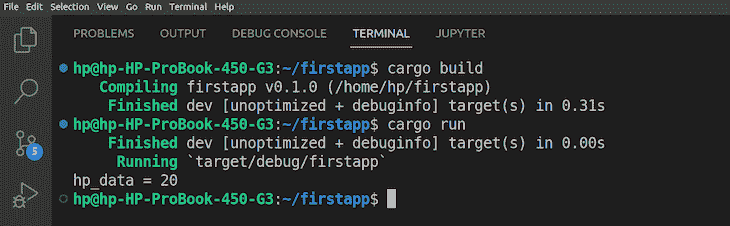
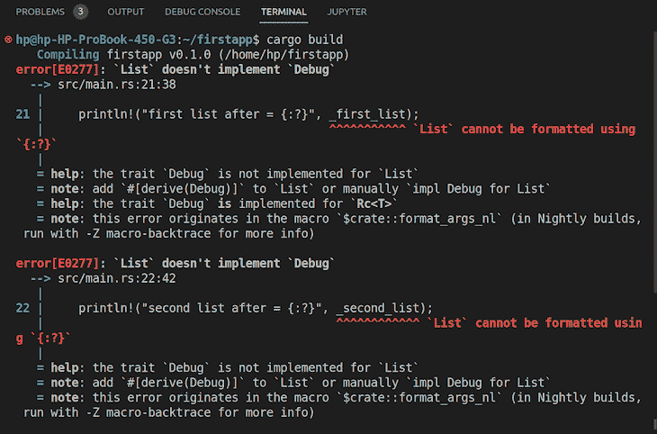
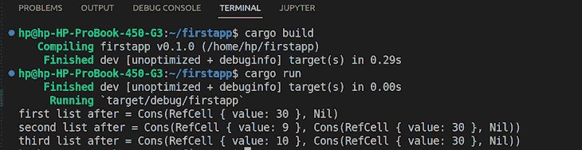

# 理解 Rust 中的智能指针

> 原文：<https://blog.logrocket.com/smart-pointers-rust/>

当管理堆或栈上的数据时，开发人员可以使用传统的指针方法。然而，使用这些指针方法也有缺点，比如当动态分配的对象没有被及时垃圾收集时，会导致内存泄漏。好消息是，有更好的内存管理方法可以自动处理垃圾收集，并且没有运行时开销，它们被称为智能指针。

[Rust](https://www.rust-lang.org/) 是一种开源、低级、面向对象、静态类型的编程语言，具有高效的内存管理，可确保高性能和安全性。它具有广泛的功能，许多组织使用这些功能来构建高度安全和强大的应用程序，包括 web、移动、游戏和网络应用程序。

本文将让您了解什么是智能指针，它们的用例，以及它们在 Rust 中的实现。包含的代码示例将向您介绍 Rust 的各种类型的智能指针。

向前跳:

## 什么是智能指针？

智能指针是[抽象数据类型](https://en.wikipedia.org/wiki/Abstract_data_type)，其行为类似于编程中的常规[指针](https://docs.microsoft.com/en-us/cpp/cpp/pointers-cpp?view=msvc-170)(存储值的内存地址的变量)，加上额外的功能，如析构函数和重载运算符。它们还包括自动内存管理来解决像内存泄漏这样的问题。

当开发人员将包含动态分配数据的内存与智能指针链接时，它们会被自动释放或清理。

一些智能指针用例包括:

*   自动释放数据和析构对象
*   检查超出界限的数据或变量
*   减少与使用常规指针相关的错误
*   在释放数据后保持程序的效率
*   跟踪程序的数据/对象/变量的所有内存地址
*   在程序应用中管理网络连接

## 智能指针如何在 Rust 中工作

Rust 通过一个名为[所有权](https://doc.rust-lang.org/book/ch04-01-what-is-ownership.html)的系统(或一组规则)来实现内存管理，它包含在应用程序的程序中，并在程序成功编译之前由编译器检查，不会导致任何停机。

通过使用[结构](https://doc.rust-lang.org/std/keyword.struct.html)，Rust 执行智能指针。在前面提到的智能指针的附加功能中，它们还具有拥有值本身的功能。

接下来，您将了解一些有助于定制 Rust 中智能指针操作的特征。

## `Deref`特质

[`Deref`](https://doc.rust-lang.org/std/ops/trait.Deref.html) 特征用于有效的解引用，使得能够容易地访问存储在智能指针后面的数据。您可以使用`Deref`特征将智能指针视为引用。

解引用一个操作符意味着使用一元操作符`*`作为从一元引用操作符`&`标记为“referencing”的指针导出的内存地址的前缀表达式可以是可变的(`&mut`)或不可变的(`*mut`)。对内存地址使用解引用操作符将从指针返回值的位置。

因此，`Deref`特征只是定制了解引用操作符的行为。

下面是对`Deref`特征的说明:

```
fn main() {
        let first_data = 20;
        let second_data = &first_data;

        if first_data == *second_data {
                println!("The values are equal");
      } else {
             println!("The values are not equal");
     }
}

```

上面代码块中的函数实现了以下内容:

*   将`20`的值存储在`first_data`变量中
*   `second_data`变量使用引用操作符`&`来存储`first_data`变量的内存地址
*   检查`first_data`的值是否等于`second_data`的值的条件。在`second_data`上使用解引用操作符`*`来获取存储在指针内存地址中的值

下面的屏幕截图显示了代码的输出:



## `Drop`特质

[`Drop`](https://doc.rust-lang.org/std/ops/trait.Drop.html) 特征类似于`Deref`特征，但用于析构，Rust 通过清理程序不再使用的资源来自动实现。因此，`Drop`特征被用在一个指针上，它存储未使用的值，然后释放该值所占用的内存空间。

要使用`Drop`特征，您需要用一个可变引用实现`drop()`方法，该方法对不再需要或超出范围的值执行销毁，定义如下:

```
fn drop(&mut self) {};

```

为了更好地理解`Drop`特征是如何工作的，请看下面的例子:

```
struct Consensus  {
        small_town: i32
}

impl Drop for Consensus {
        fn drop(&mut self) {
                println!("This instance of Consensus has being dropped: {}", self.small_town);
}
}

fn main() {
        let _first_instance = Consensus{small_town: 10};
        let _second_instance = Consensus{small_town: 8};

        println!("Created instances of Consensus");
}
The code above implements the following:
```

*   创建一个包含名为`small_town`的 32 位有符号整数类型值的结构
*   包含带有可变引用的`drop()`方法的`Drop`特征是通过 struct 上的 [`impl`](https://doc.rust-lang.org/std/keyword.impl.html) 关键字实现的。当`main()`函数中的实例超出范围时(即当`main()`函数中的代码结束运行时)，将`println!`语句中的消息打印到控制台
*   `main()`函数简单地创建了两个`Consensus`实例，并在创建后将`println!`中的消息打印到屏幕上

下面的截图显示了代码的输出:

## Rust 中智能指针的类型及其用例

Rust 中存在几种类型的智能指针。在本节中，您将通过代码示例了解其中的一些类型及其用例。它们包括:

## `Rc<T>`智能指针

`[Rc<T>](https://doc.rust-lang.org/book/ch15-04-rc.html)`代表引用计数智能指针类型。在 Rust 中，每个值每次都有一个所有者，一个值有多个所有者违反了[所有权规则](https://doc.rust-lang.org/book/ch04-01-what-is-ownership.html#ownership-rules)。但是，当您声明一个值并在代码中的多个地方使用它时，引用计数类型允许您为变量创建多个引用。

顾名思义，引用计数智能指针类型记录了代码中每个变量的引用次数。当引用的计数返回零时，它们就不再被使用，智能指针会清除它们。

在下面的示例中，您将创建三个列表，它们与一个列表共享所有权。第一个列表将有两个值，第二个和第三个列表将第一个列表作为它们的第二个值。这意味着后两个列表将与第一个列表共享所有权。首先，您将在`use`语句中包含 [`Rc<T>`前奏](https://doc.rust-lang.org/stable/std/rc/struct.Rc.html)，这将允许您访问代码中可用的所有 RC 方法。

然后你会:

*   用关键字`enum`和`List{}`定义一个列表
*   用`Cons()`创建一对构造来保存引用计数值的列表
*   为定义的列表声明另一个`use`语句
*   创建一个 main 函数来实现以下内容:
    *   构建新的引用计数列表作为第一个列表
    *   通过将第一个列表的引用作为参数传递来创建第二个列表。使用 [`clone()`](https://doc.rust-lang.org/std/clone/trait.Clone.html) 函数，创建一个新的指针，指向第一个列表中值的分配
    *   通过调用`[Rc::strong_count()](https://docs.rs/rc/0.1.1/rc/fn.strong_count.html)`函数，在每个列表后打印参考计数

在您喜欢的代码编辑器中键入以下代码:

```
use std::rc::Rc;

enum List {
   Cons(i32, Rc<List>), Nil,
}

use List::{Cons, Nil};

fn main() {
   let _first_list = Rc::new(Cons(10, Rc::new(Cons(20, Rc::new(Nil)))));
   println!("The count after creating _first_list is {}", Rc::strong_count(&_first_list));
   let _second_list = Cons(8, Rc::clone(&_first_list));
   println!("The count after creating _second_list is {}", Rc::strong_count(&_first_list));
   { 
       let _third_list = Cons(9, Rc::clone(&_first_list));
       println!("The count after creating _third_list is {}", Rc::strong_count(&_first_list));
   }

   println!("The count after _third_list goes out of scope is {}", Rc::strong_count(&_first_list));
}

```

运行代码后，结果将如下所示:



## `Box<T>`智能指针

在 Rust 中，数据分配通常在堆栈中完成。然而，Rust 中的一些方法和智能指针类型使您能够在堆中分配数据。其中一种类型是 [`Box<T>`智能指针](https://doc.rust-lang.org/book/ch15-01-box.html)；“< T >代表数据类型。要使用 Box 智能指针在堆中存储一个值，您可以将这段代码:`Box::new()`括起来。例如，假设您在堆中存储一个值:

```
fn main() {
        let stack_data = 20;
        let hp_data = Box::new(stack_data); // points to the data in the heap
        println!("hp_data = {}", hp_data);  // output will be 20.
}

```

从上面的代码块中，请注意:

*   值`stack_data`存储在一个堆中
*   盒子智能指针`hp_data`存储在堆栈中

此外，通过在`hp_data`前面使用星号(*)，可以很容易地取消对存储在堆中的数据的引用。代码的输出将是:



## `RefCell<T>`智能指针

`RefCell<T>`是一种智能指针类型，它在运行时而不是编译时执行借用规则。在编译时，Rust 中的开发人员可能会遇到“借用检查器”的问题，由于不符合 Rust 的所有权规则，他们的代码仍然没有编译。

将带有值的变量绑定到另一个变量并使用第二个变量会在 Rust 中产生错误。Rust 中的[所有权规则](https://doc.rust-lang.org/book/ch04-01-what-is-ownership.html)确保每个值都有一个所有者。在绑定的所有权被移动后，你就不能使用它了，因为 Rust 会为每个绑定创建一个引用，除非使用 [`Copy`特征](https://doc.rust-lang.org/std/marker/trait.Copy.html)。

Rust 中的借用规则需要借用所有权作为引用，可以有一个或多个对资源的引用(`&T`)或者一个可变引用(`&mut T`)。

然而，Rust 中一个叫做“内部可变性”的设计模式允许你用不可变的引用来改变这个数据。`RefCell<T>`使用这种“内部可变性”设计模式，在数据中使用[不安全代码](https://doc.rust-lang.org/stable/nomicon/index.html)，并在运行时实施借用规则。

使用`RefCell<T>`，可以在运行时检查可变和不可变借位。因此，如果您的代码中有几个不可变引用的数据，使用`RefCell<T>`，您仍然可以改变数据。

在前面的`Rc<T>`部分，您使用了一个实现多个共享所有权的例子。在下面的例子中，您将通过在定义`Cons`时将`Rc<T>`包裹在`RefCell<T>`周围来修改`Rc<T>`代码示例:

```
#[derive(Debug)]
enum List {
  Cons(Rc<RefCell<i32>>, Rc<List>), Nil,
}
use List::{Cons, Nil};
use std::cell::RefCell;
use std::rc::Rc;
fn main() {
   let data = Rc::new(RefCell::new(10));

   let _first_list = Rc::new(Cons(Rc::clone(&data), Rc::new(Nil)));

   let _second_list = Cons(Rc::new(RefCell::new(9)), Rc::clone(&_first_list));

   let _third_list = Cons(Rc::new(RefCell::new(10)), Rc::clone(&_first_list));

   *data.borrow_mut() += 20;

   println!("first list after = {:?}", _first_list);
   println!("second list after = {:?}", _second_list);
   println!("third list after = {:?}", _third_list);
}

```

上面的代码实现了以下内容:

*   用在`Cons`中定义的`Rc<RefCell<i32>>`创建`data`
*   创建共享所有权为`data`的`_first_list`
*   创建另外两个列表，`_second_list`和`_third_list`，它们与`_first_list`共享所有权
*   对数据调用 [`borrow_mut()`](https://doc.rust-lang.org/std/borrow/trait.BorrowMut.html) 函数(该函数返回`[RefMut<T>](https://doc.rust-lang.org/std/cell/struct.RefMut.html)`智能指针),并使用解引用操作符`*`解引用`Rc<T>`,从 RefCell 获取内部值，并对该值进行变异

请注意，如果您没有将 [`#[derive(Debug)]`](https://doc.rust-lang.org/rust-by-example/hello/print/print_debug.html) 作为代码的第一行，您将会遇到以下错误:



一旦代码运行，第一个列表、第二个列表和第三个列表的值将发生变化:



## 结论

在本文的结尾，您已经了解了智能指针，包括它们的用例。我们介绍了智能指针如何在 Rust 中工作以及它们的特征(`Deref`特征和`Drop`特征)。您还了解了 Rust 中的一些智能指针类型和用例，包括`Rc<T>`、`Box<T>`和`RefCell<T>`。

## [log rocket](https://lp.logrocket.com/blg/rust-signup):Rust 应用的 web 前端的全面可见性

调试 Rust 应用程序可能很困难，尤其是当用户遇到难以重现的问题时。如果您对监控和跟踪 Rust 应用程序的性能、自动显示错误、跟踪缓慢的网络请求和加载时间感兴趣，

[try LogRocket](https://lp.logrocket.com/blg/rust-signup)

.

[](https://lp.logrocket.com/blg/rust-signup)

LogRocket 就像是网络和移动应用程序的 DVR，记录你的 Rust 应用程序上发生的一切。您可以汇总并报告问题发生时应用程序的状态，而不是猜测问题发生的原因。LogRocket 还可以监控应用的性能，报告客户端 CPU 负载、客户端内存使用等指标。

现代化调试 Rust 应用的方式— [开始免费监控](https://lp.logrocket.com/blg/rust-signup)。