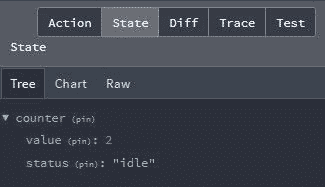
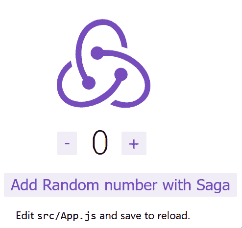

# 使用 Redux Toolkit 的智能 Redux-log rocket 博客

> 原文：<https://blog.logrocket.com/smarter-redux-redux-toolkit/>

***编者按:*** *本文于 2022 年 4 月 22 日更新，包含关于 Redux-Saga 和 Redux Toolkit 的最新信息。*

当 Redux 第一次出现在前台时，许多人认为它是我们所有状态管理问题的解决方案。它与 React 的联系如此之深，以至于人们开始相信没有 Redux 的 React 在某种程度上是不完整的，尽管这个想法被 Redux 的创造者 Dan Abramov 断然拒绝。

渐渐地，开发人员开始意识到 Redux 的局限性，这导致了一系列关于是否有更好的方法来管理全局状态的辩论——事实上，Redux 是否是一个可行的解决方案。

### 内容

许多反对 Redux 的论点都源于许多观点和“最佳实践”,这些观点和“最佳实践”后来被视为需求。(实际上，裸形式的 Redux[非常简单](https://blog.isquaredsoftware.com/2017/05/idiomatic-redux-tao-of-redux-part-1/#the-core-of-redux-createstore)并且容易理解。)但最受欢迎和持久的批评之一是 Redux 添加到应用程序中的代码量，许多人认为这是不必要的。

这些争论导致了 [Redux Toolkit (RTK)](https://redux-toolkit.js.org/) 的开发，“用于高效 Redux 开发的官方的、固执己见的、包含电池的工具集。”Redux 团队为此付出了巨大的努力，毫无疑问，已经取得了显著的成果。

RTK 解决了许多与样板文件和不必要的代码相关的争论。正如其官方文件中提到的，它有助于解决人们对 Redux 的三个主要问题:

1.  “配置 Redux 存储太复杂”
2.  “我必须添加许多包才能让 Redux 做任何有用的事情”
3.  “Redux 需要太多样板代码”

在这里，我们将看到如何利用 RTK 的 API 来使我们的 Redux 应用程序更小但仍然强大。我们将使用 React 和 RTK 模板来引导我们的应用程序。

我们的应用程序将具有以下容器架构:

*   Redux，用于状态管理
*   [R](https://react-redux.js.org/) [eact-Redux](https://react-redux.js.org/) ，用于从全局存储和调度动作中选择状态
*   [Immer](https://github.com/immerjs/immer) ，用于处理店内不变性

稍后，我们将安装 Redux-Saga，看看它如何用于异步任务。

> 一个重要的注意事项:Redux Thunk 可以作为异步任务的默认选项与 RTK 一起使用，强烈推荐用于简单的数据获取任务。你可以在这里找到它的指南[。然而，在本文中，我们将使用 Redux-Saga 来更好地理解中间件与 RTK 的集成。如果你不熟悉传奇，那么这篇文章](https://redux-toolkit.js.org/tutorials/advanced-tutorial#thinking-in-thunks)[非常值得一读。](https://blog.logrocket.com/understanding-redux-saga-action-creators-sagas/)

你可以在这里找到应用程序[的源代码。](https://github.com/Chinwike1/rtk-w-redux-saga)

Redux 最常被讨论的缺陷之一是将其集成到现有应用程序中所需要的努力。Redux Toolkit 提供了用 Redux Toolkit 引导 React 应用程序的选项。

为此，请在终端中运行以下命令:

```
npx create-react-app my-redux-app --template redux

```

下载完成后，在文本编辑器中打开应用程序，我们将检查使 Redux `store`起作用的关键文件:

```
// store.js
import { configureStore } from '@reduxjs/toolkit'
import counterReducer from '../features/counter/counterSlice'

export const store = configureStore({
  reducer: {
    counter: counterReducer,
  },
  // other options e.g middleware, go here
})

```

位于`app/store.js`的 Redux store 是我们的 Redux 工具包应用程序的中心站。这个文件利用了 RTK 的`configureStore` API，根据 RTK 文档，它是标准 Redux `createStore`函数的友好抽象。它为商店设置添加了良好的默认值，以获得更好的开发体验。

`configureStore`接受带有多个参数的单个配置对象，最重要的是`reducer`。

`reducer`是一个对象，它在我们的应用程序中存储不同的`slices`，并在 Redux store 中反映它，正如通过 [Redux DevTools 扩展](https://www.google.com/url?sa=t&rct=j&q=&esrc=s&source=web&cd=&cad=rja&uact=8&ved=2ahUKEwjX9Za5ovr2AhXNgf0HHWiFBecQFnoECAYQAQ&url=https%3A%2F%2Fchrome.google.com%2Fwebstore%2Fdetail%2Fredux-devtools%2Flmhkpmbekcpmknklioeibfkpmmfibljd%3Fhl%3Den&usg=AOvVaw0nx2UHMZL6wwwf2BNRTg5T)所看到的。



在我们的模板中,`counterSlice`被添加到`reducer`对象中——关于什么是切片的更多解释很快就会出现。

为了使我们应用程序中的所有组件都可以访问我们存储中的数据，来自`react-redux`的`Provider`组件用于包装整个应用程序，将 Redux 存储作为`store`属性的值:

```
// index.js
import React from 'react';
import ReactDOM from 'react-dom';
import './index.css';
import App from './App';
import { store } from './app/store';
import { Provider } from 'react-redux';

ReactDOM.render(
  <React.StrictMode>
    <Provider store={store}>
      <App />
    </Provider>
  </React.StrictMode>,
  document.getElementById('root')
);

```

尽管 Redux 不依赖于文件的结构，但它在大型应用程序的维护中起着重要的作用。最好根据功能而不是文件类型对文件进行分组。

广泛采用的 ducks 模式建议将所有 Redux 功能保存在一个文件中。如果需要，这个文件将默认导出一个 reducer 函数以及所有的动作、创建者和常量。它还建议了动作类型的模式。

这个名字来自 Redux 的最后一部分——dux——并且已经成为 Redux 应用程序强烈推荐的模式。

RTK 遵循 ducks 模式，在一个名为 slice 的文件中组合了 reducers、actions 和 constants。每个切片将为存储中的对象提供初始状态和缩减器功能:

```
// counterSlice.js
import { createAsyncThunk, createSlice } from '@reduxjs/toolkit';
import { fetchCount } from './counterAPI';
const initialState = {
  value: 0,
  status: 'idle',
};

// asynchronous function with createAsyncThunk
export const incrementAsync = createAsyncThunk(
  'counter/fetchCount',
  async (amount) => {
    const response = await fetchCount(amount);
    return response.data;
  }
);

// Redux Toolkit slice
export const counterSlice = createSlice({
  name: 'counter',
  initialState,
  // The `reducers` field lets us define reducers and generate associated actions
  reducers: {
    increment: (state) => {
      // Redux Toolkit allows us to write "mutating" logic in reducers. It
      // doesn't actually mutate the state because it uses the Immer library,
      // which detects changes to a "draft state" and produces a brand new
      // immutable state based off those changes
      state.value += 1;
    },
    decrement: (state) => {
      state.value -= 1;
    },
    incrementByAmount: (state, action) => {
      state.value += action.payload;
    },
  },
  // The `extraReducers` field lets the slice handle actions defined elsewhere,
  // including actions generated by createAsyncThunk or in other slices.
  extraReducers: (builder) => {
    builder
      .addCase(incrementAsync.pending, (state) => {
        state.status = 'loading';
      })
      .addCase(incrementAsync.fulfilled, (state, action) => {
        state.status = 'idle';
        state.value += action.payload;
      });
  },
});
export const { increment, decrement, incrementByAmount } = counterSlice.actions;
// more code...
export default counterSlice.reducer;

```

`counterSlice`文件使用 RTK 的`createSlice`方法。这个方法返回一个带有 reducers 和动作的对象，这些动作可以用于其他中间件的注入。

## `createSlice`

Redux Toolkit 可以使用它的`createSlice` API 替换一系列动作/reducer/常量。它是生成存储片的辅助方法。它采用切片的名称、初始状态和一个 reducer 函数来返回一个 reducer、动作类型和动作创建者。

作为回报，它为我们提供了切片、动作创建者和 reducer 函数的名称。所有这些都可以用于切片的注入、调度动作和其他情况，这取决于实现。

查看`counterSlice.js`，我们可以看到`createSlice`返回一个带有名称和 reducers 的对象，该对象可以从我们应用程序中的任何地方发送，如下所示:

```
// Counter.js
import React, { useState } from 'react';
import { useDispatch } from 'react-redux';
import {
  increment,
} from './counterSlice';
import styles from './Counter.module.css';
export function Counter() {
  const dispatch = useDispatch();

  return (
    <div>
      <div className={styles.row}>
        <button
          className={styles.button}
          aria-label="Increment value"
          onClick={() => dispatch(increment())}
        >
          +
        </button>
      </div>
    </div>
  );
}

```

以下是关于`createSlice`方法参数的一些细节:

### `name: string`

一个名称，用作存储中切片的 ID，也用作此缩减器的操作类型的前缀。这唯一标识存储中的切片。

### `initialState: any`

减速器的初始状态。

### `reducers: Object<string, ReducerFunction | ReducerAndPrepareObject>`

RTK 中的归约器是对象，其中键用作动作类型，函数是与这些类型相关联的归约器。该键还用作动作类型的后缀，因此最终的动作类型变成了`${name}/${actionKey}`。

在底层，这个对象被传递给`[createReducer]([https://redux-toolkit.js.org/api/createReducer](https://redux-toolkit.js.org/api/createReducer))`，这是一个 RTK 实用程序，用于简化 reducers 的定义。它允许我们将 reducers 定义为一个函数查找表来处理每种动作类型。这有助于避免动作创建者函数的样板代码。

推荐在 reducers 中使用不可变的状态管理，Immer 是最流行这样做的库之一。RTK 允许你使用点符号改变状态，并在引擎盖下使用 Immer。更准确地说，`createSlice`和`createReducer`用来自 Immer 的`produce`包装你的减速器功能。

* * *

### 更多来自 LogRocket 的精彩文章:

* * *

### `extraReducers`

这也是一个 case reducer 函数，但是用于除此切片之外的操作。每个切片缩减器在全局存储中拥有自己的切片，但它可以响应任何动作类型，包括由另一个切片生成的动作。

这个 API 将允许我们在调度另一个片生成的动作时改变当前片的状态。减速器会通过同一个`createReducer` API，允许安全变异。

## 使用 React-Redux 从存储中访问数据

使用 React-Redux(已经包含在模板中)，我们可以访问两个重要的钩子:`useSelector`和`useDispatch`。这些钩子允许我们从 Redux 存储中读取数据，并将任何片上的动作分派到我们的组件中:

```
// Counter.js
import React, { useState } from 'react';
import { useSelector, useDispatch } from 'react-redux';
import {
  decrement,
  increment,
  incrementByAmount,
  incrementAsync,
  incrementIfOdd,
  selectCount,
} from './counterSlice';
import styles from './Counter.module.css';
export function Counter() {
  const count = useSelector(selectCount);
  const dispatch = useDispatch();
  const [incrementAmount, setIncrementAmount] = useState('2');
  const incrementValue = Number(incrementAmount) || 0;
  return (
    <div>
      <div className={styles.row}>
        <button
          className={styles.button}
          aria-label="Decrement value"
          onClick={() => dispatch(decrement())}
        >
          -
        </button>
        <span className={styles.value}>{count}</span>
        <button
          className={styles.button}
          aria-label="Increment value"
          onClick={() => dispatch(increment())}
        >
          +
        </button>
      </div>
      <div className={styles.row}>
        <input
          className={styles.textbox}
          aria-label="Set increment amount"
          value={incrementAmount}
          onChange={(e) => setIncrementAmount(e.target.value)}
        />
        <button
          className={styles.button}
          onClick={() => dispatch(incrementByAmount(incrementValue))}
        >
          Add Amount
        </button>
        <button
          className={styles.asyncButton}
          onClick={() => dispatch(incrementAsync(incrementValue))}
        >
          Add Async
        </button>
        <button
          className={styles.button}
          onClick={() => dispatch(incrementIfOdd(incrementValue))}
        >
          Add If Odd
        </button>
      </div>
    </div>
  );
}

```

我们已经讨论了 RTK 中的两个主要 API，它们对大多数情况都很有用。在幕后，这些 API 利用了其他实用程序，这些实用程序也可以单独使用:

### `createAction`

使用 Redux，我们需要定义一个表示动作类型的常量，然后定义一个函数来创建该类型的动作。尽管 Redux 并不要求这样做，但这有助于我们保持不同存储文件之间的同步。

有了这个 API，多重声明的麻烦就没有了。它接受动作类型并返回该类型的动作创建者。返回的动作创建者是用一个参数调用的，这个参数将作为一个有效负载。

这里有一个简单的例子:

```
const increment = createAction('counter/INCREMENT');
// increment() -> { type: 'counter/INCREMENT' }
// increment(5) -> { type: 'counter/increment', payload: 3 }
// increment.toString() -> 'counter/INCREMENT'
// console.log(increment) -> counter/INCREMENT

```

对于更复杂的情况，它还接受另一个参数，一个用于自定义操作创建逻辑的函数。这个例子很容易理解:

```
const addTodo = createAction('todos/ADD, function prepare(text) {
  return {
    payload: {
      text,
      createdAt: new Date().toISOString()
    }
  }
})

console.log(addTodo('Some text'))
/**
 * {
 *   type: 'todos/ADD',
 *   payload: {
 *     text: 'Some text',
 *     createdAt: '2019-10-03T07:53:36.581Z'
 *   }
 * }
 **/

```

### `createReducer`

如上所述，这是`createSlice`法中的特色酱料之一。它帮助我们编写一个更简单的 reducer。这移除了与 case reducers 相关联的样板代码，并允许我们将 reducer 编写为函数查找表来处理每种动作类型。利用 Immer 的力量，使变异状态更加直观。

它有两个参数:第一个是初始状态，另一个是从动作类型到 reducers 的对象映射。

一个简单的计数器缩减器，以前可能是这样的:

```
function counterReducer(state = 0, { type, payload }) {
  switch (type) {
    case 'increment':
      return state + payload
    case 'decrement':
      return state - payload
    default:
      return state
  }
}

```

现在看起来像这样:

```
const counterReducer = createReducer(0, {
  increment: (state, { payload }) => state + payload,
  decrement: (state, { payload }) => state - payload
})

```

使用`createAction` API 创建的动作可以用作键。

### 用 Redux 工具包使用 Redux-Saga

Redux Saga 是一个中间件库，用于允许 Redux 存储与外部资源异步交互。这包括向外部服务发出 HTTP 请求、访问浏览器存储和执行 I/O 操作。这些操作也被称为副作用。

尽管 RTK 的`createAsyncThunk`可以创建异步函数，sagas 更强大，也更容易测试，但是它们引入了许多新概念，如果你还在学习其他技术，这些新概念可能会有点让人不知所措。这篇 StackOverflow 帖子简洁地解释了 Redux Thunk 和 Redux-Saga 之间的[差异。](https://stackoverflow.com/questions/50285972/what-is-the-difference-between-redux-thunk-and-redux-saga)

在您的终端中运行以下命令来安装 Redux-Saga 和 Axios，它们将用于数据获取:

```
npm install Redux-Saga axios

```

现在你可以像这样在你的 Redux 商店里使用 Redux-Saga:

```
// store.js
import { configureStore } from '@reduxjs/toolkit'
import createSagaMiddleware from 'Redux-Saga'
import counterReducer from '../features/counter/counterSlice'
import saga from '../sagas/saga'

let sagaMiddleware = createSagaMiddleware()
const middleware = [sagaMiddleware]

export const store = configureStore({
  reducer: {
    counter: counterReducer,
  },
  middleware: (getDefaultMiddleware) =>
    getDefaultMiddleware().concat(middleware),
})

sagaMiddleware.run(saga)

```

Redux-Saga 提供了一个用于实例化`sagaMiddleware`的`createSagaMiddle`函数。因为`configureStore` API 中的`middleware`参数是现有中间件的数组，所以我们可以通过`getDefaultMiddleware`回调来获取当前中间件，并将我们的新 Saga 中间件连接到该数组。

最后，我们在我们的传奇故事的`sagaMiddleware`上使用`run`函数，我在下面的路径中创建了这个传奇故事:`sagas/saga.js`。

### 还原传奇效应

`Redux-Saga`提供了许多效果，这些效果是给中间件执行某些操作的指令。其中包括:

*   `takeEvery (actionType, saga)`在发送到商店的每个动作上产生一个与`actionType`匹配的`saga`，例如`FETCH_USER_DETAILS`
*   `call (fn, …args)`创建一个效果描述，指示中间件调用带有`args`参数的函数`fn`,如果有的话
*   `put: (action)`创建一个效果描述，指示中间件调度一个动作到商店

将此应用于我们的应用程序，我们可以创建一个 saga，它从一个 API 异步获取一个随机数，然后使用来自`counterSlice`的`incrementByAmount`缩减器将计数器值增加来自外部 API 的值:

```
// saga.js
import { call, takeEvery, put } from 'Redux-Saga/effects'
import Axios from 'axios'
import { incrementByAmount } from '../features/counter/counterSlice'
import { sagaActions } from './sagaActions'

// function uses axios to fetch data from our api
let callAPI = async ({ url, method, data }) => {
  return await Axios({
    url,
    method,
    data,
  })
}

export function* fetchNumberSaga() {
  try {
    let result = yield call(() =>
      callAPI({
        url: 'http://www.randomnumberapi.com/api/v1.0/random?min=100&max=1000&count=1',
      })
    )
    yield put(incrementByAmount(result.data[0]))
  } catch (e) {
    yield put({ type: 'NUMBER_SAGA_FAILED' })
  }
}
export default function* rootSaga() {
  yield takeEvery(sagaActions.FETCH_NUMBER_SAGA, fetchNumberSaga)
}

```

这里，`call`效果用于向外部 API 发出请求，`put`用于用 reducer 函数更新存储。

在前面的异步请求发出后，`takeEvery`创建一个 saga，监视任何类型为`FETCH_NUMBER_SAGA`的动作，引用为来自`sagaActions.js`的`sagaActions.FETCH_NUMBER_SAGA`:

```
// sagas/sagaActions.js
export const sagaActions = {
  FETCH_NUMBER_SAGA: 'FETCH_NUMBER_SAGA',
}

```

有了我们的第一个 saga now 设置，我们可以从`Counter`组件调度它，如下所示:

```
// Counter.js
import React, { useState } from 'react'
import { useSelector, useDispatch } from 'react-redux'
import {
  decrement,
  increment,
  incrementByAmount,
  incrementAsync,
  incrementIfOdd,
  selectCount,
} from './counterSlice'
import styles from './Counter.module.css'
import { sagaActions } from '../../sagas/sagaActions'
export function Counter() {
  const count = useSelector(selectCount)
  const dispatch = useDispatch()
  const [incrementAmount, setIncrementAmount] = useState('2')
  const incrementValue = Number(incrementAmount) || 0

  return (
    <div>
      <div className={styles.row}>
        <button
          className={styles.button}
          aria-label='Decrement value'
          onClick={() => dispatch(decrement())}
        >
          -
        </button>
        <span className={styles.value}>{count}</span>
        <button
          className={styles.button}
          aria-label='Increment value'
          onClick={() => dispatch(increment())}
        >
          +
        </button>
      </div>
      <div className={styles.row}>
        <input
          className={styles.textbox}
          aria-label='Set increment amount'
          value={incrementAmount}
          onChange={(e) => setIncrementAmount(e.target.value)}
        />
        {/* buttons */}
        {/* add random number asynchronously with redux saga */}
        <button
          className={styles.button}
          onClick={() => dispatch({ type: sagaActions.FETCH_NUMBER_SAGA })}
        >
          Add Random number with Saga
        </button>
      </div>
    </div>
  )
}

```



## 结论

正如我们所看到的，Redux Toolkit 消除了许多反对 Redux 的论点。它还有助于弥合围绕良好实践和模式的知识差距。它对大规模应用程序非常有帮助，尤其是因为它也可以在现有的 Redux 应用程序中使用。

RTK 是否能够解决围绕 Redux 及其用法的所有争论仍是一个问题，但毫无疑问，它看起来像是朝着正确方向迈出的一大步。请在评论区告诉我们你的想法。

## 使用 LogRocket 消除传统反应错误报告的噪音

[LogRocket](https://lp.logrocket.com/blg/react-signup-issue-free)

是一款 React analytics 解决方案，可保护您免受数百个误报错误警报的影响，只针对少数真正重要的项目。LogRocket 告诉您 React 应用程序中实际影响用户的最具影响力的 bug 和 UX 问题。

[ ](https://lp.logrocket.com/blg/react-signup-general) [  ](https://lp.logrocket.com/blg/react-signup-general) [LogRocket](https://lp.logrocket.com/blg/react-signup-issue-free)

自动聚合客户端错误、反应错误边界、还原状态、缓慢的组件加载时间、JS 异常、前端性能指标和用户交互。然后，LogRocket 使用机器学习来通知您影响大多数用户的最具影响力的问题，并提供您修复它所需的上下文。

关注重要的 React bug—[今天就试试 LogRocket】。](https://lp.logrocket.com/blg/react-signup-issue-free)