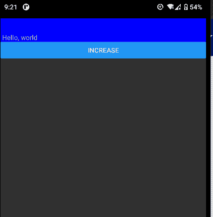
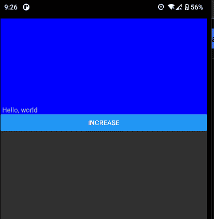
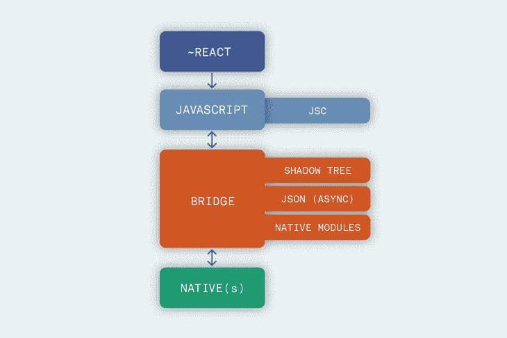
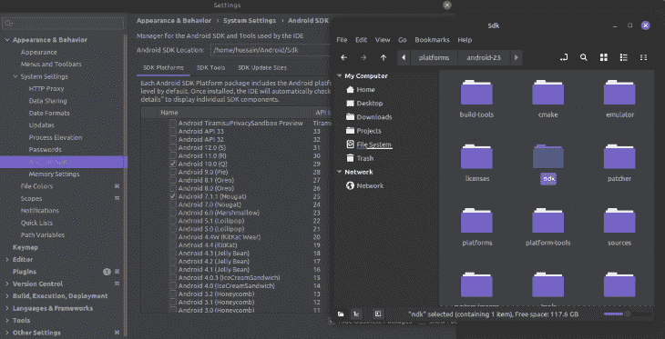
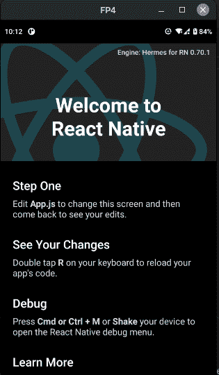
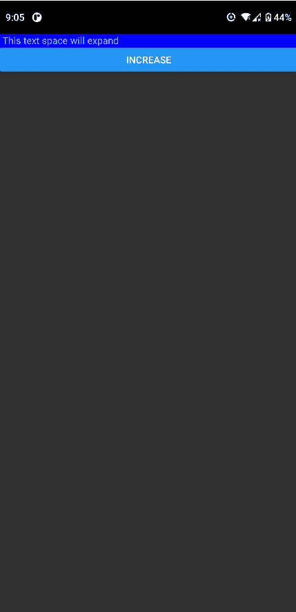

# React Native reactive 3-log rocket 博客的平滑动画

> 原文：<https://blog.logrocket.com/smooth-animations-react-native-reanimated-3/>

## 什么是 React Native reactived，什么时候应该使用它？

你有没有做过一个 app，给你的朋友或者客户看，他们抱怨说“感觉不流畅”？也许他们建议添加流体动画，但你不是一个动画师。

现在，你的应用程序看起来像这样紧张不安:



但是你想让它看起来像这样:



毫无疑问，动画增强了应用程序的用户体验。然而，在实际实现它们时，我们必须执行以下步骤:

*   编写复杂的 JavaScript 代码来创建过渡
*   建立自定义的数学逻辑，使我们的动画有一个更流畅的运动
*   确保我们的动画与 [Fabric](https://reactnative.dev/architecture/fabric-renderer) 兼容。这带来了性能和安全性的升级
*   或者，彻底测试您的项目，检查您的动画是否在所有平台上都是稳定的

虽然这是解决这个问题的一种方法，但是有一个小问题:开发动画需要大量的技能和时间。这是小团队最头疼的问题。

这就是 React Native Reanimated 的用武之地。它是一个开源的 React 原生库(在 GitHub 上大约有 [6.5k 颗星)，允许开发者实现动画。](https://github.com/software-mansion/react-native-reanimated)

最近，开发团队[发布了版本 3](https://blog.swmansion.com/announcing-reanimated-3-16167428c5f7) ，带来了重大改进。在本文中，我们将介绍 React Native Reanimated 中的新特性。

以下是我们今天要学的内容:

## React Native reactived 中的新功能

据开发人员称，大部分功能都是在引擎盖下的变化。

### 转向织物

从版本 3 开始，Reanimated 现在在引擎盖下使用 Fabric 架构。这带来了巨大的安全和性能升级。因此，这意味着你的应用程序是安全和快捷的。

对于不太了解面料的人来说，我们先简单介绍一下基本面和历史。

早在 2018 年，脸书就开始为 React 原生库开发新的渲染器[，名为 Fabric。在旧流程中，React 通过一系列跨桥步骤处理所有 UI 操作。我们可以通过下图对此进行解释:](https://reactnative.dev/blog/2022/03/15/an-update-on-the-new-architecture-rollout)



Source: [Lorenzo Sciandra](https://formidable.com/blog/2019/lean-core-part-4/)

如图所示，有四个部分:

*   **React code** :这是开发人员编写的代码
*   **JavaScript 翻译层**:这个组件将 React 代码翻译成 JavaScript
*   **桥**:当编译器翻译完所有代码后，桥将 JavaScript 代码翻译成本机(主机操作系统)特定的指令
*   **本机**:在设备上运行的本机平台代码

虽然这种方法如预期的那样工作，但是有一个主要缺陷:JavaScript 和本地组件通过桥由异步 JSON 消息进行通信。有时，网桥传输消息很慢，从而导致性能问题。

为了解决这个问题，脸书构建了一个名为 Fabric 的新渲染器。它包含许多好处，其中包括:

*   增强了主机和 React 视图之间的互操作性:这意味着编译器现在可以以同步的方式呈现 UI 组件。以前，React 会异步呈现小部件。结果，这导致了渲染错误
*   **与[React suspension](https://reactjs.org/blog/2019/11/06/building-great-user-experiences-with-concurrent-mode-and-suspense.html)**的集成:这使得数据获取过程更加容易和健壮。
*   **类型安全保证**:在幕后，库使用代码生成来检查 JavaScript 组件和主机平台代码之间的不匹配。因此，这提高了稳定性，减少了运行时出错的机会
*   更快的启动速度:React 现在可以比以前更快的渲染主机组件。这可以通过延迟初始化来实现

在本文的后面，我们将介绍如何迁移我们的代码库以使用 Fabric 架构。

### 结束对复活 1 的支持

该团队已经移除了对已弃用的 Reanimated 1 API 的支持。这样做的原因是将 Fabric 移植到旧的 API 意味着太多的工作。因此，这意味着使用遗留版本的项目将无法在最新版本的 Reanimated 上运行。

如果您的应用程序依赖于传统 API，您可以采取以下步骤:

*   替换使用旧版本的依赖项
*   升级依赖项。这样，您也可以提高应用程序的性能和安全性
*   将代码重构为新的 API。因此，您的代码将会更加清晰易读

### 为 Android 构建

从 Reanimated 3 开始，这个库将不会为 Android 提供预构建的二进制文件。这意味着开发人员需要在构建他们的应用程序之前预装 Android NDK。然而，在大多数情况下，这不是一个问题，因为 Android Studio 已经捆绑了 NDK。



此外，值得注意的是，开发人员必须从源代码编译动画的 C++代码。我们将在迁移过程中详细介绍这一点。

## 迁移到重新激活的 v3

### 项目设置

首先，初始化一个空白的 React 本地项目，如下所示:

```
npx react-native init reactAnimatedNew #initialize the project
cd reactAnimatedNew #navigate into project directory

```

接下来，安装 react-native-reanimated 的最新版本:

```
npm install [email protected]
#make sure that '@next is appended, otherwise NPM will install version 2!

```

完成后，现在让我们告诉 React 我们想要使用 Fabric 渲染器，而不是它的遗留对应物。

### 切换到结构

在这一部分，我们将介绍如何在我们的项目中集成 Fabric。

要构建 Android，首先导航到`android/gradle.properties`。在这里，找到`newArchEnabled`属性并将其设置为`true`:

```
#in android/gradle.properties:
newArchEnabled=true

```

我们已经指示编译器为 Android 启用 Fabric。
对于 iOS，在您的终端中运行以下命令:

```
cd ios
#change the flag that enables/disables Fabric:
RCT_NEW_ARCH_ENABLED=1 bundle exec pod install 

```

让我们看看是否一切正常！要构建您的项目，请运行以下终端命令:

```
npx react-native run-android
#in a new terminal window:
npx react-native start

```

需要注意的一点是，与以前的版本不同，这个库将从源代码编译 Hermes。这意味着我们项目的构建时间将会增加。



### 创建动画

现在我们已经使用 Fabric 构建了我们的项目，让我们构建一个简单的动画。

为此，创建一个名为`AnimatedRenderer.js`的文件。这里，从编写以下代码开始:

```
import Animated, {
  useSharedValue,
  useAnimatedStyle,
  withSpring,
} from "react-native-reanimated";
import { Button, View, Text } from "react-native";
export default function AnimationRenderer() {
  const height = useSharedValue(20); //this value is shared between worker threads
  const animatedStyles = useAnimatedStyle(() => {
    return {
      height: height.value, //change the height property of the component
    };
    return (
      <View>
        <Animated.View style={[{backgroundColor: 'blue'}, animatedStyles]}>
          <Text> This text space will expand</Text>
        </Animated.View>
    {/* When clicked, increment the shared value*/}
    {/* this will increase the height of the component.*/}    
      <Button
          onPress={() => (height.value = height.value + 1)}
          title="Increase" //when clicked, increment 'height'
        />
      </View>
    );
  });
}

```

从这段代码中可以得出一些推论:

*   我们创建了一个偏移量变量，它是`useSharedValue`钩子的一个实例。这让我们能够建立生动的价值观
*   随后，我们使用`useAnimatedStyles`钩子告诉 React 我们想要制作高度属性的动画
*   最后，出于动画的目的，我们将我们的`animatedStyles`变量附加到我们的`Animated.View`组件上

最后一步，我们剩下的就是将自定义组件呈现到 UI 上。为此，修改您的`App.js`文件，如下所示:

```
//App.js
import React from "react";
import { SafeAreaView } from "react-native";
import AnimationRenderer from "./AnimationRenderer";
export default function App() {
  return (
    <SafeAreaView style={backgroundStyle}>
      <AnimationRenderer /> {/*render our custom component to the DOM */}
    </SafeAreaView>
  );
}

```


注意我们的动画是抖动的。为了平滑它，我们可以使用`withSpring`方法:

```
//AnimationRenderer.js:
<Button
  onPress={() => (offset.value = withSpring(offset.value + 10))}
  title="Increase"
/>;

```

这会产生更流畅的动画:



## 结论

重新激活的库有以下选择:

尽管它们更容易使用，但 Reanimated 允许通过 [worklets](https://docs.swmansion.com/react-native-reanimated/docs/fundamentals/worklets) 进行更细粒度的控制和性能。此外，借助 Fabric 支持，该库带来了更高的安全性和快速性。当谈到个人项目时，Reanimated 一直是我的武器库的一部分。

非常感谢您的阅读！

## [LogRocket](https://lp.logrocket.com/blg/react-native-signup) :即时重现 React 原生应用中的问题。

[](https://lp.logrocket.com/blg/react-native-signup)

[LogRocket](https://lp.logrocket.com/blg/react-native-signup) 是一款 React 原生监控解决方案，可帮助您即时重现问题、确定 bug 的优先级并了解 React 原生应用的性能。

LogRocket 还可以向你展示用户是如何与你的应用程序互动的，从而帮助你提高转化率和产品使用率。LogRocket 的产品分析功能揭示了用户不完成特定流程或不采用新功能的原因。

开始主动监控您的 React 原生应用— [免费试用 LogRocket】。](https://lp.logrocket.com/blg/react-native-signup)