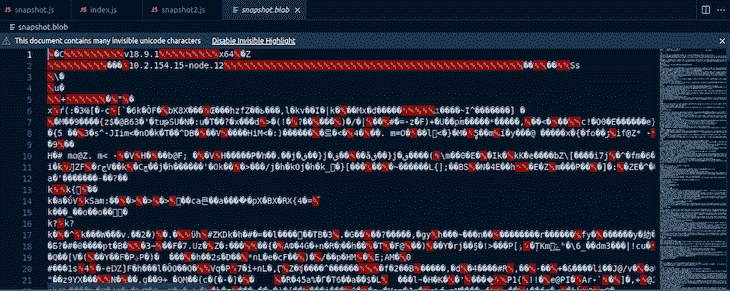
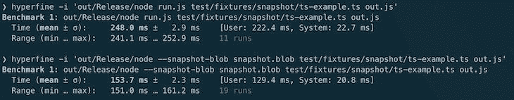

# Node.js v18.8.0 中的快照标志简介

> 原文：<https://blog.logrocket.com/snapshot-flags-node-js-v18-8/>

[Node.js](https://nodejs.org/ar/blog/release/v18.8.0/) 最近在 v18.8.0 中引入了一个生成运行时用户界面(用户脚本)快照的实验性特性。在本帖中，我们将看看这个特性的重要性，以及它提供的一些选项。我们还将这个快照功能与其他打包解决方案进行比较，例如 [pkg](https://www.npmjs.com/package/pkg) 。

向前跳:

## 了解 Node.js 启动

为了理解生成运行时用户界面快照的需要，我们需要理解 Node.js 启动的方式。

Node.js 在启动时构建一个`v8::Isolate`、`v8::context`和`node::Environment`。然后它构造一个`process`对象并启动 bootstrap Node.js 来准备环境。Node.js 只在所有这些完成后执行用户脚本。

新的快照标志功能使节点可执行文件能够创建包含 Node.js 和嵌入式快照的单个二进制文件，而无需从源代码构建 Node.js。这意味着二进制文件已经包含了 Node，所以不需要再进行一次初始化(比如创建`v8::Isolate`、`v8::context`以及启动用户脚本通常需要的所有其他进程)，这会增加脚本的启动时间。

## Node.js 标志

为了使 Node.js 可执行文件能够实现这个特性，引入了两个新标志:`--snapshot-blob`和`--build-snapshot`标志。在这一节中，我们将看到如何使用这些新标志。

## `--build-snapshot`旗

`--build-snapshot`标志告诉 Node.js 构建文件的快照，该快照作为标志的参数提供:

```
--build-snapshot snapshot.js

```

Snapshot.js 充当入口点脚本。

## `--snapshot-blob`旗

`--snapshot-blob`标志允许我们告诉 Node.js 可执行文件将快照 blob 保存到什么位置。如果快照 blob 文件存在，Node 只需用新的 blob 覆盖其内容，如果不存在，Node 将创建一个新的 blob 文件，并将其保存到磁盘的当前工作目录中:

```
--snapshot-blob snapshot.blob

```

`snapshot.blob`作为保存生成的 blob 的二进制文件的名称。

既然已经了解了这些标志的功能，我们可以尝试构建我们自己的快照。

## 构建快照

1.  打开终端并创建一个`snapshot_test`文件夹
2.  在您喜欢的代码编辑器中打开`snapshot_test`文件夹，并使用`npm init -y`初始化 npm
3.  创建一个名为`snapshot.js`的文件
4.  将下面几行代码复制到`snapshot.js` :

    ```
    const path = require('path')  console.log(process.cwd()) globalThis.path = process.cwd() globalThis.file = __dirname const name = 'I am geezy'  console.log(process.argv) globalThis.firstArg = process.argv[2] globalThis.secondArg = process.argv[3]
    ```

这是一个简单的脚本，使用`globalThis`设置几个`global`变量。`globalThis`为我们提供了一条通往`global variables(global object)`的道路。

要构建此脚本及其当前 Node.js 运行时环境的快照，请运行以下命令:

```
node --snapshot-blob snapshot.blob --build-snapshot snapshot.js name home

```

通过`process.argv`我们可以获得给命令的额外的`name`和`home`参数。

这是输出:

```
/home/phantom/Documents/node_js_projects/node_testing
[
  '/home/phantom/.nvm/versions/node/v18.9.1/bin/node',
  '/home/phantom/Documents/node_js_projects/node_testing/snapshot.js',
  'name',
  'home'
]

```

Node.js 照常执行 Snapshot.js，然后创建脚本状态的快照。

检查当前工作目录，我们找到 Node.js 生成的`snapshot.blob`文件。当我们打开文件时，我们看到的是乱码:



这就提出了一个问题:我们如何执行生成的 blob？

## 运行快照 blob

这个新特性使得运行快照 blob 变得很容易——我们所需要的就是为我们的`snapshot.blob`文件创建一个条目文件。这个文件将试图从`Global` `Object`中读取。

在`snapshot_test`目录中创建一个`index.js`文件，并向其中添加以下代码行:

```
console.log('current working directory', globalThis.path)
console.log('First Arg', globalThis.firstArg)
console.log('Second Argument', globalThis.secondArg)
console.log('current process Argv', process.argv)
console.log('Global Object', globalThis)

```

然后，运行以下命令:

```
node --snapshot-blob snapshot.blob index.js

```

这是输出:

```
current working directory /home/phantom/Documents/node_js_projects/node_testing
First Arg name
Second Argument home
current process Argv [
  '/home/phantom/.nvm/versions/node/v18.9.1/bin/node',
  '/home/phantom/Documents/node_js_projects/node_testing/index.js'
]
Global Object <ref *1> Object [global] {
  global: [Circular *1],
  queueMicrotask: [Function: queueMicrotask],
  clearImmediate: [Function: clearImmediate],
  setImmediate: [Function: setImmediate] {
    [Symbol(nodejs.util.promisify.custom)]: [Getter]
  },
  structuredClone: [Function: structuredClone],
  clearInterval: [Function: clearInterval],
  clearTimeout: [Function: clearTimeout],
  setInterval: [Function: setInterval],
  setTimeout: [Function: setTimeout] {
    [Symbol(nodejs.util.promisify.custom)]: [Getter]
  },
  atob: [Function: atob],
  btoa: [Function: btoa],
  performance: Performance {
    nodeTiming: PerformanceNodeTiming {
      name: 'node',
      entryType: 'node',
      startTime: 0,
      duration: 99.07323400303721,
      nodeStart: 3.987049002200365,
      v8Start: 31.41652700304985,
      bootstrapComplete: 89.83720200136304,
      environment: 66.75902900099754,
      loopStart: -808954.4995539971,
      loopExit: -808949.1088810004,
      idleTime: 0
    },
    timeOrigin: 1665479964732.965
  },
  fetch: [AsyncFunction: fetch],
  path: '/home/phantom/Documents/node_js_projects/node_testing',
  file: '/home/phantom/Documents/node_js_projects/node_testing',
  firstArg: 'name',
  secondArg: 'home'
}

```

虽然我们没有运行`snapshot.js`文件，但是通过运行带有入口点的 blob 文件，变量`globalThis.path`、`globalThis.firstArg`和`globalThis.secondArg`被赋值，就像我们运行`snapshot.js`文件一样。这证明了我们的应用程序的状态是在`snapshot.blob`文件中捕获的。

要知道`snapshot.blob`文件是否正在运行，我们可以尝试运行`index.js`文件，而不指定 blob。

运行以下命令:

```
 node index.js

```

这是输出:

```
current working directory undefined
First Arg undefined
Second Argument undefined
current process Argv [
  '/home/phantom/.nvm/versions/node/v18.9.1/bin/node',
  '/home/phantom/Documents/node_js_projects/node_testing/index.js'
]
Global Object <ref *1> Object [global] {
  global: [Circular *1],
  queueMicrotask: [Function: queueMicrotask],
  clearImmediate: [Function: clearImmediate],
  setImmediate: [Function: setImmediate] {
    [Symbol(nodejs.util.promisify.custom)]: [Getter]
  },
  structuredClone: [Function: structuredClone],
  clearInterval: [Function: clearInterval],
  clearTimeout: [Function: clearTimeout],
  setInterval: [Function: setInterval],
  setTimeout: [Function: setTimeout] {
    [Symbol(nodejs.util.promisify.custom)]: [Getter]
  },
  atob: [Function: atob],
  btoa: [Function: btoa],
  performance: Performance {
    nodeTiming: PerformanceNodeTiming {
      name: 'node',
      entryType: 'node',
      startTime: 0,
      duration: 104.0962289981544,
      nodeStart: 15.742054000496864,
      v8Start: 21.813469998538494,
      bootstrapComplete: 88.35036600008607,
      environment: 66.38047299906611,
      loopStart: -1,
      loopExit: -1,
      idleTime: 0
    },
    timeOrigin: 1665480382060.152
  },
  fetch: [AsyncFunction: fetch]
}

```

检查这两个输出，我们注意到一些差异:

1.  在第二种情况下，`globalThis.path`、`globalThis.firstArg`和`globalThis.secondArg`值未定义，因为这些值仅在`snapshot.js`运行时设置
2.  `Global` `Object`不包含我们在`snapshot.js`文件中初始化的额外的键值对

## 使用单独输入脚本的替代方法

我们可以在不使用入口脚本的情况下恢复应用程序状态，方法是在构建快照时使用`v8.startupSnapshot` API 来指定入口点。

在当前目录中，创建一个`second_snapshot.js`文件，并添加以下代码行:

```
const path = require('path')

console.log(process.cwd())
globalThis.path = process.cwd()
globalThis.file = __dirname
const name = 'I am geezy'

console.log(process.argv)
globalThis.firstArg = process.argv[2]
globalThis.secondArg = process.argv[3]

require('v8').startupSnapshot.setDeserializeMainFunction(() => {
    console.log('firstArg', this.firstArg)
    console.log('secondArg', this.secondArg)
    console.log('I am from the second snapshot')
})

```

使用以下命令构建快照 blob:

```
node --snapshot-blob second_snapshot.blob --build-snapshot second_snapshot.js name home

```

要从`second_snapshot.blob`恢复脚本状态，运行以下命令:

```
node --snapshot-blob second_snapshot.blob

```

这是输出:

```
firstArg name
secondArg home
I am from the second snapshot

```

请注意，在尝试恢复应用程序状态时，我们不必指定入口脚本。

## `--snapshot-blob`和`--build-snapshot`对`--node-snapshot-main`

这些新标志允许运行时快照，但是从 node v18.0.0 开始，通过使用`--node-snapshot-main`标志来拍摄快照的能力就已经存在了。但是，该标志仅支持构建时快照。它还需要从源构建节点，这对于用户来说并不友好，并且需要相当长的时间，具体取决于主机。

为了理解运行时快照和构建时快照的性能差异，让我们来看看这两个特性的作者提供的指标:



查看上面的指标，很容易发现运行时快照(`--snapshot-blob`)版本执行了 19 次运行，性能优于构建时快照(11 次运行)，同时花费的时间也少得多。

| **支持** | `--snapshot-blob` **和** `--build-snapshot` | `--node-snapshot-main` |
| --- | --- | --- |
| 运行时快照 | 是 | 不 |
| 使用配置脚本 | 不 | 是 |
| 用户土地模块 | 不 | 不 |
| 需要单独的启动脚本 | 没有必要 | 是 |
| 从源构建节点 | 不 | 是 |
| 构建时快照 | 不 | 是 |

## Node.js 快照功能与其他打包解决方案的对比

使用打包解决方案(比如 [pkg](https://www.npmjs.com/package/pkg) )，可以将 app 源码捆绑成二进制。但是为了在加载二进制文件后启动应用程序，您仍然需要解析源代码。

另一方面，使用 Node.js 快照，由代码初始化的堆状态包含在二进制文件中，从而不需要在加载时运行初始化代码。

## 结论

Node.js 快照特性是高度试验性的，在撰写本文时还很有限，但是随着时间的推移，将会添加更多的特性。这个特性对 Node.js 社区来说是一个很有前景的特性，希望你在阅读完这篇文章后对这个主题有更好的理解。

## 200 只显示器出现故障，生产中网络请求缓慢

部署基于节点的 web 应用程序或网站是容易的部分。确保您的节点实例继续为您的应用程序提供资源是事情变得更加困难的地方。如果您对确保对后端或第三方服务的请求成功感兴趣，

[try LogRocket](https://lp.logrocket.com/blg/node-signup)

.

[](https://lp.logrocket.com/blg/node-signup)[https://logrocket.com/signup/](https://lp.logrocket.com/blg/node-signup)

LogRocket 就像是网络和移动应用程序的 DVR，记录下用户与你的应用程序交互时发生的一切。您可以汇总并报告有问题的网络请求，以快速了解根本原因，而不是猜测问题发生的原因。

LogRocket 检测您的应用程序以记录基线性能计时，如页面加载时间、到达第一个字节的时间、慢速网络请求，还记录 Redux、NgRx 和 Vuex 操作/状态。

[Start monitoring for free](https://lp.logrocket.com/blg/node-signup)

.