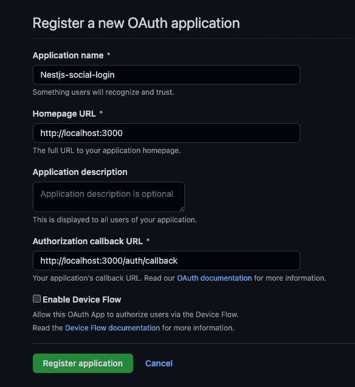
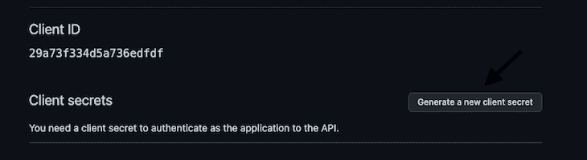
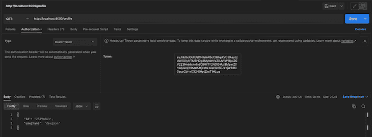
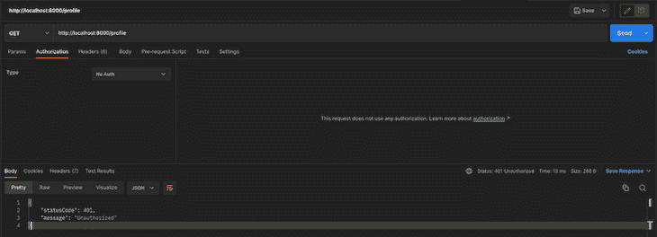

# 在 NestJS 中创建社交登录

> 原文：<https://blog.logrocket.com/social-logins-nestjs/>

在本文中，我们将从实际出发，看看如何将 GitHub 社交登录集成到 NestJS 应用程序中，该应用程序可以轻松应用于其他社交平台，如脸书、谷歌等。然后，我们将学习如何使用 NestJS 中提供的 guards 和各种身份验证和授权机制来保护私有路由。您可以在这个 [GitHub 资源库](https://github.com/devgson/nestjs-social-login)中获得本文的完整源代码。

向前跳:

## 先决条件

要继续阅读本文，至少对 Node.js 有一个基本的了解是很重要的，还需要安装 Node.js 和节点包管理器。你可以在这里下载这些(Node . js 附带的节点包管理器)。你也有必要拥有一个 GitHub 帐户，因为我们将集成 GitHub 社交登录。

有了这些分类，让我们设置应用程序所需的基本包。

## 建立我们的 NestJS 项目

在本文中，我们将使用一个名为 Passport 的库来帮助我们实现社交登录。Passport 通过提供称为策略的机制来简化社交登录过程，以帮助整合外部社交平台的社交登录，如 GitHub、谷歌、脸书等。

我们将使用 GitHub Passport 策略和相应的 NestJS 卫士来实现一系列步骤:

*   首先，我们将通过 GitHub OAuth 认证一个用户
*   然后，我们将创建一个 JWT 令牌，用基于从 GitHub 接收的用户认证状态的有效负载进行编码
*   最后，我们将保护私有路由，只允许具有有效 JWT 令牌的请求访问这些路由

让我们建立项目！

首先，安装 NestJS CLI，因为它提供了一个单命令机制来帮助我们创建一个新项目。在终端中运行以下命令:

```
npm i -g @nestjs/cli

```

安装完成后，我们可以通过在终端中运行以下命令来构建一个新的 NestJS 项目:

```
nest new nestjs-social-login

```

然后，NestJS 将使用一些重要的文件和模块创建一个新的应用程序。还有一个我们必须安装的叫做`@nestjs/config`的重要模块。我们将特别使用该库提供的服务来检索现有的环境变量。要安装此模块，请在终端中运行以下命令:

```
npm install @nestjs/config

```

之后，只需将该模块导入到基础应用程序模块中，并将其设置为全局模块，以便子模块可以无缝地使用它:

```
//app.module.ts

import { ConfigModule } from '@nestjs/config';
...

@Module({
  imports: [
    ConfigModule.forRoot({ isGlobal: true }),
  ],

...

```

在本文的整个过程中，我们将根据需要安装其他的包，但是现在这应该足够了。

如前所述，我们将设置 GitHub 社交登录，因此我们需要向 GitHub 注册一个新的 OAuth 应用程序，以获得一些重要的凭证。

## 向 GitHub 注册 OAuth 应用程序

要注册一个新的应用程序，请前往 [GitHub](https://github.com/login?return_to=https%3A%2F%2Fgithub.com%2Fsettings%2Fapplications%2Fnew) 并填写必要的详细信息:



一旦 GitHub 验证了用户，用户将被重定向到在**授权回调 URL** 字段中指定的 URL。稍后，我们将在应用程序中用这个路径实现一个路由来处理接收到的数据。

填写完该表格后，点击**注册申请**按钮；它应该会注册一个新的应用程序，并将您重定向到一个新的页面，显示有关新创建的应用程序的信息:



在这个页面上，有一个**客户 ID** 和**客户机密**；我们很快就会在应用程序中用到这两个值，所以单击**生成新的客户端密码**按钮来获取客户端密码，然后复制客户端 ID 和新生成的客户端密码。

现在，让我们将这些值添加到应用程序中。转到嵌套应用程序的根目录，创建一个`.env`文件。这个文件保存了应用程序的环境变量。现在，粘贴这些值，使`.env`文件看起来像这样:

```
//.env

GITHUB_CLIENT_ID=YOUR_CLIENT_ID
GITHUB_CLIENT_SECRET=YOUR_CLIENT_SECRET

```

> 注意:客户端秘密是保密的，不应与任何人共享；这就是为什么我们把它们作为环境变量加入。同样重要的是，不要将它们提交给任何版本控制系统。如果您正在使用 Git，请确保已经将`.env`文件添加到了`.gitignore`中。

这就是注册 OAuth 应用程序的全部内容；让我们继续，开始编写一些代码来使用我们到目前为止所做的。

## 实现 GitHub 社交登录

前面，我们列出了一系列要实现的步骤。第一个是通过 GitHub 认证用户。让我们开始努力吧。

### 通过 GitHub 认证用户

继续安装 Passport 库和 Passport GitHub 策略库。导航到应用程序目录，并在终端中运行以下命令:

```
npm install passport @nestjs/passport passport-github

```

让我们简单看一下我们刚刚安装的三个库以及它们有什么帮助:

*   `passport`是一个身份验证中间件，它提供了一套全面的策略来支持多种身份验证方法，如用户名/密码、SSO、OpenID 等
*   `@nestjs/passport`是围绕 Passport 库的包装器；它打包了 Passport 库中的实用程序，使我们能够在 NestJS 应用程序中无缝地使用它们
*   另一方面，`passport-github`为 GitHub 实现了一个认证策略，并允许我们将其插入 Passport

现在，让我们创建一个单独的嵌套模块，称为`auth`，用于实现所有的身份验证。然后，导航到应用程序中的`src`文件夹，并运行以下命令来提供新模块:

```
nest generate module auth

```

该命令生成一个名为`auth`的新模块。导航到`auth`文件夹，创建一个名为`auth.strategy.ts`的文件。我们将在这个文件中实现所有的 Passport 策略(在本例中是 GitHub 策略)。

将下面的代码粘贴到`auth.strategy.ts`文件中，我们将在后面浏览它:

```
//auth.strategy.ts

import { Injectable } from '@nestjs/common';
import { ConfigService } from '@nestjs/config';
import { PassportStrategy } from '@nestjs/passport';
import { Profile, Strategy } from 'passport-github';

@Injectable()
export class GithubStrategy extends PassportStrategy(Strategy, 'github') {
  constructor(configService: ConfigService) {
    super({
      clientID: configService.get<string>('GITHUB_CLIENT_ID'),
      clientSecret: configService.get<string>('GITHUB_CLIENT_SECRET'),
      callbackURL: '<http://localhost:8000/auth/callback>',
      scope: ['public_profile'],
    });
  }

  async validate(accessToken: string, _refreshToken: string, profile: Profile) {
    return profile;
  }
}

```

上面的代码片段中发生了很多事情，所以让我们来分解一下:

我们创建了一个名为`GithubStrategy`的类，这个类继承自 Passport 模块公开的基类。我们还注册了我们想要使用的特定策略，在本例中是 GitHub，在这个代码片段中举例说明:`PassportStrategy(Strategy, 'github')`。

然后，在类构造函数中，我们传递以前向 GitHub 注册 OAuth 应用程序时获得的凭证。还传入了一个`scope`属性；我们使用该属性通知 GitHub 我们想要为特定用户检索的数据类型。在这种情况下，我们只对获取特定用户的公开资料细节感兴趣。我们可以在这里的找到一个可能值的详尽列表，这些值将被传递到`scope`属性[中。](https://docs.github.com/en/developers/apps/building-oauth-apps/scopes-for-oauth-apps)

还有一个`validate`方法；该方法包含特定于 Passport GitHub 策略的参数。GitHub 认证一个用户后，用特定的参数调用这个函数；profile 参数包含经过身份验证的用户的 GitHub 公共配置文件数据。理想情况下，我们还将在该函数中执行额外的验证，例如检查数据库中是否已经存在具有该特定电子邮件的用户。

为了简单起见，在本文中，我们将只返回从 GitHub 中检索到的用户资料细节。在另一个场景中，我们实现了一些额外的验证，但它失败了，Passport 希望这个方法返回一个空值。

还需要将新策略作为提供者添加到`auth`模块中。我们只需将它添加到提供商的阵列中即可:

```
//auth.module

...

providers: [GithubStrategy]

...

```

### 在我们的 NestJS 应用程序中创建认证路由

最后，对于这一部分，让我们创建身份验证路由，当用户想要登录我们的应用程序时，这些路由充当用户的入口点。

再次打开`auth`文件夹，在终端中运行以下命令:

```
nest generate controller auth --flat

```

然后，将下面的代码粘贴到新创建的`controller`文件中，我们将在后面浏览它:

```
//auth.controller.ts

import { Controller, Get, Req, UseGuards } from '@nestjs/common';
import { AuthGuard } from '@nestjs/passport';

@Controller('auth')
export class AuthController {
  constructor() {}

  @Get()
  @UseGuards(AuthGuard('github'))
  async login() {
    //
  }

  @Get('callback')
  @UseGuards(AuthGuard('github'))
  async authCallback(@Req() req) {
    return req.user;
  }
}

```

在上面的代码片段中，我们可能注意到的第一件事是这个语句:`@UseGuards(AuthGuard('github'))`。通常，我们使用 NestJS 守卫来防止未经授权的用户访问特定的路由。`@nestjs/passport`包提供了内置的 guard 功能，并支持将各种策略与这些 guard 集成在一起(在这种情况下，guard 将使用 GitHub 策略)。

我们来看看流程。

当用户访问第一个 route/auth 时，它会触发特定用户的 GitHub 登录。如果成功并且用户通过了身份验证，GitHub 会将用户重定向到我们指定的回调 URL:`/auth/callback`路由。

在用户可以访问这个回调路由之前，我们之前定义的`GithubStrategy`类中的`validate`方法会使用用户的 GitHub 配置文件细节等参数来执行。假设该方法不返回 null(在我们的例子中，我们返回用户配置文件细节)。Passport 自动将 validate 方法的返回值作为用户属性附加到 req 对象。这使我们能够从请求对象访问用户详细信息。

目前，我们返回`req.user`，但是我们希望使用这些细节来创建一个 JWT 令牌，当用户想要访问特定的私有路由时，可以发送这个令牌。这是我们要实现的下一件事。

## 在我们的 NestJS 应用程序中设置 JWT 令牌策略

这一步非常重要，因为我们希望确保只有经过身份验证的用户才能访问受保护的路由。幸运的是，NestJS 还提供了`@nestjs/jwt`库，帮助我们相当容易地实现这一点。首先要做的是安装库:

```
npm install @nestjs/jwt

```

完成后，我们需要设置这个库，并将其作为一个模块导入到应用程序的 auth 模块中。下面的代码处理这个问题；我们将在以下时间后讨论:

```
//auth.module.ts

...

import { JwtModule } from '@nestjs/jwt';
import { ConfigService } from '@nestjs/config';

imports: [

...

JwtModule.registerAsync({
  useFactory: async (configService: ConfigService) => {
    return {
      signOptions: { expiresIn: '10h' },
      secret: configService.get<string>('JWT_SECRET'),
    };
  },
  inject: [ConfigService],
}),

...

]

...

```

上面的代码片段注册了 JWT 模块，并设置了一些重要的选项，比如一个已签名的 JWT 应该保持有效多长时间，以及一个用于对编码的有效载荷进行签名的秘密字符串。将秘密添加到`.env`文件中也很重要，因为任何掌握它的人都可以签署有效的 jwt 并将它们发送到我们的应用程序。本质上，这是一个重大的安全风险，必须避免。

* * *

### 更多来自 LogRocket 的精彩文章:

* * *

因此，在`.env`文件中添加一个安全字符串:

```
//.env

JWT_SECRET=YOUR_JWT_SECRET

```

完成后，我们需要返回到`auth.controller`文件中的认证回调路径，并做一些调整。我们现在需要做的就是使用经过身份验证的用户的详细信息创建一个有效负载，用它创建一个新的 JWT 令牌，并将其返回给用户。用户将在访问受保护的路由时提供此令牌(我们稍后将创建这些路由)。

对授权回调路由的调整相对简单:

```
//auth.controller.ts

import { JwtService } from '@nestjs/jwt';

...

constructor(private jwtService: JwtService) {}

@Get('callback')
  @UseGuards(AuthGuard('github'))
  async authCallback(@Req() req) {
    const user = req.user;
    const payload = { sub: user.id, username: user.username };
    return { accessToken: this.jwtService.sign(payload) };
  }

...

```

在上面的代码片段中，我们提取了从 GitHub 接收到的经过身份验证的用户的个人资料细节，并将用户的 id 和用户名作为有效载荷传递给 JWT。`@nestjs/jwt`包提供了一个方便的服务，该服务公开了一个`sign`方法，该方法接收一个有效载荷并返回一个有效的已签名的 JWT 令牌；然后我们可以将它返回给用户。

## 使用 JWT 令牌保护私有路由

在最后一步中，我们将使用 JWT 策略来自动验证当用户试图访问受保护的路由时从用户那里收到的 jwt。第一步是安装一个实现 JWT 策略的库，名为`passport-jwt`:

```
npm install passport-jwt

```

接下来的事情是制定战略。这与我们实现 GitHub 策略的方式非常相似，所以为了简单起见，我们不妨将它们放在同一个文件中。转到`auth.strategy.ts`文件，添加以下代码:

```
//auth.strategy.ts

import { ExtractJwt, Strategy as PassportJwtStrategy } from 'passport-jwt';
import { ConfigService } from '@nestjs/config';

...

@Injectable()
export class JwtStrategy extends PassportStrategy(PassportJwtStrategy) {
  constructor(configService: ConfigService) {
    super({
      jwtFromRequest: ExtractJwt.fromAuthHeaderAsBearerToken(),
      ignoreExpiration: false,
      secretOrKey: configService.get<string>('JWT_SECRET'),
    });
  }

  async validate(payload: any) {
    return { id: payload.sub, username: payload.username };
  }
}

...

```

让我们来看一下用于设置 JWT 战略的参数:

*   `jwtFromRequest`:提供指示如何从请求中提取 JWT 的方法。在这个实例中，我们将指定一种从`Authorization`报头中提取令牌作为承载令牌的方法
*   `ignoreExpiration`:该属性告诉 Passport 模块拒绝在`Authorization`报头中发送过期 JWT 的请求
*   `secretOrKey`:这里我们从我们的`.env`文件中提供一个秘密来签署令牌。但是，在某些特定情况下，PEM 编码的公钥可能更合适，例如在生产应用程序中

最后，使用来自 JWT 的解码有效负载调用 validate 方法。然后，我们可以返回此信息，并允许访问该路由。

我们必须再次将这个新策略作为提供者添加到`auth`模块中；我们只需将它添加到提供商的阵列中即可:

```
// auth.module
...

providers: [GithubStrategy, JwtStrategy]

...

```

最后一部分是守卫我们要保护的路线。

让我们创建这样一条路线，然后使用 NestJS guard 保护它。只需转到`app.controller.ts`文件并添加以下代码:

```
// app.controller.ts

import { Controller, Get, Req, UseGuards } from '@nestjs/common';
import { AuthGuard } from '@nestjs/passport';

...

@UseGuards(AuthGuard('jwt'))
@Get('profile')
getProfile(@Req() req) {
  return req.user;
}

...

```

当用户试图访问配置文件路由时，`AuthGuard('jwt')`语句会自动使用我们刚刚定义的 JWT 策略来验证从用户处收到的令牌。如果验证失败，则路由为`401 Unauthorized`；否则，它返回用户详细信息。

让我们测试整个流程。

首先，导航到`/auth`路线，用 GitHub 登录。我们将获得一个访问令牌:


然后，我们可以在尝试访问受保护的配置文件路由时发送该令牌:



如果我们试图使用无效令牌或根本没有令牌来访问路由，我们将会得到一个`401 Unauthorized`错误:



瞧，这就是我们为 GitHub 集成社交登录所需要做的一切。好的一面是，我们可以很容易地在多个社交平台上复制同样的过程。

## 结论

在本文中，我们介绍了将 GitHub social login 集成到 NestJS 应用程序中的过程。我们学习了如何使用 GitHub 进行身份验证，使用 Passport 实现特定的策略，然后最终建立了一个保护私有路由的 JWT 策略。

## 使用 [LogRocket](https://lp.logrocket.com/blg/signup) 消除传统错误报告的干扰

[](https://lp.logrocket.com/blg/signup)

[LogRocket](https://lp.logrocket.com/blg/signup) 是一个数字体验分析解决方案，它可以保护您免受数百个假阳性错误警报的影响，只针对几个真正重要的项目。LogRocket 会告诉您应用程序中实际影响用户的最具影响力的 bug 和 UX 问题。

然后，使用具有深层技术遥测的会话重放来确切地查看用户看到了什么以及是什么导致了问题，就像你在他们身后看一样。

LogRocket 自动聚合客户端错误、JS 异常、前端性能指标和用户交互。然后 LogRocket 使用机器学习来告诉你哪些问题正在影响大多数用户，并提供你需要修复它的上下文。

关注重要的 bug—[今天就试试 LogRocket】。](https://lp.logrocket.com/blg/signup-issue-free)