# Solidity 和 JavaScript 在 Web3 应用中的作用

> 原文：<https://blog.logrocket.com/solidity-javascript-web3-blockchain-applications/>

作为一名技术发烧友或 web 开发人员，意味着要跟上最新的技术和趋势。许多软件开发人员将个人项目作为不断自我发展和改进的一种方式，因此您可能已经熟悉了 Web3 编程中的术语，如区块链开发、以太坊、智能合同、DApp、可靠性编程等等。

在本文中，我们将深入探讨这些术语，通过构建和托管一个 live Web3 项目来巩固我们所涵盖的内容，任何区块链爱好者或开发人员都可以使用该项目来提升他们的个人投资组合。要跟随本教程，您需要以下内容:

你也可以[克隆我的 GitHub 来查看本教程使用的完整代码](https://github.com/aidelojep/SOLIDITY-Smart_Contract_Project)。我们开始吧！

## 目录

## 什么是 Web3 编程？

蒂姆·伯纳斯·李于 1989 年开发的万维网始于 Web 1.0。web 1.0 被称为只读 Web，基本上是一个静态 Web，用户只能阅读 Web 开发人员创建的内容。基本的通信模式是 HTTP，网页是用 HTML 开发的。

从 2004 年开始，Web 2.0 为用户提供了参与内容创作的机会。因此，Web 2.0 可以被称为智慧网络或参与式网络。Web 2.0 时代带来了 Web 技术领域的重大发展，例如，几种语言和框架的创建，其中一些包括 React、Angular、Vue、XML、CSS3、Tailwind CSS、DOM、TypeScript 等等。

与此同时，新的标准和旧的语言得到了改进，目标是在用户和 web 技术应用程序之间提供更多的交互性。总之，这导致了信息流通过各种平台，如社交媒体、即时通讯、博客、视频博客、播客、视频分享和聊天。脸书、Instagram、LinkedIn 和 YouTube 等社交媒体网站的出现带来了全球交流和信息共享，让人们能够实时远程工作和合作。

Web3 或语义网带来了数据驱动的开发和基于机器的数据解释。在这个新的 Web3 时代，数据隐私和数据政策是重中之重。使用基于区块链的分散化解决了这一问题，该分散化给予用户对其数据的完全所有权。

此外，Web3 为用户提供了更加个性化的体验，因为 Web 技术根据历史和使用习惯为每个设备定制了互联网体验。这些功能包括人工智能、元宇宙、个性化搜索和个人数据控制。最终，有了 Web3，你将不再需要每个社交媒体平台的单独账户，因为正在开发一个集中的存储库。

现在我们已经了解了 Web3 的一些基础知识，让我们使用 React 构建一个 Solidity 项目。

## 构建我们的 React 应用

要开始这个项目，我建议你选择一个托管网站，并购买域名。如果你不想在个人项目上花钱，你可以尝试托管像 Hostinger、Heroku 或 Netlify 这样的网站来部署你的项目。

在桌面上创建一个文件夹，给它起一个类似`web3.0 project`的名字，然后在代码编辑器中打开这个文件夹。现在，我们可以在代码编辑器中创建一个新文件夹，并将其命名为`client`，我们将在其中放置 React 应用程序。创建第三个文件夹，重命名为`smartContract`，我们将在这里写我们的可靠性合同。接下来，我们在 IDE 的终端中传递以下命令:

```
cd .\client\
#or 
cd client

```

我们将下面的命令传递给使用 Vite 创建 React 应用程序的[，Vite](https://blog.logrocket.com/react-boilerplates-for-2021/#vite)在几秒钟内安装构建并启动 React 应用程序:

```
npm init [email protected]

```

我们需要确保 Node.js 安装在我们的设备上。如果你遇到一个错误，说`too many arguments`，你可以把命令分开如下:

```
cd .
client\

```

运行上面的命令后，我们会被提示给我们的项目命名。因为我们在我们的项目文件夹中，所以我们可以将`./`与任何偏好的项目名称一起使用。这里用`blockchain.json`吧。对于`.json`标准，你应该以一个单词的小写命名约定开始你的项目名。

接下来，我们将被提示选择我们所选择的框架，在我们的例子中，是 React。当第二次提示时，我们还将使用 React 作为我们的变体，这将产生下图:

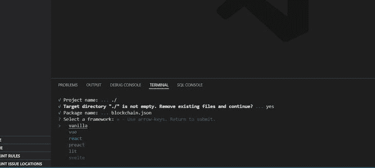

在选择 **react** 作为我们选择的应用程序后，我们应该会看到如下图所示的消息提示:

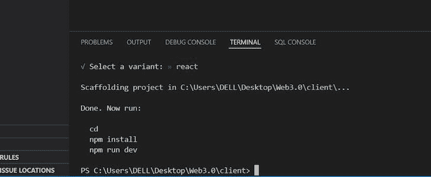

```
npm install

```

传递上面的命令后，我们会看到类似下图的内容，这意味着我们已经在本地机器上成功安装了 React:


```
npm run dev

```

使用上面的命令，我们在`port 3000`上托管 React 应用程序。我们现在应该得到与下图相同的结果:

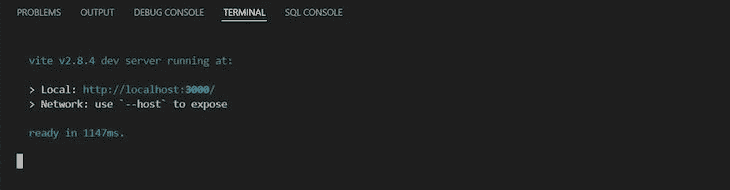

点击本地机器中的链接`[http://localhost:3000](http://localhost:3000)`,我们看到 React 应用已经成功初始化:

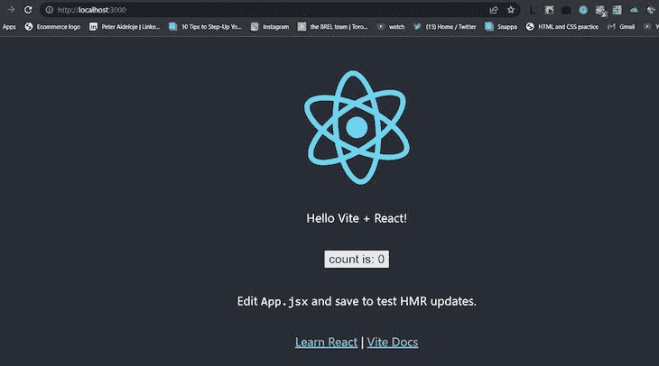

接下来，我们将使用 Tailwind CSS 来实现我们的设计，而无需在单独的文件夹中编写 CSS 代码。为了安装 Tailwind CSS，我们传递以下命令:

```
npm install -D tailwindcss postcss autoprefixer

```

接下来，我们运行下面的命令:

```
npx tailwindcss init -p

```

如果您在创建`tailwind.config.js`文件夹时遇到任何困难，请尝试运行以下命令:

```
npx tailwindcss init
npx [email protected] init

```

接下来，我们将通过在本地机器的终端中传递以下 CLI 命令来创建我们的`Postcss.js`文件:

```
 npm i -D postcss-load-config
 npm i -D postcss-plugin
 npm fund

```

我们也可以在我们的`src`文件夹中手动创建一个文件，并将其命名为`postcss.config.js`。成功创建我们的`postscss.config.js`文件后，我们应该会得到如下所示的消息提示:

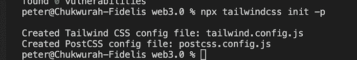

接下来，我们将通过用以下代码片段替换我们的`tailwind.config.js`文件夹来配置 Tailwind:

```
module.exports = {
  content: ["./src/**/*.{html,js,jsx,ts}"],
  theme: {
    extend: {},
  },
  plugins: [],
}

```

在我们的`tailwind.config.js`文件的`module.exports`内的内容部分，我们包括了`{html,js,jsx,ts}`，它们分别是 HTML、JavaScript、React ( `App.jsx`)和 TypeScript，以说明我们希望我们的`tailwind.config.js`配置的特性类型。我们包含了 TypeScript，以防将来需要在我们的`App.jsx`中传递 TypeScript 命令，在这种情况下，我们的`tailwind.config.js`将在我们的浏览器中运行该命令。

现在，我们可以用以下值替换`src`根目录下的`index.css`文件夹中的所有值:

```
@tailwind base;
@tailwind components;
@tailwind utilities;

```

我们将对我们的`App.jsx`文件夹做同样的事情，清除所有的值并用下面的值替换它们:

```
const App = () =>{
  return (
    <div className="App">
    <h1 class="text-3xl font-bold underline">
    My first Blockchain Application!
  </h1>
     </div>
   )
  }
export default App

```

接下来，我们可以运行下面的命令来检查我们的应用程序是否工作正常:

```
npm run dev

```

下图应该显示在我们的浏览器上，这意味着我们的应用程序正在工作。确保您的文本是粗体并带下划线，这表明 Tailwind CSS 正在按预期运行:

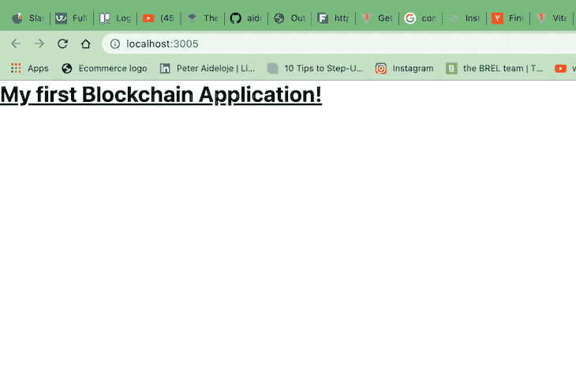

至此，我们已经完成了前端应用程序的配置。接下来，我们可以开始构建我们的 React 组件。

## 构建我们的 React 组件

我们将专注于[在以太坊网络](https://blog.logrocket.com/ethereum-flow-blockchain-nft-development/)上构建我们的智能合约。为此，使用以下命令将`cd`添加到本地机器上新终端的`smartcontract`文件夹中:

```
cd ..
cd smartContract
npm init -y

```

上面的代码初始化了一个`package.json`文件，这是我们的`smartContract`的开始。我们的`client`文件夹中的`App.jsx`文件作为网页上显示内容的直接接口。

现在，我们将在`src`文件夹中创建一个`components`文件夹。我们还将在组件文件夹中创建以下文件。

### `Navbar.jsx`

`Navbar.jsx`文件包含我们的`Navbar`组件，该组件放置在我们的`Navbar`功能组件的`<h1></h1>`标签中。在这个`Navbar`上，我们将动员我们所有的力量。稍后，我们将为`Navbar`添加一些颜色:

```
const Navbar = () => {
    return (
        <h1>Navbar</h1>
    );
}
export default Navbar;

```

`Footer.jsx`文件包含放置在`<h1></h1>`标签中的`Footer`组件。正如`Navbar`在页面顶部的作用一样，`Footer`在页面底部的作用也是如此:

```
const Footer = ()=> {
    return(
        <h1>Footer</h1>
    );
}
export default Footer;

```

### `Loader.jsx`

`Loader.jsx`组件起到装载旋转器的作用:

```
const Loader = ()=> {
    return (
       <h1>Loader</h1>
     );
}
export default Loader;

```

### `Services.jsx`

在`Services.jsx`文件中，我们将如下列出我们的服务:

```
const Services = () =>{
   return (
      <h1>Services</h1>
     );
}
export default Services;

```

### `Transactions.jsx`

在`Transaction.jsx`文件中，我们将执行我们的交易。我们将提供一项交易服务，允许用户使用以太网在区块链应用程序上执行几项交易:

```
const Transactions = () => {
   return (
       <h1>Transactions</h1>
     );
}
export default Transactions;

```

### `Welcome.jsx`

`welcome.jsx`组件欢迎应用程序的所有用户或访问者。作为用户交互的第一个接触点，`welcome.jsx`组件显示在我们的应用程序的首页，包含了在我们的登录页面上向用户显示的所有前端显示，如我们的表单、钱包等:

```
const Welcome = () => { return ( <h1>Welcome</h1> ); } export default Welcome;
```

注意`.js`和`.jsx`是同义词，但是`jsx`表示我们将要编写 React 代码。

### `index.js`

接下来，我们将创建一个最终的组件文件`index.js`，它将使我们能够导出其他组件文件。它包含以下代码:

```
export { default as Loader } from './Loader';
export { default as Navbar } from './Navbar';
export { default as Services } from './Services';
export { default as Transactions } from './Transactions';
export { default as Footer } from './Footer';
export { default as Welcome } from './Welcome';

```

## 格式化我们的 React 组件

在您的`App.jsx`文件夹中包含以下代码片段:

```
import {Navbar, Welcome, Footer, Loader, Services,Transactions} from './components';

```

现在，我们可以格式化我们的`div`来获得下面的结果:

```
import {Navbar, Welcome, Footer, Loader, Services,Transactions} from './components';
const App = () =>{
  return (
    <div className="min-h-screen">
      <div className='gradient-bg-welcome'>
        <Navbar />
        <Welcome />
        </div>
        <Services />
        <Transactions />
        <Footer />
     </div>
   );
  }
export default App;

```

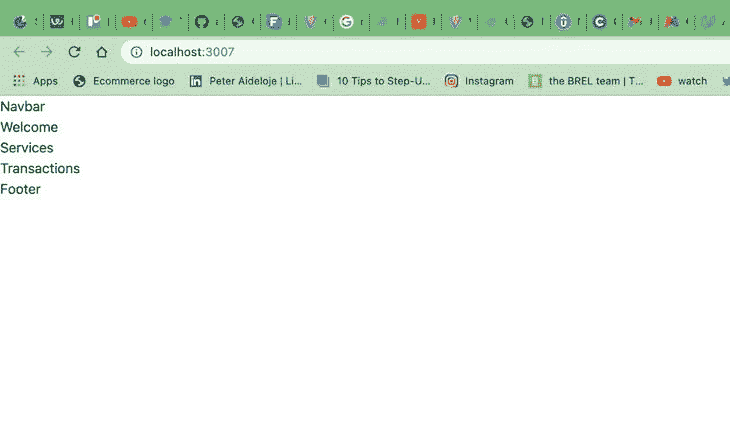

在运行`npm run dev`时，您应该会看到与上面相同的图像。接下来，我们将下面的代码片段添加到我们的`index.css`文件中，以添加样式:

```
@import url("https://fonts.googleapis.com/css2?family=Open+Sans:[email protected];400;500;600;700&display=swap");
* html {
  padding: 0;
  margin: 0;
  box-sizing: border-box;
}
body {
  margin: 0;
  font-family: "Open Sans", sans-serif;
  -webkit-font-smoothing: antialiased;
  -moz-osx-font-smoothing: grayscale;
}
.gradient-bg-welcome {
  background-color:#0f0e13;
  background-image: 
    radial-gradient(at 0% 0%, hsla(253,16%,7%,1) 0, transparent 50%), 
    radial-gradient(at 50% 0%, hsla(225,39%,30%,1) 0, transparent 50%), 
    radial-gradient(at 100% 0%, hsla(339,49%,30%,1) 0, transparent 50%);
}
.gradient-bg-services {
  background-color:#0f0e13;
  background-image: 
    radial-gradient(at 0% 0%, hsla(253,16%,7%,1) 0, transparent 50%), 
    radial-gradient(at 50% 100%, hsla(225,39%,25%,1) 0, transparent 50%);
}
.gradient-bg-transactions {
  background-color: #0f0e13;
  background-image: 
    radial-gradient(at 0% 100%, hsla(253,16%,7%,1) 0, transparent 50%), 
    radial-gradient(at 50% 0%, hsla(225,39%,25%,1) 0, transparent 50%);
}
.gradient-bg-footer {
  background-color: #0f0e13;
  background-image: 
    radial-gradient(at 0% 100%, hsla(253,16%,7%,1) 0, transparent 53%), 
    radial-gradient(at 50% 150%, hsla(339,49%,30%,1) 0, transparent 50%);
}
.blue-glassmorphism {
  background: rgb(39, 51, 89, 0.4);
  border-radius: 16px;
  box-shadow: 0 4px 30px rgba(0, 0, 0, 0.2);
  backdrop-filter: blur(5px);
  -webkit-backdrop-filter: blur(5px);
  border: 1px solid rgba(0, 0, 0, 0.3);
}
/* white glassmorphism */
.white-glassmorphism {
  background: rgba(255, 255, 255, 0.05);
  border-radius: 16px;
  backdrop-filter: blur(5px);
  -webkit-backdrop-filter: blur(5px);
  border: 1px solid rgba(255, 255, 255, 0.3);
}
.eth-card {
  background-color:#a099ff;
  background-image: 
    radial-gradient(at 83% 67%, rgb(152, 231, 156) 0, transparent 58%), 
    radial-gradient(at 67% 20%, hsla(357,94%,71%,1) 0, transparent 59%), 
    radial-gradient(at 88% 35%, hsla(222,81%,65%,1) 0, transparent 50%), 
    radial-gradient(at 31% 91%, hsla(9,61%,61%,1) 0, transparent 52%), 
    radial-gradient(at 27% 71%, hsla(336,91%,65%,1) 0, transparent 49%), 
    radial-gradient(at 74% 89%, hsla(30,98%,65%,1) 0, transparent 51%), 
    radial-gradient(at 53% 75%, hsla(174,94%,68%,1) 0, transparent 45%);
}
.text-gradient {
  background-color: #fff;
  background-image: radial-gradient(at 4% 36%, hsla(0,0%,100%,1) 0, transparent 53%), radial-gradient(at 100% 60%, rgb(0, 0, 0) 0, transparent 50%);
  -webkit-background-clip: text;
  -webkit-text-fill-color: transparent;
}
@tailwind base;
@tailwind components;
@tailwind utilities;

```

添加上面的值后，我们应该在`Navbar`部分有颜色渐变，如下图所示:

```
npm run dev

```

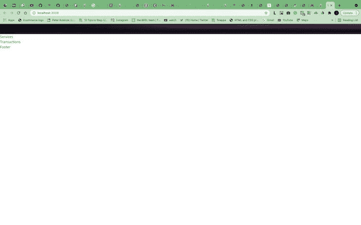

接下来，我们将在新的`image folder`中包含我们的智能合同徽标，该徽标将被放置在`client folder`中。我们可以将这个图像路径导入到我们的`Navbar`文件中，并在`Nav.jsx`文件中进行其他导入和格式化，如下面的代码片段所示:

```
import { HiMenuAlt4 } from 'react-icons/hi';
import { AiOutlineClose } from 'react-icons/ai';

import logo from '../../images/logo.png'

```

让我们通过在终端中运行以下命令来安装 React 应用程序将使用的所有必需的依赖项:

```
npm install react-icons ethers

```

`ethers`允许我们与区块链和我们的智能合约进行交互。

接下来，我们将编辑我们的`Navbar.jsx`文件中的徽标图像，创建一个新的`nav class`和一个`img`，源为`{logo}`，大小为`w-40`。添加一个带有`className`值的无序列表`<ul></ul>`，如下面的代码片段所示:

```
 <nav className='w-full flex md: justify-center justify-between items-center p-4'>
            <div className='md: flex-[0.5] flex-initial justify-center items-center'>
                
            </div>
            <ul className='text-white md:flex hidden list-none 
            flex-row justify-betwen items-center flex-initial'>
            </ul>
        </nav>

```

接下来，我们将为我们的`NavbarItem`创建一个新的功能组件，并设置一些道具，如`title`和`classProps`:

```
const NavbarItems = ({title, classProps }) =>{
    return (
        <li className={`mx-4 cursor-pointer ${classProps}`}>
            {title}
        </li>
    );
}

```

我们现在可以在我们的`Navbar`函数中调用我们的`NavbarItem`作为一个可重用的组件，并创建一个新的动态数组块:

```
{["Market", "Exchange", "Tutorials", "Wallet"].map((item, index)=>(<NavbarItem key={item + index} title={item}/> )}

```

在我们的`Navbar`函数中，我们有以下代码:

```
ul className='text-white md:flex hiddent list-none flex-row justify-betwen items-center flex-initial'>
{["Market", "Exchange", "Tutorials", "Wallet"].map((item, index)=>(<NavbarItem key={item + index} title={item}/>))}

```

接下来，我们将使用以下代码片段为我们的应用程序创建一个登录按钮:

```
<li className='bg-[#2952e3] py-2 px-7 mx-4 rounded-full cursor-pointer hover:bg-[#2546bd]' >
Login
</li>

```

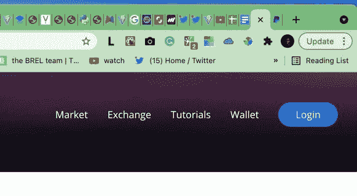

## 确保响应式设计

我们希望为我们的`Navbar`实现响应式设计，以便我们的显示在移动和网络设备上对用户都是一样的。为了实现这一点，我们将引入一个反应`state`和`toggleMenu, setToggleMenu`，当移动`Navbar`当前打开时，它们将执行某个动作:

```
const Navbar = () => {
    const [toggleMenu, setToggleMenu] = useState(false);
    return (
        <nav className='w-full flex md: justify-center justify-between items-center p-4'>
            <div className='md: flex-[0.5] flex-initial justify-center items-center'>
                
            </div>
            <ul className='text-white md:flex hiddent list-none flex-row justify-betwen items-center flex-initial'>
                  {["Market", "Exchange", "Tutorials", "Wallet"].map((item, index)=>(<NavbarItem key={item + index} title={item}/>))}

                 <li className='bg-[#2952e3] py-2 px-7 mx-4 rounded-full cursor-pointer hover:bg-[#2546bd]' >
                     Login
                 </li>
            </ul>
            <div className="flex relative">
                {toggleMenu
                ? <AiOutlineClose fontSize={28} className="text-white md:hidden cursor-pointer" onClick={()=>setToggleMenu(false)} /> 
                : <HiMenuAlt4 fontSize={28} className="text-white md:hidden cursor-pointer" onClick={()=>setToggleMenu(true)} />
                }
                {toggleMenu && (
                    <ul>
                        <li className='text-xl w-full my-2'>
                            <AiOutlineClose onClick={()=> setToggleMenu(false)} />
                        </li>
                        {["Market", "Exchange", "Tutorials", "Wallet"].map((item, index)=>(<NavbarItem key={item + index} title={item} classProps ="my-2 text-lg" />))}
                    </ul>
                )}
            </div>
        </nav>
    );
}
export default Navbar;

```

我们可以进入我们的浏览器，右击**检查**，并导航到**移动视图**。我们应该有相同的图像如下:

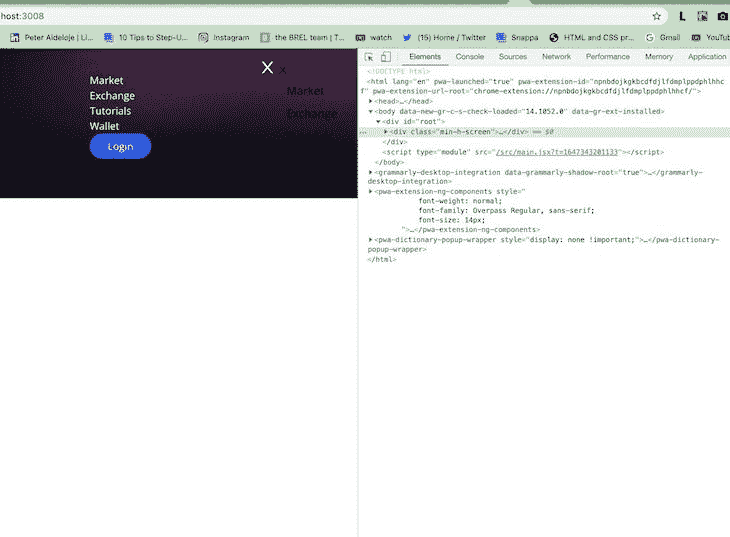

从上图中，我们可以看到桌面和移动视图。接下来，让我们继续我们的`welcome.jsx`组件，并加入一些新的`div`和`classNames`:

```
 <h1 className="text-3xl sm:text-5xl text-white text-gradient py-1"> 
                        Blockchain and Crypto Transactions<br /> across the world
                    </h1>
                    <p className="text-left mt-5 text-white font-light md:w-9/12 w-11/12 text-base">
                        Explore the Crypto world. Buy and sell cryptocurrencies easily on crypto our wallet
                    </p>

```

`welcome.jsx`组件包含以下代码:

```
import { AiFillAlipayCircle } from "react-icons/ai";
import { SiEthereum } from "react-icons/si";
import { BsInfoCircle }  from "react-icons/bs";
import { Loader } from './';
const commonStyles = () => 'min-h-[70px] sm:px-0 px-2 sm:min-w-[120px] flex justify-center items-center border-[0.5px] border-gray-400 text-sm font-light text-white';
const Welcome = () => {

    const connectWallet = () => {
    }
    return (
        <div className="flex w-full justify-center items-center">
            <div className="flex md:flex-row flex-col items-start justify-between md:p-20 py-12 px-4">
                <div className="flex flex-1 justify-start flex-col md:mr-10">
                    <h1 className="text-3xl sm:text-5xl text-white text-gradient py-1"> 
                        Blockchain and Crypto Transactions<br /> across the world
                    </h1>
                    <p className="text-left mt-5 text-white font-light md:w-9/12 w-11/12 text-base">
                        Explore the Crypto world. Buy and sell cryptocurrencies easily on crypto our wallet
                    </p>
                    <button type="button" onClick={connectWallet} className="flex flex-row justify-center items-center my-5 bg-[#2952e3] p-3 rounded-full cursor-pointer">
                        <p className= "text-white text-base font-semibold">
                        Connect Wallet
                        </p> 
                    </button>
                      <div className="grid sm:grid-cols-3 grid-cols-2 w-full mt-10">
                        <div className={`rounded-tl-2xl ${commonStyles} text-white`}>
                           Reliability
                        </div>
                       <div className={`rounded-th-2xl ${commonStyles} text-white`}>
                           Security
                        </div>
                       <div className={`rounded-tr-2xl ${commonStyles} text-white`}>
                           Ethereum
                       </div>
                       <div className={`rounded-bl-2xl ${commonStyles} text-white`}>
                           Web 3.0
                        </div>
                       <div className={`rounded-bh-2xl ${commonStyles} text-white`}>
                           Low fees
                        </div>
                       <div className={`rounded-br-2xl ${commonStyles} text-white`}>
                           Blockchain
                        </div>
                     </div>
                </div>
                <div className="flex flex-col flex-1 items-center justify-start w-full md:mt-0 mt-10">
                    <div className="p-3 justify items-start flex-col rounded-xl h-40 sm:w-72 w-full my-5 eth-card white-glassmorphism">
                        <div className="flex justify-between">
                        </div>
                    </div>
                </div>
            </div>
        </div>
    );
}
export default Welcome;

```

上面的代码库产生了下图。我们包含了一些额外的`div`，并赋予它们独特的`classNames`和`properties`，以适应我们下面的设计:

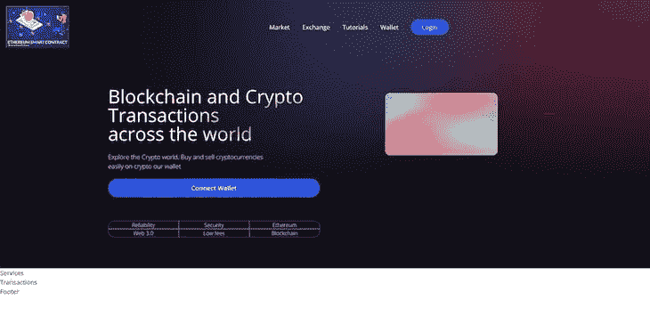

接下来，我们添加了一张`Ethereum`卡，它具有下图中的相同设计。我们还向我们的`welcome.jsx`组件添加了一个`form`和一个`send Now`按钮，这将有助于收集用户的输入:

```
<Input placeholder= "Address To" name = "addressTo" type="text" handleChange={()=>{}} />
                            <Input placeholder= "Amount (ETH)" name = "amount" type="number" handleChange={()=>{}} />
                            <Input placeholder= "Keyword (gif)" name = "keyword" type="text" handleChange={()=>{}} />
                            <Input placeholder= "Enter Message" name = "message" type="text" handleChange={()=>{}} />

```

我们可以在下面找到完整的`welcome.jsx`组件的代码库和结果:

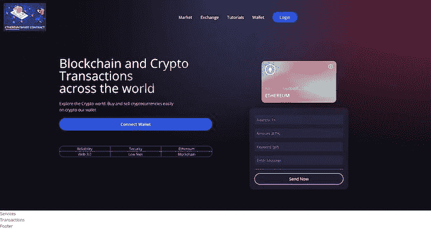

改善我们的展示

## 我们将在代码中做一些修改，将`md`改为`mf`，以获得更好的显示效果。这些更改在下面代码片段的类中实现:

`mf:flex-row`

### `mf:mr-1`

```
<div className="flex mf:flex-row flex-col items-start justify-between md:p-20 py-12 px-4">

```

### `mf:mt-0 mt-10">`

```
- <div className="flex flex-1 justify-start flex-col mf:mr-10">

```

### 现在，让我们对我们的`tailwind.css`文件进行一些修改，用下面的代码替换我们的`tailwind.config.js`中的代码库:

```
<div className="flex flex-col flex-1 items-center justify-start w-full mf:mt-0 mt-10">

```

当使用上面的代码片段时，确保将您的`plugins`更改为您的`tailwind.config.js`所在的本地机器上的所需路径。

```
 module.exports = {
  purge: ["./src/**/*.{js,jsx,ts,tsx}", "./public/index.html"],
  mode: "jit",
  darkMode: false, // or 'media' or 'class'
  theme: {
    fontFamily: {
      display: ["Open Sans", "sans-serif"],
      body: ["Open Sans", "sans-serif"],
    },
    extend: {
      screens: {
        mf: "990px",
      },
      keyframes: {
        "slide-in": {
          "0%": {
            "-webkit-transform": "translateX(120%)",
            transform: "translateX(120%)",
          },
          "100%": {
            "-webkit-transform": "translateX(0%)",
            transform: "translateX(0%)",
          },
        },
      },
      animation: {
        "slide-in": "slide-in 0.5s ease-out",
      },
    },
  },
  variants: {
    extend: {},
  },
  plugins: [require("/Users/peter/Dropbox/Mac/Desktop/web3.0/client/tailwind.config.js")],
};

```

至此，我们已经成功完成了前端设计和 React 应用程序。现在，让我们开始构建我们的智能合约。

```
plugins: [require("/Users/peter/Dropbox/Mac/Desktop/web3.0/client/tailwind.config.js")]

```

将我们的 React 应用程序连接到区块链

## 我们将通过在终端的`smartContract`文件夹中运行下面的代码片段来安装依赖项:

为了创建我们的智能合同的基本结构，我们将使用 [Hardhat，这是一个以太坊开发环境，用于专业的](https://blog.logrocket.com/develop-solidity-smart-contracts-hardhat/) [s](https://blog.logrocket.com/develop-solidity-smart-contracts-hardhat/) 。它还允许我们在部署之前运行 Solidity 并测试我们的智能合同一次。成功安装后，我们会得到如下提示:

```
cd smartContract
npm install --save-dev hardhat @nomiclabs/hardhat-waffle ethereum-waffle chai @nomiclabs/hardhat-ethers ethers

```

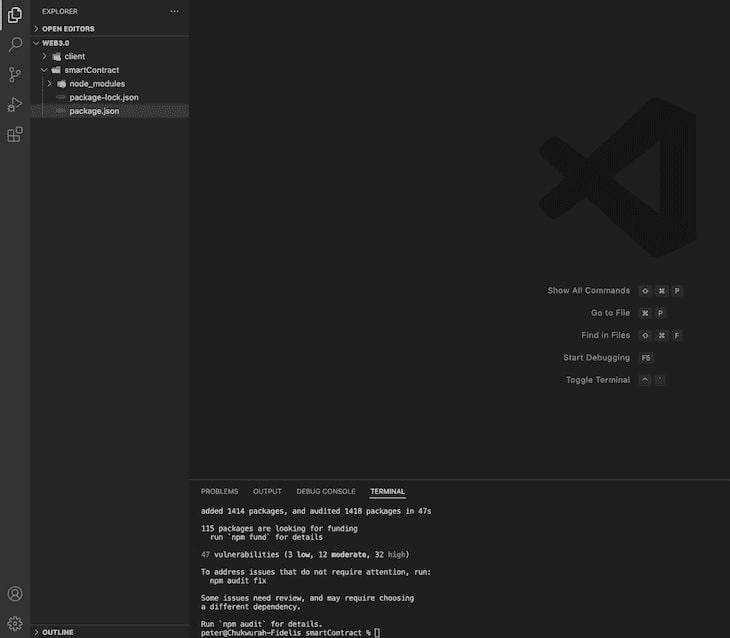

运行下面的命令:

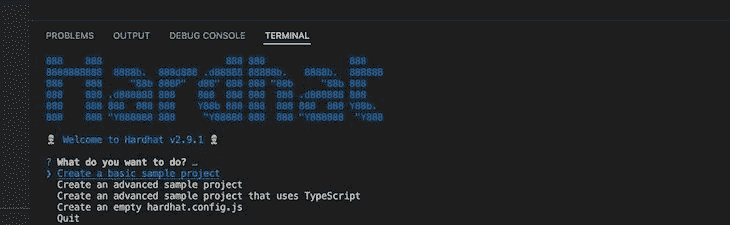

```
npx hardhat

```

点击**进入**按钮，创建一个基本的样本项目，并在提示时点击 **`y`** 添加一个`.gitignore`:

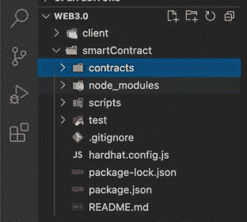

我们可以看到，我们有一个包含`Greeter.sol`和`test`文件夹的`contract`文件夹。为了确保一切正常，我们传递以下命令:

接下来，让我们从我们的 VS 代码编辑器中搜索 Solidity 扩展，并将其安装在我们的编辑器中，以帮助提供一些语法和自动完成功能:

```
npx hardhat test

```

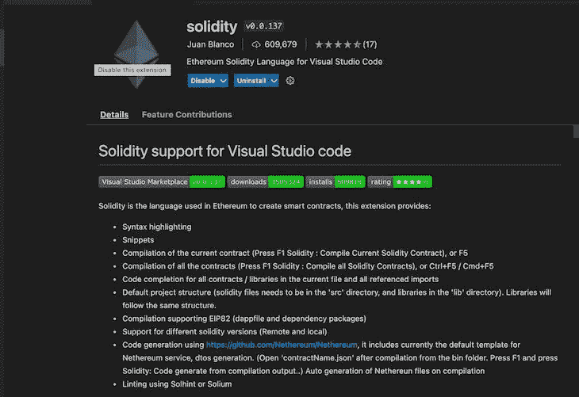

用 Solidity 在以太网上书写我们的智能合约

## 我们将删除由 Hardhat 默认创建的`Greeter.sol`契约。之后，我们可以通过创建一个新文件并将其重命名为`Transactions.sol`来创建我们自己的契约。`.sol`后缀代表稳固。Solidity 编程语言是 Java、JavaScript、Rust 和 C++等几种语言的组合。

接下来，我们将按照下面的代码片段选择我们想要使用的 Solidity 版本。确保在版本上方的注释中包含`license`:

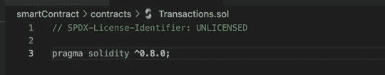

```
// SPDX-License-Identifier: UNLICENSED
pragma solidity ^0.8.0;

```

现在，我们可以创建我们的`contract`，给它一个与文件标题相同的名字，并在`Transaction`类中声明一个`integer`变量。我们将使用这个变量来保存我们的事务，并将这个变量命名为`transactionCounter`。

创建一个名为`Transfer`的`event`。这个`Transfer`事件就像一个函数，可以接受`address from`、`address receiver`、`amount`、`timestamp`等参数。完成的每项转让都需要具备以下特性:

为了保存我们的事务，我们可以定义一个类型为`TransferSystem`的事务数组。我们还将定义一些带有命名约定的函数来解释所执行的动作，比如`addToBlockchain`、`getAllTransactions`和`getTransactionCount`:

```
// SPDX-License-Identifier: UNLICENSED
pragma solidity ^0.8.0;
contract Transactions {
    uint256 transactionCounter;
    event Transfer (address from, address receiver, uint amount, string message, uint256 timestamp, string keyword);
    struct TransferSystem{
        address sender;
        address receiver;
        uint amount;
        string message;
        uint256 timestamp;
        string keyword;
    }
}

```

在我们的`addToBlockchain`函数中，我们将把`transactionCount`加 1，推送我们的参数，然后发出它们:

```
  TransferSystem [] transactions;

    function addToBlockchain(address payable receiver, uint amount, string memory message, string memory keyword) public{

    }
    function getAllTransactions() public view returns (TransferSystem[] memory){
    }
    function getTransactionCount() public view returns (uint256){
    }

```

在我们的`getAllTransactions`函数中，我们将返回`transactions`:

```
function addToBlockchain(address payable receiver, uint amount, string memory message, string memory keyword) public{
        transactionCount +=1;
        transactions.push(TransferSystem(msg.sender, receiver, amount, message, block.timestamp, keyword));
        emit Transfer(msg.sender, receiver, amount, message, block.timestamp, keyword);
    }

```

在我们的`getTransactionsCount`函数中，我们将返回`transactionCount`:

```
function getAllTransactions() public view returns (TransferSystem[] memory){
        return transactions;
    }

```

至此，我们完成了以太坊智能合约。

```
function getTransactionCount() public view returns (uint256){
        return transactionCount;
    }

```

部署我们的 Web3 应用

## 要部署我们的智能契约，请在 VS 代码编辑器上转到`script`，点击 **`sample-script.js`** ，并将其重命名为`deploy.js`。我们将通过创建一个有助于部署事务的`main`函数来编辑这个文件。我们还会将默认的`Greeter`常量更改为`Transaction`:

上面的代码片段有助于在区块链钱包上部署我们的交易。但要做到这一点，我们需要有一些以太币或气体。气体指的是进行交易所需的乙醚馏分。可以访问 [Ropsten Testnet 龙头](https://faucet.egorfine.com/)获取测试以太坊。我们还需要提供我们的钱包地址。为此，我们需要[在我们的浏览器](https://chrome.google.com/webstore/detail/metamask/nkbihfbeogaeaoehlefnkodbefgpgknn/related)上设置一个元掩码扩展:

```
const main = async () => {
  const Transactions = await ethers.getContractFactory("Transactions");
  const transactions = await Transactions.deploy();
  await transactions.deployed();
  console.log("Transactions deployed to: ", transactions.address);
}
const runMain = async () => {
  try {
    await main();
    process.exit(0);
  } catch (error) {
    console.error(error);
    process.exit(1);
  }
}
runMain ();

```


现在，我们可以更改**显示测试网络**开关来启用以太坊主网上的测试网络:

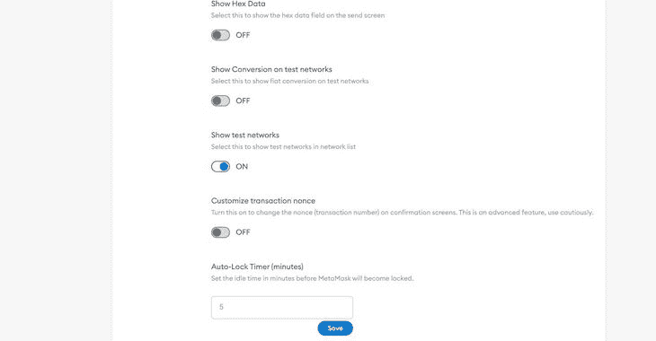

在右上角，我们可以将以太坊主网更改为 Ropsten 测试网络:

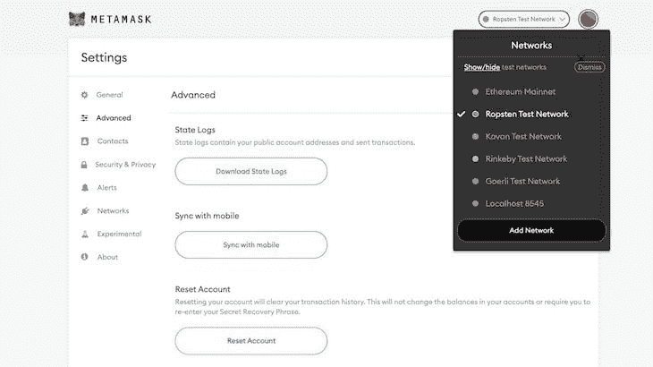

我们现在可以从帐户一复制我们的帐户地址，并将其粘贴到 Ropsten 测试水龙头:

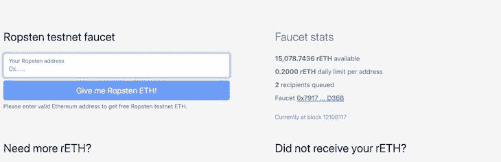

要部署我们的区块链，我们可以去[A](https://www.alchemy.com/)lchemy。请注意，我们在这里选择的网络是 Ropsten，这样我们就不用支付真正的以太坊燃气费了:


使用 Alchemy 成功创建账户后，点击右上角的**创建应用**，输入您喜欢的详细信息。接下来，点击**查看密钥**并复制 HTTP 密钥。

现在，我们可以使用`hardhat-waffles`作为插件，返回到我们的`hardhat.config.js`来测试我们的智能契约。我们应该编辑我们的`hardhat.config.js`,看起来像下面的代码:

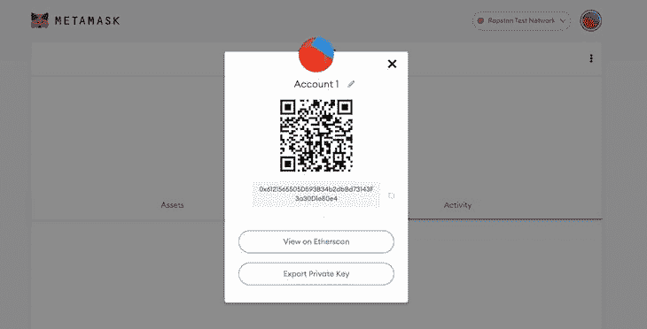

```
require('@nomiclabs/hardhat-waffle');
module.exports = {
  solidity : '0.8.0',
  networks : {
    ropsten:{
      url: `https://eth-ropsten.alchemyapi.io/v2/SFRRwFrEK3nQkYAis0Z0dBLjcWEHtztJ`,
      accounts: ['085164c615a0edb827a8ee5c1759b7c704bc519130841121ad07b21aff359929']
    } 
  }
}

```

在我们的`hardhat.config.js`文件夹中，我们将上面生成的私钥分配给我们的帐户，而 URL 是来自 Alchemy 的 HTTP。为了部署我们的应用程序，我们转到`terminal`并输入以下命令:

我们将得到一个生成的地址号码，如下图所示:

```
npx hardhat run scripts/deploy.js --network ropsten

```

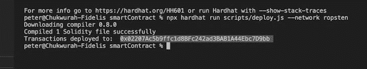

接下来，我们转到我们的`client folder`，右键单击`src`，创建一个名为`utils`的新文件夹。在我们的`util`文件夹中，我们可以创建一个名为`constant.js`的新文件，并输入使用下面的代码片段生成的地址:

头向`**smartContract**`→**→`artifact`**→**`Transactions.sol`**→**`Transactions.json`**→**`abi`**。ABI，意思是应用程序二进制接口，是以太坊系统上与智能合约交互的标准方式。

```
export const contractAddress= `0x02207Ac5b9ffc1d8BFc242ad3BAB1A44Ebc7D9bb`;

```

接下来，我们将复制`Transactions.json`上的所有内容，然后粘贴到我们将在`utils`文件夹中创建的新文件中。我们可以把这个新文件命名为`Transactions.json`。让我们使用下面的代码片段将它导入到我们的`constants.js`文件夹中:

接下来，我们将在我们的`src`文件夹中创建一个名为`context`的新文件夹，以及一个名为`TransactionContext.jsx`的文件，这将使我们能够在整个应用程序中使用 [React 上下文 API](https://blog.logrocket.com/react-context-api-deep-dive-examples/) :

```
import abi from `./Transactions.json`;
export const contractABI = abi.abi;
export const contractAddress = `0x02207Ac5b9ffc1d8BFc242ad3BAB1A44Ebc7D9bb`;

```

我们还将把我们的`TransactionContext`导入到我们的`main.jsx`文件中，如下面的代码片段所示:

```
import React, {useEffects, useState} from 'react';
import { ethers } from 'ethers';
import { contractABI, ContractABI, contractAddress } from '../util/constants';
export const TransactionContext = React.createContext();
const { ethereum } = window;
const getEthereumContract = () => {
    const provider = new ethers.provider.Web3Provider(ethereum);
    const signer = provider.getSigner();
    const transactionContract = new ethers.Contract(contractAddress, contractABI, signer);

    console.log({
        provider,
        signer,
        transactionContract
    });
}
export const transactionProvider = ( children ) => {
    return (
        <TransactionContext.Provider value={{value: 'test'}}>
            {children}
        </TransactionContext.Provider>
    );
}

```

我们对`TransactionContext.jsx`的代码片段做了一些修改，分享如下:

```
import React from 'react'
import ReactDOM from 'react-dom'
import './index.css'
import App from './App'
import TransactionContext from './context/TransactionContext'
ReactDOM.render(
  <TransactionProvider>

  <React.StrictMode>
    <App />
  </React.StrictMode>
  </TransactionProvider>,
  document.getElementById('root')
)

```

```
import React, {useEffect, useState} from 'react';
import { ethers } from 'ethers';
import { contractABI, contractAddress } from '../util/constants';
export const TransactionContext = React.createContext();
const { ethereum } = window;
const getEthereumContract = () => {
    const provider = new ethers.provider.Web3Provider(ethereum);
    const signer = provider.getSigner();
    const transactionContract = new ethers.Contract(contractAddress, contractABI, signer);

   return transactionContract;
}
export const TransactionProvider = ({children}) => {
     const [currentAccount, setCurrentAccount] = useState('');
     const [formData, setFormData] = useState({addressTo: '', amountTo: '', keyword: '', message: ''});
     const [isLoading, setIsLoading] = useState(false);
     const [transactionCount, setTransaction] = useState(localStorage.getItem('transactionCount'));
     const handleChange = (e, name) => {
         setFormData((prevState) => ({ ...prevState, [name]: e.target.value }));
     }
      const checkIfWalletIsConnected = async () => {

    try{
        if (!ethereum) return alert ("Please install metamask!");
        const accounts = await ethereum.request({ method: 'eth_accounts'});
        if(accounts.length){
            setCurrentAccount(accounts[0]);
        }
        else{
            console.log("No accout found!");
        }
        console.log(accounts);
      } catch(error) {

        throw new Error("No ethereum object...");
    }
  }    
      const connectWallet = async () => {
          try {
            if (!ethereum) return alert ("Please install metamask!");
            const accounts = await ethereum.request({ method: 'eth_requestAccounts'});
            setCurrentAccount(accounts[0]);
          } catch (error) {
              console.log(error);
              throw new Error("No ethereum object...");
          }
      }
      const sendTransaction = async () => {
          try {
            if (!ethereum) return alert ("Please install metamask!");
            const {addressTo, amount, keyword, message} = formData;
            const transactionContract = getEthereumContract();
            const parsedAmount = ethers.utils.parsedEther(amount);
            await ethereum.request({ 
                method: 'eth_sendTransactions',
                params: [{
                from: currentAccount,
                to: addressTo, 
                gas: '0x5208',
                vaue: parsedAmount._hex,    
                }]
            });
           const transactionHash = await transactionContract.addToBlockchain(addressTo,parsedAmount,message,keyword);

           setIsLoading(true);
           console.log(`Loading - ${transactionHash.hash}`);
           await transactionHash.wait();
           setIsLoading(false);
           console.log(`Success - ${transactionHash.hash}`);
           const transactionCount = await transactionContract.getTransactionCount();
           setTransactionCount(transactionCount.toNumber());
          } catch (error) {
            console.log(error);
            throw new Error("No ethereum object...");
          }
      }
     useEffect(()=> {
        checkIfWalletIsConnected();
     },[]);
    return (
        <TransactionContext.Provider value={{connectWallet, currentAccount,formData,setFormData,handleChange, sendTransaction}}>
            {children}
        </TransactionContext.Provider>
    );
   }

```

下面的代码显示了对`Welcome.jsx`组件所做的所有进一步的更改:

现在，让我们继续测试我们的应用程序。

```
import { AiFillAlipayCircle } from "react-icons/ai";
import { SiEthereum } from "react-icons/si";
import { BsInfoCircle }  from "react-icons/bs";
import { TransactionContext } from "../context/TransactionContext";
import React, { useContext } from 'react';
import { Loader } from './';
const Input = ({placeholder, name, type, value, handleChange}) => (
    <input
    placeholder={placeholder}
    type={type}
    step= "0.0001"
    value={value}
    onChange={(e)=>handleChange(e,name)}
    className= "my-2 w-full rounded-sm p-2 outline-none bg-transparent text-white border-none text-sm white-glassmorphism"
    />
);
const commonStyles = () => 'min-h-[70px] sm:px-0 px-2 sm:min-w-[120px] flex justify-center items-center border-[0.5px] border-gray-400 text-sm font-light text-white';
const Welcome = () => {
    const { connectWallet, currentAccount, formData, sendTransaction, handleChange } = useContext(TransactionContext);
    const handleSubmit = (e) => {
        const {addressTo, amount, keyword, message} = formData;

        e.preventDefault();
        if(!addressTo || !amount ||  !keyword || !message) return;
        sendTransaction();
    }
    return (
        <div className="flex w-full justify-center items-center">
            <div className="flex mf:flex-row flex-col items-start justify-between md:p-20 py-12 px-4">
                <div className="flex flex-1 justify-start flex-col mf:mr-10">
                    <h1 className="text-3xl sm:text-5xl text-white text-gradient py-1"> 
                        Blockchain and Crypto Transactions<br /> across the world
                    </h1>
                    <p className="text-left mt-5 text-white font-light md:w-9/12 w-11/12 text-base">
                        Explore the Crypto world. Buy and sell cryptocurrencies easily on our crypto wallet
                    </p>
                    {!currentAccount && (<button type="button" onClick={connectWallet} className="flex flex-row justify-center items-center my-5 bg-[#2952e3] p-3 rounded-full cursor-pointer">

                        <p className= "text-white text-base font-semibold">Connect Wallet</p> 
                    </button>)}
                      <div className="grid sm:grid-cols-3 grid-cols-2 w-full mt-10">
                        <div className={`rounded-tl-2xl ${commonStyles} text-white`}>
                           Reliability
                        </div>
                       <div className={`rounded-th-2xl ${commonStyles} text-white`}>
                           Security
                        </div>
                       <div className={`rounded-tr-2xl ${commonStyles} text-white`}>
                           Ethereum
                       </div>
                       <div className={`rounded-bl-2xl ${commonStyles} text-white`}>
                           Web 3.0
                        </div>
                       <div className={`rounded-bh-2xl ${commonStyles} text-white`}>
                           Low fees
                        </div>
                       <div className={`rounded-br-2xl ${commonStyles} text-white`}>
                           Blockchain
                        </div>
                     </div>
                </div>
                <div className="flex flex-col flex-1 items-center justify-start w-full mf:mt-0 mt-10">
                    <div className="p-3 justify-end items-start flex-col rounded-xl h-40 sm:w-72 w-full my-5 eth-card white-glassmorphism">
                        <div className="flex justify-between flex-col w-full h-full">
                            <div className="flex justify-between items-start">
                                <div className="w-10 h-10 rounded-full border-2 border-white flex justify-center items-center">
                                    <SiEthereum fontSize={21} color="#fff" />
                                </div>
                                <BsInfoCircle fontSize={17} color="#fff"/>
                                </div>
                                <div>
                                <p className="text-white font-light text-sm">
                                 Address (0Xapdpqdf.......fdsb)
                                </p>
                                <p className="text-white font-light text-white font-semibold text-lg mt-1">
                                    ETHEREUM
                                </p>
                             </div>
                            </div>
                        </div>
                        <div className="p-5 sm:w-96 flex-full flex flex-col justify-start items-center blue-glassmorphism">

                            <Input placeholder= "Address To" name = "addressTo" type="text" handleChange={handleChange} />
                            <Input placeholder= "Amount (ETH)" name = "amount" type="number" handleChange={handleChange} />
                            <Input placeholder= "Keyword (gif)" name = "keyword" type="text" handleChange={handleChange} />
                            <Input placeholder= "Enter Message" name = "message" type="text" handleChange={handleChange} />
                            <div className="h-[1px] w-full bg-gray-400 my-2" />
                            {false ?(
                                <Loader />
                            ): (
                                <button
                                type="button"
                                onClick={handleSubmit}
                                className="text-white w-full mt-2 border-[1px] p-2 border-[#3d4f7c] rounded-full cursor-pointer">
                                    Send Now
                                </button>
                            )}
                        </div>
                </div>
            </div>
        </div>
    );
}
export default Welcome;

```

测试我们的 Web3 应用程序

## 为了测试我们的应用程序，我们可以打开 Metamask 来创建一个新帐户，这样我们就可以生成一个不同的地址来汇款:

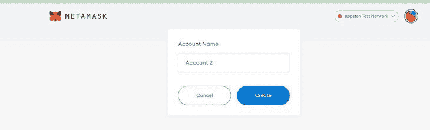

成功创建第二个帐户后，我们可以复制并粘贴我们浏览器页面上的`addressTo`中的地址，选择您要发送的以太坊金额，传入任何关键字或消息，然后单击**立即发送**按钮:

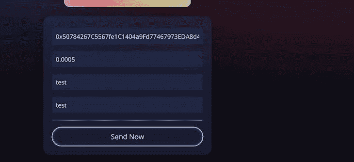

请记住，重启应用程序后，我们需要单击 **connect wallet** 按钮再次连接到 Metamask。在继续完成交易之前，请执行以下操作:

你也可以在 YouTube 上查看[完成的项目。](https://www.youtube.com/shorts/-G1GHClgGPs)

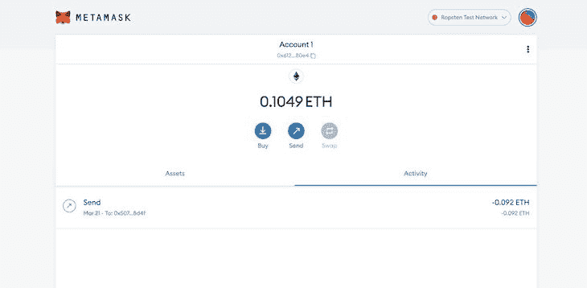

Send Ether

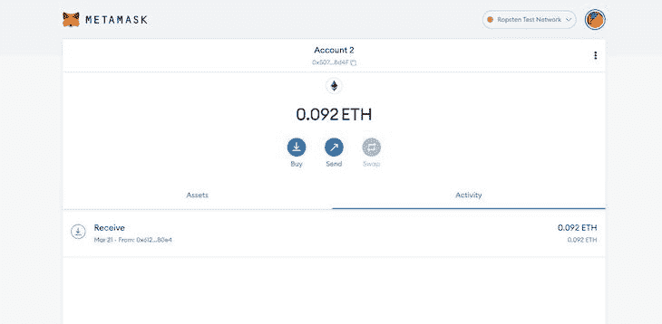

Receive Ether

结论

## 在本文中，我们成功地从头开始构建了一个 Web3 应用程序。在深入使用 Solidity 编程语言构建我们的应用程序之前，我们首先介绍了 Web3 技术。然后，我们测试了我们的应用程序并执行了区块链事务。

在这篇文章中，我们观察到了 Solidity 和 JavaScript 在开发智能契约中的巨大作用。我们使用 React 来开发智能合约的前端，包括几个组件，如`Loader`、`welcome`等等，同时我们使用 Solidity 来构建我们的智能合约。您可以按照本文概述的步骤在以太坊网络上构建您的第一个智能合约。

我希望这篇文章对你有用。请分享您对如何改进 Web3 的看法，如果您有任何问题或疑虑，请留下您的评论。我期待着看到你的项目。编码快乐！

加入像 Bitso 和 Coinsquare 这样的组织，他们使用 LogRocket 主动监控他们的 Web3 应用

## 影响用户在您的应用中激活和交易的能力的客户端问题会极大地影响您的底线。如果您对监控 UX 问题、自动显示 JavaScript 错误、跟踪缓慢的网络请求和组件加载时间感兴趣，

.

[try LogRocket](https://lp.logrocket.com/blg/web3-signup)

LogRocket 就像是网络和移动应用的 DVR，记录你的网络应用或网站上发生的一切。您可以汇总和报告关键的前端性能指标，重放用户会话和应用程序状态，记录网络请求，并自动显示所有错误，而不是猜测问题发生的原因。

[](https://lp.logrocket.com/blg/web3-signup)[https://logrocket.com/signup/](https://lp.logrocket.com/blg/web3-signup)

现代化您调试 web 和移动应用的方式— [开始免费监控](https://lp.logrocket.com/blg/web3-signup)。

Modernize how you debug web and mobile apps — [Start monitoring for free](https://lp.logrocket.com/blg/web3-signup).