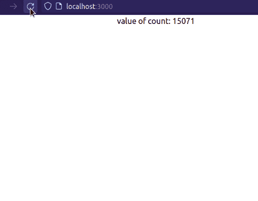
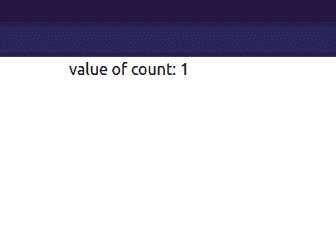
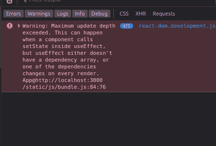
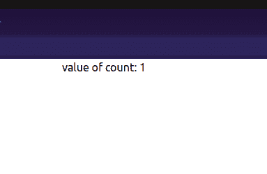
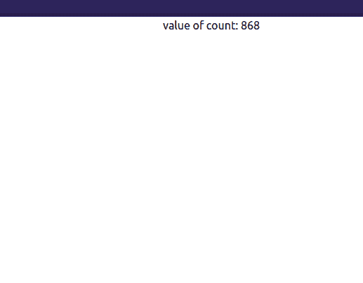
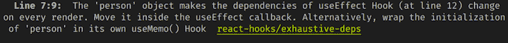
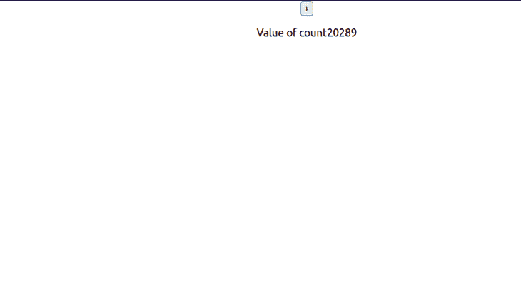
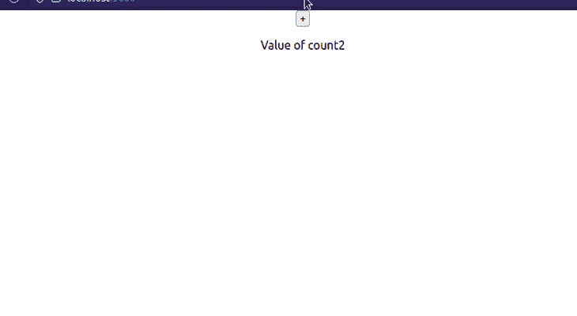
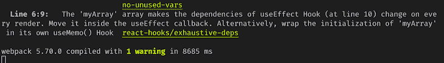

# 如何解决 React useEffect 钩子的无限循环模式

> 原文：<https://blog.logrocket.com/solve-react-useeffect-hook-infinite-loop-patterns/>

React 的`useEffect`钩子让用户可以处理应用程序的副作用。一些例子可以是:

*   [从网络获取数据](https://blog.logrocket.com/data-fetching-react-native/):通常，应用程序在第一次挂载时获取并填充数据。这可以通过`useEffect`功能实现
*   操作 UI:应用程序应该响应一个按钮点击事件(例如，打开一个菜单)
*   设置或结束定时器:如果某个变量达到一个预定义的值，一个内置的定时器应该停止或启动自己

尽管`useEffect`钩子的[用法在 React 生态系统中很常见，但掌握它需要时间。正因为如此，许多新手开发人员配置他们的`useEffect`函数的方式会导致无限循环问题。在本文中，您将了解臭名昭著的无限循环以及如何解决它。](https://blog.logrocket.com/guide-to-react-useeffect-hook/)

这就是我们今天要学习的内容:

我们开始吧！

## 什么导致无限循环以及如何解决它们

### 在依赖项数组中不传递依赖项

如果您的`useEffect`函数不包含任何依赖项，将会出现无限循环。

例如，看看下面的代码:

```
function App() {
  const [count, setCount] = useState(0); //initial value of this 
  useEffect(() => {
    setCount((count) => count + 1); //increment this Hook
  }); //no dependency array.
  return (
    <div className="App">
      <p> value of count: {count} </p>
    </div>
  );
}

```

`useEffect`如果没有依赖关系，默认情况下在每个更新周期触发。因此，这里的应用程序将在每次渲染时执行`setCount`函数。因此，这导致了一个无限循环:



#### 是什么导致了这个问题？

让我们一步一步地分解我们的问题:

1.  在第一次渲染时，React 检查`count`的值。这里，由于`count`是`0`，程序执行`useEffect`功能
2.  稍后，`useEffect`调用`setCount`方法并更新`count`钩子的值
3.  之后，React 重新渲染 UI 以显示`count`的更新值
4.  此外，由于`useEffect`在每个渲染周期运行，它会重新调用`setCount`函数
5.  由于上述步骤会在每次渲染时发生，这会导致应用程序崩溃

#### 如何解决这个问题

为了缓解这个问题，我们必须使用一个依赖数组。这告诉 React 仅在特定值更新时调用`useEffect`。

下一步，追加一个空白数组作为依赖项，如下所示:

```
useEffect(() => {
  setCount((count) => count + 1);
}, []); //empty array as second argument.

```

这告诉 React 在第一次挂载时执行`setCount`函数。



### 将函数用作依赖项

如果您将一个方法传递到您的`useEffect`依赖数组中，React 将抛出一个错误，表明您有一个无限循环:

```
function App() {
  const [count, setCount] = useState(0);

  function logResult() {
    return 2 + 2;
  }
  useEffect(() => {
    setCount((count) => count + 1);
  }, [logResult]); //set our function as dependency
  return (
    <div className="App">
      <p> value of count: {count} </p> {/*Display the value of count*/}
    </div>
  );
}

```

在这个代码片段中，我们将我们的`logResult`方法传递给了`useEffect`数组。理论上，React 只需要在第一次渲染时增加`count`的值。



#### 是什么导致了这个问题？

1.  需要记住的一点是，`useEffect`使用了一个叫做[浅层比较](https://learntechsystems.com/what-is-shallow-comparison-in-js/)的概念。这样做是为了验证依赖关系是否已经更新
2.  这里的问题是在每次渲染的时候，React 重新定义了`logResult`的引用
3.  因此，这将在每个周期重新触发`useEffect`功能
4.  因此，React 调用`setCount`钩子，直到你的应用遇到一个**更新深度**错误。这会给你的程序带来错误和不稳定性

#### 如何解决这个问题

解决这个问题的一个方法是使用`useCallback`钩子。这允许开发者[记忆他们的函数](https://blog.logrocket.com/rethinking-hooks-memoization/)，确保参考值保持不变。由于稳定的参考值，React 不应该无限地重新呈现 UI:

```
const logResult = useCallback(() => {
  return 2 + 2;
}, []); //logResult is memoized now.
useEffect(()=> {
  setCount((count)=> count+1);
},[logResult]); //no infinite loop error, since logResult reference stays the same.

```

这将是结果:



### 将数组用作依赖项

将数组变量传递给依赖项也会运行无限循环。考虑以下代码示例:

```
const [count, setCount] = useState(0); //iniital value will be 0.
const myArray = ["one", "two", "three"];

useEffect(() => {
  setCount((count) => count + 1); //just like before, increment the value of Count
}, [myArray]); //passing array variable into dependencies

```

在这个块中，我们将变量`myArray`传递给依赖参数。



#### 是什么导致了这个问题？

既然`myArray`的值在整个程序中不会改变，为什么我们的代码会多次触发`useEffect`？

1.  在这里，回想一下 React 使用浅层比较来检查依赖项的引用是否已经更改。
2.  由于对`myArray`的引用在每次渲染时都会不断变化，`useEffect`将触发`setCount`回调
3.  因此，由于`myArray's`参考值不稳定，React 将在每个渲染周期调用`useEffect`。最终，这会导致您的应用程序崩溃

#### 如何解决这个问题

为了解决这个问题，我们可以使用一个`[useRef](https://www.react.express/hooks/useref)`钩子。这将返回一个可变对象，确保引用不会改变:

```
const [count, setCount] = useState(0);
//extract the 'current' property and assign it a value
const { current: myArray } = useRef(["one", "two", "three"]);

useEffect(() => {
  setCount((count) => count + 1);
}, [myArray]); //the reference value is stable, so no infinite loop

```

### 将对象作为依赖项传递

在`useEffect`依赖数组中使用一个对象也会导致无限循环问题。

考虑以下代码:

```
const [count, setCount] = useState(0);
const person = { name: "Rue", age: 17 }; //create an object
useEffect(() => {
  //increment the value of count every time
  //the value of 'person' changes
  setCount((count) => count + 1);
}, [person]); //dependency array contains an object as an argument
return (
  <div className="App">
    <p> Value of {count} </p>
  </div>
);

```

控制台中的结果表明程序无限循环:



#### 是什么导致了这个问题？

1.  和之前一样，React 使用浅层比较来检查`person`的参考值是否有变化
2.  由于`person`对象的参考值在每次渲染时都会改变，React 会重新运行`useEffect`
3.  因此，这将在每个更新周期调用`setCount`。这意味着我们现在有一个无限循环

#### 如何解决这个问题

那么我们如何摆脱这个问题呢？

这就是`useMemo`的用武之地。当依赖关系改变时，这个钩子将计算一个记忆值。除此之外，由于我们有一个记忆化的变量，这确保了状态的参考值在每次渲染期间不会改变:

```
//create an object with useMemo
const person = useMemo(
  () => ({ name: "Rue", age: 17 }),
  [] //no dependencies so the value doesn't change
);
useEffect(() => {
  setCount((count) => count + 1);
}, [person]);

```

### 传递不正确的依赖关系

如果将错误的变量传递给`useEffect`函数，React 将抛出一个错误。

下面是一个简单的例子:

```
const [count, setCount] = useState(0);

useEffect(() => {
  setCount((count) => count + 1);
}, [count]); //notice that we passed count to this array.

return (
  <div className="App">
    <button onClick={() => setCount((count) => count + 1)}>+</button>
    <p> Value of count{count} </p>
  </div>
);

```



#### 是什么导致了这个问题？

1.  在上面的代码中，我们告诉在`useEffect`方法中更新`count`的值
2.  此外，注意我们也将`count`钩子传递给了它的依赖数组
3.  这意味着每次`count`的值更新时，React 都会调用`useEffect`
4.  结果，`useEffect`钩子调用`setCount`，从而再次更新`count`
5.  因此，React 现在正在无限循环中运行我们的函数

#### 如何解决这个问题

要摆脱无限循环，只需使用一个空的依赖数组，如下所示:

```
const [count, setCount] = useState(0);
//only update the value of 'count' when component is first mounted
useEffect(() => {
  setCount((count) => count + 1);
}, []);

```

这将告诉 React 在第一次渲染时运行`useEffect`。



## 结论

尽管 React 挂钩是一个简单的概念，但是在将它们合并到您的项目中时，有许多规则需要记住。这将确保您的应用程序保持稳定、优化，并且在生产过程中不会出现错误。

此外， [Create React App](https://create-react-app.dev/) CLI 的最新版本也在运行时检测并报告无限循环错误。这有助于开发人员在这些问题进入生产服务器之前发现并减轻它们。



非常感谢您的阅读！编码快乐！

## 使用 LogRocket 消除传统反应错误报告的噪音

[LogRocket](https://lp.logrocket.com/blg/react-signup-issue-free)

是一款 React analytics 解决方案，可保护您免受数百个误报错误警报的影响，只针对少数真正重要的项目。LogRocket 告诉您 React 应用程序中实际影响用户的最具影响力的 bug 和 UX 问题。

[ ](https://lp.logrocket.com/blg/react-signup-general) [  ](https://lp.logrocket.com/blg/react-signup-general) [LogRocket](https://lp.logrocket.com/blg/react-signup-issue-free)

自动聚合客户端错误、反应错误边界、还原状态、缓慢的组件加载时间、JS 异常、前端性能指标和用户交互。然后，LogRocket 使用机器学习来通知您影响大多数用户的最具影响力的问题，并提供您修复它所需的上下文。

关注重要的 React bug—[今天就试试 LogRocket】。](https://lp.logrocket.com/blg/react-signup-issue-free)