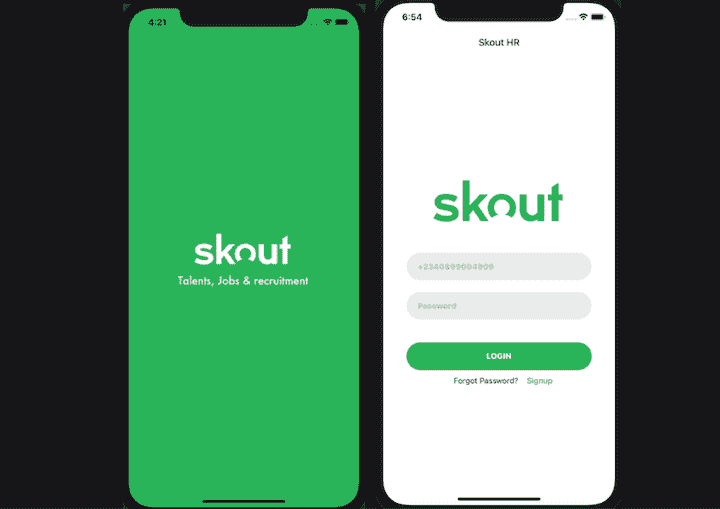
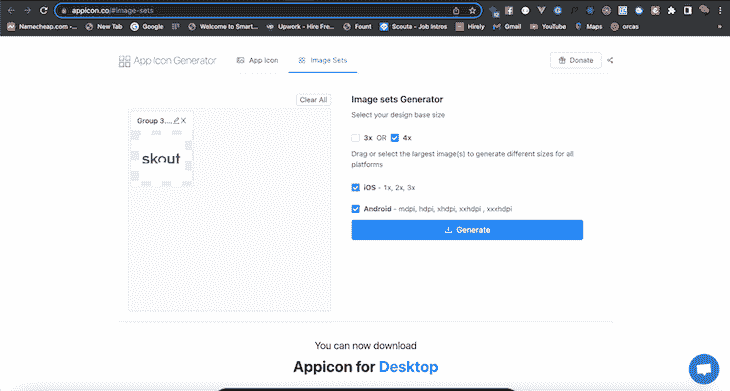
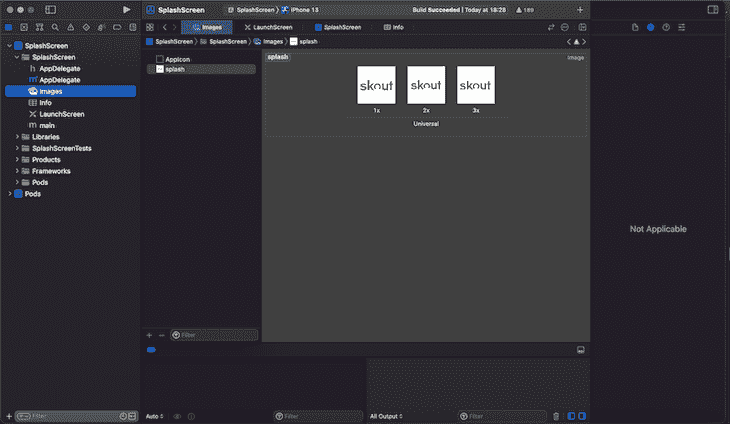
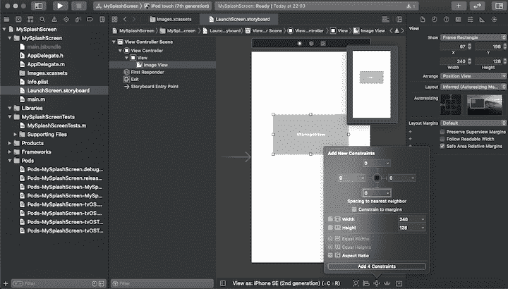
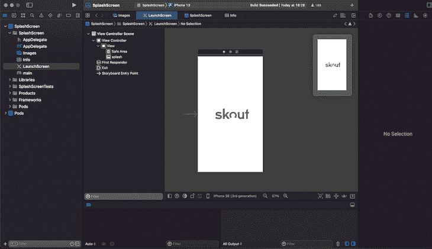
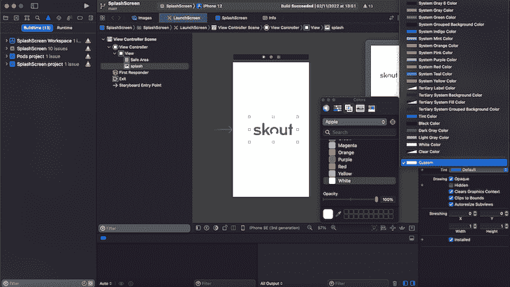
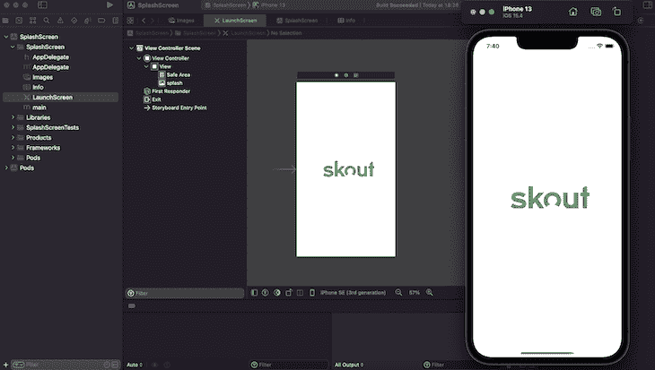
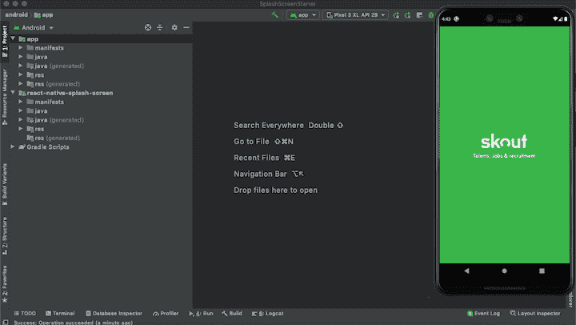
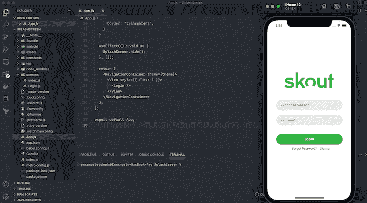

# 在 React Native - LogRocket 博客中构建闪屏

> 原文：<https://blog.logrocket.com/splash-screen-react-native/>

***编者按**:这个闪屏 React 原生教程最后一次更新是在 2022 年 11 月 9 日，包含了如何在 iOS 和 Android 应用中更改闪屏背景颜色等信息。*

在本教程中，我们将演示如何在 React Native 中构建和显示闪屏。我们将带你了解如何使用 [`react-native-splash-screen`](https://github.com/crazycodeboy/react-native-splash-screen) 为 iOS 和 Android 应用程序创建令人惊叹的欢迎显示。

以下是我们将要介绍的内容:

## 什么是闪屏？

闪屏是用户访问应用程序其余功能之前出现的第一个屏幕。闪屏可以说是让你的移动应用的品牌名称和图标留在用户潜意识中的最好方式。

在 web 应用程序中，我们使用预加载器来通知动画，以便在服务器操作被处理的同时让用户娱乐。这听起来很简单，但它是建立和保留用户群的重要工具。

在 React Native 中创建闪屏有很多好处。例如，假设您正在从一个 API 预加载数据。当用户等待的时候，你想要显示一个加载器；在应用程序启动时显示加载器有助于在用户等待应用程序初始化时向他们展示一个有组织的、设计良好的显示。

## 反应本机闪屏示例

对于这个`react-native-splash-screen`演示，我们将为 Android 和 iOS 构建一个闪屏。本教程将带您了解如何准备正确的图像大小，更新必要的文件，并隐藏应用程序加载时的闪屏。完成后的应用程序将看起来像下面的截图:



要按照 React 本机闪屏教程进行操作，您应该具备:

*   熟悉 CSS、HTML 和 JavaScript (ES6)
*   Node.js 和 Watchman 安装在您的开发机器上
*   用于测试的 iOS 模拟器或 Android 模拟器
*   安装在开发机器上的代码编辑器(例如 VS Code)
*   对 React/React Native 的基本理解

我们开始吧！

## 为什么图像尺寸对闪屏很重要

为移动应用程序创建闪屏有点棘手，你不希望由于闪屏分辨率的不一致而在某些设备上出现显示问题。例如，Android 设备的要求与 iOS 完全不同。大多数有经验的设计师可以从头开始为这两款设备创建所需的闪屏分辨率。

然而，有很多可用的第三方工具可以帮助你为 Android 和 iOS 创建闪屏。在本教程中，我们将使用[应用图标生成器](https://appicon.co/)，这是一个为 Android 和 iOS 应用创建图标和图像的在线平台。

在继续之前，请确保您已经准备好一张 2000 x 2000 像素(72 PPI)的高清图像。你可以在 [GitHub](https://github.com/emmanueletukudo/react-native-splash-screen.git) 上克隆这些教程的完整源代码。

## 构建 React 本机闪屏

首先，前往[应用图标](https://appicon.co/#image-sets)。在提供的框上拖动您的图像，选择 4x 作为您的基本大小，选择 iOS 和 Android，然后单击生成。根据您的互联网速度，此过程大约需要两分钟完成:



接下来，提取下载的文件，并将 iOS 和 Android 文件夹复制到 assets 文件夹，该文件夹位于您克隆的 starter 项目的 **assets** 目录中:


在 React Native 中构建闪屏需要一些微调。首先，请遵循以下步骤。

在您的`terminal`(在 mac 上)或`command prompt`(在 Windows 上)中运行每个命令:

*   `npm i`安装启动文件中包含的所有依赖项。
*   `npm i` `react-native-splash-screen --save`安装`RNSplashscreen`包
*   `cd`进入 iOS 目录，运行`pod install` 链接所有依赖项。

导航回项目的根目录。

### 在 React Native 中为 iOS 构建闪屏

导航到`iOS` > `SplashScreen`，打开`AppDelegate.m`并添加代码`#import "RNSplashScreen"`(在第 6 行)并将闪屏设置为默认显示`RNSplashScreen show`(第 41 行)参见下面代码中的注释以供参考:

```
#import "AppDelegate.h"
#import <React/RCTBridge.h>
#import <React/RCTBundleURLProvider.h>
#import <React/RCTRootView.h>
// Import RNSplashScreen
#import "RNSplashScreen.h"
#ifdef FB_SONARKIT_ENABLED
#import <FlipperKit/FlipperClient.h>
#import <FlipperKitLayoutPlugin/FlipperKitLayoutPlugin.h>
#import <FlipperKitUserDefaultsPlugin/FKUserDefaultsPlugin.h>
#import <FlipperKitNetworkPlugin/FlipperKitNetworkPlugin.h>
#import <SKIOSNetworkPlugin/SKIOSNetworkAdapter.h>
#import <FlipperKitReactPlugin/FlipperKitReactPlugin.h>
static void InitializeFlipper(UIApplication *application) {
  FlipperClient *client = [FlipperClient sharedClient];
  SKDescriptorMapper *layoutDescriptorMapper = [[SKDescriptorMapper alloc] initWithDefaults];
  [client addPlugin:[[FlipperKitLayoutPlugin alloc] initWithRootNode:application withDescriptorMapper:layoutDescriptorMapper]];
  [client addPlugin:[[FKUserDefaultsPlugin alloc] initWithSuiteName:nil]];
  [client addPlugin:[FlipperKitReactPlugin new]];
  [client addPlugin:[[FlipperKitNetworkPlugin alloc] initWithNetworkAdapter:[SKIOSNetworkAdapter new]]];
  [client start];
}
#endif
@implementation AppDelegate
- (BOOL)application:(UIApplication *)application didFinishLaunchingWithOptions:(NSDictionary *)launchOptions
{
#ifdef FB_SONARKIT_ENABLED
  InitializeFlipper(application);
#endif
  RCTBridge *bridge = [[RCTBridge alloc] initWithDelegate:self launchOptions:launchOptions];
  RCTRootView *rootView = [[RCTRootView alloc] initWithBridge:bridge
                                                   moduleName:@"MySplashScreen"
                                            initialProperties:nil];
  rootView.backgroundColor = [[UIColor alloc] initWithRed:1.0f green:1.0f blue:1.0f alpha:1];
  self.window = [[UIWindow alloc] initWithFrame:[UIScreen mainScreen].bounds];
  UIViewController *rootViewController = [UIViewController new];
  rootViewController.view = rootView;
  self.window.rootViewController = rootViewController;
  [self.window makeKeyAndVisible];
  // Set the splash screen to show by default.
  [RNSplashScreen show]; 
  return YES;
}
- (NSURL *)sourceURLForBridge:(RCTBridge *)bridge
{
#if DEBUG
  return [[RCTBundleURLProvider sharedSettings] jsBundleURLForBundleRoot:@"index" fallbackResource:nil];
#else
  return [[NSBundle mainBundle] URLForResource:@"main" withExtension:@"jsbundle"];
#endif
}
@end

```

这里，我们对`AppDeligate`文件做了两个重要的修改。首先，我们将之前安装的`RNSplashScreen`导入到`AppDeligate.m`中。接下来，我们将`RNSplashScreen`设置为默认显示代码`[RNSplashScreen show]`。

接下来，在`Xcode`中打开项目工作区，点击`images`，在`Appicon`下面的任意位置点击右键，选择`New Image Set`。将图像名称设置为`splash`，打开资产文件夹，并导航至`iOS`文件夹。将`iOS`中的三幅图像拖到`Xcode`上三个名为`1x`、`2x`和`3x`的方框上:



接下来，选择`LaunchScreen.storyboard`。选择**视图**控制器场景>视图控制器>视图，选择`SplashScreen`和`Powered by React Native`标签，按键盘上的 DELETE 键。

接下来，选择**视图**，点击`Xcode`右上角的标尺图标。取消**安全区域布局指南**选项，点击加号图标 **+** ，在对象搜索输入栏中输入**图像视图**，然后将**图像视图**拖动到**视图**画布上:



现在我们已经设置了图像视图，单击图像属性图标，将图像更改为 **splash** 。将**内容模式**设置为**方面适合**，如下图所示:



### 更改 iOS 的闪屏背景颜色

你可能会问的下一个问题是“如何在 React Native 中更改闪屏背景色？”为了在 iOS 中强制启动画面的背景一致，向下滚动到背景所在的位置，并从下拉列表中选择**自定义**。在弹出窗口中，选择闪屏所需的颜色。在本例中，我们选择了白色:



要确认您的应用程序可以成功运行，请从`Xcode`开始运行构建。您应该会看到类似这样的内容:



### 为 Android 构建闪屏

现在让我们演示如何在 React Native 中为 Android 构建闪屏。

导航到**安卓**>**A****PP**>**src**>**主文件夹**并打开`MainActivity.java`。用下面的代码更新`MainActivity.java`以使用`react-native-splash-screen`:

```
package com.mysplashscreen;
import android.os.Bundle; // here
import com.facebook.react.ReactActivity;
import org.devio.rn.splashscreen.SplashScreen; // here
public class MainActivity extends ReactActivity {
  /**
   * Returns the name of the main component registered from JavaScript. This is used to schedule
   * rendering of the component.
   */
  @Override
  protected String getMainComponentName() {
    return "MySplashScreen";
  }

  @Override
    protected void onCreate(Bundle savedInstanceState) {
        SplashScreen.show(this);  // here
        super.onCreate(savedInstanceState);
    }
}

```

接下来，在`app/src/main/res/layout`中创建一个名为`launch_screen.xml`的文件(如果不存在，创建`layout`文件夹)。然后，将下面的代码添加到`launch_screen.xml`:

```
<?xml version="1.0" encoding="utf-8"?>
<RelativeLayout xmlns:android="http://schemas.android.com/apk/res/android"
    android:orientation="vertical" android:layout_width="match_parent"
    android:layout_height="match_parent">
    <ImageView android:layout_width="match_parent" android:layout_height="match_parent" android:src="@drawable/launch_screen" android:scaleType="centerCrop" />
</RelativeLayout>

```

注意:`android:src="@drawable/launch_screen"`相当于 HTML 中的``,所以一定要用从`Appicon`生成的图像的实际名称替换`launch_screen`。

### 为 Android 更改闪屏背景颜色

和 iOS 应用一样，你也需要知道如何改变 Android 应用的闪屏背景颜色。

首先，将`Android`的所有资产复制到`res`文件夹中。然后，在 values 文件夹中创建`colors.xml`，并在`app/src/main/res/values/colors.xml`中添加一个名为`primary_dark`的颜色:

```
<?xml version="1.0" encoding="utf-8"?>
<resources>
    <color name="primary_dark">#000000</color>
</resources>

```

打开`Android Studio`中的`Android`文件夹，打开`AVD`，运行您的应用程序，如下所示。如果一切设置正确，您应该会看到类似于以下屏幕截图的结果:



## 应用程序加载后隐藏闪屏

要在应用程序加载时隐藏闪屏，你需要做两件事:

1.  将`react-native-splash-screen`包导入 React 本地应用的根组件(`App.js`)
2.  使用`useEffect()`隐藏闪屏，代码如下:

```
/**
 * Sample React Native App
 * https://github.com/facebook/react-native
 *
 * @format
 * @flow strict-local
 */
import React, { useEffect } from 'react'; //import useEffect();
import { View } from 'react-native';
import { Login } from './screens';
import { NavigationContainer, DefaultTheme } from '@react-navigation/native';
import SplashScreen from "react-native-splash-screen"; //import SplashScreen
const App = () => {
  const theme = {
    ...DefaultTheme,
    colors: {
      ...DefaultTheme.colors,
      border: "transparent",
    }
  }
  useEffect(() => {
    SplashScreen.hide(); //hides the splash screen on app load.
  }, []);

  return (
    <NavigationContainer theme={theme}>
      <View style={{ flex: 1 }}>
        <Login />
      </View>
    </NavigationContainer>
  );
};
export default App;
```

如上所述，我使用 [`@react-navigation/native`](https://reactnative.dev/docs/navigation) 从一个屏幕导航到另一个屏幕。例如，登录后，您可能希望显示仪表板或主屏幕。`@react-navigation/native`是 React Native 的导航核心包之一。为了更深入的了解，请查看我们的[使用 React 导航的综合指南](https://blog.logrocket.com/a-complete-guide-to-react-navigation-5/)。

应用程序加载后，应用程序将显示`login`页面，这是索引屏幕。见下面截图供参考:



## 结论

几乎任何移动应用程序都需要闪屏。知道如何为跨平台应用程序构建闪屏是一项基本技能，可以帮助您在移动开发职业生涯中向前迈进一步。

## [LogRocket](https://lp.logrocket.com/blg/react-native-signup) :即时重现 React 原生应用中的问题。

[](https://lp.logrocket.com/blg/react-native-signup)

[LogRocket](https://lp.logrocket.com/blg/react-native-signup) 是一款 React 原生监控解决方案，可帮助您即时重现问题、确定 bug 的优先级并了解 React 原生应用的性能。

LogRocket 还可以向你展示用户是如何与你的应用程序互动的，从而帮助你提高转化率和产品使用率。LogRocket 的产品分析功能揭示了用户不完成特定流程或不采用新功能的原因。

开始主动监控您的 React 原生应用— [免费试用 LogRocket】。](https://lp.logrocket.com/blg/react-native-signup)